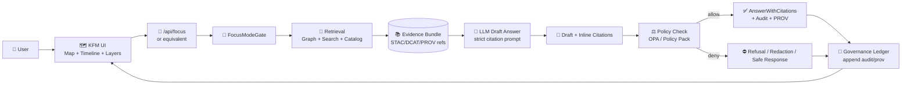

<!-- According to a document from 2026-01-22 -->

# 🧭🤖 Example 02 — Focus Mode Gate (Evidence‑First Q&A)

> **Focus Mode** is the Kansas Frontier Matrix (KFM) “ask in English” assistant — but **only** when it can stay **grounded, citable, policy‑compliant, and auditable**.  
> This example shows how to implement that behavior as an **MCP Gate**: **No citation → no claim ✅**

---

## 🎯 What this example is

This folder documents a **FocusModeGate** that sits between:

- the **UI / API** request (`question + map context + user context`)
- the **retrieval + generation** engine (graph/search/catalog + LLM)
- and the **final answer** delivered to the user

…so that every response is:

- **Evidence‑backed** (STAC/DCAT/PROV-linked sources)
- **Policy‑checked** (CI + runtime gates, OPA-ready)
- **Explainable** (audit payload suitable for an “audit panel”)
- **Logged** (governance ledger + PROV-style lineage)

---

## 🧩 Why a “Gate” for Focus Mode?

Focus Mode is intentionally **advisory‑only** — it should never “do things” without the user.  
So the Gate’s job is to **protect the system’s trust model**:

✅ Prevent hallucinated claims  
✅ Prevent leaking sensitive data (e.g., coordinates / restricted attributes)  
✅ Enforce FAIR+CARE + provenance-first rules  
✅ Make answers **inspectable** by humans (citations + audit trail)

> **Rule of thumb:** if we can’t prove it (with a source), we don’t say it.

---

## 🗺️ Where this fits in the KFM UX

Focus Mode is designed to feel like a **contextual guide** inside the KFM UI:

- You ask a question while viewing a region/time/layers
- The system uses *that* context for retrieval + summarization
- The UI shows:
  - citations (clickable)
  - “AI output” labeling
  - explainability fields (what influenced the answer, governance flags, etc.)

---

## 🧠 Conceptual Architecture



---

## ✅ What the FocusModeGate enforces

### Hard requirements (fail closed 🧱)

- **Citations required**  
  If the model can’t produce at least one valid source reference, the Gate returns a refusal.
- **No unsupported external knowledge**  
  Answers must be grounded in *ingested + cataloged* KFM evidence (graph/cat/search).
- **Sensitivity rules apply**  
  Restricted/sensitive fields are **redacted or generalized**.
- **Governance check must pass**  
  Runtime policy evaluation must return **allow** (or enforce a safe fallback).
- **Audit trail must be written**  
  The answer attempt is logged with sources used, time, and policy version.

### Soft requirements (warn / annotate 🟡)

- Confidence or uncertainty language if evidence is weak
- Explainability payload completeness (top evidence nodes, concept focus, etc.)
- UI hints (suggested layers/stories to open)

---

## 📦 Suggested folder layout (reference)

> You can adapt this to your existing `mcp/gates` scaffolding — the important part is the **contract + invariants**.

```text
mcp/
  gates/
    examples/
      02-focus-mode/
        README.md
        fixtures/ 🧪
          request.example.json
          response.example.json
          response.refusal.json
        policies/ ⚖️
          focus_mode.rego
          focus_mode_test.rego
        prompts/ 🗣️
          focus_mode.system.md
          focus_mode.answer_template.md
        src/ 🧱
          gate.ts (or gate.py)
          types.ts
          citations.ts
          redact.ts
          audit.ts
```

---

## 🧾 Gate Contract

### Input: `FocusModeRequest`

```json
{
  "question": "What is noteworthy about this county in the 1930s?",
  "user": {
    "id": "user-123",
    "role": "public",
    "permissions": ["read:public"]
  },
  "ui_context": {
    "bbox": [-97.6, 38.9, -96.9, 39.2],
    "time_range": { "start": "1930-01-01", "end": "1939-12-31" },
    "active_layers": ["drought_index", "population_1930"],
    "selected_feature_ids": ["county:ks:example"],
    "concept_focus": ["drought", "agriculture"]
  },
  "trace": {
    "request_id": "req_01H...",
    "session_id": "sess_01H..."
  }
}
```

### Output: `FocusModeResponse`

```json
{
  "answer_markdown": "…AI answer with footnotes like [^1]…",
  "citations": [
    {
      "id": "stac:item:usdm_1930s_composite",
      "label": "Drought Index Composite (1930s)",
      "kind": "stac",
      "uri": "stac://catalog/items/usdm_1930s_composite",
      "license": "CC-BY-4.0"
    }
  ],
  "audit": {
    "decision": "allow",
    "policy_pack_version": "policy-pack@<git_sha>",
    "governance_flags": [],
    "retrieval_summary": {
      "graph_hits": 12,
      "doc_hits": 5,
      "time_ms": 241
    }
  },
  "prov": {
    "activity_id": "urn:kfm:ai:focus-mode:run:2026-01-22:req_01H...",
    "agent": "FocusModeService",
    "derived_from": [
      "stac:item:usdm_1930s_composite",
      "dcat:dataset:population_1930"
    ],
    "timestamp": "2026-01-22T23:12:34Z"
  },
  "ui_hints": {
    "suggested_layers": ["drought_index", "dust_bowl_story"],
    "suggested_next_questions": [
      "How did migration change in this area during the Dust Bowl?",
      "Which datasets support this summary?"
    ]
  }
}
```

---

## 🔒 Policy gates you should expect (minimum set)

| Gate check | What it protects | Typical behavior |
|---|---|---|
| 📌 **Citation coverage** | Prevents hallucinations | Refuse if no sources |
| 🧾 **License present** | Prevents “unknown license” outputs | Refuse or degrade |
| 🧬 **Provenance completeness** | Keeps chain of custody intact | Refuse if missing |
| 🧯 **Sensitivity classification** | Prevents leakage of restricted info | Redact / generalize |
| 🧭 **Scope boundaries** | Prevents using non‑KFM info | “Out of scope” refusal |
| ⚖️ **OPA / Policy Pack decision** | Central governance enforcement | allow/deny + flags |
| 🧾 **Audit logging** | Enables after‑the‑fact review | Fail closed if logging fails |

> Tip: treat policy checks like unit tests — if it’s unclear, **block**.

---

## 🧰 Quickstart (runner‑agnostic)

Because repo runners vary, this section is intentionally **pattern‑based**:

1) **Start required backends** (or mock them):
- Graph (e.g., Neo4j)
- Search index (optional if mocked)
- Catalog resolver for STAC/DCAT/PROV
- Policy engine (OPA) or in‑process policy evaluator
- Governance ledger sink (DB, append-only log, etc.)

2) **Run the example harness**  
Use your repo’s standard “gate runner” to call the FocusModeGate with `fixtures/request.example.json`.

3) **Verify invariants**
- ✅ response includes citations
- ✅ response includes `audit.policy_pack_version`
- ✅ response includes a `prov.activity_id`
- ✅ no sensitive fields leak

---

## 🧪 Minimal test matrix (copy/paste checklist)

- [ ] **No evidence → refusal** (question outside ingested data)
- [ ] **Evidence exists → answer w/ citations**
- [ ] **Sensitive query → redaction + governance flag**
- [ ] **OPA deny → refusal** (ensure deny path is safe)
- [ ] **Logging failure → fail closed**
- [ ] **Concept focus applied** (if present, surfaced in audit payload)

---

## 🔎 Explainability hooks (Audit Panel payload)

If your UI supports an “audit panel,” the Gate should populate fields like:

- **Top evidence nodes** (datasets / graph entities)
- **Which concept hubs were active** (optional: Conceptual Attention Nodes)
- **Policy outcomes** (allow/deny + flags)
- **Redactions performed** (what and why)
- **Confidence/uncertainty** (if implemented)

> This is how Focus Mode becomes a *two‑way* interaction: the system not only answers, it shows **why**.

---

## 🧠 Optional enhancement: Conceptual Attention Nodes (🔦 “attention mode”)

Conceptual Attention Nodes are “theme hubs” (e.g., **drought**, **agriculture**, **cultural heritage**) that:

- constrain retrieval
- improve coverage
- let the UI show what the assistant is “focusing on”
- give users a knob to refine the assistant (“include Climate Change too”)

In this example, you can treat:

- `ui_context.concept_focus` as the user‑selected concept set
- and expose it back through `audit.active_concepts`

---

## 🛰️ Optional enhancement: Promote answers to Pulse Threads

Pulse Threads are short, timely, geotagged narrative updates that:

- attach evidence manifests
- link to Place/Region nodes
- remain evidence-first (drill-down supported)
- can be human-reviewed before publishing

A practical pattern:

1) user asks a question → Focus Mode answers  
2) user clicks “📌 Save as Pulse” → create `:PulseThread` + evidence manifest  
3) curator reviews → publish to UI feed for that region

---

## 🧯 Troubleshooting

**“The gate refused: no citations.”**  
✅ Expected if retrieval returned nothing. Fix by:
- ingesting relevant datasets
- ensuring STAC/DCAT/PROV are resolvable
- confirming graph/search indices are reachable

**“OPA denied the answer.”**  
✅ Expected if policy pack blocks the content. Inspect:
- deny reason
- policy pack version
- governance flags in `audit`

**“Sensitive content was redacted.”**  
✅ Expected. Confirm:
- redaction is reflected in audit flags
- citations still point to the original governed source, not the redacted text

---

## 🧭 Next steps

- Add golden tests for **refusal** vs **grounded answers**
- Add policy pack rules for “citation per claim” (if feasible)
- Add audit panel UI rendering (citations + flags + evidence list)
- Add a “Promote to Pulse Thread” workflow (optional)

---

## 📚 Related KFM concepts (for deeper alignment)

- Provenance-first intake and immutable evidence boundaries
- Policy pack (OPA/Rego + Conftest) in CI and runtime
- Focus Mode as a contextual UI companion (citations + explainability)
- Knowledge graph + hybrid retrieval (graph + semantic search)
