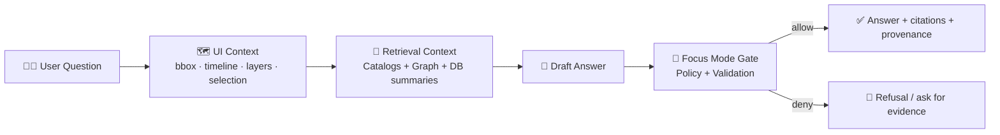
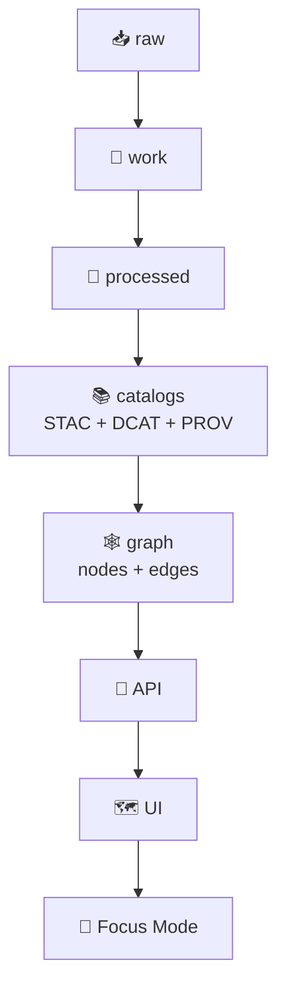

# 🧩 Fixtures — Focus Mode Gate (Example 02)


Deterministic, policy-aware fixtures for **`mcp/gates/examples/02-focus-mode`**.  
These are *small*, *diff-friendly* test inputs/outputs that simulate a full **Focus Mode** interaction:

🧑‍💻 question → 🗺️ UI state → 🔎 retrieval context (catalog + graph + summaries) → 🤖 draft → 🚧 gate → ✅ final answer (+ citations + provenance)

> [!IMPORTANT]
> ✅ Fixtures must be **synthetic** and **safe to publish**.  
> 🚫 No secrets/tokens, no PII, and no culturally sensitive coordinates.  
> This aligns with the platform’s “fail-closed” governance posture and provenance-first design.

---

## 🎯 What “Focus Mode” means here

**Focus Mode** is the KFM-aligned, evidence-backed assistant layer:
- It is **advisory-only** (suggests, explains, cites… but does **not** perform autonomous actions).
- It is **evidence-first** (answers must be grounded in retrieved sources and provenance).
- It is **governance-aware** (privacy, sensitivity labels, FAIR/CARE, and policy rules are enforced).

In practice, these fixtures help prove that “helpful” never comes at the cost of **trust**.

---

## 🚧 What a “Gate” is

A **Gate** is a policy checkpoint that evaluates content and returns a decision:

- ✅ **ALLOW** (optionally with structured redactions / rewrites / warnings), or  
- 🛑 **DENY** (with a refusal, safer re-prompt, or “need more evidence” response)

Gates are designed to be **fail-closed**:
> if the system can’t verify provenance / compliance, it blocks rather than “guessing”.

---

## 🧠 System mental model



And in KFM terms, these fixtures mirror the broader pipeline:



---

## 🗂️ What lives in `fixtures/`

Fixtures are grouped into scenario packs. Keep them **small** and **deterministic**.

```text
📁 fixtures/
├─ 📄 README.md                       # 👈 you are here
└─ 📁 scenarios/
   ├─ 📁 baseline-citations/
   │  ├─ 📄 manifest.json
   │  ├─ 📁 input/
   │  │  ├─ 📄 question.md
   │  │  ├─ 📄 ui_state.json
   │  │  └─ 📁 context/
   │  │     ├─ 📁 catalogs/           # 📚 STAC / DCAT / PROV triplet
   │  │     │  ├─ 📄 stac.json
   │  │     │  ├─ 📄 dcat.json
   │  │     │  └─ 📄 prov.jsonld
   │  │     ├─ 📁 graph/              # 🕸️ Neo4j-ish snapshot (CSV/JSON)
   │  │     │  ├─ 📄 nodes.csv
   │  │     │  └─ 📄 edges.csv
   │  │     └─ 📁 db/                 # 🗺️ PostGIS-ish summaries (optional)
   │  │        └─ 📄 query_result.json
   │  ├─ 📁 expected/
   │  │  ├─ 📄 answer.md              # human-readable final answer
   │  │  ├─ 📄 answer.json            # machine-readable answer payload
   │  │  └─ 📄 gate_report.json       # decision + reasons + redactions
   │  └─ 📄 checksums.sha256
   └─ 📁 ...
```

> [!TIP]
> If a scenario needs a “large artifact” (PMTiles / GeoParquet / COG / imagery), store:
> - a tiny placeholder header (or metadata only) ✅  
> - plus an immutable digest / checksum ✅  
> - **not** the full binary ❌

---

## 🧬 Fixture contract (what must be true)

Each scenario pack should be reproducible and self-describing.

### ✅ Required (minimum)
- `manifest.json` describing *what the scenario is* and *what should happen*
- `input/` containing enough context to run the example deterministically
- `expected/` containing:
  - final answer (human + machine)
  - `gate_report.json` explaining the decision
- `checksums.sha256` to lock the fixture set (and detect drift)

### 🧾 Suggested `manifest.json` shape (illustrative)

```json
{
  "id": "baseline-citations",
  "description": "Baseline: answer a county question with STAC/DCAT/PROV citations.",
  "tags": ["baseline", "citations", "stac", "dcat", "prov", "public"],
  "expected_decision": "allow",
  "determinism": {
    "seed": 1337,
    "sort": "lexicographic",
    "float_round": 6
  },
  "sensitivity": {
    "classification": "public",
    "care_label": "none"
  }
}
```

### 🧪 Suggested `gate_report.json` shape (illustrative)

```json
{
  "gate": "focus-mode",
  "decision": "allow",
  "policy_engine": "opa",
  "violations": [],
  "citations": {
    "required": true,
    "found": 4
  },
  "redactions": [
    {
      "type": "geo_obfuscation",
      "reason": "culturally_sensitive",
      "from": "POINT(…)",
      "to": "county-level"
    }
  ],
  "notes": [
    "All factual claims trace to catalog/graph sources."
  ]
}
```

---

## 🔒 Gate expectations these fixtures should test

### 1) 📌 Evidence-first (non‑negotiable)
- Every factual claim must cite **retrieved** sources (catalog IDs, provenance activities, graph entities).
- If evidence is missing → deny or ask for clarification (fail closed).

### 2) 🧬 Provenance continuity
- If an artifact changes, provenance must change with it.
- Answers must retain links back to STAC/DCAT/PROV lineage (no “floating facts”).

### 3) 🧑‍⚖️ Governance & safety
- No sensitive leakage (PII, secrets, restricted site coordinates, etc.).
- Honor data classification (output can’t be *less restricted* than inputs).

### 4) 🧭 Advisory-only
- Suggest actions, but never take irreversible action (“I deleted…”, “I uploaded…”, etc.).

### 5) 🌫️ Uncertainty language when needed
- When evidence is incomplete, require uncertainty framing (e.g., “may”, “likely”, “cannot confirm from available sources”).

---

## 🧪 Scenario catalog (recommended coverage)

| Scenario type 🧩 | What it validates ✅ | Expected gate behavior 🚧 |
|---|---|---|
| `baseline-*` | citations + readable answer | ✅ allow |
| `no-evidence-*` | fail-closed + safe refusal | 🛑 deny |
| `sensitive-location-*` | geo-obfuscation + CARE labels | ✅ allow (redacted) **or** 🛑 deny |
| `prompt-injection-*` | prompt security / sanitization | ✅ allow (sanitized) |
| `uncertainty-*` | probabilistic wording + “limits of evidence” | ✅ allow |
| `offline-pack-*` | offline bundle manifests + minimal provenance | ✅ allow |
| `story-node-*` | narrative answers that still cite provenance | ✅ allow |

---

## ➕ Adding a new fixture (developer flow)

1. 📋 Copy an existing scenario folder under `fixtures/scenarios/`.
2. ✍️ Update `manifest.json` (new `id`, tags, expected decision, sensitivity).
3. 🧩 Update inputs:
   - `question.md`
   - `ui_state.json` (bbox/timeline/layers/selection)
   - catalogs + graph snapshot + (optional) DB summaries
4. 🧪 Generate outputs by running the example:
   - capture the **final** gated answer (not the raw draft)
   - capture the gate report (decision + reasons + redactions)
5. 🔐 Refresh `checksums.sha256`.
6. ✅ Run tests and verify **determinism** (re-run = identical outputs).

> [!WARNING]
> Avoid hand-editing generated outputs. If you must, treat it as a *new derived artifact*:
> update provenance + checksums + expected snapshots together.

---

## 🧼 Fixture hygiene checklist

- [ ] 🚫 No secrets / tokens / credentials
- [ ] 🚫 No real PII
- [ ] 🗺️ CRS explicit (prefer EPSG:4326 for exported GeoJSON)
- [ ] 🧾 Stable IDs + stable ordering (diff-friendly)
- [ ] 🔗 Citations present and resolvable
- [ ] 🧬 PROV updated when derived content changes
- [ ] 🚧 Gate report includes rule IDs / reasons
- [ ] 📦 Files are small (prefer metadata, not binaries)

---

## 🔭 “Future-forward” fixtures (optional / experimental)

These align with proposed KFM evolutions and are welcome as new scenarios:

- 🧵 **Geotagged Pulse Threads** (time-ordered micro-events tied to locations)
- 🧠 **Conceptual Attention Nodes** (“what matters here?” overlays for Focus Mode)
- 🕸️ **Narrative Pattern Detection** (cross-dataset story arcs and motifs)
- 🛰️ **Dual-format artifacts** (GeoParquet + PMTiles + hashes + catalogs)
- 🧊 **3D / digital-twin hooks** (Cesium/MapLibre context stubs—no heavy assets)
- 🧾 **OCI artifact references** (digests + optional signatures, not payloads)

---

## 📚 Project sources this folder is aligned with

<details>
<summary>📖 Core KFM docs (architecture, UI, AI, governance)</summary>

- **Kansas Frontier Matrix – Comprehensive Technical Documentation**
- **Kansas Frontier Matrix – Comprehensive Architecture, Features, and Design**
- **Kansas Frontier Matrix – AI System Overview 🧭🤖**
- **Kansas Frontier Matrix – Comprehensive UI System Overview**
- **📚 Kansas Frontier Matrix (KFM) Data Intake – Technical & Design Guide**
- **Innovative Concepts to Evolve the Kansas Frontier Matrix (KFM)**
- **🌟 Kansas Frontier Matrix – Latest Ideas & Future Proposals**
- **Additional Project Ideas** (Policy Gate / OPA / Conftest, OCI artifacts, Cosign)

</details>

<details>
<summary>📚 Reference library (geospatial + data science + protocols)</summary>

- **AI Concepts & more** (PDF portfolio — open in Acrobat)
- **Maps / GoogleMaps / VirtualWorlds / Archaeological / Computer Graphics / Geospatial / WebGL** (PDF portfolio — open in Acrobat)
- **Various programming languages & resources** (PDF portfolio — open in Acrobat)
- **Data Management / Architectures / Data Science / Bayesian Methods** (PDF portfolio — open in Acrobat)
- **Data mining & uncertainty** resources
- **Python geospatial analysis cookbook** (PostGIS, GeoJSON, reprojection)
- **Scientific Method / Research / Master Coder Protocol Documentation** (reproducibility + tests)

</details>
