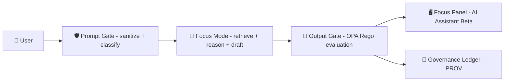

<!--
📍 Path: mcp/gates/examples/02-focus-mode/policies/README.md
🧭 Scope: Example policy pack used by the Focus Mode gate runner
-->

# 🧭 Focus Mode Policy Pack (Example) — MCP Gates 🔒


> **Why this exists:** Focus Mode is KFM’s evidence-backed, context-aware AI assistant — **advisory-only**, **provenance-first**, and required to **cite sources or refuse**.[^focus-mode-basics]  
> This folder is the **example policy-as-code pack** that “closes the gate” when a Focus Mode request/response violates those guarantees.[^policy-pack-opa]

---

## 🎯 What this pack enforces

These rules mirror KFM’s stated governance posture:

- 📑 **Evidence-first narrative**: AI-generated text must be labeled and cited.[^evidence-first]
- 🔗 **Provenance-only content**: responses must link back to KFM evidence (STAC/DCAT/PROV-backed entities).[^prov-first]
- 🧭 **Advisory-only + opt-in**: Focus Mode never takes autonomous action; AI assistance must be explicit/transparent.[^focus-mode-basics][^focus-hard-gates]
- 🔐 **Sovereignty/sensitivity propagation**: **no output may be less restricted than its inputs**.[^sovereignty-rule]
- 🗺️ **No sensitive location leaks**: generalize or refuse for sensitive sites/coordinates (anti-looting / anti-doxxing).[^sensitive-location][^focus-hard-gates]
- 🛡️ **Prompt security (“Prompt Gate”)**: sanitize against prompt injection and policy bypass attempts.[^prompt-gate]
- 🚧 **Fail-closed by default**: if the pack can’t verify a condition, the gate denies.[^fail-closed]

> 🧩 **Gate definition (in KFM terms):** a gate is an automated policy check that blocks merge/output on violations — producing clear, actionable messages.[^policy-messages]

---

## 🧬 How the Focus Mode gate fits the platform

KFM places policy gates at multiple checkpoints — *data ingestion*, *AI inference*, and *content publication*.[^policy-gates]  
This example focuses on the **AI inference/output gate** for Focus Mode.



- Policies run **in CI** (Conftest) and can also run **at runtime** (OPA check before returning an answer).[^policy-pack-opa][^policy-pack-runtime]
- The CI workflow conceptually follows **Detect → Validate → Promote**, ensuring changes are vetted before merge/deploy.[^detect-validate-promote]

---

## 🗂️ Folder layout (expected)

> The repo is documentation-heavy (MCP). This folder is treated like an **experiment artifact**: readable, reproducible, and reviewable.[^mcp-templates]

```text
📦 mcp/gates/examples/02-focus-mode/
└─ 🛡️ policies/
   ├─ 📄 README.md                  ← this doc
   ├─ 🧠 rego/                       ← Rego policies (OPA)
   │  ├─ focus_mode/*.rego
   │  └─ common/*.rego
   ├─ 🗃️ data/                       ← governance data (allowlists, governance-card, etc.)
   ├─ 🧪 tests/                      ← test vectors for conftest/opa test
   └─ 🧷 waivers.yml                 ← time-bound exceptions (rare)
```

---

## 📌 “Hard gate” invariants for Focus Mode

These are non-negotiable requirements described in the project docs:

| Invariant ✅ | What it prevents 🧯 | Typical enforcement 🔧 |
|---|---|---|
| 📑 **Citations required** | hallucinations / unverifiable narrative | deny if `answer.citations` is empty |
| 🔗 **Provenance-linked citations** | “mystery sources” | deny if citations lack `prov_id` (or KFM IDs) |
| 🧭 **Opt-in + transparent AI** | silent AI edits / autonomy | deny if `user.opt_in_ai != true` or `ai_generated` missing |
| 🔐 **No output less restricted than inputs** | sovereignty violations | compare `output_sensitivity` vs inputs |
| 🗺️ **No sensitive location leaks** | looting/doxxing via coordinates | detect coords + precision + layer sensitivity |
| 🛡️ **Prompt injection resistance** | policy bypass & exfil attempts | “Prompt Gate” deny rules |

These “hard gates” are explicitly emphasized in Focus Mode documentation.[^focus-hard-gates][^prov-first][^sovereignty-rule][^sensitive-location]

---

## 🧾 Gate input contract (JSON)

Policies evaluate **one JSON document** describing the request, context, and draft answer.

> 💡 Keep this contract stable and additive; policy changes should be reviewable and reproducible (MCP mindset).[^peer-review]

```json
{
  "mode": "focus_mode",
  "user": { "id": "anon", "opt_in_ai": true },

  "ui_context": {
    "viewport_bbox": [-98.0, 37.0, -94.0, 40.0],
    "time_range": ["1930-01-01", "1939-12-31"],
    "active_layers": ["kfm.layer.drought_index.1930s"]
  },

  "prompt": { "text": "What is noteworthy about this county?" },

  "context": {
    "datasets": [
      {
        "kfm_id": "kfm.dataset.climate.1930s",
        "license": "CC-BY-4.0",
        "sensitivity": "public",
        "dcat_id": "dcat:dataset:...",
        "stac_id": "stac:collection:...",
        "prov_id": "prov:run:..."
      }
    ]
  },

  "answer": {
    "text": "…",
    "ai_generated": true,
    "output_sensitivity": "public",
    "citations": [
      { "kfm_id": "kfm.dataset.climate.1930s", "prov_id": "prov:run:...", "quote_hash": "sha256:..." }
    ],
    "coordinates": [],
    "max_coordinate_precision_decimals": 0
  },

  "tools": { "used": ["graph.query", "stac.fetch"] }
}
```

### Output contract

We recommend `deny` returning structured violations:

```json
{
  "deny": [
    {
      "id": "KFM-FM-CITE-001",
      "severity": "error",
      "msg": "Focus Mode output is missing citations.",
      "hint": "Add at least one provenance-linked citation (STAC/DCAT/PROV-backed entity)."
    }
  ]
}
```

> 🧷 **Stable IDs:** The broader KFM policy pack uses stable IDs (e.g., `KFM-PROV-001`) and supports **time-bound waivers** (e.g., `waivers.yml`).[^stable-ids-waivers]  
> This example pack can use `KFM-FM-*` IDs to avoid colliding with production IDs.

---

## 🧪 Run locally (developer workflow)

KFM treats governance like code: versioned, testable, and peer-reviewed.[^policy-pack-opa][^peer-review]

### 1) Format & unit test Rego
```bash
opa fmt -w policies/rego
opa test policies/rego -v
```

### 2) Run Conftest against test vectors
```bash
conftest test policies/tests \
  --policy policies/rego \
  --data policies/data
```

### 3) Evaluate a single input (debug)
```bash
opa eval \
  --format pretty \
  --data policies/rego \
  --data policies/data \
  --input examples/input.json \
  "data.kfm.focus_mode.deny"
```

---

## 🧱 Authoring rules (how to add a policy)

1. 🆔 Pick a stable ID (`KFM-FM-XYZ-###`) and never reuse it.
2. 🧠 Write a focused Rego rule (small file, single responsibility).
3. 🧪 Add a failing + passing test vector under `policies/tests/`.
4. 🚧 **Fail-closed by default** (unknown/unchecked ⇒ deny).[^fail-closed]
5. 🗃️ If needed, extend governance data (allowlists, sensitive layer list, etc.) via PR.[^governance-card]
6. 📝 Document the rationale and expected behavior (MCP discipline).[^mcp-dir][^mcp-templates]

### Waivers (rare, time-bound)
If something must ship before compliance is possible:

- include `policy_id`
- include a **selector** (path/glob) for what’s waived
- include a justification + expiration date

Waivers exist to keep exceptions explicit and reviewable.[^stable-ids-waivers]

---

## 🛡️ Safety & privacy notes for geospatial answers

KFM treats some geospatial information as sensitive (e.g., sacred sites, endangered species locations). Guidance includes **generalize or refuse** when needed, rather than leaking precise locations.[^sensitive-location]

This gate should catch:

- raw lat/long in responses for restricted themes
- over-precise coordinate precision
- re-identification by combination (name + timestamp + coordinates)
- unapproved excerpts that effectively disclose sensitive locations

---

## 📚 Related docs & policy sources (in-repo)

These are referenced throughout the project docs:

- `api/scripts/policy/` – primary policy pack documentation (CI governance)
- `tools/validation/policy/*.rego` – reusable centralized Rego rules
- `docs/security/` – threat model + secrets policy
- `docs/guides/` + `mcp/` – methods, SOPs, experiments, templates (MCP)

---

## 🔖 Evidence map (source notes)

[^focus-mode-basics]: Focus Mode provides evidence-backed answers, is context-aware, and is explicitly **advisory-only**; it must cite sources or refuse rather than fabricate. [oai_citation:0‡Kansas Frontier Matrix (KFM) – AI System Overview 🧭🤖.pdf](file-service://file-Pv8eev6RWvCKrGCXyzY7zg) [oai_citation:1‡Kansas Frontier Matrix (KFM) – AI System Overview 🧭🤖.pdf](file-service://file-Pv8eev6RWvCKrGCXyzY7zg)
[^prov-first]: KFM’s AI is “provenance-first”: outputs are traceable and policy-rejected if they lack citations. [oai_citation:2‡Kansas Frontier Matrix (KFM) – AI System Overview 🧭🤖.pdf](file-service://file-Pv8eev6RWvCKrGCXyzY7zg)
[^policy-gates]: Policy gates apply at multiple checkpoints including **AI inference**, and Focus Mode must include sources or refuse. [oai_citation:3‡Kansas Frontier Matrix (KFM) – Comprehensive Architecture, Features, and Design.pdf](file-service://file-4Umt1yHoGKicdmLWzFJ9sC)
[^policy-pack-opa]: KFM governance is encoded as an **OPA (Rego) policy pack** evaluated with **Conftest** in CI; policies are versioned and transparent. [oai_citation:4‡Kansas Frontier Matrix (KFM) – Comprehensive Architecture, Features, and Design.pdf](file-service://file-4Umt1yHoGKicdmLWzFJ9sC)
[^policy-pack-runtime]: OPA can be used at runtime (e.g., check Focus Mode output before returning it). [oai_citation:5‡Kansas Frontier Matrix (KFM) – Comprehensive Architecture, Features, and Design.pdf](file-service://file-4Umt1yHoGKicdmLWzFJ9sC)
[^detect-validate-promote]: Detect → Validate → Promote workflow is described as a CI/CD pipeline concept for changes, including validation and signed PR promotion. [oai_citation:6‡🌟 Kansas Frontier Matrix – Latest Ideas & Future Proposals.docx.pdf](file-service://file-SQ3f7ve8SGiusT6ThZEuCe)
[^evidence-first]: Evidence-first rule: AI-generated text must be labeled and cited (applies to Focus Mode and Story Nodes). [oai_citation:7‡📚 Kansas Frontier Matrix (KFM) Data Intake – Technical & Design Guide.pdf](file-service://file-EbUCdsJMbu5KwpoKMrLrgj)
[^policy-messages]: Conftest policy output is intended to provide clear “deny” messages so contributors can fix violations. [oai_citation:8‡📚 Kansas Frontier Matrix (KFM) Data Intake – Technical & Design Guide.pdf](file-service://file-EbUCdsJMbu5KwpoKMrLrgj)
[^sovereignty-rule]: Sovereignty/localization is codified as: **“No output may be less restricted than its inputs.”** [oai_citation:9‡📚 Kansas Frontier Matrix (KFM) Data Intake – Technical & Design Guide.pdf](file-service://file-EbUCdsJMbu5KwpoKMrLrgj)
[^sensitive-location]: KFM guidance treats sensitive locations as a safety/security concern and recommends generalizing or refusing when disclosure could cause harm. [oai_citation:10‡Kansas Frontier Matrix (KFM) – Comprehensive Technical Documentation.pdf](file-service://file-AkqwUuYPp5zePf7pv5SMxi) [oai_citation:11‡Kansas Frontier Matrix (KFM) – Comprehensive Technical Documentation.pdf](file-service://file-AkqwUuYPp5zePf7pv5SMxi)
[^prompt-gate]: Prompt security is implemented via “Prompt Gate” policies to sanitize inputs and prevent prompt injection/misuse. [oai_citation:12‡Kansas Frontier Matrix (KFM) – Comprehensive Architecture, Features, and Design.pdf](file-service://file-4Umt1yHoGKicdmLWzFJ9sC)
[^fail-closed]: “Failing closed” is described as a governance stance: missing required conditions causes CI/gates to reject changes; vocab/exception extension happens via PR review. [oai_citation:13‡Additional Project Ideas.pdf](file-service://file-Pc2GNivcrHBeKjBQksLC3T)
[^governance-card]: A governance-card JSON can enumerate allowed licenses/required fields/sensitivity flags for Rego enforcement. [oai_citation:14‡Additional Project Ideas.pdf](file-service://file-Pc2GNivcrHBeKjBQksLC3T)
[^stable-ids-waivers]: Policies are organized into categories with stable IDs, and waivers can be time-bound with expiration + reasoning (e.g., `waivers.yml`). [oai_citation:15‡📚 Kansas Frontier Matrix (KFM) Data Intake – Technical & Design Guide.pdf](file-service://file-EbUCdsJMbu5KwpoKMrLrgj)
[^focus-hard-gates]: Focus Mode “hard gate” requirements include provenance-linked content, opt-in/transparent AI, and no sensitive location leaks. [oai_citation:16‡MARKDOWN_GUIDE_v13.md.gdoc](file-service://file-UYVruFXfueR8veHMUKeugU)
[^mcp-dir]: Repo structure includes `mcp/` for Master Coder Protocol resources (experiments, SOPs, glossary, model cards). [oai_citation:17‡Kansas-Frontier-Matrix_ Open-Source Geospatial Historical Mapping Hub Design.pdf](file-service://file-ShqHKgjxCS9UT9vbcxDNzA)
[^mcp-templates]: MCP-compatible templates (experiment reports + SOPs) support transparency and repeatability. [oai_citation:18‡Kansas-Frontier-Matrix_ Open-Source Geospatial Historical Mapping Hub Design.pdf](file-service://file-64djFYQUCmxN1h6L6X7KUw)
[^peer-review]: MCP/Scientific Method docs emphasize documentation-first rigor and peer review/replication practices (applies to policy changes too). [oai_citation:19‡Scientific Method _ Research _ Master Coder Protocol Documentation.pdf](file-service://file-HTpax4QbDgguDwxwwyiS32)
