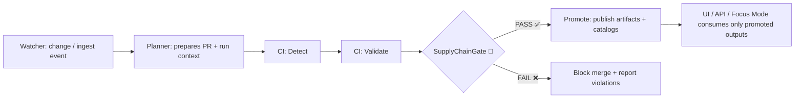

# 05 — Supply Chain Gate 🔐📦  
**MCP / Gates / Examples** → `mcp/gates/examples/05-supply-chain/`


> [!NOTE]
> This example is **“Supply Chain” in the *security + provenance* sense** (software + data supply chain).  
> It also includes an optional pattern for **real-world supply chain datasets** (privacy + sensitivity gates).

---

## 🧭 What this gate does

This example shows how to implement a **SupplyChainGate** inside the MCP “gates” framework to ensure that **nothing becomes “publishable truth”** until it is:

- ✅ **Reproducible** (deterministic, auditable runs)
- ✅ **Traceable** (STAC/DCAT/PROV linkage + run manifests)
- ✅ **Tamper-evident** (content digests + signatures)
- ✅ **Governed** (licenses, sensitivity classifications, policy-as-code)
- ✅ **Safe to reuse** (SBOM + basic vuln posture + dependency pinning)

If the evidence is missing, the gate **fails closed**. No “it’s probably fine.” 🧱

---

## 📦 Where it fits in the KFM-style pipeline

KFM’s architecture repeatedly emphasizes “**provenance-first**” and “**no black boxes**.” This gate is placed at the boundary where artifacts/datasets become eligible to:

- ship to an **OCI registry** (ORAS)
- surface in the **UI** (“map behind the map”)
- be answerable in **Focus Mode** (citations required)
- be reused in downstream pipelines (trusted dependency chain)

### Typical lifecycle (Detect → Validate → Promote)



---

## 🎯 Threat model (why we care)

Supply chain attacks don’t just target code—they target **data**:

- a dependency update silently changes results  
- a dataset artifact is swapped after approval  
- a pipeline runs “mostly the same” but cannot be reproduced  
- a model/analysis is published without citing its inputs  
- sensitive location data leaks via downstream outputs

This gate makes the pipeline **treat data like code**: versioned, signed, reviewable, and policy-checked.

---

## 🧩 Gate contract (inputs → decision)

> [!TIP]
> Keep the contract small and explicit. Gates should be deterministic and explainable.

### Inputs (suggested)
- `run_manifest.json` (canonicalized + self-fingerprinted digest)
- `artifacts.json` (what will be published, with digests + media types)
- `catalog/*.json` (STAC/DCAT records referencing the artifacts)
- Optional: `sbom.spdx.json` (or CycloneDX)
- Optional: provenance attestation (`in-toto` / SLSA predicate)
- Optional: `waivers.yml` (time-boxed exceptions with IDs)

### Output (suggested)
```json
{
  "gate": "SupplyChainGate",
  "status": "PASS | FAIL | WARN",
  "violations": [
    { "id": "SC-OCI-001", "severity": "high", "message": "Artifact digest missing in distribution.oci" }
  ],
  "artifacts_verified": ["sha256:..."],
  "timestamp": "2026-01-23T00:00:00Z"
}
```

---

## 🗂 Example folder layout (recommended)

> [!NOTE]
> The repo might already provide shared helpers under `mcp/gates/`.  
> This example assumes a typical “policy pack + fixtures + scripts” structure.

```text
mcp/
└─ 🚪 gates/
   └─ 🧪 examples/
      └─ 🔐📦 05-supply-chain/
         ├─ 📘📄 README.md                   # 📘 What this gate enforces (SBOM/signing/pinning) + how to run the example
         ├─ ⚙️🧾 gate.config.yaml            # Gate config: which policies run, inputs expected, output/report settings
         ├─ 🧠⚖️ policies/                   # OPA/Rego policy pack for supply-chain verification (deny-by-default)
         │  ├─ ⚖️📄 supply_chain.rego         # Umbrella rules: required artifacts, linkage, and fail-closed thresholds
         │  ├─ ⚖️📄 oci_distribution.rego     # OCI/ORAS distribution rules (digests, media types, registry refs)
         │  ├─ ⚖️📄 sbom_required.rego        # SBOM rules (presence, format, minimum fields, subject linkage)
         │  ├─ ⚖️📄 signatures_cosign.rego    # Cosign rules (signature/attestation required, signer/subject constraints)
         │  └─ ⚖️📄 deps_pinning.rego         # Dependency pinning rules (lockfiles, digest pinning, no floating tags)
         ├─ 🧪 fixtures/                      # Golden fixtures used to prove policies work (good must pass; bad must fail)
         │  ├─ ✅ good/                       # Known-good bundle (complete chain: run → artifacts → catalogs → SBOM → provenance)
         │  │  ├─ ✅🧾 run_manifest.json        # Run receipt (tool versions, inputs/outputs, digests)
         │  │  ├─ ✅📦🧾 artifacts.json         # Artifact list (subjects, media types, digests, pointers)
         │  │  ├─ ✅🗂️🧾 catalog.dcat.json      # DCAT discovery record linking to distributed artifacts
         │  │  ├─ ✅🛰️🧾 catalog.stac.json      # STAC metadata referencing the artifacts as assets
         │  │  ├─ ✅📦🧾 sbom.spdx.json         # SBOM (SPDX) for build/toolchain/artifacts (as required)
         │  │  └─ ✅🔏🧾 provenance.intoto.jsonl # in-toto provenance/attestations (SLSA-style) for verification
         │  └─ ❌ bad/                        # Known-bad bundle (missing/invalid pieces should be denied)
         │     ├─ ❌🧾 run_manifest.json        # Incomplete/invalid run receipt (e.g., missing digests/versions)
         │     └─ ❌🗂️🧾 catalog.dcat.json      # Invalid DCAT record (e.g., missing license/distribution integrity)
         └─ 🛠 scripts/                       # Helper scripts to generate/verify the supply-chain proof chain
            ├─ 🛠️📄 generate_sbom.sh          # Generate SBOM (SPDX/CycloneDX) for the build/toolchain
            ├─ 🔏🛠️📄 sign_artifacts.sh        # Sign artifacts / create attestations (cosign)
            └─ ✅🛠️📄 verify_gate.sh           # Run the gate locally (conftest + schema checks) and print a summary
```

---

## ⚙️ Gate config (example)

```yaml
# gate.config.yaml
gate: SupplyChainGate
mode: fail_closed
requires:
  - run_manifest.canonical_digest
  - catalog.dcat.distributions[*].oci.digest
  - catalog.license.spdx
checks:
  oci_distribution:
    require_digest: true
    require_media_types: true
  signatures:
    cosign:
      required: true
      allowed_identities:
        - "https://github.com/<org>/<repo>/.github/workflows/<workflow>.yml@refs/heads/main"
  attestations:
    sbom:
      required: true
      accepted_types: ["spdx-json", "cyclonedx-json"]
    slsa_provenance:
      required: true
  deps:
    require_lockfiles: true
    forbid_unpinned_actions: true
    docker_base_images_by_digest: true
```

---

## 🧠 Policy pack (OPA/Rego) — what we enforce

### 1) OCI distribution must be content-addressed ✅
**Rule:** if a DCAT/STAC record references an OCI artifact, it must include a **digest** (not just a tag).

**Why:** tags move, digests don’t. Content-addressing is the cornerstone of reproducibility.

### 2) Artifact must be signed (Cosign) ✅
**Rule:** every publishable artifact digest must have a valid signature from an approved identity (e.g., CI).

**Why:** ensures origin + integrity.

### 3) SBOM required ✅
**Rule:** attach an SBOM for pipelines and/or artifact bundles (depending on your artifact type).

**Why:** you can’t manage risk if you don’t know what’s inside.

### 4) SLSA / provenance attestation required ✅
**Rule:** there must be an attestation linking:
- the artifact digest ↔ the pipeline run ↔ the `run_manifest.canonical_digest`

**Why:** stops “mystery builds.”

### 5) Dependencies pinned ✅
**Rule examples:**
- GitHub Actions `uses:` pinned to commit SHA
- container base images pinned to digest
- language deps locked (`package-lock.json`, `poetry.lock`, etc.)

**Why:** prevents drift + surprise dependency swaps.

---

## 🚀 Quickstart (local)

> [!IMPORTANT]
> The commands below are reference patterns—adapt to the tooling in your environment.

### A) Run Rego policies against fixtures
```bash
cd mcp/gates/examples/05-supply-chain

# conftest reads JSON/YAML inputs and evaluates Rego policies
conftest test ./fixtures/good --policy ./policies
conftest test ./fixtures/bad  --policy ./policies
```

### B) Verify OCI artifact signatures (Cosign)
```bash
# Example digest target (substitute yours)
export REF="ghcr.io/<org>/kfm/surficial-geology@sha256:<digest>"

cosign verify "$REF" \
  --certificate-identity "https://github.com/<org>/<repo>/.github/workflows/<workflow>.yml@refs/heads/main" \
  --certificate-oidc-issuer "https://token.actions.githubusercontent.com"
```

### C) Produce + attach an SBOM (example pattern)
```bash
# Example: SBOM generation (tool may vary)
syft packages . -o spdx-json > sbom.spdx.json

# Attach as an OCI referrer (example pattern)
cosign attest --yes \
  --type spdx \
  --predicate sbom.spdx.json \
  "$REF"
```

### D) Attach provenance (SLSA / in-toto)
```bash
# Example: attach provenance predicate
cosign attest --yes \
  --type slsaprovenance \
  --predicate provenance.intoto.jsonl \
  "$REF"
```

---

## 🧪 End-to-end example: “Geology Layer” artifact bundle 🪨🗺️

KFM proposes a pattern where a **single dataset** may be distributed as multiple artifacts:

- 🧱 `*.pmtiles` for fast vector tile rendering in the UI  
- 🧮 `*.parquet` (GeoParquet) for analytics pipelines  
- 📚 STAC/DCAT metadata to connect “what it is” + “how to use it”
- ⛓ PROV + run manifests to prove how it was generated

### ORAS push pattern (multi-file artifact)
```bash
oras push ghcr.io/<org>/kfm/surficial-geology:2026-01-23 \
  --artifact-type application/vnd.kfm.dataset \
  ./dist/surficial_geology.pmtiles:application/vnd.pmtiles \
  ./dist/surficial_geology.parquet:application/vnd.geo+parquet
```

### Minimum `distribution.oci` metadata (DCAT-style)
```json
{
  "dcat:distribution": [
    {
      "title": "Surficial Geology — PMTiles + GeoParquet bundle",
      "mediaType": ["application/vnd.pmtiles", "application/vnd.geo+parquet"],
      "distribution.oci": {
        "registry": "ghcr.io",
        "repository": "<org>/kfm/surficial-geology",
        "tag": "2026-01-23",
        "digest": "sha256:<immutable_digest>",
        "files": [
          { "path": "surficial_geology.pmtiles", "mediaType": "application/vnd.pmtiles" },
          { "path": "surficial_geology.parquet", "mediaType": "application/vnd.geo+parquet" }
        ]
      }
    }
  ],
  "license": "CC-BY-4.0"
}
```

---

## 🧾 Run manifest pattern (the “audit spine”)

KFM repeatedly leans on a **Run Manifest** that captures:
- inputs (source URLs, checksums, versions)
- toolchain versions
- outputs
- summary counts/errors
- a canonicalized digest (RFC 8785)

**Recommended storage path:**  
`data/audits/<run_id>/run_manifest.json`

Minimal example:
```json
{
  "run_id": "2026-01-23T00-00-00Z__surficial_geology__v1",
  "run_time": "2026-01-23T00:00:00Z",
  "idempotency_key": "sha256:<same-as-canonical_digest>",
  "tool_versions": {
    "python": "3.12.x",
    "gdal": "3.x",
    "tippecanoe": "2.x"
  },
  "source_urls": [
    "https://example.gov/geology/surficial_geology.zip"
  ],
  "outputs": [
    "dist/surficial_geology.pmtiles",
    "dist/surficial_geology.parquet"
  ],
  "canonical_digest": "sha256:<self-fingerprint>"
}
```

> [!IMPORTANT]
> The SupplyChainGate treats the run manifest as *non-optional evidence*. If outputs change, the manifest must change.

---

## 🤖 Why the UI + Focus Mode care

KFM’s UX principle is: **every layer has a “map behind the map.”**  
That only works when artifacts are:

- discoverable (catalog-driven)
- attributable (licenses + sources)
- verifiable (digests + signatures)
- explainable (provenance chain)

### Focus Mode dependency
Focus Mode is designed to **refuse** answers without citations. That means:
- the datasets must exist in a searchable catalog
- those datasets must link to their assets
- those assets must be reproducible and verifiable

SupplyChainGate enforces the *preconditions for trustworthy AI answers.*

---

## 🚚 Optional: Real-world supply chain datasets (privacy + governance add-on)

When ingesting supply-chain data like:
- shipment logs
- supplier lists
- facility locations
- workforce or customer signals

…you can extend this gate with privacy checks inspired by classic data mining protections:

- k-anonymity / l-diversity / t-closeness thresholds for certain releases  
- query auditing / inference control for derived outputs  
- classification tags that propagate from raw → processed → published

> [!TIP]
> Treat privacy as a supply-chain constraint: if “downstream reuse” can harm people, your chain is broken.

---

## 🧰 MCP alignment (Master Coder Protocol 🧑‍🔬🧪)

This gate is intentionally compatible with MCP themes:
- scientific method mindset (hypothesis → method → evidence → review)
- reproducibility as a security feature
- “explain your work” via manifests + provenance
- automation that still funnels through PR + review

---

## 🧯 Troubleshooting

### ❌ “Digest missing” but I have a tag
✅ Fix: publish by digest (or record the resolved digest) and update `distribution.oci.digest`.

### ❌ “Signature missing”
✅ Fix: ensure the publishing workflow signs the artifact digest, and that your identity matches the allowlist.

### ❌ “SBOM missing”
✅ Fix: generate + attach SBOM as a referrer (or store alongside metadata and make the policy read it).

### ❌ “Provenance missing / run manifest mismatch”
✅ Fix: regenerate the run manifest after any output change; ensure canonicalization + digest is updated.

---

## ✅ Definition of Done (PR checklist)

> [!NOTE]
> This checklist is intentionally “MCP-style” and designed to be automatable over time.

- [ ] All published artifacts have **immutable digests** recorded  
- [ ] All artifacts are **Cosign verified** against approved identity  
- [ ] SBOM attached (or stored) and referenced  
- [ ] Provenance attestation exists and links to run manifest digest  
- [ ] `run_manifest.json` updated + canonical digest valid  
- [ ] STAC/DCAT/PROV are complete and cross-linked  
- [ ] License present (SPDX-compatible)  
- [ ] Sensitivity classification present (and enforced)  
- [ ] CI passes: Conftest / policy pack / secret scan / dependency pinning  
- [ ] Human review completed (policy exceptions documented, time-boxed)

---

## 📚 References inside this repo

- 📌 Gate framework overview: `../../README.md`  
- 🧪 More examples: `../`  
- 🧠 Policy packs (if centralized): `../../policies/`

---

## 📖 Source docs (project-wide) used to shape this example

This README is intentionally aligned with the project’s core documents:

- 🧬 **Evidence-first ingestion + trust boundaries** (raw immutable → processed → published)  
- ⛓ **STAC/DCAT/PROV linkage** for “map behind the map” transparency  
- 🔐 **OCI + ORAS + Cosign** for artifact distribution and verification  
- 🧪 **Policy-as-code (OPA/Rego + Conftest)** and **fail-closed** governance  
- 🤖 **Focus Mode** requirements (citations, governance checks, prompt security)  
- 🗺️ **UI architecture** (2D/3D, timeline, story nodes, offline packs, AR)  
- 📈 **Data mining + privacy** patterns for sensitive datasets  
- 🧑‍🔬 **MCP scientific method** alignment (reproducibility, auditability)

---

## 🌱 Next extensions (ideas)

- 🔄 Add an “**Artifact Referrer Indexer**” that pulls Cosign/SBOM/PROV referrers into Neo4j for graph queries  
- 🧭 Add a “**Supply Chain Story Node**” template (evidence manifests + PROV auto-generation)  
- 🛰️ Add a “**Digital Twin**” view for infrastructure flows (3D + timeline + simulation overlays)  
- 🧠 Add probabilistic “risk scoring” (Bayesian-ish) for supply chain confidence levels  
- 📦 Offline data pack signing + verification for field use  
- 🧰 Auto-remediation: gate suggests fixes (e.g., generate SBOM, pin digest) but never auto-publishes

---

### 🏁 Summary

**SupplyChainGate** is the “trust lock” between “we created something” and “we publish something.”  
It enforces: **digest + signature + SBOM + provenance + policy** → *then* promotion.

If it can’t be verified, it doesn’t ship. ✅

