# 🧱 MCP Gates — Examples

**Status:** 🧪 Experimental  
**Scope:** Kansas Frontier Matrix (KFM) Governance & Validation  
**Engines:** 🧩 OPA/Rego · 🧪 Conftest · 🐍 Scripts · 🗄️ SQL/Cypher  
**Runs in:** ✅ CI · ✅ Ingestion/ETL · ✅ Runtime API · ✅ Focus Mode · ✅ UI Packaging

> [!TIP]
> This folder is a **copy/paste cookbook** for “gates” — deterministic checks that keep KFM trustworthy: **provenance‑first**, **FAIR+CARE**, and **AI that must cite**.

---

## 🧭 What’s a “Gate”?

A **gate** is a small, deterministic check that sits **between stages** of the system (or between *draft* and *published*).  
If it fails, we stop the line — **fail closed** ✅🚫

### Why gates exist in KFM 🧠
KFM’s docs repeatedly reinforce these non‑negotiables (and this folder turns them into runnable rules):

- 🧊 **Pipeline ordering is sacred:** `data/sources → data/raw → data/processed → data/catalog → graph/api/ui`  
- 🧾 **Provenance-first publishing:** nothing goes to **graph/UI/AI** until it has **STAC + DCAT + PROV** metadata (the “evidence triplet”).  
- 🔒 **Sensitivity-aware governance:** classifications + CARE labels propagate to derivatives; sensitive coordinates can be generalized.  
- 🤖 **AI governance:** Focus Mode runs a **Prompt Gate** + an **OPA output gate**, requires citations, and logs to a **governance ledger**.

---

## 🧩 Where gates run

| Stage | Typical engine | What gets gated |
|---|---|---|
| 🧪 CI / Pull Request | Conftest, scripts | schema/contracts, docs style, license fields, policy parity |
| 🧊 Ingestion & ETL | Python/Node + Rego | checksums, CRS, “raw is immutable”, reproducibility |
| 🌐 Runtime API | OPA sidecar | RBAC, classification, query auditing, inference protection |
| 🤖 Focus Mode | Prompt Gate + OPA | citations, refusal rules, sensitivity filtering, audit logs |
| 🗺️ UI packaging | scripts | offline packs, tile budgets, AR-safe layer constraints |

> [!IMPORTANT]
> **Same policy, multiple runtimes:** Prefer **one Rego rule-set** used in CI *and* runtime (“policy parity”) to avoid drift.

---

## 🗺️ Gatepoints in the canonical KFM flow

```mermaid
flowchart LR
  S[🗃️ data/sources - original drops] --> R[🧊 data/raw - immutable]
  R --> P[🧹 data/processed]
  P --> C[📚 data/catalog - STAC DCAT PROV]
  C --> G[🧠 Knowledge Graph - Neo4j + ontologies]
  G --> A[🌐 API]
  A --> U[🗺️ UI - Map + Timeline + Story]
  A --> F[🤖 Focus Mode - Q and A + reasoned views]

  S -.-> R
  R -.-> P
  P -.-> C
  C -.-> G
  A -.-> U
  A -.-> F
```



---

## 🗂️ What’s in this folder?

This `examples/` directory is meant to hold **small, runnable gatepacks** with **fixtures**.

Suggested layout (create as needed):

```text
mcp/
└─ 🚦 gates/
   ├─ 📄 README.md                     # 📘 Gate system overview: what runs, when, and “fail-closed” behavior
   └─ 🧪 examples/                     # 👈 you are here 📌 Example gate packs: policies + fixtures + expected outcomes
      ├─ 📄 README.md                  # 📘 How to use examples (local runs, CI wiring, adding new packs)
      ├─ 🗄️ 01-data-intake/            # Data intake gate pack (dataset manifests, catalog rules, provenance basics)
      │  ├─ 🧾 gatepack.yaml            # Gate pack descriptor: which policies run + inputs + expected report shape
      │  ├─ ⚖️ policies/               # Rego policies specific to this pack
      │  │  └─ ⚖️📄 dataset.rego        # Dataset intake checks (required fields, license, checksums, link validity)
      │  └─ 🧩 fixtures/               # Minimal inputs used to exercise the pack
      │     └─ 🧾 dataset.manifest.json # Example dataset manifest (known-good or known-bad depending on test)
      ├─ 🔎 02-focus-mode/             # Focus Mode gate pack (citation coverage, redaction, safety envelopes)
      │  ├─ 🧾 gatepack.yaml            # Pack descriptor for Focus Mode checks
      │  ├─ ⚖️ policies/
      │  │  └─ ⚖️📄 focus_mode.rego     # Focus Mode rules (citations required, safe links, no sensitive leakage)
      │  └─ 🧩 fixtures/
      │     ├─ 🧾 focus_request.json    # Example request payload (inputs/context)
      │     └─ 🧾 focus_answer.json     # Example answer payload (citations, redactions, receipt pointers)
      ├─ 🎬 03-story-nodes/             # Story Node gate examples (schemas, step rules, evidence manifests)
      ├─ 🧳 04-offline-packs/           # Offline pack gate examples (bundle integrity, manifests, checksums)
      ├─ 📦 05-supply-chain/            # Supply-chain gate examples (SBOM, attestations, OCI digests)
      ├─ 🔒 06-privacy/                 # Privacy gate examples (PII detection, redaction policy, access labels)
      ├─ 🧪 07-simulations/             # Simulation gate examples (seeds, run manifests, reproducibility proofs)
      └─ 🗺️ 08-ui-layer-registry/       # UI registry gate examples (layer/style/legend index validity)
```

> [!NOTE]
> If your repo uses different paths, keep the **ideas** and update the `inputs:` globs.

---

## 🚀 Quickstart (local)

1) Pick an example folder.  
2) Run the gate engine:

### Conftest (Rego in CI) 🧪
```bash
# from the example folder
conftest test fixtures/dataset.manifest.json -p policies
```

### OPA eval (runtime-style checks) 🧩
```bash
opa eval -d policies -i fixtures/focus_answer.json "data.kfm.gates.focus_mode.deny"
```

---

## 🧱 Gatepack format (tiny convention)

We use a lightweight “gatepack” YAML to describe what to run. It’s intentionally minimal and MCP-friendly:

```yaml
# gatepack.yaml
gatepack_id: kfm.examples.data_intake@v1
description: >
  Example gates that enforce ingestion ordering, licensing, and provenance-first publishing.
on_fail: block   # or: warn
gates:
  - id: dataset.contract@v1
    engine: conftest
    policy_dir: policies
    input: fixtures/dataset.manifest.json
    severity: blocker

  - id: dataset.catalog_triplet@v1
    engine: conftest
    policy_dir: policies
    input: fixtures/dataset.manifest.json
    severity: blocker
```

> [!TIP]
> A gate should emit a **machine-readable report** (JSON) for the Governance Ledger, not just console text.

---

# ✅ Example 01 — Data Intake Gate (Schema + License + Provenance)

This example captures the core intake rules:
- ✅ validate shape/CRS/bounds
- ✅ require licensing + attribution
- ✅ require checksums
- ✅ require catalog metadata before graph/UI use
- ✅ enforce council approval for sensitive (optional but recommended)

### Fixture: `fixtures/dataset.manifest.json`

```json
{
  "dataset_id": "kfm.dataset.landcover_1850@v1",
  "title": "Kansas Landcover (1850)",
  "license": "CC-BY-4.0",
  "bbox": [-102.05, 36.99, -94.59, 40.00],
  "source": {
    "name": "Example Archive",
    "retrieved_at": "2026-01-01",
    "citation": "…"
  },
  "care": {
    "sensitivity": "public",
    "generalization_km": 0,
    "notes": ""
  },
  "assets": [
    {
      "path": "data/processed/rasters/landcover_1850.tif",
      "type": "cog",
      "sha256": "…"
    },
    {
      "path": "data/processed/tiles/landcover_1850.pmtiles",
      "type": "pmtiles",
      "sha256": "…"
    }
  ],
  "catalog": {
    "stac": "data/catalog/stac/landcover_1850.collection.json",
    "dcat": "data/catalog/dcat/landcover_1850.ttl",
    "prov": "data/catalog/prov/landcover_1850.prov.jsonld"
  }
}
```

### Policy: `policies/dataset.rego`

```rego
package kfm.gates.dataset

# Conftest convention: deny[msg]

deny[msg] {
  not input.dataset_id
  msg := "dataset_id is required"
}

deny[msg] {
  not input.license
  msg := "license is required (FAIR+CARE contract)"
}

deny[msg] {
  not input.bbox
  msg := "bbox is required (WGS84 bounds check)"
}

deny[msg] {
  b := input.bbox
  b[0] < -180
  msg := "bbox minLon out of WGS84 range"
}

deny[msg] {
  b := input.bbox
  b[2] > 180
  msg := "bbox maxLon out of WGS84 range"
}

deny[msg] {
  b := input.bbox
  b[1] < -90
  msg := "bbox minLat out of WGS84 range"
}

deny[msg] {
  b := input.bbox
  b[3] > 90
  msg := "bbox maxLat out of WGS84 range"
}

deny[msg] {
  some a
  a := input.assets[_]
  not a.sha256
  msg := sprintf("asset %v missing sha256", [a.path])
}

# Evidence triplet: STAC + DCAT + PROV
deny[msg] {
  not input.catalog.stac
  msg := "STAC record required before publish"
}

deny[msg] {
  not input.catalog.dcat
  msg := "DCAT record required before publish"
}

deny[msg] {
  not input.catalog.prov
  msg := "PROV record required before publish"
}

# Optional: stricter rules for non-public datasets
deny[msg] {
  input.care.sensitivity != "public"
  (not input.care.generalization_km) or input.care.generalization_km < 10
  msg := "non-public datasets must specify generalization_km >= 10 (coordinate protection)"
}
```

### Optional script gate: verify COG structure 🛰️
COGs/tiles are a performance contract (range requests, overviews, caching). Use a script gate for deep format checks:

```python
# scripts/verify_cog.py (sketch)
# - open raster
# - assert it is tiled + has overviews
# - emit JSON report
```

---

# 🔒 Example 02 — Policy Gate (Fail‑Closed PR checks)

Policy gates are your “merge blockers.” Use them for:
- 🧾 data contracts (license, schema, citations)
- 🧠 ontology/graph contracts (allowed node types, required refs)
- 📝 docs contracts (front-matter, style, broken links)

### Typical CI wiring (pseudo)

```yaml
# .github/workflows/gates.yaml (pseudo)
steps:
  - run: conftest test mcp/gates/examples/**/fixtures -p mcp/gates/examples/**/policies
```

> [!IMPORTANT]
> Keep policy **in-repo** so it’s reviewable, reproducible, and MCP-aligned.

---

# 🤖 Example 03 — Focus Mode Gate (Prompt Gate + Output Governance)

Focus Mode is a high-trust surface. The design pattern is:

1) 🧼 **Prompt Gate** sanitizes user input  
2) 🔎 Retrieval pulls from catalog + graph + docs  
3) 🧠 LLM produces draft answer  
4) 🧩 **OPA Output Gate** verifies citations + sensitivity + guardrails  
5) 🧾 Log to governance ledger (auditable, immutable-ish)

### Input: `fixtures/focus_request.json`

```json
{
  "user_query": "What changed in river flow near Topeka this week?",
  "user_role": "public",
  "requested_detail": "summary"
}
```

### Output: `fixtures/focus_answer.json`

```json
{
  "answer": {
    "text": "…",
    "citations": [
      {"kind": "dcat", "ref": "data/catalog/dcat/usgs_nwis.ttl"},
      {"kind": "entity", "ref": "graph://station/ks_topeka_gauge"}
    ],
    "classification": "public",
    "confidence": 0.72,
    "uncertainty_note": "Estimated from available readings; verify if used operationally."
  }
}
```

### Policy: `policies/focus_mode.rego`

```rego
package kfm.gates.focus_mode

deny[msg] {
  count(input.answer.citations) == 0
  msg := "Focus Mode answers must include citations (dataset/doc/entity)"
}

deny[msg] {
  input.answer.classification != "public"
  msg := "public users cannot receive non-public classifications"
}

deny[msg] {
  input.answer.confidence < 0.6
  not input.answer.uncertainty_note
  msg := "low-confidence answers must include uncertainty_note"
}

deny[msg] {
  contains(lower(input.answer.text), "ignore previous")
  msg := "possible prompt-injection artifact detected"
}
```

---

# 🧾 Example 04 — Story Node Gate (Evidence‑First Narratives)

Story nodes power map+timeline storytelling. Gates keep them:
- 🔗 provenance-linked (graph IDs + dataset refs)
- 📎 cited (sources required)
- 🤖 transparent about AI assistance

### Example: `story.md`

```md
---
id: story.kansas_river_change@v1
title: Kansas River Change Over Time
time_range: [1850, 2025]
places: ["Topeka, KS"]
ai_assisted: true
sources:
  - data/catalog/dcat/usgs_nwis.ttl
  - data/catalog/stac/historical_topo_1900.collection.json
---

## Claim 1
River measurements show seasonal variation...

## Evidence
- See dataset citations above.
```

💡 **Minimal doc gate ideas**
- YAML front matter required ✅
- `sources:` non-empty ✅
- if `ai_assisted: true`, require a visible “AI‑Assisted” marker (UI contract) ✅

---

# 📦 Example 05 — Offline Pack Gate (GeoParquet + PMTiles + Manifests)

Offline packs support classrooms + fieldwork. Gates verify:
- 📜 manifest exists + checksums
- 🧱 tiles are pre-generated and within size/perf budgets
- 🔏 pack is signed (supply-chain trust)

```json
{
  "pack_id": "kfm.pack.ellis_county_education@v1",
  "includes": [
    {"path": "layers/roads.parquet", "type": "geoparquet", "sha256": "…"},
    {"path": "tiles/roads.pmtiles", "type": "pmtiles", "sha256": "…"}
  ],
  "catalog_refs": [
    "data/catalog/stac/roads.collection.json",
    "data/catalog/dcat/roads.ttl"
  ],
  "signature": {"kind": "cosign", "ref": "oci://registry.example/kfm/packs@sha256:…"}
}
```

---

# 🛡️ Example 06 — Supply Chain Gate (SBOM + Attestations)

Treat datasets, models, and packs as **versioned artifacts** 📦:
- 🧾 generate SBOMs
- 🧬 generate SLSA / in-toto style attestations
- 🔏 sign artifacts (cosign) before promotion

> [!NOTE]
> This example is intentionally “policy-first”: wire it to your artifact pipeline once artifacts exist.

---

# 🕵️ Example 07 — Privacy & Inference Gate (Query Auditing)

For sensitive data:
- 🧷 enforce classification (CARE)
- 🧮 prevent inference leakage (aggregation thresholds, query auditing)
- 🫥 consider differential privacy for public aggregates

Rule ideas:
- deny requests that would expose fewer than **N** individuals
- deny repeated “zoom-in” queries that bypass aggregation over time

---

# 🧪 Example 08 — Simulation Gate (Deterministic + Provenance)

Sim outputs must be reproducible:
- 🎲 fixed seeds
- 📦 configuration captured (MetricSpec, PreprocessSpec, etc.)
- 🔗 outputs checksummed + referenced in catalog/prov

---

# 🗺️ Example 09 — UI Layer Registry Gate (Provenance Tags + AR-safe Layers)

The UI’s layer registry should include:
- 📎 provenance attribution (source, license, catalog refs)
- 🕰️ timeline behavior (year range, animation support)
- 🧷 sensitivity tags (CARE)
- 🕶️ AR flag (`ar_enabled: true/false`) + simplification rules

---

## 🧑‍💻 Adding a new example (MCP-friendly) 🧰

✅ Checklist:
- [ ] example folder has its own `gatepack.yaml`
- [ ] includes `fixtures/` (small + deterministic)
- [ ] includes `policies/` and/or `scripts/`
- [ ] emits a `report.json` with consistent fields
- [ ] documents the **why** (threat model / failure mode)
- [ ] includes a tiny harness (Makefile / npm script / python -m)

🏷️ Naming convention:
- `domain.subject.rule@vN` (example: `dataset.provenance.required@v1`)

---

## 🧾 Gate report contract (recommended)

```json
{
  "gate_id": "dataset.provenance.required@v1",
  "status": "pass",
  "severity": "blocker",
  "target": "fixtures/dataset.manifest.json",
  "checked_at": "2026-01-20T00:00:00Z",
  "messages": [],
  "evidence": [
    {"kind": "sha256", "ref": "…"},
    {"kind": "stac", "ref": "…"}
  ]
}
```

---

## ❓ FAQ

**Do I have to use Rego?**  
No. Use the smallest tool that yields deterministic results. Rego is great for policy logic; scripts are great for file-format introspection (COG/PMTiles budgets).

**Policy gate vs ingestion gate?**  
- 🧪 **Policy gates** usually run in CI and block merges.  
- 🧊 **Ingestion gates** run during pipeline execution and block promotion to the next stage.

**What happens when a gate fails?**  
✅ fail closed · 📄 emit a report · 🚫 don’t mutate downstream state

---

## 📚 Project docs used to design these examples

These examples are derived from the project’s architecture + governance notes across:

- **Kansas Frontier Matrix (KFM) – Comprehensive Technical Documentation**
- **Kansas Frontier Matrix (KFM) – Comprehensive Architecture, Features, and Design**
- **Kansas Frontier Matrix (KFM) – AI System Overview**
- **Kansas Frontier Matrix – Comprehensive UI System Overview**
- **📚 KFM Data Intake – Technical & Design Guide**
- **Innovative Concepts to Evolve the Kansas Frontier Matrix (KFM)**
- **Kansas Frontier Matrix – Latest Ideas & Future Proposals**
- **Additional Project Ideas**
- **AI Concepts & more**
- **Data Management / Bayesian & Data Science references**
- **Maps / WebGL / Geospatial references**
- **Various programming languages & resources**
- **Master Coder Protocol documentation**
