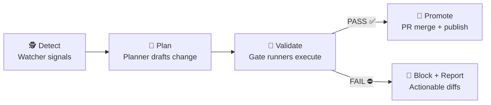

<div align="center">

# 🚦 Gate Runners (MCP)

_The deterministic, auditable “enforcement entrypoints” for KFM’s **Detect → Validate → Promote** pipeline._

<br/>


</div>

📍 **You are here:** `mcp/gates/runners/`

> 🧠 **Mental model:** A **gate** is a rule-set (“what must be true”). A **runner** is the executable wrapper (“how we check it”), producing consistent artifacts (reports + manifests) that CI, agents, and humans can trust.

---

## 🧭 Quick Nav

- [What lives here](#-what-lives-here)
- [How gates fit the KFM pipeline](#-how-gates-fit-the-kfm-pipeline)
- [Runner Contract](#-runner-contract)
- [Gate Catalog](#-gate-catalog)
- [Usage Patterns](#-usage-patterns)
- [Add a new Gate Runner](#-add-a-new-gate-runner)
- [Audit, Telemetry, and Rollback](#-audit-telemetry-and-rollback)
- [Security & Safety Defaults](#-security--safety-defaults)
- [Design References](#-design-references)

---

## 🧱 What lives here

This directory contains **standardized runner entrypoints** that execute KFM “gates” across:

- 📥 **Data ingestion** (raw → work → processed)
- 🗂️ **Catalog publishing** (STAC / DCAT / PROV)
- 🧬 **Provenance** (manifests, hashes, lineage bundles)
- 🛡️ **Governance & security** (license, classification, secrets/PII)
- 🤖 **AI outputs** (Focus Mode must cite; refuse if it can’t)
- 🗺️ **Geospatial integrity** (CRS sanity, geometry validity, map-friendly formats)
- 🧪 **Simulation / analysis artifacts** (deterministic runs, promotion checklist)

**Gate runners** are designed to be called from:
- ✅ Local dev workflows (pre-commit / CLI)
- ✅ CI pipelines (PR checks, release checks)
- ✅ Watcher–Planner–Executor automation (agents open PRs, but do **not** bypass gates)

---

## 🔁 How gates fit the KFM pipeline



### Non‑negotiable pipeline invariant 🧷
No stage is allowed to consume artifacts that haven’t cleared the prior stage’s **formal outputs + checks** (ETL → Catalogs → Graph → API → UI → Story Nodes → Focus Mode). Gates are how we keep that invariant real.

---

## 📜 Runner Contract

Gate runners must behave like **boring science instruments**: predictable, repeatable, and auditable.

### ✅ Inputs (minimum)
- `--target` (file/dir/glob, or a manifest of changed paths)
- `--mode` (typically `local` vs `ci`)
- `--run-id` (optional; if not provided, runner generates one deterministically or records it)
- `--config` (optional; config-driven operation is preferred)

### ✅ Outputs (minimum artifacts)
Every runner should emit:

1) **Gate report** (human + machine readable)
- Suggested name: `gate_report.json` (and/or `gate_report.md`)

2) **Run manifest** (provenance + reproducibility)
- Suggested name: `run_manifest.json`
- Includes: inputs, outputs, parameters, timestamps, tool versions, summary counts
- Includes: `idempotency_key`
- Includes: `canonical_digest` computed from canonicalized JSON (RFC 8785 pattern)

3) **Telemetry stream** (append-only event log)
- Suggested name: `telemetry.ndjson`
- One JSON object per line (event-sourcing friendly)

> 🧾 **Rule of thumb:** If CI fails, the runner must leave behind **enough evidence** for a human to fix the issue without guesswork.

### ✅ Exit codes
- `0` = pass ✅
- `1` = gate fail ⛔ (policy/schema violation)
- `2` = runner error 💥 (exception, misconfig, missing deps)

### ✅ Determinism + Idempotency
- Runners must prefer **config-driven** execution, seeded randomness, and stable ordering.
- Re-running the same gate with the same inputs must yield:
  - identical outputs **or**
  - differences that are explicitly logged and explained in the report.

### ✅ “Fail closed” philosophy 🚫
If the runner can’t verify something required (missing license, missing provenance, unknown sensitivity, etc.), it **fails**.

---

## 🧰 Gate Catalog

Below is the **canonical v13-aligned gate set** that runners in this folder should cover (either as individual runners or a composed “run-all”).

> ⚠️ Don’t assume all exist yet — treat this as the **contract + roadmap** for what belongs here.

| Gate (concept) | Typical runner name | What it enforces | Where it bites |
|---|---|---|---|
| 🧾 Schema gate | `gate_schema.*` | Dataset conforms to expected schema; metadata is valid JSON | Ingestion + PRs |
| 🗂️ Catalog gate | `gate_catalog.*` | STAC/DCAT/PROV required, complete, cross-linked | Publish + PRs |
| 📜 License gate | `gate_license.*` | No data without known license; required fields present | Ingestion + PRs |
| 🧷 Provenance gate | `gate_prov.*` | Provenance completeness; run manifests; lineage bundles | Ingestion + Promotion |
| 🏷️ Classification gate | `gate_classification.*` | Sensitivity classification present & **propagates** (no downgrades) | Everywhere |
| 🛡️ Policy Pack gate | `gate_policy_pack.*` | OPA/Conftest rules (e.g., provenance rule IDs, waiver rules) | CI hard-stop |
| 🤖 Prompt/AI gate | `gate_prompt.*` | Focus Mode outputs must cite; refuse if can’t cite | Runtime + CI |
| 🔐 Security gate | `gate_security.*` | Secrets scan, PII/sensitive content scan | PRs |
| 🧪 Simulation gate | `gate_sim_repro.*` | Deterministic runs; promotion checklist; pinned inputs/env | Workbench → Processed |
| 🗺️ Geo gate | `gate_geo_integrity.*` | CRS sanity, coordinate correctness, geometry validity | Geo assets |

---

## 🚀 Usage Patterns

Because this repo supports both human and agent workflows, gate runners should be usable in **three** ways:

### 1) 🧑‍💻 Local developer (fast feedback)
- Run a gate against a folder you touched
- Produce a readable report + a machine report

### 2) 🤖 CI pipeline (authoritative)
- Run against a PR diff (changed files)
- Block merge unless:
  - gates pass ✅
  - or an explicit waiver exists with approval (where allowed)

### 3) 🕵️🧠⚙️ W‑P‑E agents (governed automation)
- Watcher detects
- Planner drafts
- Executor opens PR
- **Gate runners still decide** if it’s promotable

> 🔥 **Kill switch expectation:** If the system is in “freeze mode”, runners should refuse to execute agent-driven writes and instead emit a report saying “automation disabled”.

---

## 🧩 Add a new Gate Runner

### ✅ Checklist (MCP-compliant)
1) **Name the gate**
   - Pick a stable ID / runner name (`gate_<domain>_<purpose>`)
2) **Define the contract**
   - Inputs, outputs, pass/fail criteria
3) **Implement deterministic execution**
   - stable ordering, seeded randomness, pinned tool versions
4) **Emit artifacts**
   - `gate_report.json`
   - `run_manifest.json` (with canonical digest)
   - optional `telemetry.ndjson`
5) **Integrate**
   - Add to “run-all” runner (if one exists)
   - Add CI wiring
6) **Test**
   - Unit tests for validators
   - Golden file tests for report output (stable snapshots)
7) **Document**
   - Update this README’s [Gate Catalog](#-gate-catalog)
   - Add any domain-specific caveats

### Suggested GateResult shape 🧾
```json
{
  "gate_id": "KFM-PROV-001",
  "runner": "gate_prov",
  "mode": "ci",
  "status": "fail",
  "summary": {
    "violations": 2,
    "warnings": 1
  },
  "violations": [
    {
      "rule_id": "KFM-PROV-001",
      "path": "data/processed/example/file.tif",
      "message": "Missing PROV activity bundle for generated artifact."
    }
  ],
  "artifacts": {
    "run_manifest": "data/audits/<run_id>/run_manifest.json",
    "telemetry": "data/audits/<run_id>/telemetry.ndjson"
  }
}
```

---

## 🧾 Audit, Telemetry, and Rollback

### 📌 Audit trail goals
- Every automated or semi-automated action should be:
  - **logged**
  - **traceable**
  - **replayable**
  - attributable to an agent or a human

### 🧯 Rollback compatibility
Runners should not “mutate the world” in a way that can’t be undone:
- Prefer generating artifacts into:
  - `data/work/...` (experimental)
  - then **promotion** to `data/processed/...` only via PR
- When something slips:
  - classification can be flipped to restrict access quickly
  - PRs can be reverted
  - policies can be strengthened (new rules)

---

## 🔐 Security & Safety Defaults

Gate runners should assume **adversarial** and **accidental** failure modes.

### Minimum safety rails ✅
- 🔒 **No secrets in Git** → secret scanning gate
- 🧍 **PII/sensitive content scans** → block or require governance review
- 🏷️ **Classification propagation** → outputs can’t be less restricted than inputs
- 🧾 **Evidence-first** → no unsourced narrative in Story Nodes or Focus Mode
- 🤖 **AI must cite** → if no supporting sources exist, refuse (don’t guess)

---

## 📚 Design References

<details>
<summary>📦 Project docs that inform this folder (kept here so runner decisions stay grounded)</summary>

### Core KFM Architecture & Governance
- **Kansas Frontier Matrix (KFM) – Comprehensive Architecture, Features, and Design**
- **Kansas Frontier Matrix (KFM) – Comprehensive Technical Documentation**
- **MARKDOWN_GUIDE_v13 (Master Guide scaffolding & invariants)**

### AI & Agents
- **Kansas Frontier Matrix (KFM) – AI System Overview 🧭🤖**
- **AI Concepts & more** (AI safety + system patterns)

### Data Intake / CI / Promotion
- **📚 KFM Data Intake – Technical & Design Guide**
- **🌟 KFM – Latest Ideas & Future Proposals**
- **Additional Project Ideas**
- **Innovative Concepts to Evolve KFM**

### UI / User-Facing Governance
- **KFM – Comprehensive UI System Overview**

### Geo / Mapping / Virtual Worlds
- **Maps–GoogleMaps–VirtualWorlds–Archaeological–Computer Graphics–Geospatial–webgl**
- (Geo integrity gate rationale: CRS, coordinate correctness, map-ready assets)

### General Engineering Foundations (polyglot + data discipline)
- **Data Management – Theories/Architectures/Data Science/Bayesian Methods**
- **Various programming languages & resources**

### MCP (documentation-first, reproducible engineering)
- **Scientific Method / Research / Master Coder Protocol Documentation**

</details>

---

### ✅ Definition of Done for this folder
- Gate runners exist for the minimum v13 gate set (or a clear roadmap exists)
- Each runner produces standardized artifacts (report + manifest)
- CI calls these runners and blocks merges on violations
- Documentation stays aligned with system invariants and governance rules

🧠 If you’re adding a new runner: **make it boring, deterministic, and extremely well-instrumented.** That’s how KFM stays trustworthy.
