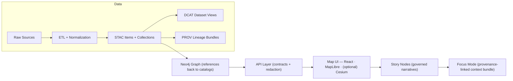

# 📖 MCP Glossary


> 🧭 **Shared vocabulary** for the Kansas Frontier Matrix (KFM) + the Master Coder Protocol (MCP).  
> If a term shows up in `docs/`, `src/`, `web/`, `pipelines/`, Story Nodes, or Focus Mode… it belongs here (or it should link to wherever it’s canonically defined).

---

## 🧠 What “MCP” means in this repo

In this project, **MCP** is intentionally overloaded:

- **MCP = Master Coder Protocol** 🧪  
  The scientific-method discipline we use to build KFM (evidence-first, reproducible, documented, reviewable).
- **`mcp/` = Methods & Computational Experiments** 🧪  
  The repo area where we store runs, notebooks, model cards, SOPs, experiment reports, and “research that ships.”

📌 This glossary lives at: `mcp/glossary/README.md` (you are here 👋)

---

## ✅ Non‑negotiables (project invariants)

- **Contract‑first** 🧾: schemas + API contracts are first-class artifacts (versioned + validated in CI).
- **Evidence‑first** 📦: data + provenance come **before** interpretation or narrative.
- **Deterministic pipelines** 🧰: same inputs + config ⇒ same outputs (idempotent, logged, reproducible).
- **AI is advisory** 🤖: Focus Mode must be evidence-backed and cite sources; no freeform “black box” answers.

---

## 🗺️ Big picture: KFM’s canonical pipeline



---

## 🧩 Legend (icons used in definitions)

- 🧭 = KFM product/platform concept  
- 🧪 = MCP workflow / research discipline  
- 🗺️ = GIS / mapping  
- 🤖 = AI / ML  
- 🧱 = architecture / infra / DevOps  
- 🛡️ = governance / ethics / security  
- 📦 = data / metadata / provenance  

---

## 📇 Acronyms & shorthand (quick scan)

| Acronym | Means | Typical “home” in the repo |
|---|---|---|
| **KFM** | Kansas Frontier Matrix | `docs/`, `web/`, `src/`, `data/` |
| **MCP** | Master Coder Protocol / Methods & Computational Experiments | `mcp/` |
| **STAC** | SpatioTemporal Asset Catalog | `data/stac/` |
| **DCAT** | Data Catalog Vocabulary | `data/catalog/dcat/` |
| **PROV** | W3C PROV (provenance model) | `data/prov/` |
| **FAIR** | Findable, Accessible, Interoperable, Reusable | `docs/governance/` |
| **CARE** | Collective Benefit, Authority to Control, Responsibility, Ethics | `docs/governance/` |
| **RAG** | Retrieval‑Augmented Generation | `src/ai/`, `mcp/runs/` |
| **LLM** | Large Language Model | `src/ai/`, `mcp/model_cards/` |
| **OPA** | Open Policy Agent (policy‑as‑code) | `src/policies/` |
| **RBAC/ABAC** | Access control models | `src/server/`, `docs/governance/` |
| **COG** | Cloud Optimized GeoTIFF | `data/processed/**` |
| **PMTiles** | Single‑file vector tile archive | `data/processed/**` |
| **CRS** | Coordinate Reference System | `pipelines/`, `data/**` |
| **ADR** | Architecture Decision Record | `docs/architecture/` |
| **CI/CD** | Continuous Integration / Deployment | `.github/workflows/` |

---

# 📚 Glossary

## 🧭 Platform & narrative concepts (KFM)

- **Kansas Frontier Matrix (KFM)** 🧭 — An open-source **geospatial knowledge hub** (“living atlas”) that fuses historical archives, GIS layers, remote sensing, real-time feeds, and analytics into an auditable map-first experience.
- **Frontier Matrix Network** 🧭 — The long-term idea that other regions can deploy compatible “Frontier Matrices” (e.g., Nebraska) and **federate** search + catalogs across instances.
- **Living atlas** 🧭 — A map + narrative system designed to evolve continuously as new datasets, layers, and stories are added (not a static “one and done” atlas).
- **Map behind the map** 🧭 — The principle that every visual layer has inspectable provenance: sources, transformations, version, and governance rules.
- **Layer** 🧭🗺️ — A user-visible map dataset (vector, raster, tiles, 3D, etc.) with metadata + provenance; never “just a file.”
- **Layer control panel** 🧭 — UI component to toggle layers, adjust style/opacity, and read quick metadata.
- **Layer Provenance panel** 🧭📦 — UI component that exposes dataset origin, processing steps, version IDs, and governance flags.
- **Provenance badge** 📦 — A compact UI indicator showing whether a dataset/story is fully provenance-linked (e.g., ✅ complete / ⚠️ partial / 🔒 restricted).
- **Story Node** 🧭 — A governed narrative artifact that is **machine-ingestible** and **provenance-linked** (claims and media must reference cataloged sources).
- **Storyboard JSON** 🧭 — A structured script (JSON) that drives map state through a Story Node: camera moves, layer toggles, time steps, annotations.
- **Story playback mode** 🧭 — UI mode that steps through a Story Node sequence (like “slides for maps”), updating the map/timeline automatically.
- **Focus Mode** 🧭🤖 — An interactive assistant experience that presents a Story Node *in context* using only provenance-linked content; AI suggestions must be constrained and cited.
- **Bookmarkable URL** 🧭 — A shareable URL that encodes app state (layers, time window, location, story step) so a view can be reproduced exactly.
- **Domain module** 🧭📦 — A “slice” of the platform organized around a topic (e.g., land treaties, air quality) with its own README/runbook and governed data flow.
- **Domain steward** 🧭🛡️ — Maintainer responsible for a domain’s data quality, provenance completeness, and governance/ethics checks.
- **Mapathon / datathon** 🧭 — Community event format for crowdsourcing data work or story creation (like a sprint, but social + educational).
- **Storytelling workshop** 🧭 — Community training focused on creating Story Nodes and interpreting data ethically with citations.

---

## 📦 Data, metadata & provenance

- **Catalogs** 📦 — The combined metadata system: **STAC** (assets), **DCAT** (discovery/distribution), **PROV** (lineage).
- **Boundary artifacts** 📦 — The required “evidence triplet” (STAC + DCAT + PROV). Data isn’t “published” until these exist.
- **Data lifecycle (raw → work → processed)** 📦 — Standard staging: `data/raw/` (immutable inputs) → `data/work/` (intermediate outputs) → `data/processed/` (final outputs).
- **`data/raw/`** 📦 — Source data as collected (treated as read-only; no silent edits).
- **`data/work/`** 📦 — Intermediate transforms and scratch outputs; OK to regenerate.
- **`data/processed/`** 📦 — Final, published outputs ready for API/UI consumption.
- **ETL** 📦 — Extract–Transform–Load. In KFM, ETL must be deterministic, logged, and provenance-producing.
- **ELT** 📦 — Extract–Load–Transform. Often used in warehouse workflows; KFM still requires determinism + provenance.
- **Normalization** 📦 — Converting heterogeneous inputs into standard formats, schemas, and (often) standard CRS.
- **Schema** 📦 — Machine-checked structure definition (JSON Schema, SQL schema, GraphQL SDL, etc.). Schemas are contracts, not suggestions.
- **Profile** 📦 — A “project-specific standard” that extends a base spec (e.g., a KFM STAC profile requiring extra fields).
- **STAC (SpatioTemporal Asset Catalog)** 📦🗺️ — Metadata standard used to describe assets by location/time and link to the actual files/services.
- **STAC Collection** 📦 — Group-level STAC metadata (dataset family, scope, license, keywords).
- **STAC Item** 📦 — Item-level metadata (a particular raster, vector snapshot, tile set, etc.).
- **STAC Asset** 📦 — A link inside a STAC Item pointing to an actual file/endpoint (plus content type, roles, checksums).
- **DCAT (Data Catalog Vocabulary)** 📦 — A standard for describing datasets for discovery and distribution (often serialized as JSON-LD/RDF).
- **DCAT Dataset entry** 📦 — The “find me” record: title, description, publisher, license, keywords, and distribution links.
- **DCAT distribution** 📦 — A concrete access path for a dataset (download URL, API endpoint, STAC link, registry artifact, etc.).
- **PROV (W3C PROV)** 📦 — A standard graph model for provenance/lineage: Entities, Activities, Agents.
- **PROV Entity** 📦 — A thing (dataset, file, STAC item, model output).
- **PROV Activity** 📦 — A process that transforms inputs into outputs (an ETL job, OCR run, model inference).
- **PROV Agent** 📦 — Who/what did it (person, pipeline, service account, approved agent).
- **Provenance** 📦 — The traceable story of how a thing was produced: sources, steps, parameters, and responsible agents.
- **Lineage** 📦 — Provenance with emphasis on *the chain*: raw inputs → transforms → published outputs.
- **Chain of custody** 📦🛡️ — Governance framing of provenance: who had access, who modified, and why.
- **Evidence artifact** 📦🧪 — Any derived product (analysis output, OCR corpus, AI-generated layer) treated as a first-class dataset with STAC/DCAT/PROV before UI/story use.
- **Contract artifact** 📦🧾 — A machine-validated specification defining an interface (schema, OpenAPI, GraphQL SDL, UI config contract).
- **Contract‑first** 📦 — Work starts from contracts; changes trigger strict validation + versioning.
- **Evidence‑first** 📦 — No narrative or AI answer without provenance-linked evidence.
- **Deterministic pipeline** 📦 — Idempotent, config-driven transforms that produce stable outputs for the same inputs.
- **Idempotent** 📦 — Running the same job twice doesn’t duplicate or mutate results unexpectedly.
- **Run manifest** 📦🧪 — A run record capturing code version/commit, parameters, environment, and output checksums.
- **Checksum / hash** 📦 — Integrity fingerprint of a file/artifact (used to detect tampering or drift).
- **Versioned outputs** 📦 — Avoid silent overwrites. Prefer explicit version tags or versioned folders (e.g., `_v1`, dates, or content digests).
- **PR-first modeling** 🧪📦 — Treat model outputs like code: ship results by pull request with provenance + review, not by “uploading blobs.”
- **Simulation run (`kfm-sim-run`)** 🧪 — A sandboxed, reproducible workflow to explore alternative scenarios without polluting production data.
- **Bias correction model (`kfm-air-correct`)** 🧪📦 — Domain-specific calibration (e.g., aligning low-cost sensor readings to reference stations) with parameters + provenance published alongside outputs.

---

## 🤖 AI & analytics (Focus Mode, models, RAG)

- **Advisory-only AI** 🤖🛡️ — AI provides suggestions/answers but must not act autonomously or publish uncited claims.
- **AI co‑pilot** 🤖 — A specialized assistant for a narrow workflow (story creation, query building, data intake), still evidence-based.
- **RAG (Retrieval‑Augmented Generation)** 🤖 — Pattern: retrieve relevant evidence (catalog + graph + docs) → generate a response grounded in that evidence.
- **Context bundle** 🤖📦 — The package of “what the user is looking at” (map state, timeline window, active layers) + retrieved citations given to the model.
- **Hard gate** 🛡️🤖 — A non-bypassable policy rule (e.g., “no citations ⇒ refuse”) enforced before responses are shown or actions are allowed.
- **Citation completeness** 🤖📦 — The requirement that answers reference specific datasets/assets (STAC/DCAT/PROV IDs, versions) instead of vague sources.
- **Ollama** 🤖🧱 — Local model runtime used to run LLMs on-prem/local hardware (privacy, cost control, offline capability).
- **Modelfile** 🤖 — Ollama build recipe that defines a custom model (base, parameters, system prompt, adapters).
- **Quantization** 🤖 — Compressing model weights (smaller/faster, sometimes lower quality). Often needed for local inference.
- **Embedding** 🤖 — Vector representation of text/data used for semantic search and retrieval.
- **Embedding model** 🤖 — Model that produces embeddings (separate from the “chat” LLM).
- **Vector store** 🤖🧱 — Database for embeddings + metadata (used by RAG to retrieve relevant chunks).
- **Reranker** 🤖 — A model or scoring step that re-orders retrieved results for relevance after initial search.
- **Prompt** 🤖 — Instruction + context given to the LLM (system + developer + user + evidence bundle).
- **Prompt filter** 🛡️🤖 — Sanitization and policy checks on prompts/inputs to reduce injection and unsafe outputs.
- **Hallucination** 🤖🛡️ — Confident model output not supported by evidence. In KFM, hallucination is a failure mode mitigated by hard gates + citations.
- **Explainable AI (XAI) panel** 🤖🧭 — UI surface that shows *why* the AI answered the way it did (which sources, which graph links, which datasets).
- **AI evidence artifact** 🤖📦 — AI output that becomes a dataset (e.g., an extracted corpus, predicted layer) and must ship with full provenance.

---

## 🧱 Architecture & infrastructure

- **Clean, multi-layer architecture** 🧱 — Separation of concerns: domain logic ≠ service orchestration ≠ integration adapters ≠ UI.
- **Subsystem** 🧱 — One of the canonical homes: pipelines, catalogs, graph, API, UI, story nodes, MCP experiments, etc.
- **Canonical home** 🧱 — “One source of truth per subsystem” (avoid duplicate implementations scattered across folders).
- **API boundary** 🧱🛡️ — The enforcement layer: UI cannot bypass API to access raw/processed data directly (governance + redaction live here).
- **Contract-first API** 🧱 — API shapes are defined by specs first (OpenAPI/GraphQL SDL) and validated in CI.
- **FastAPI** 🧱 — Python web framework used for the backend service layer (common KFM default).
- **GraphQL** 🧱 — Query language/API layer useful for complex graph-shaped queries and UI-driven data fetching.
- **GraphQL federation** 🧱 — Pattern to combine multiple GraphQL endpoints into one schema (useful for multi-region Frontier Matrix networks).
- **Neo4j** 🧱 — Graph database for relationships (events, entities, places, links) with references back to catalogs.
- **Cypher** 🧱 — Neo4j query language (used for ingest scripts, constraints, graph queries).
- **PostGIS** 🧱🗺️ — Geospatial extension of PostgreSQL (spatial indexing, geometry operations, spatial joins).
- **Spatial index** 🗺️🧱 — Data structure enabling fast geographic queries (e.g., R-tree, GiST).
- **MapLibre GL JS** 🧱🗺️ — WebGL map renderer for vector tiles and interactive maps.
- **CesiumJS** 🧱🗺️ — 3D globe/terrain engine (optional 3D layer in KFM).
- **WebGL** 🧱🗺️ — Browser GPU graphics API powering MapLibre/Cesium (performance budgets matter).
- **Vector tiles** 🗺️ — Map tiles encoded as features (fast styling, dynamic rendering).
- **Raster tiles** 🗺️ — Pre-rendered image tiles (fast display, less flexible styling).
- **COG (Cloud Optimized GeoTIFF)** 🗺️📦 — GeoTIFF layout optimized for HTTP range reads (good for large rasters).
- **PMTiles** 🗺️📦 — Single-file archive for tiles (simplifies hosting/distribution).
- **GeoParquet** 🗺️📦 — Columnar storage format for vector data (big-data-friendly geospatial).
- **Containerization (Docker)** 🧱 — Packaging apps with dependencies for repeatable execution and CI.
- **Docker Compose** 🧱 — Local multi-service orchestration (dev stacks, demos, reproducible runs).
- **Kubernetes** 🧱 — Cluster orchestration (deploying the full stack with scaling + resilience).
- **Helm chart** 🧱 — Kubernetes packaging template for reproducible deployments.
- **CI/CD** 🧱 — Automated checks/build/deploy pipelines (lint, tests, schema validation, security scans).
- **GitHub Actions** 🧱 — Common CI implementation in GitHub repos.
- **End-to-end (E2E) test** 🧱 — UI/system tests simulating real user flows (often via Playwright/Cypress).
- **IaC (Infrastructure as Code)** 🧱 — Managing infra with code (repeatable deployments, auditable changes).
- **Artifact** 🧱📦 — A versioned build output (container image, dataset bundle, model package, story release).
- **Artifact registry** 🧱 — Storage system for versioned artifacts (container registries can also store data “as OCI”).
- **OCI artifact** 🧱📦 — Treating data like software packages (pullable by digest/version; reproducible seeding and federation).

---

## 🛡️ Governance, ethics & security

- **FAIR principles** 🛡️ — Findable, Accessible, Interoperable, Reusable (data stewardship baseline).
- **CARE principles** 🛡️ — Collective Benefit, Authority to Control, Responsibility, Ethics (especially relevant to cultural/sovereign data).
- **Digital humanism** 🛡️ — Human-centered, transparency-first tech design; tools augment people rather than replace them.
- **Sovereignty** 🛡️ — Respecting community rights over culturally sensitive knowledge, including access controls and redaction rules.
- **Sensitive data classification** 🛡️ — Rules for handling restricted layers (PII, sacred sites, endangered species, unpublished research).
- **Redaction** 🛡️ — Removing or masking sensitive fields/geometry so a dataset can be shared safely.
- **Generalization** 🛡️🗺️ — Coarsening precision (e.g., rounding coordinates, reducing resolution) to reduce sensitivity while preserving utility.
- **Policy engine** 🛡️ — Central rules system used to approve/deny requests (and to document why).
- **OPA (Open Policy Agent)** 🛡️ — Common policy-as-code engine (evaluate ABAC/RBAC rules at runtime).
- **RBAC** 🛡️ — Role-Based Access Control (“Editors can publish stories; Viewers cannot”).
- **ABAC** 🛡️ — Attribute-Based Access Control (“This user can see this layer only if project=X and purpose=research”).
- **Audit trail** 🛡️ — Logs tracking access and transformations, enabling “who saw what and why” accountability.
- **Telemetry signal** 🛡️ — Standardized event record emitted by UI/API (e.g., redaction notice shown).
- **Authentication** 🛡️ — Proving identity (login).
- **Authorization** 🛡️ — Permission checks (what an identity can do/see).
- **Prompt injection** 🛡️🤖 — Malicious input aimed at bypassing instructions or exfiltrating data; mitigated via hard gates and strict tool policies.
- **Rate limiting** 🛡️ — Restricting request volume to protect services.
- **Sigstore** 🛡️🧱 — Supply-chain tooling for signing/verifying artifacts.
- **Cosign** 🛡️🧱 — Sigstore tool used to sign and verify artifacts (images/data bundles/models).
- **SLSA** 🛡️🧱 — Framework for software supply chain integrity levels (build provenance, tamper resistance).
- **Attestation** 🛡️🧱 — Cryptographically signed statement describing how an artifact was built and what it contains.
- **License** 🛡️ — Terms of use for data and media (must be recorded in catalogs and surfaced in UI).
- **Attribution** 🛡️ — Required credit to sources; should be preserved through pipelines and surfaced to users.
- **DOI** 🛡️📦 — A persistent identifier for a specific dataset version (nice-to-have for published releases and academic citation).
- **WCAG** 🛡️🧭 — Accessibility guidelines for web UIs (keyboard navigation, contrast, screen reader support).

---

## 🧪 MCP workflow & research discipline

- **Master Coder Protocol (MCP)** 🧪 — The project’s reproducible, scientific-method approach to building software + data products.
- **Documentation-first** 🧪 — “If it isn’t documented, it doesn’t exist.” Specs, decisions, and runs are captured as durable artifacts.
- **SOP (Standard Operating Procedure)** 🧪 — Step-by-step, repeatable process doc (e.g., “Add a new historical layer”).
- **Runbook** 🧪🧱 — Ops-style doc: how to run, debug, and recover a workflow/service.
- **Experiment report** 🧪 — Structured writeup for computational work: hypothesis, methods, results, limitations, reproduction steps.
- **Hypothesis** 🧪 — A falsifiable claim you can test with data (not a vibe 😄).
- **Methods section** 🧪 — The reproducibility core: parameters, code version, datasets used, environment.
- **Baseline** 🧪 — A reference approach to compare against (proves improvement is real).
- **Ablation study** 🧪 — Remove one component at a time to measure what actually matters.
- **Model card** 🧪🤖 — Documentation for ML models: training data, eval, limitations, intended use, risks.
- **Data datasheet** 🧪📦 — Documentation for datasets you produce (collection, fields, biases, ethics, governance).
- **Traceability matrix** 🧪📦 — A mapping from claims/features → evidence/tests → artifacts (helps audits and regressions).
- **ADR (Architecture Decision Record)** 🧪🧱 — Lightweight doc capturing a decision, options, and why we chose one.
- **Definition of Done (DoD)** 🧪 — Checklist stating what must be true before something is considered complete (tests, docs, provenance).
- **Validation gate** 🧪🧱 — CI checks that block merges if invariants are violated (schemas, provenance completeness, security scans).
- **Reproducible environment** 🧪🧱 — Container images / env files that ensure “works on my machine” becomes “works everywhere.”
- **Papermill** 🧪 — Tool for parameterizing and running notebooks reproducibly (often in CI).
- **DVC (Data Version Control)** 🧪📦 — Tracks data dependencies and pipeline artifacts so changes are reproducible and reviewable.
- **Notebook** 🧪 — Executable narrative analysis. In KFM, notebooks that generate outputs must produce metadata + provenance like any pipeline.

---

<details>
<summary><strong>🧰 Appendix: general web / programming terms</strong> (expand if you need it)</summary>

- **API** — Programmatic interface (KFM uses APIs to enforce governance + contracts).
- **HTTP** — Web protocol; relevant to caching, range requests (COGs), authentication, and API design.
- **REST** — Common API style using resource endpoints (`GET /layers/{id}`).
- **OpenAPI** — Machine-readable API specification (contract-first backend).
- **GraphQL SDL** — The schema definition language for GraphQL contracts.
- **JSON-LD** — JSON serialization for linked data (common in DCAT).
- **YAML front‑matter** — Metadata header used by some doc systems (useful for governed docs and GitHub Pages).
- **Git** — Version control; enables PR-first workflows for code + data + stories.
- **Python** — Primary language for pipelines/ETL and backend services.
- **R** — Statistical computing language (often used for domain notebooks and models).
- **SciPy / NumPy / Pandas** — Scientific Python stack used for modeling and data transforms.
- **MATLAB** — Engineering/science environment referenced in the project’s resource library.
- **ArcGIS** — ESRI GIS ecosystem (interop target for data formats/services; also relevant for contributors).
- **Apache Spark** — Distributed compute engine (relevant for big-data geospatial workflows).
- **TypeScript** — Typed JavaScript used in the `web/` frontend.
- **CSS** — Styling language for UI (design system + accessibility).
- **Linux** — Common runtime environment for servers and CI runners.
- **Data compression** — Techniques that matter for tiles/rasters (transfer cost and caching performance).

</details>

---

## 🗂️ Suggested repo layout (mental model)

```text
📁 data/                     # raw/work/processed + catalogs
📁 docs/                     # canonical governed documentation
📁 schemas/                  # JSON Schemas for STAC/DCAT/PROV/story/UI/telemetry
📁 src/                      # pipelines, graph, server (API), policies
📁 web/                      # React/TypeScript + MapLibre (+ optional Cesium)
📁 mcp/                      # 🧪 Methods & Computational Experiments
  ├── 📁 glossary/           # 📖 shared vocabulary (this file)
  ├── 📁 runs/               # experiment run logs + manifests
  ├── 📁 notebooks/          # governed notebooks
  ├── 📁 model_cards/        # model documentation
  └── 📁 sops/               # SOPs + runbooks
```

---

## ✍️ Contributing to this glossary

**Add or update terms whenever you:**
- introduce a new acronym, workflow, dataset class, model type, UI component, or governance concept
- notice ambiguity between disciplines (history ↔ GIS ↔ data engineering ↔ ML)

**Mini checklist (PR-friendly):**
- [ ] Term is **searchable** (spell it the way people actually write it)
- [ ] Definition is **project-specific** (not a generic encyclopedia entry)
- [ ] Includes a “see also” when a related term exists
- [ ] If it impacts governance, mark it 🛡️ and name the policy surface (API/OPA/CI)

---

## 📚 Reference library (project docs + portfolios)

This glossary is compiled from KFM’s internal architecture/design documentation and the curated reference portfolios embedded in the repo’s “📚 library” PDFs.

**Primary KFM docs (project-specific):**
- KFM platform overview + roadmap (architecture vision, federation, PR-first modeling, community workflows)
- KFM technical documentation + UI technical architecture guide
- KFM AI system overview + Ollama integration notes
- KFM v13 Markdown / repo structure guide (contract-first + evidence-first + pipeline invariants)
- Open-source mapping hub design + MCP (SOPs, model cards, datasheets, glossary expectations)

**Reference portfolios (supporting knowledge):**
- AI/ML concepts portfolio (LLMs, NLP, responsible AI)
- GIS / mapping / WebGL / virtual worlds portfolio
- Data management + Bayesian + data science portfolio
- DevOps + Git + HTTP + Docker + security portfolio
- Geographic information + ArcGIS + Spark + TypeScript portfolio

> 🧩 Rule of thumb: if a concept is used in a PR description, CI gate, pipeline manifest, Story Node template, or Focus Mode policy… it deserves a crisp definition here.