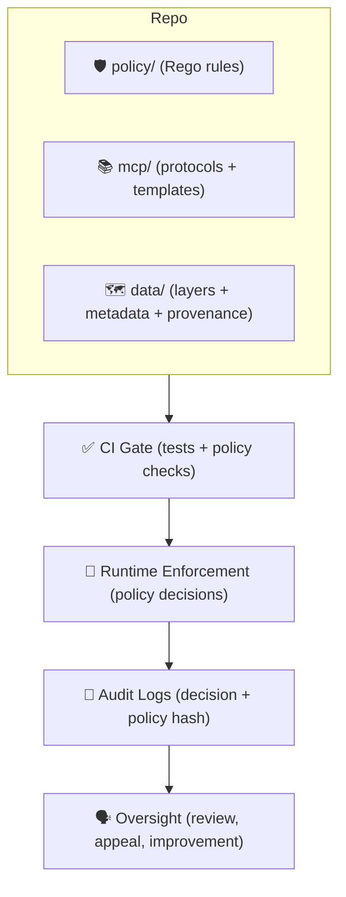

<!-- File: mcp/governance/README.md -->

# 🧭 MCP Governance (Policy • Risk • Accountability)


> [!IMPORTANT]
> If you are changing **what data can be accessed**, **what the AI assistant can say**, or **how outputs are validated/audited**, you’re in the right place ✅

This folder defines the governance layer for the **Master Coder Protocol (MCP)** within the Kansas-Matrix ecosystem (e.g., KFM-style provenance-first systems). Governance here means:
- **Rules you can read** 📖
- **Rules you can enforce** 🚦
- **Rules you can audit** 🧾
- **Rules the community can challenge & improve** 🗣️

---

## 📚 Table of Contents

<details>
<summary><b>Click to expand</b> 🧩</summary>

- [🎯 Purpose](#-purpose)
- [🧱 Governance Pillars](#-governance-pillars)
- [🛡️ Governance-as-Code Stack](#️-governance-as-code-stack)
- [👥 Roles & Responsibilities](#-roles--responsibilities)
- [🔁 Change Management](#-change-management)
- [🗂️ Data Governance](#️-data-governance)
- [🤖 AI Governance](#-ai-governance)
- [🧪 Research & Experiment Governance](#-research--experiment-governance)
- [🧾 Auditability, Incidents, and Appeals](#-auditability-incidents-and-appeals)
- [📁 Recommended Folder Map](#-recommended-folder-map)
- [🧰 Templates](#-templates)

</details>

---

## 🎯 Purpose

Governance exists to keep the system **evidence-backed**, **transparent**, **collaborative**, and **ethically grounded**—even as capabilities grow (more data, more models, more users, more automation). 🧭✨

**MCP governance** formalizes how we:
- protect sensitive data (without blocking legitimate research),
- enforce provenance + metadata expectations,
- constrain AI behavior to avoid misinformation / privacy leaks,
- ensure decisions are reviewable under the exact policy version used,
- keep “nothing about us without us” community oversight real (not decorative). 🤝

---

## 🧱 Governance Pillars

### 1) 📌 Provenance-first, always
If a layer, story, claim, or AI answer can’t be traced to sources, it’s not done yet.  
**Provenance is a feature, not paperwork.**

### 2) 🧬 Policies are versioned like code
Governance rules live in the repo and evolve through the same rigorous workflow as software:
- PR review
- CI checks
- reproducible decisions
- visible history

### 3) 🪜 Tiered access + community control
Not all data should be equally accessible. We support tiered access patterns for sensitive materials (e.g., protected locations), and we treat community rights as first-class constraints—not afterthoughts. 🌾🛑

### 4) 🧾 Auditability over vibes
When the system denies, masks, or refuses:
- it should be explainable,
- it should be repeatable,
- and it should be attributable to a specific **policy version**.

### 5) 🧰 Documentation-first engineering (MCP)
If it isn’t documented, it isn’t reproducible.  
MCP governance is the glue that keeps docs, experiments, and decisions coherent over time. 📚🔬

---

## 🛡️ Governance-as-Code Stack

Governance is enforced in **three layers**:



### ✅ CI enforcement (shift-left)
Policy checks run during PRs so violations don’t ship. Typical examples:
- missing provenance/metadata artifacts,
- disallowed content patterns,
- incomplete licensing/citation fields.

### 🚦 Runtime enforcement (the system lives by the rules)
At runtime, the API can evaluate policies for:
- dataset access decisions,
- response masking/sanitization,
- AI assistant refusals or constrained answers.

### 🧾 Audit logs + versioned policies
We treat “what rule was active?” as non-negotiable.  
Decisions should be traceable to the **policy bundle hash / commit** that produced them.

---

## 👥 Roles & Responsibilities

> [!NOTE]
> These are “governance roles” (decision + accountability roles), not job titles.

### 🧑‍💻 Core Roles
- **Maintainers (Owners)** 🏗️  
  Final merge authority, release stewardship, escalation responsibility.
- **Policy Maintainers (Stewards)** 🛡️  
  Own policy correctness, maintain Rego rules/tests, handle policy PRs.
- **Data Stewards** 🗂️  
  Own data classification, licensing/citations, provenance completeness, and sensitive-data handling.
- **AI Safety Stewards** 🤖🧯  
  Own AI constraints (refusal, citation requirements, privacy rules), and coordinate high-risk changes.
- **Reviewers** 👀  
  Provide peer review for PRs touching governance-critical surfaces.
- **Contributors** 🌱  
  Submit PRs/issues, follow templates, provide evidence + provenance, respect classifications.

### 🧭 Oversight Role (recommended for high-impact systems)
- **Ethics / Community Advisory Board** 🧑‍🤝‍🧑  
  Independent oversight for high-risk changes (sensitive datasets, model behavior, community protections).  
  This board should be empowered to recommend changes, request pauses, and require mitigations.

---

## 🔁 Change Management

### What counts as a “governance change”?
A change is governance-critical if it affects any of the following:
- access control / permissions 🔐  
- data classification or masking 🕵️‍♀️  
- provenance or metadata requirements 🧬  
- AI assistant behavior and safety constraints 🤖  
- audit logging / traceability 🧾

### The governance change loop ♻️
1) **Open a proposal** (Issue or PR) 🧩  
   Include: motivation, scope, expected impact, and rollback plan.
2) **Attach evidence** 📎  
   Cite sources, link experiments, include example requests/responses if applicable.
3) **Update policy-as-code** 🛡️  
   Modify rules/tests so the new governance is enforceable and measurable.
4) **Run checks** ✅  
   CI must pass (tests + policy checks).
5) **Review + merge** 🔀  
   Reviewers validate intent + enforcement. Maintain rationale in the PR thread.
6) **Observe & iterate** 📈  
   Monitor logs/feedback; refine governance as real-world edge cases appear.

> [!TIP]
> Governance is iterative: map risks → manage → measure → mitigate → monitor → repeat. 🔁

---

## 🗂️ Data Governance

### 🧾 Data classification (baseline)
A minimal classification scheme looks like this:

| Classification | Typical use | Access pattern | Extra handling |
|---|---:|---|---|
| **Public** 🌍 | openly shareable datasets | broad read access | still requires citation + license |
| **Internal** 🏢 | non-public but non-sensitive | limited to project roles | prevent accidental publishing |
| **Confidential** 🔒 | sensitive but research-usable | “selected users” | strict logging + purpose limits |
| **Restricted** 🛑 | protected locations / high-risk data | “selected users” (narrow) | masking/sanitization defaults |

> [!IMPORTANT]
> Sensitive materials (e.g., precise archaeological site locations) should default to **Restricted** with masking rules available (rounding coordinates, removing fields, etc.).

### 🧱 Canonical pipeline order (no bypassing)
Data must flow through a predictable chain so it is vetted and cataloged:

**Raw → Processed → Catalog/Prov → Database → API → UI** ✅

Any proposal that shortcuts this order must justify why it’s safe and how it preserves provenance + governance controls.

### ♻️ FAIR + CARE operationalization
Governance must enforce:
- **FAIR** (Findable, Accessible, Interoperable, Reusable) ✅  
  e.g., metadata completeness, license clarity, interoperable formats.
- **CARE** (Collective Benefit, Authority to Control, Responsibility, Ethics) 🤝  
  e.g., tiered access, community protections, respectful use constraints.

---

## 🤖 AI Governance

### 🧠 The AI assistant is not an ungoverned chatbot
The assistant must be policy-constrained to:
- avoid leaking restricted/confidential data,
- refuse disallowed content,
- provide citations for claims where required,
- keep outputs aligned with project ethics and community standards.

### 🧯 “Kill switch” + continuity
AI systems are dynamic. Governance should include:
- a clear ability to pause/disable high-risk behavior (“kill switch”),
- rollback procedures,
- business continuity / disaster recovery patterns for core workflows.

### 🧩 Operating model (recommended)
Adopt a governance operating model that’s:
- multilayered, multidisciplinary, multifaceted, and multi-jurisdictional, and built on:
  **People • Principles • Policies • Processes • Platforms • Power**.

---

## 🧪 Research & Experiment Governance

MCP treats documentation as a first-class deliverable 📚. To keep research reproducible:

### 🔬 Experiments follow the scientific method
Every significant experiment should document:
- question/problem,
- background research + citations,
- hypothesis,
- methods/protocol,
- data collection and labeling,
- analysis plan,
- results + traceable artifacts,
- conclusions + limitations,
- next steps.

### 🧾 Protocol templates + numbering
Use templates like `EXP-001`, `EXP-002`, etc.  
If a protocol is adapted from prior work, cite it.

### 👀 Peer review + replication
Important claims should be independently reproducible by another contributor using the documented protocol. This validates both the method and the documentation clarity.

---

## 🧾 Auditability, Incidents, and Appeals

### 🧾 Audit logs should answer:
- Who requested what?
- What was decided?
- Under which policy version (hash/commit)?
- What sanitization/refusal rule applied?
- What evidence/rationale is attached?

### 🚨 Incidents
If governance fails (e.g., a leak, misclassification, unsafe AI output), we want:
- fast containment,
- a transparent incident report,
- a policy fix + test so it can’t recur.

### 🗣️ Appeals & community challenges
When community members challenge a decision, we can replay the decision context under the historical policy version and show:
- the rule that applied,
- what inputs triggered it,
- how to propose an improvement.

---

## 📁 Recommended Folder Map

> [!NOTE]
> This folder map is a suggested structure for keeping governance artifacts organized. Add what you need; keep it tidy.

```text
📂 mcp/
└── 📂 governance/
    ├── 📄 README.md                # (this file) 🧭
    ├── 📂 decisions/               # ADRs / Governance Decisions 🗳️
    ├── 📂 risk/                    # Risk register entries 📉
    ├── 📂 incidents/               # Incident reports + postmortems 🚨
    ├── 📂 templates/               # Proposal + incident templates 🧰
    └── 📂 audits/                  # Audit snapshots / exports 🧾
```

---

## 🧰 Templates

<details>
<summary><b>🧩 Governance Change Proposal (template)</b></summary>

**Title:** `GOV-###: <short name>`

- **Motivation:** Why this change?
- **Scope:** What is affected (data / AI / policy / audit / UX)?
- **Risk assessment:** What can go wrong? Who is impacted?
- **Policy changes:** What rules must be updated or added?
- **Tests / CI:** What fails before and passes after?
- **Runtime behavior:** Example requests + expected decisions
- **Rollout plan:** How to deploy safely?
- **Rollback plan:** How to revert if needed?
- **Community notes:** Any CARE/community-sensitive impacts?

</details>

<details>
<summary><b>🚨 Incident Report (template)</b></summary>

**Title:** `INC-###: <short name>`

- **Summary:** What happened?
- **Impact:** Data exposed? Incorrect outputs? Service disruption?
- **Detection:** How did we find out?
- **Timeline:** Key timestamps
- **Root cause:** Technical + process contributors
- **Immediate containment:** What stopped the bleeding?
- **Corrective actions:** Policy changes + code changes + tests
- **Prevention:** What guardrails are added?
- **Policy version:** Which policy commit/hash was active?

</details>

---

## ✅ Governance “Done” Checklist

- [ ] Data + outputs are provenance-backed 🧬  
- [ ] Classification + access rules are explicit 🔐  
- [ ] Policies are enforced in CI and/or runtime 🚦  
- [ ] Decisions are auditable to a policy version 🧾  
- [ ] Community impact is considered (CARE) 🤝  
- [ ] Experiments/results are reproducible (MCP) 📚🔬  

---

### 🧭 Closing thought
Governance is not bureaucracy. It’s the **infrastructure of trust**—so the atlas, models, and narratives can scale without becoming a black box. 🌾🗺️✨