# 🧺 MCP Harvests — Data Intake & Provenance Pipelines


> **Harvests** are **reproducible, reviewable intake jobs** that pull data from external sources and turn it into **KFM-ready artifacts** — **raw → processed → catalog → provenance**.  
> Think: “**the map behind the map**” 🗺️🔍 — every layer can be traced back to where it came from and how it was produced.

---

## 🧭 What lives in `mcp/harvests/`

This folder is the **home of harvest definitions**, runbooks, and (optionally) code stubs for turning a source into:

- ✅ **Immutable inputs** (raw source files)
- ✅ **Deterministic outputs** (processed datasets)
- ✅ **Evidence-first metadata** (catalog artifacts)
- ✅ **Lineage** (provenance documents)
- ✅ **Validation + QA** (tests, checksums, schema checks)

If a dataset is in the platform, there should be a harvest (or a chain of harvests) that can **reproduce it end-to-end**.

---

## 🧠 Why “Harvests” (and not “ETL scripts”)

Harvests implement the platform’s core governance values:

- **Provenance-first transparency** (no black boxes)
- **FAIR + CARE** data ethics 🛡️
- **Human-in-the-loop** review for sensitive or high-impact layers
- **Deterministic & idempotent** pipelines (same input → same output)

---

## 📦 Expected artifact flow (Raw → Processed → Catalog)

A harvest is expected to follow this data flow pattern:

```
data/raw/        # immutable source drops (downloaded or deposited)
data/work/       # scratch / intermediate outputs (safe to delete/rebuild)
data/processed/  # stable, versioned, shareable outputs
data/catalog/    # discovery metadata (STAC + DCAT, etc.)
data/provenance/ # lineage (PROV documents, run manifests)
```

> ✋ **No manual edits** to `data/processed/` (or databases) as a “quick fix”.  
> Fixes happen in **code/config**, then re-run the harvest so the change is repeatable.

---

## 🧾 The Harvest Contract (what every harvest must declare)

Each harvest should provide a **machine-readable manifest** (YAML or JSON) plus a human-readable runbook.

### ✅ Minimum manifest fields

- `id`: stable harvest identifier (kebab-case recommended)
- `kind`: `dataset` | `catalog` | `documents` | `simulation-inputs` (extendable)
- `source`: URLs, contacts, publisher, license, attribution
- `inputs`: expected files/types + checksums (if available)
- `outputs`: dataset IDs + output formats
- `crs`: spatial reference (if geospatial)
- `extent`: bbox/time range when known
- `sensitivity`: `public` | `restricted` | `sensitive` + handling rules
- `steps`: fetch → transform → validate → load → emit_metadata
- `metadata`: which artifacts are emitted (STAC/DCAT/PROV)
- `provenance`: run-id, parameters, software + model versions (if AI-assisted)

### 🧑‍🏫 Minimum runbook (`runbook.md`)

- What the dataset is and why we ingest it
- How to run locally (and expected runtime)
- Known caveats / limitations
- Validation checklist and acceptance criteria
- Troubleshooting

---

## 🧱 Standard metadata output: the “evidence triplet” 🧬

Every dataset harvest should emit a **catalog triplet**:

1. **STAC** (spatial/temporal, assets, links, licensing)
2. **DCAT** (dataset catalog record for portals/indexers)
3. **PROV** (lineage: inputs, parameters, code version, timestamps)

This is what makes layers **findable** and **auditable**, and enables external catalog harvesting too.

---

## 🔁 Pipeline roles (how harvests are usually composed)

Harvests tend to follow these roles:

- 👀 **Watcher** — detects new inputs or schedules work
- 🧠 **Planner** — decides what to run (full refresh vs incremental)
- 🏃 **Executor** — runs the job in a controlled environment
- 📥 **Fetcher** — downloads / receives raw inputs
- 🧹 **Transformer** — cleans, normalizes, converts formats, reprojects
- ✅ **Validator** — schema checks, geometry validity, QA gates
- 🧰 **Loader** — writes processed artifacts + (optionally) loads DB/graph
- 🏷️ **Metadata Emitter** — writes STAC/DCAT/PROV

### 🗺️ Lifecycle diagram

```mermaid
flowchart TD
  W[👀 Watcher] --> P[🧠 Planner]
  P --> E[🏃 Executor]
  E --> F[📥 Fetcher]
  F --> R[(data/raw)]
  R --> T[🧹 Transformer]
  T --> X[(data/work)]
  X --> V[✅ Validator]
  V --> O[(data/processed)]
  O --> L[🧰 Loader]
  L --> M[🏷️ Metadata Emitter]
  M --> C[(data/catalog)]
  M --> PV[(data/provenance)]
```



---

## 🧪 Quality gates (non-negotiables)

Before a harvest can be considered “good”, it should pass:

### ✅ Data quality

- Basic sanity checks (row counts, null ratios, bounds)
- Duplicate detection / stable IDs
- Deterministic outputs (same inputs → same hashes)

### 🗺️ Geospatial integrity (if applicable)

- CRS explicitly known (no “mystery projection”)
- Geometry validity checks
- Bounding box sanity (Kansas extent, if Kansas-specific)
- Prefer cloud-friendly formats where appropriate (e.g., COGs for rasters)

### 📚 Metadata completeness

- License, attribution, source links
- STAC/DCAT/PROV present and internally consistent
- Provenance references include code/config versions

---

## 🛡️ Governance & safety (FAIR + CARE in practice)

Harvests must respect:

- **Sensitive datasets** (e.g., vulnerable site locations, private data)
- **Aggregation rules** (when precision must be reduced)
- **Access policies** (public vs restricted layers)
- **Auditability** (every transformation is logged and reproducible)

> If a harvest touches sensitive material: **default to “restrict + document”** ✅  
> Then add explicit policy + review steps before publication.

---

## 🤖 AI-assisted harvests (Focus Mode friendly)

Some harvests will include AI-assisted steps like:

- OCR / transcription
- entity extraction (places, events, people)
- semantic tagging
- embeddings for retrieval

### Rules of the road 🧭

- AI is **advisory**, not autonomous
- Every output must still be **evidence-backed**
- Record model + parameters in provenance (especially if using local LLMs)

> If you use a local model runtime (e.g., Ollama), treat the model like a dependency:
> version it, log it, and make outputs reproducible.

---

## 🧰 Adding a new harvest (checklist)

### 1) Create the harvest folder 🗂️

Example pattern:

```
mcp/harvests/
  <harvest_id>/
    harvest.yaml
    runbook.md
    src/
    tests/
```

### 2) Register the source 🧾

- Add/append the source record in your `data/sources/*.json`
- Include license + attribution
- Include a stable source ID

### 3) Implement the pipeline steps 🧱

At minimum:

- fetch → raw
- transform → processed
- validate
- emit STAC/DCAT/PROV

### 4) Add QA + reproducibility hooks ✅

- deterministic IDs
- stable sorting
- fixed random seeds (if any)
- checksums for downloaded inputs where possible

### 5) Write the runbook 🧑‍🏫

Make it easy for someone else to re-run your work.

### 6) Submit PR with proof 📌

PR should include:

- manifest + runbook
- produced metadata artifacts
- validation evidence (logs, small summaries, test output)

---

## 🧷 A tiny manifest example (starter template)

```yaml
id: kansas_wind_farms
kind: dataset
version: "2026-01-26"
source:
  name: "Example Publisher"
  license: "CC-BY-4.0"
  url: "https://example.org/datasets/wind_farms"
inputs:
  - type: "zip"
    expected: "wind_farms.zip"
outputs:
  - dataset_id: "kfm.energy.wind_farms"
    format: "geojson"
spatial:
  crs: "EPSG:4326"
  extent_bbox: [-102.05, 36.99, -94.59, 40.00]
metadata:
  emit: ["stac", "dcat", "prov"]
governance:
  sensitivity: "public"
  notes: "No restricted fields present."
```

---

## 🧯 Common anti-patterns (please don’t 🙃)

- ❌ “I fixed it in the DB directly”
- ❌ output without provenance
- ❌ “trust me bro” datasets (no source license/attribution)
- ❌ silent coordinate changes (reprojection without documenting CRS)
- ❌ non-deterministic joins / unstable sorting
- ❌ AI-generated facts without citations

---

## 📚 Project reference library (design + research shelf)

> These documents define the bigger system expectations that harvests should align with.

<details>
<summary>📎 Click to expand</summary>

### 🧭 Core KFM architecture docs
- Kansas Frontier Matrix (KFM) – Comprehensive Technical Documentation.pdf
- Kansas Frontier Matrix (KFM) – Comprehensive Platform Overview and Roadmap.pdf
- Kansas Frontier Matrix (KFM) – Comprehensive Architecture, Features, and Design.pdf
- 📚 Kansas Frontier Matrix (KFM) – Expanded Technical & Design Guide.pdf
- Kansas Frontier Matrix (KFM) – Comprehensive UI System Overview (Technical Architecture Guide).pdf
- Kansas Frontier Matrix (KFM) – AI System Overview 🧭🤖.pdf
- KFM AI Infrastructure – Ollama Integration Overview.pdf

### 🧰 Engineering + research bundles (PDF portfolios)
- AI Concepts & more.pdf
- Various programming langurages & resources 1.pdf
- Data Managment-Theories-Architures-Data Science-Baysian Methods-Some Programming Ideas.pdf
- Mapping-Modeling-Python-Git-HTTP-CSS-Docker-GraphQL-Data Compression-Linux-Security.pdf
- Geographic Information-Security-Git-R coding-SciPy-MATLAB-ArcGIS-Apache Spark-Type Script-Web Applications.pdf
- Maps-GoogleMaps-VirtualWorlds-Archaeological-Computer Graphics-Geospatial-webgl.pdf

</details>

---

## 🤝 Contributing

- Keep harvests **small, composable, and reviewable**
- Prefer **config-driven** behavior over hardcoded constants
- Treat metadata + provenance as **first-class outputs**
- If you’re unsure: ship a minimal “manifest + fetch + metadata” first, then iterate

---

## ✅ Definition of Done (DoD) for a Harvest

- [ ] Manifest exists and is complete
- [ ] Runbook exists and is clear
- [ ] Inputs stored under `data/raw/`
- [ ] Outputs stored under `data/processed/`
- [ ] STAC/DCAT/PROV emitted and linked
- [ ] Validation checks pass
- [ ] Provenance references code/config versions
- [ ] Governance/sensitivity documented
- [ ] Re-running yields the same outputs (or explainable version bump)

---

🧡 Welcome to the Frontier — ship harvests that **anyone can reproduce**.