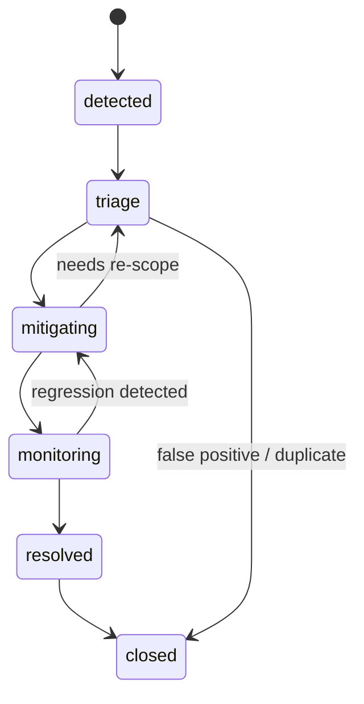

# 🚨 Incidents — MCP Module (Kansas Frontier Matrix)


> [!IMPORTANT]
> In KFM, **incidents are evidence-backed artifacts** — not “chat messages.”
> If it isn’t reproducible, attributable, and reviewable, it isn’t “done.”

---

## 🎯 What this module is

This directory is the **Incidents protocol + toolkit** for the Kansas Frontier Matrix (KFM) project:

- 🧾 **Incident Records**: a standardized, version-controlled format for reporting problems
- 🧩 **Evidence Manifests**: machine-readable proof (inputs, queries, logs, artifacts)
- 🧯 **Runbooks**: repeatable steps for triage → containment → fix → verification
- 🧠 **Automation Hooks**: CI/agents/health-checks that *create* and *update* incidents
- 🧭 **Governance Alignment**: classification, sensitivity, audit trails, and “fail-closed” gates

This lives under `mcp/` because KFM treats *operational discipline* (SOPs, runbooks, checklists) as a first-class, shareable system module.  [oai_citation:0‡Kansas-Frontier-Matrix_ Open-Source Geospatial Historical Mapping Hub Design.pdf](file-service://file-ShqHKgjxCS9UT9vbcxDNzA)

---

## 🧠 What counts as an “incident” in KFM?

Incidents cover anything that risks **trust, integrity, availability, or ethics**, including:

- 🧱 **Data integrity**: broken provenance links, orphaned STAC/DCAT/PROV nodes, schema drift
- 🧪 **Pipeline / CI failures**: failing policy gates, failing validations, failed ingest runs
- 🔐 **Security / secrets / PII**: sensitive data exposure, missing classification, leaked keys
- 🧬 **Model & AI integrity**: drift, out-of-distribution behavior, missing citations
- 🗺️ **UI trust regressions**: missing provenance display, wrong attribution, misleading overlays
- 📦 **Artifact integrity**: unsigned / tampered / wrong-digest artifacts (OCI + Cosign workflows)

> [!NOTE]
> This module is for **system + governance incidents**.  
> KFM also models “real-world events” (e.g., floods, droughts) as *data* — those typically belong in Story Nodes / Pulse Threads, not ops incident logs.

---

## 📌 Table of Contents

- [🚀 Quickstart](#-quickstart)
- [🧱 Design principles](#-design-principles)
- [🗂️ Recommended layout](#️-recommended-layout)
- [🧾 Incident record schema](#-incident-record-schema)
- [🧾 Evidence & run manifests](#-evidence--run-manifests)
- [🔁 Lifecycle & severity](#-lifecycle--severity)
- [🤖 Automation & detection sources](#-automation--detection-sources)
- [🧯 Runbooks](#-runbooks)
- [🧩 Integrations](#-integrations)
- [📦 Reference portfolios](#-reference-portfolios)
- [📚 Source anchors](#-source-anchors)

---

## 🚀 Quickstart

### 1) Create an incident record folder
Create a new incident directory (PR-first ✅):

- `mcp/incidents/logs/YYYY/YYYY-MM-DD_INC-####_<short_slug>/`

### 2) Fill in the minimum record
- `incident.yml` (metadata + routing + links)
- `timeline.md` (what happened, what we did, timestamps)
- `evidence/evidence_manifest.yml` (proof bundle)

### 3) Open a PR + label it
Suggested labels (adapt to your tracker):
- `incident`
- `sev0|sev1|sev2|sev3`
- `data_layer_request` / `ci_failure` / `security` / `governance`

### 4) Resolve through verifiable changes
- Fix through code/data/metadata PRs (no bypass)
- Add verification steps (re-run checks, health checks, queries)
- Close with a postmortem + a “prevention delta” (policy/test/runbook upgrade)

---

## 🧱 Design principles

KFM’s incident discipline is shaped by a few non-negotiables:

1) **Provenance-first**
- Every claim, fix, and dataset change is traceable (STAC/DCAT/PROV) — including streaming data.  [oai_citation:1‡📚 Kansas Frontier Matrix (KFM) Data Intake – Technical & Design Guide.pdf](file-service://file-EbUCdsJMbu5KwpoKMrLrgj)

2) **Fail-closed governance**
- Policy-as-code gates (OPA + Conftest) block non-compliant changes, for humans *and* agents.  [oai_citation:2‡Additional Project Ideas.pdf](file-service://file-Pc2GNivcrHBeKjBQksLC3T)

3) **PR-first operations**
- Changes flow through reviewable PRs; even automated workflows generate PRs rather than pushing directly.  [oai_citation:3‡Additional Project Ideas.pdf](file-service://file-Pc2GNivcrHBeKjBQksLC3T)

4) **Evidence bundles, not vibes**
- Incidents must include reproducible evidence manifests + (when relevant) run manifests.  [oai_citation:4‡Additional Project Ideas.pdf](file-service://file-Pc2GNivcrHBeKjBQksLC3T)

5) **Human-in-the-loop for high stakes**
- High-severity narratives and sensitive interpretations require review/approval and are auditable in the governance ledger.  [oai_citation:5‡Additional Project Ideas.pdf](file-service://file-Pc2GNivcrHBeKjBQksLC3T)

6) **Respect data sensitivity + CARE**
- Cultural protocols, classification, and ethical controls are core — incidents may be triggered by sensitivity violations.  [oai_citation:6‡Innovative Concepts to Evolve the Kansas Frontier Matrix (KFM).pdf](file-service://file-G71zNoWKxsoSW44iwZaaCC)

---

## 🗂️ Recommended layout

> [!TIP]
> Your repo may already differ — treat this as the “golden layout” we converge toward.

```text
📦 mcp/
└─ 🚨 incidents/
   ├─ 📄 README.md                 ← you are here
   ├─ 📂 templates/                ← copy/paste starters
   │  ├─ 📄 incident.yml
   │  ├─ 📄 timeline.md
   │  ├─ 📄 postmortem.md
   │  └─ 📄 evidence_manifest.yml
   ├─ 📂 runbooks/                 ← SOPs & checklists
   │  ├─ 🧯 graph-integrity.md
   │  ├─ 🧯 policy-gate-failure.md
   │  ├─ 🧯 pipeline-stall.md
   │  ├─ 🧯 sensitive-data-leak.md
   │  └─ 🧯 ui-provenance-regression.md
   ├─ 📂 logs/                     ← immutable incident history
   │  └─ 📂 2026/
   │     └─ 📂 2026-01-23_INC-0001_example/
   │        ├─ 📄 incident.yml
   │        ├─ 📄 timeline.md
   │        ├─ 📄 postmortem.md
   │        └─ 📂 evidence/
   │           ├─ 📄 evidence_manifest.yml
   │           ├─ 📄 run_manifest.json         ← if a pipeline/run is involved
   │           └─ 📂 artifacts/                ← logs, CSVs, screenshots, diffs
   └─ 📂 schemas/                 ← optional (JSON Schema / Pydantic)
      ├─ 📄 incident.schema.json
      └─ 📄 evidence_manifest.schema.json
```

---

## 🧾 Incident record schema

### Minimal `incident.yml`
Use YAML for readability + diff quality. Keep fields stable.

```yaml
id: "INC-2026-01-23-0001"
title: "Graph health check: orphaned PROV activities detected"
status: "triage"       # triage | mitigating | monitoring | resolved | closed
severity: "SEV2"       # SEV0 | SEV1 | SEV2 | SEV3
category: "data-integrity"  # data-integrity | policy | security | pipeline | ui | ai | infra
detected_at: "2026-01-23T14:10:00Z"
detected_by: "weekly_graph_health_check"
components:
  - "neo4j"
  - "provenance"
impact:
  summary: "Broken lineage edges may invalidate downstream citations."
  user_visible: false
owners:
  incident_commander: "@handle"
  responders:
    - "@handle2"
links:
  issue: "GH-####"
  pr: "GH-PR-####"
  dashboard: "admin/health/graph"
scope:
  geo:
    bbox: null         # optional GeoJSON bbox if location-specific
  time_range:
    start: "2026-01-16T00:00:00Z"
    end: "2026-01-23T14:10:00Z"
evidence:
  manifest_path: "evidence/evidence_manifest.yml"
  run_manifest_path: "evidence/run_manifest.json"   # optional
verification:
  steps:
    - "Re-run graph health check suite"
    - "Confirm constraints online and orphan count == 0"
postmortem_required: true
```

### `timeline.md` (recommended structure)

```md
# Timeline — INC-2026-01-23-0001

## 🧭 Summary
What happened, in 3–5 lines.

## 🕒 Events
- 2026-01-23 14:10Z — Detection (weekly health check)  
- 2026-01-23 14:25Z — Triage started  
- 2026-01-23 15:40Z — Root cause identified  
- 2026-01-23 16:10Z — Fix PR opened  
- 2026-01-23 18:05Z — Verification run passed  
- 2026-01-23 18:20Z — Resolved → Monitoring  

## 🔎 Root Cause
Explain *why*, not just *what*.

## ✅ Fix
Link the PR/commit and summarize.

## 🧪 Verification
Exact checks run and results.

## 🧰 Prevention Delta
What we changed so this is less likely to happen again (policy, test, health check, tooling).
```

---

## 🧾 Evidence & run manifests

### Evidence manifests (machine-readable proof)
KFM uses **evidence manifests** to make narratives and operational decisions auditable.  [oai_citation:7‡Additional Project Ideas.pdf](file-service://file-Pc2GNivcrHBeKjBQksLC3T)

Minimal `evidence/evidence_manifest.yml`:

```yaml
id: "EM-INC-2026-01-23-0001"
incident_id: "INC-2026-01-23-0001"
created_at: "2026-01-23T14:30:00Z"

items:
  - id: "ev-001"
    kind: "cypher_query"
    description: "Find orphan PROV activities"
    query_path: "artifacts/queries/orphan_prov.cypher"
    output_path: "artifacts/results/orphan_prov.csv"
    checksum_sha256: "..."
  - id: "ev-002"
    kind: "health_check_report"
    description: "Weekly graph health summary"
    output_path: "artifacts/reports/graph_health/summary.md"
    checksum_sha256: "..."
  - id: "ev-003"
    kind: "log_excerpt"
    description: "Ingest pipeline logs for run_id"
    output_path: "artifacts/logs/ingest_run.log"
    checksum_sha256: "..."
```

### Run manifests (audit trail for pipeline runs)
When an incident involves ingestion/ETL, attach a **Run Manifest** capturing run ID, inputs/outputs, tool versions, counts, errors, and an integrity digest.  [oai_citation:8‡Additional Project Ideas.pdf](file-service://file-Pc2GNivcrHBeKjBQksLC3T)

Notes:
- Canonical JSON hashing (RFC 8785) enables stable digests and idempotency.  [oai_citation:9‡Additional Project Ideas.pdf](file-service://file-Pc2GNivcrHBeKjBQksLC3T)
- Run manifests are also inputs to policy checks.  [oai_citation:10‡Additional Project Ideas.pdf](file-service://file-Pc2GNivcrHBeKjBQksLC3T)

---

## 🔁 Lifecycle & severity

### Lifecycle (state machine)



### Severity guide

| Severity | Meaning | Examples | Must include |
|---|---|---|---|
| **SEV0** 🔥 | High risk / immediate harm | secrets, PII exposure, sensitive cultural data leaked | containment steps + notification + postmortem |
| **SEV1** 🚧 | Major degradation | pipelines down, graph constraints broken, broken backups | mitigation plan + owner + verification run |
| **SEV2** ⚠️ | Partial degradation | drift warnings, missing provenance in a subset, health check failures | evidence manifest + fix PR |
| **SEV3** 🧹 | Minor | cosmetic UI trust issues, docs mismatch | lightweight fix + verification notes |

---

## 🤖 Automation & detection sources

KFM has multiple *automated* ways to create/advance incidents:

### 1) Weekly Graph Health Checks → incident
KFM treats the knowledge graph like something that needs regular “unit tests.”  [oai_citation:11‡Additional Project Ideas.pdf](file-service://file-Pc2GNivcrHBeKjBQksLC3T)

- Runs (weekly or regular) integrity validations (counts deltas, constraints, orphans, lag)
- Stores artifacts and summaries over time, enabling trend analysis
- Can escalate automatically if multiple checks fail (issue creation / high severity flags)  [oai_citation:12‡Additional Project Ideas.pdf](file-service://file-Pc2GNivcrHBeKjBQksLC3T)

### 2) Policy Pack (OPA + Conftest) → incident
Policy gates enforce governance (licenses, sensitivity, secrets scanning, citation requirements) and **fail closed** on violation.  [oai_citation:13‡Additional Project Ideas.pdf](file-service://file-Pc2GNivcrHBeKjBQksLC3T)

### 3) Watcher → Planner → Executor automation
KFM’s automation pattern is designed to detect/plan/execute changes **through PR workflows**, not direct writes.  [oai_citation:14‡Additional Project Ideas.pdf](file-service://file-Pc2GNivcrHBeKjBQksLC3T)

> [!TIP]
> When in doubt: the automation creates an incident + PR, and humans decide.

### 4) Streaming “currency lag” monitoring
Graph health checks can compute “minutes since last seen” for sources and flag stalled ingestion vs expected SLAs.  [oai_citation:15‡Additional Project Ideas.pdf](file-service://file-Pc2GNivcrHBeKjBQksLC3T)

### 5) Narrative pattern detection (Pulse Threads) moderation
High severity narratives require human moderation + audit logging in the governance ledger.  [oai_citation:16‡Additional Project Ideas.pdf](file-service://file-Pc2GNivcrHBeKjBQksLC3T)

---

## 🧯 Runbooks

Below are **starter** runbooks. Add/modify as your system evolves.

### 🧯 Runbook: Policy gate failure (OPA/Conftest)
**Symptoms**
- CI fails with a policy violation (missing license, missing sensitivity, secrets detected, missing citations)

**Steps**
1. Identify failed rule + file(s)
2. Fix metadata/fields and re-run validation locally (if available)
3. If rule is wrong, change the rule via PR (never bypass)
4. Add a regression test / example to prevent future ambiguity
5. Close incident with: “what prevented merge” + “how we fixed safely”

**Why this matters**
Fail-closed checks prevent non-compliant data from entering the system.  [oai_citation:17‡Additional Project Ideas.pdf](file-service://file-Pc2GNivcrHBeKjBQksLC3T)

---

### 🧯 Runbook: Graph integrity failures
**Symptoms**
- Orphaned metadata nodes (STAC items without datasets, PROV activities without edges)
- Constraints/indexes not online
- Node/relationship deltas beyond thresholds

**Steps**
1. Attach the weekly report artifacts to the incident (CSV, summary, queries)
2. Find the upstream pipeline/run that created the divergence
3. Fix pipeline logic + re-run
4. Verify:
   - health check suite passes
   - orphan count = 0
   - constraints/indexes online

**Operational note**
These checks are designed to be scheduled in CI (e.g., weekly GitHub Action) and results can be plotted over time in an admin dashboard.  [oai_citation:18‡Additional Project Ideas.pdf](file-service://file-Pc2GNivcrHBeKjBQksLC3T)

---

### 🧯 Runbook: Sensitive data / PII exposure (SEV0)
**Symptoms**
- Sensitive dataset mistakenly public
- Secrets found in repo
- Cultural protocol violation

**Immediate containment (examples)**
- Revoke access / remove from public UI/API
- Roll back the offending commit(s)
- Rotate keys if secrets were present

**KFM-style emergency response**
KFM’s intake design explicitly includes **rollback + notification + policy hardening** workflows (e.g., for PII leaks).  [oai_citation:19‡📚 Kansas Frontier Matrix (KFM) Data Intake – Technical & Design Guide.pdf](file-service://file-EbUCdsJMbu5KwpoKMrLrgj)

**Follow-up**
- Update sensitivity classification + policy gates
- Document in postmortem (include prevention delta)

---

### 🧯 Runbook: AI drift / out-of-distribution
**Symptoms**
- Drift warnings, model outputs degrade, anomaly detection spikes

**Steps**
1. Capture evidence: eval runs, metrics, input distribution shifts
2. Decide: rollback model / retrain / adjust thresholds
3. Route all changes through PR + policy gates
4. Require citations and provenance for outputs used in UI

---

### 🧯 Runbook: UI provenance regression
**Symptoms**
- A layer renders without correct attribution/provenance
- “Trust UI” contracts are broken

**Steps**
1. Identify which dataset/layer is missing provenance and why
2. Confirm STAC/DCAT/PROV records exist and are linked
3. Fix UI rendering + enforce with tests (snapshot / integration)
4. Verify visually + via automated checks

KFM’s UI design explicitly treats provenance as a core trust mechanism.  [oai_citation:20‡Kansas Frontier Matrix – Comprehensive UI System Overview.pdf](file-service://file-KcBQruYcoFVDEixzzRHTwt)

---

## 🧩 Integrations

### 🧬 DevOps → PROV (dev history becomes queryable)
KFM proposes mapping GitHub PR activities into PROV so you can query “which PR produced this dataset and who reviewed it?”.  [oai_citation:21‡Kansas Frontier Matrix (KFM) – AI System Overview 🧭🤖.pdf](file-service://file-Pv8eev6RWvCKrGCXyzY7zg)

Practical impact for incidents:
- Every incident can link to the **exact PR(s)** that introduced + fixed it
- Postmortems can query historical patterns (“how often do we break provenance?”)

### 🧾 Governance + peer review + moderation
KFM emphasizes peer review and tracking contribution history for trust.  [oai_citation:22‡Innovative Concepts to Evolve the Kansas Frontier Matrix (KFM).pdf](file-service://file-G71zNoWKxsoSW44iwZaaCC)

### 🔐 Data sensitivity classification
KFM includes sensitivity classification in metadata and may restrict/redact/hide layers based on that classification.  [oai_citation:23‡Kansas Frontier Matrix (KFM) – Comprehensive Architecture, Features, and Design.pdf](file-service://file-4Umt1yHoGKicdmLWzFJ9sC)

---

## 📦 Reference portfolios

Several “project files” are **PDF portfolios** (bundles of many books/docs). For reproducibility, we keep the portfolios intact and extract on demand.

### 🔧 How to list/extract embedded references
If you have Poppler installed:

```bash
# list attachments
pdfdetach -list "docs/ref/AI Concepts & more.pdf"

# extract all attachments into a folder
mkdir -p docs/ref/_extracted/ai_concepts
pdfdetach -saveall -o docs/ref/_extracted/ai_concepts "docs/ref/AI Concepts & more.pdf"
```

> [!NOTE]
> Only commit extracted materials if the repo policy allows it. Otherwise treat them as local reference libraries for implementing runbooks, validation scripts, and detection logic.

---

## 📚 Source anchors

This README is grounded in the KFM project docs and reference packs:

- `mcp/` as a home for SOP-style operational modules  [oai_citation:24‡Kansas-Frontier-Matrix_ Open-Source Geospatial Historical Mapping Hub Design.pdf](file-service://file-ShqHKgjxCS9UT9vbcxDNzA)
- Weekly graph health checks + escalation workflow + trend artifacts  [oai_citation:25‡Additional Project Ideas.pdf](file-service://file-Pc2GNivcrHBeKjBQksLC3T)  [oai_citation:26‡Additional Project Ideas.pdf](file-service://file-Pc2GNivcrHBeKjBQksLC3T)
- Run manifests, canonical hashing, and policy-as-code gates  [oai_citation:27‡Additional Project Ideas.pdf](file-service://file-Pc2GNivcrHBeKjBQksLC3T)  [oai_citation:28‡Additional Project Ideas.pdf](file-service://file-Pc2GNivcrHBeKjBQksLC3T)
- Evidence manifests for auditable narratives and decisions  [oai_citation:29‡Additional Project Ideas.pdf](file-service://file-Pc2GNivcrHBeKjBQksLC3T)
- Emergency procedure pattern (rollback + notify + harden policy)  [oai_citation:30‡📚 Kansas Frontier Matrix (KFM) Data Intake – Technical & Design Guide.pdf](file-service://file-EbUCdsJMbu5KwpoKMrLrgj)
- Streaming data still follows “no bypass + provenance required + classification enforced”  [oai_citation:31‡📚 Kansas Frontier Matrix (KFM) Data Intake – Technical & Design Guide.pdf](file-service://file-EbUCdsJMbu5KwpoKMrLrgj)
- UI trust depends on provenance visibility  [oai_citation:32‡Kansas Frontier Matrix – Comprehensive UI System Overview.pdf](file-service://file-KcBQruYcoFVDEixzzRHTwt)
- Cultural protocols and ethical controls (CARE) as governance constraints  [oai_citation:33‡Innovative Concepts to Evolve the Kansas Frontier Matrix (KFM).pdf](file-service://file-G71zNoWKxsoSW44iwZaaCC)
- Testing/CI/logging as reproducible practice foundations  [oai_citation:34‡Scientific Method _ Research _ Master Coder Protocol Documentation.pdf](file-service://file-HTpax4QbDgguDwxwwyiS32)

---

## ✅ Next TODOs (recommended)

- [ ] Add `templates/` files matching this README
- [ ] Add JSON Schema for `incident.yml` + `evidence_manifest.yml`
- [ ] Add a `runbooks/graph-integrity.md` that mirrors the exact health-check scripts + Cypher queries
- [ ] Add a minimal CLI (`incidents new`, `incidents validate`, `incidents close`) if this is a Python/Node package
- [ ] Wire CI to open incidents automatically for:
  - graph health failures
  - policy gate failures
  - secrets detection
  - pipeline lag SLA violations
