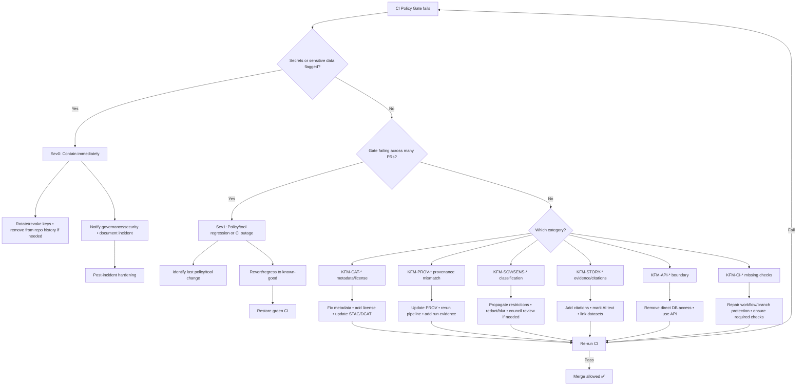

# 🧪🔒 CI Policy Gate Runbook (Fail‑Closed Governance)


> 🛡️ **Fail‑closed means:** if governance cannot be verified, **the merge is blocked** — by design.  
> This gate exists to protect **provenance**, **licensing**, **sensitive data handling**, and **evidence-backed AI/UI outputs**.

---

## 🧭 Quick links
- **Fix it fast:** [⏱️ 5–15 minute triage](#-5–15-minute-triage)
- **Decision flow:** [🗺️ Decision tree](#️-decision-tree)
- **Most common failures:**  
  - [🔐 Secrets / credentials](#-secrets--credentials-kfm-sec-)  
  - [🧾 License / catalog metadata](#-license--catalog-metadata-kfm-cat-)  
  - [🧬 Provenance mismatch](#-provenance-mismatch-kfm-prov-)  
  - [🏷️ Sensitivity / sovereignty](#️-sensitivity--sovereignty-kfm-sov--kfm-sens-)  
  - [📚 Evidence for narratives / Story Nodes](#-evidence-for-narratives--story-nodes-kfm-story-)  
  - [🧱 API boundary violations](#-api-boundary-violations-kfm-api-)  
  - [✅ Mandatory CI checks missing](#-mandatory-ci-checks-kfm-ci-)
- **Exceptions:** [🧯 Waivers (time-bound)](#-waivers-time-bound--no-silent-bypasses)
- **Related folders:** [🗂️ Repo layout cheatsheet](#️-repo-layout-cheatsheet)

---

## 🎯 Purpose

The **CI Policy Gate** is the repository’s automated governance checkpoint. It ensures that changes to:

- 🗺️ datasets & geospatial layers (raw/work/processed),
- 🧠 AI / Focus Mode behavior and content,
- 🌐 UI & narrative content (Story Nodes),
- 🔐 security posture & supply chain integrity,

…**cannot** land unless they satisfy the project’s non‑negotiable principles (FAIR + CARE, provenance-first, evidence-first, no secrets, contract-first boundaries).

---

## 🧩 What the gate is (and isn’t)

### ✅ What it is
A set of **Policy Pack** rules (OPA/Rego) evaluated by **Conftest** + supporting validators (schema, catalog QA, secrets scan, etc.) running in CI.

- Policies are **versioned in-repo** (treat governance as code).
- Policies are **auditable** (readable rules + stable IDs).
- Policies are enforced at multiple checkpoints (CI is the earliest).

### ❌ What it isn’t
- Not a “best effort” linting job.
- Not a manually-bypassable checklist.
- Not a single tool — it’s a **gate + ecosystem** (policy + validators + required checks).

---

## 🧱 Where it runs

### 🧷 In CI
Typical location patterns (may vary by workflow):

- 📁 `.github/workflows/` → CI entrypoints (required checks / branch protection)
- 📁 `tools/validation/policy/` → OPA/Rego policy files (`*.rego`)
- 📁 `api/scripts/policy/` → wrapper scripts + docs for running the gate locally
- 📁 `schemas/` → JSON Schemas (STAC/DCAT/PROV/story/UI/telemetry)

### 🧪 Locally (reproduction)
> Prefer the repo’s wrapper script if present, because it mirrors CI inputs and wiring.

Examples (adjust to match your repo tooling):

```bash
# From repo root (preferred if it exists):
python api/scripts/policy/run.py --changed-only

# Or direct conftest (example):
conftest test --policy tools/validation/policy --all-namespaces .

# Optional: run catalog/schema validation tools (example):
python tools/validation/catalog_qa.py --changed-only
```

---

## 🏷️ Policy categories & stable rule IDs

Policies are grouped into categories (examples below). IDs are **stable** and should appear in CI output.

- `KFM-CAT-*`  → Catalog & metadata (STAC/DCAT completeness, required fields, licensing)
- `KFM-PROV-*` → Provenance rules (PROV required, pipeline evidence required)
- `KFM-SOV-*` / `KFM-SENS-*` → Sovereignty, classification, sensitivity propagation (CARE)
- `KFM-SEC-*`  → Secrets, credentials, security posture
- `KFM-API-*`  → API boundary enforcement (UI must not bypass API)
- `KFM-STORY-*` → Story Nodes evidence requirements, AI text labeling
- `KFM-STYLE-*` → Formatting/lint/style conventions
- `KFM-CI-*` → Required checks / pipeline health (schema checks, broken links, etc.)

> 📌 Expect messages like:  
> `KFM-PROV-001: Processed data changed without matching PROV update.`

---

## 🚨 Severity & escalation

| Severity | Trigger | Action |
|---|---|---|
| **Sev0** 🔥 | Secrets committed, sensitive coordinates exposed, privacy breach risk | **Stop** merges, contain, rotate keys, remove from history, notify governance/security |
| **Sev1** ⛔ | Policy gate broken for *most PRs* (regression, tool outage, bad policy update) | Assign maintainer, revert recent policy/tool change, restore green CI fast |
| **Sev2** ⚠️ | Single PR blocked due to missing metadata/prov/license/tests | Fix in PR, educate contributor, improve error messaging/tests |
| **Sev3** 🧩 | Performance warnings (bundle size), optional telemetry checks failing without release risk | Track as issue, fix soon, don’t normalize noisy failures |

---

## ⏱️ 5–15 minute triage

### Step 1 — Identify the failing job + rule ID
- Open CI logs → find the failing step (often named `policy`, `conftest`, `catalog-qa`, `secrets-scan`, etc.).
- Capture:
  - ✅ **Policy ID** (e.g., `KFM-PROV-001`)
  - ✅ **Category** (`PROV`, `CAT`, `SEC`, `SOV/SENS`, etc.)
  - ✅ **File path(s)** the rule references

### Step 2 — Classify risk quickly
Ask:

- Does the output mention **secrets**, **keys**, **credentials**, **tokens**?
- Does it mention **sensitive coordinates**, **personal data**, **confidential**, **sovereignty**?
- Does it indicate **missing provenance** or **license** (governance, but usually not emergency)?

If **yes** to secrets/sensitivity → treat as **Sev0** until proven otherwise.

### Step 3 — Reproduce locally (confirm)
Run the repo’s policy wrapper if available:

```bash
python api/scripts/policy/run.py --changed-only
```

If not available, run Conftest with the repo’s policy directory:

```bash
conftest test --policy tools/validation/policy --all-namespaces .
```

### Step 4 — Pick the correct fix playbook
Jump to the matching section below.

### Step 5 — Confirm resolution
- Re-run CI (or re-push) ✅
- Ensure **policy output is clean** ✅
- If waiver used: ensure it’s **time-bound** + has owners ✅

---

## 🗺️ Decision tree



---

# 🛠️ Fix playbooks by failure type

## 🔐 Secrets / credentials (`KFM-SEC-*`)

### What it usually means
A secret-like pattern was detected in code/config/docs (regex, scanners, or policy checks).

### Immediate containment (treat as Sev0)
- ⛔ Do **not** merge the PR.
- 🔄 Rotate/revoke the credential **as if leaked**.
- 🧽 Remove secret from the change:
  - Replace with env var lookup
  - Move to secret manager / CI encrypted variables
- 🧼 If secret hit `main`:
  - Revoke/rotate keys
  - Remove from git history **if required** (use an approved history rewrite procedure)
  - Add monitoring for misuse

### Permanent fix
- Add/upgrade secret scanning patterns (policy + tooling)
- Add tests/fixtures to prevent regressions
- Update contributor guidance (`SECURITY.md`, onboarding docs)

---

## 🧾 License / catalog metadata (`KFM-CAT-*`)

### What it usually means
A dataset/layer/story references data without required metadata, e.g.:
- missing license
- missing STAC/DCAT/PROV artifacts
- invalid schema

### Fix checklist ✅
- [ ] Ensure the dataset has a **license field** (and consistent license info across metadata).
- [ ] Ensure STAC/DCAT required fields are present.
- [ ] Ensure paths follow repo conventions (`data/stac/`, `data/catalog/dcat/`, `data/prov/`).
- [ ] If new data was added, ensure its **raw/work/processed** placement is correct.
- [ ] Run schema validators locally.

> 💡 Tip: Missing license is one of the most common gate failures — fix it early.

---

## 🧬 Provenance mismatch (`KFM-PROV-*`)

### Typical symptom
CI outputs something like:

- `KFM-PROV-001: Processed data changed without matching PROV update.`

### Why it matters
KFM is provenance-first. Processed artifacts must carry lineage, including:
- inputs
- steps / pipeline identity
- run IDs / config hashes
- deterministic evidence (when applicable)

### Fix checklist ✅
- [ ] Confirm the PR modifies files under:
  - `data/<domain>/processed/`
  - `data/graph/csv/`
  - story content / published content
- [ ] Ensure matching updates exist under:
  - `data/prov/` (and often `data/stac/` + `data/catalog/dcat/`)
- [ ] Prefer regenerating outputs via pipeline rather than manual edits.
- [ ] Ensure the PROV references the correct run identifier and parameters (replayable).

### If the failure is a false positive
- Add a regression test for the policy
- Tighten file selection logic (changed-files set)
- Avoid broad deny rules without strong tests

---

## 🏷️ Sensitivity / sovereignty (`KFM-SOV-*` / `KFM-SENS-*`)

### What it usually means
- Classification does not propagate correctly: output marked **less restricted** than input.
- Sensitive coordinates/fields appear in public outputs.
- Required redaction/generalization rules are missing for sensitive layers (incl. UI tiling behavior).

### Fix checklist ✅
- [ ] Ensure **most restrictive input classification** carries through to outputs.
- [ ] Redact or generalize sensitive geometry/fields where policy requires.
- [ ] Add review flag / council review requirement where appropriate.
- [ ] Ensure the UI layer knows to blur/generalize at specific zoom levels (tags + metadata).

### When to escalate
- Any indigenous/culturally sensitive dataset
- Private land / protected site coordinates
- Anything the policy marks as requiring human review

Escalation path:
- 👥 FAIR+CARE council review
- 🔐 Security review (if privacy implications)

---

## 📚 Evidence for narratives / Story Nodes (`KFM-STORY-*`)

### What it usually means
A Story Node or other human-facing content lacks:
- citations
- dataset references
- AI-generated text markings (when required)

### Fix checklist ✅
- [ ] Add citations to datasets (STAC/DCAT references, URLs, DOIs, etc.).
- [ ] Ensure every claim in the narrative has an evidence trail.
- [ ] If content is AI-assisted, clearly mark AI text blocks per convention.
- [ ] Ensure Story Nodes integrate with provenance edges where applicable.

> 🧠 “Evidence-first” isn’t only for AI answers — it’s also for authored narratives.

---

## 🧱 API boundary violations (`KFM-API-*`)

### What it usually means
A PR introduces a path where:
- UI or client code talks directly to Neo4j/PostGIS
- a backend bypasses the vetted contract boundary
- a library/driver appears in forbidden layers

### Fix checklist ✅
- [ ] Remove DB drivers from UI packages (if introduced).
- [ ] Implement server/API endpoints instead.
- [ ] Ensure redaction + authorization happens in the API layer.
- [ ] Add policy tests to prevent the bypass in future.

---

## ✅ Mandatory CI checks (`KFM-CI-*`)

### What it usually means
The repository is configured to require checks, and:
- required workflow/job isn’t running,
- is misconfigured,
- or branch protection does not align with policy expectations.

### Fix checklist ✅
- [ ] Confirm branch protection requires CI checks.
- [ ] Ensure workflows exist in `.github/workflows/`.
- [ ] Ensure schema checks, link checks, secrets scan, and policy tests are wired.
- [ ] Validate that “missing PROV, broken links, or secrets” fail CI (fail-closed intent).
- [ ] If a workflow was renamed: update required check names.

---

## 📦 UI performance / build gates (bundle size, build time, memory)

### Typical symptom
- CI warns or fails due to bundle size thresholds or performance regressions.

### Fix checklist ✅
- [ ] Identify growth source (new dependency, un-split chunk, large assets).
- [ ] Apply lazy-loading / code splitting.
- [ ] Reduce asset size (optimize imagery, tiles, vectorization).
- [ ] If thresholds are outdated: adjust only with maintainer review (avoid creeping “it’s fine”).

---

## 🧾 Telemetry & energy monitoring gates (OpenTelemetry + energy/carbon)

### What it usually means
Scheduled QA expects:
- OpenTelemetry traces for CI runs
- energy/carbon usage report artifacts
- SLO compliance (e.g., trace coverage thresholds)

### Fix checklist ✅
- [ ] Confirm CI jobs emit required trace spans (commit SHA, pipeline name, etc.).
- [ ] Confirm energy report step runs and attaches artifacts.
- [ ] Investigate missing telemetry pipelines (collector down? env vars? step skipped?).
- [ ] Restore minimal SLOs before accepting changes that affect observability.

---

# 🧯 Waivers (time-bound) — no silent bypasses

Sometimes a rule needs a temporary exception (e.g., upstream source temporarily missing a field).  
KFM’s governance model supports **time-bound waivers** tied to **stable policy IDs**.

## ✅ Rules for waivers
- ⏳ Must have an **expiration date**
- 🧾 Must include a **reason** and a **remediation plan**
- 👤 Must include an **owner**
- 🔁 Must be reviewed like code (PR + approvals)
- 🚫 No “forever” waivers

## 📄 Suggested waiver file structure
Recommended file name (adjust to your repo standard):
- `waivers.yml` (or `tools/validation/policy/waivers.yml`)

Example entry:

```yaml
waivers:
  - id: "KFM-CAT-001"
    scope:
      paths:
        - "data/hydrology/processed/usgs_river_gauges_2026.parquet"
    reason: "Upstream dataset currently missing license metadata; awaiting provider response."
    owner: "data-stewards@kfm"
    expires: "2026-02-15"
    ticket: "GH-1234"
```

> ⚠️ If you’re waiving a security/sensitivity rule (`KFM-SEC-*`, `KFM-SOV-*`, `KFM-SENS-*`), treat it as an incident decision and require governance/security sign-off.

---

# 🧯 Rollback guidance

## When to rollback
- `main` is red and blocks all work (Sev1)
- a policy regression blocks legitimate changes
- a sensitive/secret leak landed (Sev0)

## Rollback approach (preferred: revert)
- Use `git revert` for a safe history-preserving rollback.
- Avoid force-push unless executing an approved “secret removal from history” procedure.

## If the failure came from automated agents (Watcher–Planner–Executor)
- 🛑 Use the **agent kill-switch** (global disable) if available.
- Ensure agent PRs receive the **same scrutiny** as human PRs (no bypass).
- Require signed attestations where configured (supply chain integrity).

---

# 🧪 Improving the gate (policy evolution)

When adding or changing policies:

- ✅ Add/modify the `*.rego` rule
- ✅ Add tests and fixtures for expected pass/fail
- ✅ Improve error messages (actionable guidance + stable IDs)
- ✅ Update docs explaining rationale and remediation
- ✅ Consider backward compatibility and rollout strategy (avoid Sev1 breakage)

> 🧩 A good policy failure message should tell a contributor exactly **what** failed, **why**, and **how to fix it**.

---

## 🧾 Maintainer review checklist (PR-level)

### Data / catalogs
- [ ] License present and consistent
- [ ] STAC/DCAT/PROV updated (or generated) alongside processed artifacts
- [ ] Checksums updated for raw inputs (tamper evidence)
- [ ] Classification/sensitivity tags are present and propagate correctly

### AI / Focus Mode
- [ ] AI outputs or derived content include citations
- [ ] AI-generated narrative text is clearly marked (if required)
- [ ] Prompt/security policies remain intact

### UI
- [ ] No DB drivers / direct data store calls in client
- [ ] Sensitive layers respect generalization/blurring behavior
- [ ] Build/perf thresholds respected (or explicitly reviewed)

### CI / supply chain
- [ ] Required checks present and passing
- [ ] SBOM/attestations/signatures produced where configured
- [ ] Telemetry/energy artifacts not silently broken

---

## 🗂️ Repo layout cheatsheet

> Anchored to KFM’s expected directory conventions (trimmed for incident/runbook relevance).

```text
📁 .github/
  └─ 📁 workflows/                 # CI workflows + security checks

📁 tools/
  └─ 📁 validation/
     └─ 📁 policy/                 # OPA/Rego policy pack (*.rego), waivers, conftest config

📁 api/
  └─ 📁 scripts/
     └─ 📁 policy/                 # Policy gate wrapper CLI + docs (run locally like CI)

📁 schemas/                         # JSON Schemas (STAC/DCAT/PROV/story/UI/telemetry)

📁 data/
  ├─ 📁 stac/
  ├─ 📁 catalog/dcat/
  ├─ 📁 prov/
  ├─ 📁 graph/csv/
  └─ 📁 <domain>/
     ├─ 📁 raw/                     # read-only inputs (checksums)
     ├─ 📁 work/                    # intermediate
     └─ 📁 processed/               # final outputs (must have matching PROV)

📁 mcp/
  └─ 📁 incidents/
     └─ 📁 runbooks/
        └─ 📄 ci-policy-gate.md     # ✅ you are here
```

---

## 📎 Appendix: Why this gate exists (KFM-specific)

KFM is not “just a map.” It is:
- a provenance-preserving geospatial knowledge system,
- a narrative engine with evidence requirements,
- an AI assistant that must refuse answers without sources,
- a governance-forward platform (FAIR + CARE),
- and a reproducible, auditable pipeline ecosystem.

The CI Policy Gate is the first and most visible enforcement point for all of that.

---

## 🧰 Appendix: Reference libraries bundled with the project

Some project PDFs are **PDF portfolios** (containers of many embedded documents). They exist as curated reference libraries for:

- 🤖 AI concepts & governance
- 🌍 mapping / WebGL / geospatial visualization
- 🧑‍💻 programming languages + CI/CD practices
- 🗄️ data management architectures & methods

They are **non-normative** (they inform design), while the repo’s **Policy Pack + schemas + governed docs** remain the normative enforcement layer.

---

## ✅ Runbook Definition of Done (when updating this file)

- [ ] Includes the *current* list of policy categories and example IDs
- [ ] Contains at least one fix playbook per major policy category
- [ ] Documents the waiver process (time-bound) clearly
- [ ] Includes repro steps aligned with CI (wrapper-first)
- [ ] Uses concise, copy/paste-ready commands and templates
- [ ] Avoids “tribal knowledge” (everything required is written down)

---
