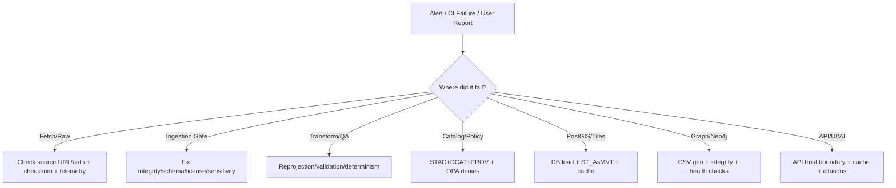

<!--
📄 File: mcp/incidents/runbooks/ingestion-pipeline.md
🎯 Purpose: On-call + maintainer runbook for KFM ingestion pipeline incidents (batch + streaming + AI/OCR ingest).
-->

# 🚨 Ingestion Pipeline Incident Runbook (KFM) 🗺️⚙️


📁 **Repo path**
```text
📁 mcp/
  📁 incidents/
    📁 runbooks/
      📄 ingestion-pipeline.md   👈 you are here
```

---

## 🧭 When to use this runbook

Use this runbook when **any** of these are true:

- A data ingestion CI job fails (validation, policy gates, DB load, graph import, publish).  
- “Freshness” / “currency” checks fail (pipeline lag, missing telemetry/traces).  
- A dataset is published but **missing/incorrect** in **API/UI/Focus Mode**.  
- Suspected **sensitive-data exposure** (PII, culturally restricted knowledge, protected sites).  
- Automated **Watcher → Planner → Executor** activity is looping or producing unsafe output.

---

## 🧱 Non‑negotiables (don’t “fix” incidents by breaking trust) 🛑

> [!IMPORTANT]
> **These rules are foundational to KFM’s evidence-first design:**
>
> - **Never mutate `data/raw/` in place**. Raw inputs are immutable evidence; transformations belong in `data/work/` and `data/processed/`. [oai_citation:0‡📚 Kansas Frontier Matrix (KFM) Data Intake – Technical & Design Guide.pdf](file-service://file-EbUCdsJMbu5KwpoKMrLrgj) [oai_citation:1‡📚 Kansas Frontier Matrix (KFM) Data Intake – Technical & Design Guide.pdf](file-service://file-EbUCdsJMbu5KwpoKMrLrgj)
> - **Never bypass the governed API**. The UI must not hit PostGIS/Neo4j directly; the API enforces authz/redaction/policy. [oai_citation:2‡📚 Kansas Frontier Matrix (KFM) Data Intake – Technical & Design Guide.pdf](file-service://file-EbUCdsJMbu5KwpoKMrLrgj)
> - **Never hand‑edit `data/graph/csv/`**. Graph CSVs are generated artifacts; fix upstream catalogs/ETL and re-generate. [oai_citation:3‡📚 Kansas Frontier Matrix (KFM) Data Intake – Technical & Design Guide.pdf](file-service://file-EbUCdsJMbu5KwpoKMrLrgj)
> - **Fail closed**: if a policy gate fails, the system must not publish the artifact. [oai_citation:4‡Kansas Frontier Matrix (KFM) – Comprehensive Architecture, Features, and Design.pdf](file-service://file-4Umt1yHoGKicdmLWzFJ9sC)

---

## 🧠 System assumptions (grounded in KFM docs)

KFM ingestion is built around these “truths”:

- **Evidence triplet is required for publication**: **STAC + DCAT + PROV** stored in canonical repo locations; data is not “official” until these exist. [oai_citation:5‡📚 Kansas Frontier Matrix (KFM) Data Intake – Technical & Design Guide.pdf](file-service://file-EbUCdsJMbu5KwpoKMrLrgj)
- **Graph ingestion is catalog-driven**: catalogs → generated CSV → Neo4j import; no “mystery nodes”. [oai_citation:6‡📚 Kansas Frontier Matrix (KFM) Data Intake – Technical & Design Guide.pdf](file-service://file-EbUCdsJMbu5KwpoKMrLrgj) [oai_citation:7‡📚 Kansas Frontier Matrix (KFM) Data Intake – Technical & Design Guide.pdf](file-service://file-EbUCdsJMbu5KwpoKMrLrgj)
- **Ingestion gate** does early validation (checksums, sanity checks, governance-lite, telemetry) before heavy processing. [oai_citation:8‡📚 Kansas Frontier Matrix (KFM) Data Intake – Technical & Design Guide.pdf](file-service://file-EbUCdsJMbu5KwpoKMrLrgj)
- **Deterministic, config-driven ETL** is required; reruns should be idempotent for same inputs/config. [oai_citation:9‡📚 Kansas Frontier Matrix (KFM) Data Intake – Technical & Design Guide.pdf](file-service://file-EbUCdsJMbu5KwpoKMrLrgj)
- **Technology stack** includes **PostGIS + Neo4j**, API layer (FastAPI/GraphQL), and web UI (React + MapLibre, optional Cesium).
- **AI outputs must be cited**; if sources aren’t available, the assistant must refuse rather than fabricate. [oai_citation:10‡Kansas Frontier Matrix (KFM) – AI System Overview 🧭🤖.pdf](file-service://file-Pv8eev6RWvCKrGCXyzY7zg) [oai_citation:11‡Kansas Frontier Matrix (KFM) – Comprehensive Architecture, Features, and Design.pdf](file-service://file-4Umt1yHoGKicdmLWzFJ9sC)

---

## 🗺️ Pipeline map (high level)

```mermaid
flowchart LR
  S[(Upstream Sources)] --> R[data/raw/ + checksums.sha256]
  R --> G{{Ingestion Gate}}
  G --> W[data/work/]
  W --> P[data/processed/]
  P --> CATS[data/stac/ + data/catalog(s)/ + data/prov/]
  CATS --> CSV[data/graph/csv/]
  CSV --> N[(Neo4j)]
  P --> PG[(PostGIS)]
  N --> API[(FastAPI/GraphQL API)]
  PG --> API
  API --> UI[(React + MapLibre / Cesium)]
  API --> FM[(Focus Mode AI)]
```

*(This matches the project’s “raw → ETL → STAC/DCAT/PROV → graph → API → UI → stories/AI” framing.)* [oai_citation:12‡MARKDOWN_GUIDE_v13.md.gdoc](file-service://file-UYVruFXfueR8veHMUKeugU)

---

## 🔭 Observability: what to check first

### ✅ “First evidence” artifacts to collect for any incident
Attach these to the incident ticket/issue:

- CI job URL + failing step name (schema validation / policy gate / graph import / tile gen / deploy)
- **Run manifest** (if present): `data/audits/<run_id>/run_manifest.json` + canonical digest/idempotency key if used [oai_citation:13‡Additional Project Ideas.pdf](file-service://file-Pc2GNivcrHBeKjBQksLC3T)
- **checksums**: `checksums.sha256` in affected `data/raw/...` package [oai_citation:14‡📚 Kansas Frontier Matrix (KFM) Data Intake – Technical & Design Guide.pdf](file-service://file-EbUCdsJMbu5KwpoKMrLrgj)
- Relevant **catalog files** (STAC/DCAT/PROV) for the dataset [oai_citation:15‡📚 Kansas Frontier Matrix (KFM) Data Intake – Technical & Design Guide.pdf](file-service://file-EbUCdsJMbu5KwpoKMrLrgj)
- **Graph CSV outputs** for that dataset (generated) + any referential integrity report [oai_citation:16‡📚 Kansas Frontier Matrix (KFM) Data Intake – Technical & Design Guide.pdf](file-service://file-EbUCdsJMbu5KwpoKMrLrgj)
- **Telemetry / ledger entry** (NDJSON append-only log) [oai_citation:17‡📚 Kansas Frontier Matrix (KFM) Data Intake – Technical & Design Guide.pdf](file-service://file-EbUCdsJMbu5KwpoKMrLrgj)

### 📈 Telemetry health & “silent failure” detection
KFM explicitly treats telemetry as QA output; proposals include scheduled checks ensuring CI runs emit traces + energy/carbon reports, with minimal SLO targets. [oai_citation:18‡🌟 Kansas Frontier Matrix – Latest Ideas & Future Proposals.docx.pdf](file-service://file-SQ3f7ve8SGiusT6ThZEuCe)

> [!NOTE]
> If the incident is “nothing is failing, but nothing is updating,” suspect **telemetry/tracing breakage** before suspecting “data is fine.”

---

## 🚦 Quick triage checklist (first 5–15 minutes)

### 🕐 First 5 minutes (stop the bleeding)
- [ ] Confirm **severity** (see below)
- [ ] Identify failing **stage** (Gate / Transform / Catalog / Policy / DB / Graph / Publish / UI)
- [ ] If an agent/automation is looping: **activate kill switch / freeze automation** [oai_citation:19‡📚 Kansas Frontier Matrix (KFM) Data Intake – Technical & Design Guide.pdf](file-service://file-EbUCdsJMbu5KwpoKMrLrgj) [oai_citation:20‡📚 Kansas Frontier Matrix (KFM) Data Intake – Technical & Design Guide.pdf](file-service://file-EbUCdsJMbu5KwpoKMrLrgj)
- [ ] If sensitive data might be exposed: **revoke access immediately** (classification → restricted; block API serve) [oai_citation:21‡📚 Kansas Frontier Matrix (KFM) Data Intake – Technical & Design Guide.pdf](file-service://file-EbUCdsJMbu5KwpoKMrLrgj)
- [ ] Preserve evidence artifacts (run manifests, failing logs, affected files)

### 🕒 First 15 minutes (scope + stabilize)
- [ ] Is impact **one dataset** or **systemic** (many datasets / pipeline wide)?
- [ ] Does failure affect **API**, **UI**, and/or **Focus Mode**?
- [ ] Determine **last known good** run/commit and **first bad** run/commit
- [ ] Decide: **rollback**, **hotfix**, or **pause ingestion** (see Rollback section)

---

## 🧯 Severity model (recommended)

| Severity | User impact | Examples | Default action |
|---|---|---|---|
| **SEV-0** 🔥 | Safety/legal/ethics breach | Sensitive data exposed; policy bypass | Revoke access + rollback + incident commander |
| **SEV-1** 🚧 | Core platform broken | No new data publishes; API down | Triage + stabilize within hours |
| **SEV-2** ⚠️ | Degraded / partial | One domain failing; tiles missing for a layer | Fix within 1–2 days |
| **SEV-3** 🧹 | Minor / cosmetic | Catalog formatting warnings | Queue & fix in normal cycle |

> [!TIP]
> KFM “fail closed” means many issues surface early in CI; SEV often depends on **how far** the bad artifact traveled (raw only vs published). [oai_citation:22‡Kansas Frontier Matrix (KFM) – Comprehensive Architecture, Features, and Design.pdf](file-service://file-4Umt1yHoGKicdmLWzFJ9sC)

---

# 🧩 Stage-by-stage incident playbooks

## 1️⃣ Source fetch / raw intake failures 🌐📥

### Common symptoms
- Download timeouts / 404 / auth failures
- “Bytes changed” vs last ingest (ETag/Last-Modified differences)
- Partial/corrupt archive

### Confirm quickly
- Check telemetry entry for the fetch event (success/fail, bytes). [oai_citation:23‡📚 Kansas Frontier Matrix (KFM) Data Intake – Technical & Design Guide.pdf](file-service://file-EbUCdsJMbu5KwpoKMrLrgj)
- Check `checksums.sha256` (if present) and compare to expected/previous. [oai_citation:24‡📚 Kansas Frontier Matrix (KFM) Data Intake – Technical & Design Guide.pdf](file-service://file-EbUCdsJMbu5KwpoKMrLrgj)

### Likely causes
- Upstream moved/changed URL, or requires new auth
- Rate limiting / blocked user-agent
- Source updated in place (same URL, new bytes)

### Mitigation & fix
- If source changed in place: treat as **new version**; update source manifest and regenerate downstream artifacts.
- Prefer conditional fetch and caching patterns (ETag/Last-Modified) to avoid unnecessary downloads; store ETag metadata (design suggests `manifest_cache.json`). [oai_citation:25‡Kansas Frontier Matrix (KFM) – Comprehensive Architecture, Features, and Design.pdf](file-service://file-4Umt1yHoGKicdmLWzFJ9sC)

### Prevention
- Add “source availability” checks for critical sources (HEAD/GET) + alert on repeated failures.
- For high-risk upstreams, add fallback mirrors and document in domain README (see “domain runbook” pattern). [oai_citation:26‡MARKDOWN_GUIDE_v13.md.gdoc](file-service://file-UYVruFXfueR8veHMUKeugU)

---

## 2️⃣ Ingestion gate failures 🧱✅❌

The ingestion gate blocks obvious bad inputs before heavy ETL.

### Gate checks (what might fail)
- File integrity: compute/store hash (`checksums.sha256`) [oai_citation:27‡📚 Kansas Frontier Matrix (KFM) Data Intake – Technical & Design Guide.pdf](file-service://file-EbUCdsJMbu5KwpoKMrLrgj)
- Schema/format sanity: parseable JSON/CSV; shapefile completeness [oai_citation:28‡📚 Kansas Frontier Matrix (KFM) Data Intake – Technical & Design Guide.pdf](file-service://file-EbUCdsJMbu5KwpoKMrLrgj)
- Governance-lite: license/source citation present; sensitivity label known [oai_citation:29‡📚 Kansas Frontier Matrix (KFM) Data Intake – Technical & Design Guide.pdf](file-service://file-EbUCdsJMbu5KwpoKMrLrgj)
- Telemetry log write (append-only NDJSON) [oai_citation:30‡📚 Kansas Frontier Matrix (KFM) Data Intake – Technical & Design Guide.pdf](file-service://file-EbUCdsJMbu5KwpoKMrLrgj)

### Playbook: checksum mismatch 🔐
**Symptoms:** job stops at gate; “checksum mismatch” / “file changed”  
**Actions:**
1. Confirm upstream really changed (re-fetch to temp and compare hash).
2. If upstream changed legitimately: update manifest/version, regenerate `checksums.sha256`, and proceed.
3. If upstream tampering suspected: **pause publish**, escalate to governance/security, and verify provenance chain.

### Playbook: missing license / source citation 🧾
**Symptoms:** gate or policy denies “license missing”  
**Actions:**
1. Find `source.json`/manifest reference (gate expects it). [oai_citation:31‡📚 Kansas Frontier Matrix (KFM) Data Intake – Technical & Design Guide.pdf](file-service://file-EbUCdsJMbu5KwpoKMrLrgj)
2. Add/verify license metadata, then regenerate catalogs (DCAT + STAC + PROV).

---

## 3️⃣ Transform / QA / reprojection failures 🧪🧭

### Common symptoms
- ETL crashes (parsing, geometry invalid, type coercion)
- Output differs between runs (non-determinism)
- Layer renders “in the wrong place” (CRS mismatch)

### Key rules
- Raw stays raw; transforms go to `data/work/` or `data/processed/` [oai_citation:32‡📚 Kansas Frontier Matrix (KFM) Data Intake – Technical & Design Guide.pdf](file-service://file-EbUCdsJMbu5KwpoKMrLrgj)
- ETL must be deterministic and config/code-driven (no manual patching). [oai_citation:33‡📚 Kansas Frontier Matrix (KFM) Data Intake – Technical & Design Guide.pdf](file-service://file-EbUCdsJMbu5KwpoKMrLrgj)

### CRS / projection incident 🧭
KFM standardizes to **WGS84 / EPSG:4326** (reprojection is logged and should not be silent). [oai_citation:34‡📚 Kansas Frontier Matrix (KFM) Data Intake – Technical & Design Guide.pdf](file-service://file-EbUCdsJMbu5KwpoKMrLrgj)

**Symptoms:** features offset, flipped, or not visible at all.  
**Steps:**
1. Confirm source CRS from metadata or file headers.
2. Confirm ETL step performs reprojection to EPSG:4326 (and logs it).
3. Validate output bbox intersects Kansas bounding region (quick sanity).

> [!TIP]
> If you need deeper geospatial debugging playbooks, the KFM reference libraries include a Python geospatial analysis cookbook (topology/overlays/routing/web analysis).

### Prevention
- Add intermediate QA checks (geometry validity, ranges, record counts) via `tools/validation/` scripts. [oai_citation:35‡📚 Kansas Frontier Matrix (KFM) Data Intake – Technical & Design Guide.pdf](file-service://file-EbUCdsJMbu5KwpoKMrLrgj)
- Add integration tests that run a tiny sample pipeline end-to-end (KFM testing guidance includes pipeline integration tests). [oai_citation:36‡Kansas Frontier Matrix (KFM) – Comprehensive Technical Documentation.pdf](file-service://file-AkqwUuYPp5zePf7pv5SMxi)

---

## 4️⃣ Evidence triplet / catalogs failures 🧾🧬

### Why this matters
Publication requires **STAC + DCAT + PROV** (“evidence triplet”). [oai_citation:37‡📚 Kansas Frontier Matrix (KFM) Data Intake – Technical & Design Guide.pdf](file-service://file-EbUCdsJMbu5KwpoKMrLrgj)

### Common symptoms
- Missing STAC item/collection
- DCAT entry missing required fields
- PROV lineage missing inputs/activities/agents
- Graph ingestion missing nodes because catalogs incomplete

### Fix strategy
1. Identify which artifact is missing (STAC/DCAT/PROV).
2. Regenerate catalogs from the same ETL config/version that produced processed outputs.
3. Re-run policy gate (see next section).

> [!NOTE]
> Repo conventions vary in docs: DCAT is described under `data/catalogs/` and also as `data/catalog/dcat/`. Confirm actual repo layout before changing paths. [oai_citation:38‡📚 Kansas Frontier Matrix (KFM) Data Intake – Technical & Design Guide.pdf](file-service://file-EbUCdsJMbu5KwpoKMrLrgj) [oai_citation:39‡MARKDOWN_GUIDE_v13.md.gdoc](file-service://file-UYVruFXfueR8veHMUKeugU)

---

## 5️⃣ Policy gate failures (OPA/Conftest) ⚖️🧱

### What happens
KFM runs Conftest/OPA policy packs against the data/cat/prov artifacts; deny rules fail the job and print messages like `KFM-PROV-001...` [oai_citation:40‡📚 Kansas Frontier Matrix (KFM) Data Intake – Technical & Design Guide.pdf](file-service://file-EbUCdsJMbu5KwpoKMrLrgj)  
Policy gates cover schema, STAC/DCAT/PROV completeness, license, sensitivity classification, provenance completeness; and the system philosophy is **fail closed**. [oai_citation:41‡Kansas Frontier Matrix (KFM) – Comprehensive Architecture, Features, and Design.pdf](file-service://file-4Umt1yHoGKicdmLWzFJ9sC)

### Fast diagnosis
- Read the deny message and map it to a “missing artifact” vs “mismatch” vs “classification” problem.
- Check whether a waiver exists (KFM supports an explicit waiver file concept). [oai_citation:42‡Kansas Frontier Matrix – Comprehensive UI System Overview.pdf](file-service://file-KcBQruYcoFVDEixzzRHTwt)

### Common policy failures
- **PROV missing** for a processed data change
- **License missing**
- **Sensitivity classification missing/incorrect**
- **AI output lacks citations** (Focus Mode should refuse; publishing without citations is a violation) [oai_citation:43‡Kansas Frontier Matrix (KFM) – Comprehensive Architecture, Features, and Design.pdf](file-service://file-4Umt1yHoGKicdmLWzFJ9sC)

### Safe remediation patterns
- Fix the root artifact (catalog/prov), don’t “waive by default.”
- If a waiver is needed: require explicit rationale + expiry + owner.

---

## 6️⃣ PostGIS load + tiles failures 🐘🧱🗺️

### Expected behavior (ground truth)
- Pipeline may load vectors/rasters into PostGIS (e.g., via SQL COPY). [oai_citation:44‡📚 Kansas Frontier Matrix (KFM) Data Intake – Technical & Design Guide.pdf](file-service://file-EbUCdsJMbu5KwpoKMrLrgj)
- API serves tiles via a `/tiles/...` endpoint; a design example uses PostGIS `ST_AsMVT` to generate MVT tiles. [oai_citation:45‡📚 Kansas Frontier Matrix (KFM) Data Intake – Technical & Design Guide.pdf](file-service://file-EbUCdsJMbu5KwpoKMrLrgj)

### Common symptoms
- Layer visible in catalog but blank on map
- `/tiles/...` returns 500/empty tiles
- Tile cache stale (old version still displayed)

### Triage steps
1. Confirm data exists in PostGIS (row counts, bbox).
2. Confirm API endpoint returns features/tiles for the expected bbox/zoom.
3. Check for invalid geometries (can cause tile generation errors).
4. If tiles are cached: invalidate/regenerate cache.

### Raster-specific (COG + pre-render)
KFM stores large rasters as artifacts (often COGs) and may serve tiles via a tiler or static tile cache. [oai_citation:46‡Kansas Frontier Matrix (KFM) – Comprehensive Technical Documentation.pdf](file-service://file-AkqwUuYPp5zePf7pv5SMxi)  
Performance patterns include pre-rendered XYZ tiles or caching. [oai_citation:47‡Kansas Frontier Matrix (KFM) – Comprehensive Technical Documentation.pdf](file-service://file-AkqwUuYPp5zePf7pv5SMxi)

---

## 7️⃣ Graph ingestion / Neo4j failures 🕸️🧠

### Expected behavior
Catalogs → generated CSVs → Neo4j bulk import; graph keeps references back to catalog IDs; no orphaned/unexplained nodes. [oai_citation:48‡📚 Kansas Frontier Matrix (KFM) Data Intake – Technical & Design Guide.pdf](file-service://file-EbUCdsJMbu5KwpoKMrLrgj)

### Common symptoms
- CSV import fails referential integrity (edges reference missing nodes)
- Neo4j constraint/index errors
- Graph looks “wrong” (super-hub nodes, orphans, schema drift)

### Do NOT do
- ❌ Don’t hand-edit `data/graph/csv/` [oai_citation:49‡📚 Kansas Frontier Matrix (KFM) Data Intake – Technical & Design Guide.pdf](file-service://file-EbUCdsJMbu5KwpoKMrLrgj)

### Graph health checks (recommended operational guardrails)
Pulse Ideas propose automated checks for:
- Orphan detection
- Hub detection (degree explosions)
- Property schema drift sampling
- Backup verification (test restore)  
…and automatic issue creation/escalation when multiple checks fail. [oai_citation:50‡Additional Project Ideas.pdf](file-service://file-Pc2GNivcrHBeKjBQksLC3T)

> [!TIP]
> Store artifacts from these checks in a timestamped report directory and keep trend history (proposal mentions `docs/reports/qa/graph_health/`). [oai_citation:51‡Additional Project Ideas.pdf](file-service://file-Pc2GNivcrHBeKjBQksLC3T)

---

## 8️⃣ Publish / API / UI regressions 🌐🧩🗺️

### The rule
All clients use the API as the trust boundary; no direct DB access from UI. [oai_citation:52‡📚 Kansas Frontier Matrix (KFM) Data Intake – Technical & Design Guide.pdf](file-service://file-EbUCdsJMbu5KwpoKMrLrgj)

### UI symptom: “dataset exists, but I can’t see it”
1. Verify catalog endpoints list the dataset (DCAT/STAC).
2. Verify tiles/data endpoints return content.
3. Verify layer configuration + timeline/time filters in UI.
4. Verify cache (API + tiles + client) isn’t stale.

UI baseline expectations include 2D/3D map interfaces (MapLibre + optional Cesium) and temporal navigation components.

---

## 9️⃣ Focus Mode / AI ingestion & citation failures 🤖📎

### What “healthy” looks like
- AI always cites sources; refuses if it can’t derive from data. [oai_citation:53‡Kansas Frontier Matrix (KFM) – AI System Overview 🧭🤖.pdf](file-service://file-Pv8eev6RWvCKrGCXyzY7zg)
- Retrieval uses graph queries + hybrid retrieval (RAG), and caches may be used for performance. [oai_citation:54‡Kansas Frontier Matrix (KFM) – AI System Overview 🧭🤖.pdf](file-service://file-Pv8eev6RWvCKrGCXyzY7zg)

### Common symptoms
- Focus Mode refuses too often for questions that should be answerable
- Answers lack citations (should be blocked by policy gate) [oai_citation:55‡Kansas Frontier Matrix (KFM) – Comprehensive Architecture, Features, and Design.pdf](file-service://file-4Umt1yHoGKicdmLWzFJ9sC)

### Fix path
1. Confirm the dataset/doc is actually in catalogs and graph (STAC/DCAT/PROV → graph).
2. Confirm embeddings/index build (if used) succeeded.
3. Confirm policy flags aren’t preventing retrieval for sensitive content.

---

## 🔥 Sensitive data incident response (SEV‑0) 🛡️⚖️

### Immediate containment
- Revoke public access: flip classification → restricted so API refuses to serve (quick patch). [oai_citation:56‡📚 Kansas Frontier Matrix (KFM) Data Intake – Technical & Design Guide.pdf](file-service://file-EbUCdsJMbu5KwpoKMrLrgj)
- Remove offending data from repo and purge history if required (treat like a secret). [oai_citation:57‡📚 Kansas Frontier Matrix (KFM) Data Intake – Technical & Design Guide.pdf](file-service://file-EbUCdsJMbu5KwpoKMrLrgj)

### Longer-term remediation
- Add new policy rule(s) so this cannot reoccur.
- Document governance outcome / council notification if applicable. [oai_citation:58‡📚 Kansas Frontier Matrix (KFM) Data Intake – Technical & Design Guide.pdf](file-service://file-EbUCdsJMbu5KwpoKMrLrgj)

### Cultural protocols & differential access (design guidance)
KFM may adopt tiered access controls (e.g., Traditional Knowledge labels / community-only access) and geo-obfuscation (rounding coordinates) for sensitive records. [oai_citation:59‡Innovative Concepts to Evolve the Kansas Frontier Matrix (KFM).pdf](file-service://file-G71zNoWKxsoSW44iwZaaCC) [oai_citation:60‡Innovative Concepts to Evolve the Kansas Frontier Matrix (KFM).pdf](file-service://file-G71zNoWKxsoSW44iwZaaCC)

> [!IMPORTANT]
> If the incident involves Indigenous/community-contributed materials, treat remediation as a **governance + trust** response, not just a technical fix.

---

## 🤝 Automation incidents: Watcher → Planner → Executor loops 🤖🧯

KFM describes a Watcher/Planner/Executor safety architecture where Planner/Executor refuse actions that violate policy/approvals. [oai_citation:61‡Kansas Frontier Matrix (KFM) – Comprehensive Architecture, Features, and Design.pdf](file-service://file-4Umt1yHoGKicdmLWzFJ9sC)

### Symptoms
- Agent repeatedly opens PRs
- Agent produces unsafe/unreviewable plans
- CI spam / rate limits / cascading failures

### Response
1. **Activate kill switch / freeze automations** (stop repeat harm). [oai_citation:62‡📚 Kansas Frontier Matrix (KFM) Data Intake – Technical & Design Guide.pdf](file-service://file-EbUCdsJMbu5KwpoKMrLrgj)
2. Review watcher trigger condition (false positives? missing debounce?)
3. Add policy constraints to Planner/Executor (deny unsafe class of actions)
4. Require human review before merges (agents should not auto-merge). [oai_citation:63‡📚 Kansas Frontier Matrix (KFM) Data Intake – Technical & Design Guide.pdf](file-service://file-EbUCdsJMbu5KwpoKMrLrgj)

---

# 🧯 Rollback & recovery patterns ⏪

## ✅ Preferred rollback: Git revert + GitOps redeploy
Because changes are done via Git, rollback can be a commit revert; ensure external systems (PostGIS/Neo4j) sync to that revert (via reload/snapshot strategy). [oai_citation:64‡📚 Kansas Frontier Matrix (KFM) Data Intake – Technical & Design Guide.pdf](file-service://file-EbUCdsJMbu5KwpoKMrLrgj)

## 🧼 Graph rollback
Re-import prior graph CSV snapshots or run migrations/backward scripts if used (proposal suggests stable IDs facilitate restore). [oai_citation:65‡📚 Kansas Frontier Matrix (KFM) Data Intake – Technical & Design Guide.pdf](file-service://file-EbUCdsJMbu5KwpoKMrLrgj)

## 📦 Artifact rollback (forward-looking)
A proposed hardening approach uses **OCI + ORAS + Cosign** for signed, content-addressed data artifacts to simplify rollback and prevent tampering/staleness. [oai_citation:66‡Additional Project Ideas.pdf](file-service://file-Pc2GNivcrHBeKjBQksLC3T)

---

# 🧪 Post-incident hardening (make this failure impossible next time)

## Testing improvements (use KFM’s QA stack)
KFM emphasizes unit/integration/E2E tests (pytest for Python; Cypress-like E2E for UI) and CI gating to catch issues early. [oai_citation:67‡Kansas Frontier Matrix (KFM) – Comprehensive Technical Documentation.pdf](file-service://file-AkqwUuYPp5zePf7pv5SMxi)

## Telemetry & sustainability QA (proposal)
Add scheduled telemetry health checks validating OpenTelemetry traces + energy reports per CI run; alert if missing; enforce SLOs for trace coverage. [oai_citation:68‡🌟 Kansas Frontier Matrix – Latest Ideas & Future Proposals.docx.pdf](file-service://file-SQ3f7ve8SGiusT6ThZEuCe)

## Runbook + module design principles (proposal)
Design ingestion modules to be deterministic, testable, rollbackable, and self-checking; add runbooks for provenance repair and graph health checks.

---

# 📎 Appendix A — “What failed?” decision tree



---

# 📎 Appendix B — Incident ticket template 📝

Copy/paste into your issue/incident system:

```text
Title:
  [SEV-X] Ingestion pipeline incident - <short description>

Start time (UTC):
Detected by:
  CI / user report / telemetry health check / graph health check

Impact:
  - Affected domains/datasets:
  - Affected surfaces: API / UI / Focus Mode / exports
  - User-visible symptoms:

Stage suspected:
  Fetch / Gate / Transform / Catalog / Policy / PostGIS / Graph / Publish

Evidence attached:
  - CI link:
  - run_manifest:
  - checksums.sha256:
  - STAC/DCAT/PROV paths:
  - graph/csv paths:
  - telemetry NDJSON excerpt:

Actions taken:
  - Containment:
  - Fix:
  - Rollback (if any):

Root cause:
Follow-ups:
  - Tests to add:
  - Policies to add/adjust:
  - Monitoring/alerts to add:
  - Runbook updates:
```

---

# 📚 Project docs & portfolios referenced (link pack) 📦

> [!NOTE]
> Several KFM libraries are shipped as **PDF portfolios**; open them in Acrobat/Reader for embedded resources. [oai_citation:69‡🌟 Kansas Frontier Matrix – Latest Ideas & Future Proposals.docx.pdf](file-service://file-SQ3f7ve8SGiusT6ThZEuCe) [oai_citation:70‡Data Mining Concepts & applictions.pdf](file-service://file-2uwEbQAFVKpXaTtWgUirAH) [oai_citation:71‡🌟 Kansas Frontier Matrix – Latest Ideas & Future Proposals.docx.pdf](file-service://file-SQ3f7ve8SGiusT6ThZEuCe) [oai_citation:72‡📚 Kansas Frontier Matrix (KFM) Data Intake – Technical & Design Guide.pdf](file-service://file-EbUCdsJMbu5KwpoKMrLrgj)

- 📚 **Data Intake Guide**  [oai_citation:73‡📚 Kansas Frontier Matrix (KFM) Data Intake – Technical & Design Guide.pdf](file-service://file-EbUCdsJMbu5KwpoKMrLrgj)  
- 🧱 **Architecture / Policy Gates / WPE Agents**  [oai_citation:74‡Kansas Frontier Matrix (KFM) – Comprehensive Architecture, Features, and Design.pdf](file-service://file-4Umt1yHoGKicdmLWzFJ9sC)  
- 🤖 **AI System Overview (Focus Mode)**  [oai_citation:75‡Kansas Frontier Matrix (KFM) – AI System Overview 🧭🤖.pdf](file-service://file-Pv8eev6RWvCKrGCXyzY7zg)  
- 🖥️ **UI System Overview**  [oai_citation:76‡Kansas Frontier Matrix – Comprehensive UI System Overview.pdf](file-service://file-KcBQruYcoFVDEixzzRHTwt)  
- 🧰 **Comprehensive Technical Documentation (QA/Tests/Storage)**  [oai_citation:77‡Kansas Frontier Matrix (KFM) – Comprehensive Technical Documentation.pdf](file-service://file-AkqwUuYPp5zePf7pv5SMxi)  
- 🌟 **Latest Ideas & Future Proposals**  [oai_citation:78‡🌟 Kansas Frontier Matrix – Latest Ideas & Future Proposals.docx.pdf](file-service://file-SQ3f7ve8SGiusT6ThZEuCe)  
- 💡 **Additional Project Ideas (OCI artifacts, graph health checks, pulse ideas)**  [oai_citation:79‡Additional Project Ideas.pdf](file-service://file-Pc2GNivcrHBeKjBQksLC3T)  
- 🪶 **Innovative Concepts (cultural protocols, sensitivity-aware handling)**  [oai_citation:80‡Innovative Concepts to Evolve the Kansas Frontier Matrix (KFM).pdf](file-service://file-G71zNoWKxsoSW44iwZaaCC)  
- 📦 **PDF Portfolio: Data Management**  [oai_citation:81‡AI Concepts & more.pdf](file-service://file-K6BctJjeUwvyCahLf9qdwr)  
- 🗺️ **PDF Portfolio: Maps / WebGL / Virtual Worlds**  [oai_citation:82‡Various programming langurages & resources 1.pdf](file-service://file-4wp3wSSZs7gk5qHWaJVudi)  
- 💻 **PDF Portfolio: Programming Languages & Resources**  [oai_citation:83‡Maps-GoogleMaps-VirtualWorlds-Archaeological-Computer Graphics-Geospatial-webgl.pdf](file-service://file-RshcX5sNY2wpiNjRfoP6z6)  
- 🧠 **PDF Portfolio: AI Concepts & More**  [oai_citation:84‡Data Managment-Theories-Architures-Data Science-Baysian Methods-Some Programming Ideas.pdf](file-service://file-RrXMFY7cP925exsQYermf2)  

---

# 🔤 Glossary (KFM‑flavored)

- **Evidence triplet**: STAC + DCAT + PROV required for publication. [oai_citation:85‡📚 Kansas Frontier Matrix (KFM) Data Intake – Technical & Design Guide.pdf](file-service://file-EbUCdsJMbu5KwpoKMrLrgj)
- **Fail closed**: if validation/policy fails, artifact does not publish. [oai_citation:86‡Kansas Frontier Matrix (KFM) – Comprehensive Architecture, Features, and Design.pdf](file-service://file-4Umt1yHoGKicdmLWzFJ9sC)
- **STAC**: SpatioTemporal Asset Catalog metadata.
- **DCAT**: Dataset discovery/catalog metadata.
- **PROV**: Provenance lineage (inputs, activities, agents).
- **WPE**: Watcher → Planner → Executor automation safety pattern. [oai_citation:87‡Kansas Frontier Matrix (KFM) – Comprehensive Architecture, Features, and Design.pdf](file-service://file-4Umt1yHoGKicdmLWzFJ9sC)
- **COG**: Cloud-Optimized GeoTIFF used for large rasters/artifacts. [oai_citation:88‡Kansas Frontier Matrix (KFM) – Comprehensive Technical Documentation.pdf](file-service://file-AkqwUuYPp5zePf7pv5SMxi)
- **MVT**: Mapbox Vector Tiles; can be generated in PostGIS via `ST_AsMVT` pattern. [oai_citation:89‡📚 Kansas Frontier Matrix (KFM) Data Intake – Technical & Design Guide.pdf](file-service://file-EbUCdsJMbu5KwpoKMrLrgj)
- **MCP**: In this repo context, commonly used as a bucket for methods/experiments; elsewhere referenced as “master coder protocol.” [oai_citation:90‡Kansas Frontier Matrix (KFM) – AI System Overview 🧭🤖.pdf](file-service://file-Pv8eev6RWvCKrGCXyzY7zg)

✅ End of runbook.
