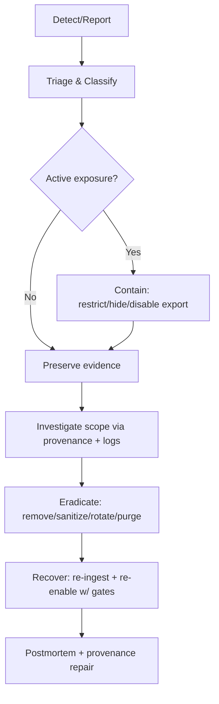

# 🔐 Sensitive Data Incident Runbook (KFM / MCP)


| Field | Value |
|---|---|
| 📄 File | `mcp/incidents/runbooks/sensitive-data.md` |
| 🆔 Runbook ID | `MCP-IR-SD-001` |
| 🗓️ Last updated | `2026-01-23` |
| 🧭 Primary systems | KFM APIs, Web UI, Pipelines (ingest/QA), Focus Mode AI, Catalog + Knowledge Graph |
| 👥 Owners | Security Lead • Data Steward • Platform Lead |
| 📌 Core invariants | Evidence-first • Provenance-first • Fail-closed governance |

> [!NOTE]
> **KFM is “catalog-driven” and “evidence-first”** — metadata (STAC/DCAT/PROV) and lineage are treated as first-class artifacts for auditability and trust. [oai_citation:0‡📚 Kansas Frontier Matrix (KFM) Data Intake – Technical & Design Guide.pdf](file-service://file-EbUCdsJMbu5KwpoKMrLrgj)

---

## 🧭 Quick Navigation

- [🎯 Scope](#-scope)
- [🧨 Golden Rules](#-golden-rules)
- [🧬 What “Sensitive Data” Means in KFM](#-what-sensitive-data-means-in-kfm)
- [🚦 Severity & Escalation](#-severity--escalation)
- [⏱️ 0–15 Minute Checklist](#️-015-minute-checklist)
- [🧩 Core Procedure](#-core-procedure-triage--contain--investigate--eradicate--recover--learn)
- [🧰 Playbooks](#-playbooks)
- [✅ Verification Checklist](#-verification-checklist)
- [🧾 Templates](#-templates)
- [📚 Source Files Reviewed](#-source-files-reviewed)

---

## 🎯 Scope

This runbook is used when **sensitive data is exposed, mishandled, or at risk** anywhere in the KFM stack:
- 🌐 Public UI (layers, stories, exports)
- 🔌 Public/partner APIs (queries, exports, search)
- 🧪 Pipelines (ingest, transformation, publish, CI)
- 🧠 Focus Mode AI outputs (answers, summaries, narratives)
- 🧾 Catalog + governance artifacts (STAC/DCAT/PROV, decision records, run manifests)

**Typical triggers**
- A dataset/layer is accidentally **published as public** when it should be restricted.
- Exact **sensitive locations** appear (endangered species habitat, archaeological sites, sacred/culturally sensitive sites). [oai_citation:1‡Kansas Frontier Matrix (KFM) – Comprehensive Architecture, Features, and Design.pdf](file-service://file-4Umt1yHoGKicdmLWzFJ9sC)
- **PII** is ingested and becomes accessible (even briefly). [oai_citation:2‡Kansas Frontier Matrix (KFM) – Comprehensive Architecture, Features, and Design.pdf](file-service://file-4Umt1yHoGKicdmLWzFJ9sC)
- **Secrets/credentials** show up in repo, logs, manifests, or outputs (CI should fail closed, but assume escape is possible). [oai_citation:3‡Additional Project Ideas.pdf](file-service://file-Pc2GNivcrHBeKjBQksLC3T)
- Focus Mode outputs **lack citations** or violate a sensitivity policy (policy gates treat this as a violation). [oai_citation:4‡Kansas Frontier Matrix (KFM) – Comprehensive Architecture, Features, and Design.pdf](file-service://file-4Umt1yHoGKicdmLWzFJ9sC)

---

## 🧨 Golden Rules

> [!IMPORTANT]
> 1) **Fail closed**: if unsure, **restrict** and investigate — don’t “leave it open.” KFM governance gates are explicitly designed with a “fail closed” philosophy. [oai_citation:5‡Kansas Frontier Matrix (KFM) – Comprehensive Architecture, Features, and Design.pdf](file-service://file-4Umt1yHoGKicdmLWzFJ9sC) [oai_citation:6‡Additional Project Ideas.pdf](file-service://file-Pc2GNivcrHBeKjBQksLC3T)  
> 2) **No output may be less restricted than its inputs** — derivatives inherit the strictest input classification. [oai_citation:7‡📚 Kansas Frontier Matrix (KFM) Data Intake – Technical & Design Guide.pdf](file-service://file-EbUCdsJMbu5KwpoKMrLrgj)  
> 3) **Trace everything**: use provenance (STAC/DCAT/PROV), run manifests, and the governance ledger to scope and remediate. [oai_citation:8‡Kansas Frontier Matrix (KFM) – AI System Overview 🧭🤖.pdf](file-service://file-Pv8eev6RWvCKrGCXyzY7zg) [oai_citation:9‡Additional Project Ideas.pdf](file-service://file-Pc2GNivcrHBeKjBQksLC3T)  
> 4) **Don’t spread the leak**: never paste raw sensitive payloads into public issues/PRs. Use redaction + private channels.

---

## 🧬 What “Sensitive Data” Means in KFM

KFM explicitly treats some data as sensitive and applies:
- **Location generalization**, **access control**, **tagging**, and **permissioned disclosure** (“sensitive location policy”). [oai_citation:10‡Kansas Frontier Matrix (KFM) – Comprehensive Technical Documentation.pdf](file-service://file-AkqwUuYPp5zePf7pv5SMxi)
- Extra ethical constraints under **CARE** (Collective benefit, Authority to control, Responsibility, Ethics) — especially for community/Indigenous data sovereignty contexts. [oai_citation:11‡Kansas Frontier Matrix (KFM) – Comprehensive Architecture, Features, and Design.pdf](file-service://file-4Umt1yHoGKicdmLWzFJ9sC) [oai_citation:12‡Kansas Frontier Matrix (KFM) – Comprehensive Technical Documentation.pdf](file-service://file-AkqwUuYPp5zePf7pv5SMxi)

### Common sensitive categories
- 🧍 **PII / personal data**: names + identifiers, addresses, sensitive records. [oai_citation:13‡Kansas Frontier Matrix (KFM) – Comprehensive Architecture, Features, and Design.pdf](file-service://file-4Umt1yHoGKicdmLWzFJ9sC)
- 🐾 **Endangered species habitats** (exact coordinates). [oai_citation:14‡Kansas Frontier Matrix (KFM) – Comprehensive Architecture, Features, and Design.pdf](file-service://file-4Umt1yHoGKicdmLWzFJ9sC)
- 🏺 **Archaeological sites** (looting risk). [oai_citation:15‡Kansas Frontier Matrix (KFM) – Comprehensive Architecture, Features, and Design.pdf](file-service://file-4Umt1yHoGKicdmLWzFJ9sC)
- 🪶 **Cultural heritage / Indigenous knowledge** requiring permission, approval, or restricted display under CARE + sovereignty principles. [oai_citation:16‡Kansas Frontier Matrix (KFM) – Comprehensive Architecture, Features, and Design.pdf](file-service://file-4Umt1yHoGKicdmLWzFJ9sC) [oai_citation:17‡📚 Kansas Frontier Matrix (KFM) Data Intake – Technical & Design Guide.pdf](file-service://file-EbUCdsJMbu5KwpoKMrLrgj)
- 🔑 **Secrets & credentials**: API keys, tokens, JWTs, etc. (blocked by policy-as-code/secret scanning patterns). [oai_citation:18‡Additional Project Ideas.pdf](file-service://file-Pc2GNivcrHBeKjBQksLC3T)

### KFM mechanics that matter during an incident
- **Sensitivity classification is built into metadata** and governs behavior (UI/API hide by default, warnings, role-only access, export restrictions). [oai_citation:19‡Kansas Frontier Matrix (KFM) – Comprehensive Architecture, Features, and Design.pdf](file-service://file-4Umt1yHoGKicdmLWzFJ9sC)
- **Automated policy gates** cover schema, STAC/DCAT/PROV completeness, license presence, sensitivity labeling/handling, provenance completeness, and Focus Mode citation requirements. [oai_citation:20‡Kansas Frontier Matrix (KFM) – Comprehensive Architecture, Features, and Design.pdf](file-service://file-4Umt1yHoGKicdmLWzFJ9sC)
- **Immutable governance ledger** logs AI outputs + compliance metadata for post-incident traceability. [oai_citation:21‡Kansas Frontier Matrix (KFM) – AI System Overview 🧭🤖.pdf](file-service://file-Pv8eev6RWvCKrGCXyzY7zg)
- **User-visible provenance** is a first-class UI feature (Layer Provenance panels, export attributions, auto-generated citations). [oai_citation:22‡Kansas Frontier Matrix (KFM) – AI System Overview 🧭🤖.pdf](file-service://file-Pv8eev6RWvCKrGCXyzY7zg)

---

## 🚦 Severity & Escalation

> [!TIP]
> If you’re unsure between two severities, pick the **higher** until you can rule it out.

| Severity | Name | Examples | Response target |
|---:|---|---|---|
| S0 | False alarm | Misclassification with no exposure | Fix + doc |
| S1 | Low | Restricted data exposed internally to staff only; short-lived | Same day |
| S2 | High | Sensitive layer reachable by non-admin roles; export enabled; short-lived | Immediate containment |
| S3 | Critical | Public exposure of PII, sacred sites, endangered habitat coordinates, or leaked secrets | **Stop-the-world** + rotate + purge |

**Escalate to S3 immediately** if:
- Secrets/credentials leaked (rotate now). [oai_citation:23‡Kansas Frontier Matrix (KFM) – Comprehensive Architecture, Features, and Design.pdf](file-service://file-4Umt1yHoGKicdmLWzFJ9sC)
- Public or uncontrolled access to PII or sensitive locations.  
- Focus Mode generated an answer that reveals restricted content or lacks citations (policy violation). [oai_citation:24‡Kansas Frontier Matrix (KFM) – Comprehensive Architecture, Features, and Design.pdf](file-service://file-4Umt1yHoGKicdmLWzFJ9sC)

---

## ⏱️ 0–15 Minute Checklist

- [ ] **Declare incident**: `IR-SD-YYYYMMDD-###` (open a *private* issue/thread if possible)
- [ ] **Assign roles**: Incident Commander (IC), Scribe, Security Lead, Data Steward, Eng Lead, Comms Liaison
- [ ] **Stop the bleeding** (fast containment options):
  - [ ] Flip dataset/layer classification to **restricted** so API/UI refuse service [oai_citation:25‡📚 Kansas Frontier Matrix (KFM) Data Intake – Technical & Design Guide.pdf](file-service://file-EbUCdsJMbu5KwpoKMrLrgj)
  - [ ] Disable exports for the affected layer(s) (policy gate + UI)
  - [ ] Kill-switch Focus Mode for the affected data domain (if AI output is involved)
  - [ ] Rotate compromised secrets immediately (if applicable) [oai_citation:26‡Kansas Frontier Matrix (KFM) – Comprehensive Architecture, Features, and Design.pdf](file-service://file-4Umt1yHoGKicdmLWzFJ9sC)
- [ ] **Preserve evidence** (don’t contaminate):
  - [ ] Snapshot request IDs / timestamps / involved endpoints
  - [ ] Collect run manifests for relevant pipeline runs (`data/audits/<run_id>/run_manifest.json`) [oai_citation:27‡Additional Project Ideas.pdf](file-service://file-Pc2GNivcrHBeKjBQksLC3T)
  - [ ] Pull governance ledger entries for the timeframe (AI outputs + approvals) [oai_citation:28‡Kansas Frontier Matrix (KFM) – AI System Overview 🧭🤖.pdf](file-service://file-Pv8eev6RWvCKrGCXyzY7zg)
- [ ] **Scope**: identify what data type, how many records, which roles could access, and exposure duration

---

## 🧩 Core Procedure (Triage → Contain → Investigate → Eradicate → Recover → Learn)



### 1) 🩺 Triage

**Goal:** confirm incident class + quickly identify the blast radius.

Checklist:
- Identify **data object(s)**: dataset_id, STAC collection/item IDs, DCAT record ID, story node ID(s)
- Confirm **classification**:
  - Look for `sensitivity.classification` and access rights fields (e.g., DCAT `dcat:accessRights`). [oai_citation:29‡📚 Kansas Frontier Matrix (KFM) Data Intake – Technical & Design Guide.pdf](file-service://file-EbUCdsJMbu5KwpoKMrLrgj)
- Determine **where exposure occurred**:
  - UI layer visibility, export button, API endpoint, cached tiles, story node, Focus Mode answer

> [!IMPORTANT]
> If you cannot determine classification quickly, **assume restricted** and contain first.

---

### 2) 🧯 Containment

**Goal:** stop further access without destroying evidence.

Fast containment levers (use multiple):
- **Classification flip to restricted** to block API/UI serving (quick patch). [oai_citation:30‡📚 Kansas Frontier Matrix (KFM) Data Intake – Technical & Design Guide.pdf](file-service://file-EbUCdsJMbu5KwpoKMrLrgj)
- **Hide sensitive layer** in UI by default and require explicit warning acknowledgement if still viewable. [oai_citation:31‡Kansas Frontier Matrix (KFM) – Comprehensive Architecture, Features, and Design.pdf](file-service://file-4Umt1yHoGKicdmLWzFJ9sC)
- **Disable exports** for affected layers (policy + UI control). [oai_citation:32‡Kansas Frontier Matrix (KFM) – Comprehensive Architecture, Features, and Design.pdf](file-service://file-4Umt1yHoGKicdmLWzFJ9sC)
- **Revoke/rotate secrets** if credentials are suspected compromised. [oai_citation:33‡Kansas Frontier Matrix (KFM) – Comprehensive Architecture, Features, and Design.pdf](file-service://file-4Umt1yHoGKicdmLWzFJ9sC)
- **Pause pipelines** that might republish or replicate the leak.

What to record (scribe):
- Timestamps: first report, containment start, containment complete
- Who executed what change
- Request IDs / endpoints / layer IDs
- Any public URLs that exposed data (store privately)

---

### 3) 🔎 Investigation (Scope & Root Cause)

**Goal:** determine “what happened”, “what was exposed”, and “how far it spread”.

Use **evidence-first** artifacts:
- **Run Manifests** (who/what/when, inputs/outputs, tool versions, counts) — stored under `data/audits/<run_id>/run_manifest.json` and used for policy checks. [oai_citation:34‡Additional Project Ideas.pdf](file-service://file-Pc2GNivcrHBeKjBQksLC3T)
- **Provenance graph** (STAC/DCAT/PROV alignment) — trace from published items back to inputs and activities. [oai_citation:35‡📚 Kansas Frontier Matrix (KFM) Data Intake – Technical & Design Guide.pdf](file-service://file-EbUCdsJMbu5KwpoKMrLrgj)
- **Governance ledger**: append-only signed record of AI outputs and decisions. [oai_citation:36‡Kansas Frontier Matrix (KFM) – AI System Overview 🧭🤖.pdf](file-service://file-Pv8eev6RWvCKrGCXyzY7zg) [oai_citation:37‡Kansas Frontier Matrix (KFM) – Comprehensive Architecture, Features, and Design.pdf](file-service://file-4Umt1yHoGKicdmLWzFJ9sC)

Key questions:
- **Data type:** PII? secrets? sensitive location? culturally restricted?
- **Volume:** how many rows/features/tiles?
- **Exposure:** which roles could see it (public vs authorized roles)? [oai_citation:38‡Kansas Frontier Matrix (KFM) – Comprehensive Architecture, Features, and Design.pdf](file-service://file-4Umt1yHoGKicdmLWzFJ9sC)
- **Exports:** was export possible, and did logs show export activity? [oai_citation:39‡Kansas Frontier Matrix (KFM) – Comprehensive Architecture, Features, and Design.pdf](file-service://file-4Umt1yHoGKicdmLWzFJ9sC)
- **Derived outputs:** any stories, AI narratives, summaries, caches, or downstream datasets?
  - Remember: **derivatives must not be less restricted than inputs** [oai_citation:40‡📚 Kansas Frontier Matrix (KFM) Data Intake – Technical & Design Guide.pdf](file-service://file-EbUCdsJMbu5KwpoKMrLrgj)

---

### 4) 🧼 Eradication / Remediation

**Goal:** remove the sensitive content from serving paths, derived artifacts, and (if required) history.

Core actions:
- Remove or sanitize the dataset/layer content (prefer rebuild + re-ingest through gates)
- Tighten classification and usage constraints in metadata
- Add/strengthen policy gates (OPA/Conftest) to prevent recurrence [oai_citation:41‡Kansas Frontier Matrix (KFM) – Comprehensive Architecture, Features, and Design.pdf](file-service://file-4Umt1yHoGKicdmLWzFJ9sC)
- If secrets were involved: rotate and audit usage; update secret patterns/rules [oai_citation:42‡Additional Project Ideas.pdf](file-service://file-Pc2GNivcrHBeKjBQksLC3T)

> [!DANGER]
> If sensitive data entered Git history: treat like a secret — remove files, and purge history **if required** (force remove). [oai_citation:43‡📚 Kansas Frontier Matrix (KFM) Data Intake – Technical & Design Guide.pdf](file-service://file-EbUCdsJMbu5KwpoKMrLrgj)

Privacy note (important for long-term controls):
- **Outputs can leak sensitive info even if raw data isn’t exposed**; query auditing/inference control and differential privacy are relevant mitigations when publishing derived analytics. [oai_citation:44‡Data Mining Concepts & applictions.pdf](file-service://file-2uwEbQAFVKpXaTtWgUirAH)

---

### 5) 🔁 Recovery

**Goal:** safely restore functionality with correct gates & guardrails.

- Re-ingest sanitized dataset through standard pipelines
- Ensure required metadata fields are present (license, sensitivity, provenance completeness) — metadata QA fails otherwise. [oai_citation:45‡Kansas Frontier Matrix (KFM) – Comprehensive Architecture, Features, and Design.pdf](file-service://file-4Umt1yHoGKicdmLWzFJ9sC)
- Confirm UI behavior:
  - hidden-by-default for sensitive layers
  - warnings where applicable
  - export restrictions
- Confirm Focus Mode:
  - citations required or refusal
  - sensitivity compliance

---

### 6) 🧠 Post-Incident (Learning + Provenance Repair)

KFM expects **rollback + provenance repair** to be documented as a first-class operation:
- Produce a **PROV record** marking retracted outputs (datasets/stories) and explaining why; keep transparency while preventing harm. [oai_citation:46‡📚 Kansas Frontier Matrix (KFM) Data Intake – Technical & Design Guide.pdf](file-service://file-EbUCdsJMbu5KwpoKMrLrgj)

Also:
- Log the incident and outcomes in governance records (including Council notification/approval if relevant). [oai_citation:47‡📚 Kansas Frontier Matrix (KFM) Data Intake – Technical & Design Guide.pdf](file-service://file-EbUCdsJMbu5KwpoKMrLrgj)

---

## 🧰 Playbooks

### A) 🗺️ Sensitive Location Leak (endangered species / archaeological / sacred)

KFM explicitly calls out location generalization and sensitivity-aware handling for sensitive sites and habitats. [oai_citation:48‡Kansas Frontier Matrix (KFM) – Comprehensive Technical Documentation.pdf](file-service://file-AkqwUuYPp5zePf7pv5SMxi) [oai_citation:49‡Kansas Frontier Matrix (KFM) – Comprehensive Architecture, Features, and Design.pdf](file-service://file-4Umt1yHoGKicdmLWzFJ9sC)

**Contain**
- Flip layer to restricted (blocks UI/API)
- Disable export and public search
- Purge tile/cache artifacts for the layer

**Remediate**
- Replace exact coordinates with:
  - aggregation to larger polygons, or
  - lower-resolution representations (generalized locations). [oai_citation:50‡Kansas Frontier Matrix (KFM) – Comprehensive Architecture, Features, and Design.pdf](file-service://file-4Umt1yHoGKicdmLWzFJ9sC)
- Consider an “obscured” public view + privileged exact view.
  - Example pattern (biodiversity): rounding coordinates to ~10km is used in other systems to protect sensitive records. [oai_citation:51‡Innovative Concepts to Evolve the Kansas Frontier Matrix (KFM).pdf](file-service://file-G71zNoWKxsoSW44iwZaaCC)

**Verify**
- Public map cannot reveal exact points (including by zooming, exports, or API filters)
- Derived story nodes/narratives do not restate exact locations

---

### B) 🧍 PII / Personal Data Leak

**Contain**
- Immediate restrict classification + disable export [oai_citation:52‡📚 Kansas Frontier Matrix (KFM) Data Intake – Technical & Design Guide.pdf](file-service://file-EbUCdsJMbu5KwpoKMrLrgj)
- If possible, temporarily remove the layer from UI navigation

**Investigate**
- Identify where PII appears:
  - raw tables/GeoJSON
  - catalog metadata
  - story nodes
  - Focus Mode responses
  - cached exports

**Remediate**
- Remove or anonymize data; rebuild dataset and re-ingest
- Add OPA/Conftest rule to detect PII patterns if feasible (regex/heuristics), similar to secret scans [oai_citation:53‡Additional Project Ideas.pdf](file-service://file-Pc2GNivcrHBeKjBQksLC3T)
- Ensure derivatives inherit classification: **no output less restricted than inputs** [oai_citation:54‡📚 Kansas Frontier Matrix (KFM) Data Intake – Technical & Design Guide.pdf](file-service://file-EbUCdsJMbu5KwpoKMrLrgj)

**Longer-term**
- Consider query auditing / inference control for analytics outputs (privacy can leak via outputs) [oai_citation:55‡Data Mining Concepts & applictions.pdf](file-service://file-2uwEbQAFVKpXaTtWgUirAH)

---

### C) 🔑 Credential / Secret Leak (Tokens / API Keys)

KFM governance includes explicit “no secrets in code” practices and secret scanning patterns. [oai_citation:56‡📚 Kansas Frontier Matrix (KFM) Data Intake – Technical & Design Guide.pdf](file-service://file-EbUCdsJMbu5KwpoKMrLrgj) [oai_citation:57‡Additional Project Ideas.pdf](file-service://file-Pc2GNivcrHBeKjBQksLC3T)

**Contain (immediate)**
- Rotate/revoke the secret(s)
- Identify all services using the secret; re-issue with least privilege
- Audit recent usage for anomalies

**Remediate**
- Remove the secret from the repo/artifacts/logs
- Add/strengthen secret pattern rules (OPA/Conftest) to fail PRs if found [oai_citation:58‡Additional Project Ideas.pdf](file-service://file-Pc2GNivcrHBeKjBQksLC3T)
- If leaked into Git history: purge if required (treat like secret) [oai_citation:59‡📚 Kansas Frontier Matrix (KFM) Data Intake – Technical & Design Guide.pdf](file-service://file-EbUCdsJMbu5KwpoKMrLrgj)

---

### D) 🧠 Focus Mode / AI Output Leak (Policy or Citation Violation)

Focus Mode outputs must include citations; inability to cite is a policy violation and should result in refusal. [oai_citation:60‡Kansas Frontier Matrix (KFM) – Comprehensive Architecture, Features, and Design.pdf](file-service://file-4Umt1yHoGKicdmLWzFJ9sC)

**Contain**
- Disable the affected prompt route/mode/domain if it’s producing leaks
- Remove the specific AI outputs from public display (stories, narrative exports)
- Pull governance ledger records for the output session(s) [oai_citation:61‡Kansas Frontier Matrix (KFM) – AI System Overview 🧭🤖.pdf](file-service://file-Pv8eev6RWvCKrGCXyzY7zg)

**Investigate**
- Determine whether:
  - a sensitive dataset was erroneously accessible to the AI,
  - classification tagging failed,
  - prompt injection bypassed guardrails (Prompt Gate exists as mitigation). [oai_citation:62‡Kansas Frontier Matrix (KFM) – Comprehensive Architecture, Features, and Design.pdf](file-service://file-4Umt1yHoGKicdmLWzFJ9sC)

**Remediate**
- Update policy gates (deny sensitive access, enforce citations, restrict exports)
- Add a governance flag for “Sensitive data notice” / review requirement

---

### E) 📜 License / AccessRights Violation (Restricted use accidentally enabled)

KFM treats license compliance and access rights as required metadata and policy-gated behavior. [oai_citation:63‡Kansas Frontier Matrix (KFM) – Comprehensive Architecture, Features, and Design.pdf](file-service://file-4Umt1yHoGKicdmLWzFJ9sC) [oai_citation:64‡📚 Kansas Frontier Matrix (KFM) Data Intake – Technical & Design Guide.pdf](file-service://file-EbUCdsJMbu5KwpoKMrLrgj)

**Contain**
- Restrict dataset and disable downloads/exports
- Add warning in UI provenance panels if temporary access is allowed

**Remediate**
- Fix license metadata and distributions
- Add policy to prevent publishing data without known license or access rules [oai_citation:65‡Kansas Frontier Matrix (KFM) – Comprehensive Architecture, Features, and Design.pdf](file-service://file-4Umt1yHoGKicdmLWzFJ9sC)

---

### F) 🪶 Indigenous / Cultural Protocol Violation (CARE & Sovereignty)

KFM’s governance expects **Authority to Control** and community approval when appropriate; ethics/council workflows are part of intake oversight. [oai_citation:66‡📚 Kansas Frontier Matrix (KFM) Data Intake – Technical & Design Guide.pdf](file-service://file-EbUCdsJMbu5KwpoKMrLrgj) [oai_citation:67‡Kansas Frontier Matrix (KFM) – Comprehensive Architecture, Features, and Design.pdf](file-service://file-4Umt1yHoGKicdmLWzFJ9sC)

**Contain**
- Immediately restrict/hide the dataset/story/layer
- Halt further propagation (pipelines, exports, narratives)

**Engage**
- Notify the appropriate governance/council/community liaison
- Confirm whether data requires removal, generalization, or restricted access with contextual framing

**Remediate**
- Apply cultural protocol metadata / access constraints
- Consider platforms/patterns like Mukurtu-style traditional knowledge labels and differential access models (as an inspiration). [oai_citation:68‡Innovative Concepts to Evolve the Kansas Frontier Matrix (KFM).pdf](file-service://file-G71zNoWKxsoSW44iwZaaCC)

---

## ✅ Verification Checklist

**Policy & Metadata**
- [ ] Sensitivity classification present and correct [oai_citation:69‡Kansas Frontier Matrix (KFM) – Comprehensive Architecture, Features, and Design.pdf](file-service://file-4Umt1yHoGKicdmLWzFJ9sC)
- [ ] Required license + provenance fields present [oai_citation:70‡Kansas Frontier Matrix (KFM) – Comprehensive Architecture, Features, and Design.pdf](file-service://file-4Umt1yHoGKicdmLWzFJ9sC)
- [ ] “No output less restricted than inputs” satisfied for derivatives [oai_citation:71‡📚 Kansas Frontier Matrix (KFM) Data Intake – Technical & Design Guide.pdf](file-service://file-EbUCdsJMbu5KwpoKMrLrgj)

**UI**
- [ ] Sensitive layers hidden by default or gated by warning/role checks [oai_citation:72‡Kansas Frontier Matrix (KFM) – Comprehensive Architecture, Features, and Design.pdf](file-service://file-4Umt1yHoGKicdmLWzFJ9sC)
- [ ] Provenance/citation panels show sources + licensing [oai_citation:73‡Kansas Frontier Matrix (KFM) – AI System Overview 🧭🤖.pdf](file-service://file-Pv8eev6RWvCKrGCXyzY7zg)
- [ ] Evidence Tree / source inspector still works for transparency (without revealing restricted details) [oai_citation:74‡Kansas Frontier Matrix – Comprehensive UI System Overview.pdf](file-service://file-KcBQruYcoFVDEixzzRHTwt)

**AI**
- [ ] Focus Mode outputs include citations or refuse [oai_citation:75‡Kansas Frontier Matrix (KFM) – Comprehensive Architecture, Features, and Design.pdf](file-service://file-4Umt1yHoGKicdmLWzFJ9sC)
- [ ] Sensitive data notices / flags reviewed when relevant
- [ ] Governance ledger contains traceable records for affected outputs [oai_citation:76‡Kansas Frontier Matrix (KFM) – AI System Overview 🧭🤖.pdf](file-service://file-Pv8eev6RWvCKrGCXyzY7zg)

**Operations**
- [ ] Caches/tiles/exports invalidated
- [ ] Secrets rotated if necessary [oai_citation:77‡Kansas Frontier Matrix (KFM) – Comprehensive Architecture, Features, and Design.pdf](file-service://file-4Umt1yHoGKicdmLWzFJ9sC)

---

## 🧾 Templates

<details>
<summary><strong>🧷 Incident Issue Template (Private)</strong></summary>

```markdown
# IR-SD-YYYYMMDD-###

## Summary
- What happened:
- Detected by:
- Severity (S0–S3):
- Systems affected:

## Data Classification
- Dataset/Layer IDs:
- sensitivity.classification:
- accessRights / usage constraints:
- Data type: (PII / sensitive location / cultural / secrets / license)

## Timeline (UTC)
- T0 Detect:
- T1 Contain start:
- T2 Contain complete:
- T3 Root cause confirmed:
- T4 Recovery complete:

## Containment Actions
- [ ] Classification flip
- [ ] Exports disabled
- [ ] AI route disabled
- [ ] Secrets rotated
- [ ] Cache purge

## Evidence
- Run manifests: data/audits/<run_id>/run_manifest.json
- Governance ledger entries:
- Logs / request IDs:
- Relevant commits/PRs:

## Root Cause
- What control failed:
- Why it failed:
- How it bypassed gates:

## Remediation
- [ ] Data removed/sanitized
- [ ] Policy gate added/updated
- [ ] Tests added
- [ ] Documentation updated

## Postmortem Notes
- Lessons learned:
- Preventative actions:
- Owner + due dates:
```

</details>

<details>
<summary><strong>📣 Community/User Notice Template (Public-safe)</strong></summary>

```markdown
## Notice: Data Access Restriction (KFM)

We identified an issue where certain information may have been accessible in a way that did not match our data governance standards.

### What we did
- Restricted access to the affected layer/dataset
- Disabled export functionality while we investigate
- Reviewed logs and governance records to determine scope

### What’s next
- We will publish a transparent post-incident summary once verification is complete.
- If you believe you were impacted or have relevant context, please contact the maintainers via the official channel.

(We intentionally do not share sensitive details in public notices.)
```

</details>

<details>
<summary><strong>🧾 Postmortem + Provenance Repair Template</strong></summary>

```markdown
# Postmortem: IR-SD-YYYYMMDD-###

## Executive Summary
- Impact:
- Duration:
- Data types affected:
- User impact:

## What Happened (Narrative)
- Evidence-based description with references to run manifests, provenance, governance ledger entries.

## Root Cause
- Direct cause:
- Contributing factors:
- Control gaps:

## Containment & Remediation
- Immediate containment actions:
- Long-term remediation actions:

## Provenance Repair Actions
- PROV retraction record created for affected outputs (datasets/stories)
- Rationale recorded and linked in governance ledger

## Prevent Recurrence
- New/updated policy gates:
- New tests:
- Process updates:
- Training/awareness:

## Action Items
- [ ] Item — owner — due date
- [ ] Item — owner — due date
```

</details>

---

## 📚 Source Files Reviewed

### ✅ Core KFM docs (project files)
- 📘 Kansas Frontier Matrix (KFM) – Comprehensive Technical Documentation.pdf  [oai_citation:78‡Kansas Frontier Matrix (KFM) – Comprehensive Technical Documentation.pdf](file-service://file-AkqwUuYPp5zePf7pv5SMxi)  
  - Sensitive data measures (generalization, access controls, tagging, CARE), API security/logging. [oai_citation:79‡Kansas Frontier Matrix (KFM) – Comprehensive Technical Documentation.pdf](file-service://file-AkqwUuYPp5zePf7pv5SMxi) [oai_citation:80‡Kansas Frontier Matrix (KFM) – Comprehensive Technical Documentation.pdf](file-service://file-AkqwUuYPp5zePf7pv5SMxi)
- 🧱 Kansas Frontier Matrix (KFM) – Comprehensive Architecture, Features, and Design.pdf  [oai_citation:81‡Kansas Frontier Matrix (KFM) – Comprehensive Architecture, Features, and Design.pdf](file-service://file-4Umt1yHoGKicdmLWzFJ9sC)  
  - Policy gates, sensitivity model, exports/warnings, incident response plan reference. [oai_citation:82‡Kansas Frontier Matrix (KFM) – Comprehensive Architecture, Features, and Design.pdf](file-service://file-4Umt1yHoGKicdmLWzFJ9sC) [oai_citation:83‡Kansas Frontier Matrix (KFM) – Comprehensive Architecture, Features, and Design.pdf](file-service://file-4Umt1yHoGKicdmLWzFJ9sC)
- 🧠 Kansas Frontier Matrix (KFM) – AI System Overview 🧭🤖.pdf  [oai_citation:84‡Kansas Frontier Matrix (KFM) – AI System Overview 🧭🤖.pdf](file-service://file-Pv8eev6RWvCKrGCXyzY7zg)  
  - Governance ledger, provenance UX, governance flags for sensitive notices. [oai_citation:85‡Kansas Frontier Matrix (KFM) – AI System Overview 🧭🤖.pdf](file-service://file-Pv8eev6RWvCKrGCXyzY7zg)
- 🖥️ Kansas Frontier Matrix – Comprehensive UI System Overview.pdf  [oai_citation:86‡Kansas Frontier Matrix – Comprehensive UI System Overview.pdf](file-service://file-KcBQruYcoFVDEixzzRHTwt)  
  - Evidence Tree / provenance UI patterns (must stay safe during incidents). [oai_citation:87‡Kansas Frontier Matrix – Comprehensive UI System Overview.pdf](file-service://file-KcBQruYcoFVDEixzzRHTwt)
- 📚 Kansas Frontier Matrix (KFM) Data Intake – Technical & Design Guide.pdf  [oai_citation:88‡📚 Kansas Frontier Matrix (KFM) Data Intake – Technical & Design Guide.pdf](file-service://file-EbUCdsJMbu5KwpoKMrLrgj)  
  - Sensitivity fields, “no output less restricted,” rollback procedures for sensitive data, council workflow hooks. [oai_citation:89‡📚 Kansas Frontier Matrix (KFM) Data Intake – Technical & Design Guide.pdf](file-service://file-EbUCdsJMbu5KwpoKMrLrgj) [oai_citation:90‡📚 Kansas Frontier Matrix (KFM) Data Intake – Technical & Design Guide.pdf](file-service://file-EbUCdsJMbu5KwpoKMrLrgj)
- 🌟 Kansas Frontier Matrix – Latest Ideas & Future Proposals.docx.pdf  [oai_citation:91‡🌟 Kansas Frontier Matrix – Latest Ideas & Future Proposals.docx.pdf](file-service://file-SQ3f7ve8SGiusT6ThZEuCe)  
  - Rollback/provenance repair runbooks concept; W-P-E safety checks for sensitive redaction/approval. [oai_citation:92‡📚 Kansas Frontier Matrix (KFM) Data Intake – Technical & Design Guide.pdf](file-service://file-EbUCdsJMbu5KwpoKMrLrgj) [oai_citation:93‡Data Mining Concepts & applictions.pdf](file-service://file-2uwEbQAFVKpXaTtWgUirAH)
- 💡 Innovative Concepts to Evolve the Kansas Frontier Matrix (KFM).pdf  [oai_citation:94‡Kansas Frontier Matrix – Comprehensive UI System Overview.pdf](file-service://file-KcBQruYcoFVDEixzzRHTwt)  
  - Cultural protocol models (Mukurtu/TK labels inspiration) + sensitive record location rounding example. [oai_citation:95‡Innovative Concepts to Evolve the Kansas Frontier Matrix (KFM).pdf](file-service://file-G71zNoWKxsoSW44iwZaaCC) [oai_citation:96‡Innovative Concepts to Evolve the Kansas Frontier Matrix (KFM).pdf](file-service://file-G71zNoWKxsoSW44iwZaaCC)
- 🧠 Additional Project Ideas.pdf  [oai_citation:97‡Additional Project Ideas.pdf](file-service://file-Pc2GNivcrHBeKjBQksLC3T)  
  - Run manifests, policy-as-code, secret scanning patterns, fail-closed stance. [oai_citation:98‡Additional Project Ideas.pdf](file-service://file-Pc2GNivcrHBeKjBQksLC3T) [oai_citation:99‡Additional Project Ideas.pdf](file-service://file-Pc2GNivcrHBeKjBQksLC3T)

### 📦 Reference portfolios (project files)
> [!NOTE]
> The following are **PDF portfolios** (open in Acrobat for full embedded materials). They’re still valuable reference libraries for implementation details and deeper research.

- 🧠 AI Concepts & more.pdf  [oai_citation:100‡AI Concepts & more.pdf](file-service://file-K6BctJjeUwvyCahLf9qdwr) [oai_citation:101‡AI Concepts & more.pdf](file-service://file-K6BctJjeUwvyCahLf9qdwr)
- 🗺️ Maps-GoogleMaps-VirtualWorlds-Archaeological-Computer Graphics-Geospatial-webgl.pdf  [oai_citation:102‡Maps-GoogleMaps-VirtualWorlds-Archaeological-Computer Graphics-Geospatial-webgl.pdf](file-service://file-RshcX5sNY2wpiNjRfoP6z6) [oai_citation:103‡Maps-GoogleMaps-VirtualWorlds-Archaeological-Computer Graphics-Geospatial-webgl.pdf](file-service://file-RshcX5sNY2wpiNjRfoP6z6)
- 🧰 Various programming langurages & resources 1.pdf  [oai_citation:104‡Data Managment-Theories-Architures-Data Science-Baysian Methods-Some Programming Ideas.pdf](file-service://file-RrXMFY7cP925exsQYermf2) [oai_citation:105‡Various programming langurages & resources 1.pdf](file-service://file-4wp3wSSZs7gk5qHWaJVudi)
- 🧮 Data Managment-Theories-Architures-Data Science-Baysian Methods-Some Programming Ideas.pdf  [oai_citation:106‡Innovative Concepts to Evolve the Kansas Frontier Matrix (KFM).pdf](file-service://file-G71zNoWKxsoSW44iwZaaCC) [oai_citation:107‡Data Managment-Theories-Architures-Data Science-Baysian Methods-Some Programming Ideas.pdf](file-service://file-RrXMFY7cP925exsQYermf2)

### 📎 Supporting (non-core) docs referenced for patterns
- 🔒 Data Mining Concepts & applictions.pdf  [oai_citation:108‡Data Mining Concepts & applictions.pdf](file-service://file-2uwEbQAFVKpXaTtWgUirAH) (privacy leakage via outputs + query auditing + differential privacy) [oai_citation:109‡Data Mining Concepts & applictions.pdf](file-service://file-2uwEbQAFVKpXaTtWgUirAH)
- 🧾 MARKDOWN_GUIDE_v13.md.gdoc  [oai_citation:110‡MARKDOWN_GUIDE_v13.md.gdoc](file-service://file-UYVruFXfueR8veHMUKeugU) (docs structure + governance map)
- ✍️ Comprehensive Markdown Guide_ Syntax, Extensions, and Best Practices.docx  [oai_citation:111‡Comprehensive Markdown Guide_ Syntax, Extensions, and Best Practices.docx](file-service://file-J6rFRcp4ExCCeCdTevQjxz) (issue checklists + runbook formatting) [oai_citation:112‡Comprehensive Markdown Guide_ Syntax, Extensions, and Best Practices.docx](file-service://file-J6rFRcp4ExCCeCdTevQjxz)

---
