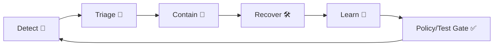

# 🧯 Incident Templates (MCP)


**Purpose:** This folder holds **copy/paste templates** for documenting **incidents** across the Kansas Frontier Matrix (KFM) stack — data intake → catalog (STAC/DCAT/PROV) → graph → API → UI → Focus Mode AI → governance & supply-chain.

> [!IMPORTANT]
> KFM is designed to be **contract-first** and **provenance-first** (no “mystery layers”). Incident docs must be **evidence-backed** and **reproducible** — especially when user trust or sensitive content is involved. [oai_citation:0‡Kansas Frontier Matrix (KFM) – Comprehensive Technical Documentation.pdf](file-service://file-AkqwUuYPp5zePf7pv5SMxi) [oai_citation:1‡Kansas Frontier Matrix (KFM) – AI System Overview 🧭🤖.pdf](file-service://file-Pv8eev6RWvCKrGCXyzY7zg)

---

## 📦 What lives in `mcp/incidents/templates/`

✅ **Only templates** live here.  
🗂️ **Real incidents** should be created under `mcp/incidents/<YYYY>/INC-<YYYY>-<NNNN>-<slug>/`.

Example layout:

```text
mcp/
  incidents/
    templates/
      README.md                👈 you are here
      incident.md              🧾 live incident log (timeline + status updates)
      postmortem.md            🧠 root cause + remediations
      evidence-pack.md         🧷 links, hashes, run manifests, screenshots
      security-incident.md     🔒 data exposure / auth / secrets / supply chain
      data-quality-incident.md 🧪 schema/CRS/range/provenance issues
      ai-incident.md           🤖 drift/bias/prompt security/provenance violations
      ui-outage.md             🗺️ map/timeline/story rendering issues
      graph-integrity.md       🧬 Neo4j integrity / lineage / orphan nodes
      comms-update.md          📣 user-facing updates (banner/email/social draft)
```

> [!TIP]
> Keep templates stable. If you change a template, you’re changing the “contract” for future incidents — update carefully and document why. [oai_citation:2‡Kansas Frontier Matrix (KFM) – Comprehensive Technical Documentation.pdf](file-service://file-AkqwUuYPp5zePf7pv5SMxi)

---

## ⚡ Quick start

1) **Create a new incident folder**
```bash
mkdir -p mcp/incidents/2026/INC-2026-0001-short-slug
```

2) **Copy templates**
```bash
cp -R mcp/incidents/templates/* mcp/incidents/2026/INC-2026-0001-short-slug/
```

3) **Start the live log**
- Open `incident.md`
- Fill the front matter + start the timeline immediately
- Add a first “Current Status” entry

4) **Capture evidence early**
- Paste links + attach hashes/digests + record governance IDs in `evidence-pack.md`
- If AI/Focus Mode is involved: record the citations/provenance details (required) [oai_citation:3‡Kansas Frontier Matrix (KFM) – AI System Overview 🧭🤖.pdf](file-service://file-Pv8eev6RWvCKrGCXyzY7zg)

5) **Close the loop**
- After stabilizing, write the postmortem and add **policy/test gates** so it can’t happen again (fail closed). [oai_citation:4‡Kansas Frontier Matrix (KFM) – AI System Overview 🧭🤖.pdf](file-service://file-Pv8eev6RWvCKrGCXyzY7zg) [oai_citation:5‡Additional Project Ideas.pdf](file-service://file-Pc2GNivcrHBeKjBQksLC3T)

---

## 🚨 What counts as an “incident” in KFM?

Use these templates when anything threatens:

- **Availability** (outages, broken UI, API errors)
- **Integrity** (wrong maps, bad CRS, broken lineage, graph corruption)
- **Confidentiality** (secrets/PII/sensitive/sovereignty-protected data exposure)
- **Governance** (license missing, citations missing, policy pack violation)
- **Trust** (uncited Focus Mode outputs, misleading narratives, provenance breaks) [oai_citation:6‡Kansas Frontier Matrix (KFM) – AI System Overview 🧭🤖.pdf](file-service://file-Pv8eev6RWvCKrGCXyzY7zg) [oai_citation:7‡Kansas Frontier Matrix – Comprehensive UI System Overview.pdf](file-service://file-KcBQruYcoFVDEixzzRHTwt)

---

## 🧭 Severity guide (recommended)

| Severity | Label | Typical impact | Examples |
|---|---:|---|---|
| P0 | 🔥 Critical | security/safety/trust break, widespread corruption | secrets/PII committed; uncited AI outputs shipped; provenance chain broken |
| P1 | 🚧 High | major user-facing outage or wrong results | map layer rendering failure; wrong timeline bounds; corrupted STAC collection |
| P2 | 🧰 Medium | partial degradation | slow queries; ingestion lag; minor UI regression |
| P3 | 🧹 Low | nuisance | cosmetic issue; small metadata typo with no downstream effects |

> [!NOTE]
> KFM’s governance stance is “**fail closed**”: if required conditions (license, provenance, policy) aren’t met, the pipeline should reject the change and block promotion. [oai_citation:8‡Additional Project Ideas.pdf](file-service://file-Pc2GNivcrHBeKjBQksLC3T) [oai_citation:9‡Kansas Frontier Matrix (KFM) – AI System Overview 🧭🤖.pdf](file-service://file-Pv8eev6RWvCKrGCXyzY7zg)

---

## 👥 Incident roles (lightweight, but explicit)

- **🧑‍✈️ Incident Commander (IC):** sets priorities, keeps scope tight, assigns owners
- **📝 Scribe:** maintains `incident.md` timeline + decisions
- **🗣️ Comms:** drafts user-facing updates (`comms-update.md`)
- **🛠️ Tech Lead(s):** owns the fix + rollback plan
- **⚖️ Governance Lead:** handles license/sensitivity/CARE escalations and approvals [oai_citation:10‡Kansas Frontier Matrix (KFM) – AI System Overview 🧭🤖.pdf](file-service://file-Pv8eev6RWvCKrGCXyzY7zg)

---

## 🧷 Evidence Pack checklist (copy into the incident)

Check everything you can gather **without guesswork**:

- [ ] **Run manifest(s)** (`data/audits/<run_id>/run_manifest.json`) + digest/idempotency key [oai_citation:11‡Additional Project Ideas.pdf](file-service://file-Pc2GNivcrHBeKjBQksLC3T)
- [ ] **STAC/DCAT/PROV** identifiers and/or URLs for affected entities [oai_citation:12‡📚 Kansas Frontier Matrix (KFM) Data Intake – Technical & Design Guide.pdf](file-service://file-EbUCdsJMbu5KwpoKMrLrgj)
- [ ] **Governance ledger entry ID(s)** for relevant AI outputs/decisions [oai_citation:13‡Kansas Frontier Matrix (KFM) – AI System Overview 🧭🤖.pdf](file-service://file-Pv8eev6RWvCKrGCXyzY7zg)
- [ ] **Policy pack output** (OPA/Conftest violations, CI logs) [oai_citation:14‡Kansas Frontier Matrix (KFM) – AI System Overview 🧭🤖.pdf](file-service://file-Pv8eev6RWvCKrGCXyzY7zg)
- [ ] **Commit SHA / PR link** (if caused by a change)
- [ ] **Graph queries** used to verify impact (counts, orphan checks, lineage checks)
- [ ] **Screenshots** for UI issues (map view, layer toggle, provenance panel)
- [ ] **Cosign verify output / signature status** (if artifact integrity is involved) [oai_citation:15‡Additional Project Ideas.pdf](file-service://file-Pc2GNivcrHBeKjBQksLC3T)
- [ ] **User reports / repro steps** (inputs, region/time window, browser/device)
- [ ] **Rollback evidence** (what reverted, why, what data version restored) [oai_citation:16‡📚 Kansas Frontier Matrix (KFM) Data Intake – Technical & Design Guide.pdf](file-service://file-EbUCdsJMbu5KwpoKMrLrgj)

---

## 🧾 Required incident front matter (recommended)

All templates should begin with YAML front matter so incidents are searchable and automatable:

```yaml
---
incident_id: INC-2026-0001
severity: P1
status: investigating # investigating|mitigated|resolved
started_at_utc: 2026-01-23T00:00:00Z
detected_by: policy_gate # user_report|monitoring|policy_gate|maintainer
components:
  - intake
  - catalog/stac
  - graph/neo4j
  - api
  - ui
  - ai/focus
data_classification: public # public|restricted|confidential
care_label: none # use CARE-style labels when applicable
related_prs: []
related_runs: []
governance_ledger_ids: []
---
```

> [!IMPORTANT]
> If the incident touches **sensitive** or **sovereignty-protected** data, explicitly label it and involve governance review. KFM governance expects sensitivity/sovereignty metadata and enforcement from day zero. [oai_citation:17‡📚 Kansas Frontier Matrix (KFM) Data Intake – Technical & Design Guide.pdf](file-service://file-EbUCdsJMbu5KwpoKMrLrgj) [oai_citation:18‡📚 Kansas Frontier Matrix (KFM) Data Intake – Technical & Design Guide.pdf](file-service://file-EbUCdsJMbu5KwpoKMrLrgj)

---

## 🔁 Workflow loop (recommended)



KFM already leans on **CI policy gates** and governance checks — the “Learn → Gate” step is how we prevent repeat incidents. [oai_citation:19‡Kansas Frontier Matrix (KFM) – AI System Overview 🧭🤖.pdf](file-service://file-Pv8eev6RWvCKrGCXyzY7zg) [oai_citation:20‡Additional Project Ideas.pdf](file-service://file-Pc2GNivcrHBeKjBQksLC3T)

---

## 🧨 Special handling scenarios

### 🔒 Secrets / PII / “No secrets in git”
If an incident involves secrets or PII in the repo:
- **Treat as P0**
- Follow the project’s **emergency procedure** for sensitive content and repo history cleanup [oai_citation:21‡📚 Kansas Frontier Matrix (KFM) Data Intake – Technical & Design Guide.pdf](file-service://file-EbUCdsJMbu5KwpoKMrLrgj)
- Add/strengthen policy gates that detect secrets (fail closed) [oai_citation:22‡Additional Project Ideas.pdf](file-service://file-Pc2GNivcrHBeKjBQksLC3T)

### 🤖 Focus Mode / AI incidents
Common triggers:
- **Missing citations / provenance breaks**
- **Drift or bias flags**
- **Prompt security violations**
- Runtime OPA denies / content withheld

KFM expects an immutable, signed governance ledger for AI activity, plus drift monitoring and runtime policy enforcement options. [oai_citation:23‡Kansas Frontier Matrix (KFM) – AI System Overview 🧭🤖.pdf](file-service://file-Pv8eev6RWvCKrGCXyzY7zg) [oai_citation:24‡Kansas Frontier Matrix (KFM) – AI System Overview 🧭🤖.pdf](file-service://file-Pv8eev6RWvCKrGCXyzY7zg) [oai_citation:25‡Kansas Frontier Matrix (KFM) – AI System Overview 🧭🤖.pdf](file-service://file-Pv8eev6RWvCKrGCXyzY7zg)

### 🗺️ UI / “map behind the map”
UI incidents must include:
- UI repro steps + screenshots
- Which layers/time ranges/story nodes were active
- Evidence that provenance/citations are still visible

KFM UI is explicitly designed to keep every visualization tied back to source data and metadata (trace “the map behind the map”). [oai_citation:26‡Kansas Frontier Matrix – Comprehensive UI System Overview.pdf](file-service://file-KcBQruYcoFVDEixzzRHTwt) [oai_citation:27‡Kansas Frontier Matrix – Comprehensive UI System Overview.pdf](file-service://file-KcBQruYcoFVDEixzzRHTwt)

### 🧭 Offline packs & 🕶️ AR
Offline/AR adds unique failure modes:
- stale offline packs
- missing tiles/assets
- AR overlay misalignment (GPS/compass drift)
- excessive AR clutter or wrong layer filtering

Offline packs and AR experiences are planned capabilities and should be covered by incidents when they cause wrong field/classroom outputs. [oai_citation:28‡Kansas Frontier Matrix (KFM) – AI System Overview 🧭🤖.pdf](file-service://file-Pv8eev6RWvCKrGCXyzY7zg) [oai_citation:29‡Kansas Frontier Matrix – Comprehensive UI System Overview.pdf](file-service://file-KcBQruYcoFVDEixzzRHTwt)

### 🧬 Graph integrity
Include:
- what constraints failed
- orphaned nodes/edges evidence
- lineage traversal checks (dataset → assets → activities) [oai_citation:30‡📚 Kansas Frontier Matrix (KFM) Data Intake – Technical & Design Guide.pdf](file-service://file-EbUCdsJMbu5KwpoKMrLrgj)

### 🔎 Privacy / inference risk (analytics + outputs)
When an incident involves privacy leakage via queries or outputs, consider:
- query auditing / inference control
- privacy metrics and/or differential privacy approaches [oai_citation:31‡Data Mining Concepts & applictions.pdf](file-service://file-2uwEbQAFVKpXaTtWgUirAH) [oai_citation:32‡Data Mining Concepts & applictions.pdf](file-service://file-2uwEbQAFVKpXaTtWgUirAH)

### 📜 Licensing / attribution
Licensing failures are governance incidents:
- missing/incorrect license field
- license-incompatible dataset added
- attribution missing in exports/citations

KFM treats license handling as essential for collaboration and risk reduction. [oai_citation:33‡Kansas Frontier Matrix (KFM) – AI System Overview 🧭🤖.pdf](file-service://file-Pv8eev6RWvCKrGCXyzY7zg)

---

## 🧯 Rollbacks (data + code)

> [!WARNING]
> KFM uses Git as a core integrity mechanism; rollback is typically **revert a commit/PR** and re-run pipelines so catalogs/graph match the restored state. [oai_citation:34‡📚 Kansas Frontier Matrix (KFM) Data Intake – Technical & Design Guide.pdf](file-service://file-EbUCdsJMbu5KwpoKMrLrgj)

Rollbacks should record:
- commit hash reverted
- data versions restored
- downstream regeneration steps performed
- how we validated correctness afterward

---

## 📚 Reference vault (project libraries)

The repo also includes several large **PDF Portfolios** that bundle deep reference materials (AI, geospatial/WebGL, data management, programming). They’re useful during investigations, but are *not* “templates.” Adobe Reader may be required to browse the embedded documents:

- `AI Concepts & more.pdf`
- `Maps-GoogleMaps-VirtualWorlds-Archaeological-Computer Graphics-Geospatial-webgl.pdf`
- `Data Managment-Theories-Architures-Data Science-Baysian Methods-Some Programming Ideas.pdf`
- `Various programming langurages & resources 1.pdf`

---

## 🧩 How this fits MCP (why templates matter)

MCP emphasizes documenting the “why/how/what changed” with reproducible artifacts. Incidents are part of that discipline: they are a **first-class record** that must be logged and traceable. [oai_citation:35‡Kansas-Frontier-Matrix_ Open-Source Geospatial Historical Mapping Hub Design.pdf](file-service://file-BJN3xmP44EHc9NRCccCn4H) [oai_citation:36‡KFM- python-geospatial-analysis-cookbook-over-60-recipes-to-work-with-topology-overlays-indoor-routing-and-web-application-analysis-with-python.pdf](file-service://file-2gpiGDZS8iw6EdxGswEdHp)

---

## ✅ Template “Definition of Done” (for closing an incident)

Use this checklist in `postmortem.md`:

- [ ] Root cause identified (with evidence links)
- [ ] User impact assessed (including community trust impact where applicable)
- [ ] Fix implemented + validated
- [ ] Rollback documented (if used)
- [ ] Governance artifacts updated (policy pack/test gates)
- [ ] Follow-ups filed as issues/PRs
- [ ] All claims are supported by citations/evidence (no hand-waving)
- [ ] `care_label` present if the incident touches sensitive data/community protocols

---

## 🧾 Design inputs (project docs used)

- **Contract-first, no mystery layers, no secrets in git** [oai_citation:37‡Kansas Frontier Matrix (KFM) – Comprehensive Technical Documentation.pdf](file-service://file-AkqwUuYPp5zePf7pv5SMxi)
- **Incident Response Plan exists as a documented practice** (suggested path: `docs/security/incident_response.md`) [oai_citation:38‡Kansas Frontier Matrix (KFM) – Comprehensive Architecture, Features, and Design.pdf](file-service://file-4Umt1yHoGKicdmLWzFJ9sC)
- **Evidence-first governance:** STAC/DCAT/PROV are linked and mirrored into the graph for lineage traversal [oai_citation:39‡📚 Kansas Frontier Matrix (KFM) Data Intake – Technical & Design Guide.pdf](file-service://file-EbUCdsJMbu5KwpoKMrLrgj)
- **Policy-as-code (OPA + Conftest), fail closed; license + citation requirements** [oai_citation:40‡Kansas Frontier Matrix (KFM) – AI System Overview 🧭🤖.pdf](file-service://file-Pv8eev6RWvCKrGCXyzY7zg) [oai_citation:41‡Additional Project Ideas.pdf](file-service://file-Pc2GNivcrHBeKjBQksLC3T)
- **Immutable, signed governance ledger for AI outputs & decisions** [oai_citation:42‡Kansas Frontier Matrix (KFM) – AI System Overview 🧭🤖.pdf](file-service://file-Pv8eev6RWvCKrGCXyzY7zg)
- **Bias detection & drift monitoring + feedback loops** [oai_citation:43‡Kansas Frontier Matrix (KFM) – AI System Overview 🧭🤖.pdf](file-service://file-Pv8eev6RWvCKrGCXyzY7zg)
- **UI requires provenance visibility (“map behind the map”) + export credits/citations** [oai_citation:44‡Kansas Frontier Matrix – Comprehensive UI System Overview.pdf](file-service://file-KcBQruYcoFVDEixzzRHTwt) [oai_citation:45‡Kansas Frontier Matrix – Comprehensive UI System Overview.pdf](file-service://file-KcBQruYcoFVDEixzzRHTwt)
- **Run manifests + canonicalization/hashing for auditability and idempotency** [oai_citation:46‡Additional Project Ideas.pdf](file-service://file-Pc2GNivcrHBeKjBQksLC3T) [oai_citation:47‡Additional Project Ideas.pdf](file-service://file-Pc2GNivcrHBeKjBQksLC3T)
- **Emergency rollback and sensitive-content handling** [oai_citation:48‡📚 Kansas Frontier Matrix (KFM) Data Intake – Technical & Design Guide.pdf](file-service://file-EbUCdsJMbu5KwpoKMrLrgj)
- **Community moderation & “living atlas” governance needs** [oai_citation:49‡Kansas Frontier Matrix (KFM) – Comprehensive Architecture, Features, and Design.pdf](file-service://file-4Umt1yHoGKicdmLWzFJ9sC) [oai_citation:50‡Kansas Frontier Matrix (KFM) – Comprehensive Architecture, Features, and Design.pdf](file-service://file-4Umt1yHoGKicdmLWzFJ9sC)
- **AR/offline field use introduces unique UI failure modes** [oai_citation:51‡Kansas Frontier Matrix (KFM) – AI System Overview 🧭🤖.pdf](file-service://file-Pv8eev6RWvCKrGCXyzY7zg) [oai_citation:52‡Kansas Frontier Matrix – Comprehensive UI System Overview.pdf](file-service://file-KcBQruYcoFVDEixzzRHTwt)
- **Privacy/inference control concepts useful for analytics incidents** [oai_citation:53‡Data Mining Concepts & applictions.pdf](file-service://file-2uwEbQAFVKpXaTtWgUirAH)

---

## 🛠️ Contributing new templates

1. Keep templates **short, structured, copyable**.
2. Prefer **checklists + front matter** so we can automate later.
3. If you add a new incident type, also add:
   - what evidence is required
   - what policy gate could prevent recurrence (if applicable)
4. Update this README’s template index accordingly.

🧭 **Next add-ons (high value):**
- `graph-health-check.md` (orphan/constraint/lineage checks)
- `supply-chain-incident.md` (signing/SBOM/cosign/attestations)
- `community-moderation-incident.md` (spam/abuse/flagging workflows)
