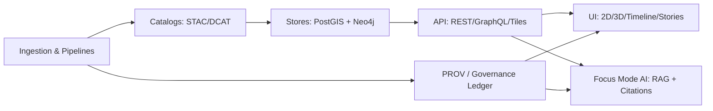

<!--
📌 HOW TO USE (copy/paste friendly)
1) Copy to: 📁 mcp/incidents/<INCIDENT_ID>/status-update.md
2) Keep the header summary current (Status / Impact / Next update).
3) Append new "Update N" sections instead of silently rewriting old statements (KFM is append-only by design).
4) For public updates: keep it factual, cite evidence links, and avoid sensitive details (esp. security/privacy).
-->

<!-- Status badge: choose ONE and delete the rest -->

<!--  -->
<!--  -->
<!--  -->

<!-- Severity badge: choose ONE and delete the rest -->

<!--  -->
<!--  -->
<!--  -->


# 🚨 Incident Status Update — <INCIDENT_ID> — <SHORT_TITLE>

> [!IMPORTANT]
> **Do not speculate.** If something is unknown, say “unknown” and capture what you’re doing to find out.  
> **KFM trust rule:** if provenance/citations are impacted, treat as a first-class incident (even if uptime is fine).

---

## 🧷 Header Summary (keep this current)

| Field | Value |
|---|---|
| **Status** | 🟡 Investigating / 🟠 Identified / 🔵 Monitoring / 🟢 Resolved |
| **Severity** | SEV1 / SEV2 / SEV3 / SEV4 |
| **Started (UTC)** | `<YYYY-MM-DDTHH:MM:SSZ>` |
| **Detected (UTC)** | `<YYYY-MM-DDTHH:MM:SSZ>` |
| **Impact** | `<1–2 sentences in plain language>` |
| **Affected surfaces** | `UI / API / Tiles / Focus Mode / Ingest / Catalog (STAC/DCAT) / PROV / PostGIS / Neo4j` |
| **Geographic scope (optional)** | `<Public-safe counties/regions OR “not location-specific”>` |
| **Workaround (if any)** | `<What users can do right now>` |
| **Next update (UTC)** | `<YYYY-MM-DDTHH:MM:SSZ>` |

---

## 🧭 Quick Context

### 🎯 What is impacted (human-readable)
- **Users see:** `<e.g., blank map tiles / slow queries / incorrect layer values / Focus Mode missing citations>`
- **KFM guarantee at risk:** `availability | performance | data integrity | governance/compliance | AI explainability`

### 👥 Who is impacted
- **Audience:** `Public viewers / Contributors / Admins`
- **Access mode:** `Web / Mobile / Offline Packs / API Clients / Exports`

---

## 🧩 Severity & Incident Type Rubric (KFM-flavored)

| Severity | Typical triggers (examples) |
|---|---|
| **SEV1** 🔴 | Sensitive/restricted data exposure risk, policy/regulatory breach, widespread outage, critical data integrity corruption, provenance chain broken for public outputs |
| **SEV2** 🟠 | Major feature degraded (tiles, search, Focus Mode, ingestion), incorrect data likely for a meaningful portion of users, significant performance regression |
| **SEV3** 🟡 | Limited impact / partial degradation / non-critical bug with workaround |
| **SEV4** ⚪ | Cosmetic issue or planned maintenance notice |

> [!NOTE]
> If **policy-as-code** (OPA/Conftest) or **classification propagation** is failing, consider escalating severity even if “only metadata” is affected.

---

## 🗺️ Affected Components (check all that apply)

### 🖥️ Frontend / UI (React “map behind the map”)
- [ ] 2D Map Viewer (tiles/layers)
- [ ] 3D Globe / Terrain view
- [ ] Timeline / Temporal navigation
- [ ] Story Nodes / Narrative playback
- [ ] Search & Data Discovery
- [ ] Layer Management / Legends / Pop-ups
- [ ] Focus Mode (AI assistant + citations)
- [ ] Collaboration / Community features
- [ ] Mobile / Offline Packs / Field mode
- [ ] Exports (images, share links, data exports)

### 🧰 Backend / APIs
- [ ] REST API (FastAPI) — metadata & data endpoints
- [ ] GraphQL API — entity relationship queries (Neo4j-backed)
- [ ] Tile endpoints / vector tiles / map services
- [ ] Analysis endpoints (e.g., NDVI/time series)
- [ ] Auth/RBAC (JWT/OAuth2), rate limiting, CORS
- [ ] Ingestion endpoints (admin/contributor)

### 🗄️ Data & Metadata Backbone
- [ ] PostGIS (spatial tables, spatial indexes, tile generation)
- [ ] Neo4j (knowledge graph, ontology-based traversal)
- [ ] Catalogs (STAC / DCAT)
- [ ] Provenance (PROV / PROV-JSONLD)
- [ ] Governance ledger / audit trail
- [ ] Artifact registry (OCI/ORAS) + signatures (Cosign) + attestations (SBOM/in-toto)

### ⚙️ Pipelines & Automation
- [ ] Watcher–Planner–Executor agents
- [ ] CI/CD policy pack (OPA/Rego + Conftest)
- [ ] Deterministic ingestion / idempotency keys
- [ ] Streaming/sensor pipelines (append-only)
- [ ] Simulation/model runs + outputs

### 🔌 Third-party dependencies (if relevant)
- [ ] Base map / tile provider
- [ ] External data sources (USGS, EPA, sensors, etc.)
- [ ] Google Earth Engine / external compute
- [ ] GitHub / registry / identity provider
- [ ] CDN / object storage

---

## 🔎 Detection & Signals

**How we learned about it:**  
- [ ] Automated alert (error rate / latency / SLO)
- [ ] Data quality telemetry / anomaly detection
- [ ] User report / GitHub issue
- [ ] Pipeline failure / CI gate
- [ ] Governance/policy violation alert
- [ ] Security signal (possible abuse / unusual traffic)

**Key signals (fill with evidence-backed metrics):**
- Error rate: `<%>` (scope: `<endpoint/service>`)
- Latency: `<p50/p95/p99>` for `<api/tiles/focus>`
- Impacted datasets/layers: `<IDs>`
- Last known good: `<timestamp + version>`
- First bad: `<timestamp + version>`

---

## ✅ Mitigation (Now) + User Workarounds

### 🛠️ Mitigation in progress
- **Immediate action:** `<e.g., rollback deploy / disable agent automation / purge cache / scale DB>`
- **Stabilization goal:** `<e.g., restore tiles + verify provenance links + re-enable policy checks>`

### 🧑‍🤝‍🧑 Workarounds (if any)
- **UI workaround:** `<e.g., refresh layer / switch basemap / disable 3D>`
- **API workaround:** `<alternate endpoint / reduced query>`
- **Data workaround:** `<use prior dataset version / pinned digest>`

> [!WARNING]
> If this incident involves **sensitive or restricted data**, do **not** publish raw coordinates, IDs, or forensic details in a public update.

---

## 🧠 What We Know / What We Don’t Know (yet)

### ✅ What we know (facts only)
- `<fact 1 + evidence link>`
- `<fact 2 + evidence link>`

### ❓ What’s still unknown
- `<unknown 1>`
- `<unknown 2>`

### 🧪 What we’re doing to close the gaps
- `<step 1>`
- `<step 2>`

---

## 🧾 Evidence Pack (KFM “evidence-first”)

> [!NOTE]
> Every claim should trace to something: logs, metrics, run manifests, catalog versions, PRs, dataset IDs, artifact digests.

### 🔗 Evidence links (paste URLs or internal paths)
- **Incident tracker:** `<link>`
- **Dashboards:** `<link(s)>`
- **Logs:** `<link(s)>`
- **Run manifests:** `<kfm-run://... or path>`
- **Catalog versions:** `<stac://...> / <dcat://...> / <prov://...>`
- **Code change context:** PR `<#>`, commit `<sha>`
- **Artifacts:** `oci://...@sha256:...` (include signature/attestation links if available)

### 🧷 Minimum metadata to include (copy/paste)
- `env:` `<prod/staging>`
- `build/deploy id:` `<CI run id>`
- `container/image digest:` `<sha256:...>`
- `dataset(s):` `<kfm.dataset.id(s)>`
- `stac collection/item:` `<id(s)>`
- `dcat dataset:` `<id(s)>`
- `prov activity:` `<activity id(s)>`
- `time window:` `<start–end>`
- `blast radius:` `<who/what/how many>`

---

## 🧷 KFM Invariant Check (Trust & Governance)

- [ ] **API boundary preserved** (UI is not bypassing API/redaction)
- [ ] **Provenance-first publishing** (data served has STAC/DCAT/PROV linkage)
- [ ] **Classification propagated** (sensitivity labels respected end-to-end)
- [ ] **Append-only corrections** (bad data is deprecated/retracted, not silently overwritten)
- [ ] **Policy pack gates** (OPA/Conftest) passing or intentionally paused with documented reason
- [ ] **Supply chain integrity** (SBOM/attestation available; signatures verified where applicable)
- [ ] **AI explainability** (Focus Mode citations/audit panel intact for affected answers)

---

## 🔐 Governance / Privacy / Security Notes (public-safe)

### If this is a **privacy / sensitive data** incident
- [ ] Immediate access restriction applied (classification flipped to restricted)
- [ ] Public layers/endpoints blocked or redacted (least privilege)
- [ ] Cache/CDN purge initiated (if serving sensitive artifacts)
- [ ] Oversight/ethics channel notified (FAIR+CARE)
- [ ] Public disclosure language reviewed (avoid details that worsen risk)

### If this is a **security** incident
- [ ] Security lead engaged
- [ ] Indicators and forensic details captured internally
- [ ] Public update kept high-level until safe to disclose

---

## 🔁 Rollback / Repair Plan

**Decision:** `Rollback | Hotfix | Forward fix | Data retraction + re-ingest`

### 🧯 Rollback steps (example checklist)
- [ ] Identify last known good `<deploy/dataset/artifact digest>`
- [ ] Revert PR / rollback deployment
- [ ] Restore catalog pointers (DCAT/STAC) to known-good distributions
- [ ] Restore DB state (PostGIS/Neo4j) from canonical source (GitOps) or snapshot
- [ ] Issue **PROV retraction/rollback record** (do not erase lineage)
- [ ] Re-run policy pack checks and validate invariants

### 🧼 Data repair notes (if data integrity incident)
- **Corrected dataset version:** `<new version>`
- **Deprecated/retracted version:** `<old version>`
- **User-facing explanation:** `<plain language>`

---

## 🕒 Timeline (UTC)

| Time (UTC) | Event | Owner | Evidence |
|---|---|---|---|
| `<t0>` | Incident started (or first bad signal) | `<name>` | `<link>` |
| `<t1>` | Detected | `<name>` | `<link>` |
| `<t2>` | Mitigation began | `<name>` | `<link>` |
| `<t3>` | Root cause identified (if known) | `<name>` | `<link>` |
| `<t4>` | Fix deployed / rollback completed | `<name>` | `<link>` |
| `<t5>` | Monitoring / validation | `<name>` | `<link>` |
| `<t6>` | Resolved | `<name>` | `<link>` |

---

## 📣 Communications Plan

### Channels
- [ ] In-app banner / notification
- [ ] Status page / incident page
- [ ] GitHub issue / release notes
- [ ] Pulse Thread (geo-tagged update, optional)
- [ ] Community channel / mailing list

### Public update snippet (copy/paste)
**Investigating:**  
> We are investigating reports of `<impact>`. Next update by `<time UTC>`.

**Identified:**  
> We identified the cause as `<short cause>`. We are working on `<mitigation>`. Next update by `<time UTC>`.

**Monitoring:**  
> A fix has been deployed and we are monitoring recovery. Next update by `<time UTC>`.

**Resolved:**  
> This incident is resolved. Impact was `<impact>`. We will publish follow-up notes in `<link>`.

---

## 🧠 AI-Specific Section (only if Focus Mode/AI is involved)

- **Model/prompt version(s):** `<id(s)>`
- **Retrieval sources impacted:** `Neo4j | PostGIS | RAG index | caches`
- **Symptom:** `<wrong answers / missing citations / slow responses / refusal spikes>`
- **Quality guardrails status:** `bias/drift monitors | citation enforcement | prompt gate`
- **Mitigation:** `<pin model version / disable feature / tighten prompt gate / rollback retrieval index>`

> [!NOTE]
> If citations/provenance are missing, treat as a trust incident: either restore citations or downgrade outputs (refuse/limit answers) until fixed.

---

## ✅ Next Actions

### Next 1–2 hours (stabilize)
- [ ] `<action>`
- [ ] `<action>`

### Next 1–2 days (prevent repeat)
- [ ] Add test/monitor: `<what>`
- [ ] Policy pack rule/update: `<what>`
- [ ] Runbook improvement: `<what>`

---

## 🧾 Post-Incident (link when available)

- **Postmortem:** `<mcp/incidents/<INCIDENT_ID>/postmortem.md>`
- **Action items:** `<link>`
- **Related PRs:** `<#...>`
- **Datasets retracted/deprecated:** `<IDs>`
- **New monitors added:** `<links>`

---

## 🧰 Suggested Incident Folder Layout (KFM-friendly) 📁

```text
📁 mcp/incidents/
  📁 <INCIDENT_ID>/
    ├─ 📝 status-update.md
    ├─ 🧾 postmortem.md
    ├─ 📎 evidence/
    │   ├─ 📊 metrics/
    │   ├─ 🪵 logs/
    │   ├─ 🖼️ screenshots/
    │   └─ 🧷 manifests/        (run manifests, policy outputs, attestations)
    ├─ 🗂️ comms/
    │   ├─ 💬 public-snippets.md
    │   └─ 🔒 internal-notes.md
    └─ 🧬 prov/
        └─ incident-<INCIDENT_ID>.jsonld  (optional: incident as PROV Activity)
```

---

## ✅ Definition of Done (for each published update)

- [ ] Header summary updated (Status/Impact/Next update time)
- [ ] Facts are evidence-linked (no speculation)
- [ ] Public-safe wording (no secrets, no sensitive coords/IDs)
- [ ] Affected components clearly marked
- [ ] Workaround included if available
- [ ] Timeline entries updated
- [ ] Governance flags updated (FAIR+CARE, sensitivity, oversight notified)
- [ ] If corrected data: old version deprecated/retracted + new version published with provenance
- [ ] Comms lead reviewed (for public updates)

---

<details>
<summary>🗺️ Optional: Quick system path sketch (Mermaid)</summary>



</details>

---

## 🧾 Update History (append-only)

| Update # | Time (UTC) | Status | Summary | Author |
|---:|---|---|---|---|
| 1 | `<YYYY-MM-DDTHH:MM:SSZ>` | `<Investigating>` | `<short>` | `<name>` |
| 2 | `<YYYY-MM-DDTHH:MM:SSZ>` | `<...>` | `<short>` | `<name>` |
| 3 | `<YYYY-MM-DDTHH:MM:SSZ>` | `<...>` | `<short>` | `<name>` |
