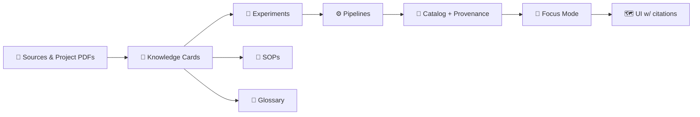

# 🧠📚 MCP Knowledge Base


> **Goal:** keep Kansas-Matrix-System / KFM knowledge *discoverable, evidence-backed, and reusable* — so humans **and** the AI assistant can “show the work.” 🗺️🔎✨  
> This folder is the **curated research shelf** + **living context** that supports experiments, SOPs, architecture decisions, and dataset provenance.

---

## 📌 What lives here

This knowledge base is for **human-readable** materials that make the project easier to build, audit, and extend:

- 📚 **Literature notes & summaries** (GIS, cartography, remote sensing, statistics, databases, AI/LLMs)
- 🧩 **Concept primers** (STAC/DCAT/PROV, coordinate systems, map projections, time-aware layers, etc.)
- 🧭 **Interpretation guides** (how we apply principles in this repo: provenance-first, governance-by-default)
- 🧪 **Experiment context** (background research that links to `../experiments/`)
- 🧰 **SOP support** (background + rationale that links to `../sops/`)
- 📘 **Glossary expansion** (term definitions & canonical wording that links to `../glossary.md`)

---

## 🚫 What does *not* live here

To keep the repo clean and enforce provenance:

- ❌ **Raw datasets** → use `data/raw/`
- ❌ **Processed datasets** → use `data/processed/`
- ❌ **Catalog & provenance artifacts** → use `data/catalog/` + `data/provenance/`
- ❌ **Production code** → use `api/`, `pipelines/`, `web/`
- ❌ **Unlicensed / unclear-rights content** → do not add (capture a citation + metadata first)

---

## 🧱 Principles (non‑negotiables)

These rules keep the project trustworthy and MCP-aligned:

### 1) Provenance-first ✅
Every note must point back to **source material** (PDF, dataset, paper, website, archive record).  
If you can’t cite it, label it clearly as a hypothesis or TODO.

### 2) Documentation-first 📝
Treat docs as a first-class deliverable:
- decisions are written down
- experiments are reproducible
- future contributors can follow a trail

### 3) “Fail closed” governance 🔒
If metadata/provenance is missing, the contribution should be considered incomplete until fixed.

### 4) Canonical flow awareness 🧬
Nothing in this folder should encourage bypassing the pipeline flow (raw → processed → catalog/prov → db → api → ui).

---

## 🗺️ How this connects to KFM “Focus Mode”

The AI assistant becomes *safer and more useful* when the knowledge base is structured:

- 🧠 **Retrieval-ready** notes (clear titles, tags, summaries)
- 🔗 **Cross-links** to datasets, pipelines, and experiments
- 🧾 **Citation bundles** so answers can be surfaced with references
- 🧪 **Experiment history** so we know what worked and what didn’t



---

## 🧬 Suggested folder map

> This is a **recommended** structure. Adjust as the repo evolves.

```text
mcp/
└── knowledge_base/
    ├── README.md                          👈 you are here
    ├── 00_index/                          🧭 jump tables & inventories
    │   ├── bibliography.md                📚 master list of sources
    │   ├── tags.md                        🏷️ tag taxonomy (controlled vocab)
    │   └── change_log.md                  🕒 “what changed” for docs
    ├── 10_kfm_architecture/               🏗️ blueprint notes & decisions
    ├── 20_data_provenance/                🔏 STAC/DCAT/PROV patterns & examples
    ├── 30_geospatial_gis/                 🗺️ projections, CRS, geoprocessing
    ├── 40_cartography_design/             🎨 visual design + map literacy
    ├── 50_remote_sensing/                 🛰️ imagery, GEE, raster workflows
    ├── 60_statistics_experiment_design/   📈 stats, inference, eval methods
    ├── 70_data_management_scaling/        🗄️ performance, storage, DB patterns
    ├── 80_ai_llms_local/                  🤖 Ollama, model cards, prompt policy
    └── 90_templates/                      🧩 reusable doc templates
        ├── knowledge_card.template.md
        ├── literature_note.template.md
        └── glossary_entry.template.md
```

---

## ➕ How to add a Knowledge Card (standard workflow)

1. **Create a new note** in the best-matching folder.
2. Use the **Knowledge Card Template** (below).
3. Add a **real citation** to the source (PDF/page, DOI, archive ID, URL, etc.).
4. Add **tags** using the taxonomy (`00_index/tags.md`).
5. Link to relevant:
   - dataset(s) in `data/`
   - experiment(s) in `../experiments/`
   - SOP(s) in `../sops/`
   - terms in `../glossary.md`
6. Keep it **short and skimmable** (deep detail goes into sub-notes).

✅ **Naming convention (recommended)**  
`YYYY-MM-DD__topic__source.md`  
Example: `2026-01-30__stac-vs-dcat__kfm_blueprint.md`

---

## 🧾 Knowledge Card Template (copy/paste)

<details>
<summary><strong>📄 Click to expand template</strong></summary>

```markdown
---
title: ""
date: "YYYY-MM-DD"
domain: ["gis" | "cartography" | "remote_sensing" | "stats" | "data_mgmt" | "ai_llms" | "architecture" | "other"]
tags: ["#component/...", "#domain/...", "#method/...", "#risk/..."]
source:
  type: ["pdf" | "paper" | "dataset" | "archive" | "web"]
  id: ""           # filename, DOI, archive ID, URL, etc.
  locator: ""      # page(s), chapter, timestamp, figure, etc.
license: ""        # if known; otherwise "unknown"
confidence: ["high" | "medium" | "low"]
related:
  datasets: []
  pipelines: []
  experiments: []
  sops: []
  glossary_terms: []
---

# 🧠 {Title}

## TL;DR (3–6 bullets)
- ...
- ...

## Why this matters to KFM
Explain the impact on **pipeline**, **catalog/provenance**, **API**, **UI**, or **Focus Mode**.

## Key points (with evidence)
- Claim → citation/locator
- Claim → citation/locator

## Implementation notes (optional)
- Practical implications, gotchas, suggested defaults.

## Open questions / TODO
- [ ] ...
- [ ] ...
```
</details>

---

## 🏷️ Tagging rules (keep retrieval clean)

Use tags to help both humans and retrieval systems:

- `#domain/gis`, `#domain/stats`, `#domain/ai_llms`
- `#component/pipelines`, `#component/api`, `#component/web`, `#component/catalog`
- `#method/ocr`, `#method/georeferencing`, `#method/ner`, `#method/stac`
- `#risk/licensing`, `#risk/privacy`, `#risk/provenance_gap`

> Tip 🧠: prefer **fewer, consistent** tags over many one-offs.

---

## ✅ Quality checklist (Definition of Done)

| Requirement | Why it matters | Quick check |
|---|---|---|
| Source is cited | prevents “wiki drift” | has `source.id` + `locator` |
| License noted | avoids legal/ethical surprises | `license` not empty |
| TL;DR present | supports skimming + AI retrieval | 3–6 bullets exist |
| Linked to repo artifacts | creates traceability | related datasets/experiments/sops filled |
| Tagged consistently | improves search | tags use taxonomy |

---

## 📚 Seed Library (project files you can mine into notes)

These are **starter references** already in the project context (create knowledge cards from them):

### 🤖 AI / LLMs / Local Models
- `Comprehensive Guide to Ollama and Its Supported Open-Source LLMs.pdf`
- `Various AI Concepts & Information.pdf`

### 🗺️ GIS / Mapping / Geocomputation
- `GIS-Mapping-Geocomputation-Python.pdf`
- `Cloud-Based Remote Sensing with Google Earth Engine-Fundamentals and Applications.pdf`
- `Mobile Mapping - project_muse.pdf`

### 🎨 Cartography / Map Design / Navigation
- `making-maps-a-visual-guide-to-map-design-for-gis.pdf`
- `Map Projections Used by the U.S. Geological Survey.pdf`
- `Map Reading & Land Navigation.pdf`

### 🧱 3D / Archaeological & Spatial Computing
- `Archaeological 3D GIS.pdf`

### 📈 Statistics / Experimental Design / Visualization
- `Understanding Statistics & Experimental Design.pdf`
- `graphical-data-analysis-with-r.pdf`
- `Visualization of Time-Oriented Data.pdf`

### 🗄️ Data management / performance / scale
- `Database Performance at Scale.pdf`
- `Scalable Data Management for Future Hardware.pdf`
- `Data Spaces.pdf`

---

## 🔗 Related MCP areas (neighbor folders)

- 🧪 Experiments: `../experiments/`
- 🧰 SOPs / runbooks: `../sops/`
- 📘 Glossary: `../glossary.md`
- 🧾 Model cards (if present): `../model_cards/`

---

## 🧭 Roadmap (suggested next commits)

- [ ] Add `00_index/tags.md` (controlled vocabulary)
- [ ] Add `00_index/bibliography.md` (source inventory)
- [ ] Add `90_templates/*` templates
- [ ] Convert the KFM blueprint + MCP protocol PDFs into **10–20 knowledge cards**
- [ ] Stand up a lightweight search index (optional) for local retrieval experiments

---

### 🌾 Reminder
This knowledge base is only valuable if it stays **alive**: keep it updated, cite sources, and link it to real repo artifacts. 💚