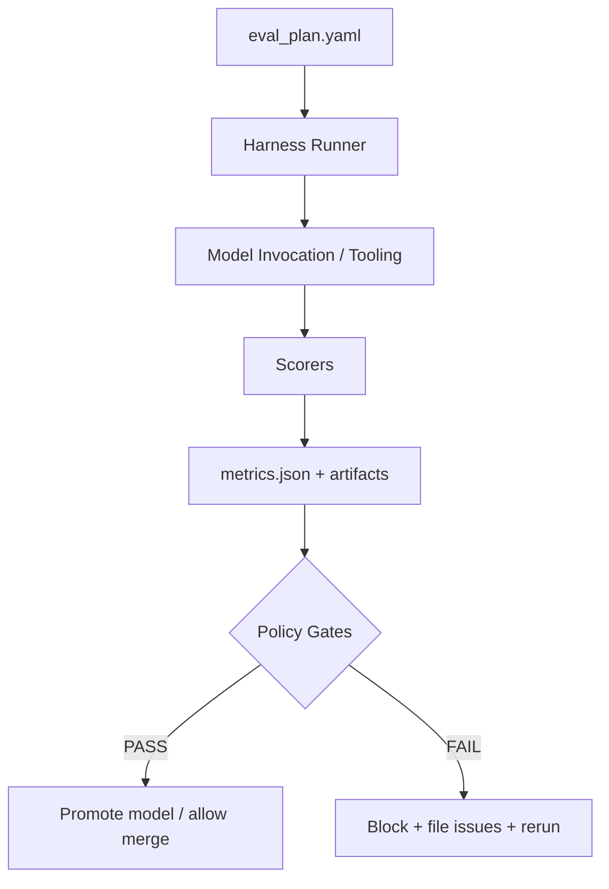

# 🧪 Eval — `<model_id>` (KFM Model Card)


> [!IMPORTANT]
> This folder defines **how `<model_id>` is evaluated before it’s allowed into KFM workflows** (Focus Mode 🧠, Story Nodes 📖, pipelines ⚙️, UI 🗺️).  
> **Fail-closed** is the default: if outputs are not evidence-backed, provenance-linked, and policy-compliant, evaluation must **fail**.

---

## 🔗 Quick Links

- 📄 **Model Card (root):** `../README.md`
- 🧾 **Eval plan:** `./eval_plan.yaml` (recommended)
- 🧪 **Suites / tasks:** `./suites/` and `./tasks/`
- 📦 **Results:** `./results/`
- 🧰 **Harness:** `./harness/` (or repo-wide `tools/` / `scripts/`)

---

## 🧭 What belongs in `eval/`

This directory is the **source of truth** for:

- ✅ **What we test** (suites + tasks + rubrics)
- ✅ **How we score** (MetricSpec / acceptance gates)
- ✅ **What must never regress** (hard gates)
- ✅ **What we ship as artifacts** (run manifest, metrics, evidence manifests, diffs)

---

## 🗂️ Suggested Directory Layout

```text
mcp/
└── model_cards/
    └── <model_id>/
        ├── README.md
        └── eval/
            ├── README.md            👈 you are here
            ├── eval_plan.yaml       🧾 suites + thresholds + data refs
            ├── suites/              🧪 suite definitions (YAML/JSON)
            ├── tasks/               🧩 task cases (JSONL/YAML) + golden refs
            ├── harness/             🧰 runners, scorers, adapters
            ├── baselines/           📉 pinned previous metrics (regression compare)
            ├── fixtures/            🧪 deterministic fixtures (small datasets)
            └── results/
                └── YYYY-MM-DD/
                    ├── summary.md
                    ├── metrics.json
                    ├── run_manifest.json
                    ├── evidence/     📎 evidence manifests (story/narrative)
                    └── artifacts/    📦 logs, diffs, plots, traces
```

> [!TIP]
> Keep task inputs **small & deterministic** in `fixtures/` so CI can run quickly, and keep larger evaluation corpora referenced by ID (catalog/dataset IDs) instead of checked-in blobs.

---

## 🧱 Evaluation Flow



---

## ✅ Non‑Negotiable Gates (Hard Fail)

These are **release blockers** for `<model_id>` in KFM contexts:

1. **Evidence-backed outputs**
   - If a response is expected to be factual/historical/geospatial: it must be backed by traceable evidence (citations, provenance links, or evidence manifests).
2. **Provenance + metadata contract**
   - Outputs that create/modify data must produce/update provenance artifacts and required metadata (STAC/DCAT/PROV alignment expectations).
3. **Governance & safety**
   - No sensitive location leaks, no classification downgrades without approved de-identification, and sovereignty tags must propagate.
4. **Reproducibility**
   - Every eval run must emit a **run manifest** that makes the run replayable (inputs, versions, params, environment, outputs).
5. **Policy-as-code compliance**
   - Conftest/OPA policy checks must pass (or be explicitly waived per governance rules).

---

## 🧪 Eval Suites

> [!NOTE]
> Not every model needs every suite. But any model used in **Focus Mode** or **Story Nodes** should include those suites by default.

<details>
<summary><strong>🧠 Suite: focus_mode_grounding</strong> (RAG + citations + refusal correctness)</summary>

**Goal:** Ensure the model behaves as an evidence-first assistant.

**What to test:**
- Citation presence & formatting (required where applicable)
- Citation correctness (do the cited items support the claims?)
- Refusal correctness (refuse when evidence is missing or access is denied)
- Context use (map bounds, selected layers, time slider context, user intent)

**Outputs:**
- `metrics.json` + `artifacts/focus_mode_samples.ndjson`
- `artifacts/citation_audit.csv` (optional)

</details>

<details>
<summary><strong>📖 Suite: story_node_evidence</strong> (machine-ingestible narrative + evidence manifests)</summary>

**Goal:** Ensure Story Nodes produced/assisted by `<model_id>` remain verifiable and exportable.

**What to test:**
- Every narrative node has an **evidence manifest**
- Evidence manifests reference dataset IDs, STAC items, PROV activity IDs, licenses
- “Interpretation” is labeled as such; factual claims are supported
- Export includes attribution bundle (auto-generated citations)

**Outputs:**
- `evidence/*.yaml` or `evidence/*.json`
- `artifacts/storynode_export_check.md`

</details>

<details>
<summary><strong>🗺️ Suite: geo_temporal_reasoning</strong> (spatial queries, time reasoning, CRS safety)</summary>

**Goal:** Validate geospatial & temporal reasoning behavior.

**What to test:**
- Correct interpretation of bounding boxes / geometry / CRS
- Correct temporal slicing (date ranges, time slider)
- No invalid geometry outputs; no silently swapped lat/lon
- When uncertain: asks for clarification or returns bounded uncertainty (never fabricates)

</details>

<details>
<summary><strong>⚙️ Suite: ingest_pipeline_contracts</strong> (metadata + idempotency + provenance)</summary>

**Goal:** Ensure model-driven pipelines don’t violate KFM’s contract-first data rules.

**What to test:**
- Any generated dataset metadata passes schema validation
- Provenance record is updated when processed data changes
- Classification tags propagate correctly
- Idempotent behavior for repeated runs with same inputs (no duplicate nodes/entries)

</details>

<details>
<summary><strong>⚖️ Suite: policy_governance_privacy</strong> (OPA checks, sovereignty, sensitive layers)</summary>

**Goal:** Confirm governance compliance.

**What to test:**
- Conftest/OPA rules pass for eval outputs
- No PII / sensitive location leakage in public exports
- Sovereignty tags remain intact and trigger redaction/generalization when required

</details>

<details>
<summary><strong>🧭 Suite: ui_integration_smoke</strong> (UI workflows & E2E)</summary>

**Goal:** Ensure model interactions don’t break key UI flows.

**What to test:**
- Map UI + layers + time slider + Focus Mode interaction loop
- Story Node creation / editing / export
- Minimal end-to-end checks (e.g., Cypress)

</details>

<details>
<summary><strong>🚀 Suite: performance_cost</strong> (latency, throughput, resource use)</summary>

**Goal:** Keep the model usable at scale.

**What to test:**
- Latency p50/p95 in representative queries
- Token/cost footprint (if applicable)
- Memory / CPU usage under load (esp. for retrieval + graph queries)

</details>

<details>
<summary><strong>📈 Suite: drift_regression</strong> (stability over time)</summary>

**Goal:** Detect drift in behavior or outputs across versions/data.

**What to test:**
- Regression vs pinned baselines
- “Citation coverage drift” and “refusal drift”
- Changes in key metrics beyond tolerance thresholds

</details>

---

## 📏 Metrics & Gates

> [!TIP]
> Keep `metrics.json` stable across models so you can compare across model IDs.

| Metric | Type | Why it matters | Gate |
|---|---:|---|---|
| `pass_rate` | % | Suite-level correctness | **Soft/Hard** (per suite) |
| `citation_coverage` | % | Evidence-first compliance | **Hard** (Focus/Story suites) |
| `citation_precision` | % | Prevent “fake citations” | **Hard** if below threshold |
| `refusal_correctness` | % | Safety + truthfulness | **Hard** |
| `policy_violations` | count | Governance enforcement | **Hard: must be 0** |
| `prov_completeness` | % | Reproducibility + audit | **Hard** for data outputs |
| `latency_p95_ms` | ms | UX & scalability | Soft (unless SLO) |
| `ui_smoke_pass` | bool | Prevent broken UX | Hard for UI-connected models |

---

## ▶️ Running Evaluation

> [!WARNING]
> Commands here are **templates**. Wire them to your actual runner scripts (`make`, `python -m`, `node`, etc.).

### Local (developer)

```bash
# From repo root
export MODEL_ID="<model_id>"

# 1) Run core suite
make eval MODEL_ID="$MODEL_ID" SUITE=focus_mode_grounding

# 2) Run governance/policy checks on produced artifacts
make policy-check MODEL_ID="$MODEL_ID"

# 3) Compare against baseline
make eval-compare MODEL_ID="$MODEL_ID" BASELINE=baselines/latest.json
```

### CI (pull request)

Recommended CI stages:

1. `lint + unit tests`
2. `contract tests` (API/schema)
3. `policy scans` (OPA/Conftest + secret/PII checks)
4. `eval suites` (fast fixtures)
5. `artifact upload` (metrics + run manifest)

---

## 🧾 Run Manifest (Reproducibility)

Every run MUST produce:

- **exact model identity** (name/version/digest)
- **eval inputs** (dataset IDs, task IDs, fixture hashes)
- **parameters** (temperature, top_p, retrieval settings)
- **environment** (runner version, OS, container digest if available)
- **outputs** (metrics, artifacts, evidence manifests)

Example shape:

```json
{
  "run_id": "eval-2026-01-23T12-34-56Z",
  "model_id": "<model_id>",
  "model_version": "vX.Y.Z-or-digest",
  "eval_plan": "eval_plan.yaml",
  "suites": ["focus_mode_grounding", "policy_governance_privacy"],
  "inputs": {
    "tasks_ref": "tasks/core.jsonl",
    "fixtures_hash": "sha256:..."
  },
  "params": {
    "temperature": 0.2,
    "retrieval_top_k": 8
  },
  "artifacts": {
    "metrics": "results/2026-01-23/metrics.json",
    "evidence_dir": "results/2026-01-23/evidence/"
  }
}
```

---

## 🧾 Evidence Manifest (for narratives / Story Nodes)

When the model emits narrative content intended to be reused, exported, or displayed as factual:

- attach a machine-readable **evidence manifest**
- include references to dataset IDs / STAC items / PROV activities
- include license + attribution details

Skeleton:

```yaml
manifest_version: 1
subject:
  type: story_node
  id: "<story_node_id>"
claims:
  - id: c1
    text: "Claim text here."
    type: factual
    supports:
      - dataset_id: "<dataset_id>"
        stac_item: "<stac_item_id>"
        prov_activity: "<prov_activity_id>"
        excerpt_hash: "sha256:..."
licenses:
  - dataset_id: "<dataset_id>"
    license: "<license-id-or-text>"
```

---

## 🧰 Adding a New Task

1. Add a case to `tasks/<suite>.jsonl` (or YAML).
2. Include:
   - expected behavior (correct answer OR correct refusal)
   - required citations/evidence (if factual)
   - scoring rubric (what counts as pass/fail)
3. Register the task file in `eval_plan.yaml`.
4. Run locally, then pin a baseline in `baselines/` if appropriate.

---

## 🧯 Troubleshooting

- **Missing citations:** fix retrieval wiring, or ensure the task is labeled correctly (factual vs interpretive).
- **Policy failure:** check sovereignty/classification tags, provenance updates, and redaction rules.
- **Regression vs baseline:** confirm dataset/task IDs didn’t change; compare run manifests first.

---

## 📚 Project Reference Library (what informed this eval design)

These project docs define the “why” behind the gates, artifacts, and suites:

- 🧭 **KFM Master Guide / governance / pipeline invariants:** `MARKDOWN_GUIDE_v13.md.gdoc`
- 🧠 **AI behavior, governance ledger, W-P-E architecture:** `Kansas Frontier Matrix (KFM) – AI System Overview 🧭🤖.pdf`
- 🗺️ **UI + Focus Mode + story UX constraints:** `Kansas Frontier Matrix – Comprehensive UI System Overview.pdf`
- 📥 **Data Intake + policy-as-code + metadata contracts:** `📚 Kansas Frontier Matrix (KFM) Data Intake – Technical & Design Guide.pdf`
- 🏗️ **Architecture, modularity, STAC/DCAT/PROV + simulations:** `Kansas Frontier Matrix (KFM) – Comprehensive Architecture, Features, and Design.pdf`
- 🧰 **Implementation details, testing + repo structure expectations:** `Kansas Frontier Matrix (KFM) – Comprehensive Technical Documentation.pdf`
- 🚀 **Forward features (AR, digital twins, advanced UX):** `Innovative Concepts to Evolve the Kansas Frontier Matrix (KFM).pdf`
- 💡 **Extra ideas (Pulse Threads, evidence manifests, QA reports):** `Additional Project Ideas.pdf`
- 🌟 **Future proposals (Kansas From Above, GTFS-RT watchers, doc ingestion):** `🌟 Kansas Frontier Matrix – Latest Ideas & Future Proposals.docx.pdf`
- 🧾 **MCP & model card / experiment tracking structure:** `Kansas-Frontier-Matrix_ Open-Source Geospatial Historical Mapping Hub Design.pdf`

Also available as deeper reference libraries (PDF portfolios):

- `AI Concepts & more.pdf`
- `Data Managment-Theories-Architures-Data Science-Baysian Methods-Some Programming Ideas.pdf`
- `Maps-GoogleMaps-VirtualWorlds-Archaeological-Computer Graphics-Geospatial-webgl.pdf`
- `Various programming langurages & resources 1.pdf`

---

## ✅ Definition of Done (for this eval folder)

- [ ] `eval_plan.yaml` exists and lists suites + gates
- [ ] At least **one** fast CI suite is runnable on fixtures
- [ ] Results output includes `metrics.json` + `run_manifest.json`
- [ ] Policy checks run in CI and block violations
- [ ] A baseline is pinned for regression detection (where relevant)

🧩 When in doubt: prioritize **trust, traceability, and repeatability** over raw “score chasing.”
