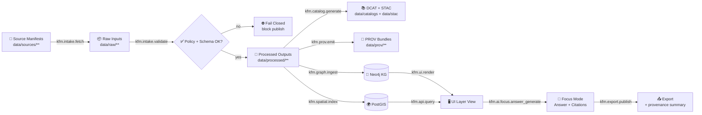

# 🧾 PROV Activities — `<model_id>` (KFM)

> 📍 **File path:** `mcp/model_cards/<model_id>/links/prov_activities.md`  
> 🎯 **Goal:** Define the **canonical provenance Activities** (W3C PROV-style) that the model and its supporting KFM pipelines must record, validate, and surface.

---

## 🧭 How to use this doc

✅ Use this file to:
- Standardize **activity naming** + **minimum required fields**
- Make **data → layer → answer → export** fully traceable
- Ensure **CI policy gates** have a clear “what should exist” checklist
- Keep **model card** provenance links consistent across models

🛠️ Update this file when you add:
- a new pipeline step 🧪
- a new UI/export surface 🖥️
- a new agent workflow 🤖
- a new artifact packaging pattern 📦

---

## ✅ KFM provenance principles (non‑negotiables)

- **Provenance-first:** every dataset, layer, simulation output, answer, and export is traceable.
- **Contract-first:** nothing is “accepted” without schema + metadata compliance.
- **No mystery layers:** UI cannot show a layer that can’t show its source + lineage.
- **Immutability boundary:** `data/raw/**` is **never edited**; transforms are downstream.
- **Deterministic transforms:** config-driven; no hidden manual tweaks.
- **Fail-closed governance:** missing provenance/citations blocks publish.

---

## 🧩 PROV 101 (KFM profile cheatsheet)

**Entity** 🧱  
A data artifact: raw file, processed dataset, STAC item, DCAT record, model weights, a query result snapshot, an exported PDF, etc.

**Activity** ⚙️  
A process that **uses** entities and **generates** entities: ingest, validate, transform, graph ingest, model inference, simulation run, export, etc.

**Agent** 🧑‍💻🤖  
An actor responsible: human contributor, CI bot, pipeline worker, AI agent (Watcher/Planner/Executor), governance council, etc.

### Core relations (minimum set)
- `prov:used`
- `prov:generated`
- `prov:wasAssociatedWith`
- `prov:wasDerivedFrom`

Optional but useful:
- `prov:wasInformedBy` (activity-to-activity)
- `prov:actedOnBehalfOf` (agent delegation)

---

## 📂 Where provenance lives

> 🗂️ The **preferred** on-disk structure below matches KFM’s “treat data like code” layout and supports auditability.

```text
📦 repo-root/
├─ 📁 data/
│  ├─ 📁 sources/            # upstream manifests (what to fetch & why)
│  ├─ 📁 raw/                # immutable source drops (trust boundary)
│  ├─ 📁 work/               # sandbox outputs (NOT for UI/graph)
│  ├─ 📁 processed/          # promoted, stable outputs
│  ├─ 📁 catalogs/           # DCAT datasets/distributions (discovery)
│  ├─ 📁 stac/               # STAC collections/items (geo index)
│  ├─ 📁 prov/               # PROV bundles (JSON-LD) per dataset/run
│  └─ 📁 audits/
│     └─ 📁 <run_id>/
│        ├─ 🧾 run_manifest.json        # deterministic run manifest
│        └─ 🔐 signature/attestation/* # optional supply-chain proofs
└─ 📁 mcp/
   └─ 📁 model_cards/
      └─ 📁 <model_id>/
         ├─ 🧠 model_card.md
         └─ 📁 links/
            └─ 🧾 prov_activities.md   👈 you are here
```

💡 **Rule of thumb:**  
If something influences what users see (map layer, story, report, answer), it must have: **STAC + DCAT + PROV** (the “evidence triplet”).

---

## 🏷️ Activity IDs + naming conventions

### Canonical `activity_type` format
Use a namespaced, dotted verb phrase:

- `kfm.intake.fetch`
- `kfm.intake.validate`
- `kfm.transform.etl`
- `kfm.catalog.generate`
- `kfm.prov.emit`
- `kfm.graph.ingest`
- `kfm.ai.focus.answer_generate`
- `kfm.sim.run`
- `kfm.artifact.sign`
- `kfm.governance.review`

### ID scheme (recommended)
Keep IDs stable and queryable:

- `run_id`: ULID/UUIDv7 (sortable)  
- `activity_id`: `urn:kfm:activity:<activity_type>:<run_id>[:<step_id>]`
- `entity_id`: `urn:kfm:entity:<asset_or_dataset_id>:<digest_or_version>`
- `agent_id`: `urn:kfm:agent:<kind>:<id>`

---

## 🧱 Required fields for **every** Activity (minimum)

All activities MUST record:

### ✅ PROV minimum
- `prov:startedAtTime`
- `prov:endedAtTime`
- `prov:used` (entity IDs)
- `prov:generated` (entity IDs)
- `prov:wasAssociatedWith` (agent IDs)

### 🧾 KFM minimum extensions
- `kfm:run_id`
- `kfm:activity_type`
- `kfm:tool` (name + version)
- `kfm:config_ref` (path or logical ID)
- `kfm:config_digest` (hash of config used)
- `kfm:environment_ref` (container digest / lockfile digest / runtime ID)
- `kfm:policy_pack_version` + `kfm:policy_results_ref`
- `kfm:classification` (public/internal/restricted) **for generated artifacts**
- `kfm:license_ref` **for published artifacts**
- `kfm:telemetry_ref` (optional but strongly recommended)

---

## 🌐 Cross-layer linkage expectations (STAC + DCAT + PROV + Graph)

To keep KFM coherent across pipelines + UI:

- **STAC → Data:** STAC must point to stable processed assets (`data/processed/**` or equivalent).
- **DCAT → STAC/Data:** DCAT must link to STAC and/or direct distributions.
- **PROV end-to-end:** PROV must connect **raw → work → processed** and include run/config identifiers.
- **Graph references catalogs:** the graph stores IDs/refs to catalogs (not bulky payloads).

---

## 🗺️ Provenance pipeline at a glance (Mermaid)



---

## 🧰 Activity registry (canonical set)

> ✅ Keep this list small-but-complete. Add new types only when they represent a distinct, query-worthy operation.

### Legend
- 📥 Intake
- 🧪 Transform/Analyze
- 📚 Catalog/Provenance
- 🧠 Graph/Index
- ⏱️ Real-time
- 🤖 AI & Agents
- 📖 Narrative
- 🧭 Governance
- 📦 Supply chain
- 📊 Observability

### Table: activities and typical I/O

| Category | `kfm:activity_type` | Typical `prov:used` | Typical `prov:generated` |
|---|---|---|---|
| 📥 | `kfm.intake.fetch` | source manifest, upstream URL/entity | raw file(s), checksum entity |
| 📥 | `kfm.intake.validate` | raw file(s), schema/profile | validation report, policy results |
| 🧪 | `kfm.transform.etl` | raw + work intermediates | processed dataset(s) |
| 📚 | `kfm.catalog.generate` | processed dataset(s) | STAC + DCAT records |
| 📚 | `kfm.prov.emit` | activity context + I/O entities | PROV JSON-LD bundle |
| 🧠 | `kfm.graph.ingest` | STAC/DCAT refs + processed dataset(s) | KG nodes/edges + ingest report |
| 🧠 | `kfm.spatial.index` | processed dataset(s) | PostGIS table/index snapshot |
| ⏱️ | `kfm.realtime.query` | live DB read (timestamped) | query result snapshot entity |
| ⏱️ | `kfm.realtime.publish` | streaming pipeline output | published “live” distribution |
| 🧪 | `kfm.sim.run` | pinned inputs + params + env | sim outputs (workbench) |
| 🧪 | `kfm.sim.verify` | sim outputs + test fixtures | V&V report |
| 🧪 | `kfm.sim.promote` | verified sim outputs | processed + catalog + prov |
| 🤖 | `kfm.ai.focus.retrieve_sources` | user query + context | retrieval set entity |
| 🤖 | `kfm.ai.focus.answer_generate` | retrieval set + live reads | answer entity + citation map |
| 🤖 | `kfm.ai.focus.citation_check` | answer draft | pass/fail audit result |
| 🤖 | `kfm.ai.focus.xai_audit` | answer + trace | XAI/audit record |
| 🤖 | `kfm.ai.agent.plan` | trigger/event | plan entity |
| 🤖 | `kfm.ai.agent.execute` | plan + repo state | PR/commit artifacts + logs |
| 📖 | `kfm.narrative.storynode.compose` | evidence set | story node draft |
| 📖 | `kfm.narrative.evidence_manifest.compile` | sources + story references | evidence manifest entity |
| 📖 | `kfm.narrative.pulse.package` | pulse thread content | signed/packed pulse artifact |
| 🧭 | `kfm.policy.evaluate` | artifacts + policy pack | policy result entity |
| 🧭 | `kfm.governance.review` | policy results + sensitive flags | approval/decision entity |
| 📦 | `kfm.artifact.package_oci` | processed outputs + catalogs + prov | OCI artifact entity |
| 📦 | `kfm.artifact.sign` | OCI digest | signature/attestation entity |
| 📦 | `kfm.artifact.attach_prov` | OCI digest + prov bundle | referrer link entity |
| 📊 | `kfm.telemetry.capture` | runtime + infra | telemetry entity |

---

## 🧪 Machine-readable registry (YAML)

> 🧷 Useful for CI validation and generator tooling.

```yaml
kfm_prov_activity_registry:
  version: "0.1"
  model_id: "<model_id>"
  required_core_fields:
    - prov:startedAtTime
    - prov:endedAtTime
    - prov:used
    - prov:generated
    - prov:wasAssociatedWith
    - kfm:run_id
    - kfm:activity_type
    - kfm:tool
    - kfm:config_digest
    - kfm:environment_ref
    - kfm:policy_pack_version
  activities:
    - kfm:activity_type: kfm.intake.fetch
      must_generate:
        - entity: raw_file
        - entity: checksum
    - kfm:activity_type: kfm.intake.validate
      must_generate:
        - entity: validation_report
        - entity: policy_result
    - kfm:activity_type: kfm.transform.etl
      must_generate:
        - entity: processed_dataset
    - kfm:activity_type: kfm.catalog.generate
      must_generate:
        - entity: stac_record
        - entity: dcat_record
    - kfm:activity_type: kfm.prov.emit
      must_generate:
        - entity: prov_bundle
    - kfm:activity_type: kfm.ai.focus.answer_generate
      must_generate:
        - entity: answer
        - entity: citation_map
```

---

## 📥 Intake activities

### `kfm.intake.fetch` 📦
**Purpose:** bring upstream content into KFM as immutable raw inputs.

**Minimum capture**
- upstream identifier(s): URL, DOI, archive ref, or internal system ID
- download method/tool + version
- checksums (hash per file)
- licensing + classification as early as possible

**Must generate**
- raw file entity (immutable)
- checksum entity
- “source reference entity” (even if the upstream is a URL or an API query)

---

### `kfm.intake.validate` ✅
**Purpose:** schema + policy verification before anything becomes “promotable.”

**Must include**
- schema/profile version IDs used
- policy pack version + results
- “fail closed” behavior (explicit)

**Must generate**
- validation report
- policy evaluation result entity

---

## 🧪 Transform & analysis activities

### `kfm.transform.etl` 🧹
**Purpose:** deterministic transformations from raw → processed.

**Recommended capture**
- reprojection parameters
- filters/thresholds
- join keys (if merging datasets)
- “manual override” = forbidden; if needed, it becomes a documented micro-step with its own activity.

**Must generate**
- processed dataset entity
- processing report entity

---

### `kfm.data.cleanse` 🧼 *(optional but recommended)*
**Purpose:** explicitly record data cleaning steps (dedupe, normalization, missing data handling).

**Why it matters**
- data cleaning is often where “silent” bias enters; making it an explicit Activity makes it auditable.

---

## 📚 Catalog + provenance emission

### `kfm.catalog.generate` 🗂️
**Purpose:** produce/refresh STAC + DCAT records for any publishable dataset.

**Must generate**
- STAC collection/item entity
- DCAT dataset/distribution entity

---

### `kfm.prov.emit` 🧾
**Purpose:** write the PROV bundle that ties **raw → processed → catalogs** together.

**Recommended capture**
- run identifiers (`run_id`, git commit hash, pipeline version)
- environment pin (container digest / lockfile digest)
- parameters/hyperparameters if modeling/ML
- references to validation + policy results

---

## 🧠 Graph & spatial publication

### `kfm.graph.ingest` 🧠
**Purpose:** ingest catalog references + relationships into Neo4j KG.

**Recommended capture**
- ontology/profile used (e.g., historical, geospatial, cultural heritage mappings)
- mapping ruleset version
- ingest summary (counts, warnings, link errors)

---

### `kfm.spatial.index` 🌍
**Purpose:** load processed spatial artifacts into PostGIS (or a spatial index) for querying/tiles.

**Recommended capture**
- schema migration version
- index build parameters
- tile cache generation (if applicable)

---

## ⏱️ Real-time & dynamic query activities

### `kfm.realtime.query` ⏱️
**Purpose:** record “live reads” that power UI layers or AI answers.

**Must capture**
- query timestamp (what “now” meant)
- query identity (e.g., stored procedure name or a parameterized query ID)
- result snapshot hash/digest (even if the result is transient)

**Must generate**
- a query-result entity that can be cited later

---

### `kfm.realtime.publish` 📡
**Purpose:** when streaming pipelines create publishable distributions (even if rolling).

**Recommended capture**
- “stub provenance” strategy for pre-processed live feeds
- promotion thresholds for “official” vs “provisional”

---

## 🧪 Simulation & modeling activities (`kfm-sim-run`)

### `kfm.sim.run` 🧪
**Purpose:** run models in the sandbox/workbench.

**Must capture**
- pinned inputs (hashes)
- parameters/hyperparameters
- environment pin
- random seeds (if applicable)

**Must generate**
- simulation output entity (workbench)
- run manifest entity

---

### `kfm.sim.verify` 🧪✅
**Purpose:** Verification & Validation (V&V) artifacts that justify promotion.

**Must generate**
- V&V report entity (unit/regression checks + comparisons)
- uncertainty/sensitivity summary entity (when applicable)

---

### `kfm.sim.promote` 🚀
**Purpose:** move verified simulation outputs into processed + cataloged + prov’d assets.

**Must enforce**
- no UI/graph should point to `data/work/**`
- promotion requires STAC + DCAT + PROV

---

## 🤖 AI / Focus Mode provenance activities

> 🔥 The model card MUST treat AI outputs as provenance-bearing artifacts.

### `kfm.ai.focus.retrieve_sources` 🔎
**Purpose:** record the retrieval set used to answer a question.

**Must capture**
- query text + normalized intent
- UI context (time range, active layers, region, filters)
- retrieval method version (RAG config, ranking config)
- IDs of retrieved entities (datasets, KG nodes, documents)

**Must generate**
- retrieval set entity (list + digests)

---

### `kfm.ai.focus.answer_generate` 🧠🗣️
**Purpose:** generate an answer with citations + confidence qualifiers.

**Must capture**
- model version/weights ref
- prompt template ID + digest
- retrieval set entity ID(s)
- any live query results used (timestamped)

**Must generate**
- answer entity
- citation map entity (answer spans → source entities)

---

### `kfm.ai.focus.citation_check` ✅🧾
**Purpose:** enforce “no citation → no publish.”

**Must generate**
- audit result entity (pass/fail + reasons)

---

### `kfm.ai.focus.xai_audit` 🕵️‍♀️
**Purpose:** explainability & governance metadata (how the answer was formed).

**Recommended capture**
- reasoning trace references (NOT necessarily full chain, but auditable pointers)
- “evidence sufficiency” score
- flags: missing evidence, sensitive content risk, uncertainty too high, etc.

---

## 🤖 Agentic ops activities (Watcher / Planner / Executor)

### `kfm.ai.agent.plan` 🗺️
**Purpose:** agent creates a plan for a pipeline change or ingestion.

**Must generate**
- plan entity (step list + expected outputs + policy checks)

---

### `kfm.ai.agent.execute` 🛠️
**Purpose:** agent executes steps (runs pipeline, opens PR, etc.)

**Must capture**
- commands executed (or task IDs)
- artifacts produced
- constraints: agent cannot “auto-merge” without governance

**Must generate**
- PR/commit entity + links to dataset outputs
- execution log entity

---

## 📖 Narrative & storytelling activities

### `kfm.narrative.storynode.compose` 📚
**Purpose:** compose a Story Node that references evidence artifacts.

**Must capture**
- story node ID + version
- evidence set IDs (datasets, maps, documents, KG nodes)

**Must generate**
- story node draft entity

---

### `kfm.narrative.evidence_manifest.compile` 🧾📎
**Purpose:** produce a portable evidence manifest that can travel with the story/export.

**Must generate**
- evidence manifest entity (structured + hashable)

---

### `kfm.narrative.pulse.package` 🧵📦
**Purpose:** package “Pulse Threads” or narrative bundles with atomic attachments.

**Recommended capture**
- canonical digest for attachments
- signature/attestation refs
- referrer links to PROV bundles

---

## 🧭 Governance & policy activities

### `kfm.policy.evaluate` 🛡️
**Purpose:** policy-as-code enforcement (schema, licensing, sensitivity, citations, etc.).

**Must capture**
- policy pack version
- decision outputs + rationale

**Must generate**
- policy result entity (pass/fail + warnings)

---

### `kfm.governance.review` 🏛️
**Purpose:** human/governance council approvals (especially for sensitive releases).

**Must capture**
- review checklist results
- risk classification changes
- approval/denial decisions + rationale pointers

**Must generate**
- governance decision entity

---

## 📦 Artifact distribution & supply chain

### `kfm.artifact.package_oci` 📦
**Purpose:** package processed assets + catalogs + PROV into OCI-compatible artifacts.

**Must generate**
- artifact entity (digest-addressable)

---

### `kfm.artifact.sign` 🔐
**Purpose:** sign artifacts (CI and/or maintainer keys).

**Must generate**
- signature entity

---

### `kfm.artifact.attach_prov` 🧾🔗
**Purpose:** attach PROV bundles as referrers/attachments to artifacts.

**Must generate**
- referrer link entity (artifact digest → PROV digest)

---

## 📊 Observability & telemetry activities

### `kfm.telemetry.capture` 📈
**Purpose:** store runtime metrics and sustainability accounting (resource/energy).

**Recommended capture**
- runtime duration
- CPU/GPU metrics
- energy/carbon estimation (where feasible)
- cost estimates (optional)

---

## 🖥️ UI surfacing expectations (provenance UX)

Where provenance MUST be visible:

- 🧾 **Layer Info**: sources + license + last updated + provenance link
- 🧠 **Graph Node Details**: references to STAC/DCAT/PROV IDs
- 🤖 **Focus Mode**: citations inline + “why this answer” (audit panel)
- 📤 **Exports**: include provenance summary + attribution automatically
- 🚦 **Warnings**: show “provisional” for streaming / not-yet-promoted outputs

---

## 🔎 Query patterns (examples)

> Use these patterns to test that provenance is actually queryable.

### “What produced this dataset?”
- Entity → `prov:wasGeneratedBy` → Activity → `prov:used` inputs → upstream chain

### “Which AI answers depended on this dataset?”
- Dataset entity → reverse `prov:used` into answer activities → answer entities

### “Which PR/commit produced this processed layer?”
- Dataset entity ↔ PR Activity ↔ merge commit entity ↔ author/reviewer agents

---

## ✅ Implementation checklist (ship it)

- [ ] Add/confirm KFM PROV JSON-LD context + profile fields
- [ ] Implement emitters per activity type (shared helper)
- [ ] Require `kfm:run_id` across all pipelines
- [ ] Add CI validation (STAC/DCAT/PROV cross-links)
- [ ] Enforce **no provenance → no publish** (policy gate)
- [ ] Ensure simulations never bypass promotion rules (`data/work/**` → not for UI)
- [ ] Implement Focus Mode citation map + provenance logging for live reads
- [ ] Implement OCI packaging + signing + PROV attachment (referrer)
- [ ] Surface provenance in UI (Layer Info + Audit Panel + Export footer)

---

## 📚 Aligned project docs (this registry is based on)

> Keep this list updated so readers know where standards/policies came from.

### KFM core design
- 📘 Kansas Frontier Matrix (KFM) – Comprehensive Technical Documentation
- 🧱 Kansas Frontier Matrix (KFM) – Comprehensive Architecture, Features, and Design
- 🧭 Kansas Frontier Matrix (KFM) – AI System Overview
- 🖥️ Kansas Frontier Matrix – Comprehensive UI System Overview
- 📚 KFM Data Intake – Technical & Design Guide

### Proposals / extensions
- 🌟 Kansas Frontier Matrix – Latest Ideas & Future Proposals
- 💡 Innovative Concepts to Evolve the Kansas Frontier Matrix (KFM)
- 🧠 Additional Project Ideas

### MCP / methodology
- 🧪 Open-Source Geospatial Historical Mapping Hub Design (MCP templates, model cards)
- 🧰 Master Coder Protocol / Scientific Method docs (experiment logging + reproducibility)

### Reference libraries (curated PDFs / portfolios)
- 🧠 AI concepts & applied data mining references
- 🗺️ Geospatial / mapping / virtual worlds references
- 🧑‍💻 Programming language & tooling references
- 🧱 Data management / architecture references
