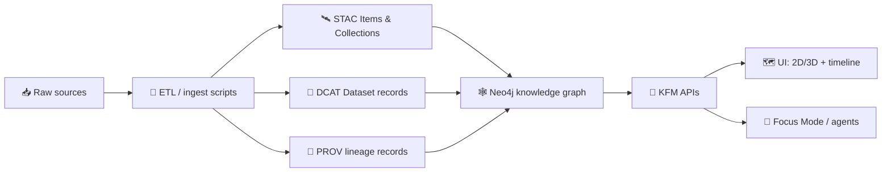

> According to a document from **2026-01-23**, KFM is **provenance-first** and **evidence-driven**: datasets are published with linked **STAC / DCAT / PROV** metadata and surfaced through the runtime (graph + API) so the UI and Focus Mode can always trace **“the map behind the map.”** [oai_citation:0‡📚 Kansas Frontier Matrix (KFM) Data Intake – Technical & Design Guide.pdf](file-service://file-EbUCdsJMbu5KwpoKMrLrgj) [oai_citation:1‡📚 Kansas Frontier Matrix (KFM) Data Intake – Technical & Design Guide.pdf](file-service://file-EbUCdsJMbu5KwpoKMrLrgj) [oai_citation:2‡Kansas Frontier Matrix – Comprehensive UI System Overview.pdf](file-service://file-KcBQruYcoFVDEixzzRHTwt)

    

# 🛰️ STAC Items for `<model_id>`

| Key | Value |
|---|---|
| 📍 Location | `mcp/model_cards/<model_id>/links/stac_items.md` |
| 🧠 Purpose | List **STAC Items + Collections** this model **consumes** and/or **produces** (with repo paths + optional STAC API URLs + optional OCI refs). |
| ✅ Why it matters | KFM governance requires metadata + provenance to stay attached to insights and exports; this file makes the model’s data dependencies reviewable.  [oai_citation:3‡Kansas Frontier Matrix (KFM) – Comprehensive Architecture, Features, and Design.pdf](file-service://file-4Umt1yHoGKicdmLWzFJ9sC) |
| 🗓️ Last updated | `2026-01-23` |

---

## 🧭 Quick nav

- [MCP model card context](#-mcp-model-card-context)
- [Evidence triplet STAC DCAT PROV](#-evidence-triplet-stac-dcat-prov)
- [Canonical paths and link styles](#-canonical-paths-and-link-styles)
- [How to add an entry](#-how-to-add-an-entry)
- [Asset formats and distribution](#-asset-formats-and-distribution)
- [STAC Items list for `<model_id>`](#-stac-items-list-for-model_id)
- [Governance and sensitivity](#-governance-and-sensitivity)
- [Validation checklist](#-validation-checklist)
- [Project docs referenced](#-project-docs-referenced)

---

## 🧩 MCP model card context

KFM organizes implementation + governance playbooks under `mcp/`, including **model cards** per AI agent/tool. This file lives under each model’s `links/` folder to keep data dependencies explicit and reviewable. [oai_citation:4‡Kansas-Frontier-Matrix_ Open-Source Geospatial Historical Mapping Hub Design.pdf](file-service://file-64djFYQUCmxN1h6L6X7KUw)

```text
📦 repo-root
├─ 🧠 mcp/
│  └─ 🪪 model_cards/
│     └─ <model_id>/
│        └─ 🔗 links/
│           └─ 🛰️ stac_items.md  ← you are here
└─ 🗂️ data/
   ├─ 🛰️ stac/
   │  ├─ collections/
   │  └─ items/
   ├─ 🧾 catalog/ (DCAT)
   └─ 🧬 prov/
```

> [!NOTE]
> Some older docs mention STAC metadata under `data/catalog/` and provenance under `data/provenance/`, while v13 guidance standardizes STAC under `data/stac/…` and PROV under `data/prov/…`. Prefer the **v13 canonical layout** described below. [oai_citation:5‡Kansas Frontier Matrix (KFM) – Comprehensive Architecture, Features, and Design.pdf](file-service://file-4Umt1yHoGKicdmLWzFJ9sC) [oai_citation:6‡MARKDOWN_GUIDE_v13.md.gdoc](file-service://file-UYVruFXfueR8veHMUKeugU)

---

## 🧬 Evidence triplet STAC DCAT PROV

KFM treats **STAC (spatial/temporal indexing)**, **DCAT (catalog discovery)**, and **W3C PROV (lineage)** as a single “metadata backbone” that must stay linked end-to-end (including for AI outputs). [oai_citation:7‡📚 Kansas Frontier Matrix (KFM) Data Intake – Technical & Design Guide.pdf](file-service://file-EbUCdsJMbu5KwpoKMrLrgj) [oai_citation:8‡📚 Kansas Frontier Matrix (KFM) Data Intake – Technical & Design Guide.pdf](file-service://file-EbUCdsJMbu5KwpoKMrLrgj)



KFM also codifies **pipeline ordering** as an invariant:  
**ETL → Catalogs (STAC/DCAT/PROV) → Graph → API → UI → Story Nodes → Focus Mode**. [oai_citation:9‡MARKDOWN_GUIDE_v13.md.gdoc](file-service://file-UYVruFXfueR8veHMUKeugU)

---

## 📁 Canonical paths and link styles

### ✅ Repo paths

Use **relative links** from this file:

- **STAC Collections:** `../../../../data/stac/collections/<collection_id>.json`
- **STAC Items:** `../../../../data/stac/items/<item_id>.json`
- **DCAT datasets:** `../../../../data/catalog/dcat/<dataset_id>.jsonld`
- **PROV:** `../../../../data/prov/<activity_id>.json`  

(These are the v13 canonical “homes” for metadata artifacts.) [oai_citation:10‡MARKDOWN_GUIDE_v13.md.gdoc](file-service://file-UYVruFXfueR8veHMUKeugU)

### 🌐 Optional STAC API URLs

If the deployment exposes a STAC API, also include:

- `<stac_api_base>/collections/<collection_id>`
- `<stac_api_base>/collections/<collection_id>/items/<item_id>`

> [!TIP]
> Keep the **repo JSON** link even if you add a STAC API URL. Repo links are stable for reviews and PR diffs.

---

## ➕ How to add an entry

### 🧾 Minimum info per entry

STAC Items should be listed here with enough detail to answer:

- What is it? (collection + item id pattern)
- Where is it? (repo link + assets)
- Why is it here? (training / inference / eval / output)
- How is it governed? (classification / redaction notes)
- How is it traceable? (links to DCAT + PROV)

KFM’s STAC Items typically include **properties, assets, links**, plus KFM-specific metadata like **dataset ID, version, classification**, and cross-links to DCAT/PROV for traceability. [oai_citation:11‡📚 Kansas Frontier Matrix (KFM) Data Intake – Technical & Design Guide.pdf](file-service://file-EbUCdsJMbu5KwpoKMrLrgj)

<details>
<summary>📋 Copy/paste entry template</summary>

```md
- **Use:** `training | inference | evaluation | output`
- **Collection:** `<collection_id>` → `../../../../data/stac/collections/<collection_id>.json`
- **Item(s):** `<item_id>` (or a pattern like `<collection_id>__<tile_or_time_key>`)
- **Assets:** `cog | geoparquet | pmtiles | tiles | api | thumbnail`
- **Governance:** `kfm:classification=<public|restricted|confidential>` + redaction notes
- **DCAT:** `../../../../data/catalog/dcat/<dataset_id>.jsonld`
- **PROV:** `../../../../data/prov/<activity_id>.json`
- **Notes:** what the model does with it (features, retrieval, evaluation, etc.)
```
</details>

---

## 📦 Asset formats and distribution

KFM commonly uses modern geospatial “big data” formats such as:

- **COG** for rasters
- **GeoParquet** for analysis-ready vectors/tables
- **PMTiles** for portable tile archives  
…and validates metadata in CI (“metadata like code”). [oai_citation:12‡Kansas Frontier Matrix (KFM) – Comprehensive Architecture, Features, and Design.pdf](file-service://file-4Umt1yHoGKicdmLWzFJ9sC) [oai_citation:13‡Kansas Frontier Matrix (KFM) – Comprehensive Technical Documentation.pdf](file-service://file-AkqwUuYPp5zePf7pv5SMxi)

### 🗺️ UI-friendly formats

KFM’s UI stack is designed for both **2D** and **3D** visualization (e.g., MapLibre + Cesium, 3D tiles), so STAC assets should clearly label their role (`visualization`, `analysis`, etc.). [oai_citation:14‡Kansas-Frontier-Matrix_ Open-Source Geospatial Historical Mapping Hub Design.pdf](file-service://file-BJN3xmP44EHc9NRCccCn4H)

### 🧱 Vector tiles from PostGIS

When serving vectors as tiles, KFM can expose endpoints like `/tiles/{z}/{x}/{y}.mvt` (built on PostGIS `ST_AsMVT`). In those cases, STAC can link to the endpoint as an asset or service link (with clear media type). [oai_citation:15‡Kansas Frontier Matrix (KFM) – Comprehensive Technical Documentation.pdf](file-service://file-AkqwUuYPp5zePf7pv5SMxi)

### 🧊 OCI distribution for big artifacts

KFM can distribute large artifacts via **OCI registries** using tools like **ORAS** and **Cosign**; catalogs (STAC/DCAT) can include distribution metadata (e.g., `distribution.oci`) including digest + media types, enabling reproducible pulls and signature verification. [oai_citation:16‡Additional Project Ideas.pdf](file-service://file-Pc2GNivcrHBeKjBQksLC3T) [oai_citation:17‡Additional Project Ideas.pdf](file-service://file-Pc2GNivcrHBeKjBQksLC3T)

Example media types called out in KFM design notes include `application/vnd.pmtiles` and `application/vnd.geo+parquet` (or `application/vnd.apache.parquet` in some docs). [oai_citation:18‡Additional Project Ideas.pdf](file-service://file-Pc2GNivcrHBeKjBQksLC3T) [oai_citation:19‡Additional Project Ideas.pdf](file-service://file-Pc2GNivcrHBeKjBQksLC3T)

---

## 🧭 UI and timeline expectations

The UI is explicitly designed so that **every visualization is linked to its source metadata**, enabling users to trace provenance (“the map behind the map”). [oai_citation:20‡Kansas Frontier Matrix – Comprehensive UI System Overview.pdf](file-service://file-KcBQruYcoFVDEixzzRHTwt)

Temporal navigation features (timeline slider) are expected to filter layers using standardized date fields (STAC-like time semantics). [oai_citation:21‡🌟 Kansas Frontier Matrix – Latest Ideas & Future Proposals.docx.pdf](file-service://file-SQ3f7ve8SGiusT6ThZEuCe)

---

## 🛰️ STAC Items list for `<model_id>`

> [!IMPORTANT]
> This section is the **actual deliverable** for the model card: list the STAC Collections/Items used by this model.
> Start with the “Required” table, then optionally pull from the “Common building blocks” below.

### ✅ Required for `<model_id>` (fill this in)

| Use | STAC Collection | STAC Item(s) | Primary assets | DCAT | PROV | Notes |
|---|---|---|---|---|---|---|
| training | `<collection_id>` | `<item_id or pattern>` | `cog / geoparquet / …` | `<dataset_id>` | `<activity_id>` | why the model needs it |
| inference |  |  |  |  |  |  |
| evaluation |  |  |  |  |  |  |
| output |  |  |  |  |  |  |

---

### 🧱 Common KFM input building blocks (copy as needed)

These are examples explicitly described in project docs; copy them into “Required” if your model uses them.

#### 🟩 Landcover time series

A canonical example is a landcover dataset where DCAT points to a STAC Collection and the collection has **items per year** (e.g., “Landcover 1990–2020”). [oai_citation:22‡📚 Kansas Frontier Matrix (KFM) Data Intake – Technical & Design Guide.pdf](file-service://file-EbUCdsJMbu5KwpoKMrLrgj)

- **Collection (example naming):** `kfm.ks.landcover.2000_2020.v1` [oai_citation:23‡Kansas Frontier Matrix (KFM) – Comprehensive Technical Documentation.pdf](file-service://file-AkqwUuYPp5zePf7pv5SMxi)
- **Item granularity:** yearly (`…2000…`, `…2001…`, etc.)
- **Assets:** COG(s) for rasters + optional PMTiles for map delivery [oai_citation:24‡Kansas Frontier Matrix (KFM) – Comprehensive Technical Documentation.pdf](file-service://file-AkqwUuYPp5zePf7pv5SMxi)

#### 🛰️ Historic aerial imagery tiles

Example: a STAC Collection like “Kansas aerial imagery 1950s” listing **tiles** (footprints + dates + links to imagery). [oai_citation:25‡📚 Kansas Frontier Matrix (KFM) Data Intake – Technical & Design Guide.pdf](file-service://file-EbUCdsJMbu5KwpoKMrLrgj)

#### 🌊 River gauge and streaming sensors

KFM supports **streaming** observation data; STAC can be used even for micro-batches (e.g., gauge stations) to keep lineage + discoverability coherent. [oai_citation:26‡Innovative Concepts to Evolve the Kansas Frontier Matrix (KFM).pdf](file-service://file-G71zNoWKxsoSW44iwZaaCC)

#### 🚌 Transit GTFS-RT watcher feeds

A “transit vehicles” ingestion can maintain a live feed from a GTFS-RT endpoint, with periodic updates. This can be represented as time-windowed STAC Items or services referenced by catalog metadata. [oai_citation:27‡🌟 Kansas Frontier Matrix – Latest Ideas & Future Proposals.docx.pdf](file-service://file-SQ3f7ve8SGiusT6ThZEuCe)

---

### 🧪 Common KFM output building blocks (model-generated)

#### 🌬️ Bias-corrected air quality outputs

KFM’s `kfm-air-correct` produces corrected values and QC flags, and **yields a STAC Item** for the corrected dataset with parameters + provenance embedded. [oai_citation:28‡Kansas Frontier Matrix (KFM) – AI System Overview 🧭🤖.pdf](file-service://file-Pv8eev6RWvCKrGCXyzY7zg) [oai_citation:29‡Kansas Frontier Matrix (KFM) – AI System Overview 🧭🤖.pdf](file-service://file-Pv8eev6RWvCKrGCXyzY7zg)

If `<model_id>` is `kfm-air-correct` (or depends on it), include both:
- the **raw sensor** collections (inputs),
- the **corrected dataset** collection/items (outputs),
- and the PROV activity for each run.

#### 🧪 PR-first modeling runs

KFM modeling workflows can treat model runs like code contributions: a run produces new data + metadata and includes PROV records, enabling later queries like “which model/version produced this?” [oai_citation:30‡Kansas Frontier Matrix (KFM) – AI System Overview 🧭🤖.pdf](file-service://file-Pv8eev6RWvCKrGCXyzY7zg)

---

### 🪨 Surficial geology packaging pattern (example)

A proposed pattern: each geology unit is packaged as **GeoParquet + PMTiles**, and each “data unit” gets a **STAC Collection + DCAT record** (so layers are both analyzable and easily browsed). [oai_citation:31‡🌟 Kansas Frontier Matrix – Latest Ideas & Future Proposals.docx.pdf](file-service://file-SQ3f7ve8SGiusT6ThZEuCe)

---

## 🔐 Governance and sensitivity

KFM governance includes:
- **FAIR** enforcement via mandatory metadata/provenance and clear licenses
- **CARE** principles for sensitive / community-governed datasets (authority + ethics + collective benefit) [oai_citation:32‡Kansas Frontier Matrix (KFM) – Comprehensive Architecture, Features, and Design.pdf](file-service://file-4Umt1yHoGKicdmLWzFJ9sC)

Also: Focus Mode answers and UI exports are expected to carry citations/provenance rather than “pretty colors with no receipts.” [oai_citation:33‡Kansas Frontier Matrix – Comprehensive UI System Overview.pdf](file-service://file-KcBQruYcoFVDEixzzRHTwt) [oai_citation:34‡Kansas Frontier Matrix (KFM) – Comprehensive Architecture, Features, and Design.pdf](file-service://file-4Umt1yHoGKicdmLWzFJ9sC)

> [!NOTE]
> The broader KFM concept space explicitly calls out indigenous governance patterns (e.g., Mukurtu / “slow data” ideas) and ethics as first-class design constraints, so sensitive STAC Items listed here should include governance notes and access expectations. [oai_citation:35‡📚 Kansas Frontier Matrix (KFM) Data Intake – Technical & Design Guide.pdf](file-service://file-EbUCdsJMbu5KwpoKMrLrgj) [oai_citation:36‡Innovative Concepts to Evolve the Kansas Frontier Matrix (KFM).pdf](file-service://file-G71zNoWKxsoSW44iwZaaCC)

### 🕵️ Privacy considerations

Classic data-mining concerns (e.g., inference from query outputs) are relevant when exposing catalogs + query APIs; techniques like query auditing and inference controls are explicitly discussed in referenced materials and should be considered when linking sensitive STAC Items here. [oai_citation:37‡Data Mining Concepts & applictions.pdf](file-service://file-2uwEbQAFVKpXaTtWgUirAH)

---

## ✅ Validation checklist

Use this checklist when adding/updating rows:

- [ ] ✅ STAC Item + Collection exist and link correctly (repo paths)
- [ ] ✅ DCAT dataset exists and points to STAC
- [ ] ✅ PROV activity exists and links inputs → outputs
- [ ] ✅ Item includes required **properties / assets / links**, plus KFM dataset ID/version/classification and cross-links to DCAT/PROV [oai_citation:38‡📚 Kansas Frontier Matrix (KFM) Data Intake – Technical & Design Guide.pdf](file-service://file-EbUCdsJMbu5KwpoKMrLrgj)
- [ ] ✅ CI/policy gates pass (fail closed if required artifacts are missing) [oai_citation:39‡Additional Project Ideas.pdf](file-service://file-Pc2GNivcrHBeKjBQksLC3T)
- [ ] ✅ Pipeline ordering invariant is respected (no bypassing catalogs/lineage) [oai_citation:40‡MARKDOWN_GUIDE_v13.md.gdoc](file-service://file-UYVruFXfueR8veHMUKeugU)

---

## 📚 Project docs referenced

This page intentionally pulls from **all project docs** provided:

- **📚 Data Intake Guide** (evidence-first intake; STAC/DCAT/PROV backbone; graph integration; streaming patterns). [oai_citation:41‡📚 Kansas Frontier Matrix (KFM) Data Intake – Technical & Design Guide.pdf](file-service://file-EbUCdsJMbu5KwpoKMrLrgj) [oai_citation:42‡Innovative Concepts to Evolve the Kansas Frontier Matrix (KFM).pdf](file-service://file-G71zNoWKxsoSW44iwZaaCC)
- **🧭 AI System Overview** (domain models output STAC Items + PROV; PR-first modeling; bias correction example). [oai_citation:43‡Kansas Frontier Matrix (KFM) – AI System Overview 🧭🤖.pdf](file-service://file-Pv8eev6RWvCKrGCXyzY7zg) [oai_citation:44‡Kansas Frontier Matrix (KFM) – AI System Overview 🧭🤖.pdf](file-service://file-Pv8eev6RWvCKrGCXyzY7zg)
- **🧱 Architecture, Features, and Design** (FAIR/CARE governance; provenance enforcement). [oai_citation:45‡Kansas Frontier Matrix (KFM) – Comprehensive Architecture, Features, and Design.pdf](file-service://file-4Umt1yHoGKicdmLWzFJ9sC)
- **🧾 Technical Documentation** (ID naming patterns; GeoParquet/COG + validation culture). [oai_citation:46‡Kansas Frontier Matrix (KFM) – Comprehensive Technical Documentation.pdf](file-service://file-AkqwUuYPp5zePf7pv5SMxi)
- **🖥️ UI System Overview** (“map behind the map”; provenance surfaced in UI). [oai_citation:47‡Kansas Frontier Matrix – Comprehensive UI System Overview.pdf](file-service://file-KcBQruYcoFVDEixzzRHTwt)
- **🌟 Latest Ideas & Future Proposals** (timeline filters; GeoParquet + PMTiles packaging with STAC/DCAT per unit). [oai_citation:48‡🌟 Kansas Frontier Matrix – Latest Ideas & Future Proposals.docx.pdf](file-service://file-SQ3f7ve8SGiusT6ThZEuCe) [oai_citation:49‡🌟 Kansas Frontier Matrix – Latest Ideas & Future Proposals.docx.pdf](file-service://file-SQ3f7ve8SGiusT6ThZEuCe)
- **💡 Additional Project Ideas** (OCI/ORAS/Cosign distribution patterns; policy gates). [oai_citation:50‡Additional Project Ideas.pdf](file-service://file-Pc2GNivcrHBeKjBQksLC3T) [oai_citation:51‡Additional Project Ideas.pdf](file-service://file-Pc2GNivcrHBeKjBQksLC3T)
- **🧠 Innovative Concepts** (digital twins + ethical governance; Mukurtu/slow-data lens). [oai_citation:52‡📚 Kansas Frontier Matrix (KFM) Data Intake – Technical & Design Guide.pdf](file-service://file-EbUCdsJMbu5KwpoKMrLrgj) [oai_citation:53‡📚 Kansas Frontier Matrix (KFM) Data Intake – Technical & Design Guide.pdf](file-service://file-EbUCdsJMbu5KwpoKMrLrgj)
- **🧰 MCP / repo organization design doc** (where model cards live). [oai_citation:54‡Kansas-Frontier-Matrix_ Open-Source Geospatial Historical Mapping Hub Design.pdf](file-service://file-64djFYQUCmxN1h6L6X7KUw)
- **📦 Reference bundles (PDF Portfolios)** — open with Adobe Acrobat for full content:
  - `Various programming langurages & resources 1.pdf` [oai_citation:55‡Various programming langurages & resources 1.pdf](file-service://file-4wp3wSSZs7gk5qHWaJVudi)
  - `Maps-GoogleMaps-VirtualWorlds-Archaeological-Computer Graphics-Geospatial-webgl.pdf` [oai_citation:56‡Maps-GoogleMaps-VirtualWorlds-Archaeological-Computer Graphics-Geospatial-webgl.pdf](file-service://file-RshcX5sNY2wpiNjRfoP6z6)
  - `AI Concepts & more.pdf` [oai_citation:57‡AI Concepts & more.pdf](file-service://file-K6BctJjeUwvyCahLf9qdwr)
  - `Data Managment-Theories-Architures-Data Science-Baysian Methods-Some Programming Ideas.pdf` [oai_citation:58‡Data Managment-Theories-Architures-Data Science-Baysian Methods-Some Programming Ideas.pdf](file-service://file-RrXMFY7cP925exsQYermf2)

---
