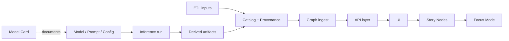

# MCP Model Cards — README

<div align="center">


</div>

> 🔒 **Safety & governance reminder:** Model Cards are public-ish documentation by default.  
> ✅ Keep them *useful* and *auditable*. ❌ Do **not** store secrets, private prompts, unredacted PII, or restricted/sensitive locations.

<a id="quick-nav"></a>
## 🧭 Quick Nav

- [Overview](#overview)
- [Directory Layout](#directory-layout)
- [Model ID & Version Rules](#model-id--version-rules)
- [Model Card Minimum Requirements](#model-card-minimum-requirements)
- [STAC · DCAT · PROV Alignment](#stac--dcat--prov-alignment)
- [Story Nodes & Focus Mode Integration](#story-nodes--focus-mode-integration)
- [Security · Privacy · Sovereignty](#security--privacy--sovereignty)
- [Validation & CI/CD](#validation--cicd)
- [Version History](#version-history)

---

<a id="overview"></a>
## 📘 Overview

### Purpose 🎯
This directory contains **Model Cards** for AI/ML (and AI-adjacent) models used within the Kansas Frontier Matrix (KFM) pipeline.

A Model Card is a compact, human-readable record of:

- ✅ the model’s approach/architecture (at a level safe for sharing),
- ✅ training/finetuning and evaluation context (referenced by dataset IDs, *not* raw data),
- ✅ intended use and out-of-scope use,
- ✅ limitations / known failure modes,
- ✅ evaluation results (where applicable),
- ✅ governance, sovereignty, and sensitivity constraints for downstream use,
- ✅ provenance hooks (how this model is represented in STAC/DCAT/PROV + run logs).

Model Cards support reproducibility, review, and responsible interpretation of AI-derived outputs.

---

### Scope 🧩

Model Cards **MUST** exist for any model/prompt/agent that:

- produces **user-visible** content (summaries, classifications, suggested links, story drafts),
- produces **AI-derived artifacts** that may be cataloged and surfaced in the UI,
- performs automated extraction/linking that affects the graph (NER, entity resolution, change detection),
- can materially influence user decisions (rankings, recommendations, alerts, “high confidence” labels),
- participates in **agentic workflows** (Watcher → Planner → Executor), even when humans supervise.

Model Cards **SHOULD** exist for prototypes (recommended), but **MUST** exist before production promotion.

---

### What this folder is not 🚫
- Not a storage location for large binaries (weights, huge logs, datasets).
- Not a replacement for STAC/DCAT/PROV (those remain the canonical provenance & catalog layer).
- Not a place to store secrets (keys/tokens), restricted prompts, or raw sensitive training/eval text.

---

### Audience 👥
- Pipeline developers & maintainers
- Data curators / editors
- Governance reviewers (ethics, sovereignty, security)
- Downstream users who need to interpret outputs correctly

---

### Definitions 🧠

- **Model Card**: governed documentation describing how a model is intended to be used, evaluated, and constrained.
- **Model artifact**: the packaged model/prompt/config used for inference, referenced by version + checksum/digest.
- **Model-derived artifact**: an output that may be cataloged (STAC/DCAT) and must be traceable via PROV.
- **Evidence-first**: AI outputs are *derived signals*, not “facts,” unless backed by evidence and provenance links.
- **Provenance**: lineage describing inputs, activities (runs), agents, and outputs (PROV-O alignment).
- **Governance ledger**: immutable record of key actions/approvals/events (document IDs + event_source_id).

---

### Key artifacts (what this folder points to) 🧾

| Artifact | Path / Identifier | Owner | Notes |
|---|---|---|---|
| Model Card (per model) | `mcp/model_cards/<model_id>/MODEL_CARD.md` | Model owner | **Required** for deployed models |
| Model owners | `mcp/model_cards/<model_id>/owners.yaml` | Model owner | Who to page when things break |
| Evaluation report | `mcp/model_cards/<model_id>/eval/report.md` | Model owner | Human-readable eval summary |
| Evaluation metrics | `mcp/model_cards/<model_id>/eval/metrics.json` | Model owner | Machine-readable metrics |
| Examples / failure cases | `mcp/model_cards/<model_id>/eval/examples/**` | Model owner | Curated, sanitized examples |
| Config snapshots | `mcp/model_cards/<model_id>/configs/*.yaml` | Model owner | **No secrets**; document thresholds/prompts safely |
| Safety policy snapshot | `mcp/model_cards/<model_id>/configs/safety.yaml` | Model owner | Guardrails + filters (sanitized) |
| Model changelog | `mcp/model_cards/<model_id>/CHANGELOG.md` | Model owner | Required once production |
| Attestations (prod) | `mcp/model_cards/<model_id>/attestations/**` | MCP | SBOM/SLSA/signatures when enabled |
| Optional model index | `mcp/model_cards/INDEX.md` | MCP | Curated list of active models |

> 🧷 **Reality check:** Some artifacts above may be “recommended” until CI/workflows are fully wired up in your repo.  
> The **contract** is: deployed models must be traceable by ID+version, and their evaluation + governance constraints must be documented.

---

### Definition of done ✅

**For this README**
- [ ] Front-matter complete and consistent with the doc path and IDs
- [ ] Directory layout and naming rules are unambiguous
- [ ] Provenance alignment expectations are explicit (PROV activity + model version)
- [ ] Governance / sensitivity handling requirements are explicit
- [ ] Validation steps are listed and repeatable

**For each deployed model**
- [ ] `MODEL_CARD.md` present and complete (minimum sections below)
- [ ] `eval/metrics.json` present (or documented “not applicable”)
- [ ] `configs/` snapshots present (sanitized)
- [ ] Explicit “do not use for …” statements exist
- [ ] Model version and artifact digest are recorded
- [ ] PROV activities for training/eval/inference are linked (IDs or pointers)
- [ ] Governance review triggers are declared (CARE / sovereignty / security)

---

<a id="directory-layout"></a>
## 🗂️ Directory Layout

### This document 📄
- `mcp/model_cards/README.md` — directory contract, expectations, workflow

### Related repository paths 🔗
- `mcp/experiments/` — experiment logs/results (scientific method trace)
- `mcp/sops/` — SOPs: retraining, promotion, rollback, incident handling
- `mcp/runs/` — run manifests / pipeline artifacts (if used in this repo)
- `docs/` — general documentation + standards
- `data/stac/**`, `data/catalog/dcat/**`, `data/prov/**` — catalog + provenance outputs
- `reports/ai/**` — model metrics/drift/explainability artifacts (if enabled)
- `data/processed/models/**` — packaged AI artifacts for release/publishing (if enabled)

---

### Target file tree (recommended) 🌳

```text
📁 mcp/
└── 📁 model_cards/
    ├── 📄 README.md
    ├── 📄 INDEX.md                       (optional; curated list of active models)
    ├── 📁 templates/                     (optional; if you keep templates here)
    │   └── 📄 MODEL_CARD.template.md
    ├── 📁 schemas/                       (optional; JSON schemas for validation)
    │   ├── 📄 model_card.schema.json
    │   └── 📄 metrics.schema.json
    └── 📁 <model_id>/
        ├── 📄 MODEL_CARD.md
        ├── 📄 CHANGELOG.md
        ├── 📄 owners.yaml
        ├── 📁 eval/
        │   ├── 📄 report.md
        │   ├── 📄 metrics.json
        │   └── 📁 examples/              (sanitized)
        ├── 📁 configs/
        │   ├── 📄 training.yaml          (if trainable)
        │   ├── 📄 inference.yaml
        │   └── 📄 safety.yaml
        ├── 📁 attestations/              (prod; if enabled)
        │   ├── 📄 sbom.spdx.json
        │   ├── 📄 slsa-attestation.json
        │   ├── 📄 signature.sig
        │   └── 📄 certificate.pem
        └── 📁 links/                     (recommended: “pointers, not payloads”)
            ├── 📄 prov_activities.md
            ├── 📄 stac_items.md
            └── 📄 dcat_datasets.md
```

---

<a id="model-id--version-rules"></a>
## 🏷️ Model ID & Version Rules

### `model_id` (required)
Use stable, filesystem-safe IDs:

- **Format:** `kebab-case` (preferred) or `snake_case` (allowed, pick one and be consistent)
- **Examples:** `ner-v1`, `entity-resolution`, `focus-summarizer`, `geo-change-detector`
- **No spaces**, no secrets, no environment-specific suffixes (`-prod`, `-staging` should be a *deployment tag*, not the model ID)

### `model_version` (required)
- Prefer **SemVer**: `MAJOR.MINOR.PATCH`
- Increment:
  - **MAJOR** when meaning/behavior changes materially or schema changes
  - **MINOR** when improvements are backward compatible
  - **PATCH** for bugfixes and non-behavioral changes

### Stable identifiers (recommended)
For deployed models, record stable identifiers that also appear in logs/PROV:

- `urn:kfm:model:<model_id>:<version>`
- `sha256:<artifact_digest>` (or OCI digest if stored as an OCI artifact)

> 🧷 **Rule:** A user-visible output must be traceable to an immutable model version + config snapshot.

---

<a id="model-card-minimum-requirements"></a>
## 🧾 Model Card Minimum Requirements

> 🧠 Think “small but complete”: if a reviewer can’t tell what the model does, when it fails, and how to trace its outputs, the card isn’t done.

### Minimum required sections for `MODEL_CARD.md` ✅

1. **Summary**
   - What it does in 1–3 sentences
   - Where it runs (pipeline stage) and what it produces

2. **Intended use**
   - “Use for …” + supported domains/time ranges/regions
   - “Do not use for …” (explicit)

3. **Inputs**
   - Dataset IDs (STAC/DCAT refs), document sets, map layers
   - Required schema assumptions (fields, CRS, etc.)

4. **Outputs**
   - Output schema(s) + examples (sanitized)
   - Confidence scores: what they mean and how to interpret

5. **Training / configuration**
   - Training approach (if applicable), hyperparameters at a safe level
   - Prompt/config snapshots (sanitized)
   - Environment pins (recommended): container tag, dependency lock, hardware class

6. **Evaluation**
   - Test set IDs + metrics summary (and limitations of test set)
   - Qualitative examples of success/failure (sanitized)

7. **Limitations & failure modes**
   - Known blind spots, common errors, brittle behaviors
   - Edge cases (geo/time/format) and expected degradation

8. **Safety, governance & sensitivity**
   - CARE / sovereignty triggers and review requirements
   - Redaction/generalization behavior for restricted or sensitive content
   - “No output less restricted than its inputs” rule statement

9. **Provenance linkage**
   - How the model is represented in PROV (`prov:Activity` IDs for train/eval/infer)
   - Where run manifests/logs live (paths or pointers)

10. **Monitoring**
   - Drift indicators, error rates, human correction feedback loops
   - Rollback criteria and incident playbook pointer (SOP)

11. **Change log & deprecation**
   - What changed, why it changed, migration notes
   - Deprecation policy and replacement model (if applicable)

---

### Addendum A: Geo-aware models 🗺️ (required when applicable)

If the model consumes or produces geospatial data, include:

- CRS / projection assumptions (input + output)
- Spatial extent + resolution/scale limits (e.g., county-level vs parcel-level)
- Tiling/indexing scheme if used (e.g., H3 or tile grids)
- Topology assumptions (buffers, overlays, snapping) + known issues
- Location sensitivity handling (aggregation/generalization thresholds)

---

### Addendum B: Narrative / Story drafting ✍️ (required when applicable)

If the model drafts Story Nodes / Focus Mode content:

- Evidence selection rules (what counts as evidence; ranking strategy)
- Citation emission rules (how citations map to STAC/DCAT/PROV)
- Hallucination mitigation strategy (evidence-first enforcement)
- Editorial workflow: how humans review/override
- UI disclosure: “AI-generated” labeling + confidence behavior

---

### Addendum C: Agentic workflows (Watcher → Planner → Executor) 🕵️‍♂️🤖

If the “model” is an agentic toolchain or automation:

- Tool allowlist & network access rules
- Policy-as-code checks (OPA/Rego) that gate actions
- Structured output constraints (JSON contracts) + validation
- Human-in-the-loop requirements (what is auto-approved vs manual)

---

<a id="stac--dcat--prov-alignment"></a>
## 🌐 STAC · DCAT · PROV Alignment

### Provenance requirements 🧬
Model cards are documentation, but must be consistent with the provenance layer:

- Training, evaluation, and inference runs should map to `prov:Activity` identifiers.
- Model artifacts and derived artifacts should map to `prov:Entity`.
- Model-derived evidence products should be representable as STAC assets/items where relevant.
- DCAT mappings should exist for any packaged dataset/evidence product intended for export.

### Practical linkage (minimum) 🔗
Each deployed model should have:

- stable model identifier (used in PROV + logs),
- version string,
- model card file path,
- artifact checksum/digest,
- pointers to `prov:Activity` IDs for the runs that produced outputs.

> ✅ **KFM pattern:** “documentation is helpful, provenance is authoritative.”

---

<a id="architecture-context"></a>
## 🧱 Architecture Context

### Where model cards fit in KFM 🧭

KFM’s canonical pipeline ordering is preserved end-to-end:

**ETL → STAC/DCAT/PROV → Graph → API → UI → Story Nodes → Focus Mode**

Model Cards live in the **MCP (AI documentation) layer**, acting as a human-readable counterpart to:

- STAC/DCAT/PROV catalog + lineage records,
- run manifests,
- model artifact versioning and release bundles.



### Constraints / invariants 🧷
- UI must not read Neo4j directly; UI consumes model metadata through contracted APIs.
- “Evidence-first”: narratives/summaries must remain evidence-led (no uncited facts).
- Sensitive locations, culturally sensitive knowledge, and personal data must not be disclosed in model cards or configs.
- Run logs and PROV records must identify the model version that generated artifacts.
- Raw evidence is immutable; transformations must be reproducible and config-driven.

---

<a id="story-nodes--focus-mode-integration"></a>
## 🧠 Story Nodes & Focus Mode Integration

### How this work surfaces in Focus Mode 🔎
Any Focus Mode content derived from model outputs must:

- resolve to evidence identifiers (STAC/DCAT/PROV),
- disclose that the content is AI-derived where applicable,
- carry uncertainty/confidence metadata,
- support human correction paths (editor overrides + audit trail).

### Provenance-linked narrative rule 🧾
- ✅ No uncited facts.
- ✅ Any inferential or predictive content must be opt-in and explicitly labeled.
- ✅ Editors/curators must have a clear correction path when model outputs are wrong.

### Recommended UI affordances 🧩
- “Model details” link → model card summary (served via API)
- “AI-generated” label + confidence indicator
- “View sources” panel that resolves to STAC/DCAT/PROV IDs
- Audit panel: “Why did the model say this?” (evidence list + model version)

---

<a id="security--privacy--sovereignty"></a>
## 🛡️ Security · Privacy · Sovereignty

### Prompt / retrieval security 🔐
Model cards must document (at a safe, non-exploitable level):

- prompt injection defenses and retrieval constraints,
- redaction policies for sensitive entities,
- rate limits / abuse controls for user-facing inference,
- safe failure behaviors (“refuse + explain + cite policy”).

### Privacy & inference control 🕶️
If there is any risk of leaking sensitive information through AI outputs:

- describe mitigation (aggregation, suppression, differential privacy, query auditing),
- define disallowed query patterns (e.g., “infer sensitive locations”),
- define audit logging requirements for potentially sensitive interactions.

### CARE / sovereignty considerations 🪶
- Treat culturally sensitive knowledge as high-risk by default.
- If a model could expose restricted locations or sensitive entities, require governance review before promotion.
- Ensure redaction/generalization behavior is documented and testable.

> 🧷 **Rule:** No model output may be less restricted than its inputs.

---

<a id="validation--cicd"></a>
## 🧪 Validation & CI/CD

### Validation steps ✅
- [ ] YAML front-matter matches governed keys and doc path
- [ ] Model ID + version are present and consistent with run logs / PROV
- [ ] Training/eval dataset references resolve to catalog entries (where applicable)
- [ ] No sensitive locations or restricted details are disclosed
- [ ] Limitations and intended uses are explicit
- [ ] User-visible AI outputs are described with opt-in + uncertainty behavior
- [ ] (If enabled) SBOM/SLSA/signature artifacts exist for production releases

### Recommended automated checks 🤖
- Markdown lint + front-matter schema validation
- Policy-as-code checks (OPA/Rego) for governance constraints
- Secret scanning on configs
- JSON Schema validation for metrics
- Provenance completeness checks (PROV links exist)

### Reproduction 🧰
If repo-standard scripts exist, document them here:

- `make lint-docs`
- `make validate-model-cards`
- `make validate-stac-dcat-prov`
- `make ai-train` (if local training path exists)
- `make ai-eval` / `make ai-explainability`

### Telemetry signals (if applicable) 📈
- Drift indicators for extraction/classification quality
- Error rates for entity resolution/linking
- Human correction rates and reversal/rollback events
- Coverage gaps (regions/time periods/document types)
- Energy/carbon telemetry for long-running training (when enabled)

---

<a id="open-questions"></a>
## ❓ Open Questions

| Question | Owner | Target date |
|---|---|---|
| Do we standardize a “minimum required sections” checklist for `MODEL_CARD.md`? | TBD | TBD |
| Do we require an `INDEX.md` registry for all active models? | TBD | TBD |
| Do we need a schema/validator for model cards in CI? | TBD | TBD |
| Do we standardize an attestation + signature policy for prompts/config-only models? | TBD | TBD |

---

<a id="future-extensions"></a>
## 🚀 Future Extensions

- Add a completeness validator for `MODEL_CARD.md` in CI (schema + checklist).
- Add a curated `INDEX.md` registry (active model IDs, status, latest eval date).
- Add stable mapping from PROV activity IDs ↔ model card paths (auto-generated).
- Add “model registry bundle” for releases: model card + metrics + drift + explainability + signatures.
- Add UI “model details” and “audit trail” panels for every AI-derived user-facing output.

---

<a id="version-history"></a>
## 🕰️ Version History

| Version | Date | Summary | Author |
|---|---|---|---|
| v1.0.0 | 2025-12-22 | Initial README for MCP model_cards | TBD |
| v1.0.1 | 2025-12-28 | Format upgrade: aligned to KFM universal governed doc structure; clarified provenance + governance rules | TBD |
| v1.1.0 | 2026-01-20 | v13-aligned governance refs + stronger model lifecycle + geo/narrative/agentic addenda + CI/attestation guidance | TBD |

---

Footer refs 📌
- Governance: `docs/standards/governance/ROOT-GOVERNANCE.md` (legacy: `docs/governance/ROOT_GOVERNANCE.md`)
- Ethics / FAIR+CARE: `docs/standards/faircare/FAIRCARE-GUIDE.md` (legacy: `docs/governance/ETHICS.md`)
- Sovereignty: `docs/standards/sovereignty/INDIGENOUS-DATA-PROTECTION.md` (legacy: `docs/governance/SOVEREIGNTY.md`)
