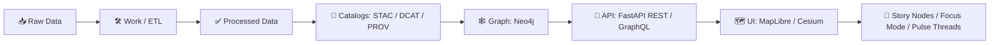

# 📓 `00_templates` — MCP Notebook Templates for KFM 🧭🗺️


> **What this folder is:** copy‑ready notebook starters that enforce **KFM’s evidence‑first + reproducible** workflow.
>
> **What this folder is not:** a dumping ground for one‑off exploration (those go in stage folders after you copy a template). 😉

---

## 🧱 The KFM “No‑Skipping” Pipeline Spine

KFM notebooks are **allowed** to explore, but **publishing** must follow the canonical ordering:



**Core idea:** if it’s visible in the UI (or answerable by Focus Mode), it must be **cataloged + traceable + policy‑checked**. ✅

---

## ⚡ Quick Start (Copy → Run → Publish)

1) **Pick a template** from this folder  
2) **Copy it** into the right stage folder (example paths below)  
3) **Rename** using the naming rules  
4) Fill the **Metadata + Provenance** sections (required)  
5) Run top‑to‑bottom (deterministic)  
6) Export artifacts (minimum: **STAC + DCAT + PROV** + QA summary)  
7) Open a PR with outputs + notes (human‑in‑the‑loop governance) 🧑‍⚖️

Suggested notebook layout (you can adapt, but keep the stage idea):

```text
📁 mcp/notebooks/
├── 📁 00_templates/              👈 you are here
├── 📁 01_intake/                 📥 source → raw snapshots
├── 📁 02_processing/             🧼 ETL → processed outputs
├── 📁 03_catalogs/               🧾 STAC/DCAT/PROV generation + validation
├── 📁 04_graph/                  🕸️ Neo4j import prep + health checks
├── 📁 05_api_contracts/          🔌 request/response samples, query rehearsals
├── 📁 06_ui_layers/              🗺️ layer defs, styling, UX checks
├── 📁 07_story_and_focus/         🧠 Story Nodes, Focus Mode evals, citations QA
└── 📁 99_archive/                🧊 frozen runs (never edit outputs)
```

---

## 🏷️ Naming Convention (Don’t Skip This 😅)

Use names that sort naturally and telegraph intent:

```text
NN_stage__domain__short_slug.ipynb
```

Examples:
- `10_intake__hydrology__usgs_nwis_snapshot.ipynb`
- `30_catalog__landcover__stac_dcat_prov_publish.ipynb`
- `70_story__dust_bowl__pulse_thread_drought_cluster.ipynb`

**Rule of thumb:** if someone can’t guess what your notebook does from the filename, rename it.

---

## 📦 Template Catalog (What We Keep Here)

> Keep this table updated as templates evolve. Templates can be `.ipynb` or `.md`-driven notebooks (Jupytext), but **must** conform to the contract below.

| Template (suggested filename) | Stage | When to use | Minimum outputs |
|---|---:|---|---|
| `00_blank__mcp_scientific_method.ipynb` | 00 | clean start for any work | run manifest + notes + QA stub |
| `10_intake__batch_source_to_raw.ipynb` | 10 | one‑time/batch ingestion | raw snapshot + source receipt |
| `12_intake__stream_watcher_stub.ipynb` | 12 | live/near‑real‑time feeds | stub catalogs + incremental PROV |
| `20_process__vector_clean_enrich.ipynb` | 20 | geodata cleanup & enrichment | processed outputs + QA report |
| `22_process__raster_cog_tiles.ipynb` | 22 | COG/tiles workflow | COGs/tiles + footprints |
| `30_catalog__stac_dcat_prov_publish.ipynb` | 30 | the “publish gate” notebook | **STAC + DCAT + PROV** |
| `40_graph__csv_build_and_validate.ipynb` | 40 | generate Neo4j import CSVs | node/edge CSVs + validation |
| `42_graph__health_checks.ipynb` | 42 | prevent silent graph rot | orphan/lag checks + metrics |
| `50_api__query_rehearsal.ipynb` | 50 | prove API contracts before UI | sample calls + response fixtures |
| `60_ui__layer_definition_builder.ipynb` | 60 | map layer config + attribution | layer JSON + legend + sources |
| `70_story__story_node_authoring.ipynb` | 70 | narrative content with evidence | markdown + evidence manifest |
| `72_story__pulse_thread_generator.ipynb` | 72 | timely geotagged “pulses” | pulse markdown + citations |
| `80_ai__focus_mode_eval.ipynb` | 80 | retrieval & citation gating | eval set + pass/fail report |
| `90_release__artifact_bundle_oci.ipynb` | 90 | package/sign outputs | bundle manifest + checksums |

> ✅ If you create a new template, add it here **and** include a short “why this exists” note.

---

## 📜 The Notebook Contract (Non‑Negotiables)

### ✅ Required “first cell” metadata (copy/paste)

Put this **as the first Markdown cell** in every notebook:

```yaml
---
title: "<Human readable title>"
stage: "<intake|process|catalog|graph|api|ui|story|ai>"
status: "<draft|candidate|published>"
dataset_id: "kfm.<region>.<domain>.<slug>.v<major>"
created: "YYYY-MM-DD"
authors:
  - "<name or handle>"
inputs:
  - name: "<source name>"
    type: "<api|file|db|manual>"
    uri: "<where it came from>"
    accessed: "YYYY-MM-DD"
    license: "<license or 'unknown'>"
    checksum: "<sha256 if file-based>"
outputs:
  - path: "<repo-relative path>"
    type: "<raw|processed|stac|dcat|prov|graph_csv|story|pulse|report>"
governance:
  evidence_first: true
  human_review_required: true
  contains_sensitive_data: false
repro:
  environment: "<conda env / pip reqs / image tag>"
  random_seed: 0
  run_id: "<auto or manual>"
---
```

### 🧾 Provenance receipts (always)

Every notebook must include a section called:

- **“Source Receipt(s)”** (what you got, from where, when, under what license)
- **“Transform Log”** (what you did, with parameters/config)
- **“Evidence Manifest”** (what supports each major claim/output)

If you can’t write the receipt, you’re not ready to publish. 🧾✅

---

## 🧪 MCP Scientific Method Skeleton (Notebook Sections)

Use this structure (headings can be adapted, but keep the intent):

1. **Problem Statement** 🎯  
2. **Hypothesis / Expectations** 🧠  
3. **Inputs & Constraints** 📥🔒  
4. **Method (Deterministic Steps)** 🧰  
5. **Results** 📈  
6. **Validation / QA** ✅  
7. **Interpretation vs Fact (clearly labeled)** 🧾  
8. **Artifacts Produced (paths + checksums)** 📦  
9. **Next Steps / Promotion Plan** 🚀  

> Tip: if you produce maps/charts, add **one sentence**: “what would make this result false?”

---

## 🗂️ Standard Output Locations (Suggested)

Keep outputs predictable so CI + reviewers can find them:

```text
📁 data/
├── 📁 raw/                📥 immutable source snapshots + receipts
├── 📁 work/               🛠️ intermediate scratch (can be cleaned)
├── 📁 processed/          ✅ publishable datasets (versioned)
├── 📁 catalogs/
│   ├── 📁 stac/           🧾 STAC collections/items
│   ├── 📁 dcat/           🧾 DCAT dataset records
│   └── 📁 prov/           🧾 PROV JSON-LD lineage
└── 📁 graph/
    └── 📁 csv/            🕸️ Neo4j import-ready CSVs
```

**Immutability rule:** `data/raw/` is append‑only. If something changes, it’s a **new** snapshot/version, not an overwrite.

---

## 🔌 API + DB Boundaries (How Not to Shoot Ourselves 😬)

### ✅ Do
- Use the API for **user-facing behavior rehearsal** (what UI/Focus Mode will do).
- Use adapters/contracts when emitting catalogs (STAC/DCAT/PROV).
- Treat PostGIS as the **spatial engine**, Neo4j as the **context engine**.

### ❌ Don’t
- Don’t let notebooks become “secret backdoors” that mutate prod graph/UI state.
- Don’t have the UI (or notebook demos meant for UI parity) query Neo4j directly.
- Don’t publish outputs that lack licensing + provenance.

---

## 🧠 Focus Mode Readiness Checklist (Evidence‑First AI)

If your notebook output might be used by Focus Mode (directly or indirectly), ensure:

- [ ] Claims are **traceable** to datasets/documents (citations or graph links)
- [ ] **Fact vs interpretation** is explicit (no blended prose)
- [ ] Sensitive fields are classified/redacted (policy pack alignment)
- [ ] Retrieval keys exist (stable IDs, timestamps, regions, tags)
- [ ] “No source → no answer” expectation is supported by the artifacts

---

## 🗺️ UI Layer Readiness Checklist (MapLibre / Cesium)

For anything that becomes a map layer:

- [ ] Clear **source attribution** (who/where/license)
- [ ] Layer metadata includes **time range + spatial extent**
- [ ] Popup schema defined (what shows when clicked)
- [ ] Styling/legend (even basic) provided
- [ ] Performance considered (tiles/COGs/indexes over raw blobs)

> If it’s slow in a notebook, it will be *painful* in the UI. Optimize early. 🏎️💨

---

## 🧵 Pulse Threads & Story Nodes (Narratives With Receipts)

This templates folder supports narrative types as *data objects*:

- **Story Node** 📚: durable narrative, curated, evidence manifest required  
- **Pulse Thread** 💓: timely geotagged update, still evidence‑first, often watcher‑triggered

Both should ship with:
- a Markdown body
- a lightweight JSON config (geotags, linked entities, timeline window)
- a machine‑readable evidence manifest (dataset IDs, queries, timestamps)

---

## 🕸️ Graph Health Checks (Keep the KG Alive)

When you add/modify graph CSVs, run checks (template `42_graph__health_checks.ipynb`):

- Orphan nodes (unlinked datasets/places)
- Dangling references (IDs not found)
- Duplicate IDs / collisions
- “Staleness” metrics (feeds not updated)
- Basic centrality sanity (unexpected hubs)

Make it boring. Boring = stable. 😌✅

---

## 📦 Promotion Path: Notebook → Pipeline

Notebooks are a **sandbox**. Pipelines are the **product**.

Promote when:
- the notebook is run repeatedly,
- the inputs are stable,
- the outputs are publishable,
- governance steps are clear enough to automate.

Promotion steps:
1) Extract parameters/config into a machine‑readable file (YAML/JSON)
2) Convert core code into a reusable module/script
3) Add tests + policy checks
4) Ensure STAC/DCAT/PROV are generated in the pipeline, not manually
5) Add CI execution (or scheduled run) + artifact versioning

---

## 🤝 Contributing a New Template

PR checklist:
- [ ] Template added to this folder
- [ ] Template added to the catalog table above
- [ ] Includes “first cell” metadata + provenance sections
- [ ] Includes a QA section (even if stubbed)
- [ ] Has a short “Why this template exists” note

---

## 🧰 FAQ (Collapsible)

<details>
  <summary><strong>Q: Can I publish results without STAC/DCAT/PROV if it’s “just a small layer”?</strong></summary>

No. Small layers become big liabilities. If it shows up in UI/AI, it needs catalogs + provenance.
</details>

<details>
  <summary><strong>Q: What if my work is exploratory and messy?</strong></summary>

Great — keep it messy **outside** `00_templates`. Copy a template into the right stage folder, mark it `status: draft`, and iterate there.
</details>

<details>
  <summary><strong>Q: Why so strict?</strong></summary>

Because KFM is a trust machine: if we can’t explain where something came from, we can’t defend it — and Focus Mode can’t cite it.
</details>

---

## 🧭 “If You Only Remember One Thing…”

> **Publishable = Provenanced.**  
> If it can’t be traced, it can’t be shipped. 🧾✅
