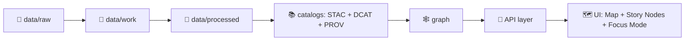

According to a document from 2026-01-20, this notebook pack defines the repeatable “methods layer” that bridges exploratory work and KFM’s evidence-first pipelines.

# 🧪 `02_methods` — Methods Notebooks (MCP)


> **Goal:** turn ideas into **repeatable, evidence-backed methods** ✅  
> **Outcome:** methods that can be **promoted** into `pipelines/` + catalogs (**STAC/DCAT/PROV**) + graph + API + UI 🧬🗺️🤖

---

## 🔎 Quick navigation

- [What belongs here](#-what-belongs-here)
- [How this connects to the KFM “data spine”](#-how-this-connects-to-the-kfm-data-spine)
- [Folder contract](#-folder-contract)
- [Method notebook template](#-method-notebook-template)
- [Method lanes](#-method-lanes)
- [Promotion path](#-promotion-path-notebook--pipeline)
- [Governance, quality gates, and safety](#-governance-quality-gates-and-safety)
- [Resource portfolios](#-resource-portfolios)
- [Project docs used](#-project-docs-used-to-define-this-pack)

---

## ✅ What belongs here

This folder is for **methods** — notebooks that are:

- 🔁 **Re-runnable** (top-to-bottom, from a clean kernel)
- 🧾 **Explicit** about inputs, outputs, assumptions, and limitations
- 🧬 **Provenance-friendly** (ready to become STAC/DCAT/PROV + graph references)
- 🧪 **Repeatable techniques** (not just one-off exploration)
- 🧩 **Composable** (a method can later become a pipeline step or reusable module)

> Think: “method notebook” = a **documented technique**, not a dumping ground.

---

## 🚫 What does NOT belong here

- ❌ Long-lived, manual “pet notebooks” that only run on one machine
- ❌ Hidden data edits (no mystery transformations with no lineage)
- ❌ Copy-pasted data blobs committed into the notebook outputs
- ❌ Anything that bypasses the “data spine” (raw → work → processed → catalogs → graph → API → UI)
- ❌ Claims with no evidence trail (especially AI-generated text without source context)

---

## 🧬 How this connects to the KFM “data spine”

KFM’s core philosophy is **pipeline traceability** and **catalog-driven discovery**.



**Methods notebooks live here:** right at the boundary between 🧰 `data/work` and 🏁 `data/processed`.  
They are where we validate **how** a transformation should work before it becomes a production pipeline.

---

## 📦 Folder contract

### 📥 Inputs (what you read)

You should pull inputs from one of these patterns:

- `data/raw/<domain>/...` for original ingested sources
- `data/work/<domain>/...` for intermediate/staging products
- `catalogs/...` / `data/stac/...` / `data/catalog/...` / `data/prov/...` if you’re **deriving from published boundary artifacts**

### 📤 Outputs (what you write)

A methods notebook should write outputs in a **predictable** layout that supports review + promotion.

Recommended convention:

```text
data/
└─ 🧪 work/
   └─ 📓 notebooks/
      └─ 🧪 <method_id>/                 # Method/workflow identifier (e.g., ndvi_composite.v1, geocode_spike.v0)
         └─ 🏷️ <run_id>/                  # One execution run (time-stamped or UUID; immutable once finalized)
            ├─ 🧾 run_manifest.json        # Run ledger: who/what/when + inputs/outputs + tool versions + checksums
            ├─ 🎛️ params.json              # Parameters used for this run (AOI, dates, thresholds, seeds, options)
            ├─ 🪵 logs.txt                 # Captured logs (stdout/stderr); sanitize before committing/sharing
            ├─ 🖼️ previews/                # Quicklook outputs (PNG/HTML) for fast review without rerunning
            └─ 📦 outputs/                 # Candidate artifacts produced by the run (promote to processed/ when accepted)
```

> If your notebook is producing something “publishable”, treat it like a first-class dataset:
> it should be promotable to `data/processed/<domain>/...` **with** metadata artifacts.

---

## 🧾 Method notebook template

Use this as a lightweight standard. You can paste this into the **first Markdown cell**.

<details>
<summary><strong>📄 Template (copy/paste)</strong></summary>

```markdown
# 🧪 Method: <human-readable title>

## 🆔 Method ID
- `method_id`: `M02-<LANE>-<###>` (example: `M02-GEO-001`)
- `status`: `draft | validated | promoted`

## 🎯 Research question
What are we trying to learn or prove?

## 📥 Inputs
- dataset IDs / file paths
- expected schema(s)
- spatial/temporal scope

## 🧰 Procedure
- steps (numbered)
- tools/libraries
- parameters (with defaults)

## ✅ Validation
- checks performed
- expected ranges
- failure modes

## 📤 Outputs
- files produced
- where they are written
- “promotion notes” (how to turn this into a pipeline step)

## 🧠 Notes & limitations
- assumptions
- known gaps
- next steps

## 🧾 Evidence & provenance hooks
- run_id
- git commit / branch
- environment snapshot
- link to STAC/DCAT/PROV (if generated)
```

</details>

---

## 🧰 Method lanes

This folder is organized by **lanes** (you can implement as subfolders or naming conventions).

### 🗺️ GEO lane — raster/vector/geospatial processing

Typical methods:

- 🧭 georeferencing & rectification
- 🧱 tiling/vector tiles, PMTiles, raster pyramids
- 🗃️ PostGIS spatial queries, spatial joins, buffers
- 🛰️ remote sensing preprocessing, COG workflows
- ⏳ time-slicing layers for historical timelines

**Good output shapes:** GeoParquet, GeoJSON, COGs, tilesets + STAC metadata.

---

### 🕸️ GRAPH lane — knowledge graph + ontology mapping

Typical methods:

- 🧷 entity resolution & dedup
- 🧾 schema alignment (CIDOC-CRM / PROV-O / GeoSPARQL style patterns)
- 🔗 relationship extraction (document ↔ place ↔ event ↔ source)
- 🧪 query notebooks (Cypher) with “explainable” result sets

**Golden rule:** graph nodes should reference catalog artifacts (IDs, DOIs, STAC Item IDs) rather than embedding bulky data.

---

### 🤖 AI lane — NLP / CV / retrieval / evaluation

Typical methods:

- 🧠 OCR → clean → segment → entity extraction → linking
- 🧭 retrieval (vector + graph hybrid), prompt/eval harnesses
- 🧪 model comparison notebooks (accuracy + failure analysis)
- 🪞 explainability hooks (why the model answered / what evidence it used)

**If text is AI-generated:** label it, cite the evidence trail, and keep a human-review step before anything becomes “governed narrative”.

---

### 📖 STORY lane — narratives, Story Nodes, UI-ready bundles

Typical methods:

- 🧷 build/validate Story Node Markdown + JSON state (map camera, layer activation, timeline position)
- 🧾 evidence manifests for every claim
- 🗺️ map-state previews (screenshots/exports)
- 🔁 “narrative lint” (broken dataset IDs, missing citations, sensitivity flags)

---

### 🛰️ SIM lane — simulation, forecasting, scenario modeling

Typical methods:

- 🌦️ bias correction & uncertainty tracking
- 🧪 scenario generation (with clear assumptions)
- 📈 validation against observed data
- 🧾 provenance bundles for any derived datasets

---

## 🔁 Promotion path: notebook → pipeline

When a method is ready, promote it like this:

1. ✅ **Stabilize the method**
   - parameterize it (no hardcoded machine paths)
   - add deterministic controls (seed, stable sort orders, fixed CRS conversions)

2. 🧩 **Extract reusable code**
   - move core logic into `pipelines/` (or a shared library module)
   - keep notebook as “how to use / how to validate”

3. 📚 **Produce boundary artifacts**
   - STAC (items/collections)
   - DCAT (dataset entry)
   - PROV (lineage bundle)

4. 🕸️ **Graph ingest (by reference)**
   - store relationships + IDs that point back to catalogs

5. 🧩 **Expose through API**
   - redaction & sensitivity checks happen here

6. 🗺️ **Surface in UI**
   - map layer + Story Nodes + Focus Mode evidence bundle

---

## 🛡️ Governance, quality gates, and safety

### ✅ Minimum “Definition of Done” for a methods notebook

- [ ] Runs top-to-bottom from a clean kernel
- [ ] Has a clear **method ID** and **status**
- [ ] Produces `run_manifest.json` (or equivalent)
- [ ] Writes outputs into a run-scoped folder
- [ ] Includes validation checks + failure notes
- [ ] Includes promotion notes (what becomes a pipeline step)
- [ ] Does not leak sensitive coordinates/PII
- [ ] Any AI-generated narrative is labeled and reviewable

### 🔐 Sensitive data handling (baseline)

If a dataset is sensitive:

- 🧊 generalize/fuzz locations (don’t expose exact points)
- 🔒 require access controls (don’t publish publicly by default)
- 🏷️ tag sensitivity + license constraints in metadata
- ⚠️ UI should warn or hide restricted layers

---

## 📚 Resource portfolios

Several project references are delivered as **PDF Portfolios** (multi-document bundles).  
These are intentionally included as “offline libraries” for methods development.

- 🤖 **AI Concepts & more** (AI + ML references)
- 🗺️ **Maps / Google Maps / Virtual Worlds / WebGL** (geo + visualization references)
- 🧠 **Data Management / Data Science / Bayesian Methods** (data engineering + inference references)
- 🧰 **Programming Languages & Resources** (language/tooling references)

> Tip: if your environment can’t view PDF Portfolios directly, extract embedded files first (or open in Acrobat).

---

## 📎 Project docs used to define this pack

These files define the expectations, architecture, UI contract, and governance model that methods notebooks must align with:

- 📘 **KFM — Comprehensive Technical Documentation**
- 🧱 **KFM — Comprehensive Architecture, Features, and Design**
- 🧭🤖 **KFM — AI System Overview**
- 🖥️ **KFM — Comprehensive UI System Overview**
- 📚 **KFM — Data Intake (Technical & Design Guide)**
- 🌟 **KFM — Latest Ideas & Future Proposals**
- 💡 **Innovative Concepts to Evolve KFM**
- 🧠 **Additional Project Ideas**
- 🧪 **Scientific Method / Research / Master Coder Protocol (MCP) Documentation**
- 🗺️ **KFM Open-Source Geospatial Historical Mapping Hub Design**
- 🧾 **MASTER_GUIDE / Markdown Guide v13** (data spine + governance patterns)
- 📦 **PDF Portfolios:** AI / Maps-WebGL / Data Mgmt-Bayesian / Programming Resources

---

## 🤝 Contributing (tiny checklist)

- ✅ keep notebooks small and purpose-driven
- ✅ prefer “method” notebooks here; put one-off logs in `mcp/experiments/`
- ✅ add/refresh the method metadata cell + summary cell
- ✅ ensure outputs are written under `data/work/notebooks/<method_id>/<run_id>/`
- ✅ link the method to related SOPs (if any) 📜

Happy building 🧭✨
