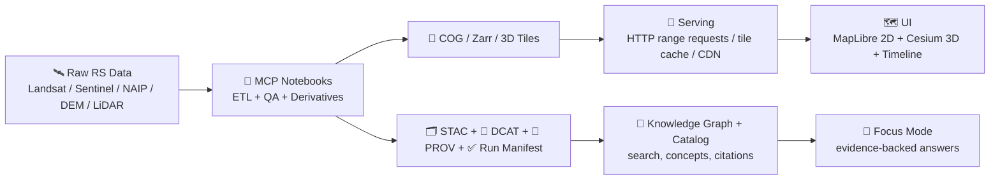

# 04 • Remote Sensing 🛰️🌾


Remote sensing is how **Kansas Frontier Matrix (KFM)** “sees” large-scale change over time: vegetation health, land-cover shifts, water movement, heat/drought signatures, terrain + hydrology, and (optionally) LiDAR-derived elevation/structure.  

This notebook set turns raw rasters into **web-ready, provenance-rich, evidence-backed** artifacts that plug directly into:
- 🗺️ **2D map layers** (MapLibre/Leaflet)
- 🌐 **3D terrain + globe layers** (CesiumJS)
- 🧠 **Focus Mode** (AI answers with citations + traceability)
- 📦 **Offline Packs** (field/classroom use)

---

## 🎯 What you will produce
By the end of this module you should have:

- 🧱 **COGs (Cloud-Optimized GeoTIFFs)** for large rasters (imagery, indices, DEMs)
- 🧩 **Tile-ready derivatives** (optionally cached XYZ tiles for high-traffic layers)
- 🗂️ **STAC Items/Collections** for discovery + interoperability
- 🧾 **DCAT + PROV** metadata bundles for governance + provenance
- 🧪 **Change detection / indices** products (e.g., NDVI time series, before/after diffs)
- 🧷 **UI-ready layer configs** (legend, attribution, time extent, visibility rules)
- ✅ A **run manifest** (reproducibility: inputs → transforms → outputs)

> [!IMPORTANT]
> Remote sensing outputs are “first-class evidence.” Every layer must ship with:
> **source**, **license**, **temporal coverage**, **spatial footprint**, and **provenance**.

---

## 🧭 Where this fits in the KFM pipeline


---

## ✅ Recommended run order
If you’re new to remote sensing in KFM, run in this order:

1. **Discovery** → find/select datasets (time + footprint + license)
2. **Acquisition** → download or export (optionally via Earth Engine)
3. **Standardization** → reproject/clip/resample; set nodata; build masks
4. **Optimization** → convert to COG + overviews; validate
5. **Derivatives** → indices (NDVI/NDWI/etc), mosaics, composites, change layers
6. **Catalog + provenance** → STAC/DCAT/PROV + run manifest
7. **UI packaging** → layer configs + legends + time controls
8. **Offline Pack** (optional) → PMTiles/MBTiles + bundled metadata

---

## 📓 Notebook index (suggested)
> Adjust names to match what exists in this folder; this is the intended structure.

| Notebook | Purpose | Primary Outputs |
|---|---|---|
| `00_context_and_scope.ipynb` | Define AOI, time span, target questions | AOI geometry, plan.md |
| `01_stac_discovery.ipynb` | Discover datasets & scenes via STAC | candidate_items.json |
| `02_acquire_imagery.ipynb` | Download/export imagery (COG preferred) | raw/ imagery |
| `03_preprocess_standardize.ipynb` | Clip/reproject/resample; QA masks | staged/ rasters |
| `04_build_cogs.ipynb` | Convert rasters → COG + overviews | cogs/ |
| `05_indices_time_series.ipynb` | NDVI/NDWI/etc; per-date stacks | indices/ |
| `06_change_detection.ipynb` | Differencing, thresholding, trends | change/ |
| `07_publish_catalog.ipynb` | Generate STAC/DCAT/PROV + manifests | catalog/ |
| `08_ui_layer_packaging.ipynb` | Legends/configs; time rules | ui_layers/ |
| `09_offline_pack_optional.ipynb` | PMTiles/MBTiles bundles | offline_packs/ |

---

## 🗃️ Output conventions
Use a predictable folder layout so other MCP modules and the platform can “just ingest it”:

```text
📦 mcp/notebooks/04_remote_sensing/
├─ 📄 README.md
├─ 📓 00_context_and_scope.ipynb
├─ 📓 01_stac_discovery.ipynb
├─ 📓 ...
├─ 📁 data/                         # raw + staged inputs (gitignored)
│  ├─ 📁 raw/
│  ├─ 📁 staged/
│  └─ 📁 scratch/
├─ 📁 outputs/                      # publishable artifacts
│  ├─ 🧱 cogs/
│  ├─ 🧮 indices/
│  ├─ 🔁 change/
│  ├─ 🗂️ stac/
│  ├─ 🧾 dcat/
│  ├─ 🧬 prov/
│  ├─ 🧷 ui_layers/
│  └─ 📦 offline_packs/
└─ 📁 reports/
   ├─ ✅ run_manifest.json
   ├─ 📊 qa_report.md
   └─ 🧾 citations.md
```

> [!TIP]
> Treat `outputs/` as “publishable,” and `data/` as “reproducible but not necessarily publishable.”

---

## 🧰 Tooling & stack (practical defaults)
### Python (analysis + ETL)
- `rasterio` / `rioxarray` / `xarray` / `dask`
- `stackstac` (STAC → xarray)
- `pystac` (+ validator)
- `geopandas` / `shapely`
- `rio-cogeo` or `gdal_translate` for COGs
- `pdal` (LiDAR) if needed

### System tools (often essential)
- **GDAL** (warp/translate/build overviews)
- Optional: **tippecanoe / pmtiles** tooling for packs

<details>
<summary><strong>🧪 Minimal reproducible environment checklist</strong></summary>

- [ ] Pin Python version + key geo libs
- [ ] Record GDAL version (geo stacks are sensitive)
- [ ] Save AOI geometry + CRS in repo
- [ ] Write every run’s inputs + outputs to `reports/run_manifest.json`

</details>

---

## 🛰️ Data sources we commonly target (Kansas-friendly)
Pick sources that match the question, scale, and time window:

- 🌍 **Landsat** (long time series; broad coverage)
- 🌿 **Sentinel‑2** (higher resolution, vegetation work)
- 🔥 **MODIS** (coarser, frequent revisit; trends)
- 🛩️ **NAIP** (high-res aerial; detail work)
- ⛰️ **DEMs** (terrain, hydrology, hillshade)
- 🧱 **LiDAR** (optional; detailed elevation/structure if available)

> [!NOTE]
> Some computations can be offloaded to **Google Earth Engine** (especially time-series composites and indices) and then exported as COGs.

---

## 🧱 COG rules (non-negotiable for web performance)
COGs enable **fast, partial reads** via HTTP range requests. That’s how KFM avoids downloading “gigabyte TIFFs” just to view one county.

**COG checklist**
- [ ] Correct CRS + consistent pixel size
- [ ] Internal tiling enabled
- [ ] Overview pyramid built
- [ ] NODATA defined
- [ ] Compression set (reasonable defaults)
- [ ] Validated (open + read windows)

---

## 🧾 Metadata contract (STAC • DCAT • PROV)
Remote sensing layers become truly “KFM-grade” once they’re:

- 🗂️ **Discoverable** (STAC Collection + Items)
- 🧾 **Governable** (DCAT dataset entry: license, publisher, distribution)
- 🧬 **Traceable** (PROV: what was done, with what inputs, by which run)

Minimum metadata fields you should always include:
- `title`, `description`, `license`, `provider/source`
- `bbox`, `geometry`, `datetime` (or start/end)
- `processing:software`, `processing:steps` (even as a summary)
- `sensitivity` and/or access constraints (if applicable)

---

## 🗺️ UI integration notes (MapLibre + Cesium)
### 2D (MapLibre / Leaflet)
- Raster overlays (COG-backed or tile-backed)
- Time slider should control visibility of temporal layers
- Legends + attribution must be visible (no “pretty colors without receipts”)

### 3D (Cesium)
- Terrain streaming (DEM-derived)
- Optional 3D Tiles (LiDAR → 3D Tiles)
- Great for “Kansas From Above” narratives (2D → 3D transitions)

---

## 📦 Offline Packs (field + classroom)
Remote sensing is huge—offline packs require **curation**:
- pre-rendered tiles (or local COGs for small AOIs)
- local metadata + stories
- “lite” UI that can browse + query without server

> [!CAUTION]
> Offline packs must still contain attribution + license + provenance metadata.

---

## 🤖 GeoAI hooks (optional but powerful)
This module can feed AI workflows:
- land-cover classification
- segmentation (roads/fields/water)
- anomaly detection (drought signatures, burn scars, flood extent)
- “concept attention” style filters (e.g., Drought, Agriculture, Fire)

Keep it evidence-backed:
- Always store training data provenance
- Keep model artifacts versioned + referenced in PROV/run manifest

---

## 🔐 Ethics, governance, and sensitivity
Remote sensing can accidentally expose sensitive things (sites, habitats, private details).  
Follow these rules:

- ✅ Respect licenses + constraints
- 🧭 Apply **FAIR + CARE** thinking (open ≠ unbounded)
- 🗺️ Generalize or coarsen sensitive locations if required
- 🧾 Carry provenance everywhere (UI, exports, screenshots)

---

## 🧪 MCP “research notebook” pattern
Every notebook should start with:
- **Objective** (what question are we answering?)
- **Hypothesis** (if applicable)
- **Method** (steps + parameters)
- **Results** (plots, maps, stats)
- **Evidence** (sources, citations, dataset IDs)
- **Next steps** (what’s missing / what to validate)

A simple “Definition of Done” for this module:
- [ ] COGs validated
- [ ] STAC items generated and linted
- [ ] DCAT + PROV included
- [ ] Layer config renders in UI
- [ ] Run manifest saved
- [ ] QA report written (cloud mask rules, nodata checks, visual sanity checks)

---

## 🧠 Future ideas backlog (remote sensing flavored) 💡
- 🌊 Watchers that auto-publish periodic drought/NDVI updates as STAC Items
- 🧯 Event-driven layers (fire/flood) feeding Story Nodes automatically
- 🧭 “Digital twin” style temporal simulation overlays
- 📱 AR field overlays backed by the same data services
- 🧩 Federated STAC catalogs across state/region “Frontier Matrix” instances

---

## 🔗 Project docs that anchor this module (read when extending)
- 📘 KFM Comprehensive Technical Documentation
- 🧱 KFM Architecture, Features, and Design
- 🧭🤖 KFM AI System Overview
- 🖥️ KFM Comprehensive UI System Overview
- 📚 KFM Data Intake – Technical & Design Guide
- 🌟 Latest Ideas & Future Proposals
- 💡 Innovative Concepts to Evolve KFM
- 🧠 Additional Project Ideas
- 🧰 Reference portfolios: AI Concepts, Maps/WebGL, Programming Resources, Data Management

---

## 🧯 Troubleshooting
**COG feels slow in-browser**
- Check overviews exist
- Check internal tiling + compression
- Ensure server supports range requests (if remote)

**Weird seams in mosaics**
- Confirm consistent CRS + resampling method
- Normalize nodata
- Validate masks (cloud/water)

**Time slider doesn’t match layers**
- Ensure every temporal raster has a clear `datetime` or start/end interval
- Align naming + metadata across outputs

---

## ✅ Next steps for contributors
- Add a new data source → create a notebook that outputs **COG + STAC + PROV**
- Add a new derived layer → include legend + classification notes
- Add a story-ready layer → include example camera states + time settings
- Keep everything reproducible → update `run_manifest.json` every run

Happy mapping. 🌾🛰️
