# 🧪 05_simulation — Scenario Modeling & Simulation Notebooks


> [!IMPORTANT]
> **In KFM, simulations are “publishable evidence artifacts,” not one-off plots.**  
> Your run is only *officially usable* by Graph/API/UI **after** it is **(1) reproducible**, **(2) provenance-linked**, **(3) policy-checked**, and **(4) promoted** from the sandbox into published storage.

---

## 🧭 Quick Links

- 🧰 **Simulation runbook:** `data/work/sims/README.md`  
- 🧬 **Evidence-first data lifecycle:** `docs/MASTER_GUIDE_v13.md`  
- 🗺️ **UI expectations (layers, provenance, scenario compare):** see “UI System Overview” docs  
- 🧠 **AI + notebooks + PR-first modeling:** see “AI System Overview” docs  

---

## 🎯 What lives in this folder

This folder is the **notebook workspace** for building and validating “what-if” models and simulations that can become **first-class KFM layers** (after review + promotion).

Typical notebook families:

- 🧩 **Scenario definition** (inputs, parameters, uncertainty model, seeds)
- ⚙️ **Simulation execution** (e.g., `kfm-sim-run` or domain-specific model runners)
- ✅ **Verification & validation** (sanity checks, regression tests, comparisons vs observed data)
- 🎲 **Uncertainty quantification** (ensembles, sensitivity analysis, stability checks)
- 📦 **Publishing** (dual-format artifacts + STAC/DCAT/PROV + PR automation hooks)
- 🗺️ **UI readiness** (tiles, styling hints, time extent, scenario labels, provenance summaries)

> [!NOTE]
> KFM’s philosophy is **“PR-first modeling”**: simulation results are treated like code contributions—**reviewable diffs**, **auditable provenance**, and **merge-gated** publishing. 🧾✅

---

## 🧱 Where simulations fit in the KFM pipeline

```mermaid
flowchart LR
  A[📥 Inputs\nSTAC/DCAT pinned datasets] --> B[🧪 Run in Sandbox\n data/work/sims/<model>/<run_id>/]
  B --> C[✅ V&V + UQ\nQA report + stability notes]
  C --> D[📦 Package Outputs\nanalysis + tiles + metadata]
  D --> E[🧾 Evidence Triplet\nSTAC + DCAT + PROV]
  E --> F[🔒 Policy Gates\nclassification/license/safety]
  F --> G[📌 Promote\n data/processed/...]
  G --> H[🕸 Graph Ingest\nNeo4j lineage + links]
  H --> I[🧠 API\nserved w/ governance]
  I --> J[🗺️ UI\nlayers + scenario compare]
```



---

## 📦 What you must produce

| Artifact 🧩 | Why it exists 🧠 | Typical location 📁 | Used by 🔗 |
|---|---|---|---|
| **Run Manifest** (`manifest.yaml/json`) | Captures scenario + parameters + seeds | `data/work/sims/.../<run_id>/` | Humans + CI |
| **Input Lock** (`inputs.lock.*`) | Pins dataset versions/hashes | `data/work/sims/.../<run_id>/` | Repro + PROV |
| **Env Lock** (`env.lock.*`) | Pins software/container versions | `data/work/sims/.../<run_id>/` | Repro + CI |
| **Outputs (analysis)** | Analytics-friendly results | `data/processed/...` | API/Graph/UI |
| **Outputs (viz)** | Map-friendly tiles (fast UI) | `data/processed/...` | UI |
| **QA Report** (`qa.md/html`) | V&V + UQ summary | `data/work/sims/.../<run_id>/qa/` | Reviewers |
| **STAC + DCAT + PROV** | Evidence-first publishing | `data/stac/`, `data/catalogs/`, `data/prov/` | Graph/API/UI |
| **Model Card** (`MODEL_CARD.md`) | Assumptions + limits | `data/work/sims/.../<run_id>/` (+ published copy) | Trust + governance |

> [!TIP]
> Use the **“dual-format packaging”** pattern:  
> ✅ **GeoParquet / Parquet / NetCDF** (analysis) + ✅ **PMTiles / COG / tiles** (visualization) — from the **same** deterministic pipeline. 📦🗺️

---

## 🚀 Golden Path workflow (recommended)

### 1) Pick a baseline + pin it 📌
- Select upstream datasets from KFM catalogs (STAC/DCAT IDs preferred).
- Create an **input lock** (hashes / IDs / timestamps).
- Assign a **classification** level (public vs restricted).

### 2) Define a scenario (as data, not prose) 🧾
Create a scenario config describing:
- Model name + version
- Parameter set
- Random seeds (or deterministic seed derivation)
- Time window + region
- Uncertainty model (single run vs ensemble)

### 3) Run in the sandbox 🧪
- Write outputs to: `data/work/sims/<model>/<run_id>/`
- Save:
  - logs
  - manifest
  - locks
  - raw outputs
  - QA artifacts
- Never point UI or downstream analysis to sandbox outputs.

### 4) Verify + validate ✅
Minimum expectations:
- smoke checks (shape, bounds, NaNs, CRS/time sanity)
- regression test(s) on known scenario(s)
- calibration/validation split documented (if applicable)

### 5) UQ + sensitivity 🎲
Minimum deliverables:
- parameter sensitivity for key knobs
- ensemble statistics (mean/variance or quantiles)
- “where it breaks” notes (instability regions)

### 6) Package + catalog 📦
Produce **publishable artifacts** + **evidence triplet**:
- analysis output (GeoParquet/Parquet/etc)
- map output (PMTiles/COG/etc)
- STAC Collection + Items
- DCAT dataset record
- PROV JSON-LD lineage

### 7) Gate + promote 🔒➡️📌
- Pass policy checks (license, attribution, sensitivity)
- Promote vetted outputs into `data/processed/`
- Open a PR containing:
  - processed outputs
  - catalogs (STAC/DCAT/PROV)
  - QA + model card summary

---

## 📁 Recommended folder layout

```text
🧪 data/
├─ 🧰 work/
│  └─ 🧪 sims/
│     └─ 🧠 <model_name>/
│        └─ 🏷️ <run_id>/
│           ├─ 🧾 manifest.yaml
│           ├─ 🔒 inputs.lock.json
│           ├─ 🧷 env.lock.txt
│           ├─ 🧠 MODEL_CARD.md
│           ├─ 📜 logs/
│           ├─ ✅ qa/
│           ├─ 🧬 prov/              # draft / run-local lineage
│           ├─ 🗺️ stac/              # draft / run-local STAC
│           └─ 📦 outputs/
│              ├─ 📊 analysis/       # parquet/netcdf/etc
│              └─ 🗺️ viz/            # pmtiles/cog/etc
└─ 📌 processed/
   └─ 🧠 sims/
      └─ <model_name>/
         └─ <dataset_version>/
            ├─ 📊 analysis/
            └─ 🗺️ viz/
```

> [!WARNING]
> **No “mystery data.”** If it’s not cataloged (STAC/DCAT) and lineage-traced (PROV), it’s not official KFM output.

---

## 🧾 Run manifest template (copy/paste)

```yaml
run_id: "2026-01-20__drought_bayes__v0.1.0__ks_statewide"
model:
  name: "drought_frequency_bayes"
  version: "0.1.0"
  repo_ref: "<git sha or tag>"
scenario:
  description: "Bayesian drought frequency projection under scenario set A"
  region: "Kansas"
  time_window:
    start: "1900-01-01"
    end: "2040-12-31"
inputs:
  - id: "<stac_item_or_dcat_id>"
    uri: "<path-or-url>"
    hash: "<sha256>"
parameters:
  seed: 1337
  draws: 2000
  burn_in: 500
  key_assumptions:
    - "Stationarity within regime windows"
uq:
  mode: "ensemble"
  ensemble_size: 50
  summary_stats: ["mean", "variance", "p10", "p50", "p90"]
outputs:
  analysis:
    format: "geoparquet"
  viz:
    format: "pmtiles"
governance:
  classification: "public"
  license: "<spdx id>"
  attribution: ["<source names>"]
promotion:
  target: "data/processed/sims/drought_frequency_bayes/<dataset_version>/"
```

---

## ✅ Verification, Validation & UQ expectations

> [!NOTE]
> The bar here is intentionally “scientific”: deterministic runs, traceable inputs, and documented assumptions. 🧑‍🔬🧾

### Minimum V&V checklist
- [ ] Deterministic seed strategy documented
- [ ] Inputs pinned (hashes + IDs)
- [ ] Environment pinned (container digest or lockfile)
- [ ] Regression test(s) for at least one known scenario
- [ ] Output sanity checks (CRS, time range, bounds, null rates)
- [ ] Validation vs observed data (when possible) with notes
- [ ] Model card includes limitations + misuse warnings

### Minimum UQ deliverables
- [ ] Sensitivity sweep of key parameters
- [ ] Ensemble summary (mean/variance or quantiles)
- [ ] Stability map/notes (where outputs become unreliable)
- [ ] Scenario labeling consistent with UI compare mode

---

## 🗺️ Making simulation results UI-ready

To show up cleanly in KFM’s UI (2D/3D/timeline/story mode):

- 🧭 **Time-aware:** include temporal extent + time-step semantics
- 🗂️ **Layer-ready:** provide symbology hints (or a style stub) + legend-friendly attributes
- 🧾 **Provenance-forward:** users should be able to inspect **source, license, and preparation summary**
- 🔀 **Scenario compare-friendly:** outputs should include a scenario ID and be compatible with layer toggles / split view
- 🧊 **Performance-aware:** prefer prebuilt tiles for large geometry layers

> [!TIP]
> If you’re generating a “projection” layer, label it clearly as such (e.g., `type: projection`, `confidence: p10/p50/p90`).  
> KFM’s UI aims to make “why this map looks this way” inspectable at any time. 🧾🔎

---

## 🔐 Governance & safety for simulations

> [!WARNING]
> **Model outputs can leak sensitive information** even when raw inputs are protected. Treat simulation results as **equal-or-higher sensitivity** than the inputs.

Practical rules:
- 🔒 Apply the same Policy Pack rules to simulation output PRs.
- 🧾 Always produce PROV lineage: outputs must link to **inputs + code + parameters + agent**.
- 🚫 Don’t bypass catalogs or API governance.
- 🕵️ Consider **query auditing / inference control** patterns for sensitive derived results (especially if outputs enable reverse inference).
- 🧹 Redact or generalize sensitive fields **before** promotion.

---

## 🧑‍💻 Notebook hygiene (MCP standards)

Keep notebooks clean, rerunnable, and reviewable:

- ✅ “Restart kernel & run all” should succeed
- 🧠 Avoid hidden state; write functions/modules when complexity grows
- 🧷 Record seeds, parameters, versions at the top
- 📓 Begin with a short purpose block; end with a summary + next steps
- 🧪 Prefer small, testable pieces; add regression checks when you can

---

## 🤖 Automation hooks (optional, but encouraged)

KFM supports the idea that simulations can be run by automation **but published only by review**:

- 👀 **Watcher** detects new input data or a new scenario request  
- 🧠 **Planner** produces a plan + manifest  
- ⚙️ **Executor** runs the model and opens a PR containing artifacts + catalogs  

> [!IMPORTANT]
> Automation may run simulations, but **must not auto-promote to official outputs without review**. PR-first remains the gate. ✅🔒

---

## 📚 Reference library (project docs)

These notebooks align with the project’s core design documents:

- 📘 **KFM Data Intake – Technical & Design Guide** (evidence-first publishing, simulation workflow, governance)
- 🧭 **KFM Comprehensive Architecture, Features, and Design** (simulation engines + `kfm-sim-run`)
- 🤖 **KFM AI System Overview** (domain models + notebook-driven, PR-first modeling)
- 🗺️ **KFM Comprehensive UI System Overview** (scenario visualization, timeline, 3D/AR direction)
- 🧰 **KFM Comprehensive Technical Documentation** (reproducible research integration, notebook launching ideas)
- 🌟 **Latest Ideas & Future Proposals** (dual-format packaging pattern for large datasets)
- 💡 **Innovative Concepts** + **Additional Project Ideas** (4D digital twin, immersive/AR futures, governance automation)
- 🗃️ **Data Management / Bayesian / Data Mining library** (uncertainty modeling + privacy considerations)
- 🌍 **Maps / WebGL / Virtual Worlds library** (geospatial rendering + immersive visualization)
- 🧑‍💻 **Programming Languages & Resources library** (numerical/simulation tooling references)

---

## ✅ “Ready to publish” checklist (PR gate)

Before you open a promotion PR:

- [ ] Run manifest present + complete
- [ ] Inputs pinned (hashes/IDs)
- [ ] Environment pinned (lockfile/container)
- [ ] Seeds recorded (deterministic run)
- [ ] QA report written (V&V + UQ summary)
- [ ] Model card includes assumptions + limits
- [ ] Dual-format outputs produced (analysis + viz)
- [ ] STAC Collection + Items created
- [ ] DCAT dataset record created
- [ ] PROV JSON-LD created and links inputs → activity → outputs
- [ ] Policy checks pass (license, attribution, sensitivity)
- [ ] No UI/analysis points directly to `data/work/sims/`

---

## 🤝 Contributing a new simulation notebook

1. 📄 Add notebook(s) with clear numbering: `01_define_scenario.ipynb`, `02_run_model.ipynb`, `03_uq.ipynb`, `04_package_publish.ipynb`
2. 🧾 Add/extend a manifest schema if your model needs new fields
3. ✅ Add at least one regression test path (tiny scenario is fine!)
4. 📦 Ensure outputs follow the publish checklist
5. 🔀 Open PR with a short reviewer guide + expected outputs

---

**Next folder in the notebook sequence:** keep moving 👉 (analysis → simulation → publish) 🚀
