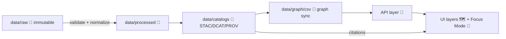

# 07 — Data Engineering 🧰🗺️


This notebook module is where **raw inputs become trusted KFM-ready datasets**: validated, reproducible, provenance-tracked, and publishable to the **Catalogs → Graph → API → UI/Focus Mode** pipeline. The goal is to make every dataset (and derived artifact) **auditable, re-runnable, and linkable**.

---

## 🔗 Quick Navigation

- [Canonical pipeline](#-canonical-pipeline-non-negotiable)
- [Directory layout](#-directory-layout)
- [Notebook index](#-notebook-index-suggested)
- [Outputs & artifacts](#-outputs--artifacts)
- [Metadata contracts](#-metadata-contracts-stac--dcat--prov)
- [Policy gates & QA](#-policy-gates--qa-fail-closed)
- [Packaging & distribution](#-packaging--distribution)
- [Exercises](#-exercises-stretch-goals)
- [Project files used](#-project-files-used)

---

## 🧭 Canonical pipeline (non-negotiable)

> [!IMPORTANT]
> **Pipeline ordering is absolute**: **raw → processed → catalogs → graph → API → UI/Focus Mode**.  
> Don’t skip layers; don’t hand-edit downstream artifacts to “fix” upstream issues. Fix upstream and re-run.  [oai_citation:0‡MARKDOWN_GUIDE_v13.md.gdoc](file-service://file-UYVruFXfueR8veHMUKeugU)



**Why this matters (KFM-specific):**
- The UI expects **time-aware layers, story nodes, and provenance** surfaced “behind the map.”  [oai_citation:1‡📚 Kansas Frontier Matrix (KFM) Data Intake – Technical & Design Guide.pdf](file-service://file-EbUCdsJMbu5KwpoKMrLrgj)
- The AI/Focus layer expects **evidence and citations** that point back to datasets, not “trust me” prose. (Catalogs + PROV are the backbone of those citations.)  [oai_citation:2‡MARKDOWN_GUIDE_v13.md.gdoc](file-service://file-UYVruFXfueR8veHMUKeugU)

---

## 🗂️ Directory layout

> [!NOTE]
> This is the *suggested* layout based on the project’s canonical data staging + catalog pattern.

```text
📁 mcp/notebooks/07_data_engineering/
├─ 📄 README.md
├─ 📓 01_sources_and_manifests.ipynb
├─ 📓 02_ingest_batch_watchers.ipynb
├─ 📓 03_validate_policy_gates.ipynb
├─ 📓 04_transform_geospatial.ipynb
├─ 📓 05_build_catalogs_stac_dcat_prov.ipynb
├─ 📓 06_load_postgis.ipynb
├─ 📓 07_sync_neo4j_graph.ipynb
├─ 📓 08_package_publish_oci.ipynb
└─ 📓 09_streaming_microbatch_pulse_threads.ipynb

📁 data/                           (repo-wide)
├─ 📁 raw/         🧾 immutable source drops
├─ 📁 work/        🧪 scratch space (rebuildable)
├─ 📁 processed/   🧼 canonical outputs (GeoParquet/COG/etc.)
├─ 📁 catalogs/    🧭 STAC/DCAT/PROV (JSON)
└─ 📁 graph/csv/   🧠 nodes/edges exports for Neo4j sync
```

The project’s **canonical staging directories** are explicitly called out as **`data/raw`, `data/work`, `data/processed`, `data/catalogs`, and `data/graph/csv`**.  [oai_citation:3‡MARKDOWN_GUIDE_v13.md.gdoc](file-service://file-UYVruFXfueR8veHMUKeugU)

---

## 🧪 Notebook index (suggested)

| Notebook | Goal 🎯 | Key outputs 🧾 |
|---|---|---|
| `01_sources_and_manifests.ipynb` | Define source(s), licensing, sensitivity, and retrieval plan | `source.json`, `checksums.sha256`, “receipt” records |
| `02_ingest_batch_watchers.ipynb` | Batch ingest via watcher patterns | raw drops + receipts + telemetry |
| `03_validate_policy_gates.ipynb` | Schema + policy validation (fail-closed) | validation reports, PR-ready checks |
| `04_transform_geospatial.ipynb` | Normalize CRS, geometry, time, and attributes | GeoParquet/COG/PMTiles-ready intermediates |
| `05_build_catalogs_stac_dcat_prov.ipynb` | Generate **STAC/DCAT/PROV** aligned records | `data/catalogs/{stac,dcat,prov}/...` |
| `06_load_postgis.ipynb` | Load processed datasets into PostGIS | tables, indexes, materialized views |
| `07_sync_neo4j_graph.ipynb` | Export nodes/edges and sync graph | `data/graph/csv/*` |
| `08_package_publish_oci.ipynb` | Package artifacts for distribution | OCI artifacts + signatures + refs |
| `09_streaming_microbatch_pulse_threads.ipynb` | Turn streams into “many small datasets over time” | micro-batch STAC Items + stub PROV |

---

## 📦 Outputs & artifacts

This module aims to produce **repeatable artifacts** that downstream layers can rely on:

### ✅ Required artifacts
- **Processed dataset** (canonical formats like GeoParquet / COG / etc.)
- **STAC** record(s): spatiotemporal catalog entries  
- **DCAT** record: dataset-level summary for discovery  
- **PROV** record(s): lineage of “what ran, on what, producing what”  

STAC/DCAT/PROV alignment is explicitly described as a core KFM requirement:  
- STAC = spatiotemporal catalog  
- DCAT = dataset summary (discovery/interoperability)  
- PROV = provenance/lineage (transform traceability)  [oai_citation:4‡📚 Kansas Frontier Matrix (KFM) Data Intake – Technical & Design Guide.pdf](file-service://file-EbUCdsJMbu5KwpoKMrLrgj)

### 🧾 Raw is evidence
> [!IMPORTANT]
> Treat `data/raw/` as **immutable evidence**: never overwrite; record checksums; derive outputs via code/config.  [oai_citation:5‡Comprehensive Markdown Guide_ Syntax, Extensions, and Best Practices.docx](file-service://file-J6rFRcp4ExCCeCdTevQjxz)

This aligns with the broader MCP reproducibility standard: “Never overwrite raw data,” keep transformations documented and under version control.  [oai_citation:6‡Scientific Method _ Research _ Master Coder Protocol Documentation.pdf](file-service://file-HTpax4QbDgguDwxwwyiS32)

---

## 🧾 Metadata contracts (STAC • DCAT • PROV)

> [!TIP]
> Keep contract files small, strict, and machine-checkable. Humans read summaries; CI reads schemas.

<details>
<summary><strong>📄 Minimal source manifest (source.json)</strong></summary>

```json
{
  "dataset_id": "kfm.example.dataset.v1",
  "source": {
    "type": "http",
    "url": "TBD",
    "retrieved_at": "2026-01-20T00:00:00Z",
    "license": "TBD",
    "attribution": "TBD"
  },
  "sensitivity": {
    "classification": "public",
    "notes": "TBD"
  }
}
```

</details>

<details>
<summary><strong>🧭 Minimal STAC Item (stac/item.json)</strong></summary>

```json
{
  "type": "Feature",
  "stac_version": "1.0.0",
  "id": "kfm.example.item.0001",
  "properties": {
    "datetime": "1865-01-01T00:00:00Z"
  },
  "geometry": null,
  "assets": {
    "data": {
      "href": "data/processed/example.geoparquet",
      "type": "application/x-parquet"
    }
  }
}
```

</details>

<details>
<summary><strong>🗃️ Minimal DCAT Dataset (dcat/dataset.json)</strong></summary>

```json
{
  "@type": "dcat:Dataset",
  "dct:title": "Example Dataset",
  "dct:description": "TBD",
  "dct:license": "TBD",
  "dcat:distribution": [
    {
      "@type": "dcat:Distribution",
      "dcat:downloadURL": "TBD",
      "dcat:mediaType": "application/x-parquet"
    }
  ]
}
```

</details>

<details>
<summary><strong>🧬 Minimal PROV (prov/run.json)</strong></summary>

```json
{
  "activity": {
    "id": "prov:run_2026_01_20_0001",
    "type": "kfm:etl_run",
    "used": ["raw:source_file_0001"],
    "generated": ["processed:example_geoparquet_0001"],
    "agent": "kfm:ingest_pipeline"
  }
}
```

</details>

---

## 🧠 PostGIS + Neo4j integration

KFM’s data intake pattern pairs:
- **PostGIS** for spatial + analytical queries, and
- **Neo4j** for semantic/contextual linking (story nodes, entities, relationships)

The data intake guide explicitly describes this “dual engine” behavior: Neo4j helps interpret and locate relevant data; PostGIS performs the spatial query/aggregation.  [oai_citation:7‡📚 Kansas Frontier Matrix (KFM) Data Intake – Technical & Design Guide.pdf](file-service://file-EbUCdsJMbu5KwpoKMrLrgj)

> [!NOTE]
> Keep DB loads *derived from processed outputs*, not ad-hoc edits. DB state should be reproducible from `data/processed/` + catalogs + migrations.

---

## 🗺️ Geospatial engineering conventions

### CRS & geometry normalization
- Prefer consistent CRS for storage and indexing (e.g., standard lat/lon + projected where needed).
- Preserve original CRS info in metadata where applicable.

### Storage strategy
Large files belong in **file/object storage**, referenced via metadata, not jammed into DB fields. The technical documentation calls out file storage for large assets like rasters, documents, imagery, and models.  [oai_citation:8‡Kansas Frontier Matrix (KFM) – Comprehensive Technical Documentation.pdf](file-service://file-AkqwUuYPp5zePf7pv5SMxi)

### Integrity primitives
The same technical documentation emphasizes:
- checksums (SHA256) for integrity
- versioned folders / Git-LFS-like patterns for large artifacts  
 [oai_citation:9‡Kansas Frontier Matrix (KFM) – Comprehensive Technical Documentation.pdf](file-service://file-AkqwUuYPp5zePf7pv5SMxi)

---

## ✅ Policy gates & QA (fail closed)

> [!IMPORTANT]
> KFM is designed with **automatic policy gates** (schema validation, provenance checks, privacy/sensitivity checks) and a **fail-closed** posture.  [oai_citation:10‡Kansas Frontier Matrix (KFM) – Comprehensive Technical Documentation.pdf](file-service://file-AkqwUuYPp5zePf7pv5SMxi)

### Recommended gates for this module
The v13 guide proposes CI checks such as:
- front-matter checks + required fields
- link validation
- JSON schema validation
- graph integrity tests
- API contract tests (OpenAPI)
- security scans + license scans  
 [oai_citation:11‡MARKDOWN_GUIDE_v13.md.gdoc](file-service://file-UYVruFXfueR8veHMUKeugU)

> [!TIP]
> Treat these as “data unit tests.” If a dataset fails: **block promotion** past its layer (don’t patch downstream).

---

## 📦 Packaging & distribution

### OCI artifacts for data (GeoParquet, PMTiles, COGs)
A proposed KFM distribution approach is to store data artifacts in an OCI registry via **ORAS**, signed with **Cosign**, and referenced by digest.  [oai_citation:12‡Additional Project Ideas.pdf](file-service://file-Pc2GNivcrHBeKjBQksLC3T)

Example (placeholder):
```bash
oras push <registry>/<org>/kfm-data:dataset-v1 \
  data/processed/example.geoparquet:application/x-parquet \
  data/tiles/example.pmtiles:application/octet-stream
cosign sign <registry>/<org>/kfm-data:dataset-v1
```

### Dataset releases include “evidence manifests”
KFM proposes that each dataset release include an **evidence manifest** summarizing sources, transformations, validation checks, and (optionally) AI-generated summaries.  [oai_citation:13‡Additional Project Ideas.pdf](file-service://file-Pc2GNivcrHBeKjBQksLC3T)

---

## 📡 Streaming → micro-batching (“Pulse Threads”)

> [!NOTE]
> In KFM’s framing, streaming isn’t “special”; it becomes **many small datasets over time** that still receive catalogs and provenance.  [oai_citation:14‡📚 Kansas Frontier Matrix (KFM) Data Intake – Technical & Design Guide.pdf](file-service://file-EbUCdsJMbu5KwpoKMrLrgj)

A concrete future proposal is a **GTFS-RT watcher → micro-batch → STAC Items + stub PROV** flow.  [oai_citation:15‡🌟 Kansas Frontier Matrix – Latest Ideas & Future Proposals.docx.pdf](file-service://file-SQ3f7ve8SGiusT6ThZEuCe)

Pulse Threads are described as:
- append-only NDJSON events
- modular “thread processors”
- optional anomaly detection and summaries  
 [oai_citation:16‡Additional Project Ideas.pdf](file-service://file-Pc2GNivcrHBeKjBQksLC3T)

---

## 🧑‍🔬 MCP notebook conventions (Scientific Method + reproducibility)

Because this is under `mcp/notebooks/`, notebooks should behave like **electronic lab notebooks**:
- start with the question/problem statement, background, and hypothesis
- document methods before execution
- log parameters + environment details
- finish with results + conclusion + next steps  
 [oai_citation:17‡Scientific Method _ Research _ Master Coder Protocol Documentation.pdf](file-service://file-HTpax4QbDgguDwxwwyiS32)

### Notebook hygiene rules 🧼
- Run cells top-to-bottom; avoid hidden state.
- Capture deterministic seeds when relevant.
- Prefer notebooks that can be exported to scripts for automation.  [oai_citation:18‡Scientific Method _ Research _ Master Coder Protocol Documentation.pdf](file-service://file-HTpax4QbDgguDwxwwyiS32)

### Environment reproducibility 🧊
Document environment setup (requirements / env files / Docker) and keep those docs versioned.  [oai_citation:19‡Scientific Method _ Research _ Master Coder Protocol Documentation.pdf](file-service://file-HTpax4QbDgguDwxwwyiS32)

---

## 🧩 Exercises (stretch goals)

> [!TIP]
> These connect data engineering outputs to KFM’s unique UI/AI capabilities.

1. **Build a “dataset PR → PROV sync” hook**  
   Parse PR metadata and emit PROV entities/activities so governance is auditable.  [oai_citation:20‡🌟 Kansas Frontier Matrix – Latest Ideas & Future Proposals.docx.pdf](file-service://file-SQ3f7ve8SGiusT6ThZEuCe)

2. **GeoParquet + PMTiles “offline pack”**  
   Package an offline-ready dataset bundle; ensure STAC/DCAT accompany the artifacts.  [oai_citation:21‡🌟 Kansas Frontier Matrix – Latest Ideas & Future Proposals.docx.pdf](file-service://file-SQ3f7ve8SGiusT6ThZEuCe)

3. **Graph health checks**  
   Implement integrity checks (dangling relationships, missing node types, etc.) before graph promotion.  [oai_citation:22‡Additional Project Ideas.pdf](file-service://file-Pc2GNivcrHBeKjBQksLC3T)

4. **Sensitive-site governance**  
   Implement cultural protocol rules (sensitivity flags, controlled access, redaction) as policy-as-code.  [oai_citation:23‡Innovative Concepts to Evolve the Kansas Frontier Matrix (KFM).pdf](file-service://file-G71zNoWKxsoSW44iwZaaCC)

5. **Digital Twin “time slider” dataset**  
   Create a spatiotemporal simulation dataset that can drive time-stepped UI exploration.  [oai_citation:24‡Innovative Concepts to Evolve the Kansas Frontier Matrix (KFM).pdf](file-service://file-G71zNoWKxsoSW44iwZaaCC)

6. **Crowdsourced verification workflow**  
   Prototype a microtask + consensus pipeline for validation of features/attributes.  [oai_citation:25‡Innovative Concepts to Evolve the Kansas Frontier Matrix (KFM).pdf](file-service://file-G71zNoWKxsoSW44iwZaaCC)

---

## 📚 Project files used

> [!NOTE]
> This README is intentionally grounded in the project’s uploaded design docs + reference portfolios.

### Core KFM design docs 🧭
- **KFM Comprehensive Technical Documentation** (storage, standards, semantics)  [oai_citation:26‡Kansas Frontier Matrix (KFM) – Comprehensive Technical Documentation.pdf](file-service://file-AkqwUuYPp5zePf7pv5SMxi)  
- **KFM Comprehensive Architecture, Features, and Design** (policy gates, system architecture)  [oai_citation:27‡Kansas Frontier Matrix (KFM) – Comprehensive Architecture, Features, and Design.pdf](file-service://file-4Umt1yHoGKicdmLWzFJ9sC)  
- **KFM AI System Overview 🧭🤖** (AI + notebook workflows + evidence)  [oai_citation:28‡Kansas Frontier Matrix (KFM) – AI System Overview 🧭🤖.pdf](file-service://file-Pv8eev6RWvCKrGCXyzY7zg)  
- **KFM Comprehensive UI System Overview** (timeline, layers, story nodes, provenance surfacing)  [oai_citation:29‡Kansas Frontier Matrix – Comprehensive UI System Overview.pdf](file-service://file-KcBQruYcoFVDEixzzRHTwt)  [oai_citation:30‡Kansas Frontier Matrix – Comprehensive UI System Overview.pdf](file-service://file-KcBQruYcoFVDEixzzRHTwt)  
- **KFM Data Intake – Technical & Design Guide 📚** (ingestion pipeline, STAC/DCAT/PROV, PostGIS+Neo4j)  [oai_citation:31‡📚 Kansas Frontier Matrix (KFM) Data Intake – Technical & Design Guide.pdf](file-service://file-EbUCdsJMbu5KwpoKMrLrgj)  [oai_citation:32‡📚 Kansas Frontier Matrix (KFM) Data Intake – Technical & Design Guide.pdf](file-service://file-EbUCdsJMbu5KwpoKMrLrgj)  
- **Latest Ideas & Future Proposals 🌟** (GTFS-RT watcher, PR→PROV, offline packs)  [oai_citation:33‡🌟 Kansas Frontier Matrix – Latest Ideas & Future Proposals.docx.pdf](file-service://file-SQ3f7ve8SGiusT6ThZEuCe)  
- **Innovative Concepts to Evolve KFM** (digital twins, cultural protocols, crowdsourcing, GeoXAI)  [oai_citation:34‡Innovative Concepts to Evolve the Kansas Frontier Matrix (KFM).pdf](file-service://file-G71zNoWKxsoSW44iwZaaCC)  [oai_citation:35‡Innovative Concepts to Evolve the Kansas Frontier Matrix (KFM).pdf](file-service://file-G71zNoWKxsoSW44iwZaaCC)  
- **Additional Project Ideas** (OCI artifacts via ORAS/Cosign, evidence manifests, graph health checks, Pulse Threads)  [oai_citation:36‡Additional Project Ideas.pdf](file-service://file-Pc2GNivcrHBeKjBQksLC3T)  
- **Document Refinement Request** (concept deepening / narrative + provenance patterns)  [oai_citation:37‡Additional Project Ideas.pdf](file-service://file-Pc2GNivcrHBeKjBQksLC3T)  

### MCP / standards docs ✅
- **Scientific Method / Research / Master Coder Protocol** (notebook-as-lab-notebook, reproducibility, CI)  [oai_citation:38‡Scientific Method _ Research _ Master Coder Protocol Documentation.pdf](file-service://file-HTpax4QbDgguDwxwwyiS32)  
- **MARKDOWN_GUIDE_v13** (contract-first pipeline, CI gates, invariants)  [oai_citation:39‡MARKDOWN_GUIDE_v13.md.gdoc](file-service://file-UYVruFXfueR8veHMUKeugU)  
- **KFM Design Audit – Gaps & Enhancements** (MCP alignment checklist)  [oai_citation:40‡Kansas-Frontier-Matrix Design Audit – Gaps and Enhancement Opportunities.pdf](file-service://file-TkRzAfTnxCYDUHauCf1NcH)  

### Reference portfolios (embedded libraries) 📦
> These are PDF portfolios of many books/resources used as supporting material:
- **AI Concepts & more**  [oai_citation:41‡Scientific Method _ Research _ Master Coder Protocol Documentation.pdf](file-service://file-HTpax4QbDgguDwxwwyiS32)  
- **Maps / GoogleMaps / VirtualWorlds / Geospatial WebGL**  [oai_citation:42‡Maps-GoogleMaps-VirtualWorlds-Archaeological-Computer Graphics-Geospatial-webgl.pdf](file-service://file-RshcX5sNY2wpiNjRfoP6z6)  
- **Various programming languages & resources**  [oai_citation:43‡Scientific Method _ Research _ Master Coder Protocol Documentation.pdf](file-service://file-HTpax4QbDgguDwxwwyiS32)  
- **Data Management / Architectures / Bayesian / Programming Ideas**  [oai_citation:44‡Kansas Frontier Matrix – Comprehensive UI System Overview.pdf](file-service://file-KcBQruYcoFVDEixzzRHTwt)  

---

## ✅ Definition of Done (DoD) — dataset promotion checklist

- [ ] **Raw** ingested with receipt + checksum; never overwritten  [oai_citation:45‡Comprehensive Markdown Guide_ Syntax, Extensions, and Best Practices.docx](file-service://file-J6rFRcp4ExCCeCdTevQjxz)
- [ ] **Processed** outputs generated by code/config (re-runnable)
- [ ] **Catalogs** created: STAC + DCAT + PROV aligned  [oai_citation:46‡📚 Kansas Frontier Matrix (KFM) Data Intake – Technical & Design Guide.pdf](file-service://file-EbUCdsJMbu5KwpoKMrLrgj)
- [ ] **Policy gates** pass (schema, links, integrity, security scans)  [oai_citation:47‡MARKDOWN_GUIDE_v13.md.gdoc](file-service://file-UYVruFXfueR8veHMUKeugU)
- [ ] **Graph sync** exports produced (nodes/edges) with integrity checks
- [ ] **DB load** is reproducible from processed artifacts (no manual drift)
- [ ] **Release** includes evidence manifest (sources + transforms + validations)  [oai_citation:48‡Additional Project Ideas.pdf](file-service://file-Pc2GNivcrHBeKjBQksLC3T)
- [ ] Notebook includes question → method → results → conclusion (MCP style)  [oai_citation:49‡Scientific Method _ Research _ Master Coder Protocol Documentation.pdf](file-service://file-HTpax4QbDgguDwxwwyiS32)

---

💡 If you add a new dataset domain, follow the same layer-by-layer contract so KFM’s UI + AI can reliably cite and explain it. (That’s the “map behind the map” promise.)  [oai_citation:50‡📚 Kansas Frontier Matrix (KFM) Data Intake – Technical & Design Guide.pdf](file-service://file-EbUCdsJMbu5KwpoKMrLrgj)
