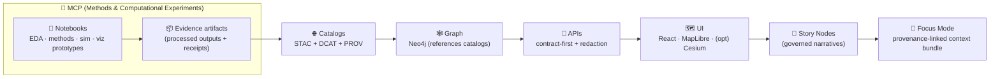
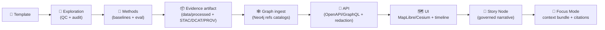

# 📓 MCP Notebooks (Kansas‑Matrix‑System / KFM) 🧪🗺️


> 🧭 **What lives here:** reproducible notebooks that explore data, validate assumptions, prototype methods, and **produce evidence artifacts** that can graduate into governed datasets + catalogs (STAC/DCAT/PROV) + graph + APIs + UI + Story/Focus.
>
> 🧠 **Mental model:** notebooks are *research instruments* + *design receipts* — not a dumping ground.
>
> 🧱 **KFM invariant:** **no narrative or UI feature leapfrogs evidence**. Everything flows through the canonical pipeline.

---

## 🧭 Table of Contents
- [🧠 How notebooks fit the KFM pipeline](#-how-notebooks-fit-the-kfm-pipeline)
- [🗺️ Folder map (with intent)](#️-folder-map-with-intent)
- [🚀 Quickstart (local + reproducible)](#-quickstart-local--reproducible)
- [🧱 Notebook contract](#-notebook-contract)
- [📦 Outputs & artifacts](#-outputs--artifacts)
- [🔁 Lifecycle: Notebook → Evidence → Graph/API → UI → Story/Focus](#-lifecycle-notebook--evidence--graphapi--ui--storyfocus)
- [📂 Folder guide](#-folder-guide)
- [✅ Lightweight QA gates (high ROI)](#-lightweight-qa-gates-high-roi)
- [🧾 Evidence artifact pack (when promoting results)](#-evidence-artifact-pack-when-promoting-results)
- [📚 Reference-to-folder map (project library)](#-reference-to-folder-map-project-library)
- [✅ PR checklist (for notebook contributions)](#-pr-checklist-for-notebook-contributions)
- [✨ North star](#-north-star)

---

## 🧠 How notebooks fit the KFM pipeline

> [!IMPORTANT]
> **Pipeline ordering is absolute (non‑negotiable):**  
> **ETL → STAC/DCAT/PROV catalogs → Neo4j graph → APIs → UI → Story Nodes → Focus Mode**

Notebooks live primarily in the **ETL / Evidence** stage (MCP = “Methods & Computational Experiments”), and they should either:
- stay as **exploration receipts**, or
- **graduate** into pipelines + catalog artifacts + governed UI exposure.



**Two rules to tattoo on your brain 🧠🪡**
1. 🧾 **Evidence-first:** if it’s a claim, it must be traceable to a **cataloged source** (or it doesn’t ship).
2. 🚧 **API boundary:** the UI doesn’t talk directly to the graph or raw stores — it goes through governed APIs.

---

## 🗺️ Folder map (with intent)

```text
mcp/notebooks/
├─ 📌 00_templates/                 # starting points (clean, reusable)
├─ 🔎 01_exploration/               # EDA + QC + audit notebooks
├─ 🧪 02_methods/                   # algorithms + baselines + eval harnesses
├─ 🗺️ 03_geospatial/                # vector/raster/STAC experiments
├─ 🛰️ 04_remote_sensing/            # EO workflows + export recipes
├─ 🧯 05_simulation/                # modeling/simulation + V&V harnesses
├─ 🌐 06_viz_web/                   # WebGL / UI / interaction prototypes
├─ 🧱 07_data_engineering/          # Postgres/PostGIS, ETL spikes, scaling tests
├─ 🛡️ 08_security_defensive/        # defensive security reviews (authorized only)
├─ ⚖️ 09_governance_ethics/         # FAIR/CARE, sovereignty, impact notes
└─ README.md                        # 👈 you are here
```

> [!TIP]
> **Where “published” stuff belongs:**  
> - Data outputs → `data/work/<domain>/…` and `data/processed/<domain>/…`  
> - Catalog artifacts → `data/stac/…`, `data/catalog/dcat/…`, `data/prov/…`  
> - Story Nodes → `docs/reports/story_nodes/…` (draft → published workflow)

---

## 🚀 Quickstart (local + reproducible)

### 1) Open notebooks
- VS Code + Jupyter extension *or* JupyterLab.

### 2) Environment (pick one; pin it) 🧪
- `venv` / `conda` / `uv` are all fine — **prefer one per branch of work**.
- Keep geo stacks pinned (GDAL/PROJ/rasterio/pyproj can drift).
- If you’re building notebooks that should be “one‑click runnable” later (Binder/JupyterHub), keep deps minimal + explicit.

### 3) Data access (no mystery paths) 🗃️
- Prefer governed sources:
  - **STAC** (assets),
  - **PostGIS/PostgreSQL** (features + vector tiles),
  - **Parquet/COG/PMTiles** (cloud‑friendly artifacts),
  - curated exports (e.g., EO exports).
- Notebooks should **not** hide “mystery local paths.”
  - ✅ Use relative repo paths (`../../data/...`)
  - ✅ Or env vars (`KFM_DATA_ROOT`, `DATABASE_URL`)
  - ❌ Avoid `/Users/alice/Desktop/...`

---

## 🧱 Notebook contract

### ✅ Must‑haves (non‑negotiable)
- **Clear title + scope** (first cell): what question are we answering?
- **Inputs + provenance**:
  - dataset IDs (example IDs below),
  - STAC Item/Collection IDs or file references,
  - query snippets (SQL/CQL),
  - source URL references (if raw ingestion).
- **Parameters cell** (tag `parameters` if using papermill).
- **Determinism**:
  - fixed RNG seeds where relevant (`numpy.random.default_rng(seed)`),
  - stable sorting before joins/aggregations,
  - log environment + package versions if outcomes depend on it.
- **Outputs**:
  - write to predictable locations (see [Outputs & artifacts](#-outputs--artifacts)).
- **Conclusion block**:
  - what we learned,
  - what failed,
  - what to do next,
  - **promote or archive** decision.

### 🧾 KFM‑specific contract (don’t break the pipeline)
- **Raw data is immutable**:
  - treat `data/raw/…` as read‑only evidence (no in‑place edits).
- **If you publish a dataset (or AI output), you must mint receipts**:
  - STAC + DCAT + PROV (the “evidence triplet”).
- **Classification & sovereignty propagate**:
  - no derivative artifact can be less restricted than its inputs.
- **UI access goes through APIs**:
  - prototypes can mock locally, but promotion requires API contracts.

---

## 🧾 Dataset IDs & naming (recommended)

> [!NOTE]
> Use stable dataset IDs early — they become the glue across catalogs, graph, APIs, UI, and Focus Mode.

Examples seen in KFM docs:
- `kfm.ks.landcover.2000_2020.v1`
- `kfm.ks.drought_index.1900_2020.v1`

**Guideline (practical):**
- `kfm.<region>.<theme>.<dataset>.<time_or_variant>.v<integer>`

---

## 📦 Outputs & artifacts

### Tier 1: notebook-local artifacts (OK to commit small) 📎
Use this when you’re still exploring, comparing methods, or prototyping UI visuals.

```text
mcp/notebooks/<folder>/<topic>/
├─ notebook.ipynb
├─ outputs/
│  ├─ figures/
│  ├─ tables/
│  ├─ logs/
│  └─ receipts/         # run manifest + hashes (lightweight)
└─ notes.md             # optional: decisions, caveats, TODOs
```

**Rule of thumb:** commit small artifacts that explain decisions; keep heavy rasters/tiles out of git unless the repo is explicitly using LFS/DVC.

### Tier 2: governed evidence artifacts (publishable) 🧱✅
If results are meant to feed **graph/API/UI/Story/Focus**, put them in canonical places:

```text
data/
├─ <domain>/
│  ├─ raw/              # immutable inputs
│  ├─ work/             # intermediate outputs
│  └─ processed/        # final, served outputs
├─ stac/
│  ├─ collections/
│  └─ items/
├─ catalog/
│  └─ dcat/
└─ prov/                # provenance bundles (per dataset/run)
```

---

## 🔁 Lifecycle: Notebook → Evidence → Graph/API → UI → Story/Focus



**Promotion signals (graduate a notebook):**
- ✅ repeatable runs (fresh kernel, top‑to‑bottom),
- ✅ deterministic outputs (or differences explained),
- ✅ inputs/outputs governed + traceable,
- ✅ STAC/DCAT/PROV produced (if publishable),
- ✅ performance understood (time/memory/IO),
- ✅ falsification plan (what would disprove this?),
- ✅ integration path exists (pipeline/module/API/UI).

---

## 📂 Folder guide

<details>
<summary><b>📌 00_templates/ — starting points (clean, reusable)</b></summary>

**Use for:** canonical notebook scaffolds (copy → run → replace).  
**Includes (recommended):**
- 🔎 EDA/QC template (missingness, distributions, spatial sanity checks)
- 🧪 Method baseline template (train/validate/report + ablation slots)
- 🗺️ Geo template (CRS checks, reprojection, bbox/geometry, tiling)
- 🧯 Simulation template (assumptions, calibration, V&V hooks)
- 🧾 Evidence artifact template (writes STAC/DCAT/PROV stubs + run manifest)

**Tip:** if a notebook is copied more than twice, it becomes a template. 😄

</details>

<details>
<summary><b>🔎 01_exploration/ — EDA + QC + audit notebooks</b></summary>

**Use for:** first contact with a dataset (or validating a new ingestion).  
**Typical outputs:** QC report, plots, summary tables, anomaly lists, data dictionary notes.

**Good fits:**
- Distribution checks, missingness heatmaps, outlier catalogs
- Spatial QC: CRS consistency, geometry validity, coverage gaps
- Temporal QC: cadence, timezones, duplicates, suspicious discontinuities
- Catalog QA: “does the STAC/DCAT/PROV reflect what we actually produced?”

</details>

<details>
<summary><b>🧪 02_methods/ — algorithms + baselines + eval harnesses</b></summary>

**Use for:** modeling experiments that need to be benchmarked and compared.  
**Typical outputs:** baseline metrics, calibration curves, error analysis, robustness checks.

**Examples:**
- Regression baselines (OLS/Ridge/Lasso, robust regression)
- Bayesian baselines (priors → posteriors → decision framing)
- NLP/Extraction baselines (e.g., entity extraction from historical text)
- Focus Mode evaluation notebooks (retrieval quality + citation integrity)

</details>

<details>
<summary><b>🗺️ 03_geospatial/ — vector/raster/STAC experiments</b></summary>

**Use for:** geospatial transformations, raster math, vector ops, STAC packaging.  
**Typical outputs:** GeoParquet/GeoJSON prototypes, COG/PMTiles prototypes, STAC Items/Collections drafts.

**Validate these behaviors:**
- CRS correctness (store it; don’t assume it)
- Bounding boxes & geometries consistent across transforms
- Raster metadata (shape/transform) preserved + documented
- Outputs are “tile‑ready”:
  - COG/tiles/PMTiles for rasters,
  - optimized parquet + indexes for vectors

**PostGIS sanity patterns 🧰**
- Geometry validity checks (`ST_IsValid`, `ST_IsValidDetail`)
- Spatial joins and attribution tests
- Index impact (GiST/SP‑GiST) on query latency

</details>

<details>
<summary><b>🛰️ 04_remote_sensing/ — EO workflows + export recipes</b></summary>

**Use for:** EO workflows, sensor comparisons, export patterns, QA masks.  
**Typical outputs:** export recipes, band math notebooks, validation plots, STAC-ready assets.

**Keep it disciplined:**
- Log dataset IDs + date ranges + masking logic
- Track scale/CRS for every export
- Write “what changed” notes when switching sensors/products

</details>

<details>
<summary><b>🧯 05_simulation/ — modeling/simulation + V&amp;V harnesses</b></summary>

**Use for:** simulation spikes + verification/validation scaffolding.  
**Typical outputs:** parameter sweeps, sensitivity analysis, calibration runs, validation reports.

**Practical V&amp;V mindset:**
- State assumptions clearly (units, boundaries, invariants)
- Compare against known solutions / invariants when possible
- Treat “model works” as a testable claim, not a vibe 😄

**When simulations become evidence artifacts:** package them like datasets (catalog + provenance + uncertainty).

</details>

<details>
<summary><b>🌐 06_viz_web/ — WebGL / UI / interaction prototypes</b></summary>

**Use for:** interactive prototypes (WebGL, 2D↔3D, timeline UX, Story Node playback).  
**Typical outputs:** proof‑of‑concept demos, interaction notes, performance profiles.

**Common patterns:**
- MapLibre 2D + optional Cesium 3D transitions (camera paths)
- Layer toggles, time sliders, narrative annotations
- Provenance overlays (“map beyond the map” — what am I looking at and why?)
- Offline/field prototypes (data packs, reduced basemaps, low‑bandwidth modes)
- AR concept experiments (museum / field overlays)

</details>

<details>
<summary><b>🧱 07_data_engineering/ — Postgres/PostGIS, ETL spikes, scaling tests</b></summary>

**Use for:** schema experiments, ETL prototypes, indexing benchmarks, catalog generation.  
**Typical outputs:** SQL notebooks, migration drafts, indexing benchmarks, query recipes.

**Focus areas:**
- PostGIS geometry types + indexes (GiST/SP‑GiST)
- Vector tile strategies (e.g., generating MVT from PostGIS)
- Parquet partitioning + predicate pushdown
- Managed data promotion (raw → work → processed)
- Hardware-aware scaling: identify what breaks first (IO, memory, compute)

</details>

<details>
<summary><b>🛡️ 08_security_defensive/ — defensive security reviews (authorized only)</b></summary>

**Use for:** threat modeling, hardening checklists, dependency audits, logging/monitoring design.

> [!WARNING]
> 🧷 **Strict boundary: defensive-only.**  
> No exploit development, no payloads, no “how to break in.”  
> Any testing beyond local toy targets requires **explicit written authorization**.

Useful notebook themes:
- secrets scanning results & remediation notes
- SBOM / dependency risk snapshots
- policy gate evaluations (OPA/Rego) for new artifacts
- query auditing patterns (privacy + inference controls)

</details>

<details>
<summary><b>⚖️ 09_governance_ethics/ — FAIR/CARE, sovereignty, impact notes</b></summary>

**Use for:** governance docs, ethical risk assessments, policy-aware design notes.  
**Typical outputs:** model cards, data use memos, provenance policies, impact analyses.

**Good fits:**
- “What should we not build?” 🚫
- Consent/provenance constraints & cultural protocols
- Bias & accountability notes for models and map outputs
- Human-centered framing for narrative UX
- Privacy-preserving releases (aggregation, k‑anonymity, differential privacy where appropriate)

</details>

---

## ✅ Lightweight QA gates (high ROI)

These checks keep notebooks from becoming brittle pipelines:

- **Metadata completeness:** capture CRS / bbox / geometry for geo outputs
- **Evidence triplet readiness:** if publishable → STAC + DCAT + PROV produced
- **Link integrity:** STAC/DCAT references resolvable; no dead anchors
- **Schema drift protection:** validate against JSON Schemas / profiles when available
- **Determinism:** stable seeds + stable ordering + logged versions
- **Policy gates (fail-closed):** classification propagation, sovereignty constraints
- **Secrets safety:** no tokens, no private endpoints, no “oops” credentials

---

## 🧾 Evidence artifact pack (when promoting results)

When a notebook result is meant to become a **first-class KFM evidence artifact**, produce:

### 1) The data product 📦
- stored under `data/processed/<domain>/...` (or canonical storage),
- referenced by STAC/DCAT distributions.

### 2) The evidence triplet 🌐
- **STAC** (Collection + Item(s)) → describes assets
- **DCAT** (Dataset entry) → discoverability
- **PROV** (lineage bundle) → inputs, steps, agents, params, hashes

### 3) A run manifest (MCP receipt) 🧾
A tiny JSON file that makes reproduction realistic:

```json
{
  "run_id": "2026-01-19__landcover_qc__<gitsha>",
  "notebook": "mcp/notebooks/01_exploration/landcover_qc/notebook.ipynb",
  "dataset_ids": ["kfm.ks.landcover.2000_2020.v1"],
  "inputs": [
    {"type": "stac_item", "id": "…"},
    {"type": "file", "path": "data/raw/…", "sha256": "…"}
  ],
  "outputs": [
    {"type": "data", "path": "data/processed/…", "sha256": "…"},
    {"type": "stac_item", "path": "data/stac/items/…"},
    {"type": "dcat", "path": "data/catalog/dcat/…"},
    {"type": "prov", "path": "data/prov/…"}
  ],
  "params": {"seed": 42, "notes": "…"}
}
```

> [!TIP]
> If it can’t be explained + reproduced from the manifest and receipts, it’s not ready to ship.

---

## 📚 Reference-to-folder map (project library)

> 🧠 This repo includes a curated project library. Use it to shape notebook design, governance, and promotion readiness.

| Project file 📚 | Primary notebook home 🧭 | What to borrow 🧩 |
|---|---|---|
| **📚 KFM Data Intake – Technical & Design Guide** | 🧱 07_data_engineering / 🔎 01_exploration | Raw immutability, managed promotion (raw→work→processed), ingestion gates, evidence triplet expectations |
| **KFM – Comprehensive Architecture, Features, and Design** | 🧱 07_data_engineering / 🌐 06_viz_web | Canonical subsystem boundaries, metadata-as-code, CI validation mindset |
| **KFM – Comprehensive Technical Documentation** | 📌 00_templates / 🧱 07_data_engineering / 🌐 06_viz_web | Pipeline determinism, catalog QA tooling, UI behavior patterns, performance notes |
| **KFM – Comprehensive UI System Overview** | 🌐 06_viz_web / 🗺️ 03_geospatial | Layer registry thinking, timeline UX, Story Node playback, provenance overlays, offline/mobile direction |
| **KFM – AI System Overview 🧭🤖** | 🧪 02_methods / ⚖️ 09_governance_ethics | Focus Mode grounding + citations, retrieval evaluation, guardrails, model cards + explainability expectations, one‑click notebook vision |
| **Innovative Concepts to Evolve KFM** | 🌐 06_viz_web / 🧯 05_simulation / ⚖️ 09_governance_ethics | 4D digital twin concepts, AR storytelling, participatory archive patterns, cultural protocol enforcement, GeoXAI ideas |
| **🌟 Latest Ideas & Future Proposals** | 🌐 06_viz_web / 🛰️ 04_remote_sensing | AR + live sensor concepts, provenance overlay UX, future interaction patterns |
| **Open‑Source Geospatial Historical Mapping Hub Design** | 📌 00_templates / 🧪 02_methods | MCP experiment tracking patterns, DVC/LFS ideas, model cards placement (`mcp/model_cards/`) |
| **Scientific Method / Master Coder Protocol Documentation** | 📌 00_templates | Reproducible coding practices, experiment tracking, notebook → script conversion patterns |
| **Design Audit – Gaps and Enhancement Opportunities** | 🔎 01_exploration / 🌐 06_viz_web | Backlog seeds for missing data sources, storytelling gaps, and MCP integration improvements |
| **Data Mining Concepts & Applications** | 🛡️ 08_security_defensive / ⚖️ 09_governance_ethics | Privacy concepts (query auditing, differential privacy), safe release patterns for sensitive outputs |
| **Python Geospatial Analysis Cookbook (PostGIS patterns)** | 🗺️ 03_geospatial / 🧱 07_data_engineering | Practical PostGIS QA recipes, geometry validity, spatial joins, performance hygiene |
| **AI Concepts & more (PDF portfolio)** | 🧪 02_methods / ⚖️ 09_governance_ethics | General AI/ML reference stack; use for baselines + eval ideas (treat as reference, not authority) |
| **Maps/GoogleMaps/Virtual Worlds/Geospatial WebGL (PDF portfolio)** | 🌐 06_viz_web / 🗺️ 03_geospatial | 3D/virtual world patterns, cartographic + WebGL reference stack |
| **Data Management / Architectures / Bayesian Methods (PDF portfolio)** | 🧱 07_data_engineering / 🧪 02_methods | Data architecture patterns, Bayesian thinking, governance + scaling reference stack |
| **Various programming languages & resources (PDF portfolio)** | 📌 00_templates | “Grab bag” language notes for quick context (Python/R/JS/etc.) |

---

## ✅ PR checklist (for notebook contributions)

- [ ] Notebook runs top-to-bottom in a clean kernel ♻️
- [ ] Inputs + provenance stated (dataset IDs, STAC IDs, queries, sources) 🧾
- [ ] Outputs written predictably (`outputs/` for local; `data/work|processed` for publishable) 📦
- [ ] Deterministic seeds set (if stochastic) 🎲
- [ ] Key plots/tables saved (not only inline) 🖼️
- [ ] “Conclusion + next step” section added ✅
- [ ] If geospatial: CRS + bbox + geometry validated and recorded 🗺️
- [ ] If publishable: STAC + DCAT + PROV created/updated 🌐
- [ ] If sensitive: classification/sovereignty constraints respected (no leakage) 🛡️
- [ ] If security-related: defensive-only, authorization assumptions explicit 🔒

---

## ✨ North star

**Notebooks should make the project more coherent, not more complicated.**  
If a notebook can’t be explained in 3 sentences, split it. 😄
