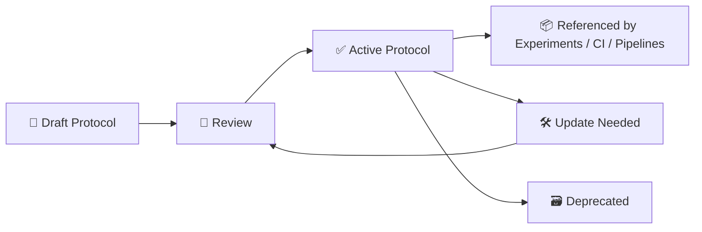

# 🧩 MCP Protocols

   

Welcome to `mcp/protocols/` — the **single source of truth** for how we do repeatable work in this repo.  
Protocols are how we keep Kansas-Matrix-System **documentation-first**, **scientific**, **reproducible**, and **modular**.  [oai_citation:0‡Scientific Method _ Research _ Master Coder Protocol Documentation.pdf](file-service://file-HTpax4QbDgguDwxwwyiS32) [oai_citation:1‡Scientific Method _ Research _ Master Coder Protocol Documentation.pdf](file-service://file-HTpax4QbDgguDwxwwyiS32)

---

## 🎯 What “protocols” mean here

A **protocol** is a *repeatable, version-controlled contract* for:
- 🔬 **Research & experiments** (scientific method + templates + IDs)
- 🧪 **Data handling & provenance** (lineage, catalogs, “no undocumented data”)
- 🤖 **Agent + tool interaction contracts** (safe tool calls, trace logs)
- ✅ **Validation + QA** (CI gates, checklists, reproducibility requirements)
- 📚 **Documentation structure** (modular docs, glossary, model cards)

This aligns with the project goal of being *more than code + data*: a **living knowledge base** with traceable experiments, artifacts, and decisions.  [oai_citation:2‡Kansas-Frontier-Matrix_ Open-Source Geospatial Historical Mapping Hub Design.pdf](file-service://file-BJN3xmP44EHc9NRCccCn4H)

---

## 🧭 Why this folder exists

KFM/KMS design emphasizes:
- A dedicated `mcp/` area + documentation that makes the repo a “living knowledge base” (not just a code dump).  [oai_citation:3‡Kansas-Frontier-Matrix_ Open-Source Geospatial Historical Mapping Hub Design.pdf](file-service://file-BJN3xmP44EHc9NRCccCn4H)
- Standard templates for experiment reports so results are transparent and repeatable.  [oai_citation:4‡Kansas-Frontier-Matrix_ Open-Source Geospatial Historical Mapping Hub Design.pdf](file-service://file-BJN3xmP44EHc9NRCccCn4H)
- Provenance-first + policy-governed behavior where actions are transparent and content is traceable.  [oai_citation:5‡Kansas Frontier Matrix (KFM) – Comprehensive Technical Blueprint.pdf](sediment://file_000000006dbc71f89a5094ce310a452d)
- CI/validation gates that reject changes missing required metadata / provenance artifacts.  [oai_citation:6‡MARKDOWN_GUIDE_v13.md.gdoc](file-service://file-UYVruFXfueR8veHMUKeugU)

**Protocols are how we operationalize all of that.**

---

## 🗂️ Suggested layout inside `mcp/protocols/`

> This is the *intended* organization for protocol docs as the library grows. Add folders as needed, but keep naming consistent.

```text
📁 mcp/
  📁 protocols/
    📄 README.md   👈 you are here
    📁 templates/
      📄 protocol.template.md
      📄 experiment_report.template.md
      📄 model_card.template.md
      📄 sop.template.md
      📄 tool_contract.template.md
    📁 research/
      📄 EXP-001_....md
    📁 data/
      📄 DATA-001_provenance_logging.md
      📄 DATA-002_catalog_generation.md
    📁 ai/
      📄 AI-001_model_cards.md
      📄 AI-002_experiment_logging.md
    📁 agent/
      📄 TOOL-001_tool_calling_contract.md
      📄 TOOL-002_reasoning_trace_format.md
    📁 quality/
      📄 QA-001_ci_gates.md
      📄 QA-002_reproducibility_checklist.md
```

---

## 🧾 Protocol naming & IDs

Use **stable IDs** so protocols can be referenced from:
- experiment reports
- model cards
- CI checks
- PR templates
- provenance logs

**Recommended prefixes**
- `EXP-###` → experiment protocol (design-before-run)
- `SOP-###` → standard operating procedure (repeatable workflow)
- `DATA-###` → data lifecycle + provenance + catalogs
- `TOOL-###` → agent tooling / tool-call contracts
- `QA-###` → testing, CI gates, review checklists
- `AI-###` → model documentation / ML lifecycle rules

The MCP documentation explicitly recommends **labeling protocols** (e.g., `EXP-001`, `EXP-002`) and storing them centrally for easy reference.  [oai_citation:7‡Scientific Method _ Research _ Master Coder Protocol Documentation.pdf](file-service://file-HTpax4QbDgguDwxwwyiS32)

---

## 🧪 Protocol minimum template

Every protocol file should include **at least** the MCP-recommended fields:

- **Objective**
- **Materials / Inputs**
- **Procedure**
- **Expected Outcome**
- **Variables** (manipulated/observed/controlled)

This template is directly called out as part of standardized experiment protocol practice.  [oai_citation:8‡Scientific Method _ Research _ Master Coder Protocol Documentation.pdf](file-service://file-HTpax4QbDgguDwxwwyiS32)

### ✅ Suggested front matter (recommended)

```yaml
---
id: EXP-001
title: "Place-name extraction benchmark protocol"
status: draft        # draft | active | deprecated
owner: "@your-handle"
created: 2026-01-30
updated: 2026-01-30
scope:
  - ai
  - data
  - nlp
related:
  - QA-002
  - DATA-001
artifacts:
  - experiments/EXP-001_.../
---
```

### 📄 Template body

```markdown
## Objective
## Materials / Inputs
## Procedure
## Expected Outcome
## Variables
## Validation / Acceptance Criteria
## Risks / Ethics Notes
## References / Citations
```

---

## 🔬 Research & experiment protocols

MCP’s scientific workflow requires:
- Define the question/problem
- Background research + citations
- Hypothesis
- Methods written *in advance* (this is the protocol)
- Data collection + labeling plan
- Analysis plan
- Results + traceability (experiment ID / timestamps)
- Conclusion + next steps  [oai_citation:9‡Scientific Method _ Research _ Master Coder Protocol Documentation.pdf](file-service://file-HTpax4QbDgguDwxwwyiS32)

KFM design also recommends **experiment report templates** with sections like:
**Goals, Data Used, Method, Results, Interpretation**, and keeping these reports version-controlled over time.  [oai_citation:10‡Kansas-Frontier-Matrix_ Open-Source Geospatial Historical Mapping Hub Design.pdf](file-service://file-BJN3xmP44EHc9NRCccCn4H)

---

## 🧬 Data & provenance protocols

### Core principle: provenance-first
KFM explicitly frames the platform as **provenance-first** and **policy-governed**, ensuring AI actions are transparent and content remains traceable.  [oai_citation:11‡Kansas Frontier Matrix (KFM) – Comprehensive Technical Blueprint.pdf](sediment://file_000000006dbc71f89a5094ce310a452d)

### Provenance logs
KFM’s blueprint describes a `data/provenance/` area containing structured provenance documents (e.g., W3C PROV-style logs) that capture:
- **Entities** (inputs/outputs, checksums, source URLs)
- **Activity** (pipeline script + timestamp + env info)
- **Agents** (software + person)  [oai_citation:12‡Kansas Frontier Matrix (KFM) – Comprehensive Technical Blueprint.pdf](sediment://file_000000006dbc71f89a5094ce310a452d)

It also explicitly treats missing provenance as a red flag.  [oai_citation:13‡Kansas Frontier Matrix (KFM) – Comprehensive Technical Blueprint.pdf](sediment://file_000000006dbc71f89a5094ce310a452d)

### “No data enters without documentation”
The blueprint proposes strict enforcement where contributions failing to produce required documentation (metadata + provenance) can be rejected by CI, reinforcing that datasets must be accompanied by documentation.  [oai_citation:14‡Kansas Frontier Matrix (KFM) – Comprehensive Technical Blueprint.pdf](sediment://file_000000006dbc71f89a5094ce310a452d)

### CI gates for data additions
KFM documentation states that contributions must pass automated checks and that missing provenance (or other invariants) fails the build.  [oai_citation:15‡MARKDOWN_GUIDE_v13.md.gdoc](file-service://file-UYVruFXfueR8veHMUKeugU)

---

## 🤖 Agent + tool-call protocols

KFM’s agentic architecture includes:
- a backend that exposes **safe tool APIs** (e.g., `tool_search_docs(query)`, `tool_query_data(dataset, filter)`, `tool_map(location_query)`)
- the agent outputs a tool command
- backend intercepts, executes, returns results to the model
- multi-hop continues until the model finalizes an answer  [oai_citation:16‡Kansas Frontier Matrix (KFM) – Comprehensive Technical Blueprint.pdf](sediment://file_000000006dbc71f89a5094ce310a452d)

It also calls for **structured reasoning traces** so users can see step-by-step what was done.  [oai_citation:17‡Kansas Frontier Matrix (KFM) – Comprehensive Technical Blueprint.pdf](sediment://file_000000006dbc71f89a5094ce310a452d)

### Suggested tool command contract (example)
> The blueprint describes the concept; this is a practical standard for implementation docs.

```json
{
  "tool": "tool_search_docs",
  "args": { "query": "population decline Kansas 1930s Dust Bowl" },
  "trace_id": "TRACE-2026-01-30-0007"
}
```

### Suggested reasoning trace record (example)

```yaml
trace_id: TRACE-2026-01-30-0007
steps:
  - step: 1
    action: tool_search_docs
    input: "population decline Kansas 1930s Dust Bowl"
    output_ref: "search-results://..."
  - step: 2
    action: tool_query_data
    input:
      dataset: "population_by_town"
      filter: { "years": [1930, 1940], "state": "KS" }
    output_ref: "dataset-slice://..."
```

---

## ✅ Quality, review, and reproducibility protocols

### Reproducibility checklist (required mindset)
MCP recommends a pre-completion checklist that includes:
- parameters/configs documented
- code committed + commit hash referenced
- random seeds recorded
- dependencies & versions captured
- results independently verified
- documentation peer-checked  [oai_citation:18‡Scientific Method _ Research _ Master Coder Protocol Documentation.pdf](file-service://file-HTpax4QbDgguDwxwwyiS32)

### Data handling requirements
MCP calls for:
- never overwriting raw data
- data dictionaries for datasets
- transformations documented (ideally via version-controlled code)
- external datasets referenced with version/date/checksums where possible  [oai_citation:19‡Scientific Method _ Research _ Master Coder Protocol Documentation.pdf](file-service://file-HTpax4QbDgguDwxwwyiS32)

### Environment capture
MCP encourages reproducible environments using:
- `requirements.txt` / `environment.yml`
- Docker/containerization
- capturing “pip freeze”-style dependency snapshots
- versioning environment docs and noting which experiments/modules are affected by changes  [oai_citation:20‡Scientific Method _ Research _ Master Coder Protocol Documentation.pdf](file-service://file-HTpax4QbDgguDwxwwyiS32)

### Testing + CI
MCP also emphasizes:
- automated tests (unit/integration/e2e as appropriate)
- CI pipelines that must be green before merge  [oai_citation:21‡Scientific Method _ Research _ Master Coder Protocol Documentation.pdf](file-service://file-HTpax4QbDgguDwxwwyiS32)

---

## 📚 Documentation structure protocols

The design audit calls out MCP alignment gaps and recommends:
- **modular documentation** (per component/domain)
- a living **glossary** (geo/cartographic/historical terms) to support interdisciplinary collaboration  [oai_citation:22‡Kansas-Frontier-Matrix Design Audit – Gaps and Enhancement Opportunities.pdf](file-service://file-TkRzAfTnxCYDUHauCf1NcH)

It also stresses that AI features must ship with:
- **model cards**
- **experiment logs**
- templates ensuring hypothesis/data/results/uncertainty are recorded to avoid “black box” analytics  [oai_citation:23‡Kansas-Frontier-Matrix Design Audit – Gaps and Enhancement Opportunities.pdf](file-service://file-TkRzAfTnxCYDUHauCf1NcH)

---

## 🔁 Protocol lifecycle



### Living docs rule
When procedures or code change, docs should be updated *in the same commit/session when possible*, keeping documentation continuously aligned with reality.  [oai_citation:24‡Scientific Method _ Research _ Master Coder Protocol Documentation.pdf](file-service://file-HTpax4QbDgguDwxwwyiS32)

---

## 🧰 How to add a new protocol (fast path)

1. 📌 Pick the right prefix (`EXP-`, `DATA-`, `TOOL-`, `QA-`, `SOP-`, `AI-`)
2. 🧱 Copy a template from `mcp/protocols/templates/`
3. 🧾 Fill required fields (Objective/Materials/Procedure/Expected Outcome/Variables)  [oai_citation:25‡Scientific Method _ Research _ Master Coder Protocol Documentation.pdf](file-service://file-HTpax4QbDgguDwxwwyiS32)
4. 🔗 Link it from:
   - relevant experiments / reports
   - CI / checklists (if applicable)
5. ✅ If it changes behavior, add/update validation rules (CI gates) as appropriate  [oai_citation:26‡MARKDOWN_GUIDE_v13.md.gdoc](file-service://file-UYVruFXfueR8veHMUKeugU)

---

## 🔎 Sources used to build this folder’s standards

- **Scientific Method / Research / Master Coder Protocol Documentation**  [oai_citation:27‡Scientific Method _ Research _ Master Coder Protocol Documentation.pdf](file-service://file-HTpax4QbDgguDwxwwyiS32)  
  (documentation-first + modularity + protocol template fields + reproducibility + CI/testing)  [oai_citation:28‡Scientific Method _ Research _ Master Coder Protocol Documentation.pdf](file-service://file-HTpax4QbDgguDwxwwyiS32) [oai_citation:29‡Scientific Method _ Research _ Master Coder Protocol Documentation.pdf](file-service://file-HTpax4QbDgguDwxwwyiS32) [oai_citation:30‡Scientific Method _ Research _ Master Coder Protocol Documentation.pdf](file-service://file-HTpax4QbDgguDwxwwyiS32)

- **Kansas Frontier Matrix (KFM) – Comprehensive Technical Blueprint**  [oai_citation:31‡Kansas Frontier Matrix (KFM) – Comprehensive Technical Blueprint.pdf](sediment://file_000000006dbc71f89a5094ce310a452d)  
  (agent tools, safe APIs, provenance-first policy governance, provenance logs structure, CI-enforced documentation)  [oai_citation:32‡Kansas Frontier Matrix (KFM) – Comprehensive Technical Blueprint.pdf](sediment://file_000000006dbc71f89a5094ce310a452d) [oai_citation:33‡Kansas Frontier Matrix (KFM) – Comprehensive Technical Blueprint.pdf](sediment://file_000000006dbc71f89a5094ce310a452d) [oai_citation:34‡Kansas Frontier Matrix (KFM) – Comprehensive Technical Blueprint.pdf](sediment://file_000000006dbc71f89a5094ce310a452d) [oai_citation:35‡Kansas Frontier Matrix (KFM) – Comprehensive Technical Blueprint.pdf](sediment://file_000000006dbc71f89a5094ce310a452d)

- **Kansas-Frontier-Matrix — Open-Source Geospatial Historical Mapping Hub Design**  [oai_citation:36‡Kansas-Frontier-Matrix_ Open-Source Geospatial Historical Mapping Hub Design.pdf](file-service://file-BJN3xmP44EHc9NRCccCn4H)  
  (mcp/ as living knowledge base; experiment report templates)  [oai_citation:37‡Kansas-Frontier-Matrix_ Open-Source Geospatial Historical Mapping Hub Design.pdf](file-service://file-BJN3xmP44EHc9NRCccCn4H) [oai_citation:38‡Kansas-Frontier-Matrix_ Open-Source Geospatial Historical Mapping Hub Design.pdf](file-service://file-BJN3xmP44EHc9NRCccCn4H)

- **Kansas-Frontier-Matrix Design Audit – Gaps and Enhancement Opportunities**  [oai_citation:39‡Kansas-Frontier-Matrix Design Audit – Gaps and Enhancement Opportunities.pdf](file-service://file-TkRzAfTnxCYDUHauCf1NcH)  
  (modular docs + glossary; model cards + experiment logs; QA/ethics/testing emphasis)  [oai_citation:40‡Kansas-Frontier-Matrix Design Audit – Gaps and Enhancement Opportunities.pdf](file-service://file-TkRzAfTnxCYDUHauCf1NcH)

- **MARKDOWN_GUIDE_v13.md.gdoc**  [oai_citation:41‡MARKDOWN_GUIDE_v13.md.gdoc](file-service://file-UYVruFXfueR8veHMUKeugU)  
  (CI validation gates; missing provenance fails build)  [oai_citation:42‡MARKDOWN_GUIDE_v13.md.gdoc](file-service://file-UYVruFXfueR8veHMUKeugU)