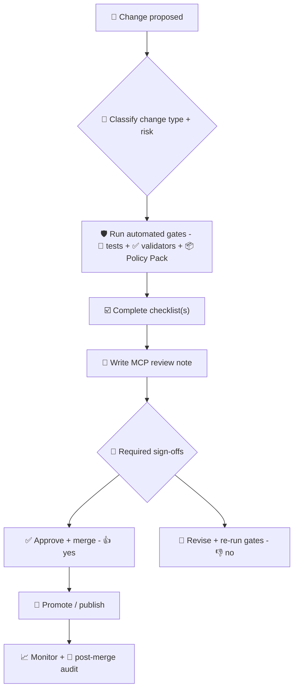

# 🧪🔍 MCP Reviews (Master Coder Protocol) — KFM


> **Purpose:** This directory is the “human layer” of KFM governance: 📌 review notes, ✅ checklists, 🧾 decision records, and 🧪 validation evidence that complement automated policy gates.

KFM explicitly uses **MCP** to mean **Master Coder Protocol** (not a tool/protocol acronym collision) and expects shared vocabulary and repeatable processes. :contentReference[oaicite:0]{index=0}

---

## 🧭 Quick Navigation

- [Why MCP Reviews exist](#-why-mcp-reviews-exist)
- [Golden rules](#-golden-rules)
- [Recommended folder layout](#-recommended-folder-layout)
- [Review workflow](#-review-workflow)
- [Change-type checklists](#-change-type-checklists)
- [Review note template](#-review-note-template)
- [Reference shelf](#-reference-shelf)

---

## 🏛️ Why MCP Reviews exist

KFM is designed as a **provenance-first “living atlas”** where data, narratives, and AI answers are expected to remain traceable to sources (and to the pipeline steps that produced them). :contentReference[oaicite:1]{index=1}:contentReference[oaicite:2]{index=2}

To keep trust high, KFM combines:
- **Automated gates** (tests, validators, policy pack checks), and
- **Human oversight** (formal review artifacts and sign-offs)

…so “nothing gets merged without oversight” in practice. :contentReference[oaicite:3]{index=3}

---

## 🧱 Golden rules

> [!IMPORTANT]
> **All publishable outputs must have the Evidence Triplet**: **STAC** item(s) + **DCAT** dataset record + **W3C PROV** lineage. :contentReference[oaicite:4]{index=4}

> [!IMPORTANT]
> **No bypassing catalogs/graph/UI:** Data must flow through approved pipeline stages and governance gates (raw → work → processed → catalogs → graph → APIs → UI). :contentReference[oaicite:5]{index=5}:contentReference[oaicite:6]{index=6}

> [!IMPORTANT]
> **Focus Mode is evidence-backed:** It must cite sources; if evidence can’t be retrieved, it should refuse. :contentReference[oaicite:7]{index=7}

> [!IMPORTANT]
> **Policy Pack is non-negotiable:** OPA + Conftest checks run in CI/CD (detect → validate → promote). :contentReference[oaicite:8]{index=8}

> [!NOTE]
> The **DevOps provenance chain matters**: you should be able to answer “Which PR produced this dataset?” and “Who reviewed it?” from PROV metadata. :contentReference[oaicite:9]{index=9}

---

## 📁 Recommended folder layout

This repo’s architecture recommends a documentation-heavy **mcp/** directory (experiments, SOPs, glossary, model cards, etc.). :contentReference[oaicite:10]{index=10}

Inside that, `mcp/reviews/` is the home for review artifacts:

```text
mcp/ 🧠
  reviews/ 🔍
    README.md 🧾
    review-notes/ 🗒️          # REV-YYYYMMDD-<slug>.md
    decisions/ 🧭             # ADR-YYYYMMDD-<slug>.md (decision records)
    checklists/ ✅            # Optional: split by change type
    red-team/ 🧨              # Prompt-injection / privacy / abuse-case reviews
    evidence/ 📎              # Links / manifests for validation artifacts
    metrics/ 📈               # Review metrics (e.g., Focus Mode citation coverage)
```

> If your repo already has a different structure, keep this README’s **intent** and map the paths accordingly.

---

## 🔁 Review workflow

KFM’s automation patterns often follow a “Watcher → Planner → Executor → PR” flow so changes become reviewable pull requests rather than direct writes. :contentReference[oaicite:11]{index=11}



---

## ✅ Change-type checklists

> [!TIP]
> Keep checklists **short in PR description** and **detailed in a review note**. GitHub-flavored Markdown checklists are encouraged. :contentReference[oaicite:12]{index=12}

### 1) 📦 Data Intake / New Dataset / New Layer

Core pipeline expectations include **deterministic, config-driven ETL** and strict layer separation (raw vs processed). :contentReference[oaicite:13]{index=13}

**Checklist**
- [ ] **Data contract exists** (schema + constraints + expectations) and validation passes (“contract-first”). :contentReference[oaicite:14]{index=14}
- [ ] **Raw inputs are immutable**; transformations are reproducible and written to processed outputs (no destructive edits). :contentReference[oaicite:15]{index=15}
- [ ] **Evidence Triplet complete** (STAC + DCAT + PROV). :contentReference[oaicite:16]{index=16}
- [ ] **License + sensitivity classification** present (policy will block missing metadata). :contentReference[oaicite:17]{index=17}
- [ ] **CRS / alignment sanity checks** completed (CI should catch common projection/misalignment issues). :contentReference[oaicite:18]{index=18}
- [ ] **Catalog integration** is correct (no UI/graph usage without being cataloged and governed). :contentReference[oaicite:19]{index=19}

---

### 2) 🔄 Real-time Streams / Sensors

KFM’s real-time approach emphasizes append-only ingestion, metadata completeness, and access controls before exposure. :contentReference[oaicite:20]{index=20}

**Checklist**
- [ ] Stream is **append-only** with windowing/chunking strategy documented. :contentReference[oaicite:21]{index=21}
- [ ] **Stub provenance** exists immediately; full provenance gets enriched as processing continues. :contentReference[oaicite:22]{index=22}
- [ ] **Classification is enforced at query time** (e.g., sensitive stations omitted). :contentReference[oaicite:23]{index=23}
- [ ] Stream becomes visible only after **catalog + policy gates** (no “direct to UI”). :contentReference[oaicite:24]{index=24}

---

### 3) 🧪 Simulation / Modeling / Predictive Outputs

KFM treats simulations as **sandbox-first**, with explicit validation and promotion steps. :contentReference[oaicite:25]{index=25}

**Checklist**
- [ ] Output is initially stored in a **sandbox**; promotion requires explicit checklist completion. :contentReference[oaicite:26]{index=26}
- [ ] **Assumptions + uncertainty** are surfaced in UI/metadata (avoid over-claiming). :contentReference[oaicite:27]{index=27}
- [ ] **Experiment protocol + peer review outcomes** are recorded (MCP scientific method loop). :contentReference[oaicite:28]{index=28}

---

### 4) 🧠 AI / Focus Mode / RAG / Agents

KFM’s AI design is explicitly evidence-driven and includes policy enforcement and an immutable governance log. :contentReference[oaicite:29]{index=29}

**Checklist**
- [ ] Retrieval is grounded in approved sources (hybrid retrieval + graph traversal where applicable). :contentReference[oaicite:30]{index=30}
- [ ] Focus Mode responses include citations or refuse when evidence is missing. :contentReference[oaicite:31]{index=31}
- [ ] Policy Pack rules are updated safely (OPA + Conftest), with tests and example failures. :contentReference[oaicite:32]{index=32}
- [ ] Governance ledger entries / audit logging remain intact (don’t weaken traceability). :contentReference[oaicite:33]{index=33}
- [ ] Human oversight remains (FAIR+CARE council / reviewers) for sensitive domains. :contentReference[oaicite:34]{index=34}
- [ ] **Telemetry** is considered: citation coverage, drift metrics, refusal-rate changes, etc. :contentReference[oaicite:35]{index=35}

> [!NOTE]
> If you introduce or update a model, capture a **model card** (purpose, training data, limitations) as part of the MCP structure. :contentReference[oaicite:36]{index=36}

---

### 5) 🗺️ UI / Maps / Story Nodes / Offline Packs / AR

KFM UI is a storytelling + analysis interface (not just a viewer), with provenance surfaced as a first-class feature. :contentReference[oaicite:37]{index=37}

**Checklist**
- [ ] UI continues to expose the “map behind the map” (sources + provenance visible). :contentReference[oaicite:38]{index=38}
- [ ] Map stack assumptions are respected (MapLibre 2D + Cesium 3D integration). :contentReference[oaicite:39]{index=39}
- [ ] Story Nodes stay simple and reviewable (Markdown narratives + JSON config). :contentReference[oaicite:40]{index=40}
- [ ] Non-coders can still contribute narrative safely (review ensures quality/traceability). :contentReference[oaicite:41]{index=41}
- [ ] Exports/visualizations preserve credits/sources (don’t strip provenance). :contentReference[oaicite:42]{index=42}
- [ ] If AR is involved: data filtering + performance are validated (geojson tiles, LOD, caching). :contentReference[oaicite:43]{index=43}

---

### 6) 🔐 Security / Privacy / Cultural Protocols

KFM explicitly anticipates sensitive historical / cultural / ecological locations and supports controlled disclosure. :contentReference[oaicite:44]{index=44}

**Checklist**
- [ ] Sensitivity tagging is present; access levels behave as expected. :contentReference[oaicite:45]{index=45}
- [ ] Consider **geo-obfuscation** or generalized disclosure patterns for sensitive sites. :contentReference[oaicite:46]{index=46}
- [ ] If Indigenous/community knowledge is involved: follow cultural protocols (e.g., Mukurtu-style access controls / TK Labels-like signaling). :contentReference[oaicite:47]{index=47}
- [ ] Consider privacy-preserving analytics patterns when exposing queries/aggregates (k-anonymity / l-diversity / t-closeness / differential privacy / query auditing). :contentReference[oaicite:48]{index=48}
- [ ] Supply chain posture considered for critical paths (attestations / checksums / dependency tracking). :contentReference[oaicite:49]{index=49}

---

## 📝 Review note template

> [!TIP]
> Use Markdown as the review record: it’s versioned, searchable, and supports checklists + links (provenance logs, runbooks, SOPs). :contentReference[oaicite:50]{index=50}

Create a file in `mcp/reviews/review-notes/`:

```md
# REV-YYYYMMDD-<short-slug>

## Summary
- Change type: (Data / Pipeline / Policy / AI / UI / Simulation / Security)
- Risk level: (Low / Medium / High)
- Related PR(s): #
- Affected layers: (raw/work/processed/catalog/graph/api/ui)
- Reviewers: @

## Evidence
- ✅ Evidence Triplet: STAC / DCAT / PROV links
- Validation runs:
  - Policy Pack: pass/fail
  - Tests: pass/fail
  - Data checks: pass/fail
  - UI smoke checks: pass/fail
- Notes + citations:

## Checklist(s)
- [ ] Data Intake
- [ ] AI / Focus Mode
- [ ] UI / Story Nodes
- [ ] Simulation
- [ ] Privacy / Cultural Protocols
- [ ] Security / Supply Chain

## Decision
- Outcome: Approve / Approve with follow-ups / Request changes / Reject
- Rationale (evidence-backed):
- Follow-ups / TODOs:
- Rollback plan (if applicable):
```

---

## 📚 Reference shelf

### Core KFM design & governance docs (review “source of truth”)
- 🧾 **KFM Comprehensive Technical Documentation** — contracts, QA, structure, and review gates. :contentReference[oaicite:51]{index=51} :contentReference[oaicite:52]{index=52}
- ✅ **KFM Data Intake — Technical & Design Guide** — ingestion invariants, evidence triplet, promotion checklists. :contentReference[oaicite:53]{index=53} :contentReference[oaicite:54]{index=54}
- 🧭 **KFM Architecture, Features, and Design** — stack, layers, policy gates, story node format. :contentReference[oaicite:55]{index=55} :contentReference[oaicite:56]{index=56}
- 🤖 **KFM AI System Overview** — policy pack, governance ledger, W-P-E workflow, auditability. :contentReference[oaicite:57]{index=57} :contentReference[oaicite:58]{index=58}
- 🗺️ **KFM UI System Overview** — provenance-first UI, story nodes, exports, and transparency. :contentReference[oaicite:59]{index=59} :contentReference[oaicite:60]{index=60}
- 🌟 **Latest Ideas & Future Proposals** — governance maturity, SOPs/glossary emphasis, model-generated data review expectation. :contentReference[oaicite:61]{index=61} :contentReference[oaicite:62]{index=62}:contentReference[oaicite:63]{index=63}
- 💡 **Innovative Concepts to Evolve KFM** — AR, cultural protocols, sensitive-site handling patterns. :contentReference[oaicite:64]{index=64} :contentReference[oaicite:65]{index=65}

### MCP foundations (how we “do work” + make it reviewable)
- 🧪 **Scientific Method + Master Coder Protocol (MCP)** — reproducibility, peer review, coding standards. :contentReference[oaicite:66]{index=66} :contentReference[oaicite:67]{index=67}
- 🗃️ **Open-source hub design (includes MCP folder structure + templates)** — experiments, SOPs, glossary, model cards. :contentReference[oaicite:68]{index=68} :contentReference[oaicite:69]{index=69}

### Reference packs (PDF portfolios — open to browse embedded books)
These are packaged libraries that support deeper reviews across AI, data engineering, mapping, and software. :contentReference[oaicite:70]{index=70}:contentReference[oaicite:71]{index=71}:contentReference[oaicite:72]{index=72}:contentReference[oaicite:73]{index=73}

- 🧠 **AI Concepts & more (Portfolio)** :contentReference[oaicite:74]{index=74}  
- 🗄️ **Data Management / Data Science / Bayesian Methods (Portfolio)** :contentReference[oaicite:75]{index=75}  
- 🌍 **Maps / Google Maps / Virtual Worlds / Geospatial WebGL (Portfolio)** :contentReference[oaicite:76]{index=76}  
- 🧰 **Various programming languages & resources (Portfolio)** :contentReference[oaicite:77]{index=77}  

### Supporting docs used in reviews
- 🧾 **Comprehensive Markdown Guide** — patterns for checklists, runbooks, provenance logs, and readable review records. :contentReference[oaicite:78]{index=78} :contentReference[oaicite:79]{index=79}
- 🔐 **Data Mining Concepts & Applications** — privacy/inference control patterns useful for sensitive layer reviews. :contentReference[oaicite:80]{index=80} :contentReference[oaicite:81]{index=81}

---

## ✅ Done means…

A change is “review complete” when:
- policy gates pass ✅,
- evidence is present 📎,
- review note exists 🧾,
- sign-offs match risk 🧭,
- and the change remains provenance-first in UI + AI 🔍:contentReference[oaicite:82]{index=82}:contentReference[oaicite:83]{index=83}
