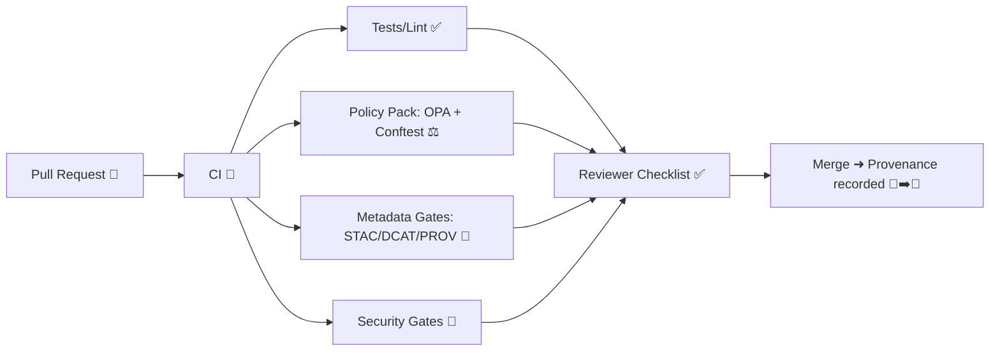

# ✅ MCP Review Checklists (KFM) 🧭🗺️

> **What this is:** A single, practical source-of-truth for **review checklists** used across the Kansas Frontier Matrix (KFM) repo.  
> **What it enforces:** “Provenance-first”, “evidence-first narrative”, “fail-closed governance”, and “no black boxes” in data, AI, UI, and ops.  [oai_citation:0‡📚 Kansas Frontier Matrix (KFM) Data Intake – Technical & Design Guide.pdf](file-service://file-EbUCdsJMbu5KwpoKMrLrgj)  [oai_citation:1‡Kansas Frontier Matrix (KFM) – Comprehensive Architecture, Features, and Design.pdf](file-service://file-4Umt1yHoGKicdmLWzFJ9sC)  [oai_citation:2‡Kansas Frontier Matrix (KFM) – AI System Overview 🧭🤖.pdf](file-service://file-Pv8eev6RWvCKrGCXyzY7zg)

---

## 📌 Quick Navigation

- [How to use](#-how-to-use)
- [Minimum merge gates](#-minimum-merge-gates)
- [Checklist selector](#-checklist-selector)
- [Universal checklist](#-universal-checklist-applies-to-every-pr)
- [Data intake & pipelines](#-data-intake--pipelines-checklist)
- [AI / Focus Mode](#-ai--focus-mode-checklist)
- [UI / UX](#-ui--ux-checklist)
- [Story Nodes / narratives](#-story-nodes--narrative-checklist)
- [Security & governance](#-security--governance-checklist)
- [Experiments & model cards](#-experiments--model-cards-checklist)
- [Releases & artifact integrity](#-releases--artifact-integrity-checklist)
- [Ops & graph health](#-ops--graph-health-checklist)
- [Source docs used](#-source-docs-used)

---

## 🧩 How to Use

**For every PR:** reviewers copy/paste the relevant checklist section(s) into the PR description (or tick boxes here during review).  
**For maintainers:** treat these as **review policy**, paired with automated gates (Policy Pack / CI).  [oai_citation:3‡Kansas Frontier Matrix (KFM) – Comprehensive Architecture, Features, and Design.pdf](file-service://file-4Umt1yHoGKicdmLWzFJ9sC)  [oai_citation:4‡Kansas Frontier Matrix (KFM) – Comprehensive Architecture, Features, and Design.pdf](file-service://file-4Umt1yHoGKicdmLWzFJ9sC)

**Design intent:** KFM routes meaningful changes through **PR-first workflows** so that (a) humans can review, (b) provenance is captured, and (c) nothing “silent” slips into the graph/data.  [oai_citation:5‡📚 Kansas Frontier Matrix (KFM) Data Intake – Technical & Design Guide.pdf](file-service://file-EbUCdsJMbu5KwpoKMrLrgj)  [oai_citation:6‡Additional Project Ideas.pdf](file-service://file-Pc2GNivcrHBeKjBQksLC3T)

---

## 🚦 Minimum Merge Gates

These are the **non-negotiables** for merge readiness (mirrors KFM governance + policy-gates design):

- **Schema validation passes** (data + metadata).
- **STAC/DCAT/PROV completeness** for any data artifact.
- **License present** (no “unknown license” merges).
- **Sensitivity classification** applied (and handled correctly).
- **Provenance completeness** (inputs + processing steps declared).
- **AI outputs** (if present) are **citation-backed**; if not, they must **refuse**/abstain.  [oai_citation:7‡Kansas Frontier Matrix (KFM) – Comprehensive Architecture, Features, and Design.pdf](file-service://file-4Umt1yHoGKicdmLWzFJ9sC)  [oai_citation:8‡Kansas Frontier Matrix (KFM) – AI System Overview 🧭🤖.pdf](file-service://file-Pv8eev6RWvCKrGCXyzY7zg)  [oai_citation:9‡Kansas Frontier Matrix (KFM) – AI System Overview 🧭🤖.pdf](file-service://file-Pv8eev6RWvCKrGCXyzY7zg)

> 🧷 **Fail-closed stance:** if a check cannot be performed or provenance is missing, the default is to **block** the change.  [oai_citation:10‡📚 Kansas Frontier Matrix (KFM) Data Intake – Technical & Design Guide.pdf](file-service://file-EbUCdsJMbu5KwpoKMrLrgj)

---

## 🧭 Checklist Selector

Use this table to quickly pick the checklist blocks you need:

| Change Type 🧱 | Required Checklist Blocks ✅ |
|---|---|
| Code (API / pipeline / UI) | Universal + Security (as needed) |
| New dataset / updated dataset | Universal + Data Intake + Security/Governance |
| New map layer / tiling | Universal + Data Intake + UI/UX |
| Focus Mode / AI changes | Universal + AI/Focus Mode + Security/Governance |
| Story Node / narrative | Universal + Story Nodes + UI/UX (if behavior changes) |
| Experiment / model update | Universal + Experiments/Model Cards + AI/Focus Mode |
| Release / artifact publishing | Universal + Releases + Security/Governance |
| Ops/Monitoring/Graph checks | Universal + Ops & Graph Health |

---

> KFM’s roadmap also connects PR events to **PROV-O** so “who changed what” becomes queryable lineage in Neo4j (PR as Activity, commits as Entities, reviewers as Agents).  [oai_citation:11‡🌟 Kansas Frontier Matrix – Latest Ideas & Future Proposals.docx.pdf](file-service://file-SQ3f7ve8SGiusT6ThZEuCe)

---

## ✅ Universal Checklist (Applies to Every PR)

<strong>Open checklist ✅</strong>

### Scope & Clarity 🧠
- [ ] PR title is specific (“component: outcome”) and matches diff intent.
- [ ] PR description includes: **why**, **what**, **how to test**, and **risk**.
- [ ] Changes are minimal and logically grouped (no drive-by refactors).
- [ ] Breaking changes are called out + migration notes provided (if needed).

### Traceability & Provenance 🧬
- [ ] Any new outputs are reproducible from inputs + code/config (no “manual edits”).  [oai_citation:12‡📚 Kansas Frontier Matrix (KFM) Data Intake – Technical & Design Guide.pdf](file-service://file-EbUCdsJMbu5KwpoKMrLrgj)
- [ ] If AI assisted any part of the work, the PR notes where/how (and outputs remain auditable).  [oai_citation:13‡📚 Kansas Frontier Matrix (KFM) Data Intake – Technical & Design Guide.pdf](file-service://file-EbUCdsJMbu5KwpoKMrLrgj)

### Quality Gates 🧪
- [ ] CI passes.
- [ ] Tests added/updated for changed behavior.
- [ ] Lint/format passes.
- [ ] Any policy checks (OPA/Conftest) pass.  [oai_citation:14‡Kansas Frontier Matrix (KFM) – Comprehensive Architecture, Features, and Design.pdf](file-service://file-4Umt1yHoGKicdmLWzFJ9sC)

### Documentation 📚
- [ ] User-facing changes include UI/docs update.
- [ ] Dev-facing changes include architecture notes or READMEs where appropriate.
- [ ] New terminology is added to the glossary (if used).  [oai_citation:15‡Kansas-Frontier-Matrix Design Audit – Gaps and Enhancement Opportunities.pdf](file-service://file-TkRzAfTnxCYDUHauCf1NcH)

---

## 🗄️ Data Intake & Pipelines Checklist

KFM’s intake philosophy: **raw inputs are immutable evidence**, pipelines are **deterministic**, and ingestion is **PR-first** (auditable via Git history).  [oai_citation:16‡📚 Kansas Frontier Matrix (KFM) Data Intake – Technical & Design Guide.pdf](file-service://file-EbUCdsJMbu5KwpoKMrLrgj)  [oai_citation:17‡📚 Kansas Frontier Matrix (KFM) Data Intake – Technical & Design Guide.pdf](file-service://file-EbUCdsJMbu5KwpoKMrLrgj)

<strong>Open checklist 📥</strong>

### Data Boundaries & Immutability 🧱
- [ ] Raw source bytes are stored “as received” and not modified in place.  [oai_citation:18‡📚 Kansas Frontier Matrix (KFM) Data Intake – Technical & Design Guide.pdf](file-service://file-EbUCdsJMbu5KwpoKMrLrgj)
- [ ] Transformations happen downstream (work/processed), never overwriting raw.  [oai_citation:19‡📚 Kansas Frontier Matrix (KFM) Data Intake – Technical & Design Guide.pdf](file-service://file-EbUCdsJMbu5KwpoKMrLrgj)
- [ ] If reprojection occurs, original CRS is captured and the display standard remains consistent (e.g., WGS84 serving).  [oai_citation:20‡Kansas Frontier Matrix (KFM) – Comprehensive Technical Documentation.pdf](file-service://file-AkqwUuYPp5zePf7pv5SMxi)
- [ ] CRS claims are verified (do not trust provider descriptions blindly).  [oai_citation:21‡KFM- python-geospatial-analysis-cookbook-over-60-recipes-to-work-with-topology-overlays-indoor-routing-and-web-application-analysis-with-python.pdf](file-service://file-2gpiGDZS8iw6EdxGswEdHp)

### Deterministic, Config-Driven ETL ⚙️
- [ ] Pipeline is deterministic/idempotent: same inputs + config → same outputs.  [oai_citation:22‡📚 Kansas Frontier Matrix (KFM) Data Intake – Technical & Design Guide.pdf](file-service://file-EbUCdsJMbu5KwpoKMrLrgj)
- [ ] No ad-hoc manual edits to processed data (changes must be in code/config).  [oai_citation:23‡📚 Kansas Frontier Matrix (KFM) Data Intake – Technical & Design Guide.pdf](file-service://file-EbUCdsJMbu5KwpoKMrLrgj)
- [ ] Pipeline is safe-sandboxed: config validated; execution is controlled.  [oai_citation:24‡📚 Kansas Frontier Matrix (KFM) Data Intake – Technical & Design Guide.pdf](file-service://file-EbUCdsJMbu5KwpoKMrLrgj)

### Metadata & Governance Gates 🧬⚖️
- [ ] STAC records are correct and complete (Items/Collections as appropriate).  [oai_citation:25‡Kansas Frontier Matrix (KFM) – Comprehensive Architecture, Features, and Design.pdf](file-service://file-4Umt1yHoGKicdmLWzFJ9sC)
- [ ] DCAT metadata present and complete.
- [ ] PROV lineage present (inputs, activities, outputs).
- [ ] License field is present and valid (no unknown license).  [oai_citation:26‡Kansas Frontier Matrix (KFM) – Comprehensive Architecture, Features, and Design.pdf](file-service://file-4Umt1yHoGKicdmLWzFJ9sC)
- [ ] Sensitivity classification is present and correct.  [oai_citation:27‡Kansas Frontier Matrix (KFM) – Comprehensive Architecture, Features, and Design.pdf](file-service://file-4Umt1yHoGKicdmLWzFJ9sC)

### Sensitivity / CARE Handling 🪶
- [ ] Sensitive locations are generalized/fuzzed where required.  [oai_citation:28‡Kansas Frontier Matrix (KFM) – Comprehensive Technical Documentation.pdf](file-service://file-AkqwUuYPp5zePf7pv5SMxi)
- [ ] Restricted data is access-controlled or withheld from public surfaces as designed.  [oai_citation:29‡Kansas Frontier Matrix (KFM) – Comprehensive Technical Documentation.pdf](file-service://file-AkqwUuYPp5zePf7pv5SMxi)
- [ ] Any culturally sensitive datasets have explicit governance notes/approvals.  [oai_citation:30‡📚 Kansas Frontier Matrix (KFM) Data Intake – Technical & Design Guide.pdf](file-service://file-EbUCdsJMbu5KwpoKMrLrgj)

### PR-First Data Flow 🧾
- [ ] Data enters via PR (no silent ingestion).
- [ ] If ingestion is automated, it produces reviewable PR(s) rather than direct merges.  [oai_citation:31‡📚 Kansas Frontier Matrix (KFM) Data Intake – Technical & Design Guide.pdf](file-service://file-EbUCdsJMbu5KwpoKMrLrgj)
- [ ] Run manifest / provenance record is included for each pipeline run.  [oai_citation:32‡Additional Project Ideas.pdf](file-service://file-Pc2GNivcrHBeKjBQksLC3T)

---

## 🧠 AI / Focus Mode Checklist

Focus Mode is **advisory-only** and must remain **evidence-backed** with enforceable governance checks (including optional runtime OPA checks).  [oai_citation:33‡Kansas Frontier Matrix (KFM) – AI System Overview 🧭🤖.pdf](file-service://file-Pv8eev6RWvCKrGCXyzY7zg)  [oai_citation:34‡Kansas Frontier Matrix (KFM) – AI System Overview 🧭🤖.pdf](file-service://file-Pv8eev6RWvCKrGCXyzY7zg)  [oai_citation:35‡Kansas Frontier Matrix (KFM) – AI System Overview 🧭🤖.pdf](file-service://file-Pv8eev6RWvCKrGCXyzY7zg)

<strong>Open checklist 🤖</strong>

### Non-Negotiables: Evidence & Refusal ✅
- [ ] Every user-facing claim is citation-backed (datasets/docs/graph entities).
- [ ] If sources are missing, the AI **refuses** or clearly states uncertainty.  [oai_citation:36‡Kansas Frontier Matrix (KFM) – AI System Overview 🧭🤖.pdf](file-service://file-Pv8eev6RWvCKrGCXyzY7zg)
- [ ] Outputs are logged as provenance-bearing artifacts (answer as derived entity, inputs recorded).  [oai_citation:37‡📚 Kansas Frontier Matrix (KFM) Data Intake – Technical & Design Guide.pdf](file-service://file-EbUCdsJMbu5KwpoKMrLrgj)

### Retrieval & Grounding 🔎
- [ ] Retrieval uses KFM stores (Neo4j + search index + GIS DB), not external internet.
- [ ] Context-awareness is respected (viewport/timeframe/layers influence prioritization).  [oai_citation:38‡Kansas Frontier Matrix (KFM) – AI System Overview 🧭🤖.pdf](file-service://file-Pv8eev6RWvCKrGCXyzY7zg)
- [ ] RAG orchestration is test-covered for regressions.  [oai_citation:39‡Kansas Frontier Matrix (KFM) – AI System Overview 🧭🤖.pdf](file-service://file-Pv8eev6RWvCKrGCXyzY7zg)

### Governance Checks ⚖️
- [ ] Output passes governance checks (policy requirements + content rules).  [oai_citation:40‡Kansas Frontier Matrix (KFM) – AI System Overview 🧭🤖.pdf](file-service://file-Pv8eev6RWvCKrGCXyzY7zg)
- [ ] Runtime OPA check is wired/updated if rules changed (sensitive site handling, privacy constraints).  [oai_citation:41‡Kansas Frontier Matrix (KFM) – AI System Overview 🧭🤖.pdf](file-service://file-Pv8eev6RWvCKrGCXyzY7zg)

### Prompt Security Layers 🛡️
- [ ] Prompt injection test cases included (attempts to bypass policy, request secrets, etc.).
- [ ] Input filtering/sanitization is applied.
- [ ] Tool access is allowlisted and constrained.  [oai_citation:42‡Kansas Frontier Matrix (KFM) – AI System Overview 🧭🤖.pdf](file-service://file-Pv8eev6RWvCKrGCXyzY7zg)

### Explainability & Auditability 🔍
- [ ] XAI surface (audit panel / factor attribution / governance flags) remains consistent with design.  [oai_citation:43‡Kansas Frontier Matrix (KFM) – AI System Overview 🧭🤖.pdf](file-service://file-Pv8eev6RWvCKrGCXyzY7zg)
- [ ] Sensitive data is redacted/generalized in responses per classification policy.  [oai_citation:44‡Kansas Frontier Matrix (KFM) – Comprehensive Technical Documentation.pdf](file-service://file-AkqwUuYPp5zePf7pv5SMxi)

### Model QA: Drift, Bias, Regression 📈
- [ ] Bias testing covers diverse queries + historical context handling.
- [ ] Drift monitoring / periodic evaluation plan is updated if model changes.  [oai_citation:45‡Kansas Frontier Matrix (KFM) – AI System Overview 🧭🤖.pdf](file-service://file-Pv8eev6RWvCKrGCXyzY7zg)

---

## 🧑‍🎨 UI / UX Checklist

The UI is a React app with MapLibre (2D) and Cesium (3D), timeline navigation, story playback, and an AI panel—built with **accessibility + transparency** as first-class requirements.  [oai_citation:46‡Kansas Frontier Matrix (KFM) – Comprehensive Architecture, Features, and Design.pdf](file-service://file-4Umt1yHoGKicdmLWzFJ9sC)  [oai_citation:47‡Kansas Frontier Matrix – Comprehensive UI System Overview.pdf](file-service://file-KcBQruYcoFVDEixzzRHTwt)  [oai_citation:48‡Kansas Frontier Matrix (KFM) – Comprehensive Technical Documentation.pdf](file-service://file-AkqwUuYPp5zePf7pv5SMxi)

<strong>Open checklist 🗺️</strong>

### Accessibility ♿
- [ ] Semantic HTML used where possible.
- [ ] ARIA roles for custom widgets.
- [ ] Keyboard navigation works for core flows.
- [ ] High-contrast mode supported/unchanged.  [oai_citation:49‡Kansas Frontier Matrix (KFM) – Comprehensive Architecture, Features, and Design.pdf](file-service://file-4Umt1yHoGKicdmLWzFJ9sC)

### Provenance in UX 🧬
- [ ] “Layer Info” / provenance surfacing is present for any new layer types.
- [ ] Source + license are visible and correct for active layers.  [oai_citation:50‡Kansas Frontier Matrix (KFM) – Comprehensive Architecture, Features, and Design.pdf](file-service://file-4Umt1yHoGKicdmLWzFJ9sC)  [oai_citation:51‡Kansas Frontier Matrix – Comprehensive UI System Overview.pdf](file-service://file-KcBQruYcoFVDEixzzRHTwt)

### Map & Rendering Performance 🚀
- [ ] MapLibre style/layers do not regress FPS (profiling notes in PR if heavy).
- [ ] Vector tiling strategies are appropriate for large layers (avoid gigantic GeoJSON payloads).
- [ ] 2D ↔ 3D toggle behavior is stable (Cesium loads correct extent).  [oai_citation:52‡Kansas Frontier Matrix (KFM) – Comprehensive Technical Documentation.pdf](file-service://file-AkqwUuYPp5zePf7pv5SMxi)

### Timeline & Temporal Navigation ⏳
- [ ] Time filtering is consistent with metadata timestamps (no “phantom” features).
- [ ] Timeline slider interactions are testable (unit/component + basic e2e smoke).  [oai_citation:53‡Kansas Frontier Matrix – Comprehensive UI System Overview.pdf](file-service://file-KcBQruYcoFVDEixzzRHTwt)  [oai_citation:54‡Kansas-Frontier-Matrix_ Open-Source Geospatial Historical Mapping Hub Design.pdf](file-service://file-ShqHKgjxCS9UT9vbcxDNzA)

### Mobile & Offline 📱📦
- [ ] Responsive layout tested for key pages.
- [ ] Offline pack behavior (if touched) remains compatible with MapLibre/Cesium local sources.  [oai_citation:55‡Kansas Frontier Matrix (KFM) – Comprehensive Architecture, Features, and Design.pdf](file-service://file-4Umt1yHoGKicdmLWzFJ9sC)  [oai_citation:56‡Kansas Frontier Matrix – Comprehensive UI System Overview.pdf](file-service://file-KcBQruYcoFVDEixzzRHTwt)

---

## 📖 Story Nodes & Narrative Checklist

Story Nodes are “evidence-first narratives” with map/time synchronization; sources should be auditable (ideally validated by CI).  [oai_citation:57‡Additional Project Ideas.pdf](file-service://file-Pc2GNivcrHBeKjBQksLC3T)  [oai_citation:58‡Kansas Frontier Matrix (KFM) – Comprehensive Technical Documentation.pdf](file-service://file-AkqwUuYPp5zePf7pv5SMxi)

<strong>Open checklist 📚</strong>

### Evidence-First Narrative 🧾
- [ ] Every claim in narrative text has a mapped citation (manifest preferred).
- [ ] Story references resolve to real files/URIs (no broken links).
- [ ] If AI drafted any text, it is labeled as AI-generated and still cited.  [oai_citation:59‡📚 Kansas Frontier Matrix (KFM) Data Intake – Technical & Design Guide.pdf](file-service://file-EbUCdsJMbu5KwpoKMrLrgj)

### Story ↔ Map Sync 🗺️⏱
- [ ] Each story step has deterministic view state (camera/layers/time).
- [ ] Exiting story returns user to safe navigation state.

### Accessibility & UX ♿✨
- [ ] Images have alt text.
- [ ] Story controls accessible via keyboard.
- [ ] Narrative panels readable and do not occlude key map interactions.

---

## 🔐 Security & Governance Checklist

KFM governance includes automated policy gates and a security posture spanning app defenses and supply chain hardening (SBOM, secrets handling, dependency patching).  [oai_citation:60‡Kansas Frontier Matrix (KFM) – Comprehensive Architecture, Features, and Design.pdf](file-service://file-4Umt1yHoGKicdmLWzFJ9sC)  [oai_citation:61‡Kansas Frontier Matrix (KFM) – Comprehensive Architecture, Features, and Design.pdf](file-service://file-4Umt1yHoGKicdmLWzFJ9sC)

<strong>Open checklist 🔐</strong>

### Policy-as-Code ⚖️
- [ ] OPA/Conftest policies updated if schema/requirements changed.
- [ ] New rule changes include tests and a clear rationale.
- [ ] CI fails on violations (expected, documented).  [oai_citation:62‡Kansas Frontier Matrix (KFM) – Comprehensive Architecture, Features, and Design.pdf](file-service://file-4Umt1yHoGKicdmLWzFJ9sC)

### Secrets & Access 🔑
- [ ] No secrets in code; configs use secure mechanisms.
- [ ] Authz changes documented (roles/permissions impacts).  [oai_citation:63‡Kansas Frontier Matrix (KFM) – Comprehensive Architecture, Features, and Design.pdf](file-service://file-4Umt1yHoGKicdmLWzFJ9sC)

### Supply Chain 🧾
- [ ] Dependency updates include changelog notes for security fixes where relevant.
- [ ] SBOM generation/updates are not broken (release pipeline).  [oai_citation:64‡Kansas Frontier Matrix (KFM) – Comprehensive Architecture, Features, and Design.pdf](file-service://file-4Umt1yHoGKicdmLWzFJ9sC)

### Sensitive Data Handling 🪶
- [ ] Sensitive location handling follows policy (generalize/withhold).
- [ ] Access controls correctly restrict sensitive datasets.  [oai_citation:65‡Kansas Frontier Matrix (KFM) – Comprehensive Technical Documentation.pdf](file-service://file-AkqwUuYPp5zePf7pv5SMxi)

---

## 🧪 Experiments & Model Cards Checklist

MCP expects disciplined tracking: experiments, results, and “model cards” for AI components (so analytical work doesn’t become a black box).  [oai_citation:66‡Kansas-Frontier-Matrix Design Audit – Gaps and Enhancement Opportunities.pdf](file-service://file-TkRzAfTnxCYDUHauCf1NcH)  [oai_citation:67‡Scientific Method _ Research _ Master Coder Protocol Documentation.pdf](file-service://file-HTpax4QbDgguDwxwwyiS32)

<strong>Open checklist 🧪</strong>

### Experiment Report 📓
- [ ] Includes: goal/hypothesis, data used, method, results, interpretation.
- [ ] Captures reproducibility: code version/params/inputs.
- [ ] Notes uncertainty/limitations and next steps.  [oai_citation:68‡Kansas-Frontier-Matrix_ Open-Source Geospatial Historical Mapping Hub Design.pdf](file-service://file-64djFYQUCmxN1h6L6X7KUw)

### Model Card 🪪
- [ ] Model purpose + intended use clearly stated.
- [ ] Training data documented (sources, known gaps, exclusions).
- [ ] Eval metrics + failure modes recorded.
- [ ] Bias and drift considerations documented.  [oai_citation:69‡Kansas Frontier Matrix (KFM) – AI System Overview 🧭🤖.pdf](file-service://file-Pv8eev6RWvCKrGCXyzY7zg)

---

## 🚀 Releases & Artifact Integrity Checklist

KFM aims for content-addressable, signed artifacts for geospatial products (PMTiles, GeoParquet, COGs), supporting reproducibility and provenance.  [oai_citation:70‡Additional Project Ideas.pdf](file-service://file-Pc2GNivcrHBeKjBQksLC3T)  [oai_citation:71‡🌟 Kansas Frontier Matrix – Latest Ideas & Future Proposals.docx.pdf](file-service://file-SQ3f7ve8SGiusT6ThZEuCe)

<strong>Open checklist 🚀</strong>

### Artifact Packaging 📦
- [ ] Artifacts are publishable in immutable form (digest pinned).
- [ ] Version tags follow conventions (date/version) while preserving immutable digests.  [oai_citation:72‡Additional Project Ideas.pdf](file-service://file-Pc2GNivcrHBeKjBQksLC3T)

### Signing & Verification ✍️
- [ ] Cosign signatures produced (keyless/OIDC preferred in CI).
- [ ] Verification instructions documented for users/CI.  [oai_citation:73‡Additional Project Ideas.pdf](file-service://file-Pc2GNivcrHBeKjBQksLC3T)

### Release Notes 📝
- [ ] Includes: what changed, migration notes, known issues, provenance pointers.

---

## 🩺 Ops & Graph Health Checklist

Operational health checks include provenance integrity (no orphan nodes), ingestion freshness checks (lag/SLA), and monitoring hooks.  [oai_citation:74‡Additional Project Ideas.pdf](file-service://file-Pc2GNivcrHBeKjBQksLC3T)  [oai_citation:75‡📚 Kansas Frontier Matrix (KFM) Data Intake – Technical & Design Guide.pdf](file-service://file-EbUCdsJMbu5KwpoKMrLrgj)

<strong>Open checklist 🩺</strong>

### Provenance Integrity 🧬
- [ ] No orphaned STAC/PROV nodes (every Activity connects inputs/outputs).  [oai_citation:76‡Additional Project Ideas.pdf](file-service://file-Pc2GNivcrHBeKjBQksLC3T)
- [ ] Graph queries for integrity checks are updated if schema changes.

### Ingestion Freshness ⏱
- [ ] Lag monitoring updated for new sources/SLAs.  [oai_citation:77‡Additional Project Ideas.pdf](file-service://file-Pc2GNivcrHBeKjBQksLC3T)
- [ ] Watchers are idempotent and resilient to outages/retries.  [oai_citation:78‡📚 Kansas Frontier Matrix (KFM) Data Intake – Technical & Design Guide.pdf](file-service://file-EbUCdsJMbu5KwpoKMrLrgj)

### Observability 📈
- [ ] Logs/metrics updated for new pipelines or services.
- [ ] Alerts documented for critical failure modes.

---

## 📚 Source Docs Used

### Core KFM Design & Governance 🧭⚖️
- **Data Intake Guide**  [oai_citation:79‡📚 Kansas Frontier Matrix (KFM) Data Intake – Technical & Design Guide.pdf](file-service://file-EbUCdsJMbu5KwpoKMrLrgj)  [oai_citation:80‡📚 Kansas Frontier Matrix (KFM) Data Intake – Technical & Design Guide.pdf](file-service://file-EbUCdsJMbu5KwpoKMrLrgj)
- **Innovative Concepts (KFM evolution)**  [oai_citation:81‡Innovative Concepts to Evolve the Kansas Frontier Matrix (KFM).pdf](file-service://file-G71zNoWKxsoSW44iwZaaCC)
- **Document Refinement Request (Pulse Ideas / design expansion)**  [oai_citation:82‡Additional Project Ideas.pdf](file-service://file-Pc2GNivcrHBeKjBQksLC3T)
- **Comprehensive Architecture, Features, and Design**  [oai_citation:83‡Kansas Frontier Matrix (KFM) – Comprehensive Architecture, Features, and Design.pdf](file-service://file-4Umt1yHoGKicdmLWzFJ9sC)  [oai_citation:84‡Kansas Frontier Matrix (KFM) – Comprehensive Architecture, Features, and Design.pdf](file-service://file-4Umt1yHoGKicdmLWzFJ9sC)
- **Comprehensive Technical Documentation**  [oai_citation:85‡Kansas Frontier Matrix (KFM) – Comprehensive Technical Documentation.pdf](file-service://file-AkqwUuYPp5zePf7pv5SMxi)  [oai_citation:86‡Kansas Frontier Matrix (KFM) – Comprehensive Technical Documentation.pdf](file-service://file-AkqwUuYPp5zePf7pv5SMxi)
- **AI System Overview**  [oai_citation:87‡Kansas Frontier Matrix (KFM) – AI System Overview 🧭🤖.pdf](file-service://file-Pv8eev6RWvCKrGCXyzY7zg)  [oai_citation:88‡Kansas Frontier Matrix (KFM) – AI System Overview 🧭🤖.pdf](file-service://file-Pv8eev6RWvCKrGCXyzY7zg)
- **Comprehensive UI System Overview**  [oai_citation:89‡Kansas Frontier Matrix – Comprehensive UI System Overview.pdf](file-service://file-KcBQruYcoFVDEixzzRHTwt)  [oai_citation:90‡Kansas Frontier Matrix – Comprehensive UI System Overview.pdf](file-service://file-KcBQruYcoFVDEixzzRHTwt)
- **Latest Ideas & Future Proposals**  [oai_citation:91‡🌟 Kansas Frontier Matrix – Latest Ideas & Future Proposals.docx.pdf](file-service://file-SQ3f7ve8SGiusT6ThZEuCe)  [oai_citation:92‡🌟 Kansas Frontier Matrix – Latest Ideas & Future Proposals.docx.pdf](file-service://file-SQ3f7ve8SGiusT6ThZEuCe)
- **Additional Project Ideas**  [oai_citation:93‡Additional Project Ideas.pdf](file-service://file-Pc2GNivcrHBeKjBQksLC3T)  [oai_citation:94‡Additional Project Ideas.pdf](file-service://file-Pc2GNivcrHBeKjBQksLC3T)
- **Design Audit – Gaps & Enhancements (MCP alignment)**  [oai_citation:95‡Kansas-Frontier-Matrix Design Audit – Gaps and Enhancement Opportunities.pdf](file-service://file-TkRzAfTnxCYDUHauCf1NcH)
- **Open-Source Geospatial Historical Mapping Hub Design**  [oai_citation:96‡Kansas-Frontier-Matrix_ Open-Source Geospatial Historical Mapping Hub Design.pdf](file-service://file-ShqHKgjxCS9UT9vbcxDNzA)

### MCP / Research Protocol 📓
- **Scientific Method / Research / Master Coder Protocol Documentation**  [oai_citation:97‡Scientific Method _ Research _ Master Coder Protocol Documentation.pdf](file-service://file-HTpax4QbDgguDwxwwyiS32)

### Reference Library (PDF Portfolios / Books) 📚🧰
> Some PDFs are **portfolio containers** (best opened in Acrobat/Reader). We still track them here as part of the project’s reference stack.

- **AI Concepts & more** (PDF portfolio)  [oai_citation:98‡AI Concepts & more.pdf](file-service://file-K6BctJjeUwvyCahLf9qdwr)
- **Data Management / Theories / Bayesian Methods** (PDF portfolio)  [oai_citation:99‡Data Managment-Theories-Architures-Data Science-Baysian Methods-Some Programming Ideas.pdf](file-service://file-RrXMFY7cP925exsQYermf2)
- **Maps / Google Maps / Virtual Worlds / Archaeological / WebGL** (PDF portfolio)  [oai_citation:100‡Maps-GoogleMaps-VirtualWorlds-Archaeological-Computer Graphics-Geospatial-webgl.pdf](file-service://file-RshcX5sNY2wpiNjRfoP6z6)
- **Various programming languages & resources** (PDF portfolio)  [oai_citation:101‡Various programming langurages & resources 1.pdf](file-service://file-4wp3wSSZs7gk5qHWaJVudi)
- **Python Geospatial Analysis Cookbook**  [oai_citation:102‡KFM- python-geospatial-analysis-cookbook-over-60-recipes-to-work-with-topology-overlays-indoor-routing-and-web-application-analysis-with-python.pdf](file-service://file-2gpiGDZS8iw6EdxGswEdHp)

---

## 🧱 Suggested Next Files (Optional but Recommended)

If/when you split checklists into separate files, this folder can evolve like:

📁 `mcp/reviews/checklists/`  
- 📄 `README.md` (this file)  
- 📄 `universal.md` ✅  
- 📄 `data-intake.md` 📥  
- 📄 `ai-focus-mode.md` 🤖  
- 📄 `ui-ux.md` 🗺️  
- 📄 `story-nodes.md` 📖  
- 📄 `security-governance.md` 🔐  
- 📄 `experiments-model-cards.md` 🧪  
- 📄 `releases-artifacts.md` 🚀  
- 📄 `ops-graph-health.md` 🩺  

---
