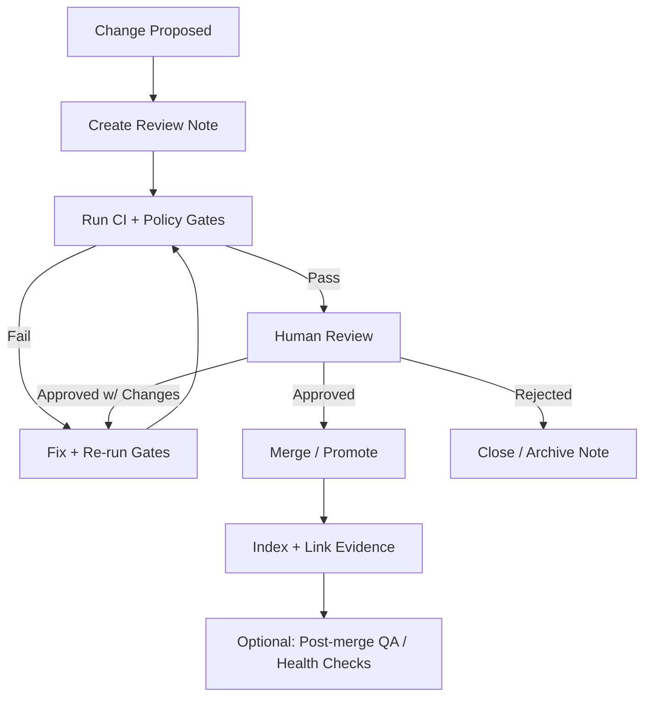

# 🧾 MCP Review Notes (KFM / Kansas-Matrix-System)


> **What lives here:** human-readable, evidence-backed review records for major changes (data, AI, UI, architecture, governance).  
> **Why:** KFM is *provenance-first* and *contract-first* — review notes make decisions auditable, searchable, and reproducible.

---

## 🧠 What “MCP” means here

In this repo, **MCP** is the umbrella for **Methods, Controls & Processes** (a.k.a. “Master Coder Protocol” discipline):  
- 🧪 scientific-method style rigor (hypothesis → method → validation → replication)  
- 🧰 engineering rigor (tests, CI, code review, policy gates)  
- 🧾 governance rigor (FAIR+CARE, licensing, sensitivity, provenance)

This folder is the **review** layer that complements automated checks (CI + policy gates). ✅🤝

---

## 🗂️ Folder layout

```text
mcp/
  reviews/
    review-notes/
      README.md                     👈 you are here
      templates/
        review-note.template.md     🧩 (recommended)
      index/
        INDEX.md                    🧭 (recommended: running table of review notes)
      2026/
        2026-01-20__example__RN-0001.md
      assets/
        RN-0001/                    📦 optional supporting screenshots/exports (keep small)
```

> [!TIP]
> If artifacts are “big” (tiles, rasters, parquet), store them via the project’s artifact strategy (e.g., OCI registry / signed artifacts) and **only reference immutable IDs/digests here**.

---

## 🎯 When to write a review note

Create a review note when a change is any of the following:

- 🧱 **Architecture / schema** changes (graph model, API contracts, metadata schema, STAC/DCAT/PROV profiles)
- 🧺 **New dataset intake** or substantial dataset refresh (new source, new license, new sensitivity class, new pipeline)
- 🤖 **AI / Focus Mode** updates (models, retrieval strategy, policy pack changes, evaluation changes)
- 🗺️ **UI map system** changes (layer state format, story node rendering, timeline behaviors, accessibility)
- 🔐 **Security / governance** changes (policy gates, secrets, permissions, sensitivity rules)
- 🧪 **Experimental features** moving from sandbox → promoted (Detect → Validate → Promote)
- 🌐 **Federation / integration** changes (external APIs, cross-region queries, new storage backends)
- 🧭 **Narrative systems** changes (Story Nodes, Pulse Threads, evidence manifests, citation behavior)

If you’re unsure… write one anyway. 📝✨

---

## 🧩 Review note types

| Type | Use when… | Must include… |
|---|---|---|
| 🧺 **Data Intake Review** | new dataset or refresh | license + sensitivity + STAC/DCAT/PROV + checksums + validation results |
| 🧱 **Architecture Review** | schemas/contracts/major components | compatibility plan + migration plan + observability + rollback |
| 🤖 **AI / Focus Mode Review** | model/retrieval/prompt/policies | eval results + citation rules + safety checks + drift plan |
| 🗺️ **UI/UX Review** | map UX, layer state, story UI | accessibility + performance budgets + interaction specs |
| 🕸️ **Knowledge Graph Review** | ontology/Neo4j changes | constraint/index impacts + integrity checks + lineage patterns |
| 🔐 **Governance/Security Review** | policy gates, permissions | threat model notes + policy diffs + sensitive data handling |
| 🚀 **Release / Promotion Review** | promoting sandbox → main | gate results + run manifest + rollback plan + sign-off |

---

## ✅ Minimum requirements (Definition of Done)

A review note is “done” when it has:

- **Clear scope** (what is being reviewed; what is not)
- **Evidence references** (datasets, STAC/DCAT records, PROV activities, commits/PRs, artifacts by digest)
- **Gate results** (what CI/policy gates were run and what passed/failed)
- **Decision** (approved / approved with changes / rejected / deferred)
- **Action items** (owner + due date + tracking links)
- **Sign-off** (who reviewed)

> [!IMPORTANT]
> KFM’s ethos: **no mystery layers**. If a review note asserts a claim, it must point to verifiable evidence (data + metadata + provenance). 🧾🔎

---

## 🏷️ Naming conventions

Use one of these (choose one and stay consistent):

### Option A — Friendly + sortable (recommended)
`YYYY-MM-DD__topic-slug__RN-####.md`

Example:
- `2026-01-20__pmtiles-oci-distribution__RN-0007.md`

### Option B — Strict ID first
`RN-####__YYYY-MM-DD__topic-slug.md`

---

## 🧾 Review Note Template (copy/paste)

```md
---
id: RN-0000
date: 2026-01-20
type: data-intake | ai | ui | architecture | governance | graph | release
status: draft | in-review | approved | approved-with-changes | rejected | deferred
owners:
  - "@owner1"
reviewers:
  - "@reviewer1"
related:
  prs: []
  issues: []
  datasets: []          # dataset IDs / slugs
  stac: []              # STAC collection/item refs
  dcat: []              # DCAT dataset/distribution refs
  prov: []              # PROV activity/entity refs
artifacts:
  - kind: oci
    ref: "ghcr.io/org/repo:tag"
    digest: "sha256:..."
    contents:
      - "application/vnd.pmtiles"
      - "application/vnd.geo+parquet"
risk:
  severity: low | medium | high
  notes: ""
---

# RN-0000 — <Title>

## 🎯 Scope
- **In scope:** …
- **Out of scope:** …

## 🧩 Background / Context
- Why now?
- What problem are we solving?
- What user / system impact?

## 🔄 What changed
- Summary of changes
- Links to PR(s) / commits / design docs

## 🧾 Evidence & Provenance Snapshot
- **Data contracts:** (link)
- **Checksums / digests:** (link)
- **STAC/DCAT:** (link)
- **PROV:** (link)
- **Repro instructions:** (how to re-run)

## ✅ Automated Gates (CI / Policy-as-Code)
- [ ] Unit/integration tests
- [ ] Schema validation (metadata + data)
- [ ] STAC/DCAT/PROV completeness
- [ ] License present + compatible
- [ ] Sensitivity classification + rules
- [ ] Citation / evidence rules (AI + narratives)
- [ ] Security checks (secrets, dependencies, SBOM if applicable)

> Paste failing gate output snippets here (short) and link to full logs/artifacts.

## 🔍 Human Review Checklist (pick what applies)
### 🧺 Data
- [ ] Source is trustworthy + documented
- [ ] Transform steps are deterministic / idempotent
- [ ] QA metrics reviewed (ranges, CRS, nulls, duplicates, drift)
- [ ] FAIR+CARE considerations recorded

### 🤖 AI / Focus Mode
- [ ] Answers require citations + provide them
- [ ] Prompt / tool injection considerations reviewed
- [ ] Evaluation covers key query families
- [ ] Drift/monitoring plan noted

### 🗺️ UI
- [ ] Map layer state behavior verified
- [ ] Performance budget met (tiles, rendering, interactions)
- [ ] Accessibility checks (keyboard, contrast, screen reader)
- [ ] Mobile/responsive considerations

### 🕸️ Knowledge Graph
- [ ] Constraints/indexes still valid
- [ ] No orphaned nodes/edges introduced
- [ ] Lineage links present + queryable
- [ ] Health check results attached

## 🧠 Findings
- What went well
- What failed / concerns
- Unknowns / follow-ups

## ✅ Decision
**Decision:** Approved / Approved with changes / Rejected / Deferred  
**Rationale:** …

## 🧷 Action Items
- [ ] (Owner) Task — due YYYY-MM-DD — link

## 🔙 Rollback Plan
- What to revert
- What artifacts to pin by digest
- How to confirm rollback success

## ✍️ Sign-off
- Reviewer(s): …
- Date: …
```

---

## 🧷 Evidence rules (KFM-standard)

### 1) Everything should be **reproducible**
Whenever possible, record:
- the **run manifest** / run ID
- pinned inputs (URLs + checksums or digests)
- environment details (tool versions, containers)
- parameters + random seeds (if applicable)

### 2) Prefer **immutable references**
- ✅ `sha256:...` digests for stored artifacts  
- ✅ stable dataset IDs for catalogs/graph  
- ✅ commit SHAs / PR links for code changes

### 3) Narratives must be evidence-backed (Story Nodes / Pulse Threads)
If the reviewed change touches narratives:
- include a **human-readable citations block**
- include a **machine-readable evidence manifest** (YAML/JSON)
- include (or reference) a **PROV JSON-LD** snippet that ties the narrative to its evidence and authorship

> [!NOTE]
> Treat narrative authoring like writing a research paper: citations aren’t decoration — they’re part of the product. 📚🧾

---

## 🔄 Lifecycle (how review notes flow)



---

## 🧰 How this connects to CI + Policy Gates

KFM’s automation style is **Detect → Validate → Promote**:
- Detect changes (data/code/config)
- Validate via tests + schema checks + policy-as-code (OPA + Conftest)
- Promote only when gates pass and humans sign off

Review notes are the **human complement** to those gates:
- record why a decision was made
- document exceptions and mitigations
- keep governance transparent and repeatable

---

## 🕵️ Common pitfalls (avoid these 🚫)

- 🚫 “Looks good” with no evidence links  
- 🚫 Accepting a dataset without license/sensitivity classification  
- 🚫 UI/AI changes without explaining how provenance/citations are preserved  
- 🚫 Big artifacts committed without a clear artifact strategy + immutable refs  
- 🚫 Changes that break reproducibility (unpinned inputs, undocumented steps)

---

## 🔐 Sensitive content reminders

If a review touches sensitive data:
- confirm coordinate generalization / access control behavior
- confirm policy gates enforce restrictions
- document who is allowed to view/ship the data and why

> [!IMPORTANT]
> If there’s any chance a dataset reveals sensitive locations or personal data, treat it as **high-risk** until proven otherwise. 🛡️

---

## 📚 Project doc map (what to consult per review)

Use these docs to ground the review note (and to make sure we’re consistent across the system):

- 🧱 **Architecture & features**: core platform structure, roadmap, governance, future directions  
- 🧭 **AI System Overview**: Focus Mode, policy pack, W-P-E agents, provenance in DevOps, safety  
- 🗺️ **UI System Overview**: map interaction patterns, layer state conventions, story-driven UX  
- 🧺 **Data Intake Guide**: ingestion gates, PROV-first requirements, reproducibility, promotion workflow  
- 🧠 **Innovative Concepts / Future Proposals**: forward-looking features (AR, offline packs, federation, etc.)  
- 🧾 **Technical Documentation**: governance SOPs, sensitivity handling, interoperability, scalability  
- 🧪 **Scientific Method + Master Coder Protocol**: peer review expectations, reproducibility discipline  
- 🧰 **Supplemental libraries** (AI concepts, geospatial/webgl, programming resources, data management, data mining): deeper background for specialized reviews

> [!TIP]
> If your review note is drifting into “we need to decide X,” consider also adding/using an ADR system — but keep this folder focused on **review outcomes**.

---

## 📖 Glossary (quick)

- **STAC**: SpatioTemporal Asset Catalog (data catalog patterns for geospatial assets) 🗺️  
- **DCAT**: Data Catalog Vocabulary (metadata standard) 🧾  
- **PROV**: W3C provenance model (entities, activities, agents) 🧬  
- **FAIR+CARE**: findable/accessible/interoperable/reusable + collective benefit/authority/responsibility/ethics 🤝  
- **Focus Mode**: KFM’s AI assistant view, expected to be citation-backed 🤖  
- **W-P-E**: Watcher → Planner → Executor agent workflow (PR-first automation) 👀🧠🛠️  
- **Policy-as-Code**: enforce governance rules via OPA/Conftest (gates fail closed) 🚦  
- **OCI/ORAS/Cosign**: artifact distribution + signing for integrity and reproducibility 📦🔏  

---

## ✅ Final note

> [!IMPORTANT]
> **Review notes are not bureaucracy — they are the user’s trust surface.**  
> They’re how we prove KFM is *auditable*, *reproducible*, and *community-safe* over time. 🌾🧠🗺️
