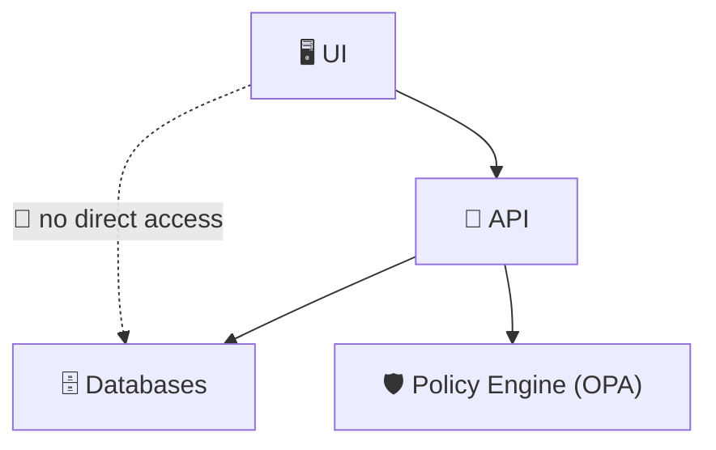

# 🧰 MCP Runbooks (Operational Playbooks)


> 🎯 **Goal:** Make operational work repeatable, auditable, and boring (in the best way).  
> These runbooks are the “do-this-next” guides for **pipelines, policy gates, infra, AI/Focus Mode, and incident response**.

---

## 🧭 Quick Navigation

- [What “Runbooks” Mean Here](#-what-runbooks-mean-here)
- [Golden Rules](#-golden-rules)
- [Folder Structure](#-folder-structure)
- [Runbook Quality Bar](#-runbook-quality-bar)
- [Runbook Template](#-runbook-template)
- [Runbook Index](#-runbook-index)
- [How to Add / Improve a Runbook](#-how-to-add--improve-a-runbook)
- [Related Docs](#-related-docs)

---

## 📌 What “Runbooks” Mean Here

Runbooks are **step-by-step operational playbooks** for:

- 🧯 **Incidents** (API down, DB degraded, policy blocks, pipeline broken)
- 🧪 **Operational tasks** (rebuild indexes, rerun pipelines, rotate secrets, restore backups)
- 🧭 **Governed workflows** that must follow MCP + KFM rules (metadata/provenance, policy enforcement, reproducibility)

### ✅ Runbook vs SOP vs Experiment (tiny guide)

| Doc Type | Best For | Lives In | Must Include |
|---|---|---|---|
| 🧰 **Runbook** | Ops + incidents + “fix/restore” | `mcp/runbooks/` | Triage → Steps → Verification → Rollback |
| 🧾 **SOP** | Recurring “happy path” workflows | `mcp/sops/` (or `docs/sops/`) | Purpose → Prereqs → Procedure → Outcome |
| 🧪 **Experiment Log** | Research/ML/analysis runs | `mcp/experiments/` | Hypothesis → Data → Method → Results → Interpretation |
| 🏗️ **ADR** | Architecture decisions | `docs/architecture/adr/` | Context → Decision → Consequences |

---

## 🥇 Golden Rules

> 🔒 **Do not shortcut the pipeline. Do not bypass governance.**  
> If a runbook step violates these, the runbook is wrong.

### 1) 🧱 Canonical pipeline order (always)
**Raw → Processed → Catalog/PROV → Database → API → UI**


### 2) 🧩 UI never talks to databases (ever)
The UI must only interact via the **API layer**, so validation + policy enforcement remain centralized.



### 3) 🛡️ Policy gates are not optional
- CI policy checks (Conftest/OPA) are treated as **hard gates**
- Runtime policy checks (OPA) can **deny, sanitize, or redact** responses/data
- Runbooks must include “how to verify policy compliance” when relevant

### 4) 🧾 Evidence-first
A runbook should make it possible for a reviewer to answer:
- What changed?
- What did you run?
- What did you observe?
- What did you verify?
- How do we undo it?

---

## 🗂️ Folder Structure

This folder should stay tidy and “grep-friendly” 🧠

```
mcp/
└── runbooks/
    ├── README.md
    ├── incidents/        # 🧯 Triage + restoration playbooks
    ├── ci/               # ✅ CI failures, policy check failures, build breaks
    ├── policy/           # 🛡️ OPA decisions, redaction rules, sensitive data handling
    ├── pipelines/        # 🏭 Ingest/reprocess/index/rebuild workflows
    ├── db/               # 🗄️ PostGIS/Neo4j ops, migrations, backups/restores
    ├── api/              # 🧩 API deploy, health checks, rollback, perf
    ├── web/              # 🖥️ UI deploy/build failures, layer registry issues
    └── ai/               # 🧠 Focus Mode + Ollama + tool-call policy incidents
```

### 🏷️ Naming convention (suggested)

Use one of these (pick one style and stay consistent):
- `RBK__<area>__<topic>.md` → e.g. `RBK__ci__conftest_policy_failure.md`
- `RBK-<area>-<topic>.md` → e.g. `RBK-ci-conftest-policy-failure.md`

---

## 🎛️ Runbook Quality Bar

Every runbook should include (minimum):

- ✅ **Purpose** (why it exists)
- 🧠 **When to use** (symptoms / triggers)
- 🧰 **Prerequisites** (access, tools, env vars)
- 🧪 **Procedure** (step-by-step)
- 🔎 **Verification** (how we know it worked)
- ↩️ **Rollback** (how to revert safely)
- 🧯 **Troubleshooting / Notes** (common failure modes)
- 🧾 **Audit trail** (what to record: links, SHAs, timestamps, screenshots)

> 💡 If it’s an incident runbook, add: **impact**, **severity**, **owner/on-call**, and **postmortem notes**.

---

## 🧾 Runbook Template

<details>
<summary><b>📄 Click to expand: TEMPLATE__RUNBOOK.md</b></summary>

---

# 🧰 RBK: <AREA> — <SHORT TITLE>

## 🎯 Purpose
- What does this runbook accomplish?

## 🚦 When to Use
- Symptoms:
  - [ ] …
- Signals / alerts:
  - [ ] …
- Common root causes:
  - [ ] …

## 🔐 Prerequisites
- Access:
  - [ ] …
- Local tools:
  - [ ] …
- Secrets / env:
  - [ ] …
- Safety checks:
  - [ ] Confirm production vs staging target

## 🧠 Triage (fast path)
- [ ] Confirm scope/impact (what’s broken, who’s affected)
- [ ] Check recent changes (PRs/commits/releases)
- [ ] Capture logs/screenshots now (before restarting anything)

## 🛠️ Procedure (step-by-step)
1. …
2. …
3. …

## ✅ Verification
- What “good” looks like:
  - [ ] …
- Smoke tests:
  - [ ] …
- Data validation checks:
  - [ ] …
- Policy checks:
  - [ ] …

## ↩️ Rollback
- [ ] Revert change / redeploy previous version
- [ ] Confirm system returns to last known-good state
- [ ] Document rollback reason

## 🧯 Troubleshooting / Notes
- If X happens, do Y
- Known gotchas

## 🧾 Audit Trail (paste links + notes)
- Timestamp:
- Environment:
- Commit(s):
- Commands run:
- Logs:
- Outcome:

---

</details>

---

## 📚 Runbook Index

> 🧩 This index is a **starter set**. Add runbooks as the system grows.  
> ✅ Keep titles action-oriented and searchable.

### ✅ CI / Policy Gates
- 🔲 `ci/RBK__ci__conftest_policy_failure.md` — CI fails on policy (missing license/PROV/metadata)
- 🔲 `ci/RBK__ci__lint_test_failure.md` — Formatting / tests red
- 🔲 `policy/RBK__policy__opa_rego_change_rollout.md` — Safely roll out new policy rules

### 🏭 Pipelines / Data Ops
- 🔲 `pipelines/RBK__pipelines__ingest_new_dataset.md` — Ingest new dataset (Raw→Processed→Catalog→DB)
- 🔲 `pipelines/RBK__pipelines__rebuild_catalog_prov.md` — Rebuild STAC/DCAT/PROV mappings
- 🔲 `pipelines/RBK__pipelines__reindex_search_graph.md` — Reindex search / graph embeddings / entity links

### 🗄️ Databases
- 🔲 `db/RBK__db__postgis_backup_restore.md` — Backup/restore PostGIS
- 🔲 `db/RBK__db__neo4j_backup_restore.md` — Backup/restore graph DB
- 🔲 `db/RBK__db__migration_rollback.md` — Migrations + rollback pattern

### 🧩 API / Services
- 🔲 `api/RBK__api__healthcheck_and_degraded_mode.md` — Health, degradation, partial service
- 🔲 `api/RBK__api__slow_queries_hotspots.md` — Latency triage + query hotspots

### 🖥️ Web / UI
- 🔲 `web/RBK__web__build_deploy_failure.md` — Build/deploy failures
- 🔲 `web/RBK__web__layer_not_rendering.md` — Map layer fails to render (source/projection/tiles)

### 🧠 AI / Focus Mode (Ollama + Tool Use)
- 🔲 `ai/RBK__ai__answer_blocked_by_policy.md` — OPA blocks answer (sensitive refs / disallowed content)
- 🔲 `ai/RBK__ai__missing_citations.md` — AI responses missing citations / provenance links
- 🔲 `ai/RBK__ai__ollama_model_load_failure.md` — Model not loading / runtime errors

---

## 🧑‍🔧 How to Add / Improve a Runbook

- [ ] Copy the template (above) or a similar runbook
- [ ] Write it like you’re helping **future-you at 2am** 😅
- [ ] Prefer **checklists** and **copy/paste commands**
- [ ] Add “Verification” and “Rollback” even if it feels repetitive
- [ ] Update the [Runbook Index](#-runbook-index)

### ✅ Quality checklist (PR-ready)
- [ ] Steps are deterministic (no “just fix it”)
- [ ] Contains verification (observable success)
- [ ] Contains rollback (safe undo)
- [ ] Notes policy/gov implications (if any)
- [ ] Links to related docs / scripts / dashboards

---

## 🔗 Related Docs

From here (`mcp/runbooks/README.md`), useful nearby references:

- 🏠 Root overview: `../../README.md`
- 🧠 MCP artifacts:
  - `../experiments/` (experiment logs)
  - `../runs/` (run outputs / run history)
  - `../sops/` (standard operating procedures)
- 🧱 Architecture & standards:
  - `../../docs/architecture/`
  - `../../docs/standards/`
  - `../../docs/templates/`
- 🧾 Governance:
  - `../../docs/governance/`
  - `../../SECURITY.md`

---

## 🧊 Philosophy (keep it simple)

> **If it’s not documented, it didn’t happen.**  
> **If it’s not reproducible, it’s not done.**  
> **If it bypasses policy, it’s a bug.** 🛡️

---

