# MCP SOPs — README


**Jump links:** [📘 Overview](#overview) • [🧭 SOP lifecycle](#sop-lifecycle) • [🧰 SOP template](#sop-template) • [🗂️ Directory layout](#directory-layout) • [🧪 Validation & CI/CD](#validation-cicd) • [⚖️ FAIR+CARE & governance](#faircare-governance) • [📚 Reference library](#reference-library)

> [!IMPORTANT]
> **SOPs are “executable documentation.”** If another contributor can’t run the steps and *verify* the outcome, it’s not an SOP (yet).  
> ✅ Deterministic • 🔍 Auditable • 🧾 Provenance-linked • 🛡️ Policy-gated • ♻️ Rollback-safe

---

<a id="overview"></a>

## 📘 Overview

### Purpose 🎯
This README defines how to create, review, and maintain **Standard Operating Procedures (SOPs)** under `mcp/sops/` so recurring workflows stay **repeatable, auditable, and architecture-synced**.

In KFM, SOPs are **MCP evidence products**: runbook-quality guides that:
- capture the “how” of a recurring workflow (step-by-step, reproducible)
- explicitly map **inputs → transforms → outputs**
- document **validation** and **rollback**
- respect **governance + sovereignty constraints**
- are safe for both **humans** and **automation agents** (e.g., Watcher–Planner–Executor)

### Scope ✅
**In scope**
- Repeatable procedures that touch the KFM pipeline and surface in user-facing outputs:
  - 🧺 data intake + ETL/normalization
  - 🛰️ geospatial processing (vector/raster/COGs/tiles)
  - 🧾 data contracts + schema conformance
  - 🗃️ STAC/DCAT/PROV catalog generation & validation
  - 🧠 graph updates (ontology-aligned ingest, migrations)
  - 🧱 API boundary work (contracts, redaction, query safety, policy pack)
  - 🗺️ UI layer registration (map/timeline/legend/pop-ups/export attribution)
  - 📚 Story Node publication (Markdown + map-state configs)
  - 🧭 Focus Mode operations (evidence/citation enforcement, QA, drift checks)
  - 🎮 simulations & modeling runs (run manifests, deterministic seeds, scenario promotion)
  - 🔐 security operations (supply chain attestations, secrets hygiene, incident response)

**Out of scope**
- **Creating or changing governance policy** text itself (SOPs may *reference* policy IDs, but do not author new policy).
- Narrative artifacts intended for end users (use Story Node templates under `docs/reports/story_nodes/`).
- API contract definitions (use the canonical API contract templates/docs).

### Audience 👥
- Contributors performing operational work (DataOps, GraphOps, API/UI maintainers, curators, release managers).
- Reviewers validating reproducibility, governance compliance, and downstream integrity.

### Definitions 📚
- Glossary: `docs/glossary.md`

Key terms used throughout SOPs:

| Term | Meaning | Why it matters |
|---|---|---|
| **SOP** | Step-by-step guide for a recurring task (runbook-quality) | Enables deterministic, repeatable work |
| **MCP** | “Master Coder Protocol” evidence & documentation products | Standardizes rigor across domains |
| **Run manifest** | Recorded run description tying inputs → outputs (often paired with PROV) | Enables audit + rebuild-from-raw |
| **RunContext** | Serialized context/config for a run (IDs, versions, seeds, params) | Makes runs reproducible |
| **Data contract** | Declared schema + metadata expectations for a dataset | Prevents “mystery layers” |
| **Policy pack** | Policy-as-code rules (e.g., OPA/Conftest) enforced in CI | Fail-closed governance gates |
| **Policy waiver** | Explicit, tracked exception with an ID + justification | Keeps exceptions visible + reviewable |
| **Story Node** | Narrative Markdown + map-state configuration (JSON/YAML) | Narrative is data-driven & provenance-linked |
| **Focus Mode** | AI assistant UX with enforced citations + explainability hooks | Prevents hallucinations & improves trust |
| **SBOM / Attestation** | Supply chain metadata (SPDX SBOM, SLSA provenance, signatures) | Helps verify “how this was built” |

### Key artifacts 🔑
| Artifact | Canonical location | Purpose | Notes |
|---|---|---|---|
| Master Guide (v13) | `docs/MASTER_GUIDE_v13.md` | Canonical pipeline ordering + invariants | **Supersedes v12** |
| Universal Doc Template | `docs/templates/TEMPLATE__KFM_UNIVERSAL_DOC.md` | Default template for governed Markdown docs | Use unless a dedicated SOP template exists |
| Story Node Template | `docs/templates/TEMPLATE__STORY_NODE_V3.md` | Narrative artifacts for Focus Mode | Story Nodes must be provenance-linked |
| Policy Pack | `api/scripts/policy/` (or repo-equivalent) | OPA/Conftest rules + waivers | CI must fail-closed |
| Governance root | `docs/governance/ROOT_GOVERNANCE.md` | Review gates + governance rules | Follow for sensitive content + redaction |
| Docs library | `docs/library/` + `docs/library/MANIFEST.yml` | Reference PDFs/books used by the project | Keeps longform references out of core docs |
| This index | `mcp/sops/README.md` | SOP entrypoint + conventions | Update when SOPs are added |

### Definition of done ✅
A new SOP is “done” when:

**Structure & metadata**
- [ ] It lives under `mcp/sops/` and its front-matter `path:` matches the file path.
- [ ] It has a stable **doc UUID** + semantic ID, and its version is incremented when steps change materially.
- [ ] It declares which **pipeline stage(s)** it affects and respects canonical ordering.

**Operational clarity**
- [ ] It lists prerequisites (tools, access, environment assumptions, versions).
- [ ] It provides step-by-step procedure that is deterministic where possible (idempotent if feasible).
- [ ] It specifies **inputs**, **outputs**, and canonical output locations (`data/`, `api/`, `web/`, etc.).
- [ ] It includes **verification checks** and explicit success criteria.
- [ ] It includes **rollback** steps (safe revert path) and “blast radius” notes.

**Governance & safety**
- [ ] It states whether it touches **sensitive locations**, **sovereignty-protected material**, restricted licensing, or personal data.
- [ ] It references relevant **policy gates** (and lists any required waivers explicitly).
- [ ] It contains **no secrets/credentials/PII** (and includes a link to the emergency procedure if applicable).
- [ ] If it produces **model/simulation outputs**, it links to the relevant model card / evaluation artifact (if required by the subsystem).

**Maintenance**
- [ ] This README’s SOP index is updated with a link and basic metadata.

---

<a id="sop-lifecycle"></a>

## 🧭 SOP lifecycle

> [!NOTE]
> SOPs are living documents. Treat them like code: review, version, deprecate intentionally, and keep them aligned with pipeline contracts.

### Status meanings 🏷️
Use `status:` in front matter (and reflect in the SOP header) using one of:

- **draft** 🟠 — still stabilizing; may change frequently  
- **active** 🟢 — approved + used; expected to work as written  
- **deprecated** 🟣 — superseded; kept for traceability only  
- **archived** ⚫ — historical record; not expected to run  

### Versioning rules 🔢
- Use **SemVer** in `version:` (`vMAJOR.MINOR.PATCH`).
  - **MAJOR**: breaking procedural change or new required artifacts
  - **MINOR**: new steps/checks that remain backward-compatible
  - **PATCH**: typos/clarifications that don’t change procedure
- If the SOP changes a **data product**, ensure dataset/catalog versioning is handled in its canonical subsystem.

### Deprecation pattern ♻️
When deprecating an SOP:
1. Mark `status: deprecated`
2. Add a banner at top: “Deprecated — see `<new_sop>.md`”
3. Keep it readable (do not delete); provenance and audits may reference it

---

<a id="directory-layout"></a>

## 🗂️ Directory layout

### This document 📄
- `path`: `mcp/sops/README.md` (must match front-matter)

### Related repository areas 🧭
> [!TIP]
> KFM v13 favors **one canonical home per subsystem**. If you discover drift, fix the drift (don’t document it forever).

| Area | Canonical path | What it is |
|---|---|---|
| MCP SOPs | `mcp/sops/` | This SOP library |
| MCP experiments | `mcp/experiments/` | Experiment reports/logs (if present) |
| MCP model cards | `mcp/model_cards/` | Model documentation (if present) |
| Data staging | `data/raw/`, `data/work/`, `data/processed/` | Source → work → derived outputs |
| Simulation workbench | `data/work/sims/` | Sandboxed, deterministic scenario runs (e.g., `kfm-sim-run`) |
| Graph artifacts | `data/graph/csv/` | Graph import/export fixtures (CSV snapshots) |
| Catalog outputs | `data/stac/`, `data/catalog/dcat/`, `data/prov/` | STAC/DCAT/PROV artifacts |
| Pipelines | `src/pipelines/` (or repo-equivalent) | Deterministic ETL/transforms |
| Graph code | `src/graph/` | Ontology, ingest code, migrations |
| API boundary | `api/` (preferred) | REST/GraphQL + redaction layer + AI services |
| Policy pack | `api/scripts/policy/` | Conftest/OPA rules + waivers |
| UI | `web/` | Map layers + timeline + Story Nodes + Focus Mode UX |
| Story Nodes | `docs/reports/story_nodes/` | Narrative artifacts + assets |
| Docs library | `docs/library/` | Curated external references (PDFs/books) |
| Schemas | `schemas/` | JSON Schema / validation contracts |
| Tools | `tools/` | Validators, linters, CLI utilities |
| Tests | `tests/` | Validation + regression checks |
| Releases | `releases/` | Versioned data/model bundles + metadata (SBOM, signatures) |

### Expected file tree for this sub-area 🌲
```text
📁 mcp/
└── 📁 sops/
    ├── 📄 README.md
    ├── 📄 <sop_name>.md
    ├── 📄 <sop_name>__v2.md
    └── 📁 assets/
        └── 🖼️ <optional_screenshots_or_diagrams>.png
```

---

## 🧾 SOP index

### Current SOPs 📌
Add each SOP here as it lands.

| SOP | Pipeline stage(s) | Status | Notes |
|---|---|---|---|
| _No SOPs indexed yet_ | — | — | Add first SOP and update this table |

### Starter SOP backlog (recommended) 🧱
These SOPs align with KFM’s architecture and recurring needs:

| Proposed SOP | Pipeline stage(s) | Why it matters | Notes |
|---|---|---|---|
| `data_intake__new_dataset.md` | Intake → ETL | Standardizes data contracts, checksums, manifests | Include license + sensitivity checks |
| `stac__create_collection_and_items.md` | STAC | Prevents broken catalog links | Include schema validation steps |
| `dcat__register_dataset.md` | DCAT | Ensures discoverability | Map DCAT ↔ STAC IDs |
| `prov__generate_lineage_bundle.md` | PROV | Enables audit + rebuild-from-raw | Include entity/activity/agent pattern |
| `graph__import_csv_snapshot.md` | Graph | Repeatable graph rebuilds | Validate ontology conformance |
| `api__add_endpoint_with_redaction.md` | API | Keeps boundary safe | Must not bypass contracts |
| `policy__add_or_update_rego_rule.md` | Policy pack | Enforces fail-closed governance | Include waiver flow |
| `ui__register_map_layer.md` | UI | Prevents “mystery layers” in UI | Requires source/licensing metadata |
| `ui__offline_data_packs.md` | UI | Enables field/offline use | Track assets + attributions |
| `story_nodes__publish_story.md` | Story Nodes | Reproducible narratives | Markdown + config folder pattern |
| `focus_mode__evidence_answering.md` | Focus Mode | Enforces citations & refusal behavior | Include audit panel expectations |
| `sim__kfm_sim_run.md` | Simulations | Deterministic scenario testing | Fixed seed + virtual clock + diff artifacts |
| `release__sbom_and_attestations.md` | Releases | Supply chain trust | SBOM + signatures + provenance attestation |
| `incident__sensitive_data_takedown.md` | Ops/Governance | Fast rollback for leaks | Include communications checklist |
| `wpe_agents__safe_automation.md` | Automation | Makes agents predictable | PR-only, never direct prod writes |

---

## ✍️ Authoring workflow

1. **Create** a new file under `mcp/sops/` (use `snake_case`, short but specific).
2. **Start** from `docs/templates/TEMPLATE__KFM_UNIVERSAL_DOC.md` (or the SOP template below).
3. In the SOP body:
   - Declare which **pipeline stage(s)** you are touching.
   - List prerequisites (tools + versions, access, datasets, permissions).
   - Provide the procedure steps (prefer **idempotent** steps and explicit paths).
   - Include **inputs/outputs**, **validation**, and **rollback**.
4. If the SOP changes catalogs, graph, API contracts, policy pack, or UI registries:
   - link the relevant artifacts
   - add the exact validation steps (schema checks, conftest, build checks)
5. Run local checks (as applicable):
   - policy pack (Conftest/OPA)
   - schema validation (STAC/DCAT/PROV)
   - link checks + front matter lint
6. **Update** the SOP index table in this README.

> [!IMPORTANT]
> If an SOP is likely to be used by automation (Watcher–Planner–Executor), include a “🤖 Automation” subsection with **dry-run** steps and safe defaults.

---

<a id="sop-template"></a>

## 🧰 SOP template

<details>
<summary><strong>📄 Click to expand: Minimal SOP skeleton (copy/paste)</strong></summary>

```markdown
---
title: "<SOP title>"
path: "mcp/sops/<sop_name>.md"
version: "v0.1.0"
last_updated: "YYYY-MM-DD"
status: "draft"
doc_kind: "SOP"
license: "CC-BY-4.0"

pipeline_stages:
  - "<ETL|STAC|DCAT|PROV|GRAPH|API|UI|STORY_NODES|FOCUS_MODE|RELEASES>"

policy_gates:
  - "<policy_id_or_short_name>"

sensitivity: "public|restricted"
classification: "open|restricted"
jurisdiction: "US-KS"

doc_uuid: "urn:kfm:doc:mcp:sops:<sop_name>:v0.1.0"
semantic_document_id: "kfm-mcp-sops-<sop_name>-v0.1.0"
event_source_id: "ledger:kfm:doc:mcp:sops:<sop_name>:v0.1.0"

ai_transform_permissions: ["summarize", "structure_extract"]
ai_transform_prohibited: ["generate_policy", "infer_sensitive_locations"]
---

# <SOP title>

> [!NOTE]
> **Owner:** <role/team> • **Last validated:** <YYYY-MM-DD> • **Policy gates:** <list policy IDs>

## 🎯 Purpose
What problem this SOP solves.

## 🧭 Context
### Assumptions
### Risks & blast radius
### Governance / sensitivity notes

## 🧰 Prerequisites
- Tools (with versions)
- Access needed
- Input datasets and IDs

## 📥 Inputs
| Input | Expected location | Format | Sensitivity | Validation | Notes |
|---|---|---|---|---|---|

## ✅ Procedure
1. ...
2. ...

### 🤖 Automation (optional)
- Dry-run command:
- Idempotency key:
- Fixed seed / virtual clock (if relevant):
- “Never do” list:

## 📦 Outputs
| Output | Expected location | Format | Validation | Downstream consumer | Notes |
|---|---|---|---|---|---|

## 🧪 Validation steps
- [ ] Schema validation (STAC/DCAT/PROV) as applicable
- [ ] Policy pack (conftest) checks
- [ ] UI build checks (if UI touched)
- [ ] Graph ingest checks (if graph touched)
- [ ] SBOM/attestation checks (if releases/automation touched)

## ♻️ Rollback
- Safe revert path (exact steps)
- Data/catalog rollback notes
- Graph/API/UI rollback notes

## 🛠️ Troubleshooting
- Symptom → diagnosis → fix

## 🧾 Run manifest (recommended)
- Path: `data/prov/runs/<run_id>.json`
- Include: input IDs, output IDs, versions, timestamps, seeds, toolchain versions
```

</details>

---

## 🧩 Required SOP content (and where it belongs)

SOPs should include the following concepts; recommended mapping:

| SOP requirement | Recommended location | Notes |
|---|---|---|
| Purpose | `## 🎯 Purpose` | What problem this SOP solves |
| Tools needed / prerequisites | `## 🧰 Prerequisites` | Include versions + environment assumptions |
| Steps / procedure | `## ✅ Procedure` | Prefer idempotent steps; explicit paths |
| Inputs/outputs | `## 📥 Inputs` + `## 📦 Outputs` | Treat as contracts |
| Validation / success criteria | `## 🧪 Validation steps` | Concrete checks, expected outputs |
| Rollback plan | `## ♻️ Rollback` | Safe revert steps + blast radius |
| Troubleshooting | `## 🛠️ Troubleshooting` | Common failure modes + fixes |
| Policy gates | SOP header + Validation | Conftest/OPA checks + waiver rules |
| Provenance/run manifest | `## 🧾 Run manifest` | Tie to PROV bundles when possible |

---

## 🧭 Constraints & invariants (KFM pipeline contract)

### Canonical ordering ⛓️
Maintain the canonical pipeline ordering:

**ETL/Transforms → STAC → DCAT + PROV → Graph → API → UI → Story Nodes → Focus Mode**

> [!WARNING]
> Skipping ordering creates downstream integrity risk (e.g., UI shows layers without catalog metadata, or AI answers without provenance).

### Minimum policy gates (baseline) 🛡️
While policy packs evolve, SOPs should assume a baseline of automated gates such as:
- ✅ schema validation (STAC/DCAT/PROV, JSON Schema)
- ✅ catalog completeness (required metadata fields present)
- ✅ license presence (no “unknown license” shipping to public)
- ✅ sensitivity/classification labels present and consistent
- ✅ provenance completeness for derived artifacts
- ✅ AI outputs cite evidence (or refuse)

### “API boundary first” rule 🧱
- SOPs must not instruct contributors to bypass the API boundary for user-facing data access.
- Redaction/sensitivity handling must occur at the boundary (and be policy-tested).

### Provenance-first publishing 🧾
If an SOP produces derived artifacts:
- capture lineage (**Entities**, **Activities**, **Agents**)
- store PROV bundles in the canonical location
- ensure catalogs reference outputs (no orphan datasets)

### Evidence for narratives 🧠📚
If an SOP affects Story Nodes or Focus Mode outputs:
- every narrative claim must be traceable to dataset/document IDs
- AI outputs must include citations; if sources are insufficient, the system must refuse or mark uncertainty

### Sensitivity-aware publishing 🪶🗺️
If an SOP touches protected material (cultural protocols, endangered sites/species, archeological locations, private land):
- prefer **tiered access** (“differential access”) and/or **geo-obfuscation**
- explicitly document the rule (example pattern: rounding sensitive coordinates to ~10 km)
- document who approves access and how the rule is tested

### Prompt & automation security 🧯
- SOPs that touch AI features must preserve prompt-injection defenses (“Prompt Gate” style sanitizers).
- Automation must be **PR-first** with policy checks, signatures/attestations, and audit logging.

### Secrets & restricted data 🔐
- Never commit credentials/tokens/PII.
- SOPs that handle sensitive material must include:
  - approved redaction/generalization rules
  - required review gate(s)
  - emergency rollback/takedown steps

---

## 🌐 STAC, DCAT & PROV alignment

SOPs must declare which standard artifacts are created or updated.

### STAC 🛰️
State whether the SOP adds or modifies:
- a STAC Collection: `data/stac/collections/...`
- STAC Items: `data/stac/items/...`

Include validation steps:
- schema validation
- link integrity (items ↔ collections)
- asset checks (files exist, checksums, media types)

### DCAT 🧾
State whether the SOP updates:
- dataset entries in `data/catalog/dcat/`

Declare:
- mapping between DCAT dataset IDs and STAC collection IDs (when relevant)
- license fields (required)

### PROV-O ⛓
If the SOP creates derived artifacts, capture lineage:
- Entities (inputs/outputs)
- Activities (transforms)
- Agents (people/tools/automation)

Store PROV bundles under `data/prov/` (or the canonical lineage location used by the repo).

---

## 🧱 Architecture touchpoints

### Components 🧩
| Component | Canonical home | Responsibility | SOP touchpoints |
|---|---|---|---|
| ETL / pipelines | `src/pipelines/` | Deterministic transforms | Commands + configs + manifests |
| Catalogs | `data/stac/`, `data/catalog/dcat/`, `data/prov/` | Discoverability + lineage | Must describe updates + validation |
| Graph | `src/graph/` + `data/graph/csv/` | Ontology-governed semantics | Ingest fixtures/migrations |
| API boundary | `api/` | Contracted access layer | Redaction + policy pack enforcement |
| Policy pack | `api/scripts/policy/` | Policy-as-code gates | Conftest rules + waivers |
| UI | `web/` | Map layers + timeline + Focus Mode | Layer registry + build checks |
| Story Nodes | `docs/reports/story_nodes/` | Provenance-linked narrative | Folder pattern (md + config) |
| Docs library | `docs/library/` | Reference knowledge base | Keep a MANIFEST for traceability |
| MCP SOPs | `mcp/sops/` | Repeatable procedures | This library |

### Story Nodes format reminder 📚🗺️
Story Nodes are typically represented as:
- a folder containing:
  - a Markdown file (narrative text, images, citations)
  - a JSON config defining map state (layers, camera/time)

SOPs that publish Story Nodes must validate:
- referenced assets exist
- citations are present for claims
- map state config is schema-valid (where applicable)
- sensitive locations are handled per governance rules

### Focus Mode guardrails 🧭🤖
SOPs that change AI/Focus Mode behavior must preserve these invariants:
- **always cite sources**
- **never fabricate**; refuse/uncertain when evidence is missing
- keep provenance visible (audit panel / layer provenance hooks)
- run QA (bias checks, drift monitoring where applicable)
- treat policy gates as fail-closed

---

## 🤖 Automation compatibility (Watcher–Planner–Executor)

Some recurring work is expected to be automated via a **Watcher–Planner–Executor** pattern:
- **Watcher** detects events (new data arrival, failing checks, expiring dependencies)
- **Planner** creates a proposed plan and opens a PR
- **Executor** runs tasks only after policy checks and human review

SOPs intended for automation should include:
- a **dry-run** mode first
- explicit **idempotency keys** (so repeated runs don’t duplicate outputs)
- deterministic seeds for simulations/models (when relevant)
- “never do” steps (guardrails for agents)
- **supply chain proof** when required (SBOM / SLSA / signatures)

---

<a id="validation-cicd"></a>

## 🧪 Validation & CI/CD

### Minimum validation checklist ✅
Each SOP should include the checks it triggers. Common examples:

**Docs**
- front-matter lint (`path` matches)
- internal link validation

**Catalogs**
- STAC schema validation + link integrity
- DCAT validation
- PROV bundle validation

**Graph**
- ontology conformance checks
- migration safety checks
- import fixture sanity checks

**API**
- OpenAPI/GraphQL schema validation (if applicable)
- contract tests
- redaction tests
- policy pack checks (fail-closed)
- prompt security tests (if AI touched)

**UI**
- layer registry schema validation
- build/test run
- Story Node render checks
- export attribution checks (if share/export features touched)

**Security & releases**
- secret scanning (no credentials committed)
- SBOM generation (SPDX)
- signatures / provenance attestations (SLSA/Sigstore if used)

### Reproduction (command sequence) 🧑‍💻
Each SOP must include a reproducible command sequence. Example skeleton:

```bash
# 1) Stage inputs
# <repo-specific command>

# 2) Run the pipeline step (prefer explicit config + run ID)
# <repo-specific command>

# 3) Validate outputs (schema + policy pack)
# <repo-specific command>

# 4) Write/commit run manifest + provenance bundle
# <repo-specific command>
```

### Troubleshooting patterns 🛠️
SOPs should document:
- common failure modes (schema mismatch, CRS errors, missing assets, policy failures)
- how to diagnose (logs, validation outputs, policy rule IDs)
- safe rollback strategy (revert catalog change, revert migration, disable UI layer)

---

<a id="faircare-governance"></a>

## ⚖️ FAIR+CARE & governance

### Review gates 🧑‍⚖️
SOP changes require review when they:
- add a new external data source or change licensing interpretation
- touch sensitive locations or sovereignty-protected material
- modify redaction logic or boundary rules
- change API contracts consumed by UI or Focus Mode
- alter provenance expectations for narrative contexts
- change automation behavior (W-P-E) or supply chain attestation settings

### CARE and sovereignty considerations 🪶
- Follow sovereignty rules for culturally sensitive content and protected sites.
- Prefer generalization/redaction when required, and document the decision.
- Use community-aligned access controls (tiered access, TK labels) where applicable.

### Emergency procedure reminder 🚨
If a workflow could accidentally publish sensitive locations, restricted materials, or secrets:
- the SOP must include an explicit **takedown/rollback** section
- link to the canonical governance emergency steps (or create the missing incident SOP as a priority)

---

<a id="reference-library"></a>

## 📚 Project reference library

These project documents (stored as reference PDFs/portfolios) informed the SOP conventions and are recommended reading when authoring new SOPs (especially for AI, UI, mapping, modeling, and governance work):

- **KFM core architecture & contracts**
  - Kansas Frontier Matrix (KFM) – Comprehensive Architecture, Features, and Design
  - Kansas Frontier Matrix (KFM) – Comprehensive Technical Documentation
  - 📚 Kansas Frontier Matrix (KFM) Data Intake – Technical & Design Guide

- **User experience & narrative systems**
  - Kansas Frontier Matrix – Comprehensive UI System Overview

- **AI systems, modeling, and simulations**
  - Kansas Frontier Matrix (KFM) – AI System Overview 🧭🤖
  - 🌟 Kansas Frontier Matrix – Latest Ideas & Future Proposals (includes `kfm-sim-run`, remote sensing templates, bias-correction modules)

- **Governance + future-facing design**
  - Innovative Concepts to Evolve the Kansas Frontier Matrix (KFM) (CARE, sovereignty patterns, geo-obfuscation, cultural protocols)

- **General reference packs (useful for SOP authors)**
  - AI Concepts & more (ML/LLM background references)
  - Data Managment — Theories/Architectures/Data Science/Bayesian Methods (modeling + uncertainty references)
  - Maps/GoogleMaps/VirtualWorlds/Archaeological/Computer Graphics/Geospatial/WebGL (3D/AR/WebGL references)
  - Various programming languages & resources (polyglot implementation references)

> [!TIP]
> If these references live under `docs/library/`, keep them discoverable with a `docs/library/MANIFEST.yml` and cite them from SOPs when a method/tool choice matters.

---

## 🗺️ Diagrams

```mermaid
flowchart LR
  A["Contributor / Agent 👤🤖"] --> B["SOP (mcp/sops) 📄"]
  B --> C["ETL / transforms 🧺"]
  C --> D["STAC + DCAT + PROV 🛰️🧾⛓"]
  D --> E["Graph build (Neo4j) 🧠"]
  E --> F["API boundary + redaction 🧱"]
  F --> G["UI (Map/Timeline/Stories) 🗺️⏳📚"]
  G --> H["Focus Mode (Cited AI) 🧭🤖"]
  H --> I["Governance ledger (append-only) 📜"]
```



---

## 🧾 Version history

| Version | Date | Change summary | Author | Review status |
|---|---|---|---|---|
| v1.1.0 | 2026-01-19 | Align to Master Guide v13, add policy pack + automation + lifecycle, expand directory map + SOP backlog, add reference library | TBD | draft |
| v1.0.0 | 2025-12-22 | Initial SOP README scaffold | TBD | draft |

---

## Footer refs 🔗
- `docs/MASTER_GUIDE_v13.md`
- `docs/templates/TEMPLATE__KFM_UNIVERSAL_DOC.md`
- `docs/templates/TEMPLATE__STORY_NODE_V3.md`
- `docs/governance/ROOT_GOVERNANCE.md`
- `docs/governance/ETHICS.md`
- `docs/governance/SOVEREIGNTY.md`
- `docs/glossary.md`
- `docs/architecture/KFM_REDESIGN_BLUEPRINT_v13.md`
- `api/scripts/policy/` (policy pack + waivers)
