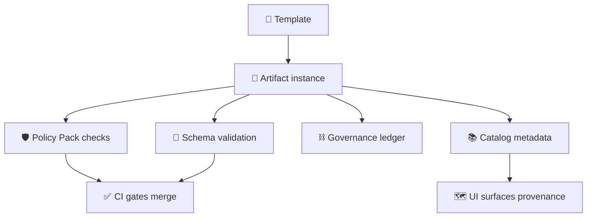
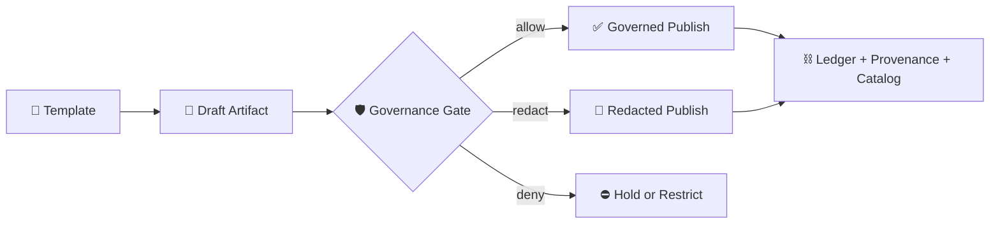

<div align="center">

# 🧩 MCP Templates

`mcp/templates/` — reusable, **governed** templates for **Master Coder Protocol (MCP)** artifacts inside **Kansas Frontier Matrix (KFM)**.


**Purpose**  
Make “documentation-first” real: consistent structure ✅, strong provenance 🧾, governance-by-default 🛡️, and reproducible workflows 🧪 — so the UI can always show *“the map behind the map”* 🗺️🔍.

</div>

---

## 🧭 Quick Links

- 🚀 [Quick Start](#-quick-start)
- 🧩 [Template Ecosystem](#-template-ecosystem)
- 🗂️ [Directory Layout](#-directory-layout)
- 🧱 [Template Inventory](#-template-inventory)
- 🧬 [Shared Conventions](#-shared-conventions)
- 🛡️ [Governance and Safety Defaults](#-governance-and-safety-defaults)
- ✅ [Validation and CI Hooks](#-validation-and-ci-hooks)
- 🧰 [Template Skeletons](#-template-skeletons)
- 📦 [Promotion Path](#-promotion-path)
- 📚 [Project Library](#-project-library)
- 🤝 [Contributing](#-contributing)
- 🕰️ [Version History](#-version-history)

---

## 🚀 Quick Start

> [!IMPORTANT]
> **Templates are contracts, not examples.** Copy them first, then customize the copy. Never “one-off edit” the template file.

1. **Pick the closest template** in this folder (or add a new one with governance review 🛡️).
2. **Copy + rename** using the naming rules below (don’t edit templates in-place for one-off docs).
3. **Fill the YAML front-matter** completely (use `TBD` / `n/a` instead of deleting keys).
4. **Attach the evidence triplet** (KFM’s “catalog-driven” / “evidence-first” backbone ⛓):
   - 🛰️ **STAC** for assets/items/collections (what exists)
   - 🗃️ **DCAT** for discovery/catalog metadata (how to find it)
   - 🧬 **PROV / OpenLineage** for lineage & runs (how it was produced)
5. **Run validation** locally (schema + lint + policy pack) before opening a PR.
6. **Log governance + provenance**:
   - add/update evidence manifest
   - compute checksums & reference commit SHAs
   - append governance ledger event (if applicable)
7. **Promote** draft artifacts into governed locations once stable (see [Promotion Path](#-promotion-path) 📦).

---

## 📌 What lives here

This folder holds **reusable templates** for MCP artifacts that must be:

- **repeatable** 🔁
- **auditable** 🧾
- **policy-gated** 🛡️
- **deterministic where practical** 🎯
- **source-citable by default** 📑

### Common template families

- 🧪 **Experiment logs & results appendices** (hypotheses, variables, method, outcomes)
- 🧾 **SOPs & runbooks** (repeatable ops + verification + rollback)
- 🪪 **Model cards & evaluation reports** (data, metrics, risks, intended use)
- 📦 **Dataset cards** (STAC/DCAT pointers + rights + sensitivity)
- 🧬 **Provenance bundles** (PROV/OpenLineage + hashes + agents)
- 🔎 **Evidence manifests** (claim → evidence mapping)
- 🧠 **Prompt & retrieval templates** (citation slots + redaction posture + determinism notes)
- 🕸️ **Graph query templates** (bounded traversal + parameterized inputs + safe projections)
- 🧷 **Policy & release support** (OPA policy stubs, SBOM/SLSA/Sigstore attestation scaffolds)

> 🧠 Rule of thumb: if it’s something we repeat and want to **standardize + audit**, it belongs in a governed template set (usually here or `docs/templates/`).

---

## 🧩 Template Ecosystem

KFM treats **templates + schemas + policies** as a single system:



### Where templates live across the repo

- ✅ `mcp/templates/` → MCP artifacts (experiments, SOPs, model/data cards, provenance)
- 📄 `docs/templates/` → narrative & platform docs (universal docs, story nodes, incident reports)
- 📐 `schemas/` → JSON Schema / profile definitions for:
  - YAML front-matter
  - STAC/DCAT/PROV extensions
  - query envelopes & manifests
- 🛡️ `tools/validation/policy/` → **OPA/Rego policy pack** (validated in CI via Conftest)

> [!TIP]
> If you add a template, consider it incomplete until you also add:
> **(1)** a schema/profile reference, **(2)** a policy/test expectation, and **(3)** a validation hook.

---

## 🗂️ Directory Layout

> This is the *intended* structure. Keep it **boring, predictable, and searchable** 🔍.

```text
📁 mcp/
├── 📁 templates/                               # ✅ you are here
│   ├── 📄 README.md                            # This file
│   │
│   ├── 📁 experiments/
│   │   ├── 🧾 TEMPLATE__EXPERIMENT_LOG.md
│   │   ├── 🧾 TEMPLATE__EXPERIMENT_INDEX.md
│   │   └── 🧾 TEMPLATE__RESULTS_APPENDIX.md
│   │
│   ├── 📁 sops/
│   │   ├── 🧾 TEMPLATE__SOP.md
│   │   ├── 🧾 TEMPLATE__RUNBOOK.md
│   │   ├── 🧾 TEMPLATE__ROLLBACK_RUNBOOK.md
│   │   └── 🧾 TEMPLATE__INCIDENT_REVIEW.md
│   │
│   ├── 📁 model_cards/
│   │   ├── 🧾 TEMPLATE__MODEL_CARD.md
│   │   └── 🧾 TEMPLATE__EVALUATION_REPORT.md
│   │
│   ├── 📁 data_cards/
│   │   ├── 🧾 TEMPLATE__DATASET_CARD.md
│   │   ├── 🧾 TEMPLATE__STAC_ITEM.json
│   │   ├── 🧾 TEMPLATE__STAC_COLLECTION.json
│   │   └── 🧾 TEMPLATE__DCAT_DATASET.jsonld
│   │
│   ├── 📁 provenance/
│   │   ├── 🧾 TEMPLATE__PROV_BUNDLE.jsonld
│   │   ├── 🧾 TEMPLATE__OPENLINEAGE_EVENT.json
│   │   ├── 🧾 TEMPLATE__EVIDENCE_MANIFEST.json
│   │   ├── 🧾 TEMPLATE__RUN_MANIFEST.json          # simulations / pipelines
│   │   └── 🧾 TEMPLATE__PROVENANCE_ATTESTATION.md   # human sign-off summary
│   │
│   ├── 📁 prompts/
│   │   ├── 🧾 TEMPLATE__PROMPT_GUARDRAILS.md
│   │   ├── 🧾 TEMPLATE__HYDE_PROMPT.md
│   │   └── 🧾 TEMPLATE__RAG_TRACE.json              # optional: retrieval trace
│   │
│   ├── 📁 graph_queries/
│   │   ├── 🧾 TEMPLATE__CYPHER_QUERY.cypher
│   │   └── 🧾 TEMPLATE__QUERY_ENVELOPE.json
│   │
│   ├── 📁 policy_support/                           # templates that support policy-as-code
│   │   ├── 🧾 TEMPLATE__OPA_POLICY.rego
│   │   └── 🧾 TEMPLATE__CONFTEST_TEST.yaml
│   │
│   ├── 📁 release_support/                          # supply chain scaffolding
│   │   ├── 🧾 TEMPLATE__SBOM_SPDX.json
│   │   ├── 🧾 TEMPLATE__SLSA_ATTESTATION.json
│   │   └── 🧾 TEMPLATE__SIGSTORE_BUNDLE.json
│   │
│   ├── 📁 glossary/
│   │   └── 🧾 TEMPLATE__GLOSSARY_ENTRY.md
│   │
│   └── 📁 agents/                                   # W-P-E automation artifacts
│       ├── 🧾 TEMPLATE__WPE_ALERT.json
│       ├── 🧾 TEMPLATE__WPE_PLAN.md
│       └── 🧾 TEMPLATE__WPE_EXECUTION_LOG.ndjson
│
└── 📁 ...                                           # other MCP modules (experiments, notebooks, etc.)
```

> [!NOTE]
> Story Nodes (interactive narrative content) are usually templated under `docs/templates/` rather than `mcp/templates/`, because they are UI-facing narrative artifacts (Markdown + JSON config).

---

## 🧱 Template Inventory

### Core MCP templates

| Template | Output | When to use | Must include |
|---|---|---|---|
| `TEMPLATE__EXPERIMENT_LOG.md` | Experiment record | Any hypothesis/test/run | Variables, method, artifacts, results, decision ✅ |
| `TEMPLATE__EXPERIMENT_INDEX.md` | Experiment index | You have multiple related runs | Run IDs, links, status, summary 🔁 |
| `TEMPLATE__RESULTS_APPENDIX.md` | Appendix | Heavy tables/plots | Raw metrics, plots, assumptions 📊 |
| `TEMPLATE__SOP.md` | SOP | Repeatable operational steps | Preconditions, steps, verification, rollback 🪜 |
| `TEMPLATE__RUNBOOK.md` | Runbook | Operational response | Symptoms, decision tree, fixes 🧯 |
| `TEMPLATE__INCIDENT_REVIEW.md` | Incident review | Postmortems | Timeline, root cause, corrective actions 🧾 |
| `TEMPLATE__MODEL_CARD.md` | Model card | Any model deployed/benchmarked | Data, metrics, risks, intended use 🪪 |
| `TEMPLATE__EVALUATION_REPORT.md` | Eval report | Formal benchmarking | Metrics, slices, calibration, failure cases 📏 |
| `TEMPLATE__DATASET_CARD.md` | Dataset card | Any dataset used/published | STAC/DCAT refs, quality, rights, sensitivity 📦 |
| `TEMPLATE__PROV_BUNDLE.jsonld` | PROV bundle | Any pipeline step worth auditing | Agents, activities, entities, hashes ⛓ |
| `TEMPLATE__OPENLINEAGE_EVENT.json` | OpenLineage event | Pipeline/ETL steps | Run IDs, inputs/outputs, timings 🧬 |
| `TEMPLATE__EVIDENCE_MANIFEST.json` | Evidence manifest | Any doc with claims | Evidence IDs, sources, access notes 🔎 |
| `TEMPLATE__PROMPT_GUARDRAILS.md` | Prompt guardrails | Any AI prompt template | Citations required, redaction rules 🧠 |
| `TEMPLATE__HYDE_PROMPT.md` | Retrieval prompt | Controlled query expansion | Determinism notes, safe expansion 🧠 |
| `TEMPLATE__CYPHER_QUERY.cypher` | Graph query | Graph retrieval | Parameterization, bounded traversal 🕸️ |
| `TEMPLATE__QUERY_ENVELOPE.json` | Query envelope | Query execution wrapper | Depth/fanout caps, safe projections 🧷 |
| `TEMPLATE__GLOSSARY_ENTRY.md` | Glossary entry | New term/acronym | Definition, scope, synonyms, sources 📖 |

### Support templates aligned to KFM governance

| Template | Output | Why it exists |
|---|---|---|
| `TEMPLATE__OPA_POLICY.rego` | OPA policy stub | Make governance rules versioned, testable, enforceable 🛡️ |
| `TEMPLATE__CONFTEST_TEST.yaml` | Conftest test | Gate changes in CI with clear, actionable failures ✅ |
| `TEMPLATE__SBOM_SPDX.json` | SBOM | Release integrity & dependency visibility 📦 |
| `TEMPLATE__SLSA_ATTESTATION.json` | SLSA attestation | Prove how an artifact was produced 🧾 |
| `TEMPLATE__SIGSTORE_BUNDLE.json` | Sigstore bundle | Signed artifacts + verifiable provenance 🔏 |
| `TEMPLATE__WPE_PLAN.md` | Agent plan | Human-reviewable automation planning 🤝 |
| `TEMPLATE__WPE_EXECUTION_LOG.ndjson` | Execution log | Append-only trace of what ran, with hashes 🧾 |

> 🧩 If a template is missing: add it here, **then** roll it out into usage across the repo.

---

## 🧬 Shared Conventions

### 1) Naming rules 🏷️

Use **UPPER_SNAKE** with clear domains:

- `TEMPLATE__EXPERIMENT_LOG.md`
- `TEMPLATE__MODEL_CARD.md`
- `TEMPLATE__STAC_ITEM.json`
- `TEMPLATE__OPA_POLICY.rego`

Optional: include versions if multiple coexist:

- `TEMPLATE__MODEL_CARD__v2.md`

### 2) Contract-first docs 🔒

KFM is **contract-first**:
- templates ↔ schemas ↔ policy pack
- any change should keep tooling stable

Rules of thumb:
- Assume template edits are **breaking** unless proven otherwise.
- Prefer additive fields with backward-compatible defaults.

### 3) YAML front-matter expectations 🧾

Every governed doc template should include (minimum):

- **identity**: `title`, `path`, `version`, `last_updated`, `doc_uuid`
- **status**: `status`, `doc_kind`
- **governance**: `fair_category`, `care_label`, `sensitivity`, `classification`, `jurisdiction`
- **integrity**: `commit_sha`, `doc_integrity_checksum`
- **schema hooks**: `schema_ref`, `profile_refs`
- **evidence hooks**: `evidence_manifest_ref`, `stac_ref`, `dcat_ref`, `prov_ref`, `ledger_ref`
- **repro**: `run_seed`, `idempotency_key`, `determinism_notes`

✅ **Do not delete fields** — use `TBD` / `n/a` to keep validation stable.

### 4) Evidence-first writing 🔎

If a template produces narrative or decisions, it must provide a place to record:

- evidence IDs / citations
- dataset identifiers (STAC/DCAT)
- provenance bundles (PROV/OpenLineage)
- commit/issue references

Recommended citation style in governed docs:
- `【source†lines】` or equivalent *stable source pointers* (so claims always map to evidence).

### 5) Determinism posture 🎯

- Prefer stable `ORDER BY` + explicit `LIMIT`.
- Pin dependencies and record versions.
- Use explicit seeds (`run_seed`) for simulations/ML where possible.
- If bitwise determinism is not possible, **declare it** (`determinism_notes`) and record variability bounds.

### 6) GitHub-stable formatting 🧱

- Keep heading levels consistent (H1 → H2 → H3).
- Prefer short paragraphs + tables.
- Use `<details>` blocks for long examples (don’t hide critical info inside them).
- Avoid giant walls of text; aim for scan-friendly docs 🧠.

---

## 🛡️ Governance and Safety Defaults

Templates MUST be safe by default:

- 🚫 No secrets, tokens, signed URLs, or internal endpoints.
- 🚫 No raw protected coordinates or sensitive location disclosure.
- 🧭 Prefer **region-level** spatial scope (county/admin region IDs) when needed.
- ✅ Always surface governance state explicitly (placeholders are fine):
  - `care_label`
  - `classification`
  - `sensitivity`
  - `sovereignty_gate` (if used)
  - `redaction_required`

### Non-negotiables for retrieval and query templates 🧷

- **No unbounded traversal**: cap depth, fan-out, node/edge limits.
- **No sensitive leakage**: never return raw protected geometry fields.
- **No string-concatenated queries**: parameterize inputs.
- **Deterministic ordering**: stable `ORDER BY` before `LIMIT`.
- **API boundary**: UI/content layers should not bypass the catalog/provenance layer.

### AI templates must assume governance checks

AI in KFM is built around:
- “Answer with citations” outputs 📑
- policy checks before responses are returned 🛡️
- advisory-only behavior (no autonomous data mutation) 🤝

So prompt templates must include:
- citation slots for each claim
- refusal pathways when evidence is missing
- explicit redaction rules for sensitive content
- audit metadata placeholders

---

## ✅ Validation and CI Hooks

Templates are designed to pass automated checks and support a **Detect → Validate → Promote** CI pattern.

Typical gates:

- 🧹 **Docs lint**: Markdown structure, headings, a11y basics (alt text)
- 🔗 **Link validation**: no broken internal references
- 🧾 **Front-matter schema**: required keys + allowed values
- 📦 **STAC/DCAT/PROV validation**: JSON schema + profile rules
- 🛡️ **Policy Pack**: OPA/Rego policies validated via Conftest
- 🧭 **Spatial QA**: CRS checks, bounds checks, “no protected coords” scans
- 🔐 **Secrets scanning**: fail closed on tokens/keys
- ⛓ **Provenance completeness**: required hashes/IDs exist
- 📦 **Supply chain**: SBOM present for releases; attestations where required

<details>
<summary>🧪 Example workflow → ledger mapping</summary>

| Workflow | What it checks | Ledger output |
|---|---|---|
| `docs-lint.yml` | Docs validation + front-matter schema | `github-workflows-ledger.json` |
| `schema-validate.yml` | JSON Schema + profile conformance | `github-workflows-ledger.json` |
| `policy-pack.yml` | OPA/Conftest governance gates | `governance-ledger.json` |
| `stac-validate.yml` | STAC profile validation | `catalog-ledger.json` |
| `provenance-validate.yml` | PROV/OpenLineage integrity | `provenance-ledger.json` |
| `release-integrity.yml` | SBOM + checksums + attestation | `release-manifest-log.json` |

</details>

---

## 🧰 Template Skeletons

These are **mini-skeletons** to show intent. The actual templates should live as separate files in the folders above.

<details>
<summary>🧪 Experiment Log skeleton</summary>

```markdown
---
title: "🧪 Experiment — <name>"
path: "mcp/experiments/EXP-<id>.md"
version: "v0.1.0"
last_updated: "YYYY-MM-DD"
status: "draft|active|completed"
doc_kind: "Experiment Log"
license: "CC-BY-4.0"

markdown_protocol_version: "KFM-MDP v11.2.6"
mcp_version: "MCP-DL v6.3"

schema_ref: "schemas/mcp/experiment_log.schema.json"
profile_refs:
  - "schemas/profiles/kfm-prov.profile.json"

fair_category: "FAIR+CARE"
care_label: "TBD"
sensitivity: "public|restricted"
classification: "open|governed|restricted"
jurisdiction: "US-KS"
sovereignty_gate: "n/a|TBD"

doc_uuid: "urn:kfm:doc:mcp:experiment:<id>:v0.1.0"
commit_sha: "<commit>"
doc_integrity_checksum: "sha256:<fill>"

evidence_manifest_ref: "mcp/provenance/evidence/<id>.json"
stac_ref: "data/catalog/stac/items/<id>.json"
dcat_ref: "data/catalog/dcat/datasets/<id>.jsonld"
prov_ref: "data/provenance/prov/<id>.jsonld"
ledger_ref: "governance/ledger/<id>.ndjson"

run_seed: "<int-or-string>"
idempotency_key: "<stable-key>"
determinism_notes: "TBD"
---

## 📘 Overview
### Purpose
### Scope
| In Scope | Out of Scope |
|---|---|
| ... | ... |

## 🧠 Hypothesis
- H1:
- H0:

## 🧰 Design and Variables
- Independent:
- Dependent:
- Controls:

## 🧪 Procedure
1.
2.
3.

## 📦 Data and Artifacts
- Evidence manifest:
- STAC/DCAT/PROV refs:
- Code refs:

## 📊 Results
- Metrics:
- Plots/Tables:

## 🔎 Analysis
- Assumptions:
- Diagnostics:
- Uncertainty:

## ✅ Decision
- Outcome:
- Next experiment(s):

## ☑️ Definition of Done
- [ ] Front-matter complete
- [ ] Evidence triplet linked
- [ ] Results reproducible
- [ ] Governance labels correct
```

</details>

<details>
<summary>🪪 Model Card skeleton</summary>

```markdown
---
title: "🪪 Model Card — <model_name>"
path: "mcp/model_cards/<model_name>.md"
version: "v0.1.0"
last_updated: "YYYY-MM-DD"
status: "draft|active|deprecated"
doc_kind: "Model Card"
license: "CC-BY-4.0"

mcp_version: "MCP-DL v6.3"
schema_ref: "schemas/mcp/model_card.schema.json"

fair_category: "FAIR+CARE"
care_label: "TBD"
sensitivity: "public|restricted"
classification: "open|governed|restricted"
jurisdiction: "US-KS"
sovereignty_gate: "n/a|TBD"

doc_uuid: "urn:kfm:doc:mcp:model_card:<model_name>:v0.1.0"
commit_sha: "<commit>"
---

## 📘 Overview
- Intended use:
- Not intended for:

## 🧱 Model Details
- Architecture:
- Version:
- Dependencies:

## 📦 Training Data
- Dataset refs (STAC/DCAT):
- Data filtering/cleaning:
- Sensitivity/redaction notes:

## 📏 Evaluation
- Metrics:
- Slices:
- Calibration/robustness:

## ⚠️ Risks and Limitations
- Known failure modes:
- Bias considerations:
- Security considerations:

## 🛡️ Governance
- care_label:
- sovereignty_gate:
- redaction_required:
- policy_pack_version:
```

</details>

<details>
<summary>🧾 SOP skeleton</summary>

```markdown
---
title: "🧾 SOP — <procedure_name>"
path: "mcp/sops/<procedure_name>.md"
version: "v0.1.0"
last_updated: "YYYY-MM-DD"
status: "draft|active|deprecated"
doc_kind: "SOP"
license: "CC-BY-4.0"

mcp_version: "MCP-DL v6.3"
schema_ref: "schemas/mcp/sop.schema.json"
---

## 📘 Overview
### Purpose
### Scope
### Audience
### Definitions

## ✅ Preconditions
- Required access:
- Required tools:

## 🪜 Procedure
1.
2.
3.

## 🔍 Verification
- Expected outputs:
- Health checks:

## ♻️ Rollback
- How to revert safely:

## 🧯 Troubleshooting
- Common failures + fixes:

## 📎 References
- Tickets/PRs:
- Provenance bundles:
```

</details>

---

## 📦 Promotion Path

We treat docs like code, and data like evidence.



### Practical alignment with KFM data stages

- **Draft** → iterate in `data/work/…` (including simulations like `data/work/sims/…`)
- **Governed** → promote to `data/processed/…` and `data/catalog/…` with STAC/DCAT/PROV complete
- **Published** → safe for broader consumption (or restricted with explicit labels)

> [!NOTE]
> The policy pack should enforce “no skipping stages” (pipeline ordering), “no bypassing the API boundary”, and “provenance-first publishing”.

---

## 📚 Project Library

These templates are informed by KFM’s design + architecture docs and supporting reference collections.

### 🧭 Core KFM design docs

- 📄 **Kansas Frontier Matrix (KFM) – Comprehensive Architecture, Features, and Design.pdf**
- 📄 **Kansas Frontier Matrix (KFM) – Comprehensive Technical Documentation.pdf**
- 📄 **Kansas Frontier Matrix (KFM) – AI System Overview 🧭🤖.pdf**
- 📄 **Kansas Frontier Matrix – Comprehensive UI System Overview.pdf**
- 📄 **📚 Kansas Frontier Matrix (KFM) Data Intake – Technical & Design Guide.pdf**
- 📄 **Innovative Concepts to Evolve the Kansas Frontier Matrix (KFM).pdf**
- 📄 **🌟 Kansas Frontier Matrix – Latest Ideas & Future Proposals.docx.pdf**
- 📄 **Kansas-Frontier-Matrix Design Audit – Gaps and Enhancement Opportunities.pdf**

### 🧾 Governance and writing standards

- 🧾 **MARKDOWN_GUIDE_v13.md.gdoc** (contract-first docs + repo invariants)
- 🧾 **Comprehensive Markdown Guide — Syntax, Extensions, and Best Practices**
- 🧪 **Scientific Method — Research — Master Coder Protocol Documentation.pdf**

### 📚 Reference portfolios

Some files are **PDF portfolios** (collections with embedded PDFs). To inspect locally:

```bash
pdfdetach -list "AI Concepts & more.pdf"
pdfdetach -list "Data Managment-Theories-Architures-Data Science-Baysian Methods-Some Programming Ideas.pdf"
pdfdetach -list "Maps-GoogleMaps-VirtualWorlds-Archaeological-Computer Graphics-Geospatial-webgl.pdf"
pdfdetach -list "Various programming langurages & resources 1.pdf"
```

- 📦 **AI Concepts & more.pdf** (AI references, multi-agent, deep learning, governance)
- 📦 **Data Managment-Theories-Architures-Data Science-Baysian Methods-Some Programming Ideas.pdf**
- 📦 **Maps-GoogleMaps-VirtualWorlds-Archaeological-Computer Graphics-Geospatial-webgl.pdf**
- 📦 **Various programming langurages & resources 1.pdf**

<details>
<summary>📎 Optional: small curated list of embedded references</summary>

- 🧠 AI & ML: deep learning texts, multi-agent patterns, RAG, evaluation
- 🗺️ Geospatial & visualization: WebGL, mapping systems, virtual worlds, cartography
- 🧱 Data systems: data architecture, data spaces, Bayesian methods
- 🧰 Programming compendium: language references and engineering patterns

</details>

---

## 🤝 Contributing

### ✅ PR checklist for template changes

- [ ] Template name follows convention (`TEMPLATE__...`)
- [ ] YAML front-matter keys are complete (no deletions; use `TBD`)
- [ ] Template has a schema/profile reference (`schema_ref` / `profile_refs`)
- [ ] No secrets / tokens / internal endpoints
- [ ] No sensitive geometry leakage (or explicitly redacted & labeled)
- [ ] Examples are redaction-safe and deterministic where required
- [ ] Policy pack expectations updated (OPA/Conftest) when needed
- [ ] CI checks pass (docs lint + schema validation + link checks + policy pack)
- [ ] Version history updated

---

## 🕰️ Version History

| Version | Date | Author | Summary |
|---:|---|---|---|
| v0.2.0 | 2026-01-19 | KFM Core | Align templates with contract-first + policy pack + evidence triplet. Add W-P-E, supply chain support, and ecosystem links. |
| v0.1.0 | 2026-01-08 | KFM Core | Initial README for MCP template system (inventory + conventions + skeletons). |

---

<div align="center">

🧩 **KFM — MCP Templates** · Governed for Integrity · Built for Reuse

`mcp/templates/README.md`


</div>
