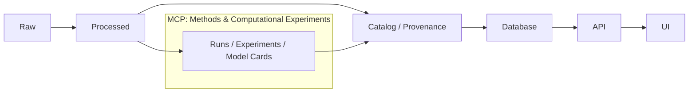

# 🧪 MCP Templates


> **Purpose:** This folder contains the standardized, copy‑paste templates used by the project’s **MCP layer** (`mcp/`) to keep experiments **transparent**, **repeatable**, and **auditable**.  
> Think: *lab notebook meets engineering runbook* 🧾⚙️

---

## 🧭 Jump To

- [What belongs in `mcp/templates/`?](#-what-belongs-in-mcptemplates)
- [Quickstart](#-quickstart)
- [Template Catalog](#-template-catalog)
- [Conventions](#-conventions)
- [Evidence & Provenance Hooks](#-evidence--provenance-hooks)
- [Quality Gates](#-quality-gates)
- [Add / Update a Template](#-add--update-a-template)
- [FAQ](#-faq)

---

## 📦 What belongs in `mcp/templates/`?

`mcp/templates/` is where we keep **reusable scaffolds** for MCP artifacts, including:

- 🧪 **Experiment reports** (design → execution → results → interpretation)
- 🏃 **Run logs** (a single execution record: params, inputs, outputs, environment)
- 🧠 **Model cards** (capabilities, limits, intended use, risks)
- 📄 **SOPs / runbooks** (repeatable operational procedures)
- ✅ **Checklists** (reproducibility, review, governance, release readiness)

If it’s something you **copy**, fill out, and commit to preserve **how** and **why** work was done — it’s a template ✅

---

## 🚀 Quickstart

1. **Pick the right template** from this folder.
2. **Copy** it into its destination folder (examples below).
3. **Rename** it using the naming rules in [Conventions](#-conventions).
4. **Fill in every required field** (look for ✅ Required markers).
5. **Link everything**: data inputs, code commit, config files, artifacts, and any provenance/metadata entries.
6. **Commit** with a message that explains the “why”, not just the “what”.

> Tip: If you’re doing this more than twice, you probably need a better template or a checklist update 🛠️

---

## 🗂️ Template Catalog

> File names below are the **recommended standard** for this repo.  
> If a template doesn’t exist yet, create it here with the same naming pattern.

| Template | Use it when… | Typical destination after copy |
|---|---|---|
| `TEMPLATE__EXPERIMENT_REPORT.md` 🧪 | You’re testing a method, model, extraction approach, or evaluation | `mcp/experiments/EXP-*/` |
| `TEMPLATE__RUN_LOG.md` 🏃 | You ran a pipeline/script/notebook and need an execution record | `mcp/runs/` (or under an experiment folder) |
| `TEMPLATE__MODEL_CARD.md` 🧠 | A model is trained/selected and might be reused, shipped, or cited | `mcp/model_cards/` |
| `TEMPLATE__DATASET_DATASHEET.md` 🗃️ | You created/ingested a dataset (or derived artifact) worth reusing | `data/**/` + `docs/` reference |
| `TEMPLATE__SOP.md` 📄 | There’s an operational procedure others must repeat exactly | `docs/runbooks/` or `mcp/sops/` |
| `TEMPLATE__REVIEW_CHECKLIST.md` ✅ | You want a consistent review gate before merge/release | `docs/checklists/` |

---

## 🧱 Conventions

### 🏷️ Naming & IDs

Use consistent IDs so we can trace history quickly:

- **Experiments:** `EXP-YYYYMMDD-<short-slug>/`
  - Example: `EXP-20260129-ner-place-extraction/`
- **Experiment report file:** `REPORT__EXP-YYYYMMDD-<slug>.md`
- **Run logs:** `RUN-YYYYMMDD-HHMM__<short-slug>.md`
- **Model cards:** `MODEL_CARD__<model-name>__vX.Y.md`
- **SOPs:** `SOP__<domain>__<task>__vX.Y.md`

> The goal is *human scanning + machine parsing* 👀🤖

---

### 🧾 Recommended Front Matter (YAML)

Templates should start with YAML front matter to enable indexing and automation:

```yaml
---
id: EXP-YYYYMMDD-<slug>              # ✅ Required (or RUN-/MODEL_CARD-/SOP-)
title: "<human title>"               # ✅ Required
status: draft | in_review | approved
owners:
  - "<name-or-handle>"
created: YYYY-MM-DD
updated: YYYY-MM-DD

tags: ["mcp", "experiment", "etl", "ocr", "nlp"]

inputs:
  datasets:
    - id: "<dataset-id>"
      path: "data/raw/<...>"
      version: "<git-tag-or-hash>"
      checksum: "<optional>"
  code:
    repo_path: "<relative path>"
    commit: "<git sha>"
  config:
    - "configs/<...>.yml"

outputs:
  artifacts:
    - "data/processed/<...>"
    - "mcp/runs/<...>"
  metadata:
    - "data/catalog/<...>.json"
    - "data/provenance/<...>.json"

governance:
  access: public | restricted
  sensitivity: none | pii | cultural_sensitive | embargoed
---
```

---

## 🧬 Evidence & Provenance Hooks

### 🔁 “Pipeline Order” (don’t bypass)

KFM work is intentionally structured so data and results are **vetted** before they become user-facing.  
When your experiment creates a new artifact (dataset, layer, metric, narrative, model), don’t “ship” it straight to the UI.



### 🧾 What to link in every MCP artifact

At minimum, your filled template should link to:

- 🧷 **Inputs:** dataset IDs/paths, source references, and versions
- 🧷 **Code:** commit hash + entrypoint command (or notebook path)
- 🧷 **Config:** parameter files, seeds, feature flags
- 🧷 **Outputs:** artifacts + where they live in the repo
- 🧷 **Provenance:** which provenance/metadata records were created/updated
- 🧷 **Interpretation:** what changed, what you learned, what to do next

> If someone can’t rerun it from your template + repo state, it’s not “done” yet ✅

---

## ✅ Quality Gates

Before merging MCP outputs, use these gates:

### 🔬 Reproducibility Gate
- [ ] Environment is specified (e.g., container, `requirements.txt`, versions)
- [ ] Inputs are versioned and traceable (hash/ID)
- [ ] Randomness is controlled (seeds documented if relevant)
- [ ] Command(s) to reproduce are written and tested

### 👥 Review Gate
- [ ] Another contributor can follow your report without asking you questions
- [ ] Claims are backed by linked artifacts (tables, charts, logs, metrics)
- [ ] Deviations from plan are documented (what changed and why)

### 🛡️ Governance Gate
- [ ] License/rights for inputs are documented
- [ ] Sensitive content is flagged and access level is set
- [ ] Any restricted data is not exposed in public artifacts

---

## 🧩 Add / Update a Template

When you notice repetition, paper cuts, or missing fields:

1. Add or revise the template in `mcp/templates/`
2. Include a short changelog section at the bottom of the template:
   - What changed
   - Why it changed
   - What old docs may need to update
3. If automation relies on parsing, keep YAML keys stable

> Templates are *interfaces*. Breaking changes should be treated like API changes 🧯

---

## ❓ FAQ

### “Should this be in `docs/templates/` instead?”
- Use **`mcp/templates/`** for experiment/run/model/process documentation.
- Use **`docs/templates/`** for narrative docs, architecture specs, story node patterns, or governance documentation.

### “Do I need both an Experiment Report and a Run Log?”
Usually:
- ✅ **Experiment Report** = *the narrative + interpretation*
- ✅ **Run Log** = *the execution record(s)*  
Large experiments often have **1 report** and **many run logs**.

### “What if the experiment fails?”
Perfect — document it. Failure logs prevent repeated mistakes and preserve negative results 🧠

---

## 🧰 Related Paths (mental map)

```text
📦 repo/
├─ 🧪 mcp/
│  ├─ 🧩 templates/        👈 you are here
│  ├─ 🧪 experiments/
│  ├─ 🏃 runs/
│  ├─ 🧠 model_cards/
│  └─ 📓 notebooks/
├─ 🗃️ data/
│  ├─ raw/
│  ├─ processed/
│  ├─ catalog/
│  └─ provenance/
└─ 📚 docs/
   ├─ templates/
   ├─ runbooks/
   └─ checklists/
```

---

## 🏁 Final note

MCP templates are here to ensure the project stays:

- **Evidence-backed** 📌
- **Transparent & auditable** 🔍
- **Collaborative & teachable** 🤝
- **Ethically grounded** 🛡️

If a template makes your work *slower* in the long run, improve the template — don’t skip the rigor.
