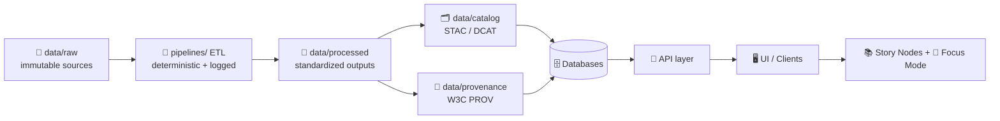

# MCP Templates 🧰

    

**Goal:** make experiments, runs, and reusable workflows *copy/paste reproducible* ✅  
**How:** use templates that force provenance, evidence, governance, and deterministic steps into every artifact.

<!-- KFM provenance-first + traceability premise:  [oai_citation:0‡Kansas Frontier Matrix (KFM) – Comprehensive Technical Blueprint.pdf](sediment://file_000000006dbc71f89a5094ce310a452d) -->

---

## 🔎 Quick links

- [What belongs here](#-what-belongs-here)
- [How this fits the KFM pipeline](#-how-this-fits-the-kfm-pipeline)
- [Template index](#-template-index)
- [Quick start](#-quick-start)
- [Naming conventions](#-naming-conventions)
- [Minimum quality gates](#-minimum-quality-gates)
- [Provenance linking rules](#-provenance-linking-rules)
- [Maintaining templates](#-maintaining-templates)
- [References](#-references)

---

## 📦 What belongs here

This folder holds **governed templates** for the *MCP* (Master Coder Protocol) artifacts that live under `mcp/` (and that are expected to be reviewed like code).

Typical MCP artifacts include:

- 🧪 **Experiment reports** (hypothesis → method → results → interpretation)
- 🧾 **Run logs** (inputs/params/env → outputs → validation)
- 📋 **SOPs** (repeatable, reviewable procedures)
- 🧠 **Model cards** and 📄 **dataset datasheets** (when/if enabled in your repo layout)

<!-- Repo structure includes mcp/ + runs/ + experiments/:  [oai_citation:1‡MARKDOWN_GUIDE_v13.md.gdoc](file-service://file-UYVruFXfueR8veHMUKeugU) -->
<!-- MCP-compatible artifacts called out (experiment reports + SOPs + model cards/datasheets):  -->

> ⚠️ **Fail-closed mindset:** if a required check/policy is missing, KFM blocks the merge rather than “letting it slide.”  
> Treat templates as **contracts**, not suggestions.  
<!-- Fail-closed governance:  [oai_citation:2‡Kansas Frontier Matrix (KFM) – Comprehensive Technical Blueprint.pdf](sediment://file_000000006dbc71f89a5094ce310a452d) -->

---

## 🧭 How this fits the KFM pipeline

KFM’s canonical flow is **Raw → Processed → Catalog/Prov → Database → API → UI**. MCP artifacts exist to make every transformation and claim *auditable and repeatable*.

<!-- Canonical pipeline order:  [oai_citation:3‡Kansas Frontier Matrix (KFM) – Comprehensive Technical Blueprint.pdf](sediment://file_000000006dbc71f89a5094ce310a452d) -->
<!-- Deterministic, idempotent, fully-logged ETL + evidence-first + contract-first:  -->



---

## 🗂️ Template index

> This README documents the **intended template set** for `mcp/templates/`.  
> If your repo currently uses different filenames, keep the concepts and update the table to match actual files.

| Template type 🧩 | Use when ✅ | Copy to 📌 | Must include 🔒 |
|---|---|---|---|
| 🧪 Experiment Report | You’re testing a hypothesis, evaluating a model, validating a dataset transform | `mcp/experiments/EXP-####__slug.md` | Objective, method, variables, results, interpretation, reproducibility steps, provenance links |
| 🧾 Run Log | You executed a pipeline/run and need a forensic record | `mcp/runs/RUN-YYYYMMDD-####__slug.md` | Inputs (IDs + hashes), params, env, outputs, validation checks, links to STAC/DCAT/PROV |
| 📋 SOP | A workflow repeats (ingestion, QC, metadata authoring, release checks) | `mcp/sops/SOP-####__slug.md` *(if enabled)* | Purpose, prerequisites, procedure, expected outcome, troubleshooting, governance gates |
| 🧠 Model Card | Any model used in KFM needs transparent intent + limits | `mcp/model_cards/MODEL-####__slug.md` *(if enabled)* | Training data references, evaluation, limitations, risks, intended use |
| 📄 Dataset Datasheet | A dataset needs “nutrition labels” beyond STAC/DCAT | `mcp/datasheets/DATASET-####__slug.md` *(if enabled)* | License + source, collection context, transformations, known issues, intended use |

<!-- Experiment report template sections (Goals/Data Used/Method/Results/Interpretation) + model cards in docs:  [oai_citation:4‡Scientific Method _ Research _ Master Coder Protocol Documentation.pdf](file-service://file-HTpax4QbDgguDwxwwyiS32) -->
<!-- SOP template sections Purpose/Prereqs/Procedure/Expected Outcome/Troubleshooting:  -->

---

## 🚀 Quick start

### 1) Pick the right template
- If it’s **a claim**, use an **Experiment Report**
- If it’s **an execution**, use a **Run Log**
- If it’s **repeatable operations**, use an **SOP**

### 2) Copy → rename → fill placeholders
Example (adjust filenames to your actual template names):
```bash
cp mcp/templates/TEMPLATE__MCP_EXPERIMENT_REPORT.md \
   mcp/experiments/EXP-0007__place_extraction_eval.md
```

### 3) Link evidence (don’t just describe it)
Every MCP artifact must point to:
- 📦 `data/raw` inputs (source snapshot)
- 🧪 `data/processed` outputs (derived artifacts)
- 🗂️ `data/catalog` (STAC/DCAT)
- 🧾 `data/provenance` (PROV lineage)
- 🔁 the exact `commit_sha` / run ID / environment

---

## 🏷️ Naming conventions

Use **stable IDs** so you can reference work across issues, PRs, docs, and the UI:

- `EXP-####__short_slug.md` → experiment reports
- `RUN-YYYYMMDD-####__short_slug.md` → run logs
- `SOP-####__short_slug.md` → standard operating procedures *(if enabled)*
- `MODEL-####__short_slug.md` → model cards *(if enabled)*
- `DATASET-####__short_slug.md` → datasheets *(if enabled)*

**Slug rules:** lowercase, hyphen/underscore ok, no spaces, keep it short.

---

## ✅ Minimum quality gates

KFM treats documentation quality as a build artifact (like code). Your MCP doc should clear these gates:

### 📌 Required (author checklist)
- [ ] YAML front-matter present and filled (no deleted required fields; use `TBD`/`n/a` instead)
- [ ] Clear scope (what this does *and does not* claim)
- [ ] Repro steps include **commands + parameters + environment**
- [ ] Inputs and outputs are referenced by **IDs and/or hashes**
- [ ] All factual claims are cited to data/provenance (or clearly marked as hypothesis)
- [ ] Links are valid (internal + external)
- [ ] Any sensitive content is correctly classified/labeled

<!-- CI/DoD: front-matter valid, schema validation, link/reference validation, governance fields:  -->
<!-- YAML front-matter + DoD checklist pattern:  [oai_citation:5‡Comprehensive Markdown Guide_ Syntax, Extensions, and Best Practices.docx](file-service://file-J6rFRcp4ExCCeCdTevQjxz) -->

### 🧪 Strongly recommended (reviewer-friendly)
- [ ] Add a **“What changed vs last run”** section (even if “first run”)
- [ ] Add a **“Failure modes & uncertainty”** section
- [ ] Add **acceptance criteria** (what would falsify the hypothesis?)

---

## 🔗 Provenance linking rules

If an artifact influences the graph, API, UI, or narrative layers, it must be traceable:

### ✅ Minimum set of pointers
- **Source snapshot**: where did raw data come from (and when)?
- **Transform**: what code/steps produced the derived output?
- **Catalog IDs**: STAC Item/Collection IDs and/or DCAT dataset IDs
- **Lineage**: PROV activity/entity references
- **Runtime identity**: `run_id`, `commit_sha`, and environment fingerprint (container digest or lockfile hash)

> 🧭 **No shortcuts:** features that bypass metadata/provenance or skip pipeline stages are considered flawed unless proven otherwise.  
<!-- Canonical “no shortcuts” rule:  [oai_citation:6‡Kansas Frontier Matrix (KFM) – Comprehensive Technical Blueprint.pdf](sediment://file_000000006dbc71f89a5094ce310a452d) -->

---

## 🤖 AI usage disclosure

KFM can use AI to assist—but **humans remain accountable** for what gets merged.

If AI contributed materially to a doc/template artifact, add a short disclosure block:

- Tool/model used
- What it generated (e.g., draft summary, metadata draft)
- What a human verified/changed

<!-- AI-in-the-loop with human review emphasis:  [oai_citation:7‡Kansas Frontier Matrix (KFM) – Comprehensive Technical Blueprint.pdf](sediment://file_000000006dbc71f89a5094ce310a452d) -->

---

## 🧩 Maintaining templates

Templates are governed. When editing or adding a template:

1. 🧷 Keep the **section order stable** (it’s part of the protocol)
2. 🔢 Bump template version (in front-matter and/or header)
3. 🧪 Ensure it still matches CI expectations (front-matter + headings + schema)
4. 📝 Update this README’s **Template index** table
5. 👀 Prefer PR review by someone who uses the template in practice

---

## 📚 References

Project inputs used to define these MCP template expectations:

- Kansas Frontier Matrix (KFM) – Comprehensive Technical Blueprint (provenance-first, fail-closed, canonical pipeline order)  [oai_citation:8‡Kansas Frontier Matrix (KFM) – Comprehensive Technical Blueprint.pdf](sediment://file_000000006dbc71f89a5094ce310a452d)  
- MASTER_GUIDE_v13.md.gdoc (v13 invariants: evidence-first, contract-first, deterministic ETL, CI gates)  [oai_citation:9‡Kansas-Frontier-Matrix_ Open-Source Geospatial Historical Mapping Hub Design.pdf](file-service://file-ShqHKgjxCS9UT9vbcxDNzA)  
- MARKDOWN_GUIDE_v13.md.gdoc (repo layout map including `mcp/`)  [oai_citation:10‡MARKDOWN_GUIDE_v13.md.gdoc](file-service://file-UYVruFXfueR8veHMUKeugU)  
- Kansas Frontier Matrix — Open-Source Geospatial Historical Mapping Hub Design and Technical Feature Set (MCP-compatible experiment/SOP/model-card patterns)  [oai_citation:11‡Kansas-Frontier-Matrix_ Open-Source Geospatial Historical Mapping Hub Design.pdf](file-service://file-BJN3xmP44EHc9NRCccCn4H)  
- Scientific Method / Research / Master Coder Protocol Documentation (protocol & experiment/SOP structuring)  [oai_citation:12‡Scientific Method _ Research _ Master Coder Protocol Documentation.pdf](file-service://file-HTpax4QbDgguDwxwwyiS32)  
- Comprehensive Markdown Guide_ Syntax, Extensions, and Best Practices (YAML front-matter + Definition of Done patterns)  [oai_citation:13‡Comprehensive Markdown Guide_ Syntax, Extensions, and Best Practices.docx](file-service://file-J6rFRcp4ExCCeCdTevQjxz)  