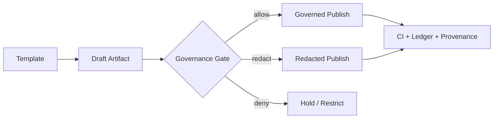

# 🧩 MCP Templates

`mcp/templates/` — reusable, governed templates for **Master Coder Protocol (MCP)** artifacts in **Kansas Frontier Matrix (KFM)**.

**Purpose**  
Make “documentation-first” real: consistent structure ✅, strong provenance 🧾, governance-by-default 🛡️, and reproducible workflows 🧪.

---

## 🧭 Quick Links

- 🚀 [Quick Start](#-quick-start)
- 🗂️ [Directory Layout](#️-directory-layout)
- 🧱 [Template Inventory](#-template-inventory)
- 🧬 [Shared Conventions](#-shared-conventions)
- 🛡️ [Governance Defaults](#️-governance--safety-defaults)
- ✅ [Validation & CI](#-validation--ci-hooks)
- 🧰 [Template Skeletons](#-template-skeletons)
- 📚 [Project Library](#-project-library)
- 🤝 [Contributing](#-contributing)
- 🕰️ [Version History](#️-version-history)

---

## 🚀 Quick Start

1. **Pick the closest template** in this folder (or add a new one with governance review 🛡️).
2. **Copy + rename** using the naming rules below (don’t edit templates in-place for one-off docs).
3. **Fill the YAML front-matter** completely (use `TBD` / `n/a` instead of deleting keys).
4. **Attach evidence + provenance**:
   - datasets → STAC/DCAT
   - processes → PROV/OpenLineage
   - decisions → issue/PR links + commit hashes
5. **Run validation** (lint + schema + link checks) before opening a PR.
6. **Promote** draft artifacts into governed locations once stable (see “Promotion Path” 📦).

---

## 📌 What lives here

This folder holds **templates** for MCP artifacts, including:

- 🧪 **Experiment logs** (scientific method, controlled variables, results, analysis)
- 🧾 **SOPs / runbooks** (repeatable operational procedure + verification steps)
- 🪪 **Model cards** (training data, metrics, risk, governance posture)
- 📦 **Dataset cards** (STAC/DCAT pointers + provenance anchors)
- 📖 **Glossary entries** (canonical definitions + linkable IDs)
- 🧠 **Prompt & query templates** (deterministic, provenance-logged, policy-gated)
- 🕸️ **Graph query envelopes** (bounded traversal, parameterized inputs, safe projections)

> 🧠 Rule of thumb: if it’s something we repeat and want to **standardize + audit**, it belongs in `mcp/templates/`.

---

## 🗂️ Directory Layout

> This is the *intended* structure. Keep it **boring, predictable, and searchable** 🔍.

~~~text
📁 mcp/
├── 📁 templates/                         # ✅ you are here
│   ├── 📄 README.md                      # This file
│   ├── 📁 experiments/
│   │   ├── 🧾 TEMPLATE__EXPERIMENT_LOG.md
│   │   ├── 🧾 TEMPLATE__EXPERIMENT_INDEX.md
│   │   └── 🧾 TEMPLATE__RESULTS_APPENDIX.md
│   ├── 📁 sops/
│   │   ├── 🧾 TEMPLATE__SOP.md
│   │   ├── 🧾 TEMPLATE__RUNBOOK.md
│   │   └── 🧾 TEMPLATE__INCIDENT_REVIEW.md
│   ├── 📁 model_cards/
│   │   ├── 🧾 TEMPLATE__MODEL_CARD.md
│   │   └── 🧾 TEMPLATE__EVALUATION_REPORT.md
│   ├── 📁 data_cards/
│   │   ├── 🧾 TEMPLATE__DATASET_CARD.md
│   │   ├── 🧾 TEMPLATE__STAC_ITEM.json
│   │   ├── 🧾 TEMPLATE__STAC_COLLECTION.json
│   │   └── 🧾 TEMPLATE__DCAT_DATASET.jsonld
│   ├── 📁 provenance/
│   │   ├── 🧾 TEMPLATE__PROV_BUNDLE.jsonld
│   │   ├── 🧾 TEMPLATE__OPENLINEAGE_EVENT.json
│   │   └── 🧾 TEMPLATE__EVIDENCE_MANIFEST.json
│   ├── 📁 glossary/
│   │   └── 🧾 TEMPLATE__GLOSSARY_ENTRY.md
│   ├── 📁 prompts/
│   │   ├── 🧾 TEMPLATE__PROMPT_GUARDRAILS.md
│   │   └── 🧾 TEMPLATE__HYDE_PROMPT.md
│   └── 📁 graph_queries/
│       ├── 🧾 TEMPLATE__CYPHER_QUERY.cypher
│       └── 🧾 TEMPLATE__QUERY_ENVELOPE.json
└── 📁 ...                                # other MCP modules (experiments, sops, etc.)
~~~

---

## 🧱 Template Inventory

| Template | Output | When to use | Must include |
|---|---|---|---|
| `TEMPLATE__EXPERIMENT_LOG.md` | Experiment record | Any hypothesis/test/run | Variables, method, artifacts, results, decision ✅ |
| `TEMPLATE__SOP.md` | SOP / runbook | Repeatable operational steps | Preconditions, steps, verification, rollback 🔁 |
| `TEMPLATE__MODEL_CARD.md` | Model card | Any model deployed/benchmarked | Data, metrics, risks, governance, intended use 🪪 |
| `TEMPLATE__DATASET_CARD.md` | Dataset card | Any dataset published/used | STAC/DCAT refs, quality, rights, sensitivity 📦 |
| `TEMPLATE__PROV_BUNDLE.jsonld` | PROV bundle | Any pipeline step worth auditing | Agents, activities, entities, hashes 🧾 |
| `TEMPLATE__EVIDENCE_MANIFEST.json` | Evidence manifest | Any doc with claims | Evidence IDs, sources, access notes 🔎 |
| `TEMPLATE__HYDE_PROMPT.md` | Retrieval prompt template | Controlled query expansion | Determinism notes, redaction posture 🧠 |
| `TEMPLATE__CYPHER_QUERY.cypher` | Query template | Graph retrieval | Parameterized inputs + bounded traversal 🕸️ |
| `TEMPLATE__GLOSSARY_ENTRY.md` | Glossary entry | New term or acronym | Definition, scope, synonyms, sources 📖 |

> 🧩 If a template is missing: add it here, **then** roll it out into usage across the repo.

---

## 🧬 Shared Conventions

### 1) Naming rules 🏷️

Use **UPPER_SNAKE** with clear domains:

- `TEMPLATE__EXPERIMENT_LOG.md`
- `TEMPLATE__MODEL_CARD.md`
- `TEMPLATE__STAC_ITEM.json`

Optional: include versions if multiple coexist:

- `TEMPLATE__MODEL_CARD__v2.md`

### 2) Versioning + stability 🔒

- Templates are **contracts**, not examples.
- When a template changes, assume it is a **breaking change** unless proven otherwise.
- Prefer additive changes (new fields/sections) with backward-compatible defaults.

### 3) YAML front-matter expectations 🧾

Every governed doc template should include:

- identity: `title`, `path`, `version`, `last_updated`, `doc_uuid`
- governance: `fair_category`, `care_label`, `sensitivity`, `classification`, `jurisdiction`
- references: `governance_ref`, `ethics_ref`, `sovereignty_policy`
- integrity: `commit_sha`, `doc_integrity_checksum`

✅ **Do not delete fields** — use `TBD` / `n/a` to keep tooling stable.

### 4) Evidence-first writing 🔎

If a template produces narrative or decisions, it must provide a place to record:

- evidence IDs / citations
- dataset identifiers (STAC/DCAT)
- provenance bundles (PROV/OpenLineage)
- commit/issue references

### 5) GitHub-stable formatting 🧱

- Keep heading levels consistent (H1 → H2 → H3).
- Prefer short paragraphs + tables.
- Use `
` blocks for long examples (don’t hide critical info inside them).

---

## 🛡️ Governance & Safety Defaults

Templates MUST be safe by default:

- 🚫 No secrets, tokens, signed URLs, or internal endpoints.
- 🚫 No raw protected coordinates or sensitive location disclosure.
- 🧭 Prefer **region-level** spatial scope (H3 or admin region IDs) when needed.
- ✅ Always surface governance state explicitly (placeholders are fine):
  - `care_label`
  - `classification`
  - `sensitivity` / `sensitivity_level`
  - `sovereignty_gate` (if used)

### Non-negotiables for retrieval/query templates 🧷

- **No unbounded traversal**: cap depth, fan-out, node/edge limits.
- **No sensitive leakage**: never return raw protected geometry fields.
- **No string-concatenated queries**: parameterize inputs.
- **Deterministic ordering**: stable `ORDER BY` before `LIMIT`.

---

## ✅ Validation & CI Hooks

Templates are designed to pass automated checks. Typical gates:

- 🧹 **Docs lint**: Markdown style, headings, a11y basics (alt text).
- 🔗 **Link validation**: no broken internal references.
- 🧾 **Front-matter schema**: required keys + allowed values.
- 📦 **STAC/DCAT/PROV validation**: JSON schema + profile rules.
- 🛡️ **Governance lint**: no secrets, no restricted URLs, no coordinates-like patterns where disallowed.

🧪 Example workflow → ledger mapping (optional pattern)

| Workflow | What it checks | Ledger output |
|---|---|---|
| `docs-lint.yml` | Docs validation + front-matter schema | `github-workflows-ledger.json` |
| `stac-validate.yml` | STAC profile validation | `github-workflows-ledger.json` |
| `faircare-validate.yml` | FAIR+CARE policy checks | `governance-ledger.json` |
| `build-and-deploy.yml` | SBOM + manifest checksums | `release-manifest-log.json` |
| `telemetry-export.yml` | CI/CD telemetry + KPIs | `release-manifest-log.json` |

---

## 🧰 Template Skeletons

These are **mini-skeletons** to show intent. The actual templates should live as separate files in the folders above.

🧪 Experiment Log (skeleton)

~~~markdown
---
title: "🧪 Experiment — <name>"
path: "mcp/experiments/EXP-<id>.md"
version: "v0.1.0"
last_updated: "YYYY-MM-DD"
status: "draft|active|completed"
doc_kind: "Experiment Log"
license: "CC-BY-4.0"
markdown_protocol_version: "KFM-MDP v11.2.6"
mcp_version: "MCP-DL v6.3"
fair_category: "FAIR+CARE"
care_label: "TBD"
sensitivity: "public|restricted"
classification: "open|governed|restricted"
jurisdiction: "US-KS"
doc_uuid: "urn:kfm:doc:mcp:experiment:<id>:v0.1.0"
commit_sha: "<commit>"
doc_integrity_checksum: "sha256:<fill>"
---

## 📘 Overview
### Purpose
### Scope
| In Scope | Out of Scope |
|---|---|
| ... | ... |

### Audience
### Definitions

## 🧠 Hypothesis
- H1:
- H0:

## 🧰 Design & Variables
- Independent:
- Dependent:
- Controls:
- Randomization/Blocking (if relevant):

## 🧪 Procedure
1.
2.
3.

## 📦 Data + Artifacts
- STAC Item:
- DCAT Dataset:
- PROV Bundle:
- Evidence manifest:

## 📊 Results
- Metrics:
- Plots/Tables:

## 🔎 Analysis
- Assumptions:
- Diagnostics:
- Uncertainty:

## ✅ Decision
- Outcome:
- Next experiment(s):

## ☑️ Definition of Done
- [ ] Front-matter complete
- [ ] Artifacts linked (STAC/DCAT/PROV)
- [ ] Results reproducible
- [ ] Governance labels correct
~~~

🪪 Model Card (skeleton)

~~~markdown
---
title: "🪪 Model Card — <model_name>"
path: "mcp/model_cards/<model_name>.md"
version: "v0.1.0"
last_updated: "YYYY-MM-DD"
status: "draft|active|deprecated"
doc_kind: "Model Card"
license: "CC-BY-4.0"
mcp_version: "MCP-DL v6.3"
fair_category: "FAIR+CARE"
care_label: "TBD"
sensitivity: "public|restricted"
classification: "open|governed|restricted"
jurisdiction: "US-KS"
doc_uuid: "urn:kfm:doc:mcp:model_card:<model_name>:v0.1.0"
---

## 📘 Overview
- Intended use:
- Not intended for:

## 🧱 Model Details
- Architecture:
- Version:
- Dependencies:

## 📦 Training Data
- Dataset refs (STAC/DCAT):
- Data filtering/cleaning:

## 📏 Evaluation
- Metrics:
- Slices:
- Calibration/robustness:

## ⚠️ Risks & Limitations
- Known failure modes:
- Bias considerations:
- Security considerations:

## 🛡️ Governance
- care_label:
- sovereignty_gate (if applicable):
- redaction_required:
~~~

🧾 SOP / Runbook (skeleton)

~~~markdown
---
title: "🧾 SOP — <procedure_name>"
path: "mcp/sops/<procedure_name>.md"
version: "v0.1.0"
last_updated: "YYYY-MM-DD"
status: "draft|active|deprecated"
doc_kind: "SOP"
license: "CC-BY-4.0"
mcp_version: "MCP-DL v6.3"
---

## 📘 Overview
### Purpose
### Scope
### Audience
### Definitions

## ✅ Preconditions
- Required access:
- Required tools:

## 🪜 Procedure
1.
2.
3.

## 🔍 Verification
- Expected outputs:
- Health checks:

## ♻️ Rollback
- How to revert safely:

## 🧯 Troubleshooting
- Common failures + fixes:

## 📎 References
- Tickets/PRs:
- Provenance bundles:
~~~

---

## 📦 Promotion Path

We treat docs like code:

- **Draft** → exploratory, iterating fast 🏃
- **Governed** → stable, policy-audited, provenance-complete 🧾
- **Published** → safe for broader consumption (or restricted with clear labels) 🛡️

---

## 📚 Project Library

These templates are informed by the project’s internal library of design docs + technical references.

📚 All project files (click to expand)

### 🧭 Core KFM / MCP Design (primary)
- 📄 **Kansas Frontier Matrix (KFM) – Comprehensive Engineering Design.docx**
- 📄 **Kansas-Frontier-Matrix_ Open-Source Geospatial Historical Mapping Hub Design.pdf**
- 📄 **Kansas-Frontier-Matrix Design Audit – Gaps and Enhancement Opportunities.pdf**
- 📄 **MARKDOWN_GUIDE_v13.md.gdoc**
- 📄 **Comprehensive Markdown Guide_ Syntax, Extensions, and Best Practices.docx**
- 📄 **Scientific Method _ Research _ Master Coder Protocol Documentation.pdf**
- 📄 **Latest Ideas.docx**
- 📄 **Other Ideas.docx**

### 🧪 Scientific Modeling, Simulation, Optimization
- 📘 **Scientific Modeling and Simulation_ A Comprehensive NASA-Grade Guide.pdf**
- 📘 **Generalized Topology Optimization for Structural Design.pdf**
- 📘 **Spectral Geometry of Graphs.pdf**
- 📘 **Principles of Biological Autonomy - book_9780262381833.pdf**

### 📊 Statistics, Experimental Design, ML
- 📘 **Understanding Statistics & Experimental Design.pdf**
- 📘 **regression-analysis-with-python.pdf**
- 📘 **Regression analysis using Python - slides-linear-regression.pdf**
- 📘 **think-bayes-bayesian-statistics-in-python.pdf**
- 📘 **graphical-data-analysis-with-r.pdf**
- 📘 **Deep Learning for Coders with fastai and PyTorch - Deep.Learning.for.Coders.with.fastai.and.PyTorchpdf**

### 🗺️ Geospatial, Remote Sensing, Cartography
- 📘 **python-geospatial-analysis-cookbook.pdf**
- 📘 **Cloud-Based Remote Sensing with Google Earth Engine-Fundamentals and Applications.pdf**
- 📘 **making-maps-a-visual-guide-to-map-design-for-gis.pdf**
- 📘 **Mobile Mapping_ Space, Cartography and the Digital - 9789048535217.pdf**

### 🧱 Data Systems & Interop
- 📘 **PostgreSQL Notes for Professionals - PostgreSQLNotesForProfessionals.pdf**
- 📘 **Scalable Data Management for Future Hardware.pdf**
- 📘 **Data Spaces.pdf**
- 📘 **compressed-image-file-formats-jpeg-png-gif-xbm-bmp.pdf**

### 🌐 Web, UI, Visualization
- 📘 **responsive-web-design-with-html5-and-css3.pdf**
- 📘 **webgl-programming-guide-interactive-3d-graphics-programming-with-webgl.pdf**

### ⚙️ Concurrency & Systems
- 📘 **concurrent-real-time-and-distributed-programming-in-java-threads-rtsj-and-rmi.pdf**

### 🛡️ Security (defensive framing)
- 📘 **ethical-hacking-and-countermeasures-secure-network-infrastructures.pdf**
- 📘 **Gray Hat Python - Python Programming for Hackers and Reverse Engineers (2009).pdf**

### 🧑‍⚖️ Ethics, Humanism, Law
- 📘 **Introduction to Digital Humanism.pdf**
- 📘 **On the path to AI Law’s prophecies and the conceptual foundations of the machine learning age.pdf**

### 🧰 Programming Reference Compendiums
- 📚 **A programming Books.pdf**
- 📚 **B-C programming Books.pdf**
- 📚 **D-E programming Books.pdf**
- 📚 **F-H programming Books.pdf**
- 📚 **I-L programming Books.pdf**
- 📚 **M-N programming Books.pdf**
- 📚 **O-R programming Books.pdf**
- 📚 **S-T programming Books.pdf**
- 📚 **U-X programming Books.pdf**

---

## 🤝 Contributing

### ✅ PR checklist (templates)

- [ ] Template name follows convention (`TEMPLATE__...`)
- [ ] YAML front-matter keys are complete (no deletions; use `TBD`)
- [ ] No secrets / tokens / internal endpoints
- [ ] No sensitive geometry leakage (or explicitly redacted & labeled)
- [ ] Examples are redaction-safe and deterministic where required
- [ ] CI checks pass (docs lint + schema validation + link checks)
- [ ] Version history updated

---

## 🕰️ Version History

| Version | Date | Author | Summary |
|---:|---|---|---|
| v0.1.0 | 2026-01-08 | KFM Core | Initial README for MCP template system (inventory + conventions + skeletons). |

---

🧩 **KFM — MCP Templates** · Governed for Integrity · Built for Reuse

`mcp/templates/README.md`

