# 🤖 MCP Agent Templates (KFM) 🧭


> ✅ **Goal:** Make every agent **auditable**, **policy-gated**, **provenance-first**, and **reproducible** — so nothing becomes a “mystery layer” 🕵️‍♂️  
> 🧠 **Agents are not autopilots.** In KFM, AI is **augmented intelligence**: it proposes + assists, while deterministic pipelines and governance enforce safety.

---

## 🧭 Table of Contents
- [✨ What lives here](#-what-lives-here)
- [🧠 Agent mental model: Watcher → Planner → Executor](#-agent-mental-model-watcher--planner--executor)
- [🧱 Non-negotiables](#-non-negotiables)
- [📁 Template anatomy](#-template-anatomy)
- [📜 Contracts: manifests, schemas, artifacts](#-contracts-manifests-schemas-artifacts)
- [🛡️ Governance: Policy Pack hooks](#️-governance-policy-pack-hooks)
- [🔁 Determinism, idempotency, run manifests](#-determinism-idempotency-run-manifests)
- [🔏 Supply-chain + artifact publishing](#-supply-chain--artifact-publishing)
- [🗺️ KFM-specific agent patterns](#️-kfm-specific-agent-patterns)
- [✅ Quality + evaluation](#-quality--evaluation)
- [🔒 Sensitive data + FAIR/CARE safety](#-sensitive-data--faircare-safety)
- [📚 Reference packs](#-reference-packs)
- [🧩 Copy/paste templates](#-copypaste-templates)

---

## ✨ What lives here

This folder is the **canonical template library** for defining and documenting KFM agents under the **Master Coder Protocol (MCP)**.

Agent templates here should be **copyable** into new agents with minimal edits, while still enforcing KFM’s core philosophy:

- 📌 **Evidence-first** mapping + analysis (no black boxes)
- 🧾 **Provenance-first** publishing
- 🛡️ **Policy-as-code** gates (fail closed)
- 🧪 **Reproducibility** (run manifests, deterministic pipelines)
- 👀 **Human review** for anything that changes the project state

> [!NOTE]
> If you’re building a new “agent,” you’re also building a **documentation artifact** and a **governance surface** — not just code.

---

## 🧠 Agent mental model: Watcher → Planner → Executor

KFM agent automation follows a **W-P-E** pattern:

- 🔭 **Watcher**: Detects events (new upstream data, failed checks, missing metadata, schedule tick)
- 🧠 **Planner**: Produces a *structured* plan (what to do, why, constraints, evidence)
- 🛠️ **Executor**: Runs deterministic steps + opens a PR (never auto-merges)

```mermaid
flowchart LR
  W[🔭 Watcher - event to trigger] --> E1[📩 event.json]
  E1 --> P[🧠 Planner - plan only]
  P --> P1[🧾 plan.json]
  P1 --> X[🛠️ Executor - deterministic work]
  X --> A1[📦 Artifacts - STAC DCAT PROV + outputs]
  X --> PR[🔀 Pull Request]
  PR --> CI[🛡️ CI + Policy Pack - fail closed]
  CI --> HR[👀 Human Review]
  HR --> M[✅ Merge]
```



### 🧯 Safety rails (always on)
- 🚫 **No auto-merge** — executor opens PR; humans approve.
- 🧊 **Kill-switch** supported (e.g., `.agent-freeze`) to stop all agent activity.
- 🧑‍⚖️ **Policy parity** — same governance rules apply to **humans + agents**.

---

## 🧱 Non-negotiables

These rules are “template defaults” — if you need to break one, you must create a **documented exception** and a **policy update**.

### 🧾 Evidence + provenance
- ✅ Every derived artifact must be traceable to sources via **STAC + DCAT + PROV**.
- ✅ Raw inputs are treated as **immutable evidence** (never edited in place).
- ✅ Manual edits to processed outputs are disallowed unless captured through deterministic code/config.

### 🛡️ Governance-first (fail closed)
- ✅ Policy Pack (OPA + Conftest) runs in CI.
- ✅ “No bypassing catalogs”: graph/UI references require corresponding catalog + provenance artifacts.
- ✅ “API boundary”: UI must not directly access graph/DB; it goes through approved APIs (redaction + access control).

### 🧠 AI is advisory-only
- ✅ AI suggestions are allowed, but platform-changing work goes through the **same pipeline + approvals**.
- ✅ AI-generated content must be **citable**; if it cannot cite, it should refuse/flag.

### 🧪 Reproducibility
- ✅ Deterministic outputs when possible; record seeds + versions.
- ✅ Every run produces a **run manifest** (inputs, outputs, tool versions, checksums).
- ✅ Idempotent behavior supported with an `idempotency_key`.

---

## 📁 Template anatomy

A “good” agent template is **documentation-first**, and includes contracts + policies + tests.

```text
mcp/templates/agents/
├─ 📘📄 README.md                       # 📘 (you are here) 📌 How agent templates are structured + required contracts
│
└─ 🤖 <agent_template_name>/            # 🤖 One agent template (copy/extend; keep versioned + policy-bound)
   ├─ 🧾 agent.manifest.yaml            # Contract: identity, role, inputs/outputs, safety constraints, policy pack refs
   ├─ 🪪 agent.card.md                  # Human-readable overview: purpose, behavior, limitations, failure modes
   ├─ 🧰 runbook.md                     # How to run (local/CI), env know-how, troubleshooting, and logs/artifacts
   ├─ 🧠 prompts/                       # LLM prompt materials (versioned, minimal scope, no secrets)
   │  ├─ 🧠📄 system.md                 # System-level intent/constraints (high-level, stable)
   │  ├─ 🧠📄 developer.md              # Developer instructions (workflow, tools, formatting, guardrails)
   │  └─ 🧠🧰📄 tools.md                # Tool usage rules + allowed calls + expected IO patterns
   ├─ 📐 schemas/                       # Input/output schemas (JSON Schema / Pydantic exports) for validation + tooling
   │  ├─ 📐🧾 event.schema.json         # Event input contract (what the agent receives)
   │  ├─ 📐🧾 plan.schema.json          # Plan output contract (structured intent/steps)
   │  └─ 📐🧾 run_manifest.schema.json  # Run manifest contract (commands, artifacts, checksums, provenance pointers)
   ├─ 🛡️ policies/                      # Agent-specific policy pack (OPA/Rego + conftest config)
   │  ├─ 📄 README.md                   # Policy scope, enforcement points, and how to run conftest
   │  └─ ⚖️📄 rules.rego                # Rego rules: safety, citation requirements, sensitivity/PII redaction, etc.
   ├─ 🧪 examples/                      # Golden fixtures (known-good) used in tests/evals/docs
   │  ├─ 🧪🧾 event.example.json        # Example event input
   │  ├─ 🧪🧾 plan.example.json         # Expected plan output
   │  └─ 🧪🧾 run_manifest.example.json # Example run manifest output
   └─ ✅ tests/                          # Deterministic tests for schemas/policies/idempotency
      ├─ ✅🧪 test_policy_pack.py        # Ensures policies compile + expected allow/deny behavior
      ├─ ✅🧪 test_schema_validation.py  # Valid/invalid fixtures against schemas
      └─ ✅🧪 test_idempotency.py        # Re-runs produce identical outputs (where required)
```

> [!TIP]
> If you can’t explain your agent in `agent.card.md`, it’s not ready to run in the pipeline.

---

## 📜 Contracts: manifests, schemas, artifacts

### 1) 🧾 Agent manifest (the “contract”)
Your `agent.manifest.yaml` should declare:

- 🆔 `id`, `name`, `version`
- 🎭 `role`: `watcher` | `planner` | `executor` | `support`
- 📥 `inputs` (schema + examples)
- 📤 `outputs` (artifact list + schemas)
- 🛡️ `policy_pack` references (which policies apply)
- 🧯 `safety` (kill switch path, max scope, approval requirements)
- ✅ `quality` (tests, eval harness, thresholds)

### 2) 🧠 Plan artifacts are structured
Planners output **structured plans** (not free text). Plans are validated against a schema.

Plan design best practice:
- **What**: action(s) to take
- **Why**: evidence, citations, links to catalogs
- **Constraints**: sensitivity, licensing, FAIR/CARE requirements
- **How**: pipeline ID / toolchain reference
- **Outputs**: exact artifacts expected

### 3) 📦 Executor outputs must include catalogs + provenance
Executor PRs should include:
- `data/stac/...` 📦
- `data/catalog/dcat/...` 🗂️
- `data/prov/...` 🧬
- plus processed outputs (e.g., `data/processed/...`) and/or graph exports

---

## 🛡️ Governance: Policy Pack hooks

KFM governance is explicit and machine-checkable.

### ✅ What Policy Pack typically enforces
Examples of rules you should design around:
- 📜 License field required
- 🧠 AI outputs require at least one citation marker in metadata
- 🧱 Pipeline ordering (no graph/UI updates without catalogs + provenance)
- 🔒 Sensitive data requires review flags + authority controls
- ✅ Tests + lint must pass before merge

### 🧪 Conftest usage (example)
```bash
# Run policy checks against changed files / artifacts
conftest test data/ -p tools/validation/policy/
conftest test mcp/  -p tools/validation/policy/
```

> [!WARNING]
> Treat policies as **part of your API**: if you ship an agent template without policy alignment, it will break CI.

---

## 🔁 Determinism, idempotency, run manifests

Every executor run should produce a machine-readable run record (aka “paper trail”) ✅

### 🧾 Run manifest goals
- Make runs reproducible
- Enable caching / safe re-runs
- Provide audit trail for governance and provenance

Minimum expectations:
- `run_id` + timestamp
- `agent_id` + agent version
- inputs: source URIs + checksums
- outputs: artifact list + checksums
- environment: tool versions, container digest, git commit hash
- governance: policy pack version + pass/fail summary
- optional: energy/telemetry metrics (sustainability gates)

> [!NOTE]
> Consider canonical JSON hashing (RFC 8785) to compute stable digests for idempotency and artifact integrity.

---

## 🔏 Supply-chain + artifact publishing

For distribution and verification, KFM proposes **OCI-style artifact** publishing (think: “datasets as signed artifacts”).

Typical pattern:
1) Package dataset + catalogs + provenance into an OCI artifact 📦  
2) Push to an OCI registry (via ORAS) 🛰️  
3) Sign with Cosign 🔏 
4) Verify signatures in CI before promotion ✅

This supports:
- tamper evidence
- consistent distribution
- reproducible deployments across federated regions

---

## 🗺️ KFM-specific agent patterns

These patterns reflect KFM’s design goals across UI, AI, data intake, and governance.

### 🧩 Core templates (recommended)
| Template | Role | What it does | Outputs |
|---|---|---|---|
| `watcher-new-source` 🔭 | Watcher | Detect new upstream dataset or document drop | `event.json` |
| `planner-intake` 🧠 | Planner | Create ingestion plan w/ constraints + evidence | `plan.json` |
| `executor-etl` 🛠️ | Executor | Run deterministic ETL + publish catalogs/prov | PR + `run_manifest.json` + STAC/DCAT/PROV |
| `policy-sentinel` 🛡️ | Support | Run extra policy checks + report | CI report |
| `provenance-scribe` 🧬 | Support | Ensure PROV artifacts exist + are consistent | PROV JSON-LD |
| `graph-health-check` 🧠🩺 | Support | Detect orphan nodes / schema drift / constraint failures | health report + PR fixes |
| `story-node-builder` 📖🗺️ | Planner/Support | Build story nodes (narrative + map config) | story folder + citations |
| `artifact-publisher-oci` 📦🔏 | Executor | Bundle + sign artifacts | OCI artifact + signatures |

### 📖 Story Nodes (narrative + map state)
KFM story nodes should be treated as first-class artifacts:
- a folder
- a Markdown narrative
- a JSON config that defines layers + camera view

```text
stories/1951-flood-story/ 📁
  story.md 📖
  story.config.json 🗺️
  story.prov.jsonld 🧬
```

### 🧠 Focus Mode (advisory-only answer synthesis)
If you template any “answer agent” (e.g., for Focus Mode):
- It must operate in **advisory-only** mode
- It must cite sources (catalog references, PROV traces, dataset IDs)
- It must log PROV for dynamic queries (including timestamps)

### 🧰 Deterministic model runners (example pattern)
KFM includes deterministic scientific tooling (e.g., bias correction modules). A model-run agent template should:
- log parameters + versions
- emit STAC items for outputs
- write PROV linking outputs to inputs + run activity

---

## ✅ Quality + evaluation

Agent templates must include **tests and evals** as first-class deliverables.

### ✅ Minimum quality bar
- Unit tests for deterministic functions
- Schema validation for event/plan/run-manifest
- Policy Pack tests (conftest)
- Golden fixtures in `examples/`
- CI must be green before merge (no exceptions without documented waiver)

### 🧑‍🔬 Peer review
Treat major agent behavior changes like experiments:
- define goal + hypothesis
- document method
- capture results + limitations
- have another contributor reproduce the run if it matters

---

## 🔒 Sensitive data + FAIR/CARE safety

KFM governance expects sensitivity-aware behavior:
- Support “classification” tags on datasets/features
- Enforce “authority to control” workflows for protected data
- Prefer obfuscation/aggregation when public exposure could cause harm

Agent templates should explicitly document:
- what data is allowed
- what triggers a human/council review
- what redaction/obfuscation is performed
- what logs are recorded

> [!IMPORTANT]
> If your agent can output or transform location-linked data, you must treat sensitivity as a **first-class constraint**, not a comment.

---

## 📚 Reference packs

This agent template library is informed by the KFM design + research bundles.

### 📘 Primary KFM design docs
- Kansas Frontier Matrix (KFM) – Comprehensive Technical Documentation
- Kansas Frontier Matrix (KFM) – Comprehensive Architecture, Features, and Design
- Kansas Frontier Matrix (KFM) – AI System Overview 🧭🤖
- Kansas Frontier Matrix – Comprehensive UI System Overview
- 📚 KFM Data Intake – Technical & Design Guide
- 🌟 KFM – Latest Ideas & Future Proposals
- Innovative Concepts to Evolve KFM
- Additional Project Ideas
- KFM Design Audit – Gaps and Enhancement Opportunities
- Open-Source Geospatial Historical Mapping Hub Design
- Scientific Method / Research / Master Coder Protocol Documentation
- MARKDOWN / Master Guide (v13)

### 📦 PDF portfolios (multi-document libraries)
These are “book bundles” used to inform agent design, data engineering, and geospatial rendering:

- **AI Concepts & more** (portfolio)
- **Data Management / Architectures / Bayesian Methods** (portfolio)
- **Maps / Google Maps / Virtual Worlds / WebGL** (portfolio)
- **Various programming languages & resources** (portfolio)

> [!TIP]
> If you want to inspect embedded docs inside a PDF portfolio, use a small script to list attachments.

---

## 🧩 Copy/paste templates

<details>
<summary><strong>🧾 agent.manifest.yaml (starter)</strong></summary>

```yaml
id: kfm.agent.template_name
name: "Template Agent Name"
version: "0.1.0"
role: planner  # watcher | planner | executor | support

owner:
  team: "kfm-core"
  contact: "TBD"

safety:
  advisory_only: true
  requires_human_review: true
  kill_switch:
    enabled: true
    path: ".agent-freeze"
  max_scope:
    allowed_paths:
      - "mcp/"
      - "data/"
      - "stories/"
    forbidden_paths:
      - ".github/workflows/"  # example
      - "secrets/"

inputs:
  - name: event
    schema: "schemas/event.schema.json"
    example: "examples/event.example.json"

outputs:
  - name: plan
    schema: "schemas/plan.schema.json"
    example: "examples/plan.example.json"
  - name: run_manifest
    schema: "schemas/run_manifest.schema.json"
    example: "examples/run_manifest.example.json"

governance:
  policy_pack:
    path: "tools/validation/policy/"
    required: true
  required_artifacts:
    - "data/stac/**"
    - "data/catalog/dcat/**"
    - "data/prov/**"

quality:
  tests:
    - "pytest -q"
    - "conftest test . -p tools/validation/policy/"
  eval:
    harness: "tests/eval_harness.py"
    thresholds:
      schema_pass_rate: 1.0
      policy_pass_rate: 1.0
```

</details>

<details>
<summary><strong>🧠 plan.json (starter)</strong></summary>

```json
{
  "plan_id": "plan_YYYYMMDD_HHMMSSZ_template",
  "agent_id": "kfm.agent.template_name",
  "intent": "Ingest + catalog dataset X",
  "actions": [
    {
      "action": "ingest_dataset",
      "inputs": {
        "source_uri": "https://example.com/data.zip",
        "expected_format": "GeoJSON",
        "target_domain": "hydrology"
      },
      "constraints": {
        "license_required": true,
        "sensitivity_review": "if_classification>=restricted",
        "provenance_required": true
      },
      "expected_outputs": [
        "data/raw/hydrology/source.zip",
        "data/processed/hydrology/*.gpkg",
        "data/stac/hydrology/*.json",
        "data/catalog/dcat/hydrology/*.json",
        "data/prov/hydrology/*.jsonld"
      ]
    }
  ],
  "evidence": [
    {
      "type": "source",
      "uri": "https://example.com/data.zip",
      "note": "Upstream dataset homepage"
    }
  ]
}
```

</details>

<details>
<summary><strong>🧾 run_manifest.json (starter)</strong></summary>

```json
{
  "run_id": "run_YYYYMMDD_HHMMSSZ_template",
  "agent_id": "kfm.agent.template_name",
  "agent_version": "0.1.0",
  "started_at": "YYYY-MM-DDTHH:MM:SSZ",
  "git": {
    "commit": "abcdef123456",
    "branch": "agent/template"
  },
  "idempotency": {
    "idempotency_key": "sha256:...",
    "canonical_digest": "sha256:..."
  },
  "inputs": [
    {
      "uri": "https://example.com/data.zip",
      "checksum": "sha256:..."
    }
  ],
  "outputs": [
    {
      "path": "data/processed/hydrology/foo.gpkg",
      "checksum": "sha256:..."
    }
  ],
  "governance": {
    "policy_pack_path": "tools/validation/policy/",
    "policy_passed": true
  },
  "notes": "Deterministic run; see PROV for full lineage."
}
```

</details>

<details>
<summary><strong>🛡️ policies/rules.rego (stub)</strong></summary>

```rego
package kfm.agent.template

deny[msg] {
  input.changed_paths[_] == some_path
  startswith(some_path, "data/processed/")
  not has_matching_prov(some_path)
  msg := sprintf("Processed data changed without matching PROV update: %s", [some_path])
}

has_matching_prov(path) {
  # TODO: implement mapping convention (e.g., foo.gpkg -> data/prov/foo_prov.jsonld)
  true
}
```

</details>

---

🧠💡 **Bottom line:** An agent template is a *contract + governance bundle + documentation artifact*, not just code.


