# 🧾 Data Cards Templates — `mcp/templates/data_cards/`


**Data Cards** are KFM’s “datasheets” 🧠🗺️ — a **human-readable + machine-usable** description of a dataset/layer/model/stream that makes provenance, licensing, and intended use *obvious*.

> [!IMPORTANT]
> **No “mystery layers.”** If something can’t be traced back to the catalogs (**STAC/DCAT/PROV**) and validated against policy, it doesn’t ship. ✅

---

## 🧭 Table of Contents
- [✨ What a Data Card is](#-what-a-data-card-is)
- [🧩 Where it fits in the KFM pipeline](#-where-it-fits-in-the-kfm-pipeline)
- [📦 What lives in this folder](#-what-lives-in-this-folder)
- [🚀 Quickstart](#-quickstart)
- [🧱 Data Card contract](#-data-card-contract)
- [🔗 Linking rules (STAC/DCAT/PROV + Graph)](#-linking-rules-stacdcatprov--graph)
- [🗺️ UI-facing fields (Layer Info / Provenance panel)](#️-ui-facing-fields-layer-info--provenance-panel)
- [🤖 AI-facing fields (Focus Mode / RAG / XAI)](#-ai-facing-fields-focus-mode--rag--xai)
- [🧪 QA, Governance, and Safety](#-qa-governance-and-safety)
- [🧾 Examples](#-examples)
- [✅ PR checklist](#-pr-checklist)
- [🛟 FAQ](#-faq)

---

## ✨ What a Data Card is

A **Data Card** is a *governed* Markdown document (with YAML front matter) that answers:

- **What is this thing?** (dataset / layer / stream / simulation output / model)
- **Where did it come from?** (sources + licenses)
- **How was it made?** (pipeline + transforms + parameters)
- **How should it be used?** (intended uses + limitations)
- **How can KFM safely show it?** (sensitivity/classification + redaction rules)
- **How can KFM cite it?** (stable IDs + catalog links)

Think of it as the “front door” for:
- 🗺️ **Map UI** (Layer Info dialog, legend attribution, provenance panels, export credits)
- 🤖 **Focus Mode** (evidence-backed answers, refusal when sources aren’t available)
- 🧬 **Provenance** (linking to PROV lineage + run manifests)
- 🕸️ **Knowledge Graph** (stable IDs + ontology mappings + concept tags)

---

## 🧩 Where it fits in the KFM pipeline

```mermaid
flowchart LR
  A[📥 Raw Sources] --> B[🧪 ETL + Normalization]
  B --> C[🛰️ STAC Collections/Items]
  B --> D[📇 DCAT Dataset Views]
  B --> E[🧬 PROV Lineage Bundles]
  C --> G[🕸️ Neo4j Knowledge Graph]
  D --> G
  E --> G
  G --> H[🔌 API Layer - contracts + redaction]
  H --> I[🗺️ Map UI - React · MapLibre · optional Cesium]
  H --> K[🤖 Focus Mode - RAG + citations + XAI]
  I --> J[📖 Story Nodes - governed narratives]
  J --> K
```



> [!NOTE]
> Data Cards don’t replace STAC/DCAT/PROV — they **wrap** those artifacts in a readable “contract + context” layer so humans and tooling agree on what’s true.

---

## 📦 What lives in this folder

This directory contains **templates** you copy into the right place in the repo (often under `docs/data/<domain>/...` or wherever your project stores governed docs).

Recommended contents:

```text
📦 mcp/
└─ 📁 templates/
   └─ 📁 data_cards/
      ├─ 📄 README.md                      👈 you are here
      ├─ 📄 TEMPLATE.dataset_card.md
      ├─ 📄 TEMPLATE.layer_card.md
      ├─ 📄 TEMPLATE.stream_card.md
      ├─ 📄 TEMPLATE.simulation_output.md
      ├─ 📄 TEMPLATE.model_card.md
      ├─ 📄 TEMPLATE.document_bundle.md
      └─ 📁 schemas/                       (optional) JSON schema for front matter validation
```

> [!TIP]
> Keep **one Data Card per canonical KFM ID** (`kfm.<domain>.<slug>`). Treat the ID as stable and version through `version:` + changelog.

---

## 🚀 Quickstart

1) **Pick a template** closest to your artifact type (dataset, map layer, stream, simulation output, model, document bundle).

2) **Fill YAML front matter** (machine-readable):
- identity + ownership
- sensitivity + license + jurisdiction
- catalog links: **DCAT + STAC + PROV**
- graph IDs / concept tags (optional but recommended)

3) **Fill the body** (human-readable):
- short summary + intended use
- processing/provenance summary (no surprises)
- limitations + known issues
- citation instructions (“how to cite this dataset/layer”)

4) **Validate** (policy + schema + data checks):
- OPA/Conftest policies
- schema validation for required fields
- spatial/temporal sanity checks (CRS, bbox, ranges)

5) **Open a PR** (human review is part of provenance).

---

## 🧱 Data Card contract

### ✅ Format
A Data Card is **Markdown** with:
- **YAML front matter** at the top (between `---`)
- a predictable section layout (so tooling + reviewers can scan fast)

> [!IMPORTANT]
> If a field is not applicable, set it to `"n/a"` / `"TBD"` — **don’t delete it**. Tools and policies expect consistent structure.

### ✅ Minimal required headings (recommended)
Use these headings in every Data Card (even if brief):

- `## 📘 Overview`
- `## 🧷 Sources & Licensing`
- `## 🧪 Processing & Provenance`
- `## 🗺️ Spatial/Temporal Coverage`
- `## 🧯 Quality, Limitations, and Known Issues`
- `## 🔐 Sensitivity & Access`
- `## 🔗 References (STAC/DCAT/PROV/Graph)`
- `## 🧾 Changelog`

---

## 🔗 Linking rules (STAC/DCAT/PROV + Graph)

KFM is **catalog-driven** and **evidence-first**:

### 🛰️ STAC (technical & spatial metadata)
Use STAC for:
- bbox / geometry / CRS
- item assets (COGs, GeoJSON, PMTiles, etc.)
- time ranges

### 📇 DCAT (discovery metadata)
Use DCAT for:
- title/description for discoverability
- publisher/maintainer
- license + attribution
- distributions (downloads, APIs)

### 🧬 PROV (lineage)
Use PROV for:
- inputs → activities → outputs
- run manifests + parameters
- agents (human vs automation)

### 🕸️ Neo4j Graph (semantic linkage)
Use the knowledge graph for:
- entity relationships (people/places/events/datasets)
- ontology mappings (e.g., CIDOC-CRM, OWL-Time)
- traversal by Focus Mode (RAG + citations)

> [!TIP]
> When you add or update a Data Card, you’re improving **three experiences** at once:
> - map transparency (Layer Info / Provenance)
> - AI trust (Focus Mode citations/refusal behavior)
> - reproducibility (PROV + manifests + stable IDs)

---

## 🗺️ UI-facing fields (Layer Info / Provenance panel)

Data Cards should carry the pieces the UI needs to be transparent by default:

- **Attribution** (what appears in legend / export footer)
- **License** (what users can do)
- **Preparation summary** (what transformations happened)
- **Popup configuration** (what fields can safely display)
- **Time slider configuration** (if temporal)
- **Offline packaging** (PMTiles/MBTiles bundles)

> [!NOTE]
> KFM UI concepts to support with Data Cards:
> - **Layer Info** dialog (source, license, prep summary)
> - **Layer Provenance** panel (active layers + citations)
> - Exported map/report attribution snippets

---

## 🤖 AI-facing fields (Focus Mode / RAG / XAI)

Focus Mode is **evidence-backed**:
- It should **always cite** sources
- It should **refuse** when citations cannot be produced
- It should respect **classification/sensitivity** rules
- It may expose **XAI** (audit panel: “why did the AI say that?”)

Data Cards help by providing:
- canonical IDs + stable link targets
- safe summaries (human-reviewed)
- “what this dataset can/can’t answer”
- caveats the model must not ignore (bias, missingness, temporal gaps)

> [!IMPORTANT]
> If any part of a Data Card is AI-drafted, label it in front matter (see `ai:` block below) and keep the human reviewer accountable ✅.

---

## 🧪 QA, Governance, and Safety

### 🧷 Governance principles embedded in Data Cards
- **FAIR + CARE**: findable, reusable, and respectful/ethical stewardship
- **Sensitive location policy**: do not expose precise coordinates for protected sites
- **Policy Pack enforcement** (OPA/Conftest): licenses required, schema required, citation rules, etc.
- **Supply chain + provenance attestation** (SBOM/SLSA-style metadata for artifacts, when applicable)

### 🧯 Practical safety patterns
- Use **aggregation/generalization** (hex bins, coarse geometry) for sensitive points
- Provide **redaction rules** for fields that shouldn’t be displayed publicly
- Treat “real-time” as **many small datasets**: still needs stub provenance + catalog entries

---

## 🧾 Examples

### 1) Minimal Dataset Card (copy/paste starting point)

```markdown
---
title: "TEMPLATE — Dataset Card"
card_kind: "dataset"                 # dataset | layer | stream | simulation_output | model | document_bundle
kfm_id: "kfm.<domain>.<slug>"
version: "v0.1.0"
status: "draft"                      # draft | active | deprecated
created: "YYYY-MM-DD"
last_updated: "YYYY-MM-DD"

owners:
  - name: "Name or Team"
    role: "maintainer"
    contact: "TBD"

governance:
  license: "CC-BY-4.0"               # SPDX preferred
  attribution: "TBD"
  fair_category: "FAIR+CARE"
  care_label: "TBD"
  sensitivity: "public"              # public | restricted | confidential
  classification: "open"             # open | internal | restricted
  jurisdiction: "US-KS"

links:
  dcat: "data/catalog/dcat/<file>.jsonld"
  stac_collection: "data/stac/collections/<file>.json"
  prov: "data/prov/<file>.prov.jsonld"
  graph:
    dataset_node_id: "urn:kfm:dataset:<id>"
    related_node_ids: []

coverage:
  spatial:
    crs: "EPSG:4326"
    bbox: [minLon, minLat, maxLon, maxLat]
  temporal:
    start: "YYYY-MM-DD"
    end: "YYYY-MM-DD"
    cadence: "monthly"               # one-off | daily | monthly | annual | real-time

ai:
  ai_drafted_sections: []            # e.g., ["overview_summary"]
  review_required: true
---

## 📘 Overview
**What it is:**  
**Why it exists:**  
**Primary users:**  

## 🧷 Sources & Licensing
- **Source org / archive:**  
- **Original reference:**  
- **License notes:**  

## 🧪 Processing & Provenance
- **Pipeline:** `pipelines/<domain>/<pipeline_name>/`
- **Key transforms:**  
- **PROV notes:**  

## 🗺️ Spatial/Temporal Coverage
- **Spatial resolution / scale:**  
- **Temporal caveats:**  

## 🧯 Quality, Limitations, and Known Issues
- **Known gaps:**  
- **Bias / representativeness:**  
- **Validation performed:**  

## 🔐 Sensitivity & Access
- **Sensitivity rationale:**  
- **Redaction/generalization rules:**  

## 🔗 References (STAC/DCAT/PROV/Graph)
- DCAT:  
- STAC:  
- PROV:  
- Graph nodes:  

## 🧾 Changelog
- v0.1.0 — initial draft
```

---

### 2) Map Layer Card (vector tiles / raster / 3D)

> [!TIP]
> If it shows up on the map, the card should declare **how it renders** (tiles/assets), **how it attributes**, and **what it must hide**.

Suggested additions in front matter:

```yaml
ui:
  layer_type: "vector_tile"         # vector_tile | raster_cog | geojson | 3d_tiles | point_stream
  default_visibility: false
  legend_title: "TBD"
  time_slider:
    enabled: true
    field: "year"
  popup:
    enabled: true
    safe_fields: ["name", "year", "source_id"]
    blocked_fields: ["exact_location", "pii_*"]

distribution:
  tiles:
    url_template: "/tiles/<layer>/{z}/{x}/{y}.pbf"
    format: "pbf"
  downloads:
    - label: "GeoJSON (simplified)"
      path: "data/processed/<domain>/<file>.geojson"
```

---

### 3) Simulation Output Card (sandbox → promote)

Simulation outputs are **evidence artifacts** and must be treated like any other dataset:
- promoted from work/sandbox to processed
- cataloged (STAC/DCAT/PROV)
- includes run manifest + parameters + environment pinning

Suggested front matter:

```yaml
simulation:
  run_id: "run_YYYYMMDD_<slug>"
  run_manifest: "data/audits/<run_id>/run_manifest.json"
  inputs:
    - kfm_id: "kfm.<domain>.<input>"
      digest: "sha256:..."
  parameters:
    config_path: "pipelines/<domain>/configs/<file>.yaml"
    random_seed: 1234
  environment:
    container_image: "ghcr.io/<org>/<image>:<tag>"
    sbom: "data/audits/<run_id>/sbom.json"
```

---

## ✅ PR checklist

**Data Card PRs should include:**
- [ ] Stable `kfm_id` chosen (matches repo naming conventions)
- [ ] License + attribution filled (not “TBD”)
- [ ] Sensitivity/classification set + rationale explained
- [ ] Links present to **DCAT + STAC + PROV**
- [ ] Processing described clearly (no “magic” steps)
- [ ] Limitations and known issues written honestly
- [ ] If temporal: start/end/cadence and time filtering explained
- [ ] If map layer: legend + attribution + popup safe-fields set
- [ ] If AI-assisted: `ai.ai_drafted_sections` filled + human review noted
- [ ] Validation/policy checks pass (OPA + schema + data checks)

---

## 🛟 FAQ

### “Do Data Cards replace STAC/DCAT/PROV?”
No — they **point to** and **summarize** STAC/DCAT/PROV. The catalogs remain the machine-truth boundary artifacts.

### “Where do I put completed Data Cards?”
Common patterns:
- `docs/data/<domain>/cards/<kfm_id>.md`
- `docs/data/<domain>/<kfm_id>.data-card.md`
Pick one convention and enforce it with policy.

### “What about real-time layers?”
Treat them as many small datasets over time:
- still requires a dataset entry and provenance (even if “stub” + rolling PROV)
- include cadence and safe display rules in the card

### “What if a dataset is sensitive?”
Use:
- classification + access restrictions
- aggregation/generalization
- blocked fields in popups
- explicit CARE label + review requirements

---

💡 **If you’re unsure which template to use:** start with the Dataset Card, then add `ui:` and `distribution:` blocks as needed.

