<!--
🧩 TEMPLATE RULES
- Replace every {{PLACEHOLDER}}.
- Do NOT remove keys/fields. If unknown, use: "TBD" or "n/a".
- This card is human-readable, but it should stay machine-parseable (consistent headings, stable keys).
-->

# 🗂️ Dataset Card — {{DATASET_TITLE}}

   

> [!IMPORTANT]
> **Evidence-first & contract-first (hard gate).** Anything that appears in KFM’s UI / APIs / Focus Mode must be traceable to cataloged sources and governed metadata. No “mystery layers.” ✅  
> If this dataset can’t be cited, **it can’t ship**.

---

## ✨ Quick Links

| What | Pointer (fill me) |
|---|---|
| 🧾 Data Contract (metadata JSON) | `data/contracts/{{DATASET_ID}}.json` |
| 🗂 STAC Collection | `data/catalog/stac/collections/{{STAC_COLLECTION_ID}}.json` |
| 🧭 STAC Root | `data/catalog/stac/catalog.json` *(or URL)* |
| 🏷️ DCAT Dataset (JSON-LD / Turtle) | `data/catalog/dcat/{{DCAT_ID}}.jsonld` |
| 🧬 PROV (JSON-LD) | `data/provenance/{{DATASET_ID}}/{{DATASET_VERSION}}.prov.jsonld` |
| ⚙️ Pipeline / ETL | `pipelines/{{PIPELINE_ID}}/` |
| ✅ Catalog QA report | `tools/validation/catalog_qa/reports/{{DATASET_ID}}.md` *(optional)* |
| 🔒 Policy Gate evidence (CI logs / artifacts) | `n/a` *(link to run)* |
| 🕸️ Graph node (Neo4j) | `(:Dataset {id:"{{DATASET_ID}}"})` |
| 🗺️ UI layer registry | `web/layers/{{LAYER_ID}}.json` *(or equivalent)* |
| 📦 OCI distribution (optional) | `oci://{{OCI_REGISTRY}}/{{OCI_REPO}}:{{OCI_TAG}}@{{OCI_DIGEST}}` |
| ✍️ Preferred citation | See **📚 Citation** section below |

---

## 🧭 Snapshot

| Field | Value |
|---|---|
| **Dataset ID** | `{{DATASET_ID}}` |
| **Version** | `{{DATASET_VERSION}}` *(SemVer recommended: `vMAJOR.MINOR.PATCH`)* |
| **Status** | `draft \| active \| deprecated \| archived` |
| **Domain / Theme** | `{{DOMAIN}}` *(e.g., Environment / History / Infrastructure / Agriculture)* |
| **Owner / Maintainer** | `{{OWNER_TEAM_OR_PERSON}}` |
| **Contact** | `{{CONTACT_EMAIL_OR_HANDLE}}` |
| **Classification** | `public \| sensitive \| confidential \| restricted` |
| **License (primary)** | `{{LICENSE_SPDX_OR_URL}}` |
| **Update cadence** | `static \| yearly \| monthly \| daily \| real-time` |
| **Spatial coverage** | `{{SPATIAL_SUMMARY}}` *(e.g., Kansas statewide; county-level)* |
| **Temporal coverage** | `{{TEMPORAL_SUMMARY}}` *(e.g., 1900–1950; realtime since 2024-01-01)* |
| **Data type** | `vector \| raster \| tabular \| document \| timeseries \| graph` |
| **Primary storage** | `PostGIS \| files \| registry(OCI) \| hybrid` |
| **Primary formats** | `GeoJSON \| GeoParquet \| COG \| Parquet \| CSV \| JSON-LD` |
| **Contains AI-derived content?** | `no \| yes (tagged + prov)` |

---

## 🎯 Purpose

### Why this dataset exists 🧠
- **Problem / question it supports:** {{WHY}}
- **Primary users:** {{AUDIENCE}}
- **Key decisions it informs:** {{DECISIONS}}

### In scope ✅ / Out of scope 🚫
| In scope | Out of scope |
|---|---|
| {{IN_SCOPE_1}} | {{OUT_SCOPE_1}} |
| {{IN_SCOPE_2}} | {{OUT_SCOPE_2}} |

---

## 📦 Dataset Contents

### What’s inside 🧾
- **Core entities/features:** {{CORE_ENTITIES}}  
  *(Examples: counties, river gauges, parcels, historic events, landcover tiles, census rows, documents)*  
- **Key attributes/variables:** {{KEY_VARIABLES}}  
- **Granularity:** {{GRANULARITY}} *(e.g., per-county-year, per-station-minute, 30m raster pixel)*

### Data dictionary (minimum)
> [!TIP]
> Put *user-facing* field names first (what shows in popups), then the full schema below.

| Field | Type | Units | Meaning | Nulls allowed | Notes |
|---|---:|---|---|---:|---|
| {{FIELD_1}} | {{TYPE_1}} | {{UNITS_1}} | {{DESC_1}} | {{YES_NO}} | {{NOTES_1}} |
| {{FIELD_2}} | {{TYPE_2}} | {{UNITS_2}} | {{DESC_2}} | {{YES_NO}} | {{NOTES_2}} |

<details>
<summary>🔎 Full schema / constraints (optional but recommended)</summary>

- **Schema location:** `{{SCHEMA_POINTER}}` *(JSON Schema / Great Expectations / dbt schema / SQL DDL)*  
- **Constraint specs (if any):** `{{CONSTRAINT_SPEC_ID_OR_PATH}}`  
- **Key constraints:**  
  - Primary key(s): {{PKS}}  
  - Foreign key(s): {{FKS}}  
  - Allowed ranges: {{RANGES}}  
  - Compositional rules: {{COMPOSITION_RULES}}  

</details>

---

## 🌎 Spatial Coverage

| Item | Value |
|---|---|
| **Region** | {{REGION}} *(e.g., Kansas, specific counties, watershed)* |
| **Bounding box (WGS84)** | `{{BBOX_WGS84}}` *(minLon,minLat,maxLon,maxLat)* |
| **Geometry type(s)** | {{GEOM_TYPES}} *(Point/Line/Polygon/Multi…)* |
| **CRS** | {{CRS}} *(e.g., EPSG:4326, EPSG:3857, EPSG:26914)* |
| **Spatial resolution** | {{SPATIAL_RESOLUTION}} *(e.g., 30m, county, 1:24k)* |
| **Tiling scheme (if raster/tiles)** | {{TILING}} *(e.g., XYZ/WebMercator, COG internal tiles)* |

### Spatial caveats 🧭
- {{SPATIAL_CAVEAT_1}}
- {{SPATIAL_CAVEAT_2}}

---

## 🕒 Temporal Coverage

| Item | Value |
|---|---|
| **Start** | {{TIME_START}} |
| **End** | {{TIME_END}} *(or “present”)* |
| **Time zone / reference** | {{TIMEZONE}} *(or UTC)* |
| **Temporal resolution** | {{TEMPORAL_RESOLUTION}} *(e.g., yearly, daily, minute)* |
| **Latency (if real-time)** | {{LATENCY}} *(e.g., <5 min typical)* |

### Temporal caveats ⏳
- {{TEMPORAL_CAVEAT_1}}
- {{TEMPORAL_CAVEAT_2}}

---

## 🧾 Provenance

> [!IMPORTANT]
> **Minimum provenance requirement:** You must be able to trace  
> `UI / API / Focus Mode output → dataset record (DCAT) → assets (STAC) → lineage (PROV) → original sources`.

### Source inventory 🧷
| Source | Type | Where | License | Notes |
|---|---|---|---|---|
| {{SOURCE_1_NAME}} | {{SOURCE_1_TYPE}} | {{SOURCE_1_URL_OR_MANIFEST}} | {{SOURCE_1_LICENSE}} | {{SOURCE_1_NOTES}} |
| {{SOURCE_2_NAME}} | {{SOURCE_2_TYPE}} | {{SOURCE_2_URL_OR_MANIFEST}} | {{SOURCE_2_LICENSE}} | {{SOURCE_2_NOTES}} |

### Transformation summary 🔁
- **Produced by pipeline:** `{{PIPELINE_ID}}`
- **Determinism notes:** {{DETERMINISM_NOTES}} *(inputs pinned, seeds pinned, env pinned, etc.)*
- **Primary transforms:**  
  1) {{TRANSFORM_1}}  
  2) {{TRANSFORM_2}}  
- **Derivation statement (plain English):**  
  > {{DERIVATION_STATEMENT}}

### Provenance hooks (KFM standard)
- **DCAT ↔ STAC cross-links:** {{DCAT_STAC_LINKS_NOTES}}
- **STAC ↔ PROV hooks:** {{STAC_PROV_LINKS_NOTES}}
- **Graph lineage import:** {{GRAPH_LINEAGE_NOTES}}

---

## 📜 Licensing & Attribution

### Dataset license(s)
- **Primary license:** {{LICENSE_PRIMARY}}
- **Upstream license(s):** {{LICENSE_UPSTREAMS}}
- **Combined/derived licensing rule:** {{LICENSE_COMBINATION_RULE}}  
  *(Tip: treat combined outputs as the most restrictive applicable license.)*

### Required attribution string 📌
> Copy/paste this into UI legends, Story Nodes, and publications.

**Attribution:**  
> {{ATTRIBUTION_TEXT}}

### Usage constraints ⚖️
- **Allowed uses:** {{ALLOWED_USES}}
- **Disallowed uses:** {{DISALLOWED_USES}}
- **Special terms / notes:** {{LICENSE_NOTES}}

---

## 🔒 Sensitivity, CARE, & Ethics

> [!CAUTION]
> If this dataset includes sensitive locations (e.g., endangered species, archeological sites, culturally sensitive sites) or PII:  
> **1) classify it, 2) document redactions/aggregation, 3) enforce via policy gates + API/UI rules.**

| Item | Value |
|---|---|
| **Classification level** | `public \| sensitive \| confidential \| restricted` |
| **Sensitive fields** | {{SENSITIVE_FIELDS}} |
| **Redaction strategy** | {{REDACTION_STRATEGY}} *(mask, aggregate, omit, fuzz, low-res only)* |
| **Access control** | {{ACCESS_CONTROL}} *(roles, auth requirements, UI warnings)* |
| **CARE considerations** | {{CARE_CONSIDERATIONS}} *(Authority, Ethics, community approvals if applicable)* |
| **Approvals required** | {{APPROVALS_REQUIRED}} |

### Sensitive-location policy notes 🧭
- {{SENSITIVE_POLICY_NOTE_1}}
- {{SENSITIVE_POLICY_NOTE_2}}

---

## 🗃️ Storage & Distribution

### Repo layout (typical KFM data lifecycle) 🧱

```text
📦 data/
  📁 sources/        🧾 external dataset manifests (URLs, license, expected schema)
  📁 raw/            📥 downloaded/copied raw inputs (not served to UI)
  📁 processed/      🗄 curated outputs (served by APIs/UI)
  📁 catalog/        🗂 STAC/DCAT records (discoverability)
  📁 provenance/     🧬 PROV records (lineage)
  📁 work/           🧪 sandbox outputs (NOT official until promoted)
```

### What lives where (for THIS dataset) 📌
| Layer | Path(s) |
|---|---|
| Source manifest(s) | `data/sources/{{DATASET_ID}}/*.json` |
| Raw inputs | `data/raw/{{DATASET_ID}}/…` |
| Processed outputs | `data/processed/{{DATASET_ID}}/{{DATASET_VERSION}}/…` |
| Catalog (STAC/DCAT) | `data/catalog/{{DATASET_ID}}/…` |
| Provenance (PROV) | `data/provenance/{{DATASET_ID}}/{{DATASET_VERSION}}.prov.jsonld` |

### File assets (minimum list)
| Asset | Format | Size | Where | Notes |
|---|---|---:|---|---|
| {{ASSET_1_NAME}} | {{ASSET_1_FORMAT}} | {{ASSET_1_SIZE}} | {{ASSET_1_PATH_OR_URI}} | {{ASSET_1_NOTES}} |
| {{ASSET_2_NAME}} | {{ASSET_2_FORMAT}} | {{ASSET_2_SIZE}} | {{ASSET_2_PATH_OR_URI}} | {{ASSET_2_NOTES}} |

<details>
<summary>📦 OCI Distribution (optional, recommended for large binaries)</summary>

If publishing via OCI registry (artifact-as-container pattern):

```yaml
distribution.oci:
  registry: "{{OCI_REGISTRY}}"     # e.g., ghcr.io
  repository: "{{OCI_REPO}}"       # e.g., myorg/kfm/datasets/{{DATASET_ID}}
  tag: "{{OCI_TAG}}"               # e.g., 2026-01-21 or v1.2.0
  digest: "{{OCI_DIGEST}}"         # sha256:...
  media_type: "{{OCI_MEDIA_TYPE}}" # e.g., application/vnd.oci.image.manifest.v1+json
  files:
    - path: "{{FILE_1}}"
      media_type: "{{FILE_1_MEDIA_TYPE}}"
  provenance_ref: "{{OCI_PROV_REFERRER}}"
  telemetry_ref: "{{OCI_TELEMETRY_REFERRER}}"
  signatures:
    cosign: "{{COSIGN_REF}}"       # where signature/referrers live
```

**Security checklist (OCI):**
- [ ] Pull by **digest** for immutability  
- [ ] Verify **cosign** signature  
- [ ] Attach SBoM and PROV as referrers (if used)  

</details>

---

## 🧾 Data Contract (Metadata JSON)

> [!IMPORTANT]
> This dataset must have a **data contract** (metadata JSON) that validators and CI can enforce.

### Contract pointers
- **Contract file:** `data/contracts/{{DATASET_ID}}.json`
- **Contract schema version:** {{CONTRACT_SCHEMA_VERSION}}
- **Required fields present:** `source`, `license`, `spatial_extent`, `temporal_extent`, `processing_steps`, `classification`, `contacts` ✅

### Contract → Card crosswalk (keep aligned)
| Contract field | Where in this card |
|---|---|
| `source` | **🧾 Provenance → Source inventory** |
| `license` | **📜 Licensing & Attribution** |
| `spatial_extent` | **🌎 Spatial Coverage** |
| `temporal_extent` | **🕒 Temporal Coverage** |
| `processing_steps` | **🧾 Provenance → Transformation summary** |
| `classification` | **🔒 Sensitivity, CARE, & Ethics** |

---

## 🔁 Pipeline & Lineage

### High-level flow 🧬

```mermaid
flowchart LR
  A[🧾 Source manifests - data/sources] --> B[📥 Raw ingest - data/raw]
  B --> C[⚙️ Transform + validate - pipeline]
  C --> D[🗄 Processed outputs - data/processed]
  D --> E[🗂 Catalog publish - STAC DCAT]
  E --> F[🧬 PROV publish - lineage]
  D --> G[🕸️ Load runtime stores - PostGIS Neo4j]
  G --> H[🗺 UI layers + 🔎 Search + 🤖 Focus Mode]
```



### Pipeline reproducibility checklist ✅
- [ ] Inputs pinned (hashes, manifests, or immutable URLs)
- [ ] Environment pinned (container digest / lockfiles)
- [ ] Random seeds recorded (if any)
- [ ] Parameters captured (config committed)
- [ ] Outputs are content-addressed (checksums recorded)
- [ ] CI validates STAC/DCAT/PROV + contract
- [ ] Policy gates pass (license, classification, required metadata)

### Pipeline details
| Item | Value |
|---|---|
| Pipeline ID | `{{PIPELINE_ID}}` |
| Entry point | `{{PIPELINE_ENTRYPOINT}}` |
| Runtime | `{{RUNTIME}}` *(python, airflow, prefect, etc.)* |
| Container / env | `{{CONTAINER_IMAGE_OR_LOCKFILE}}` |
| Params/config | `{{CONFIG_PATH}}` |
| Output determinism claim | `{{DETERMINISM_CLAIM}}` |
| Known nondeterminism | `{{NONDETERMINISM}}` *(n/a if none)* |

---

## ✅ Quality, Validation, & Uncertainty

### Automated validations (what runs) 🤖
- **Schema validation:** {{SCHEMA_VALIDATION}}
- **Spatial validity:** {{SPATIAL_VALIDITY_CHECKS}} *(e.g., geometry validity, CRS checks, bounds)*  
- **Range checks:** {{RANGE_CHECKS}}
- **Null/coverage checks:** {{COVERAGE_CHECKS}}
- **Catalog QA:** {{CATALOG_QA_NOTES}}
- **Policy gates:** {{POLICY_GATES_NOTES}}

### Quality metrics (if applicable) 📏
| Metric | Value | Method | Notes |
|---|---:|---|---|
| {{METRIC_1}} | {{VALUE_1}} | {{METHOD_1}} | {{NOTES_1}} |
| {{METRIC_2}} | {{VALUE_2}} | {{METHOD_2}} | {{NOTES_2}} |

### Known issues / limitations ⚠️
- {{KNOWN_ISSUE_1}}
- {{KNOWN_ISSUE_2}}

### Uncertainty guidance 🌫️
- **What users should NOT conclude:** {{DONT_CONCLUDE}}
- **Recommended interpretation:** {{INTERPRETATION_GUIDANCE}}

---

## 🔌 Access & Interfaces

### Primary access paths
| Interface | Endpoint / Path | Auth | Notes |
|---|---|---|---|
| STAC | `{{STAC_URL_OR_PATH}}` | {{AUTH_STAC}} | {{STAC_NOTES}} |
| DCAT | `{{DCAT_URL_OR_PATH}}` | {{AUTH_DCAT}} | {{DCAT_NOTES}} |
| API (REST) | `{{API_ENDPOINTS}}` | {{AUTH_API}} | {{API_NOTES}} |
| GraphQL | `{{GRAPHQL_ENDPOINT}}` | {{AUTH_GQL}} | {{GQL_NOTES}} |
| Direct download | `{{DOWNLOADS}}` | {{AUTH_DL}} | {{DL_NOTES}} |

### Example queries (paste-friendly) 🧪
```sql
-- Example: {{EXAMPLE_QUERY_TITLE}}
-- {{EXAMPLE_QUERY_DESCRIPTION}}
{{EXAMPLE_SQL_OR_GRAPH_QUERY}}
```

---

## 🕸️ Knowledge Graph & Ontology Integration

> [!NOTE]
> KFM’s graph links diverse domains using standard ontologies (e.g., PROV-O, GeoSPARQL, CIDOC-CRM) plus KFM extensions.

### Nodes & edges created
- **Dataset node:** `(:Dataset {id:"{{DATASET_ID}}", version:"{{DATASET_VERSION}}"})`
- **Primary entity types added/linked:** {{GRAPH_ENTITY_TYPES}}
- **Key relationships:**  
  - {{REL_1}}  
  - {{REL_2}}  

### Ontology / taxonomy tags 🏷️
- **Primary concepts:** {{CONCEPTS}}
- **Conceptual Attention Nodes (if used):** {{ATTENTION_NODES}} *(optional)*

---

## 🗺️ UI Integration

### Layer registry entry
| Item | Value |
|---|---|
| Layer ID | `{{LAYER_ID}}` |
| UI group | `{{UI_GROUP}}` *(Environment / History / etc.)* |
| Default visibility | `on \| off` |
| Timeline-aware | `yes \| no` |
| Min/max zoom | {{MIN_MAX_ZOOM}} |
| Default opacity | {{DEFAULT_OPACITY}} |
| Legend source | `DCAT/STAC` |
| Popup fields | {{POPUP_FIELDS}} |
| Style source | `{{STYLE_JSON_OR_RULES}}` |

### Legend / attribution (must show) 🧾
- **Display name:** {{DISPLAY_NAME}}
- **Source label:** {{SOURCE_LABEL}} *(pulled from DCAT)*
- **License label:** {{LICENSE_LABEL}}
- **Last updated:** {{LAST_UPDATED}}

### UI caveats
- {{UI_CAVEAT_1}}
- {{UI_CAVEAT_2}}

---

## 🤖 Focus Mode Notes (Explainable AI + citations)

> [!IMPORTANT]
> If Focus Mode can’t cite this dataset (or a derived subset) **it should refuse** rather than hallucinate.

### Recommended “what is this?” answer stub
> {{FOCUS_MODE_STUB_SUMMARY}}

### Example user questions this dataset should support
- {{FOCUS_Q1}}
- {{FOCUS_Q2}}
- {{FOCUS_Q3}}

### Citation targets
- **Primary citation:** DCAT Dataset `{{DCAT_ID}}`
- **Spatial/asset citation:** STAC Collection `{{STAC_COLLECTION_ID}}`
- **Lineage citation:** PROV `{{PROV_ID_OR_PATH}}`

---

## 📚 Citation

### Preferred citation (human-readable)
> {{CITATION_TEXT}}

### BibTeX (optional)
```bibtex
@dataset{ {{BIBTEX_KEY}},
  title        = {{DATASET_TITLE}},
  author       = {{AUTHOR_OR_ORG}},
  year         = {{YEAR}},
  version      = {{DATASET_VERSION}},
  publisher    = {{PUBLISHER}},
  url          = {{LANDING_PAGE_URL}},
  note         = {KFM Dataset ID: {{DATASET_ID}}}
}
```

---

## 🧰 Maintenance & Operations

| Item | Value |
|---|---|
| Update workflow | {{UPDATE_WORKFLOW}} *(manual, scheduled, watcher-driven, etc.)* |
| Monitoring | {{MONITORING}} *(latency, drift, failures, policy alerts)* |
| Backfill policy | {{BACKFILL_POLICY}} |
| Deprecation plan | {{DEPRECATION_PLAN}} |
| Support window | {{SUPPORT_WINDOW}} |

---

## 🧪 Special Cases

<details>
<summary>⏱ Real-time / streaming datasets</summary>

**Streaming notes:**
- **Watcher / poller:** {{WATCHER_ID}} *(cron/daemon/NiFi/etc.)*
- **Micro-batch size:** {{MICROBATCH_SIZE}}
- **Provenance strategy:** {{STREAM_PROV_STRATEGY}} *(running PROV accumulation, per-batch PROV, etc.)*
- **Provisional data policy:** {{PROVISIONAL_POLICY}} *(if any)*

**User-facing “as of” requirement:**
- The UI and Focus Mode answers should include **timestamped** “as of” language (and cite the dataset).
</details>

<details>
<summary>🧠 AI/ML derived datasets (training or inference outputs)</summary>

If the dataset includes model outputs (predictions, embeddings, classifications, summaries):

| Item | Value |
|---|---|
| Model ID | {{MODEL_ID}} |
| Model version | {{MODEL_VERSION}} |
| Training data IDs | {{TRAINING_DATASET_IDS}} |
| Inference profile | {{INFERENCE_PROFILE}} |
| Metrics (MetricSpec) | {{METRIC_SPEC_ID}} |
| PreprocessSpec | {{PREPROCESS_SPEC_ID}} |
| Uncertainty / UQ | {{UQ_METHOD}} |

**Hard rules:**
- AI-generated fields are labeled as AI-generated (metadata + provenance).
- Model outputs are reproducible where possible (pinned env, pinned weights, pinned seeds).
</details>

<details>
<summary>🧪 Simulation outputs (workbench → promotion)</summary>

**Workbench location (NOT official):**
- `data/work/sims/{{SIM_ID}}/`

**Promotion rules (official only after review):**
- [ ] Outputs promoted to `data/processed/…`
- [ ] STAC/DCAT/PROV created
- [ ] Stable IDs assigned
- [ ] Sensitivity reviewed + enforced
- [ ] Policy gates pass
</details>

---

## ✅ Release / Promotion Checklist (copy into PR) 🚦

### Must-have (CI gate)
- [ ] Data contract present + valid
- [ ] License present + correct
- [ ] Classification present + correct
- [ ] STAC created + valid
- [ ] DCAT created + valid
- [ ] PROV created + valid
- [ ] Processed outputs stored in correct location
- [ ] No direct UI usage of `data/work/…` outputs
- [ ] Policy Pack passes
- [ ] Catalog QA passes (or waivers documented)

### UI/UX must-have
- [ ] Layer has legend + source attribution
- [ ] Popups show meaningful fields
- [ ] Timeline behavior correct (if time-enabled)
- [ ] Focus Mode citations resolve to catalog entries

### Nice-to-have ✨
- [ ] OCI artifact published (digest pinned)
- [ ] Cosign signature attached + verified
- [ ] Example notebook / reproducible analysis link
- [ ] Story Node references (if relevant)

---

## 🧷 Changelog

| Version | Date | Change | Author |
|---|---|---|---|
| {{DATASET_VERSION}} | {{DATE}} | {{CHANGE_SUMMARY}} | {{AUTHOR}} |

---
<!-- End of template -->
