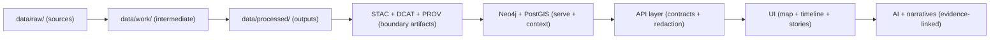

# TEMPLATE — Results Appendix 🧪📎


> 🧭 **Intent:** This appendix is the “proof bundle” for an experiment.  
> If a claim appears in your results, it must be backed by **artifacts, logs, metrics, and provenance links** here (or via direct references).

---

## 📦 Repo location

```text
📦 mcp/
  └─ 🧩 templates/
     └─ 🧪 experiments/
        └─ 📎 TEMPLATE__RESULTS_APPENDIX.md
```

---

## 🧠 Ground rules

- **Evidence-first:** Every metric, plot, narrative, or AI answer should be traceable to a source artifact (data, catalog record, query, or run manifest).
- **Deterministic by default:** If the same inputs produce different outputs, you must explain **why**, and attach diffs.
- **Boundary artifacts are mandatory** for published/“promoted” outputs:
  - 🧭 STAC (spatiotemporal index)
  - 🧾 DCAT (discovery + licensing)
  - 🧬 PROV (lineage)
- **Fail-closed governance:** If a policy gate fails, the result is “not publishable” until remediated.

---

## 🧭 Quick navigation

- [1. Experiment metadata](#1-experiment-metadata)
- [2. Run manifest and environment](#2-run-manifest-and-environment)
- [3. Inputs](#3-inputs)
- [4. Methods and pipeline](#4-methods-and-pipeline)
- [5. Outputs and artifacts](#5-outputs-and-artifacts)
- [6. Quantitative results](#6-quantitative-results)
- [7. Qualitative results](#7-qualitative-results)
- [8. AI and narrative results](#8-ai-and-narrative-results)
- [9. Governance and compliance](#9-governance-and-compliance)
- [10. Integrity and health checks](#10-integrity-and-health-checks)
- [11. Publishing and distribution](#11-publishing-and-distribution)
- [12. Reproduction recipe](#12-reproduction-recipe)
- [13. Appendix evidence vault](#13-appendix-evidence-vault)
- [Glossary](#glossary)
- [Completion checklist](#completion-checklist)

---

# 1. Experiment metadata

## 🧾 Core identifiers

| Field | Value |
|---|---|
| **Experiment ID** | `{{EXPERIMENT_ID}}` |
| **Title** | `{{TITLE}}` |
| **Domain tags** | `{{DOMAIN_TAGS}}` (examples: 🗺️ geospatial, 🧬 provenance, 🤖 AI, 🧪 simulation, 🧭 UI, 🔎 search, 🛰️ remote-sensing, 📡 streaming) |
| **Start date** | `{{YYYY-MM-DD}}` |
| **End date** | `{{YYYY-MM-DD}}` |
| **Owner** | `{{NAME_OR_HANDLE}}` |
| **Reviewers** | `{{NAMES_OR_HANDLES}}` |
| **Status** | ⬜ draft · ⬜ ready-for-review · ⬜ approved · ⬜ shipped · ⬜ rejected |
| **Related issue(s)** | `{{ISSUE_LINKS}}` |
| **Related PR(s)** | `{{PR_LINKS}}` |
| **Baseline reference** | `{{BASELINE_TAG_OR_COMMIT}}` |
| **Candidate reference** | `{{CANDIDATE_TAG_OR_COMMIT}}` |
| **Template version** | `{{MCP_TEMPLATE_VERSION}}` |

## 🎯 Success criteria

- **Primary goal:** `{{PRIMARY_GOAL}}`
- **Acceptance criteria (must-pass):**
  - [ ] `{{CRITERION_1}}`
  - [ ] `{{CRITERION_2}}`
  - [ ] `{{CRITERION_3}}`

## 🧩 What changed

> Keep this short. The detailed diffs belong later in artifacts/logs.

- `{{CHANGE_1}}`
- `{{CHANGE_2}}`
- `{{CHANGE_3}}`

---

# 2. Run manifest and environment

## 🧷 Run manifest pointers

| Item | Value |
|---|---|
| Run ID | `{{RUN_ID}}` |
| Run time | `{{RUN_TIMESTAMP_ISO8601}}` |
| Idempotency key | `{{IDEMPOTENCY_KEY}}` |
| Canonical digest | `{{CANONICAL_DIGEST_SHA256}}` |
| Run manifest path | `data/audits/{{RUN_ID}}/run_manifest.json` |
| Config snapshot path | `{{PATH_TO_CONFIG_SNAPSHOT}}` |
| Logs path | `{{PATH_TO_LOGS}}` |

### 📎 Run manifest excerpt

> Paste a **minimized** JSON excerpt here (or link the file). Include inputs, outputs, tool versions, and summary counts.

```json
{
  "run_id": "{{RUN_ID}}",
  "run_time": "{{RUN_TIMESTAMP_ISO8601}}",
  "idempotency_key": "{{IDEMPOTENCY_KEY}}",
  "canonical_digest": "{{CANONICAL_DIGEST_SHA256}}",
  "source_urls": ["{{URL_1}}", "{{URL_2}}"],
  "tool_versions": {
    "python": "{{VERSION}}",
    "gdal": "{{VERSION}}",
    "postgres": "{{VERSION}}",
    "postgis": "{{VERSION}}",
    "neo4j": "{{VERSION}}"
  },
  "summary_counts": {
    "records_in": {{N}},
    "records_out": {{N}},
    "errors": {{N}}
  }
}
```

## 🖥️ Compute environment

| Dimension | Value |
|---|---|
| OS | `{{OS}}` |
| CPU | `{{CPU}}` |
| RAM | `{{RAM}}` |
| GPU | `{{GPU_OR_NONE}}` |
| Container image | `{{IMAGE_NAME}}@sha256:{{DIGEST}}` |
| Disk + storage | `{{LOCAL_DISK}}` / `{{REMOTE_OBJECT_STORE}}` |

## 🧰 Dependency lock

- `{{LOCKFILE_PATH}}` (examples: `poetry.lock`, `uv.lock`, `requirements.txt`, `package-lock.json`)
- `{{CONDA_ENV_YML_OR_DOCKERFILE}}`

---

# 3. Inputs

## 📥 Input datasets and sources

> List **every** input. If you used “just a sample,” declare the sampling method.

| Input ID | Type | Source | License | Sensitivity | Version | Location | Checksum |
|---|---|---|---|---|---|---|---|
| `{{DATASET_ID}}` | vector/raster/text/graph/stream | `{{SOURCE_ORG}}` | `{{SPDX_OR_TEXT}}` | `{{PUBLIC/RESTRICTED}}` | `{{V}}` | `{{PATH_OR_URL}}` | `sha256:{{...}}` |

## 🧾 Data contracts and schemas

- Contract file(s): `{{PATHS_TO_DATA_CONTRACTS}}`
- Validation tool: `{{VALIDATOR_NAME}}` (examples: JSON Schema, Pydantic, Great Expectations, custom validators)
- Validation output: `{{PATH_TO_VALIDATION_REPORT}}`

✅ **Contract results summary:**
- Required fields present: ⬜ yes / ⬜ no  
- Geometry validity checks: ⬜ pass / ⬜ fail  
- CRS consistency checks: ⬜ pass / ⬜ fail  
- Outliers/anomalies reviewed: ⬜ yes / ⬜ no  

## 🧠 Sampling and splits

- Train/validation/test method: `{{METHOD}}`
- Split ratios: `{{RATIOS}}`
- Random seed(s): `{{SEEDS}}`
- Stratification: `{{YES_NO_DETAILS}}`

---

# 4. Methods and pipeline

## 🔁 Pipeline overview

**One-paragraph summary:**  
`{{PIPELINE_SUMMARY}}`

### 🗺️ Pipeline map



## 🧪 Procedures

### Step-by-step

1. `{{STEP_1}}`
2. `{{STEP_2}}`
3. `{{STEP_3}}`

### Parameters

| Parameter | Value | Why it matters |
|---|---:|---|
| `{{PARAM}}` | `{{VALUE}}` | `{{RATIONALE}}` |

### Tools and modules used

- 🐍 Python: `{{LIBRARIES}}`
- 🗺️ GIS stack: `{{GDAL_RASTERIO_GEOPANDAS_SHAPELY}}`
- 🧠 ML stack: `{{PYTORCH_TF_SKLEARN_XGBOOST}}`
- 🧬 DB stack: `{{POSTGIS_NEO4J}}`
- 🧭 UI stack: `{{REACT_MAPLIBRE_CESIUM}}`
- 🔍 Search: `{{ELASTIC_OPENSEARCH_OTHER}}`

## 📡 Streaming watcher setup

> Fill if this experiment used streaming, polling, or scheduled ingestion.

- Watcher type: ⬜ cron ⬜ daemon ⬜ workflow scheduler ⬜ event-driven
- Interval: `{{INTERVAL}}`
- Deduplication strategy: `{{ETAG/TIMESTAMP/HASH}}`
- Micro-batch size: `{{N_OR_TIMEWINDOW}}`
- Backfill strategy: `{{YES_NO_DETAILS}}`

---

# 5. Outputs and artifacts

## 📤 Artifact inventory

> Everything created/changed by this experiment goes here.

| Artifact | Type | Stage | Path / Ref | Checksum / Digest | Notes |
|---|---|---|---|---|---|
| `{{ARTIFACT_1}}` | raster/vector/text/model/report | raw/work/processed | `{{PATH_OR_URI}}` | `sha256:{{...}}` | `{{NOTES}}` |

## 🧭 Boundary artifacts

> If an output is “publishable,” it needs all three.

| Output dataset | STAC | DCAT | PROV |
|---|---|---|---|
| `{{OUTPUT_DATASET_ID}}` | `{{PATH_TO_STAC}}` | `{{PATH_TO_DCAT}}` | `{{PATH_TO_PROV}}` |

## 🧠 Evidence manifests for narratives

> Required when you ship Story Nodes / Pulse Threads / AI-generated narratives.

- Evidence manifest path: `{{PATH_TO_EVIDENCE_MANIFEST_YAML_OR_JSON}}`
- Human citation block present: ⬜ yes / ⬜ no
- Embedded PROV snippet present: ⬜ yes / ⬜ no

---

# 6. Quantitative results

## 🧾 Metrics summary table

| Metric | Baseline | Candidate | Δ | Target | Pass |
|---|---:|---:|---:|---:|---|
| `{{METRIC_NAME}}` | `{{B}}` | `{{C}}` | `{{DELTA}}` | `{{TARGET}}` | ⬜ |

## 📊 Statistical reporting

- Confidence intervals: `{{YES_NO}}` → `{{METHOD}}`
- Significance test: `{{TEST}}` → `p={{P_VALUE}}`
- Multiple comparisons handling: `{{NONE/BONFERRONI/FDR}}`

## 🗺️ Geospatial accuracy

> Use what fits: georeferencing RMS, IOU, boundary distance, topology violations, CRS drift, etc.

- Georeferencing RMSE: `{{VALUE}}` (units: `{{PIXELS_OR_METERS}}`)
- Control points used: `{{N}}`
- CRS: `{{EPSG}}`
- Geometry validity:
  - Self-intersections: `{{COUNT}}`
  - Slivers: `{{COUNT}}`
  - Multipart anomalies: `{{COUNT}}`

## ⚡ Performance

| Area | Baseline | Candidate | Notes |
|---|---:|---:|---|
| Pipeline runtime | `{{TIME}}` | `{{TIME}}` | `{{NOTES}}` |
| Peak memory | `{{GB}}` | `{{GB}}` | `{{NOTES}}` |
| Tile generation | `{{RATE}}` | `{{RATE}}` | `{{NOTES}}` |
| API p95 latency | `{{MS}}` | `{{MS}}` | `{{NOTES}}` |
| UI FPS range | `{{FPS}}` | `{{FPS}}` | `{{NOTES}}` |

## 🤖 ML evaluation

> Choose applicable blocks. Delete the rest.

### Classification

- Accuracy: `{{...}}`
- Precision (macro/micro): `{{...}}`
- Recall (macro/micro): `{{...}}`
- F1 (macro/micro): `{{...}}`
- AUROC: `{{...}}`
- Calibration (ECE/Brier): `{{...}}`

### Regression

- MAE: `{{...}}`
- RMSE: `{{...}}`
- R²: `{{...}}`
- Coverage (prediction intervals): `{{...}}`

### Clustering

- Silhouette: `{{...}}`
- Davies–Bouldin: `{{...}}`
- Stability vs seed: `{{...}}`

### Time series and anomaly detection

- Precision@k: `{{...}}`
- Recall@k: `{{...}}`
- Detection delay: `{{...}}`
- False alarm rate: `{{...}}`

---

# 7. Qualitative results

## 🧩 Key observations

- ✅ `{{OBSERVATION_1}}`
- ⚠️ `{{OBSERVATION_2}}`
- ❌ `{{OBSERVATION_3}}`

## 🖼️ Visual evidence

> Prefer stable links/paths. Keep screenshots small and labeled.

| Screenshot | What it proves | Where to find it |
|---|---|---|
| `{{IMG_1}}` | `{{CLAIM}}` | `{{PATH_OR_LINK}}` |

## 🧭 UI scenario validation

- Map layer correctness: ⬜ pass / ⬜ fail
- Timeline navigation correctness: ⬜ pass / ⬜ fail
- Story playback correctness: ⬜ pass / ⬜ fail
- Offline/field mode behavior: ⬜ pass / ⬜ fail
- 3D globe/terrain behavior: ⬜ pass / ⬜ fail

---

# 8. AI and narrative results

## 🤖 Focus Mode evaluation

### Evaluation set

- Prompt set name: `{{PROMPT_SET_NAME}}`
- Count: `{{N}}`
- Coverage: `{{COUNTIES/TIME_RANGES/THEMES}}`

### Grounding and citations

- Citation coverage: `{}`
- Correct refusal rate: `{{%}}`
- Hallucination incidents: `{{COUNT}}`  
  - Incident log: `{{PATH_OR_LINK}}`

### Explainability

- Audit panel enabled: ⬜ yes / ⬜ no
- Attribution visible to user: ⬜ yes / ⬜ no
- Governance flags surfaced: ⬜ yes / ⬜ no

## 📖 Story Nodes and Pulse Threads

> Use this if you shipped narrative content.

- Story Node IDs: `{{IDS}}`
- Pulse Thread IDs: `{{IDS}}`
- Evidence manifest(s): `{{PATHS}}`
- Review workflow:
  - Human-reviewed: ⬜ yes / ⬜ no
  - AI-assisted only: ⬜ yes / ⬜ no

### Narrative Pattern Detection results

- Patterns detected: `{{COUNT}}`
- Confirmed true positives: `{{COUNT}}`
- False positives: `{{COUNT}}`
- “Publishable pulses” after review: `{{COUNT}}`

---

# 9. Governance and compliance

## 🛡️ Policy gates

| Gate | Tool | Result | Evidence |
|---|---|---|---|
| Metadata completeness | `{{OPA/CONFTST/OTHER}}` | ⬜ pass / ⬜ fail | `{{LINK}}` |
| License checks | `{{TOOL}}` | ⬜ pass / ⬜ fail | `{{LINK}}` |
| Sensitive data flags | `{{TOOL}}` | ⬜ pass / ⬜ fail | `{{LINK}}` |
| Secrets scanning | `{{TOOL}}` | ⬜ pass / ⬜ fail | `{{LINK}}` |
| AI output citation requirement | `{{TOOL}}` | ⬜ pass / ⬜ fail | `{{LINK}}` |

## 🌱 FAIR and CARE alignment

- Findable: `{{NOTES}}`
- Accessible: `{{NOTES}}`
- Interoperable: `{{NOTES}}`
- Reusable: `{{NOTES}}`

- Collective benefit: `{{NOTES}}`
- Authority to control: `{{NOTES}}`
- Responsibility: `{{NOTES}}`
- Ethics: `{{NOTES}}`

## 🔐 Security and privacy notes

- Data redaction required: ⬜ yes / ⬜ no
- Access controls tested: ⬜ yes / ⬜ no
- Export carries provenance: ⬜ yes / ⬜ no
- Known risks: `{{RISKS}}`

---

# 10. Integrity and health checks

## 🧬 Provenance health

- STAC/DCAT/PROV cross-links valid: ⬜ yes / ⬜ no
- Missing lineage edges: `{{COUNT}}`
- Orphan artifacts: `{{COUNT}}`
- Provenance bundle path: `{{PATH}}`

## 🧠 Graph integrity

> If you touched Neo4j, you must report deltas + constraints.

| Item | Baseline | Candidate | Notes |
|---|---:|---:|---|
| Nodes | `{{N}}` | `{{N}}` | `{{NOTES}}` |
| Relationships | `{{N}}` | `{{N}}` | `{{NOTES}}` |
| Constraint violations | `{{N}}` | `{{N}}` | `{{NOTES}}` |
| Orphan nodes | `{{N}}` | `{{N}}` | `{{NOTES}}` |

## 🧠 Conceptual Attention Nodes

> Use if you introduced/updated concept hubs.

- Concepts added/updated: `{{LIST}}`
- Downstream impact observed: `{{NOTES}}`
- AI usage confirmed in eval prompts: ⬜ yes / ⬜ no

---

# 11. Publishing and distribution

## 📦 OCI artifact references

> Fill if you pushed artifacts to a registry (recommended for large outputs).

| Artifact | OCI ref | Digest | Signed | Attestations |
|---|---|---|---|---|
| `{{NAME}}` | `oci://{{REGISTRY}}/{{REPO}}:{{TAG}}` | `sha256:{{...}}` | ⬜ yes / ⬜ no | `{{SBOM/PROV}}` |

## 🧾 Release packaging

- Release tag: `{{SEMVER_OR_DATE_TAG}}`
- Changelog entry: `{{PATH}}`
- Migration notes: `{{PATH_OR_NONE}}`

---

# 12. Reproduction recipe

## 🧪 One-command replay

```bash
# Example: replace with your actual run command(s)
{{COMMAND_TO_REPRODUCE}}
```

## 🔁 Step-by-step replay

1. Checkout: `git checkout {{COMMIT_OR_TAG}}`
2. Bootstrap: `{{BOOTSTRAP_STEPS}}`
3. Fetch inputs: `{{FETCH_STEPS}}`
4. Run pipeline: `{{RUN_STEPS}}`
5. Validate: `{{VALIDATION_STEPS}}`
6. Compare outputs: `{{DIFF_STEPS}}`

## 🎲 Seeds and determinism

- Seeds set in: `{{FILES_OR_CONFIGS}}`
- Non-deterministic components: `{{NONE_OR_LIST}}`
- Allowed variance thresholds: `{{THRESHOLDS}}`

---

# 13. Appendix evidence vault

> This section is intentionally “big.” Collapse what you don’t need.

<details>
<summary>📜 Logs</summary>

- `{{PATH_TO_LOG_1}}`
- `{{PATH_TO_LOG_2}}`

</details>

<details>
<summary>🧾 Validation reports</summary>

- `{{PATH_TO_VALIDATION_REPORT}}`

</details>

<details>
<summary>📊 Raw metrics dumps</summary>

- `{{PATH_TO_METRICS_CSV_OR_JSON}}`

</details>

<details>
<summary>🗺️ Map states and layer configs</summary>

- Map state export: `{{PATH}}`
- Layer registry diff: `{{PATH}}`

</details>

<details>
<summary>🧪 Simulation specifics</summary>

- Model name + version: `{{MODEL}}`
- Assumptions: `{{ASSUMPTIONS}}`
- Boundary conditions: `{{BOUNDARY_CONDITIONS}}`
- Calibration/validation datasets: `{{DATASETS}}`
- Sensitivity analysis: `{{METHOD}}`
- Ensemble runs: `{{COUNT}}`

</details>

<details>
<summary>📱 Offline / AR results</summary>

- Offline data pack size: `{{SIZE}}`
- Load time: `{{TIME}}`
- GPS alignment error: `{{ERROR_METERS}}`
- AR stability notes: `{{NOTES}}`

</details>

<details>
<summary>🧑‍🤝‍🧑 Crowdsourced verification</summary>

- Task type: `{{LABELING/TRANSCRIPTION/QA}}`
- Platform: `{{INTERNAL/EXTERNAL}}`
- Annotators: `{{N}}`
- Consensus method: `{{MAJORITY/DAWID_SKENE/OTHER}}`
- Inter-rater agreement: `{{KAPPA_OR_OTHER}}`
- Disagreements and resolution: `{{NOTES}}`

</details>

---

# Glossary

| Term | Meaning |
|---|---|
| **Boundary artifacts** | Metadata outputs that form the “interface” between stages (STAC/DCAT/PROV). |
| **Run manifest** | Structured audit record of a pipeline run (inputs, outputs, tool versions, counts, digest). |
| **Evidence manifest** | Machine-readable list of sources backing a narrative (with checksums + query details). |
| **Policy gates** | Automated governance checks (metadata, licensing, sensitivity, secrets, AI citations). |
| **Pulse Thread** | Timely, geotagged narrative update backed by data citations and provenance. |
| **Conceptual Attention Node** | Graph node representing a high-level theme used to guide UI + AI context. |

---

# Completion checklist

## ✅ Minimum publish bar

- [ ] Run manifest exists and includes **input refs + output refs + tool versions + digest**
- [ ] All “publishable” outputs have **STAC + DCAT + PROV**
- [ ] Artifact inventory includes **checksums/digests**
- [ ] Policy gates executed and logged (fail-closed)
- [ ] Reproduction recipe tested on a clean environment
- [ ] Known issues + limitations documented

## 🌟 Nice-to-have

- [ ] Side-by-side baseline vs candidate comparisons
- [ ] Confidence intervals / uncertainty quantification
- [ ] UI screenshots + map state exports
- [ ] OCI artifacts signed + attested (SBOM + provenance)
