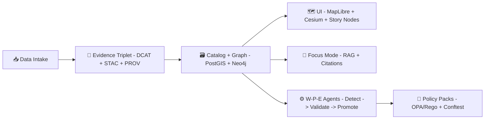

# 📚 Glossary Template (MCP) — Kansas Frontier Matrix (KFM)


A shared vocabulary is **infrastructure** 🧱  
This template makes KFM terms consistent across: 🗺️ UI, 📥 intake pipelines, 🧠 Focus Mode/AI, 🧾 provenance, 🔐 governance, ⚙️ automation.

> [!NOTE]
> This folder is a **template**. The *real* glossary entries should live in a “canonical” location (recommended below), and this template is what you copy when adding new terms.

---

## 🧭 Table of Contents

- [🚀 Quick start](#-quick-start)
- [🧩 Where the glossary fits in KFM](#-where-the-glossary-fits-in-kfm)
- [📁 Recommended folder layout](#-recommended-folder-layout)
- [🧱 Glossary entry contract](#-glossary-entry-contract)
- [📝 Term file template](#-term-file-template)
- [📌 Example entries](#-example-entries)
- [🗂️ Seed term list](#️-seed-term-list)
- [✅ Quality bar](#-quality-bar)
- [🔐 Sensitive terms and governance](#-sensitive-terms-and-governance)
- [🧪 Validation and automation hooks](#-validation-and-automation-hooks)
- [♻️ Change management](#️-change-management)
- [🔗 Related project docs](#-related-project-docs)

---

## 🚀 Quick start

1. **Create a new term file** by copying the template below into:
   - `mcp/glossary/terms/<term-slug>.md` ✅ (recommended canonical location)
2. Fill out the **frontmatter** (metadata) + the **Definition** section.
3. Add the term to `mcp/glossary/INDEX.md` (alphabetical).
4. Make sure your term includes:
   - at least **one source** 🧾
   - at least **one related term** 🔗
   - a **KFM-specific context** 🧭

---

## 🧩 Where the glossary fits in KFM

KFM is built on a few non-negotiables that make glossary quality matter:

- **Evidence-first publishing** 🧾: terms must map back to sources, standards, or reproducible outputs.
- **Contract-first** 📜: terms should point to the schema/contract they describe.
- **No “mystery” anything** 🕵️: “mystery layers / nodes / claims” are how trust breaks.

**The glossary is used by:**
- 🧠 **Focus Mode** (AI Q&A / assistant) → consistent meaning + consistent citations
- 🧾 **Provenance & “evidence manifests”** → stable terminology for traceability
- 🗺️ **Story Nodes** (narrative units) → shared definitions for story metadata
- ⚙️ **Automation agents** (Watcher → Planner → Executor) → unambiguous policy + action descriptions
- 🔐 **Policy Packs** (OPA/Rego + Conftest) → terminology that governance rules depend on



---

## 📁 Recommended folder layout

This repo can organize glossary content like this:

```text
mcp/
└─ 📖 glossary/
   ├─ 📖📄 INDEX.md                  # 📖 Human entrypoint (A→Z list + quick links to term files)
   ├─ 📚 terms/                      # 📚 One file per term (stable slugs; cross-link friendly)
   │  ├─ 🧾 evidence-triplet.md       # Evidence Triplet definition (claim → citation → artifact linkage)
   │  ├─ 🔎 focus-mode.md             # Focus Mode definition (evidence-first assistant + hard gates)
   │  ├─ 🎬 story-node.md             # Story Node definition (governed narrative object + step config)
   │  └─ ⚖️ policy-pack.md            # Policy Pack definition (OPA/Conftest rules + enforcement scope)
   └─ 🧩 templates/
      └─ 📖 glossary/
         └─ 🧩📄 README.md            # 🧩 (this file) How to write glossary entries (format, required sections, citations)
```

> [!TIP]
> Keep **terms** small and composable. Bigger “design narratives” belong elsewhere (e.g., `docs/architecture/`, `docs/design/`, or `mcp/packs/`).

---

## 🧱 Glossary entry contract

### ✅ Minimum required fields

| Field | Type | Required | Purpose |
|---|---:|:---:|---|
| `id` | string | ✅ | Stable identifier for cross-links and tooling |
| `term` | string | ✅ | Human-readable name |
| `definition` | string | ✅ | 1–2 sentence plain-language definition |
| `domain` | list | ✅ | Tags to route meaning (ai/ui/geospatial/governance/etc.) |
| `status` | enum | ✅ | `draft` / `stable` / `deprecated` |
| `sources` | list | ✅ | Traceability pointers (docs, standards, code, datasets) |

### ⭐ Strongly recommended fields

| Field | Type | Why it helps |
|---|---|---|
| `aliases` | list | Stops duplicate terms (synonyms/acronyms) |
| `kfm_context` | string | Distinguishes KFM meaning vs generic meaning |
| `related` | list | Builds navigation + prevents ambiguity |
| `not_to_confuse_with` | list | Prevents common mixups |
| `examples` | list | Makes the term usable (not just definitional) |
| `sensitivity` | enum | `public` / `internal` / `restricted` + notes |

### 🏷️ Suggested `domain` tags

Use these consistently (add more only when needed):

- `core` 🧱
- `data-intake` 📥
- `catalog` 🗂️
- `provenance` 🧾
- `geospatial` 🗺️
- `ui` 🖥️
- `ai` 🧠
- `ops` ⚙️
- `governance` 🔐
- `research` 🧪
- `future` 🌟

---

## 📝 Term file template

Copy/paste this into: `mcp/glossary/terms/<term-slug>.md`

```yaml
---
id: kfm.glossary.<term-slug>
term: "<Term Name>"
aliases: []
domain: ["core"]
status: "draft" # draft | stable | deprecated
sensitivity: "public" # public | internal | restricted
owner: "<@handle-or-team>"
last_updated: "YYYY-MM-DD"

# Traceability: add at least ONE source.
# Sources can be: docs, standards, code paths, datasets, catalog IDs, STAC/DCAT/PROV IDs, etc.
sources:
  - type: "doc"            # doc | standard | code | dataset | stac | dcat | prov | url
    ref: "<title-or-id>"   # e.g., "KFM Data Intake Guide", "W3C PROV-O", "tools/validation/policy/*.rego"
    pointer: "<optional>"  # e.g., section name, page/line ref, commit hash, etc.
    why: "<why this source defines the term>"

related: []
not_to_confuse_with: []
---

## Definition

<1–2 sentences. Plain language. No circular definitions.>

## KFM context

- <How KFM uses this term in the platform, UI, data pipeline, AI, or governance.>
- <What “counts” as this term in KFM (and what doesn’t).>

## Examples

- ✅ <Good example 1>
- ✅ <Good example 2>

## Non-examples / pitfalls

- ⚠️ <Common confusion or misuse>
- ❌ <What this is *not*>

## Related terms

- <link to related term files, or list term IDs>
```

---

## 📌 Example entries

### Example: Evidence Triplet

```yaml
---
id: kfm.glossary.evidence-triplet
term: "Evidence Triplet"
aliases: ["Evidence Triangle"]
domain: ["provenance", "catalog", "core"]
status: "stable"
sensitivity: "public"
owner: "@kfm-data"
last_updated: "YYYY-MM-DD"
sources:
  - type: "doc"
    ref: "KFM Data Intake – Technical & Design Guide"
    pointer: "Evidence model / required metadata"
    why: "Defines how KFM proves traceability and enforces evidence-first publishing."
related:
  - kfm.glossary.dcat
  - kfm.glossary.stac
  - kfm.glossary.prov-o
---
## Definition

A KFM convention that every publishable asset is backed by **dataset metadata (DCAT)**, **spatial asset metadata (STAC)**, and **processing lineage (PROV)**.

## KFM context

In KFM, the Evidence Triplet is what powers “no mystery layers” and reliable citations in UI + Focus Mode.

## Related terms

- DCAT
- STAC
- PROV-O
```

### Example: Story Node

```yaml
---
id: kfm.glossary.story-node
term: "Story Node"
aliases: ["Narrative Node"]
domain: ["ui", "core", "provenance"]
status: "stable"
sensitivity: "public"
owner: "@kfm-ui"
last_updated: "YYYY-MM-DD"
sources:
  - type: "doc"
    ref: "KFM UI System Overview"
    why: "Defines the narrative unit used in the story engine."
  - type: "doc"
    ref: "KFM Data Intake Guide"
    why: "Defines evidence linkage expectations for published content."
related:
  - kfm.glossary.evidence-manifest
  - kfm.glossary.focus-mode
---
## Definition

A modular narrative unit that anchors text/media to map layers and time ranges, designed to be evidence-backed and navigable.

## KFM context

Story Nodes are intended to be shareable, remixable building blocks that can be sequenced into storylines while preserving traceability.

## Pitfalls

- Don’t treat Story Nodes like blog posts; they are map/time-aware narrative components.
```

---

## 🗂️ Seed term list

<details>
<summary><strong>Click to expand 🧩 (starter terms across KFM)</strong></summary>

### 🧱 Core (platform DNA)

- **Contract-first** 📜 — data/outputs must conform to explicit schemas/contracts.
- **Provenance-first** 🧾 — anything shown/answered must trace back to cataloged sources.
- **No mystery layers** 🕵️ — no UI layers or AI claims without traceability.
- **Design Pack** 🎒 — a complete spec bundle for adding a domain/feature (schema + ontology + pipelines + checks).
- **Evidence Manifest** 🧾 — a structured list of evidence items that back a Story Node or published output.
- **Run Manifest** 🧪 — a structured record of a pipeline/model run: inputs, versions, params, outputs, hashes.

### 📥 Data intake & catalogs

- **DCAT** 🗂️ — dataset-level catalog metadata.
- **STAC** 🗺️ — spatial/temporal asset metadata (items, collections, assets).
- **PROV-O / W3C PROV** 🧾 — provenance model for activities, entities, agents.
- **Idempotent ingest** ♻️ — re-running the same ingest yields the same result (no duplication).
- **Deterministic pipeline** 🎯 — same inputs/config → same outputs (diffs are reviewable).
- **Promotion workflow** ⬆️ — workbench → reviewed → promoted to published catalog.

### 🗺️ Geospatial & visualization

- **PostGIS** 🗃️ — geospatial relational store + spatial SQL.
- **Vector tiles** 🧱 — tiled vector features for fast map rendering.
- **PMTiles / MBTiles** 🧳 — tile packaging formats (often for offline distribution).
- **COG (Cloud-Optimized GeoTIFF)** 🛰️ — raster format optimized for HTTP range requests.
- **MapLibre GL JS** 🗺️ — 2D map rendering engine in the web UI.
- **CesiumJS / 3D Tiles** 🌐 — 3D globe/terrain/tiles visualization.

### 🧠 AI & automation

- **Focus Mode** 🧠 — AI assistant constrained by evidence/citations and platform policy.
- **RAG (Retrieval-Augmented Generation)** 🔎 — generation grounded by retrieved sources.
- **Embeddings** 🧬 — vector representations used for semantic search/retrieval.
- **Knowledge Graph** 🕸️ — semantic relationships connecting people/places/events/data.
- **Watcher–Planner–Executor (W-P-E)** ⚙️ — controlled automation loop for maintenance and safe changes.
- **Detect → Validate → Promote** ✅ — CI workflow pattern used for safe, governed publishing.

### 🔐 Governance & security

- **FAIR** ♻️ — Findable, Accessible, Interoperable, Reusable.
- **CARE** 🤝 — Collective Benefit, Authority to Control, Responsibility, Ethics.
- **Policy Pack** 🔐 — OPA/Rego policies enforced in CI/runtime (via Conftest/gates).
- **Sensitivity classification** 🏷️ — labeling data/terms with handling requirements.
- **Geo-obfuscation** 🕶️ — intentionally coarsening location to protect sensitive sites.
- **Supply-chain signing (Cosign)** 🔏 — cryptographic signing of artifacts for integrity and provenance.

### 🌟 Future / R&D concepts

- **Pulse Threads** 🧵 — time-aware narrative threads connecting observations, events, and evidence.
- **Conceptual Attention Nodes** 🧠 — curated “attention anchors” that highlight key concepts in the graph/story.
- **Narrative Pattern Detection** 🔁 — identifying recurring themes/motifs across time and datasets.
- **4D Digital Twin / VoxelMaps** 🧊 — volumetric + temporal representation for “time travel” analysis.
- **AR Integration** 📱 — in-field augmented overlays using offline packs and map context.
- **Traditional Knowledge labels** 🪶 — cultural protocol metadata that governs access/use.

</details>

---

## ✅ Quality bar

Use this checklist before merging a new term ✅

- [ ] **Definition** is 1–2 sentences and non-circular  
- [ ] Includes a **KFM context** section (what it means *here*)  
- [ ] Has **≥ 1 source** (doc/standard/code/dataset) 🧾  
- [ ] Has **≥ 1 related term** 🔗  
- [ ] Lists at least one **pitfall / non-example** ⚠️  
- [ ] Uses a stable **id + slug** and avoids duplicates  
- [ ] If sensitive, includes **sensitivity + handling note** 🔐  

---

## 🔐 Sensitive terms and governance

Some terms imply governance obligations (e.g., Indigenous sovereignty flags, restricted locations, private land records, health data).  

Guidelines:
- Default `sensitivity: public` ✅
- If a term touches sensitive concepts, mark it and add handling notes:
  - `internal` 🟡 — operational terms, internal-only naming, implementation details
  - `restricted` 🔴 — privacy, sovereignty, protected sites, credentials, security specifics

> [!IMPORTANT]
> If a term can cause harm when misunderstood, add a “Not to confuse with” section and link to governance policy terms.

---

## 🧪 Validation and automation hooks

This template is compatible with “policy-as-code” + “treat data like code” workflows:

- **CI linting**: validate frontmatter presence + required fields
- **Policy gates**: enforce that terms touching governance have a `sensitivity` label
- **Compilation step** (optional): build `glossary.json` for:
  - UI tooltips / hover definitions
  - Focus Mode system-context injection
  - Documentation site indexes

Suggested outputs 📦:
- `mcp/glossary/glossary.json` (machine-readable)
- `mcp/glossary/INDEX.md` (human A→Z)
- `mcp/glossary/graph.edges.csv` (optional: relationships for graph ingestion)

---

## ♻️ Change management

Definitions are **contracts**. Treat them accordingly.

- `draft` 🧪 — still evolving
- `stable` ✅ — safe to reference in code, policy, docs, and prompts
- `deprecated` 🧹 — keep for history; add replacement pointers

Recommended approach:
- If meaning changes substantially → create a **new term ID** and deprecate the old one.
- Keep aliases for backwards compatibility, but don’t let aliases become the “real name”.

---

## 🔗 Related project docs

These documents informed the vocabulary and structure behind this glossary template:

- 📘 KFM Comprehensive Technical Documentation
- 🧠 KFM AI System Overview (Focus Mode, policy packs, agents)
- 🖥️ KFM UI System Overview (MapLibre/Cesium, Story Nodes, narrative UX)
- 📥 KFM Data Intake Guide (evidence model, promotion workflow, provenance)
- 🧱 KFM Architecture / Features / Design (governance, CI/CD, automation)
- 🌟 Innovative Concepts (4D twins, AR, federation, cultural protocols)
- 💡 Additional Ideas (manifests, OCI artifacts, signing, policy gates)
- 📚 Reference collections (AI concepts, data management theory, geospatial/webgl resources, programming languages)

---

🧭 **North Star:** If the system can’t agree on what a word means, it can’t agree on what is true.

