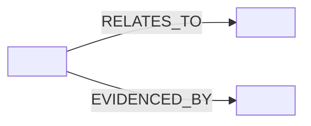

# 📖 Glossary Entry — <TERM>


> ✅ **Goal:** Make this term unambiguous across **data → catalogs → graph → API → UI → Story Nodes → Focus Mode**.

---

<details>
<summary>🛠️ Template instructions (keep in template; remove or collapse in real entry)</summary>

## ✅ How to use
1. Copy this file to your glossary location, e.g.:
   - `docs/glossary/<term-slug>.md` (recommended for per-term pages), **and/or**
   - ensure it’s indexed from `docs/glossary.md`.
2. Replace **all** `<placeholders>` in front-matter + body.
3. Keep headings stable (tooling/CI may validate presence of required sections).
4. Link everything you can to a **contract artifact** (schema / OpenAPI / ontology / catalog record), not just prose.
5. If the term touches sensitive topics (sovereignty, sacred sites, PII, protected locations), set:
   - `care_label`, `sensitivity`, `classification`  
   and add explicit handling rules in **⚖️ Governance & Safety**.

## 🧭 Helpful repo anchors
- 📘 Master Guide: `docs/MASTER_GUIDE_v13.md`
- 🌐 Standards: `docs/standards/` (STAC/DCAT/PROV profiles)
- 🧱 Architecture: `docs/architecture/`
- 🧾 Templates: `docs/templates/` and `mcp/templates/`
- 🗃️ Catalog outputs: `data/stac/`, `data/catalog/dcat/`, `data/prov/`

</details>

---

## 🧩 At a glance

| Field | Value |
|---|---|
| **Term** | `<TERM>` |
| **Slug** | `<term-slug>` |
| **Type** | `<acronym \| concept \| component \| process \| data-model \| ui \| policy \| domain>` |
| **Category** | `<Architecture \| Data \| Metadata \| Catalogs \| Graph \| API \| UI \| AI \| Governance \| Domain>` |
| **Stability** | `<stable \| evolving \| experimental \| deprecated>` |
| **Primary owner** | `<team-or-handle>` |
| **Last reviewed** | `<YYYY-MM-DD>` |

---

## ✅ Definition

### Short definition (UI tooltip / quick reference)
**`<TERM>`**: `<One sentence. Clear + testable. Avoid metaphors.>`

### Full definition (canonical)
`<2–6 sentences. Include the boundaries: what it IS, what it is NOT.>`

### Operational definition in KFM (how it behaves “in the pipeline”)
- **In KFM, `<TERM>` MUST…** `<rule>`
- **In KFM, `<TERM>` SHOULD…** `<rule>`
- **In KFM, `<TERM>` MUST NOT…** `<rule>`

---

## 🎯 Scope boundaries

| In Scope ✅ | Out of Scope ❌ |
|---|---|
| `<what this term covers in KFM>` | `<common misuse / adjacent meaning that is NOT this term>` |
| `<what’s included>` | `<what’s explicitly excluded>` |

---

## 🤝 Synonyms, aliases, and “don’t say this” list

### Preferred phrasing ✅
- `<preferred phrase 1>`
- `<preferred phrase 2>`

### Allowed aliases (only if needed) 🟨
- `<alias-1>`
- `<alias-2>`

### Avoid / ambiguous ⚠️
- `<term that causes confusion>` → use `<preferred term>` instead
- `<overloaded acronym>` → spell out the term

---

## 🔀 Relationships

### Related terms
- **Parent / umbrella term:** `<parent-term>`
- **Child terms:** `<child-term-1>`, `<child-term-2>`
- **Often paired with:** `<related-term-1>`, `<related-term-2>`
- **Not to be confused with:** `<confusable-term>` (why: `<one-liner>`)

### Graph/ontology mapping (if applicable) 🕸️
- **Neo4j label(s):** `:<Label>`  
- **Key properties:** `<propA>`, `<propB>`
- **Common relationships:** `(:A)-[:REL]->(:B)`
- **External ontology alignment (optional):** `<CIDOC-CRM / GeoSPARQL / other>`



---

## 🧭 Where it appears in KFM (cross-layer contract map)

> 💡 **Fill at least one row**. If the term is “real” in KFM, it should have a home in a contract artifact (schema / ontology / API spec) or a governed doc.

| Layer | Canonical “home” | Contract artifact | How to recognize it | Notes |
|---|---|---|---|---|
| **Data** | `data/<...>` | `<schema / ETL config>` | `<file patterns>` | `<notes>` |
| **Catalogs** (STAC/DCAT/PROV) | `data/stac/` / `data/catalog/dcat/` / `data/prov/` | `docs/standards/<...>` | `<ids/fields>` | `<notes>` |
| **Graph** | `graph/` or ingestion scripts | `<ontology/schema>` | `<label/rel>` | `<notes>` |
| **API** | `api/` | `OpenAPI/GraphQL` | `<endpoint/field>` | `<notes>` |
| **UI** | `ui/` | `<ui config contract>` | `<component/feature flag>` | `<notes>` |
| **Story Nodes** | `docs/stories/` | `Story Node schema/template` | `<front-matter key>` | `<notes>` |
| **Focus Mode / AI** | `mcp/` or AI services | `<policy + prompt contract>` | `<tool name / response rules>` | `<notes>` |

---

## 🧾 Evidence & provenance expectations

> 🧬 KFM operates on an **evidence-first** model: data + catalogs + provenance exist *before* interpretation or UI narrative.

### If `<TERM>` is (or produces) a dataset / artifact
- **MUST** have STAC + DCAT + PROV coverage before being “published” (or referenced by UI/AI).  
- **MUST** be traceable back to source(s) and processing activity/agent.  
- **SHOULD** declare uncertainty/quality notes if applicable.

### If `<TERM>` is used inside narratives (Story Nodes / Focus Mode)
- **MUST** be citeable: it should resolve to evidence objects (dataset IDs, catalog entries, documents).
- **MUST NOT** enable “mystery claims” (claims without a source reference).

---

## ⚖️ Governance & Safety (FAIR+CARE)

### Sensitivity notes
- **care_label:** `<Public | Restricted · Tribal Sensitive | TBD>`
- **Handling rules (plain-English):**
  - `<rule 1>`
  - `<rule 2>`

### What to redact / generalize (if applicable) 🕵️‍♀️
- `<coordinates precision rules>`
- `<PII rules>`
- `<community review rules>`

### Policy gates impacted (OPA / CI / runtime)
- **Relevant policies:** `<policy_ref>`
- **Expected failure mode (“fail closed”):**
  - If `<TERM>` is used without `<required metadata/provenance>`, then `<CI/policy check>` should fail.

---

## 🧪 Validation & tests

### Automated checks (what should pass/fail)
- [ ] Schema validation: `<what schema validates this?>`
- [ ] Catalog completeness: `<required fields?>`
- [ ] Provenance completeness: `<what PROV edges?>`
- [ ] Link integrity: `<what internal links?>`
- [ ] Classification consistency: `<what labels must match?>`

### Manual review checklist (when required)
- [ ] Governance/sovereignty review completed (if not `care_label: Public`)
- [ ] UI copy reviewed for clarity + non-harmful language
- [ ] Domain steward sign-off (if domain-specific)

---

## 🧑‍💻 Implementation notes (for builders)

### Where to implement / update
- **Primary code path(s):** `<path>`
- **Schema/contract files:** `<path>`
- **Common configs:** `<path>`

### Common pitfalls 🧯
- `<pitfall 1>`
- `<pitfall 2>`

---

## 💬 UI copy & user-facing wording

### Recommended label
- **UI label:** `<short label>`
- **Tooltip:** `<1–2 sentences>`
- **Accessibility alt-text (if visual):** `<alt text>`

### Search / filter keywords
- `<keyword 1>`, `<keyword 2>`, `<keyword 3>`

---

## 🧷 Examples

### Example 1 — Minimal, correct usage
```text
<Show how it appears in a sentence, UI tooltip, or metadata summary>
```

### Example 2 — Machine context (optional)
```yaml
# Example fragment (STAC/DCAT/PROV/Graph/API) — keep it short and realistic
<key>: <value>
```

### Example 3 — Anti-example (what NOT to do)
```text
<Show the confusing/incorrect usage and why it’s wrong>
```

---

## 📚 References

> Prefer **contract artifacts** (schemas, profiles, OpenAPI, ontology) over prose.  
> Add at least one primary “source of truth”.

### Internal (KFM)
- `docs/MASTER_GUIDE_v13.md`
- `docs/standards/KFM_STAC_PROFILE.md`
- `docs/standards/KFM_DCAT_PROFILE.md`
- `docs/standards/KFM_PROV_PROFILE.md`
- `docs/governance/ROOT_GOVERNANCE.md`
- `docs/governance/ETHICS.md`
- `docs/governance/SOVEREIGNTY.md`
- `docs/templates/TEMPLATE__STORY_NODE_V3.md` (if term touches narratives)
- `<Add term-specific docs>`

### External (standards / papers / books) 🌍
- `<STAC / DCAT / PROV / CIDOC-CRM / GeoSPARQL / etc>`
- `<Domain reference>`
- `<Implementation reference>`

---

## 🕰️ Change log

| Date | Version | Change | Author | Review link |
|---|---:|---|---|---|
| `<YYYY-MM-DD>` | `v0.1.0` | `<initial definition>` | `<name>` | `<PR link>` |

---

## ✅ Definition of Done (DoD)

- [ ] Front-matter complete + valid (no missing keys; use `"TBD"` not deletion)
- [ ] Short definition + full definition + operational definition present
- [ ] At least **1** canonical contract reference included (schema / profile / API / ontology)
- [ ] Cross-layer map includes at least **1** real “home” (catalog / graph / API / UI)
- [ ] Governance section filled (even if `Public`, say so explicitly)
- [ ] Examples include at least **1** correct usage
- [ ] No broken internal links
- [ ] Reviewed by `<reviewer>` (required if stability is `stable` or `policy/domain` category)

---
