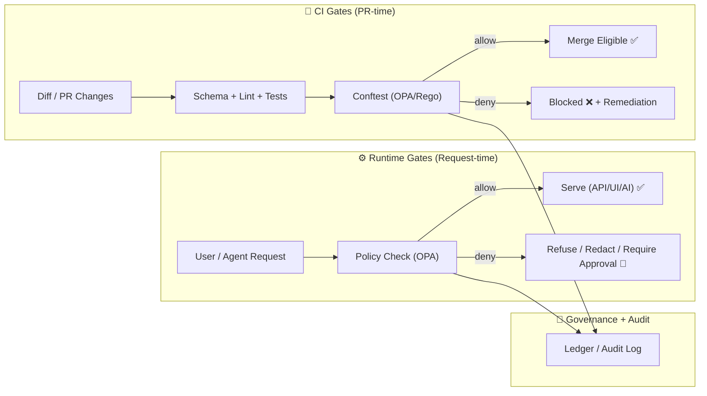

# 🛡️ Policy Support — MCP Template


**This template is the “policy brain” for Kansas Frontier Matrix (KFM) + MCP.**  
It’s designed to make governance **real** (enforced in CI + runtime), not “a doc you meant to read someday.” ✅

---

## 🧭 What this template is for

Use this template whenever you need to add/extend **rules that control:**

- 📦 **Data intake & publishing** (raw → processed → catalogs → graph → API → UI)
- 🧾 **Metadata & provenance** (STAC/DCAT/PROV + run manifests + audit trails)
- 🔒 **Access & sensitivity** (classification propagation, redaction, sovereignty)
- 🧠 **AI behavior** (citations required, refusal modes, safe responses)
- 🗺️ **UI safety** (no direct DB access, sensitive layers, blur/generalize rules)
- 🧵 **Narrative integrity** (Story Nodes + evidence manifests + “AI text labeling”)
- 🧰 **Supply-chain integrity** (signed artifacts, pinned digests, deterministic builds)

> 💡 In KFM, “policy” is not just security.  
> It’s the system-wide contract that keeps the project **trustworthy, reproducible, and respectful**.

---

## 📌 Non‑negotiables (KFM invariants) ✅

These are the rules that should **almost never** be waived:

- 🧱 **Pipeline ordering is absolute:** ETL → Catalogs → Graph → API → UI → Story Nodes → Focus Mode  
- 🚧 **API boundary rule:** UI never queries Neo4j/PostGIS directly—only via governed API
- 🧾 **Provenance-first publishing:** nothing is “published” without STAC/DCAT/PROV (or their domain equivalent)
- ♻️ **Deterministic + idempotent pipelines:** same inputs + config ⇒ same outputs
- 🧠 **Evidence-first narratives:** user-facing claims must link to datasets / sources
- 🔒 **Fail-closed by default:** if policy can’t prove safety/compliance → deny
- 🪶 **Sovereignty & CARE:** the most restrictive classification of inputs propagates to outputs

---

## 🗺️ Where policy runs



---

## 🧩 Template layout (recommended)

> This folder is a **template**: copy it and customize for your policy pack or subsystem.

```text
mcp/
└── 🧩 templates/
    └── 🛡️ policy_support/
        ├── ✅📄 README.md                       # you are here 📌 How to use this policy pack template + conventions/tests
        ├── 🧾📄 policy_pack.yaml                # Pack metadata: version, owners, scopes, entrypoints, required schemas
        ├── ⚖️ rego/                             # OPA/Rego rules (policy-as-code) grouped by concern
        │   ├── 🗂️⚖️📄 catalogs.rego              # STAC/DCAT rules (license required, link integrity, distribution constraints)
        │   ├── 🧬⚖️📄 prov.rego                  # PROV + run-manifest rules (lineage required, receipts/hashes, ordering)
        │   ├── 🏷️⚖️📄 sovereignty.rego           # CARE + classification propagation + approval/waiver requirements
        │   ├── 🚧⚖️📄 api_boundary.rego          # API boundary rules (“no direct DB access”) + contract checks
        │   ├── 🎬⚖️📄 story_nodes.rego           # Story Nodes rules (evidence manifests, citations, AI labeling/limits)
        │   ├── 🔒⚖️📄 security.rego              # Secret scanning + unsafe patterns + redaction requirements
        │   └── 📦⚖️📄 supply_chain.rego          # Supply-chain rules (cosign, digest pinning, OCI distribution, SBOM)
        ├── 📐 schemas/                           # Schemas used by the pack (inputs and governed artifacts)
        │   ├── 🛡️📐🧾 governance_card.schema.json # Governance card contract (reviews/approvals/waivers/audit metadata)
        │   ├── 🧾📐🧾 run_manifest.schema.json    # Run manifest contract (who/what/when + IO + tool versions + digests)
        │   └── 🧯📐🧾 waiver.schema.json           # Waiver contract (time-boxed exceptions: scope, expiry, rationale, approver)
        ├── 🧪 examples/                          # Known-good examples (portable fixtures) for docs/tests
        │   ├── ✅🛡️🧾 governance_card.example.json # Example governance card (valid, minimal)
        │   ├── ✅🧾🔐 run_manifest.example.json    # Example run manifest (valid, minimal)
        │   └── ✅🧯🧾 waiver.example.yml           # Example waiver (valid, time-boxed)
        └── 🧪 tests/                             # Policy tests (Rego unit-style) proving allow/deny behavior
            ├── 🧪⚖️📄 catalogs_test.rego          # Tests for catalog rules (pass/fail cases)
            ├── 🧪⚖️📄 sovereignty_test.rego       # Tests for sovereignty/classification rules
            └── 🧪⚖️📄 story_nodes_test.rego       # Tests for story/evidence/AI labeling rules
```

---

## 🧾 Policy decision contract (what policies should output)

Policies should return decisions that are:
- **machine-actionable** 🤖
- **human-readable** 🧑‍⚖️
- **UI-friendly** 🗺️
- **audit-ready** 🧾

### ✅ Recommended decision object

```json
{
  "allow": false,
  "severity": "high",
  "rule_id": "KFM-PROV-001",
  "reason_code": "PROV_MISSING_OR_STALE",
  "message": "Processed data changed without matching PROV update.",
  "remediation": [
    "Regenerate PROV bundle for this dataset/run",
    "Re-run deterministic pipeline to produce consistent outputs"
  ],
  "required_approvals": ["domain_steward"],
  "redaction_profile": null,
  "evidence": {
    "files": ["data/prov/..."],
    "ids": ["urn:kfm:prov:activity:..."]
  }
}
```

---

## 🏷️ Rule naming & categories

Use stable rule IDs so that:
- CI output is searchable 🔍  
- waivers can be time-bound ⏳  
- policy history is auditable 🧾  

### Suggested categories

| Category | Prefix | What it covers |
|---|---:|---|
| 📦 Catalog rules | `KFM-CAT-*` | STAC/DCAT integrity, license required, providers required |
| 🧾 Provenance rules | `KFM-PROV-*` | PROV bundles, run manifests, reproducibility |
| ⚖ Sovereignty rules | `KFM-SOV-*` | CARE labels, sensitivity propagation, restricted handling |
| 🌐 API rules | `KFM-API-*` | API boundary enforcement, schema/contract rules |
| 🧠 Story rules | `KFM-STORY-*` | citations/evidence manifests, AI labeling, narrative integrity |
| 🔐 Security rules | `KFM-SEC-*` | secrets, unsafe patterns (shell injection), vuln hygiene |
| 📦 Supply chain rules | `KFM-SUP-*` | signed artifacts, digest pinning, OCI distribution |

---

## 🧷 Waivers (exceptions) — keep them rare

Waivers exist for reality. But they must be:
- explicit ✅  
- time-bound ⏳  
- reviewed 👀  
- logged 🧾  

### Waiver file pattern

```yaml
# waivers.yml
- waiver_id: "WAIVER-2026-001"
  rule_id: "KFM-CAT-002"
  expires_on: "2026-03-31"
  scope:
    files:
      - "data/catalog/dcat/datasets/example.jsonld"
  reason: "Upstream source license pending confirmation; steward-approved temporary intake."
  approved_by:
    - "domain_steward"
    - "faircare_council"
```

> 🧠 Tip: Policy should enforce **no expired waivers**.

---

## ✅ Starter policy set (what we expect most packs to enforce)

<details>
<summary><strong>📦 Catalog & Metadata</strong></summary>

- ✅ Every dataset has:
  - `license` (approved list)
  - `providers` / `source_urls`
  - `jurisdiction`
  - `sensitivity` + `classification`
- ✅ STAC/DCAT/PROV cross-links resolve (no dangling references)
- ✅ “Derived / AI-generated” artifacts are labeled as such, and link to inputs

</details>

<details>
<summary><strong>🧾 Provenance & Run Manifests</strong></summary>

- ✅ Processed data must have matching PROV updates
- ✅ Runs generate a `run_manifest.json` with:
  - tool versions
  - inputs/outputs
  - record counts + error summaries
  - canonical digest / idempotency key
- ✅ Run manifests are canonicalized (stable hashing) and stored for audit

</details>

<details>
<summary><strong>⚖ Sovereignty, Sensitivity, CARE</strong></summary>

- ✅ Most restrictive classification of inputs propagates to outputs
- ✅ Sensitive coordinates must be:
  - withheld 🔒, or
  - generalized 🧊, or
  - access-controlled 🧑‍⚖️
- ✅ Indigenous / community-sensitive content triggers required approvals

</details>

<details>
<summary><strong>🌐 API Boundary & Contracts</strong></summary>

- ✅ UI must only use governed API (no direct Neo4j/PostGIS access)
- ✅ API responses apply redaction profiles before UI/AI consumption
- ✅ Contract-first: schema changes require versioning + compatibility checks

</details>

<details>
<summary><strong>🧠 AI / Focus Mode</strong></summary>

- ✅ AI outputs include citations (minimum 1, ideally more)
- ✅ If evidence is missing → refuse or clearly mark uncertainty
- ✅ Runtime policy can deny unsafe answers (before display)
- ✅ AI outputs and their evidence bundle are logged for audit

</details>

<details>
<summary><strong>🔐 Security & Supply Chain</strong></summary>

- ✅ Secret scanning in CI (deny if key-like patterns appear)
- ✅ No unsafe subprocess patterns (avoid `shell=True`; sanitize inputs)
- ✅ OCI-distributed artifacts must be pinned by digest and signed (cosign)
- ✅ Containers / pipelines prefer digest-pinned bases for reproducibility

</details>

---

## 🧵 Story Nodes: evidence manifests + “AI text labeling”

Story Nodes are governed narratives. Policies should enforce:

- 🧾 **Evidence manifest required** (every claim points to dataset IDs / references)
- 🏷️ **AI-generated text must be labeled** (so users can distinguish)
- 🔗 **Citations resolve** (no broken IDs / links)
- 🧩 **Story ↔ dataset graph consistency** (story references should exist in graph)

### Minimal evidence manifest idea

```json
{
  "story_id": "urn:kfm:story:example:v1",
  "citations": [
    {"ref": "DCAT:dataset:usgs_rivers_v2", "type": "dcat"},
    {"ref": "PROV:activity:run_sha256:abcd...", "type": "prov"}
  ]
}
```

---

## 🕵️ Privacy patterns (when data is sensitive)

Policies should support multiple mitigation strategies, including:

- 🧊 **Generalization** (e.g., coarser geometry / lower precision)
- 🎭 **Anonymization / suppression**
- 🧮 **Query auditing** (detect inference risks from repeated queries)
- 🧪 **Differential privacy** (when aggregates must be shared safely)

> 🔒 Policy should always prefer **least disclosure**: share what’s useful, not what’s risky.

---

## 🧰 Quick start (copy + customize)

1) 📁 Copy the template
```bash
cp -R mcp/templates/policy_support mcp/policy_packs/<your_pack_name>
```

2) 🏷️ Edit pack metadata  
- `policy_pack.yaml` → set owners, scope, version, severity defaults

3) ✍️ Add/modify rules  
- Add a `.rego` per domain (catalog/prov/sovereignty/api/story/security/supply_chain)

4) 🧪 Add tests  
- Every rule must have at least one **positive** + one **negative** test

5) ✅ Wire into CI + runtime  
- CI: `conftest test ...`
- Runtime: API/AI calls OPA before serving results

---

## ✅ Definition of Done (for policy changes)

- [ ] Rule has a stable ID (`KFM-*-###`)
- [ ] Rule includes a clear error message + remediation
- [ ] Tests added (allow + deny)
- [ ] Waiver mechanism supports time-bound exceptions (if applicable)
- [ ] Policy outputs are structured (decision object)
- [ ] Change is documented (why + impact)
- [ ] Governance impact considered (FAIR/CARE, sovereignty, sensitivity)
- [ ] CI gate is fail-closed (or explicitly justified)

---

## 🔭 Optional “next-level” policy ideas (advanced)

- 🧵 **Pulse Threads governance:** real-time narrative streams must carry provenance + severity tags
- 🧠 **Conceptual Attention Nodes:** taxonomy changes require review; drift detection triggers alerts
- 🧬 **Graph health checks:** detect broken edges, orphan nodes, provenance gaps
- 📦 **Release attestation:** generate SBOM + provenance attestation per release artifact

---

## 📚 Suggested internal references (repo-relative)

- `docs/MASTER_GUIDE_v13.md` (pipeline + invariants)
- `docs/governance/` (ethics, sovereignty, FAIR/CARE)
- `docs/templates/` (universal doc + story node + API extension templates)
- `tools/validation/policy/` (policy pack home, if using canonical layout)
- `api/scripts/policy/README.md` (policy runner docs, if present)

---

### 🧠 Final note

This template exists so we can move fast **without breaking trust**.  
If you’re ever unsure: **default to deny**, ask for evidence, and route to human review. 🧑‍⚖️✅
