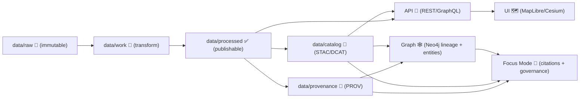

# Release Support Template 🧰🚀
> **MCP Template** • **Kansas Frontier Matrix (KFM)** • *Evidence-first releases with provenance, policy gates, and rollback muscle* 🧭


---

## 📌 What this template is
This folder is a **release runbook template** for KFM. It assumes releases may touch **code + data + catalogs + graph + UI + AI + governance** (sometimes all at once).

**Goal:** ship a release that is:
- ✅ **Auditable** (every output is traceable)
- ✅ **Reproducible** (same inputs + config → same outputs)
- ✅ **Governed** (policy gates pass; sensitive data stays protected)
- ✅ **Reversible** (rollback is planned, tested, and fast)
- ✅ **Supportable** (clear triage + comms playbooks)

---

## ⚡ Quick start (copy/paste workflow)
1. **Create a release workspace** (pick one):
   - 📁 Copy this folder to `releases/<VERSION>/release_support/`
   - 🧾 Or paste the “Release Issue Template” (below) into a GitHub issue
2. Fill **Release Metadata** 🧷
3. Run **Preflight → Candidate → Deploy → Post-release** checklists ✅
4. Attach artifacts (logs, dashboards, manifests, diffs) 📎
5. Publish **Release Notes** + **Post-release Report** 📝

> 💡 Tip: search for `TODO:` in this file.

---

## 🧾 Release Metadata (TODO)
| Field | Value |
|---|---|
| Release Version | `vX.Y.Z` |
| Release Type | `code-only` / `data-only` / `policy-only` / `mixed` |
| Target Env | `dev` / `staging` / `prod` |
| Release Captain | `@handle` |
| Data Steward | `@handle` |
| AI Steward | `@handle` |
| UI Steward | `@handle` |
| On-call / Ops | `@handle` |
| Change Window | `YYYY-MM-DD HH:MM → HH:MM (TZ)` |
| Risk Level | `low` / `medium` / `high` |
| Rollback Trigger | `S1 criteria + max X minutes` |

---

## 👥 Roles & responsibilities
### 🎯 Release Captain
- Owns the checklist, go/no-go calls, and timeline
- Ensures comms + artifacts are posted

### 🧬 Data Steward
- Owns **data/raw → data/work → data/processed** integrity
- Verifies **STAC/DCAT/PROV** and schema validations
- Confirms tiling + packaging (e.g., **GeoParquet + PMTiles**) when applicable

### 🤖 AI Steward
- Owns **Focus Mode** safety + correctness
- Validates citation coverage, governance rules, and drift checks

### 🗺 UI Steward
- Owns Map UI smoke tests (2D/3D, timeline, story nodes, offline packs)
- Verifies accessibility + performance basics

### 🛡 Ops / Security
- Owns deployment safety, monitoring, secrets, supply-chain checks
- Confirms rollback readiness + runbook completeness

---

## 🧱 Non‑negotiables (KFM “constitution”)
- 🧾 **Raw data is immutable evidence** — never modify in-place  
- 🧩 **No dataset ships without**:
  - Metadata (STAC + DCAT)
  - Lineage (PROV)
  - License + sensitivity classification
- 🧭 **No black boxes** — provenance + citations must be inspectable
- 🤖 **Focus Mode must cite sources** (or refuse)
- 🛡 **Policy gates must pass** (CI + runtime checks)
- 🧪 **Determinism** where possible (configs, seeds, canonical manifests)

---

## 🗂 Folder + artifact mental model (release-impact map)
```text
📦 KFM (release surface)
├─ 🧾 data/raw/            # immutable evidence boundary
├─ 🧪 data/work/           # transforms + staging
├─ ✅ data/processed/      # publishable artifacts (GeoParquet/COG/PMTiles/etc.)
├─ 🧷 data/catalog/        # STAC + DCAT catalog entries
├─ 🧬 data/provenance/     # PROV lineage records
├─ 🕸 graph/               # Neo4j import snapshots / graph models (if present)
├─ 🔌 api/                 # REST/GraphQL + policy enforcement
├─ 🗺 ui/                  # MapLibre/Cesium UI + story system
└─ 🤖 ai/                  # Focus Mode + retrieval + guardrails
```

---

## 🧭 Pipeline at a glance (reference diagram)


---

## 🧪 Release phases
### 1) 🟦 Preflight
- Validate scope, risks, migration needs, and rollback
- Ensure CI is stable + policy pack is versioned

### 2) 🟨 Release Candidate (RC)
- Build/tag RC artifacts
- Run smoke tests + governance gates + data QA

### 3) 🟩 Deploy
- Deploy in controlled window
- Verify “happy paths” + monitor key metrics

### 4) 🟪 Post-release
- Confirm no regressions
- Publish report + open follow-ups

---

## ✅ Preflight checklist (TODO)
### 📦 Versioning & docs
- [ ] Version chosen (`vX.Y.Z`) + matches change scope (semver-ish)
- [ ] Release notes draft started (highlights + breaking changes)
- [ ] Migration notes written (data contract/schema/API changes)
- [ ] Docs updated for any new features (UI, AI, ingestion, policy)

### 🛡 Governance & policy gates
- [ ] Policy pack version pinned (OPA/Rego + Conftest where used)
- [ ] “No secrets / no PII” checks enabled
- [ ] Sensitivity labeling rules verified for any new datasets/layers
- [ ] “AI must cite” rule enforced in staging

### 🧬 Data readiness (if data changes)
- [ ] New raw evidence added only via approved intake path
- [ ] Deterministic pipelines reviewed (no ad-hoc edits)
- [ ] Each dataset change includes STAC/DCAT/PROV updates
- [ ] Geometry + CRS rules checked (valid geometries, correct EPSG)
- [ ] Packaging plan confirmed (e.g., GeoParquet + PMTiles + STAC/DCAT)

### 🕸 Graph readiness (if graph changes)
- [ ] Neo4j constraints/indexes reviewed (if applicable)
- [ ] Graph import snapshots validated in staging
- [ ] Orphan/stale node checks planned (see “Graph Health Check” below)

### 🔌 API readiness (if API changes)
- [ ] Backwards compatibility reviewed (REST + GraphQL)
- [ ] Authorization + policy enforcement tested
- [ ] Rate limits / caching changes assessed

### 🗺 UI readiness (if UI changes)
- [ ] Map layers render (2D/3D)
- [ ] Timeline slider behavior verified (if enabled)
- [ ] Story nodes render safely (sanitization + citations)
- [ ] Offline pack behavior reviewed (if enabled)
- [ ] Accessibility spot-check (keyboard nav + contrast + focus states)

### 🤖 AI readiness (if AI changes)
- [ ] Citation coverage test suite passes
- [ ] Sensitive content handling verified (governance rules)
- [ ] Drift/bias monitoring dashboards ready
- [ ] Prompt-security checks enabled

### 🔁 Rollback readiness
- [ ] Rollback plan written + rehearsed for this release type
- [ ] “Kill switch” defined for automations (Watcher/Planner/Executor)
- [ ] Data rollback path confirmed (Git revert + re-sync)
- [ ] Incident comms templates prepared

---

## 🧪 RC checklist (run in order)
### 1) 🧾 Evidence & provenance gate
- [ ] Every changed dataset has:
  - [ ] STAC entry updated ✅
  - [ ] DCAT entry updated ✅
  - [ ] PROV record updated ✅
  - [ ] License + sensitivity present ✅

### 2) 🗺 Geospatial QA (fast, high signal)
- [ ] CRS sanity checks (bounds + expected EPSG)
- [ ] Geometry validity checks (no invalid polygons/lines)
- [ ] Tiles/PMTiles load quickly + no obvious styling regressions
- [ ] Performance spot-check on “worst-case” layer(s)

### 3) 🔌 API smoke
- [ ] Catalog list endpoint returns expected datasets
- [ ] Tile endpoints return 200s + correct content-types
- [ ] Graph queries resolve core entities + lineage links
- [ ] Access control honored (restricted layers are restricted)

### 4) 🗺 UI smoke
- [ ] Map loads (2D) and renders base + key layers
- [ ] 3D globe loads (if enabled) and doesn’t crash GPU/browser
- [ ] Timeline slider hides/shows correctly (if enabled)
- [ ] Story nodes render + citations display (no HTML injection)
- [ ] Search/discovery works (datasets, layers, stories)
- [ ] Provenance panel shows sources/lineage
- [ ] Mobile layout sanity check (at least 1 device)

### 5) 🤖 AI smoke (Focus Mode)
- [ ] Answers include citations to catalog/prov sources
- [ ] Refusal works when sources are missing/insufficient
- [ ] Sensitive data is not surfaced without permission
- [ ] Latency within expected band (baseline ± tolerance)

---

## 🧯 Deploy checklist
- [ ] Change window opened + stakeholders notified
- [ ] Deploy completed (record exact tag/commit/artifact digest)
- [ ] Health checks green (API/UI/DB)
- [ ] Post-deploy smoke tests re-run ✅
- [ ] Monitoring dashboards watched for 30–60 minutes
- [ ] Release notes published

---

## 🟣 Post-release checklist
- [ ] Confirm data catalog consistency (STAC/DCAT/PROV cross-links)
- [ ] Confirm graph lineage integrity (no explosion in orphan nodes)
- [ ] Confirm AI citation coverage and refusal behavior in prod
- [ ] Confirm UI performance is stable (no spike in errors)
- [ ] File follow-ups:
  - [ ] Bugs/regressions
  - [ ] Documentation gaps
  - [ ] “Tech debt” discovered during release
- [ ] Publish Post-release Report (template below)

---

## 🔥 Triage: “what broke?” support matrix
| Symptom | Likely area | First checks | Fast fix ideas |
|---|---|---|---|
| Map won’t load | UI / API / tiles | Browser console, tile endpoint 200, CORS | Roll back UI bundle; disable new layer; revert tile config |
| Layer missing | Catalog / policy | STAC/DCAT entry present, sensitivity label, policy denies | Fix metadata; adjust policy; redeploy catalog |
| Timeline slider shows nothing | Data temporal fields / API filter | STAC temporal extent, API date filters | Fix timestamp fields; backfill metadata |
| 3D crashes GPU | Cesium / assets | Memory usage, 3D tiles size, device tests | Feature-flag 3D; reduce LOD; split tileset |
| Focus Mode answers w/o citations | AI policy gate | Citation tests, runtime policy checks | Block release; revert AI config; tighten policy |
| Wrong data shown | provenance mismatch | PROV points to wrong inputs, checksum mismatch | Roll back dataset; regenerate outputs deterministically |
| Restricted data exposed | governance breach | Sensitivity labels, auth rules | Immediate restrict/disable dataset; rotate keys; incident process |

---

## 🧷 Copy/paste templates
<details>
<summary><strong>🧾 Release Issue Template (copy into GitHub issue)</strong></summary>

```markdown
# Release {{VERSION}} 🧰🚀

## Metadata
- Version: {{VERSION}}
- Type: {{code-only|data-only|policy-only|mixed}}
- Captain: {{@handle}}
- Window: {{YYYY-MM-DD HH:MM–HH:MM TZ}}
- Risk: {{low|medium|high}}
- Rollback trigger: {{S1 criteria + time}}

## Scope
- Highlights:
  - ✅ ...
- Breaking changes:
  - ⚠️ ...
- Migrations:
  - 🧭 ...

## Checklists
### Preflight
- [ ] Policy pack pinned + reviewed
- [ ] CI stable
- [ ] Rollback plan written

### RC
- [ ] Data STAC/DCAT/PROV validated (if applicable)
- [ ] API smoke
- [ ] UI smoke
- [ ] AI citation + refusal smoke (if applicable)

### Deploy
- [ ] Deploy recorded (tag + digest)
- [ ] Post-deploy smoke
- [ ] Monitor 30–60m

### Post-release
- [ ] Report published
- [ ] Follow-ups filed
```
</details>

<details>
<summary><strong>📣 Incident / Status Update Template (Slack/Email)</strong></summary>

```text
🟥 STATUS: {{Investigating|Mitigating|Monitoring|Resolved}}
🧭 Release: {{VERSION}}
⏱ Time (TZ): {{HH:MM}}
📌 Impact: {{who/what is affected}}
🔎 Suspected area: {{UI|API|Data|Graph|AI|Policy}}
✅ Actions taken: {{1-3 bullets}}
🟡 Next steps: {{1-3 bullets}}
🧯 Rollback considered: {{yes/no + why}}
```
</details>

<details>
<summary><strong>📝 Post-release Report Template</strong></summary>

```markdown
# Post-release Report — {{VERSION}} 🟣

## Summary
- What shipped:
- Outcome:
- User impact:

## Metrics
- Errors:
- Latency:
- Data/graph integrity:
- AI citation coverage:

## Issues found
- 1)
- 2)

## Rollback?
- Triggered: {{yes/no}}
- Reason:

## Follow-ups (tickets)
- [ ] ...
- [ ] ...
```
</details>

---

## 🧠 Optional: “advanced” release support modules
These are **power features** proposed across the project docs. Treat them as **feature-flagged**, staged, and monitored.

### 🧵 Pulse Threads (navigation + “living” clusters)
Release support notes:
- Ensure thread generation is deterministic (or explicitly versioned)
- Validate sources/citations in each thread summary
- Add a kill-switch if generation spikes compute

### 🧠 Conceptual Attention Nodes (AI “high impact” flags)
Release support notes:
- Require explainability: why flagged, what evidence, what policy allowed it
- Add audit logs + reviewer workflow for high-risk nodes

### 🧬 Narrative Pattern Detection
Release support notes:
- Ship as “advisory only” until evaluated (avoid auto-publishing)
- Track false positives; add evaluation dataset + regression tests

### 🕸 Graph Health Check (scheduled)
Release support notes:
- Add checks for:
  - orphan nodes
  - missing provenance links
  - stale/duplicated IDs
- Report to dashboards + create tickets automatically

### 📦 OCI-based artifact storage (optional)
If you distribute heavy derived artifacts externally:
- Store GeoParquet/PMTiles/COGs + policy packs + run manifests in an OCI registry
- Sign with Sigstore/Cosign
- Keep canonical JSON manifests for deterministic hashing

---

## 📚 Reference library (project files used)
> Put these in your repo under something like `docs/reference/` (or link to wherever you store them). 📌

- 🧭 **KFM – Comprehensive Architecture, Features, and Design** (system-wide architecture, governance, WPE pattern)
- 📘 **KFM – Comprehensive Technical Documentation** (data standards, validation, catalog QA, formats)
- 🤖 **KFM – AI System Overview** (Focus Mode, governance, drift/bias monitoring, prompt security)
- 🗺 **KFM – Comprehensive UI System Overview** (MapLibre/Cesium, story nodes, offline/AR, sensitivity handling)
- 📥 **KFM Data Intake – Technical & Design Guide** (raw/work/processed boundaries, STAC/DCAT/PROV, rollback)
- 🌟 **Latest Ideas & Future Proposals** (timeline MVP, offline packs, GeoParquet+PMTiles pattern, 3D/AR roadmap)
- 💡 **Innovative Concepts to Evolve KFM** (4D digital twins, GeoXAI, crowdsourced verification ideas)
- 🧠 **Additional Project Ideas** (Pulse Threads, Attention Nodes, narrative patterns, OCI artifact ideas)
- 🧪 **Scientific Method / Master Coder Protocol docs** (QA, CI discipline, reproducibility patterns)
- 🗺️ **Maps/GoogleMaps/VirtualWorlds/Geospatial-WebGL compendium** (deep geospatial + rendering references)
- 🤖 **AI Concepts & more (portfolio)** (AI/ML background + evaluation concepts)
- 💾 **Data Management / Architectures / Bayesian Methods compendium** (data quality + analytics references)
- 🧰 **Various programming languages & resources compendium** (language-specific troubleshooting + patterns)

---

## ✅ Template maintenance
- If you change this template, also update:
  - any associated issue templates
  - policy pack expectations
  - smoke test baselines
  - rollback playbook assumptions

---

**Done.** You now have a release support README that matches KFM’s “trust-by-design” philosophy 🧭✅
