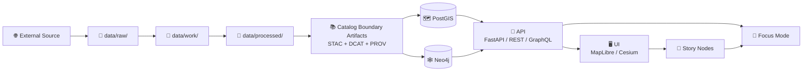
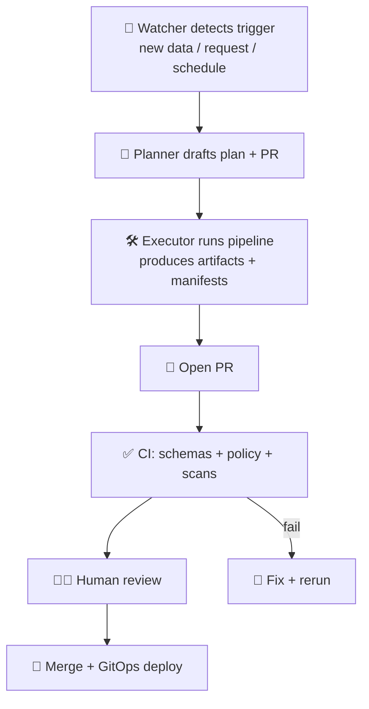

# 🧩 MCP SOP Templates — KFM (Kansas Frontier Matrix)


**This folder contains copy/paste SOP templates** used by the **MCP (Master Coder Protocol)** approach inside **KFM**, to keep recurring workflows:
- ✅ repeatable
- ✅ auditable (provenance + manifests)
- ✅ contract-first (schemas + API contracts are “source of truth”)
- ✅ evidence-first (nothing reaches graph/API/UI without STAC + DCAT + PROV)
- ✅ governed (policy-as-code + fail-closed CI)

> 🧭 **Design intent:** SOPs make the platform trustworthy. A new contributor should be able to follow a SOP and produce outputs that pass validation, provenance rules, and governance gates — without “tribal knowledge”.  [oai_citation:0‡Kansas-Frontier-Matrix_ Open-Source Geospatial Historical Mapping Hub Design.pdf](file-service://file-BJN3xmP44EHc9NRCccCn4H)  [oai_citation:1‡MARKDOWN_GUIDE_v13.md.gdoc](file-service://file-UYVruFXfueR8veHMUKeugU)

---

<details>
<summary>📌 Table of Contents</summary>

- [What lives here](#what-lives-here)
- [How SOP templates fit KFM](#how-sop-templates-fit-kfm)
- [Naming + IDs](#naming--ids)
- [SOP front-matter contract](#sop-front-matter-contract)
- [Required SOP sections](#required-sop-sections)
- [Non-negotiables](#non-negotiables)
- [Template index](#template-index)
- [CI + automation compatibility](#ci--automation-compatibility)
- [PR checklist](#pr-checklist)
- [Copy-paste minimal SOP skeleton](#copy-paste-minimal-sop-skeleton)
- [Sources used](#sources-used)

</details>

---

## What lives here

📦 **`mcp/templates/sops/`** is the **template library**.

- Use these files to **start** a new SOP quickly.
- The “live” SOPs (the ones you actually follow) should live in a governed location such as:
  - `mcp/sops/` **or**
  - `docs/sops/`
  
> 🧠 Why split templates vs live SOPs? Templates change rarely; live SOPs evolve often with policy + pipeline changes.

### Suggested folder layout 🗂️

```text
mcp/
├─ 🧬 templates/
│  └─ 🧾 sops/
│     ├─ 📘📄 README.md                         # 👈 (this file) 📌 How SOP templates are used + naming + required sections
│     ├─ 🧾📄 TEMPLATE__SOP.md                  # Base SOP template (universal structure + required governance sections)
│     ├─ 📥🧾📄 TEMPLATE__SOP_DATA_INTAKE.md     # SOP template for data intake (raw→work→processed→catalog + provenance)
│     ├─ 🧭🧾📄 TEMPLATE__SOP_DOMAIN_EXPANSION.md # SOP template for adding a new domain (schemas, policies, owners)
│     ├─ 🎬🧾📄 TEMPLATE__SOP_STORY_NODE.md      # SOP template for authoring/publishing Story Nodes (citations + evidence manifest)
│     ├─ 🧵🧾📄 TEMPLATE__SOP_PULSE_THREAD.md    # SOP template for Pulse Threads (updates + evidence + review cadence)
│     ├─ 🖥️🧾📄 TEMPLATE__SOP_UI_CHANGE.md       # SOP template for UI changes (a11y, perf, API boundary, telemetry)
│     ├─ 🤖🧾📄 TEMPLATE__SOP_AI_CHANGE.md       # SOP template for AI changes (citations, uncertainty, redaction, evals)
│     ├─ 🧪🧾📄 TEMPLATE__SOP_SIMULATION.md      # SOP template for simulation runs (seeds, manifests, metrics, sensitivity)
│     ├─ 📦🧾📄 TEMPLATE__SOP_OCI_ARTIFACT.md    # SOP template for OCI artifacts (digests, SBOM, signing, promotion)
│     └─ 🚨🧾📄 TEMPLATE__SOP_INCIDENT.md        # SOP template for incidents (triage, comms, rollback, postmortem)
│
└─ 🧾 sops/
   ├─ ✅📄 SOP-DATA-001-ingest-dataset.md        # Approved SOP: ingest a dataset (intake workflow + required receipts)
   ├─ ✅📄 SOP-STORY-010-author-story-node.md    # Approved SOP: author/publish a Story Node (evidence-first + citations)
   └─ ✅📄 SOP-OPS-020-rollback-bad-data.md      # Approved SOP: rollback bad data (containment + audit trail + recovery)
```

> If some templates don’t exist yet, add them incrementally — the README defines the contract they should follow.

---

## How SOP templates fit KFM

KFM’s pipeline is **deterministic + evidence-first**: data and derived artifacts move from raw → work → processed → catalogs → graph/API → UI/Focus Mode.  [oai_citation:2‡MARKDOWN_GUIDE_v13.md.gdoc](file-service://file-UYVruFXfueR8veHMUKeugU)  [oai_citation:3‡MARKDOWN_GUIDE_v13.md.gdoc](file-service://file-UYVruFXfueR8veHMUKeugU)



**SOPs exist to keep that flow consistent.**  
Examples pulled directly from KFM’s design docs include SOPs for recurring workflows like adding a map layer, updating a gazetteer for NLP, QC on ingestion, and deploying the web app.  [oai_citation:4‡Kansas-Frontier-Matrix_ Open-Source Geospatial Historical Mapping Hub Design.pdf](file-service://file-BJN3xmP44EHc9NRCccCn4H)

---

## Naming + IDs

Use a predictable naming scheme so SOPs are easy to find, lint, and reference in PRs/CI.

**Recommended filename format:**
- `SOP-<AREA>-<NNN>-<slug>.md`

**AREA examples:**
- `DATA` (ingest/publish)
- `GRAPH` (Neo4j model, constraints, migrations)
- `API` (contract changes, endpoints)
- `UI` (MapLibre/Cesium, story viewer, accessibility)
- `AI` (Focus Mode, retrieval, governance)
- `OPS` (incident + rollback)
- `SEC` (policy packs, secret scanning)
- `SIM` (simulations, UQ, validation)
- `ARTIFACT` (OCI packaging/signing)

**Example:**
- `SOP-DATA-001-ingest-new-dataset.md`

---

## SOP front-matter contract

KFM’s docs are expected to be **machine-validatable** with consistent YAML front-matter.  [oai_citation:5‡MARKDOWN_GUIDE_v13.md.gdoc](file-service://file-UYVruFXfueR8veHMUKeugU)  [oai_citation:6‡MARKDOWN_GUIDE_v13.md.gdoc](file-service://file-UYVruFXfueR8veHMUKeugU)  [oai_citation:7‡Comprehensive Markdown Guide_ Syntax, Extensions, and Best Practices.docx](file-service://file-J6rFRcp4ExCCeCdTevQjxz)

### Required keys (minimum)

```yaml
---
sop_id: "SOP-DATA-001"
title: "Ingest a New Dataset into KFM"
status: "draft"               # draft | active | deprecated
version: "v0.1.0"
last_updated: "YYYY-MM-DD"
owners:
  - "@kfm/data-stewards"

# Where does this SOP apply?
applies_to:
  systems: ["pipelines", "catalog", "postgis", "neo4j", "api", "ui"]
  domains: ["<domain-or-all>"]

# Governance / ethics / classification
fair_category: "FAIR+CARE"
care_label: "Public"          # Public | Restricted | Tribal Sensitive | TBD
sensitivity: "public"         # public | restricted | confidential

# Evidence + contracts this SOP assumes
references:
  standards:
    - "docs/standards/KFM_STAC_PROFILE.md"
    - "docs/standards/KFM_DCAT_PROFILE.md"
    - "docs/standards/KFM_PROV_PROFILE.md"
  policy_pack: "api/scripts/policy/"
  schemas:
    - "docs/data/contracts/"
---
```

> 🧷 Tip: Don’t delete fields “because not used yet”. Prefer `TBD` / `n/a` so validation tooling stays stable.  [oai_citation:8‡Comprehensive Markdown Guide_ Syntax, Extensions, and Best Practices.docx](file-service://file-J6rFRcp4ExCCeCdTevQjxz)

---

## Required SOP sections

SOPs are expected to be step-by-step, with **checkpoints**, expected outcomes, and troubleshooting notes.  [oai_citation:9‡Kansas-Frontier-Matrix_ Open-Source Geospatial Historical Mapping Hub Design.pdf](file-service://file-BJN3xmP44EHc9NRCccCn4H)

### Required headings ✅

1. **Purpose**
2. **Scope**
3. **Prerequisites**
4. **Inputs**
5. **Procedure**
6. **Validation & Quality Gates**
7. **Outputs & Artifacts**
8. **Rollback & Recovery**
9. **Troubleshooting / Notes**
10. **Audit Trail**
11. **Definition of Done**

> KFM’s “Definition of Done” pattern is explicit: front-matter valid, claims trace to sources/contracts, validation steps repeatable, governance considerations stated.  [oai_citation:10‡MARKDOWN_GUIDE_v13.md.gdoc](file-service://file-UYVruFXfueR8veHMUKeugU)

---

## Non-negotiables

These rules come straight out of KFM’s governance + pipeline philosophy:

### 🧾 Evidence-first publishing (STAC + DCAT + PROV)

- **No dataset or derived artifact is “published”** until it has boundary artifacts:
  - STAC record
  - DCAT record
  - PROV lineage record  [oai_citation:11‡MARKDOWN_GUIDE_v13.md.gdoc](file-service://file-UYVruFXfueR8veHMUKeugU)  
- Derived outputs (AI, OCR, simulations) are treated as **first-class datasets** with provenance and catalogs.  [oai_citation:12‡MARKDOWN_GUIDE_v13.md.gdoc](file-service://file-UYVruFXfueR8veHMUKeugU)

### 📜 Contract-first development

- Schemas and API contracts are first-class, versioned artifacts (changes require compatibility checks).  [oai_citation:13‡MARKDOWN_GUIDE_v13.md.gdoc](file-service://file-UYVruFXfueR8veHMUKeugU)

### 🛡️ Fail-closed governance (OPA/Rego + CI)

- Policy checks are **fail-closed**: missing license/provenance/classification → **CI fails**.  [oai_citation:14‡Additional Project Ideas.pdf](file-service://file-Pc2GNivcrHBeKjBQksLC3T)  [oai_citation:15‡📚 Kansas Frontier Matrix (KFM) Data Intake – Technical & Design Guide.pdf](file-service://file-EbUCdsJMbu5KwpoKMrLrgj)
- CI includes secret scanning + sensitive data checks + classification consistency checks.  [oai_citation:16‡MARKDOWN_GUIDE_v13.md.gdoc](file-service://file-UYVruFXfueR8veHMUKeugU)

### 🧬 Provenance + run manifests

- Complex runs should produce a **run_manifest.json** capturing:
  - inputs, tool versions, record counts, errors, parameters  
  - canonicalized hashing (RFC 8785) + SHA-256 digest for idempotency/audit IDs  [oai_citation:17‡Additional Project Ideas.pdf](file-service://file-Pc2GNivcrHBeKjBQksLC3T)

### 🧾 Story Nodes must be evidence-backed

- Story Nodes should have:
  - an **evidence manifest** listing sources
  - PROV links that tie story claims to datasets/documents
  - UI display of citations / “View Evidence” panel  [oai_citation:18‡Additional Project Ideas.pdf](file-service://file-Pc2GNivcrHBeKjBQksLC3T)  [oai_citation:19‡Additional Project Ideas.pdf](file-service://file-Pc2GNivcrHBeKjBQksLC3T)

### 🤖 Focus Mode must cite sources

- Focus Mode answers must cite datasets/documents/graph entities and avoid fabrication; UI can surface explainability/audit panels.  [oai_citation:20‡Kansas Frontier Matrix (KFM) – AI System Overview 🧭🤖.pdf](file-service://file-Pv8eev6RWvCKrGCXyzY7zg)  [oai_citation:21‡Kansas Frontier Matrix – Comprehensive UI System Overview.pdf](file-service://file-KcBQruYcoFVDEixzzRHTwt)

### 🗺️ UI must surface “the map behind the map”

- UI should expose provenance/metadata for layers and AI answers; accessibility and modularity are baseline expectations.  [oai_citation:22‡Kansas Frontier Matrix – Comprehensive UI System Overview.pdf](file-service://file-KcBQruYcoFVDEixzzRHTwt)  [oai_citation:23‡Kansas Frontier Matrix – Comprehensive UI System Overview.pdf](file-service://file-KcBQruYcoFVDEixzzRHTwt)

### 🧰 Workbench vs promoted outputs

- Experimental outputs stay in **workbench** areas; promotion into `data/processed/` requires review + catalogs + provenance.  [oai_citation:24‡📚 Kansas Frontier Matrix (KFM) Data Intake – Technical & Design Guide.pdf](file-service://file-EbUCdsJMbu5KwpoKMrLrgj)

### 📦 Artifact publishing (OCI)

- Packaging datasets/artifacts as OCI objects (ORAS) with signing (Cosign) and optional attestations/PROV referrers supports reuse + provenance.  [oai_citation:25‡Additional Project Ideas.pdf](file-service://file-Pc2GNivcrHBeKjBQksLC3T)

---

## Template index

Below is the **recommended SOP template set** aligned to KFM’s architecture.

| Template | Use when… | Must include… | Related KFM concepts |
|---|---|---|---|
| 🧾 `TEMPLATE__SOP.md` | Any new SOP | Front-matter + DoD | Doc governance + validation  [oai_citation:26‡MARKDOWN_GUIDE_v13.md.gdoc](file-service://file-UYVruFXfueR8veHMUKeugU) |
| 🧊 `TEMPLATE__SOP_DATA_INTAKE.md` | Adding/refreshing datasets | STAC/DCAT/PROV + policy gates + rollback | Fail-closed intake + governance  [oai_citation:27‡📚 Kansas Frontier Matrix (KFM) Data Intake – Technical & Design Guide.pdf](file-service://file-EbUCdsJMbu5KwpoKMrLrgj) |
| 🌱 `TEMPLATE__SOP_DOMAIN_EXPANSION.md` | Adding a new domain module | raw/work/processed structure + domain README | Domain expansion pattern  [oai_citation:28‡MARKDOWN_GUIDE_v13.md.gdoc](file-service://file-UYVruFXfueR8veHMUKeugU) |
| 🗺️ `TEMPLATE__SOP_MAP_LAYER.md` | Adding a historical map layer | georeferencing QC checkpoints | SOP example described in MCP docs  [oai_citation:29‡Kansas-Frontier-Matrix_ Open-Source Geospatial Historical Mapping Hub Design.pdf](file-service://file-BJN3xmP44EHc9NRCccCn4H) |
| 📖 `TEMPLATE__SOP_STORY_NODE.md` | Writing a Story Node | evidence manifest + PROV links + citation checks | Evidence-first narratives  [oai_citation:30‡Additional Project Ideas.pdf](file-service://file-Pc2GNivcrHBeKjBQksLC3T) |
| 🧵 `TEMPLATE__SOP_PULSE_THREAD.md` | Logging live “Pulse” updates | provenance + moderation + sensitive handling | Pulse Threads + governance  [oai_citation:31‡Additional Project Ideas.pdf](file-service://file-Pc2GNivcrHBeKjBQksLC3T) |
| 🖥️ `TEMPLATE__SOP_UI_CHANGE.md` | UI features / layers / timeline | accessibility + provenance surfacing | MapLibre/Cesium + “map behind map”  [oai_citation:32‡Kansas Frontier Matrix – Comprehensive UI System Overview.pdf](file-service://file-KcBQruYcoFVDEixzzRHTwt) |
| 🤖 `TEMPLATE__SOP_AI_CHANGE.md` | Focus Mode / retrieval / prompt | citation rules + governance checks + eval plan | Explainable AI + refuse on no evidence  [oai_citation:33‡Kansas Frontier Matrix (KFM) – AI System Overview 🧭🤖.pdf](file-service://file-Pv8eev6RWvCKrGCXyzY7zg) |
| 🧪 `TEMPLATE__SOP_SIMULATION.md` | Running simulations/models | seeds + env pinning + UQ + validation | Reproducibility + UQ requirements  [oai_citation:34‡📚 Kansas Frontier Matrix (KFM) Data Intake – Technical & Design Guide.pdf](file-service://file-EbUCdsJMbu5KwpoKMrLrgj) |
| 📦 `TEMPLATE__SOP_OCI_ARTIFACT.md` | Publishing artifacts to OCI | signing + metadata + access controls | ORAS + Cosign provenance  [oai_citation:35‡Additional Project Ideas.pdf](file-service://file-Pc2GNivcrHBeKjBQksLC3T) |
| 🚨 `TEMPLATE__SOP_INCIDENT.md` | Bad data / leaked PII / policy violation | revoke access + revert + postmortem | Emergency rollback expectations  [oai_citation:36‡📚 Kansas Frontier Matrix (KFM) Data Intake – Technical & Design Guide.pdf](file-service://file-EbUCdsJMbu5KwpoKMrLrgj) |

---

## CI + automation compatibility

KFM’s CI is expected to validate:
- YAML front-matter + required sections (Markdown protocol)
- link/reference validity
- STAC/DCAT/PROV schema validation
- graph integrity tests
- API contract tests
- security + governance scans (secrets/PII/sensitive locations)
- classification consistency  [oai_citation:37‡MARKDOWN_GUIDE_v13.md.gdoc](file-service://file-UYVruFXfueR8veHMUKeugU)

### Watcher–Planner–Executor (W‑P‑E) flow 🤝

SOPs should be written so automation can help, but not bypass governance.  [oai_citation:38‡📚 Kansas Frontier Matrix (KFM) Data Intake – Technical & Design Guide.pdf](file-service://file-EbUCdsJMbu5KwpoKMrLrgj)



**SOP authoring rule:** if a step can be automated, document:
- how it’s triggered
- expected artifacts
- where logs/manifests land
- how to turn it off (kill switch / disable agent)  [oai_citation:39‡📚 Kansas Frontier Matrix (KFM) Data Intake – Technical & Design Guide.pdf](file-service://file-EbUCdsJMbu5KwpoKMrLrgj)

---

## PR checklist

Use this checklist (or paste it into PR descriptions).

- [ ] SOP has `sop_id`, `status`, `owners`, and governance fields
- [ ] Procedure steps are explicit and repeatable (no “just do X”)
- [ ] Validation steps included (schemas, policies, tests)
- [ ] Rollback plan included (Git revert + DB sync strategy)
- [ ] Any sensitive data handling is documented (care_label, fuzzing, restrictions)
- [ ] References to contracts/standards included (STAC/DCAT/PROV profiles, API contracts)
- [ ] If automation touched: W‑P‑E notes included + human review gate documented
- [ ] Definition of Done completed  [oai_citation:40‡MARKDOWN_GUIDE_v13.md.gdoc](file-service://file-UYVruFXfueR8veHMUKeugU)

---

## Copy-paste minimal SOP skeleton

<details>
<summary>🧾 Minimal SOP template (copy/paste)</summary>

```markdown
---
sop_id: "SOP-AREA-000"
title: "TEMPLATE — SOP Title"
status: "draft"
version: "v0.1.0"
last_updated: "YYYY-MM-DD"
owners:
  - "@kfm/maintainers"

applies_to:
  systems: ["pipelines", "catalog", "postgis", "neo4j", "api", "ui"]
  domains: ["all"]

fair_category: "FAIR+CARE"
care_label: "TBD"
sensitivity: "public"

references:
  standards:
    - "docs/standards/KFM_STAC_PROFILE.md"
    - "docs/standards/KFM_DCAT_PROFILE.md"
    - "docs/standards/KFM_PROV_PROFILE.md"
  policy_pack: "api/scripts/policy/"
  schemas:
    - "docs/data/contracts/"
---

# 🎯 Purpose
Explain *why* this SOP exists and what “done” means.

# 🧭 Scope
**In scope:**  
- …

**Out of scope:**  
- …

# ✅ Prerequisites
- Tools installed:
  - …
- Access needed:
  - …
- Required approvals (if any):
  - …

# 📥 Inputs
| Input | Where it comes from | Required metadata |
|---|---|---|
| … | … | license, provider, classification |

# 🧪 Procedure
1. Step 1 …
2. Step 2 …
3. Step 3 …

# 🧫 Validation & Quality Gates
- [ ] STAC validates
- [ ] DCAT validates
- [ ] PROV validates
- [ ] Policy pack passes (OPA/Rego/Conftest)
- [ ] Secret/PII/sensitivity scans pass
- [ ] Graph integrity tests pass (if applicable)
- [ ] API contract tests pass (if applicable)

# 📦 Outputs & Artifacts
- `data/processed/...`
- `data/stac/...`
- `data/catalog/dcat/...`
- `data/prov/...`
- `data/audits/<run_id>/run_manifest.json` (if applicable)

# ♻️ Rollback & Recovery
- Git revert plan:
- DB sync plan:
- Emergency access revocation plan (if sensitive):

# 🧯 Troubleshooting / Notes
- Common failure mode → fix
- CI policy failure → what to check

# 🧾 Audit Trail
- Where logs live:
- What IDs to record (run_id, manifest hash, commit SHA):

# ✅ Definition of Done
- [ ] Front-matter complete + valid
- [ ] All claims link to sources/contracts
- [ ] Validation steps are repeatable
- [ ] Governance/FAIR/CARE considerations stated
```

</details>

---

## Sources used

These templates and rules are derived from the project’s core architecture + governance + UI/AI design docs and reference packs.

### 🧱 KFM core architecture & platform docs
- Kansas Frontier Matrix (KFM) – Comprehensive Architecture, Features, and Design  [oai_citation:41‡Kansas Frontier Matrix (KFM) – Comprehensive Architecture, Features, and Design.pdf](file-service://file-4Umt1yHoGKicdmLWzFJ9sC)  
- Kansas Frontier Matrix (KFM) – Comprehensive Technical Documentation  [oai_citation:42‡Kansas Frontier Matrix (KFM) – Comprehensive Technical Documentation.pdf](file-service://file-AkqwUuYPp5zePf7pv5SMxi)  
- Kansas Frontier Matrix (KFM) – AI System Overview 🧭🤖  [oai_citation:43‡Kansas Frontier Matrix (KFM) – AI System Overview 🧭🤖.pdf](file-service://file-Pv8eev6RWvCKrGCXyzY7zg)  
- Kansas Frontier Matrix – Comprehensive UI System Overview  [oai_citation:44‡Kansas Frontier Matrix – Comprehensive UI System Overview.pdf](file-service://file-KcBQruYcoFVDEixzzRHTwt)  
- 📚 KFM Data Intake – Technical & Design Guide  [oai_citation:45‡📚 Kansas Frontier Matrix (KFM) Data Intake – Technical & Design Guide.pdf](file-service://file-EbUCdsJMbu5KwpoKMrLrgj)  
- MARKDOWN_GUIDE_v13 (contract-first + pipeline + validation)  [oai_citation:46‡MARKDOWN_GUIDE_v13.md.gdoc](file-service://file-UYVruFXfueR8veHMUKeugU)  

### 💡 Vision, proposals, and governance deep dives
- Additional Project Ideas (policy-as-code, run manifests, OCI artifacts, evidence manifests)  [oai_citation:47‡Additional Project Ideas.pdf](file-service://file-Pc2GNivcrHBeKjBQksLC3T)  
- Innovative Concepts to Evolve KFM (AR, 4D, next-gen storytelling)  [oai_citation:48‡Innovative Concepts to Evolve the Kansas Frontier Matrix (KFM).pdf](file-service://file-G71zNoWKxsoSW44iwZaaCC)  
- 🌟 KFM – Latest Ideas & Future Proposals  [oai_citation:49‡Kansas Frontier Matrix – Comprehensive UI System Overview.pdf](file-service://file-KcBQruYcoFVDEixzzRHTwt)  

### 🧪 MCP / reproducibility foundation
- Kansas-Frontier-Matrix — Open-Source Geospatial Historical Mapping Hub Design (MCP + SOP structure examples)  [oai_citation:50‡Kansas-Frontier-Matrix_ Open-Source Geospatial Historical Mapping Hub Design.pdf](file-service://file-BJN3xmP44EHc9NRCccCn4H)  
- Scientific Method / Research / MCP Documentation  [oai_citation:51‡Additional Project Ideas.pdf](file-service://file-Pc2GNivcrHBeKjBQksLC3T)  

### 🗺️ Geospatial & data practice references
- KFM Python Geospatial Analysis Cookbook (WebGL/Three.js + geospatial workflows)  [oai_citation:52‡KFM- python-geospatial-analysis-cookbook-over-60-recipes-to-work-with-topology-overlays-indoor-routing-and-web-application-analysis-with-python.pdf](file-service://file-2gpiGDZS8iw6EdxGswEdHp)  
- Data Mining Concepts & Applications (data quality + cleansing mindset)  [oai_citation:53‡Innovative Concepts to Evolve the Kansas Frontier Matrix (KFM).pdf](file-service://file-G71zNoWKxsoSW44iwZaaCC)  

### 📚 Reference library “PDF portfolio” packs (open in Acrobat)
- AI Concepts & more (portfolio)  [oai_citation:54‡AI Concepts & more.pdf](file-service://file-K6BctJjeUwvyCahLf9qdwr)  
- Maps / GoogleMaps / Virtual Worlds / Archaeological / Computer Graphics / Geospatial WebGL (portfolio)  [oai_citation:55‡Various programming langurages & resources 1.pdf](file-service://file-4wp3wSSZs7gk5qHWaJVudi)  
- Data Management / Theories / Architectures / Data Science / Bayesian Methods (portfolio)  [oai_citation:56‡Data Managment-Theories-Architures-Data Science-Baysian Methods-Some Programming Ideas.pdf](file-service://file-RrXMFY7cP925exsQYermf2)  
- Various programming languages & resources (portfolio)  [oai_citation:57‡Maps-GoogleMaps-VirtualWorlds-Archaeological-Computer Graphics-Geospatial-webgl.pdf](file-service://file-RshcX5sNY2wpiNjRfoP6z6)  

### 🔍 Audit / gap analysis
- KFM Design Audit — Gaps and Enhancement Opportunities  [oai_citation:58‡Kansas-Frontier-Matrix Design Audit – Gaps and Enhancement Opportunities.pdf](file-service://file-TkRzAfTnxCYDUHauCf1NcH)  

### 🔖 Attachment citation markers from earlier retrieval
- UI System Overview (attachment marker)  [oai_citation:59‡Kansas Frontier Matrix – Comprehensive UI System Overview.pdf](file-service://file-KcBQruYcoFVDEixzzRHTwt)  
- Data Intake Guide (attachment marker)  [oai_citation:60‡📚 Kansas Frontier Matrix (KFM) Data Intake – Technical & Design Guide.pdf](file-service://file-EbUCdsJMbu5KwpoKMrLrgj)  
- Innovative Concepts (attachment marker)  [oai_citation:61‡Innovative Concepts to Evolve the Kansas Frontier Matrix (KFM).pdf](file-service://file-G71zNoWKxsoSW44iwZaaCC)  
- Document Refinement Request (attachment marker)  [oai_citation:62‡Additional Project Ideas.pdf](file-service://file-Pc2GNivcrHBeKjBQksLC3T)  
