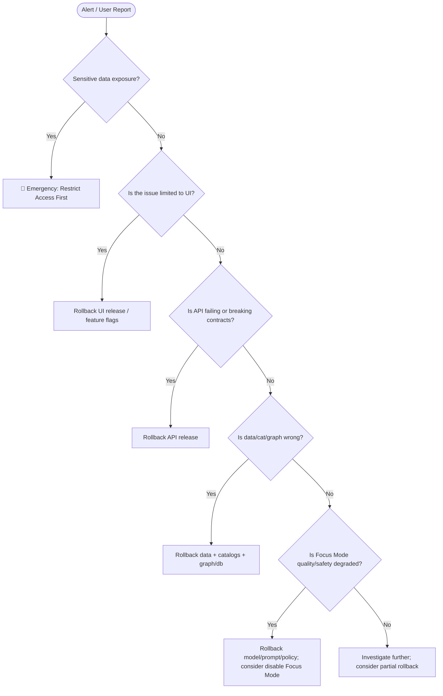
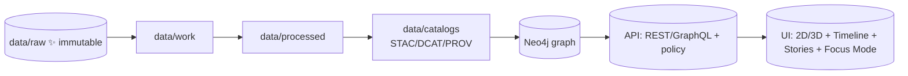

# ♻️ TEMPLATE — Rollback Runbook (KFM)

> [!IMPORTANT]
> **KFM is provenance-first and governance-first.** A rollback is never a “silent undo.”  
> Even if we revert code/data, we still **record the rollback as a provenance activity** and (when applicable) **mark datasets as deprecated/retracted** instead of pretending they never existed.

> [!WARNING]
> If this is a **sensitive-data leak (PII / protected locations / embargoed content / tribal-sensitive knowledge)**:
> 1) **Stop exposure immediately** (classification flip / deny policy / UI hide),  
> 2) **Then** do a clean rollback,  
> 3) **Then** do provenance + governance repair.

---

## 📌 Quick Links (fill these in)

- 🧾 Incident ticket: {{INCIDENT_URL}}
- 🔎 Observability dashboard: {{DASHBOARD_URL}}
- 🚦 CI run(s): {{CI_RUN_URLS}}
- 🔐 Policy pack bundle/version: {{POLICY_BUNDLE_REF}}
- 📦 Release tag(s): {{BAD_RELEASE_TAG}} → {{LAST_GOOD_RELEASE_TAG}}
- 🧠 Model / prompt pack version: {{MODEL_OR_PROMPT_VERSION}}
- 🗂️ Dataset ID(s): {{DATASET_IDS}}
- 🧬 Run manifest(s): {{RUN_MANIFEST_PATHS_OR_URLS}}
- 🧱 Graph snapshot(s): {{GRAPH_SNAPSHOT_REF}}
- 🛰️ Catalog entry(ies): {{DCAT_STAC_PROV_PATHS}}
- 📣 Comms thread (optional): {{PULSE_THREAD_OR_STATUS_POST}}

---

## 🧾 Incident Snapshot

| Field | Value |
|---|---|
| Incident ID | {{INCIDENT_ID}} |
| Start time (UTC) | {{START_UTC}} |
| Detected by | {{ALERT|USER_REPORT|QA|OTHER}} |
| Primary symptom | {{500s|wrong layer geometry|missing metadata|bad citations|policy blocks|other}} |
| Blast radius | {{% users / datasets / endpoints / regions}} |
| Customer/user impact | {{IMPACT_SUMMARY}} |
| Suspected change window | {{TIME_WINDOW}} |
| Suspected culprit | {{commit_sha / PR / release tag / dataset version / policy version}} |
| Rollback decision time | {{DECISION_UTC}} |
| Rollback owner (IC) | {{INCIDENT_COMMANDER}} |

---

## 🧠 Purpose

Provide a **repeatable**, **auditable**, and **safe** rollback procedure for KFM changes across:

- 🧩 UI (React + 2D/3D maps + timeline + story nodes + offline packs)
- 🔌 API (REST/GraphQL, search, data access, Focus Mode endpoints)
- 🧠 Focus Mode AI (retrieval + citation enforcement + safety/governance gate)
- 🗺️ Catalogs (STAC / DCAT / PROV JSON-LD)
- 🧬 Knowledge Graph (Neo4j / graph CSV snapshots)
- 🗃️ Spatial DB (PostGIS) + any supporting indexes/search
- 🛡️ Policy Pack (OPA/Rego + Conftest) and governance controls
- 🤖 Automation (Watcher → Planner → Executor agents, plus kill-switch)

---

## ✅ Scope

### In-scope rollback types
- 🔁 **Code rollback** (bad deploy / regression)
- 🧾 **Policy rollback** (false-positive deny, or governance upgrade gone wrong)
- 🗂️ **Data rollback** (bad ingest, wrong coordinates, broken transforms)
- 🧬 **Graph rollback** (bad import, incorrect relationships, missing attribution)
- 🧠 **Model/prompt rollback** (Focus Mode citation drift, unsafe behavior, wrong answers)
- 🧱 **Artifact rollback** (OCI-stored data/model artifacts, pinned by digest)

### Out-of-scope (use other runbooks)
- 🔥 Infrastructure outage (cloud region down)
- 🧯 Credential compromise / secrets rotation (security playbook)
- 🧹 Git history rewrite / sensitive data purge (requires special approvals)

---

## 🧑‍🤝‍🧑 Roles & Responsibilities (RACI-lite)

| Role | Responsibilities |
|---|---|
| 🎛️ Incident Commander (IC) | Owns decision + timeline, approves rollback, coordinates comms |
| 🧰 Platform/DevOps | Executes deploy rollback, image pinning, feature flags, cache purge |
| 🗂️ Data Steward | Approves data retraction/deprecation semantics, CARE/FAIR compliance |
| 🧬 Graph/DB Engineer | Neo4j/PostGIS rollback, integrity checks, backups/restore |
| 🛡️ Governance/Policy Reviewer | Validates Policy Pack, confirms sensitive-data handling |
| 🧠 AI/ML Maintainer | Focus Mode rollback (model/prompt), evaluation checks |
| 📣 Comms Owner | User-facing updates, “what changed” + “what’s impacted” |
| 👀 Scribe | Logs actions + timestamps (this doc becomes the log) |

---

## 🧷 Non‑Negotiables (Trust Boundaries) 🔒

- ✅ **Raw data is write-once**: never “patch” `data/raw/` in place.  
- ✅ **Repo is canonical truth (GitOps)**: prefer rollback via **revert commits** and redeploy/sync.
- ✅ **No silent deletes**: if something must be removed, use **retraction/deprecation semantics** + provenance record.
- ✅ **UI does not bypass governance**: UI should consume data via API (policy gatekeeper), not direct DB access.
- ✅ **Policy is fail-closed for sensitive data**: if uncertain, restrict access first.
- ✅ **Human-in-the-loop remains**: automation can propose, not secretly apply.

---

## 🧰 Tools & Access Needed

- Git + GitHub access (revert PRs, tags)
- CI/CD logs and rerun permissions
- Policy toolchain: `opa`, `conftest` (or whatever the repo uses)
- Neo4j admin access (backup/restore or snapshot import)
- PostGIS admin access (backup/restore or reload)
- Artifact tooling (if used): `oras`, `cosign` (digest pinning, signature verification)
- Observability: logs/metrics/traces dashboards
- Optional: CDN/cache purge access (if frontend cached)

> [!TIP]
> If any access is missing, IC assigns it **before** running destructive steps.

---

## 🧭 Rollback Decision Tree (Fast Triage)



---

## 🧊 Step 0 — “Stop the Bleeding” (Stabilize)

### 0.1 Freeze automation 🤖🛑
- [ ] Flip **W‑P‑E kill-switch** (stop Watcher/Planner/Executor from opening/merging PRs or re-triggering ingestion)
- [ ] Pause scheduled ingestion jobs (cron / GitHub Actions schedules / runners)
- [ ] Pause auto-publish of narratives/alerts (if applicable)

**Record:**
- Kill-switch location: {{KILL_SWITCH_LOCATION}}
- Who flipped it + time: {{NAME}} @ {{UTC}}

---

### 0.2 Emergency access restriction (if needed) 🔐
Use the fastest “deny exposure” lever:

- [ ] Flip dataset `classification` → `restricted` in metadata (API should refuse service)
- [ ] Apply temporary OPA deny rule (narrowly scoped)
- [ ] Hide layer/story in UI config (feature flag / config toggle)
- [ ] Purge caches/CDN if content was publicly cached

**Record:**
- Dataset(s): {{DATASET_IDS}}
- Temporary denial method: {{METHOD}}
- Evidence access stopped (screenshots/logs): {{EVIDENCE_LINKS}}

---

### 0.3 Snapshot for forensics 📸
Before changing anything else:

- [ ] Capture current release/tag/commit digests
- [ ] Capture current catalog files (DCAT/STAC/PROV) as artifacts
- [ ] Export minimal DB state evidence (counts, checksums, sample queries)
- [ ] Save CI logs & job IDs

> [!IMPORTANT]
> The goal is to preserve evidence **without** copying sensitive data into new locations.

---

## 🧱 KFM Rollback Order (Downstream → Upstream)

KFM has a strict “pipeline spine” (Raw → Processed → Catalogs → Graph → API → UI).  
Rollback generally goes **in reverse**, because downstream components depend on upstream truth.



**Typical rollback order:**
1) 🖥️ UI  
2) 🔌 API  
3) 🛡️ Policy Pack  
4) 🧬 Graph + indexes  
5) 🗂️ Catalogs (STAC/DCAT/PROV)  
6) 🧱 Processed outputs / artifacts  
7) 🧰 Work outputs (if needed; usually derived)  
8) ✨ Raw stays untouched (except rare purge procedures)

---

## 🧾 Inputs to Collect (Before You Roll Back Anything)

| Input | Example | Value |
|---|---:|---|
| Bad change identifier | PR # / commit / tag | {{BAD_REF}} |
| Last known good | tag/commit | {{LAST_GOOD_REF}} |
| Dataset IDs | `kfm.dataset.*` | {{DATASET_IDS}} |
| Dataset version(s) | `vYYYY.MM.DD` | {{DATASET_VERSIONS}} |
| Artifact digest(s) | `sha256:...` | {{DIGESTS}} |
| Run ID / idempotency key | `run-...` | {{RUN_IDS}} |
| Policy bundle version | `policy@...` | {{POLICY_VERSION}} |
| Model/prompt pack version | `focus-mode@...` | {{MODEL_PROMPT_VERSION}} |
| Affected environments | prod/stage | {{ENVS}} |

> [!TIP]
> Prefer identifiers that are **content-addressed** (digests, checksums) to avoid “tag drift.”

---

## 🧭 Choose a Rollback Strategy

### Strategy A — **Deploy rollback only** (fast)
Use when: UI/API regression, but upstream data is fine.

- ✅ Fastest time-to-recover
- ❌ Doesn’t fix corrupted catalogs/graph/data

### Strategy B — **Git revert + rebuild pipeline outputs** (canonical)
Use when: data ingest or transform is wrong.

- ✅ Keeps repo as truth
- ✅ Clean audit trail (revert commit + rollback PROV)
- ❌ Takes longer (rebuild graph/db/indexes)

### Strategy C — **DB restore from backup** (last resort)
Use when: DB is “truth” or corrupted beyond rebuild speed.

- ✅ Fast for large data if backups are ready
- ❌ Risky if backups are stale; must reconcile with GitOps truth

### Strategy D — **Pointer rollback** (versioned data + “latest” pointer)
Use when: artifacts are versioned and you can repoint “latest” → last-good.

- ✅ Fast and reversible
- ❌ Requires careful catalog/provenance updates to avoid confusion

---

# 🛠️ Rollback Procedures (Pick the Sections You Need)

> [!NOTE]
> You do **not** need every section every time.  
> Complete the minimum set needed to restore service **and** preserve provenance.

---

## 1) 🖥️ UI Rollback (React + 2D/3D + Timeline + Story Nodes + Offline Packs)

### Preconditions
- [ ] Last known good UI build identified: {{LAST_GOOD_UI_TAG_OR_DIGEST}}
- [ ] Feature flag path known: {{UI_FEATURE_FLAGS_PATH}}
- [ ] Cache strategy understood (CDN / service worker): {{CACHE_STRATEGY}}

### Steps
- [ ] Roll back UI deployment to {{LAST_GOOD_UI_TAG_OR_DIGEST}}
- [ ] Disable/rollback risky UI flags:
  - [ ] 3D globe/terrain toggle
  - [ ] Timeline rendering mode
  - [ ] Story node playback UI
  - [ ] Offline pack downloads
  - [ ] Focus Mode entry points (if needed)

### Verify
- [ ] Landing page loads
- [ ] 2D map loads (MapLibre) ✅
- [ ] 3D view loads (Cesium) ✅ (if enabled)
- [ ] Layer list renders and toggles ✅
- [ ] Popups show provenance (“map behind the map”) ✅
- [ ] Timeline navigation works ✅
- [ ] Story nodes load ✅
- [ ] No console errors for API calls ✅

### Troubleshooting
<details>
<summary><strong>Common UI rollback gotchas 🧩</strong></summary>

- Service worker may keep old assets → force refresh / update SW / purge CDN  
- Config-driven UI may still reference removed layers → validate config schema  
- Offline packs may point to “latest” tile bundles → repoint to stable digest  

</details>

---

## 2) 🔌 API Rollback (REST/GraphQL + Search + Data Access + Focus Mode endpoints)

### Preconditions
- [ ] Last known good API release identified: {{LAST_GOOD_API_TAG_OR_DIGEST}}
- [ ] API contract tests exist and can be run: {{CONTRACT_TEST_CMD}}
- [ ] Policy gate is understood (OPA placement): {{OPA_PLACEMENT}}

### Steps
- [ ] Roll back API deployment to {{LAST_GOOD_API_TAG_OR_DIGEST}}
- [ ] Confirm DB connection settings didn’t drift (env vars/config)
- [ ] If needed: rollback schema migrations (only if reversible & safe)

### Verify
- [ ] Health endpoint OK: `{{HEALTH_URL}}`
- [ ] Core endpoints return expected status codes
- [ ] GraphQL schema introspection succeeds (if enabled)
- [ ] Authorization/classification checks behave correctly

---

## 3) 🛡️ Policy Pack Rollback (OPA/Rego + Conftest)

### When to use
- Policy update blocks legitimate content (false positives)
- Policy update accidentally allows restricted content (false negatives)
- Governance rules changed and CI is now failing unexpectedly

### Steps
- [ ] Identify policy change commit/PR: {{POLICY_PR}}
- [ ] Revert policy change **or** redeploy last-known-good policy bundle
- [ ] Run policy tests locally/CI:
  ```bash
  {{CONFTST_OR_OPA_TEST_COMMANDS}}
  ```
- [ ] If policy is runtime-updatable, confirm new bundle is loaded

### Verify
- [ ] Restricted data is still denied ✅
- [ ] Allowed public data is still allowed ✅
- [ ] CI gates pass ✅
- [ ] Audit log includes policy version ✅

> [!WARNING]
> Don’t “temporarily disable all policy” to recover.  
> If you must loosen rules, scope it narrowly and time-box it.

---

## 4) 🗂️ Catalog Rollback (STAC / DCAT / PROV)

### When to use
- Wrong metadata published
- Wrong spatial extent/time range
- Broken links to processed artifacts
- Need to deprecate/retract a bad version (without losing lineage)

### Strategy options
- **Git revert** the catalog change
- **Repoint “latest”** to last-good version
- **Deprecate/retract** the bad entry and publish corrected replacement

### Steps
- [ ] Identify affected catalog files:
  - DCAT: `{{PATH_TO_DCAT}}`
  - STAC: `{{PATH_TO_STAC}}`
  - PROV JSON-LD: `{{PATH_TO_PROV}}`
- [ ] Apply rollback approach:
  - [ ] Revert commit (preferred)
  - [ ] Update DCAT to mark bad version as `deprecated` or `retracted`
  - [ ] Ensure STAC items/collections align with reverted artifacts
  - [ ] Add/Update PROV record for rollback activity (see Appendix)

### Verify
- [ ] Catalog validators pass ✅
- [ ] Required fields present ✅
- [ ] License + classification correct ✅
- [ ] Links resolve to existing artifacts ✅
- [ ] No “mystery layers” appear in UI ✅

---

## 5) 🧬 Graph Rollback (Neo4j + CSV Snapshot Import)

### When to use
- Graph import introduced incorrect nodes/edges
- Missing attribution in provenance graph
- Bad entity IDs or relationship semantics
- Need to restore a previous “graph snapshot”

### Strategy options
- **Snapshot re-import** (preferred if graph is derived from repo snapshots)
- **Restore from backup** (if graph store is authoritative for runtime)

### Steps (Snapshot Re-import)
- [ ] Identify last-good graph snapshot ref: {{LAST_GOOD_GRAPH_SNAPSHOT}}
- [ ] Re-import previous CSV snapshot (stable IDs should overwrite/restore):
  ```bash
  {{GRAPH_IMPORT_COMMAND}}
  ```
- [ ] Optional cleanup: remove nodes not present in snapshot (if your importer supports it)

### Steps (Backup Restore)
- [ ] Confirm backup timestamp within RPO: {{BACKUP_TIMESTAMP}}
- [ ] Restore to isolated staging first (recommended)
- [ ] Promote restore to prod after verification

### Verify
- [ ] Graph health check passes ✅
- [ ] Node/edge counts within expected range ✅
- [ ] Critical queries return expected results ✅
- [ ] Provenance queries (PR → commit → dataset) still work ✅

> [!NOTE]
> If the rollback is due to missing attribution, you may need **provenance repair** via Cypher or JSON-LD edits (see Section 9).

---

## 6) 🗃️ PostGIS Rollback (Spatial DB)

### When to use
- Wrong geometry/projection
- Wrong join/transform affecting spatial analysis
- Corrupted table after migration

### Strategy options
- Reload from `data/processed/` (preferred in GitOps)
- Restore from `pg_dump` / snapshot (if faster)

### Steps (Reload from processed)
- [ ] Identify last-good processed artifact versions: {{LAST_GOOD_PROCESSED_REFS}}
- [ ] Run loader/importer:
  ```bash
  {{POSTGIS_IMPORT_COMMAND}}
  ```

### Steps (Backup Restore)
- [ ] Confirm backup timestamp within RPO
- [ ] Restore:
  ```bash
  {{PG_RESTORE_COMMANDS}}
  ```

### Verify
- [ ] Row counts match expected ✅
- [ ] Geometry validity checks pass ✅
- [ ] Spatial indexes exist ✅
- [ ] API spatial endpoints return correct results ✅

---

## 7) 📦 Artifact Rollback (OCI/ORAS/Cosign) — If Used

### When to use
- Processed outputs or models stored as OCI artifacts
- Need digest-pinned rollback
- Need to attach SBOM/PROV referrers

### Steps
- [ ] Identify last-good digest: `sha256:{{GOOD_DIGEST}}`
- [ ] Pin “latest” tag (or environment tag) back to digest:
  ```bash
  {{ORAS_TAG_OR_PROMOTE_COMMANDS}}
  ```
- [ ] Verify signature:
  ```bash
  {{COSIGN_VERIFY_COMMANDS}}
  ```
- [ ] Ensure catalogs now reference the correct digest/version

### Verify
- [ ] Artifact pull succeeds ✅
- [ ] Signature verification succeeds ✅
- [ ] Catalog links resolve ✅

---

## 8) 🧠 Focus Mode AI Rollback (Model / Prompt Pack / Retrieval / Citation Gate)

### When to use
- Citation coverage drops (drift)
- Retrieval returns wrong sources
- Model change causes unsafe or low-quality answers
- Focus Mode violates “evidence-backed” behavior

### Steps
- [ ] Identify last-good model/prompt/retrieval version: {{LAST_GOOD_FOCUS_MODE_VERSION}}
- [ ] Roll back model or prompt pack
- [ ] If needed, tighten runtime policy gate (OPA) until validated
- [ ] Re-run Focus Mode QA (citation % coverage, refusal correctness):
  ```bash
  {{FOCUS_MODE_EVAL_COMMANDS}}
  ```

### Verify
- [ ] Answers include citations ✅
- [ ] Sensitive topics trigger correct refusals/guardrails ✅
- [ ] “Explain the map behind the map” UX still works ✅

> [!TIP]
> If uncertain, temporarily **disable Focus Mode** in UI while restoring core map + data functionality.

---

## 9) 🧾 Provenance & Governance Repair (Always do after rollback)

### Why this matters
KFM treats rollback itself as part of the story:  
- the rollback is an **Activity**,  
- the revert commit is an **Entity**,  
- maintainers are **Agents**,  
- and the bad artifact is **deprecated/retracted** (not erased).

### Steps
- [ ] Create a **Rollback PROV record** that links:
  - rollback activity → bad change (used)
  - rollback activity → corrected state (generated)
  - rollback activity → agents (associatedWith)
- [ ] If devops provenance is ingested (PR ↔ commits), ensure rollback PR is included
- [ ] Update governance ledger / audit log entry
- [ ] If applicable: add a “retraction note” user-facing (clear but non-alarming)

### Verify
- [ ] Provenance graph includes rollback activity ✅
- [ ] Catalog marks the bad version deprecated/retracted ✅
- [ ] Governance sign-off recorded ✅

---

## ✅ Rollback Verification Checklist (Definition of Done)

**Service health**
- [ ] UI loads and basic navigation works
- [ ] API health endpoint OK
- [ ] Error rate back to baseline
- [ ] Search returns results (if applicable)

**Data correctness**
- [ ] Affected datasets return expected values
- [ ] Spatial layers align (projection/extent)
- [ ] No broken links in STAC/DCAT

**Governance**
- [ ] Policy checks pass (OPA/Conftest)
- [ ] Classification/sensitivity behavior correct
- [ ] Provenance rollback record published

**Automation**
- [ ] W‑P‑E agents remain paused until root cause fixed
- [ ] Guardrails updated (tests/policies) to prevent recurrence

**Communication**
- [ ] Incident timeline updated
- [ ] User-facing notice posted (if needed)
- [ ] Follow-up tasks filed

---

## 📣 Communication Templates (Copy/Paste)

### Internal update (short)
> **{{INCIDENT_ID}} Update:** Rolled back {{COMPONENT}} from {{BAD_REF}} → {{LAST_GOOD_REF}} at {{UTC}}.  
> Current status: {{STATUS}}. Next: provenance repair + root cause fix. Owner: {{OWNER}}.

### User-facing update (careful & transparent)
> We identified an issue affecting {{IMPACT_AREA}} and have reverted to a previously stable version as of {{UTC}}.  
> Data provenance and access controls remain enforced. If you noticed incorrect information, please report it via {{CHANNEL}}.

---

## 🧪 Post‑Incident (Root Cause + Prevention)

- [ ] Write a brief postmortem (what/why/impact/fix/prevent)
- [ ] Add regression tests (contracts, validators, policy tests)
- [ ] Add dataset-specific QA checks (geometry, ranges, schemas)
- [ ] Update policy pack rules if needed
- [ ] Update this runbook template if we discovered gaps

---

# 📎 Appendices

## Appendix A — Git Rollback Snippets 🧑‍💻

```bash
# Revert a single commit (creates a new commit)
git revert <bad_commit_sha>

# Revert a merge commit (choose mainline parent carefully)
git revert -m 1 <merge_commit_sha>

# Create an annotated tag for last-known-good
git tag -a vX.Y.Z-last-good -m "Last good before {{INCIDENT_ID}}" <commit_sha>
git push --tags
```

> [!WARNING]
> Avoid force-push on shared branches. Prefer revert commits for auditability.

---

## Appendix B — PROV Rollback Skeleton (JSON‑LD) 🧬

```json
{
  "@context": {
    "prov": "http://www.w3.org/ns/prov#"
  },
  "@id": "urn:kfm:prov:activity:rollback:{{INCIDENT_ID}}",
  "@type": "prov:Activity",
  "prov:startedAtTime": "{{START_UTC}}",
  "prov:endedAtTime": "{{END_UTC}}",
  "prov:wasAssociatedWith": [
    "urn:kfm:prov:agent:{{INCIDENT_COMMANDER}}",
    "urn:kfm:prov:agent:{{DATA_STEWARD}}"
  ],
  "prov:used": [
    "urn:kfm:prov:entity:{{BAD_REF}}"
  ],
  "prov:generated": [
    "urn:kfm:prov:entity:{{LAST_GOOD_REF}}"
  ],
  "prov:comment": "Rollback executed for {{INCIDENT_ID}}. Bad version was deprecated/retracted; lineage preserved."
}
```

---

## Appendix C — Neo4j / PostGIS Restore Placeholders 🗃️

```bash
# Neo4j (example placeholders)
{{NEO4J_BACKUP_COMMAND}}
{{NEO4J_RESTORE_COMMAND}}

# PostGIS (example placeholders)
{{PG_DUMP_COMMAND}}
{{PG_RESTORE_COMMAND}}
```

---

## Appendix D — Troubleshooting Library 🧩

<details>
<summary><strong>CI fails after rollback</strong></summary>

- Missing PROV updates → regenerate/commit provenance record  
- Policy pack now stricter → revert policy change or adjust rule with governance approval  
- Catalog validator complaining about missing links → repoint STAC/DCAT to correct artifacts  

</details>

<details>
<summary><strong>UI still shows bad data after rollback</strong></summary>

- CDN/service worker cache → purge & force-refresh  
- “latest” pointer still points to bad digest → repoint + redeploy  
- API caching layer → invalidate cache keys for dataset  

</details>

<details>
<summary><strong>Graph seems “half rolled back”</strong></summary>

- Import did not delete nodes created by bad version → run snapshot cleanup mode  
- Graph indexes out of date → rebuild indexes  
- Multiple environments out of sync → confirm you rolled back the correct env  

</details>

---

## ✅ Final Sign‑Off

| Checkpoint | Owner | Time (UTC) | Done |
|---|---|---:|:---:|
| Exposure stopped (if applicable) | {{NAME}} | {{UTC}} | ⬜ |
| Rollback executed | {{NAME}} | {{UTC}} | ⬜ |
| Service verified | {{NAME}} | {{UTC}} | ⬜ |
| Provenance repair committed | {{NAME}} | {{UTC}} | ⬜ |
| Governance approval logged | {{NAME}} | {{UTC}} | ⬜ |
| Automation unpaused (only after fix) | {{NAME}} | {{UTC}} | ⬜ |
| Postmortem created | {{NAME}} | {{UTC}} | ⬜ |

---

## 📚 References (Project Docs to Consult While Filling This In) 📖

- 📚 KFM Data Intake — Technical & Design Guide (rollback, GitOps, catalogs, graph rollback, W‑P‑E agents, governance)
- 🧭 KFM — Latest Ideas & Future Proposals (rollback + provenance repair runbooks)
- 🧠 KFM — AI System Overview (Focus Mode, runtime governance/policy gating)
- 🖥️ KFM — Comprehensive UI System Overview (UI rollbacks, feature flags, offline packs, timeline, story nodes)
- 🧱 KFM — Comprehensive Architecture, Features, and Design (component boundaries, CI/testing)
- 🧾 KFM — Comprehensive Technical Documentation (provenance-first, layered trust boundaries, sensitive data handling)
- 🧩 Additional Project Ideas (OCI artifacts, digests, run manifests, automation patterns)
- 🌱 Innovative Concepts to Evolve KFM (CARE principles, inclusive governance)
- 🧪 MCP / Scientific Method Documentation (protocol mindset, logging, reproducibility)
- 🧰 Supplemental references: mapping/WebGL resources, programming resources, data management portfolios (for deeper ops patterns)
