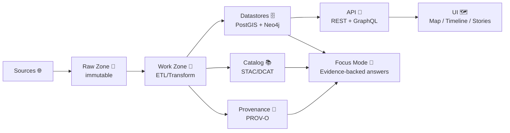
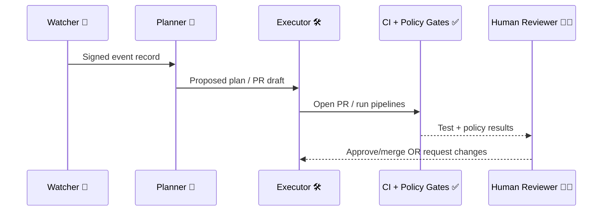

---
kfm:
  kind: runbook
  template: TEMPLATE__RUNBOOK
  version: "1.0.0"
  status: "draft" # draft | active | deprecated
  created: "YYYY-MM-DD"
  updated: "YYYY-MM-DD"
  owners:
    primary: "@<github_handle_or_team>"
    on_call: "@<github_handle_or_team>"
  review:
    cadence: "quarterly"
    next_review_due: "YYYY-MM-DD"
run:
  id: "<RUN_ID>" # e.g., 2026-01-21__ks-census-v2030__ingest
  type: "<RUN_TYPE>" # maintenance | ingest | backfill | release | incident | experiment
  environment: "<ENV>" # local | dev | staging | prod
  change_ticket: "<ISSUE_OR_INCIDENT_ID>"
systems:
  - "<system_1>" # pipelines | api | graph | ui | focus-mode | infra
data:
  domain: "<domain>" # e.g., demographics, climate, hydrology
  dataset_ids:
    - "kfm.<...>"
  classification: "<public|internal|restricted>"
  license: "<SPDX_ID or link>"
links:
  dashboards:
    - "<url>"
  logs:
    - "<url>"
  repo:
    url: "<repo url>"
    commit: "<git sha>"
  artifacts:
    stac: "<path-or-oci-ref>"
    dcat: "<path-or-oci-ref>"
    prov: "<path-or-oci-ref>"
    run_manifest: "mcp/runs/<RUN_ID>/run_manifest.json"
---

# 🧰 Runbook: <RUNBOOK_TITLE>


> [!IMPORTANT]
> **This file is a template.** Copy it into a real run folder, then replace all `<PLACEHOLDERS>`.

📦 **Expected placement**
```text
📦 Kansas-Frontier-Matrix
└─ 📂 mcp
   ├─ 📂 templates
   │  └─ 📂 sops
   │     └─ 🧾 TEMPLATE__RUNBOOK.md   👈 (this file)
   └─ 📂 runs
      └─ 📂 <RUN_ID>
         ├─ 🧾 RUNBOOK.md            ✅ (copy of this, filled in)
         ├─ 🧾 run_manifest.json     ✅ (generated)
         ├─ 🧾 prov.jsonld           ✅ (generated)
         ├─ 📂 outputs/              ✅ (artifacts)
         └─ 📂 logs/                 ✅ (sanitized logs)
```
(Repo layout + “SOP templates live in `mcp/templates/sops/`” are consistent with the KFM doc conventions.) [oai_citation:0‡MARKDOWN_GUIDE_v13.md.gdoc](file-service://file-UYVruFXfueR8veHMUKeugU) [oai_citation:1‡Kansas-Frontier-Matrix_ Open-Source Geospatial Historical Mapping Hub Design.pdf](file-service://file-ShqHKgjxCS9UT9vbcxDNzA)

---

## 🧭 Table of Contents
- [0) Quick Start](#0-quick-start)
- [1) Purpose](#1-purpose)
- [2) Scope](#2-scope)
- [3) Prerequisites](#3-prerequisites)
- [4) System Context](#4-system-context)
- [5) Governance & Safety](#5-governance--safety)
- [6) Signals & Triage](#6-signals--triage)
- [7) Procedure](#7-procedure)
- [8) Verification](#8-verification)
- [9) Rollback](#9-rollback)
- [10) Expected Outcome](#10-expected-outcome)
- [11) Troubleshooting / Notes](#11-troubleshooting--notes)
- [12) Evidence & Provenance Capture](#12-evidence--provenance-capture)
- [13) Post-Run Communications](#13-post-run-communications)
- [14) Appendix](#14-appendix)
- [15) References](#15-references)

---

## 0) Quick Start

### 🚨 If this is an incident (high urgency)
1) **Freeze the blast radius**  
   - [ ] Pause auto-promotions / scheduled ingest for this domain  
   - [ ] Enable **agent kill-switch** if automated agents are involved [oai_citation:2‡📚 Kansas Frontier Matrix (KFM) Data Intake – Technical & Design Guide.pdf](file-service://file-EbUCdsJMbu5KwpoKMrLrgj) [oai_citation:3‡📚 Kansas Frontier Matrix (KFM) Data Intake – Technical & Design Guide.pdf](file-service://file-EbUCdsJMbu5KwpoKMrLrgj)
2) **Confirm data classification & constraints**  
   - [ ] `data.classification` set correctly  
   - [ ] Sensitive locations/fields are not being exposed (UI/API/AI) [oai_citation:4‡📚 Kansas Frontier Matrix (KFM) Data Intake – Technical & Design Guide.pdf](file-service://file-EbUCdsJMbu5KwpoKMrLrgj)
3) **Snapshot evidence** (before changes)  
   - [ ] capture logs / metrics / run_manifest (even if partial)
4) **Triage** (root cause category)  
   - [ ] ingestion failure  
   - [ ] policy gate failure  
   - [ ] graph integrity failure  
   - [ ] API regression  
   - [ ] UI regression  
   - [ ] Focus Mode citation/policy failure (hard stop) [oai_citation:5‡📚 Kansas Frontier Matrix (KFM) Data Intake – Technical & Design Guide.pdf](file-service://file-EbUCdsJMbu5KwpoKMrLrgj)
5) **Contain → Fix → Verify → Publish a short incident update**  
   - [ ] link this runbook + issue/incident ticket

---

## 1) Purpose

**What this runbook is for:**  
- A repeatable, auditable SOP for **running** a KFM task (ingest/backfill/release/incident/experiment) with the platform’s contract-first + provenance-first rules. “No mystery layers” and no unsourced outputs are core design principles. [oai_citation:6‡Kansas Frontier Matrix (KFM) – Comprehensive Technical Documentation.pdf](file-service://file-AkqwUuYPp5zePf7pv5SMxi)

**What success looks like:**  
- The run completes **deterministically** (re-run safe / idempotent) with artifacts published and referenced via catalogs and provenance records [oai_citation:7‡MARKDOWN_GUIDE_v13.md.gdoc](file-service://file-UYVruFXfueR8veHMUKeugU) [oai_citation:8‡MARKDOWN_GUIDE_v13.md.gdoc](file-service://file-UYVruFXfueR8veHMUKeugU)  
- Policy gates pass (“fail closed” philosophy) [oai_citation:9‡Kansas Frontier Matrix (KFM) – Comprehensive Architecture, Features, and Design.pdf](file-service://file-4Umt1yHoGKicdmLWzFJ9sC)  
- UI/AI experiences remain **evidence-backed** (citations + traceability) [oai_citation:10‡Kansas Frontier Matrix (KFM) – AI System Overview 🧭🤖.pdf](file-service://file-Pv8eev6RWvCKrGCXyzY7zg) [oai_citation:11‡Kansas Frontier Matrix – Comprehensive UI System Overview.pdf](file-service://file-KcBQruYcoFVDEixzzRHTwt)

> [!NOTE]
> SOP structure aligns with KFM guidance: **Purpose → Prerequisites → Procedure → Expected Outcome → Troubleshooting/Notes**. [oai_citation:12‡Kansas-Frontier-Matrix_ Open-Source Geospatial Historical Mapping Hub Design.pdf](file-service://file-ShqHKgjxCS9UT9vbcxDNzA)

---

## 2) Scope

### ✅ In scope
- Data intake runs (batch or streaming-style “many small datasets”) with catalog + provenance  
- Metadata and governance updates (STAC/DCAT/PROV, policy pack changes)  
- Knowledge graph updates and integrity checks  
- API & UI smoke checks (REST/GraphQL, map/timeline/story nodes)  
- Focus Mode compliance checks (citations / refusal on no source) [oai_citation:13‡Kansas Frontier Matrix (KFM) – AI System Overview 🧭🤖.pdf](file-service://file-Pv8eev6RWvCKrGCXyzY7zg) [oai_citation:14‡📚 Kansas Frontier Matrix (KFM) Data Intake – Technical & Design Guide.pdf](file-service://file-EbUCdsJMbu5KwpoKMrLrgj)

### 🚫 Out of scope
- Writing new pipelines from scratch (use a design pack / pipeline template first)  
- Changing governance rules without review  
- Any process that bypasses catalogs/provenance (explicitly disallowed) [oai_citation:15‡MARKDOWN_GUIDE_v13.md.gdoc](file-service://file-UYVruFXfueR8veHMUKeugU)

---

## 3) Prerequisites

### 👤 Access & roles
- [ ] Repo write access (branch + PR)  
- [ ] Artifact registry access (if OCI artifacts are used)  
- [ ] DB access (PostGIS / Neo4j) if applicable  
- [ ] Ability to view dashboards/logs for this environment

### 🔧 Local tooling (examples)
- [ ] `git`, `make` (or repo task runner)  
- [ ] `python` + env manager (conda/uv/poetry) for pipelines  
- [ ] `psql` (PostGIS), `cypher-shell` (Neo4j), `jq`  
- [ ] `opa` + `conftest` for policy tests (if policy pack is in use) [oai_citation:16‡Kansas Frontier Matrix (KFM) – Comprehensive Architecture, Features, and Design.pdf](file-service://file-4Umt1yHoGKicdmLWzFJ9sC)  
- [ ] `oras` + `cosign` if using OCI artifact distribution [oai_citation:17‡Additional Project Ideas.pdf](file-service://file-Pc2GNivcrHBeKjBQksLC3T)

### 📦 Inputs ready?
- [ ] Source URLs / upstream references validated  
- [ ] License identified (SPDX if possible)  
- [ ] Data contract (schema + required metadata) ready — “contract-first” requirement [oai_citation:18‡Kansas Frontier Matrix (KFM) – Comprehensive Technical Documentation.pdf](file-service://file-AkqwUuYPp5zePf7pv5SMxi)

---

## 4) System Context

### 🏗️ Architectural mental model
KFM flows: **Raw Data → Pipelines → Databases/Graph → API → UI → Focus Mode**, with governance/telemetry around everything [oai_citation:19‡Kansas Frontier Matrix (KFM) – Comprehensive Architecture, Features, and Design.pdf](file-service://file-4Umt1yHoGKicdmLWzFJ9sC).


Evidence artifacts + catalogs + PROV are first-class, not optional [oai_citation:20‡MARKDOWN_GUIDE_v13.md.gdoc](file-service://file-UYVruFXfueR8veHMUKeugU).

### 🤖 Automation context (if applicable): W-P-E Agents
KFM supports a **Watcher–Planner–Executor** model for safe, auditable automation [oai_citation:21‡Kansas Frontier Matrix (KFM) – Comprehensive Architecture, Features, and Design.pdf](file-service://file-4Umt1yHoGKicdmLWzFJ9sC).



> [!CAUTION]
> Agent PRs should **not bypass CI or policy gates** and should support a **kill-switch** for safety [oai_citation:22‡📚 Kansas Frontier Matrix (KFM) Data Intake – Technical & Design Guide.pdf](file-service://file-EbUCdsJMbu5KwpoKMrLrgj) [oai_citation:23‡📚 Kansas Frontier Matrix (KFM) Data Intake – Technical & Design Guide.pdf](file-service://file-EbUCdsJMbu5KwpoKMrLrgj).

### 🖥️ UI/API integration notes
- UI is decoupled from backend via **REST + GraphQL**, modular/config-driven, and designed to surface provenance/citations [oai_citation:24‡Kansas Frontier Matrix – Comprehensive UI System Overview.pdf](file-service://file-KcBQruYcoFVDEixzzRHTwt)  
- Backend is designed to scale as stateless FastAPI services with heavy processing delegated to workers (cloud/Kubernetes friendly) [oai_citation:25‡Kansas Frontier Matrix (KFM) – Comprehensive Technical Documentation.pdf](file-service://file-AkqwUuYPp5zePf7pv5SMxi)

---

## 5) Governance & Safety

### 🧾 Non-negotiables
- **Provenance-first publishing:** no data goes to graph/UI without provenance & catalog metadata (policy-enforced) [oai_citation:26‡📚 Kansas Frontier Matrix (KFM) Data Intake – Technical & Design Guide.pdf](file-service://file-EbUCdsJMbu5KwpoKMrLrgj)  
- **Policy gates fail closed:** schema, STAC/DCAT/PROV completeness, license, sensitivity classification, provenance completeness; Focus Mode outputs must include citations [oai_citation:27‡Kansas Frontier Matrix (KFM) – Comprehensive Architecture, Features, and Design.pdf](file-service://file-4Umt1yHoGKicdmLWzFJ9sC)  
- **Focus Mode refusal on no source:** “if cannot provide a source, it is not allowed to answer” [oai_citation:28‡📚 Kansas Frontier Matrix (KFM) Data Intake – Technical & Design Guide.pdf](file-service://file-EbUCdsJMbu5KwpoKMrLrgj) [oai_citation:29‡Kansas Frontier Matrix (KFM) – AI System Overview 🧭🤖.pdf](file-service://file-Pv8eev6RWvCKrGCXyzY7zg)

### 🧠 Sensitive data guardrails
- [ ] If data is sensitive: confirm required redaction/generalization is applied (e.g., location fuzzing, access control)  
- [ ] Confirm AI output constraints: no revealing restricted coordinates or classified properties [oai_citation:30‡📚 Kansas Frontier Matrix (KFM) Data Intake – Technical & Design Guide.pdf](file-service://file-EbUCdsJMbu5KwpoKMrLrgj)  
- [ ] Confirm licensing constraints are respected (no publication without known license) [oai_citation:31‡Kansas Frontier Matrix (KFM) – Comprehensive Architecture, Features, and Design.pdf](file-service://file-4Umt1yHoGKicdmLWzFJ9sC)

### 🌿 FAIR + CARE alignment
- Ensure mandatory metadata + provenance for FAIR; respect CARE for sensitive/community-controlled data [oai_citation:32‡Kansas Frontier Matrix (KFM) – Comprehensive Architecture, Features, and Design.pdf](file-service://file-4Umt1yHoGKicdmLWzFJ9sC)  
- If Indigenous/community protocols apply, confirm governance review (authority-to-control) before publish [oai_citation:33‡Kansas Frontier Matrix (KFM) – Comprehensive Architecture, Features, and Design.pdf](file-service://file-4Umt1yHoGKicdmLWzFJ9sC)

> [!TIP]
> For privacy preservation techniques (k-anonymity / t-closeness / inference controls), see the privacy appendix below. [oai_citation:34‡Data Mining Concepts & applictions.pdf](file-service://file-2uwEbQAFVKpXaTtWgUirAH)

---

## 6) Signals & Triage

### 📈 What triggered this run?
- [ ] Scheduled ingest / cron
- [ ] New upstream release
- [ ] Watcher alert (policy/health check/event)
- [ ] Human report (UI/API/AI issue)
- [ ] Experiment / research run request

### 🔎 Classify the issue
- **Ingest/pipeline:** failures, schema drift, missing metadata  
- **Policy:** conftest/OPA failures, missing license/prov  
- **Graph:** orphans, missing relationships, provenance breaks  
- **API:** endpoint errors, latency, schema mismatch  
- **UI:** layers not loading, timeline regressions, story nodes broken  
- **Focus Mode:** missing citations, policy refusal loop, incorrect context linkage

### 🧪 Collect baseline evidence (before changes)
- [ ] Run ID: `<RUN_ID>`
- [ ] Environment: `<ENV>`
- [ ] Last known good artifact/version: `<tag|digest|commit>`
- [ ] Logs: `<link>`
- [ ] Dashboards: `<link>`
- [ ] Sample failing request(s): `<curl|graphql|ui steps>`

---

## 7) Procedure

> [!NOTE]
> Keep steps **deterministic, repeatable, and reviewable** (no hidden manual edits; no “mystery layers”). [oai_citation:35‡Kansas Frontier Matrix (KFM) – Comprehensive Technical Documentation.pdf](file-service://file-AkqwUuYPp5zePf7pv5SMxi)

### 7.1 Pre-flight checklist ✅
- [ ] Confirm the **dataset IDs** and domain scope  
- [ ] Confirm license + sensitivity classification  
- [ ] Confirm you have backups / rollbacks for prod changes  
- [ ] Confirm policy pack checks are enabled (fail closed) [oai_citation:36‡Kansas Frontier Matrix (KFM) – Comprehensive Architecture, Features, and Design.pdf](file-service://file-4Umt1yHoGKicdmLWzFJ9sC)  
- [ ] Confirm whether W-P-E automation is enabled; disable via kill-switch if needed [oai_citation:37‡📚 Kansas Frontier Matrix (KFM) Data Intake – Technical & Design Guide.pdf](file-service://file-EbUCdsJMbu5KwpoKMrLrgj)

### 7.2 Plan 🧠
Fill this out **before executing**:

- **Hypothesis / goal:**  
  - _Example:_ “Update `kfm.ks.census` to v2030, ensure STAC/DCAT/PROV updated, graph nodes reconciled, UI layer verified.”

- **Blast radius:** `<low|medium|high>`  
- **Change type:** `<data-only|metadata|code|policy|infra>`  
- **Rollback target:** `<commit/tag/digest>`  
- **Approval required:** `<who?>` (especially for sensitive data)

### 7.3 Execute 🛠️

#### A) Data acquisition (source → raw zone)
- [ ] Download/collect source data into raw zone (immutable)  
- [ ] Store source URL(s), timestamps, checksums

> [!TIP]
> For real-time style feeds, treat each interval as a small immutable slice + metadata (the system can query latest values from PostGIS and still preserve provenance via catalogs/prov) [oai_citation:38‡📚 Kansas Frontier Matrix (KFM) Data Intake – Technical & Design Guide.pdf](file-service://file-EbUCdsJMbu5KwpoKMrLrgj).

#### B) Transform (raw → work → processed)
- [ ] Run deterministic pipeline with config pinned (no random seeds unless recorded) [oai_citation:39‡MARKDOWN_GUIDE_v13.md.gdoc](file-service://file-UYVruFXfueR8veHMUKeugU)  
- [ ] If using AI-assisted transforms, ensure AI only **proposes** structured config and deterministic code executes after validation [oai_citation:40‡📚 Kansas Frontier Matrix (KFM) Data Intake – Technical & Design Guide.pdf](file-service://file-EbUCdsJMbu5KwpoKMrLrgj)

_Commands (placeholders — replace with repo’s actual runner):_
```bash
# Example placeholders
make pipeline.run PIPELINE=<pipeline_id> ENV=<ENV> RUN_ID=<RUN_ID>
make validate.contract DATASET_ID=<kfm...> ENV=<ENV>
```

#### C) Generate artifacts (catalog + provenance)
- [ ] Update/emit STAC & DCAT entries  
- [ ] Emit PROV record(s) for the run  
- [ ] Emit `run_manifest.json` (inputs, outputs, versions, summary counts)

> [!TIP]
> Run manifests can be hashed (RFC 8785 canonical JSON → SHA-256) for stable identity and audit trails [oai_citation:41‡Additional Project Ideas.pdf](file-service://file-Pc2GNivcrHBeKjBQksLC3T).

#### D) Store and distribute artifacts
Choose the applicable storage method:

**Option 1: Repo-managed artifacts (small/medium)**  
- [ ] Store outputs in version-controlled paths + catalogs reference them

**Option 2: OCI artifact distribution (large binaries / tiles / models)**  
- [ ] Push artifacts (PMTiles/GeoParquet/COGs/etc.) to OCI registry  
- [ ] Sign with Cosign (keyless OIDC if desired) [oai_citation:42‡Additional Project Ideas.pdf](file-service://file-Pc2GNivcrHBeKjBQksLC3T)  
- [ ] Catalog includes `distribution.oci` references (registry/repo/tag/digest/mediaTypes) [oai_citation:43‡Additional Project Ideas.pdf](file-service://file-Pc2GNivcrHBeKjBQksLC3T)

_Commands (examples — adjust to your registry + media types):_
```bash
# ORAS push (example)
oras push ghcr.io/<org>/<repo>:<tag> \
  ./tiles.pmtiles:application/vnd.pmtiles \
  ./table.geoparquet:application/vnd.geo+parquet

# Cosign sign (example)
cosign sign --yes ghcr.io/<org>/<repo>:<tag>
```

#### E) PR + policy gates
- [ ] Open PR with clear summary, links to ticket/run, and artifact refs  
- [ ] Ensure CI runs schema checks + policy gates (fail closed) [oai_citation:44‡Kansas Frontier Matrix (KFM) – Comprehensive Architecture, Features, and Design.pdf](file-service://file-4Umt1yHoGKicdmLWzFJ9sC)  
- [ ] If agent-generated PR, ensure it is labeled + reviewable; no bypass; human review required [oai_citation:45‡📚 Kansas Frontier Matrix (KFM) Data Intake – Technical & Design Guide.pdf](file-service://file-EbUCdsJMbu5KwpoKMrLrgj)

> [!NOTE]
> KFM also plans PR→PROV integration where PRs/commits/authors become PROV Activities/Entities/Agents and can be ingested into Neo4j for end-to-end traceability [oai_citation:46‡🌟 Kansas Frontier Matrix – Latest Ideas & Future Proposals.docx.pdf](file-service://file-SQ3f7ve8SGiusT6ThZEuCe).

---

## 8) Verification ✅

### 8.1 Policy & contract verification
- [ ] Data contract complete (schema + metadata) — contract-first requirement [oai_citation:47‡Kansas Frontier Matrix (KFM) – Comprehensive Technical Documentation.pdf](file-service://file-AkqwUuYPp5zePf7pv5SMxi)  
- [ ] STAC/DCAT/PROV complete  
- [ ] License present & valid  
- [ ] Sensitivity classification set and enforced  
- [ ] Provenance completeness check passes [oai_citation:48‡Kansas Frontier Matrix (KFM) – Comprehensive Architecture, Features, and Design.pdf](file-service://file-4Umt1yHoGKicdmLWzFJ9sC)

_Placeholder commands:_
```bash
conftest test data/ --policy policy/
opa eval --data policy/ --input <(cat <some.json>) "data.kfm.allow"
```

### 8.2 Graph integrity checks 🕸️
- [ ] No orphan nodes introduced (unless expected and documented)  
- [ ] PROV links exist from derived artifacts back to sources  
- [ ] Weekly/periodic health checks run and results stored [oai_citation:49‡Additional Project Ideas.pdf](file-service://file-Pc2GNivcrHBeKjBQksLC3T)

_Cypher examples (generic — adapt to real labels/relationships):_
```cypher
// Orphans
MATCH (n)
WHERE size((n)--()) = 0
RETURN labels(n) AS labels, count(*) AS c
ORDER BY c DESC;

// Missing provenance links (placeholder)
MATCH (e)
WHERE e.provenance_required = true AND NOT exists(e.prov_ref)
RETURN count(e) AS missing;
```

### 8.3 API checks 🔌
- [ ] REST endpoints respond (OpenAPI)  
- [ ] GraphQL schema compatible with UI  
- [ ] Latency within bounds  
- [ ] For “latest reading” style queries, confirm PostGIS query returns expected values [oai_citation:50‡📚 Kansas Frontier Matrix (KFM) Data Intake – Technical & Design Guide.pdf](file-service://file-EbUCdsJMbu5KwpoKMrLrgj)

### 8.4 UI smoke checks 🗺️
KFM UI is expected to support: 2D map, 3D globe, timeline, story nodes, search, layer panels, Focus Mode, offline/AR in future tracks [oai_citation:51‡Kansas Frontier Matrix – Comprehensive UI System Overview.pdf](file-service://file-KcBQruYcoFVDEixzzRHTwt) [oai_citation:52‡Kansas Frontier Matrix – Comprehensive UI System Overview.pdf](file-service://file-KcBQruYcoFVDEixzzRHTwt).

- [ ] 2D map loads target layer(s)  
- [ ] 3D globe/terrain renders (if applicable)  
- [ ] Timeline navigation works (time filtering)  
- [ ] Layer popups show source attribution/provenance  
- [ ] Story nodes referencing dataset still render (if relevant)  
- [ ] Export/share flows carry credits/citations (if applicable) [oai_citation:53‡Kansas Frontier Matrix – Comprehensive UI System Overview.pdf](file-service://file-KcBQruYcoFVDEixzzRHTwt)

### 8.5 Focus Mode checks 🤖
- [ ] Answers include citations to KFM data  
- [ ] If no source is available, Focus Mode refuses/expresses uncertainty (not fabrication) [oai_citation:54‡Kansas Frontier Matrix (KFM) – AI System Overview 🧭🤖.pdf](file-service://file-Pv8eev6RWvCKrGCXyzY7zg)  
- [ ] Context integration works (location/time/layers influence retrieval) [oai_citation:55‡Kansas Frontier Matrix (KFM) – AI System Overview 🧭🤖.pdf](file-service://file-Pv8eev6RWvCKrGCXyzY7zg)  
- [ ] OPA/runtime policy check on AI output passes (citations required) [oai_citation:56‡📚 Kansas Frontier Matrix (KFM) Data Intake – Technical & Design Guide.pdf](file-service://file-EbUCdsJMbu5KwpoKMrLrgj)

> [!CAUTION]
> “No citation” is a **hard policy failure** for Focus Mode outputs [oai_citation:57‡📚 Kansas Frontier Matrix (KFM) Data Intake – Technical & Design Guide.pdf](file-service://file-EbUCdsJMbu5KwpoKMrLrgj).

---

## 9) Rollback 🧯

### 9.1 Rollback decision checklist
- [ ] User-facing harm? (incorrect/sensitive data exposure)  
- [ ] Policy violation? (license/prov/citations)  
- [ ] Data corruption or graph integrity break?  
- [ ] Performance regression?

### 9.2 Rollback methods
**Data/artifacts**
- [ ] Re-pin catalogs to last known good digest/tag (OCI) [oai_citation:58‡Additional Project Ideas.pdf](file-service://file-Pc2GNivcrHBeKjBQksLC3T)  
- [ ] Revert data PR and redeploy catalogs/prov

**Graph / DB**
- [ ] Restore from snapshot or re-run last known good pipeline  
- [ ] Validate graph integrity again

**AI / Focus Mode**
- [ ] If citation policy failing: disable feature flag / block responses (fail closed) and investigate

**Automation**
- [ ] Engage kill-switch for agents if a loop or unsafe behavior is suspected [oai_citation:59‡📚 Kansas Frontier Matrix (KFM) Data Intake – Technical & Design Guide.pdf](file-service://file-EbUCdsJMbu5KwpoKMrLrgj)

---

## 10) Expected Outcome

At the end of the run, we should have:

- [ ] Data/artifacts stored and accessible via approved channels (catalog/API), not ad-hoc paths [oai_citation:60‡MARKDOWN_GUIDE_v13.md.gdoc](file-service://file-UYVruFXfueR8veHMUKeugU)  
- [ ] STAC/DCAT updated, PROV recorded, run_manifest recorded  
- [ ] Policy checks pass; no missing license/sensitivity/provenance fields [oai_citation:61‡Kansas Frontier Matrix (KFM) – Comprehensive Architecture, Features, and Design.pdf](file-service://file-4Umt1yHoGKicdmLWzFJ9sC)  
- [ ] Graph updated and healthy (no unexpected orphans)  
- [ ] UI renders correctly with visible provenance/citations (“map behind the map”) [oai_citation:62‡Kansas Frontier Matrix – Comprehensive UI System Overview.pdf](file-service://file-KcBQruYcoFVDEixzzRHTwt)  
- [ ] Focus Mode answers remain evidence-backed (citations) [oai_citation:63‡Kansas Frontier Matrix (KFM) – AI System Overview 🧭🤖.pdf](file-service://file-Pv8eev6RWvCKrGCXyzY7zg)

---

## 11) Troubleshooting / Notes

### 🔥 Common failure modes
- **Policy gate failure:** missing license/prov/sensitivity fields → fix metadata; do not bypass [oai_citation:64‡Kansas Frontier Matrix (KFM) – Comprehensive Architecture, Features, and Design.pdf](file-service://file-4Umt1yHoGKicdmLWzFJ9sC)  
- **Schema drift:** upstream added columns → update contract + pipeline (through PR)  
- **Graph inconsistencies:** missing relationships/prov edges → re-ingest or repair with auditable migration  
- **UI layer missing:** tiles/artifacts not published or catalog references wrong → validate distribution refs  
- **Focus Mode refuses:** retrieval returns no sources → ingest/attach sources first; do not force answer [oai_citation:65‡Kansas Frontier Matrix (KFM) – AI System Overview 🧭🤖.pdf](file-service://file-Pv8eev6RWvCKrGCXyzY7zg)

### 🧠 If automation is involved (W-P-E)
- Confirm watcher event is signed + has full context; planner PR is reviewable; executor actions are logged [oai_citation:66‡Kansas Frontier Matrix (KFM) – Comprehensive Architecture, Features, and Design.pdf](file-service://file-4Umt1yHoGKicdmLWzFJ9sC) [oai_citation:67‡📚 Kansas Frontier Matrix (KFM) Data Intake – Technical & Design Guide.pdf](file-service://file-EbUCdsJMbu5KwpoKMrLrgj)

---

## 12) Evidence & Provenance Capture 🧾

### 12.1 Minimum evidence bundle (attach or link)
- [ ] `run_manifest.json` (hashed if applicable) [oai_citation:68‡Additional Project Ideas.pdf](file-service://file-Pc2GNivcrHBeKjBQksLC3T)  
- [ ] `prov.jsonld` (or equivalent PROV record)  
- [ ] STAC + DCAT diff links  
- [ ] Policy gate logs (conftest/OPA output)  
- [ ] Graph health check output (if run) [oai_citation:69‡Additional Project Ideas.pdf](file-service://file-Pc2GNivcrHBeKjBQksLC3T)  
- [ ] UI verification notes (steps + screenshots if needed)  
- [ ] Focus Mode test prompts + citations shown

### 12.2 Optional: DevOps provenance (PR → PROV)
- [ ] Ensure PR activity record exists and is ingestible to graph (if enabled) [oai_citation:70‡🌟 Kansas Frontier Matrix – Latest Ideas & Future Proposals.docx.pdf](file-service://file-SQ3f7ve8SGiusT6ThZEuCe)

---

## 13) Post-Run Communications 📣

- [ ] Update ticket with: summary, links to artifacts, policy results, verification checklist  
- [ ] If user-facing: write brief release note (what changed, where provenance is, how to verify)  
- [ ] If incident: add timeline + root cause and link to retrospective

---

## 14) Appendix

<details>
<summary><strong>🗺️ A) Geospatial sanity checks (PostGIS examples)</strong></summary>

```sql
-- Geometry validity
SELECT COUNT(*) AS invalid_geoms
FROM <table>
WHERE NOT ST_IsValid(geom);

-- Bounding box sanity
SELECT ST_Extent(geom) FROM <table>;

-- Sampling a row to GeoJSON
SELECT id, ST_AsGeoJSON(geom) FROM <table> LIMIT 5;
```

> Use these to quickly detect corrupt geometries or wrong projections before tiles/UI rendering.

</details>

<details>
<summary><strong>🕸️ B) Graph sanity checks (generic Cypher)</strong></summary>

```cypher
// Find nodes created/updated in a window (placeholder property)
MATCH (n)
WHERE n.updated_at >= datetime("<START>") AND n.updated_at < datetime("<END>")
RETURN labels(n), count(*) ORDER BY count(*) DESC;

// Orphan nodes
MATCH (n) WHERE size((n)--()) = 0 RETURN n LIMIT 50;
```

> Institutionalizing graph integrity checks is recommended to keep the provenance stack unbroken [oai_citation:71‡Additional Project Ideas.pdf](file-service://file-Pc2GNivcrHBeKjBQksLC3T).

</details>

<details>
<summary><strong>🔐 C) Privacy & disclosure controls (quick checklist)</strong></summary>

When publishing aggregates or user-derived data, consider:
- [ ] Remove direct identifiers (names, IDs)  
- [ ] Apply generalization/suppression where needed  
- [ ] Evaluate **k-anonymity** and **t-closeness** risks for groups  
- [ ] Consider differential privacy / query auditing for sensitive datasets

Privacy concepts reference: t-closeness and related disclosure controls [oai_citation:72‡Data Mining Concepts & applictions.pdf](file-service://file-2uwEbQAFVKpXaTtWgUirAH).

</details>

<details>
<summary><strong>🧪 D) Experiments / simulation runs (MCP-style)</strong></summary>

If `<RUN_TYPE> = experiment`:
- [ ] Pin dataset versions (digest/tag/commit)  
- [ ] Record model versions and seeds  
- [ ] Save outputs with metadata + provenance (treat them as first-class entities)  
- [ ] Attach evaluation metrics + metric spec IDs (if applicable)  
- [ ] Ensure results are reproducible and reviewable (scientific-method style) [oai_citation:73‡Scientific Method _ Research _ Master Coder Protocol Documentation.pdf](file-service://file-HTpax4QbDgguDwxwwyiS32)

</details>

<details>
<summary><strong>🧿 E) Future-forward UI checks (AR / 4D / digital twin features)</strong></summary>

If AR / simulation visualization is enabled:
- [ ] Validate temporal alignment (time slider → correct map state)  
- [ ] Validate 3D story overlays / AR anchors (no sensitive leak)  
- [ ] Validate “what-if” scenario runs are clearly labeled and provenance-linked

Advanced concept reference (4D digital twins, AR storytelling): [oai_citation:74‡Innovative Concepts to Evolve the Kansas Frontier Matrix (KFM).pdf](file-service://file-G71zNoWKxsoSW44iwZaaCC)

</details>

---

## 15) References 📚

### Core KFM design & architecture
- 🧭 AI System Overview —  [oai_citation:75‡Kansas Frontier Matrix (KFM) – AI System Overview 🧭🤖.pdf](file-service://file-Pv8eev6RWvCKrGCXyzY7zg)  
- 🏗️ Architecture, Features, Design —  [oai_citation:76‡Kansas Frontier Matrix (KFM) – Comprehensive Architecture, Features, and Design.pdf](file-service://file-4Umt1yHoGKicdmLWzFJ9sC)  
- 🗺️ UI System Overview —  [oai_citation:77‡Kansas Frontier Matrix – Comprehensive UI System Overview.pdf](file-service://file-KcBQruYcoFVDEixzzRHTwt)  
- 📚 Data Intake Guide —  [oai_citation:78‡📚 Kansas Frontier Matrix (KFM) Data Intake – Technical & Design Guide.pdf](file-service://file-EbUCdsJMbu5KwpoKMrLrgj)  
- 🧰 Comprehensive Technical Documentation —  [oai_citation:79‡Kansas Frontier Matrix (KFM) – Comprehensive Technical Documentation.pdf](file-service://file-AkqwUuYPp5zePf7pv5SMxi)  
- 🌟 Latest Ideas & Future Proposals —  [oai_citation:80‡🌟 Kansas Frontier Matrix – Latest Ideas & Future Proposals.docx.pdf](file-service://file-SQ3f7ve8SGiusT6ThZEuCe)  

### Governance, ops patterns, and extensions
- ✅ Additional Project Ideas (OCI artifacts, run manifests, policy gates, graph health checks) —  [oai_citation:81‡Additional Project Ideas.pdf](file-service://file-Pc2GNivcrHBeKjBQksLC3T)  
- 💡 Innovative Concepts (AR, simulations, inclusive design) —  [oai_citation:82‡Innovative Concepts to Evolve the Kansas Frontier Matrix (KFM).pdf](file-service://file-G71zNoWKxsoSW44iwZaaCC)  

### Templates & documentation standards
- 🧾 Markdown Guide v13 —  [oai_citation:83‡📚 Kansas Frontier Matrix (KFM) Data Intake – Technical & Design Guide.pdf](file-service://file-EbUCdsJMbu5KwpoKMrLrgj)  
- 🧪 Scientific Method / Master Coder Protocol —  [oai_citation:84‡KFM- python-geospatial-analysis-cookbook-over-60-recipes-to-work-with-topology-overlays-indoor-routing-and-web-application-analysis-with-python.pdf](file-service://file-2gpiGDZS8iw6EdxGswEdHp)  

### Supplemental research/toolbox (project libraries)
- 🤖 AI Concepts & more —  [oai_citation:85‡AI Concepts & more.pdf](file-service://file-K6BctJjeUwvyCahLf9qdwr)  
- 🧠 Data Mining Concepts & applications —  [oai_citation:86‡🌟 Kansas Frontier Matrix – Latest Ideas & Future Proposals.docx.pdf](file-service://file-SQ3f7ve8SGiusT6ThZEuCe)  
- 🛰️ Python Geospatial Analysis Cookbook —  [oai_citation:87‡KFM- python-geospatial-analysis-cookbook-over-60-recipes-to-work-with-topology-overlays-indoor-routing-and-web-application-analysis-with-python.pdf](file-service://file-2gpiGDZS8iw6EdxGswEdHp)  
- 🗃️ Data Management theories & architectures (PDF portfolio) —  [oai_citation:88‡Data Managment-Theories-Architures-Data Science-Baysian Methods-Some Programming Ideas.pdf](file-service://file-RrXMFY7cP925exsQYermf2)  
- 🌍 Maps / GoogleMaps / Virtual Worlds / WebGL (PDF portfolio) —  [oai_citation:89‡Maps-GoogleMaps-VirtualWorlds-Archaeological-Computer Graphics-Geospatial-webgl.pdf](file-service://file-RshcX5sNY2wpiNjRfoP6z6)  
- 🧰 Various programming languages & resources (PDF portfolio) —  [oai_citation:90‡Various programming langurages & resources 1.pdf](file-service://file-4wp3wSSZs7gk5qHWaJVudi)  
- 🧭 Open-source mapping hub design —  [oai_citation:91‡Kansas-Frontier-Matrix_ Open-Source Geospatial Historical Mapping Hub Design.pdf](file-service://file-BJN3xmP44EHc9NRCccCn4H)  

### Legacy / attachment anchors
-  [oai_citation:92‡Kansas Frontier Matrix – Comprehensive UI System Overview.pdf](file-service://file-KcBQruYcoFVDEixzzRHTwt)  
-  [oai_citation:93‡📚 Kansas Frontier Matrix (KFM) Data Intake – Technical & Design Guide.pdf](file-service://file-EbUCdsJMbu5KwpoKMrLrgj)  
-  [oai_citation:94‡Innovative Concepts to Evolve the Kansas Frontier Matrix (KFM).pdf](file-service://file-G71zNoWKxsoSW44iwZaaCC)  
-  [oai_citation:95‡Additional Project Ideas.pdf](file-service://file-Pc2GNivcrHBeKjBQksLC3T)  

---

## ✅ Definition of Done (for this runbook file)

- [ ] Front-matter complete + valid  
- [ ] Procedure is step-by-step and repeatable  
- [ ] Verification and rollback are explicit  
- [ ] Evidence bundle paths/links are provided  
- [ ] Governance/policy constraints acknowledged (“fail closed”) [oai_citation:96‡Kansas Frontier Matrix (KFM) – Comprehensive Architecture, Features, and Design.pdf](file-service://file-4Umt1yHoGKicdmLWzFJ9sC)  
- [ ] Runbook is reviewed and scheduled for periodic review (cadence set)

> “Definition of done” expectations include complete front-matter, clear scope, and resolution/claims linkage.
