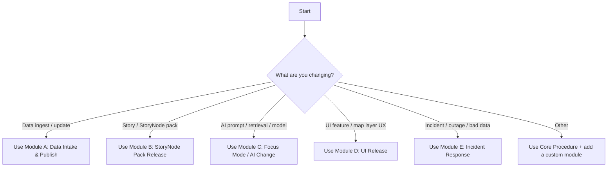

<!--
📄 FILE: mcp/templates/sops/TEMPLATE__SOP.md
🧾 Purpose: Universal SOP template for Kansas-Matrix-System / KFM-style provenance-first ops.
✂️ Copy, rename, and fill in all {{placeholders}} before merging.
-->

---
title: "🧾 SOP — {{SOP_TITLE}}"
sop_id: "SOP-{{YYYY}}-{{NNN}}"
status: "template" # template | draft | active | deprecated
version: "v0.1.0"
owners:
  - "{{OWNER_NAME_OR_TEAM}}"
approvers:
  - "{{APPROVER_ROLE_OR_NAME}}"
last_updated: "{{YYYY-MM-DD}}"
review_due: "{{YYYY-MM-DD}}"

domain_tags:
  - "{{data_intake|ui|ai|ops|security|community|release}}"

risk_tier: "{{low|medium|high}}"
data_sensitivity: "{{public|internal|restricted}}"
care_label: "{{Public|Restricted · Tribal Sensitive|…}}"
license: "{{SPDX_ID}}"

related:
  issue: "{{LINK_OR_ISSUE_ID}}"
  adr: "{{LINK_TO_ADR}}"
  runbook: "{{LINK_TO_RUNBOOK}}"
  docs: "{{LINKS_TO_SUPPORTING_DOCS}}"

mcp:
  automation_eligible: "{{yes|no|partial}}"
  wpe_mode: "{{manual|semi_auto|auto_with_approvals}}"
  policy_pack: "{{policy-pack-version-or-ref}}"
---

# 🧾 SOP Template — {{SOP_TITLE}}


## 📁 Where this lives

```text
🗂️ repo-root/
  🧠 mcp/
    🧩 templates/
      🧾 sops/
        ✅ TEMPLATE__SOP.md   👈 you are here
```

---

## 🧠 SOP at a glance

| Field | Value |
|---|---|
| **Owner** | {{OWNER_NAME_OR_TEAM}} |
| **Approver(s)** | {{APPROVER_ROLE_OR_NAME}} |
| **Risk tier** | {{low/medium/high}} |
| **Data sensitivity** | {{public/internal/restricted}} |
| **CARE label** | {{Public/Restricted/Tribal Sensitive/...}} |
| **Automation** | {{manual / semi_auto / auto_with_approvals}} |
| **Primary systems touched** | {{PostGIS / Neo4j / STAC / UI / AI / CI-CD / …}} |
| **Expected duration** | {{e.g., 30–90 min}} |
| **Rollback available** | {{yes/no}} |

---

## 🧭 Decision guide



---

## 🎯 Purpose

**Describe why this SOP exists and what “good” looks like.**

- **Outcome:** {{clear outcome}}  
- **User impact:** {{who benefits + how}}  
- **Trust / audit goal:** {{what must be provable later}}  

> [!IMPORTANT]
> For KFM-style systems, the goal is “traceable and accountable” outputs (data, UI, AI) with provenance and citations surfaced to users.  [oai_citation:0‡Kansas Frontier Matrix (KFM) – AI System Overview 🧭🤖.pdf](file-service://file-Pv8eev6RWvCKrGCXyzY7zg) [oai_citation:1‡Kansas Frontier Matrix – Comprehensive UI System Overview.pdf](file-service://file-KcBQruYcoFVDEixzzRHTwt)

---

## 🧩 Scope

### ✅ In scope
- {{what is covered}}

### 🚫 Out of scope
- {{what is explicitly not covered}}

---

## 🧱 Principles & non-negotiables

Check each one before executing the SOP:

- [ ] **Provenance-first UX:** users can trace “the map behind the map.”  [oai_citation:2‡Kansas Frontier Matrix – Comprehensive UI System Overview.pdf](file-service://file-KcBQruYcoFVDEixzzRHTwt)
- [ ] **AI outputs must cite sources and refuse if unsupported.**  [oai_citation:3‡Kansas Frontier Matrix (KFM) – AI System Overview 🧭🤖.pdf](file-service://file-Pv8eev6RWvCKrGCXyzY7zg)
- [ ] **Governance is “day zero,” not a bolt-on** (FAIR+CARE, sovereignty-awareness).  [oai_citation:4‡📚 Kansas Frontier Matrix (KFM) Data Intake – Technical & Design Guide.pdf](file-service://file-EbUCdsJMbu5KwpoKMrLrgj)
- [ ] **Append-only & deterministic pipelines** (raw is write-once; scripted repeatability).  [oai_citation:5‡📚 Kansas Frontier Matrix (KFM) Data Intake – Technical & Design Guide.pdf](file-service://file-EbUCdsJMbu5KwpoKMrLrgj) [oai_citation:6‡📚 Kansas Frontier Matrix (KFM) Data Intake – Technical & Design Guide.pdf](file-service://file-EbUCdsJMbu5KwpoKMrLrgj)
- [ ] **Fail-closed policy gates:** if checks fail, do not ship.  [oai_citation:7‡Kansas Frontier Matrix (KFM) – Comprehensive Architecture, Features, and Design.pdf](file-service://file-4Umt1yHoGKicdmLWzFJ9sC)
- [ ] **WPE (Watcher–Planner–Executor) never bypasses review** (funnels into PR/alert).  [oai_citation:8‡Kansas Frontier Matrix (KFM) – AI System Overview 🧭🤖.pdf](file-service://file-Pv8eev6RWvCKrGCXyzY7zg)
- [ ] **Signed + auditable artifacts for releases** (where applicable).  [oai_citation:9‡Additional Project Ideas.pdf](file-service://file-Pc2GNivcrHBeKjBQksLC3T)

---

## 👥 Roles & responsibilities

| Role | Responsibilities | Required? |
|---|---|---|
| **Requester** | Opens issue, defines desired outcome, supplies sources | ☐ |
| **Owner / Operator** | Runs SOP, collects evidence, writes post-run summary | ✅ |
| **Reviewer** | Reviews PR/output, verifies policy gates, signs off | ✅ |
| **Data Steward / Council Liaison** | Reviews governance, CARE label, consent constraints | ☐ |
| **Security** | Reviews secrets, auth, supply chain, threat model impacts | ☐ |
| **Community Moderator** | Reviews sensitive narratives / public-facing content | ☐ |

---

## 🔐 Governance, privacy, and safety checklist

### 1) Sensitivity & CARE labeling
- **Sensitivity:** {{public/internal/restricted}}  
- **CARE label:** {{Public / Restricted · Tribal Sensitive / …}}  
- **Consent required?** {{yes/no}}  
- **Special handling:** {{redaction, aggregation, geofuzzing, gating}}  

> [!NOTE]
> Consent-based governance and cultural protocols may require fine-grained access control beyond “public/private.” 

### 2) Privacy risk controls (if any person-level or sensitive location data exists)
- [ ] Apply aggregation / obfuscation where needed (ex: sensitive sites, endangered species)
- [ ] Document justification for any precision coordinates
- [ ] Ensure access controls match dataset tags / governance rules

> [!TIP]
> Consider privacy models like k-anonymity / l-diversity / t-closeness (and limitations) for release decisions.  [oai_citation:10‡Data Mining Concepts & applictions.pdf](file-service://file-2uwEbQAFVKpXaTtWgUirAH)

### 3) Security & supply chain
- [ ] Secrets are not in code; rotate if touched
- [ ] AuthZ/RBAC impact assessed (JWT/roles/etc.)
- [ ] Inputs sanitized; rate limits considered
- [ ] SBOM / dependency integrity addressed for releases

(Reference: application security + supply chain guidance)  [oai_citation:11‡Kansas Frontier Matrix (KFM) – Comprehensive Architecture, Features, and Design.pdf](file-service://file-4Umt1yHoGKicdmLWzFJ9sC)

### 4) Sustainability (for heavy compute or big backfills)
- [ ] Estimate compute cost + storage growth
- [ ] Record expected run-time and resource footprint
- [ ] Note any carbon/energy reporting requirement

(Reference: energy + carbon accountability emphasis)  [oai_citation:12‡Kansas Frontier Matrix (KFM) – Comprehensive Technical Documentation.pdf](file-service://file-AkqwUuYPp5zePf7pv5SMxi)

---

## 🧰 Inputs

List every input needed to execute this SOP:

- **Issue / ticket:** {{link}}  
- **Source data(s):** {{links, locations, checksums}}  
- **Schemas / contracts:** {{STAC/DCAT/PROV schemas, dataset contract}}  
- **Access:** {{accounts, roles}}  
- **Tooling versions:** {{python/node/docker/gdal/qgis/etc}}  

---

## 📦 Outputs

List what gets produced, where, and how it’s verified:

- **Code artifacts:** {{PR link}}  
- **Data artifacts:** {{COGs, GeoJSON, PMTiles, GeoParquet, …}}  
- **Metadata artifacts:** {{STAC collection, DCAT dataset, PROV records}}  [oai_citation:13‡📚 Kansas Frontier Matrix (KFM) Data Intake – Technical & Design Guide.pdf](file-service://file-EbUCdsJMbu5KwpoKMrLrgj)
- **Graph artifacts:** {{Neo4j nodes/edges; PostGIS tables}}  
- **UI artifacts:** {{layer config, story config, export bundles}}  
- **Release artifacts:** {{OCI artifact, signed bundle, checksums}}  [oai_citation:14‡Additional Project Ideas.pdf](file-service://file-Pc2GNivcrHBeKjBQksLC3T)

---

## 🧪 Preconditions

- [ ] You have required permissions (repo + infrastructure)
- [ ] You have a clean working branch
- [ ] You know the rollback plan (or you explicitly accept no rollback)
- [ ] You have identified policy gates that must pass

---

## 🧭 Core procedure

> [!IMPORTANT]
> Keep this section “do-this-then-that.” If it can’t be executed by someone else, it’s not an SOP.

### 0) Intake & triage
- [ ] Confirm request + intended outcome
- [ ] Identify impacted systems (data / graph / UI / AI / policy / infra)
- [ ] Assign **risk tier** and **sensitivity**
- [ ] Create/confirm tracking issue

### 1) Plan
- [ ] Write a short plan (bullets) + link it here: {{plan link}}
- [ ] Identify required schema changes (if any)
- [ ] Identify required governance approvals (if any)
- [ ] Define acceptance criteria + validation steps

### 2) Execute changes
- [ ] Implement changes on a branch
- [ ] Keep transformations scripted + reproducible
- [ ] Record key parameters (versions, seeds, configs, commit SHA)

> [!NOTE]
> For data-intensive work, follow a staged, multi-step process: requirements → investigation → translation to metadata.  [oai_citation:15‡Data Mining Concepts & applictions.pdf](file-service://file-2uwEbQAFVKpXaTtWgUirAH)

### 3) Validate (stop-the-line gates)
- [ ] Schema validation (STAC/DCAT/PROV as applicable)
- [ ] Unit/integration tests pass
- [ ] Policy checks pass (fail-closed)
- [ ] Provenance complete (sources, licenses, processing)
- [ ] For AI-facing changes: citation coverage + governance checks pass

### 4) Package & publish
- [ ] Create immutable, versioned artifacts (no silent overwrites)
- [ ] If shipping bundles/packs: build + sign artifact, record digest
- [ ] Update catalogs + indexes
- [ ] Update release notes / change log

### 5) Deploy / promote
- [ ] Use the correct environment promotion path (dev → staging → prod)
- [ ] Confirm CI “detect → validate → promote” sequence completes (if used)  [oai_citation:16‡🌟 Kansas Frontier Matrix – Latest Ideas & Future Proposals.docx.pdf](file-service://file-SQ3f7ve8SGiusT6ThZEuCe)
- [ ] Confirm governance sign-offs completed (if required)

### 6) Post-deploy verification
- [ ] Smoke test in UI (layers, search, time slider, story playback)
- [ ] Check provenance panels / export attributions
- [ ] Verify query performance + caching (if relevant)
- [ ] Monitor errors/logs for {{X}} minutes/hours

### 7) Closeout
- [ ] Post a short summary on the issue:
  - what changed
  - evidence attached
  - how to roll back
  - who approved
- [ ] Mark next review date (if needed)

---

## ✅ Acceptance criteria

Define what “done” means (measurable):

- **Functional:** {{criteria}}
- **Governance:** {{criteria}}
- **Performance:** {{criteria}}
- **UX:** {{criteria}}
- **AI trust:** {{criteria}} (citations, refusal behavior, audit panel)

---

## 🧯 Rollback & recovery

### Rollback strategy
- **Can we roll back?** {{yes/no}}  
- **Rollback method:** {{revert PR / restore artifact digest / repoint catalog}}  
- **Data rollback note:** {{append-only means rollback = new corrective version}}  [oai_citation:17‡📚 Kansas Frontier Matrix (KFM) Data Intake – Technical & Design Guide.pdf](file-service://file-EbUCdsJMbu5KwpoKMrLrgj)

### Recovery checks
- [ ] System health OK
- [ ] Graph integrity OK (counts, constraints, key relationships)
- [ ] No policy violations introduced
- [ ] UI renders expected layers/stories

---

## 📈 Observability & monitoring

### What to watch
- **Metrics:** {{latency, error rate, job duration, drift metrics}}
- **Logs:** {{where + what filters}}
- **Alerts:** {{what thresholds}}

> [!NOTE]
> Drift monitoring and bias checks are part of AI QA, with alerts when accuracy/citation coverage declines.  [oai_citation:18‡Kansas Frontier Matrix (KFM) – AI System Overview 🧭🤖.pdf](file-service://file-Pv8eev6RWvCKrGCXyzY7zg)

### Graph / data health checks (recommended)
- [ ] Run graph health check / anomaly detection (if changes touch Neo4j)  [oai_citation:19‡Additional Project Ideas.pdf](file-service://file-Pc2GNivcrHBeKjBQksLC3T)

---

## 🤖 MCP automation hooks (optional)

Use this section if this SOP is runnable by agents (Watcher–Planner–Executor).

```yaml
mcp_runbook:
  triggers:
    - "{{cron|webhook|manual}}"
  watcher_conditions:
    - "{{example: new upstream release detected}}"
  planner_outputs:
    - "{{example: create PR with updated dataset + metadata}}"
  executor_actions:
    - "{{example: run pipeline in sandbox, attach evidence}}"
  guardrails:
    - "must_open_pr: true"
    - "policy_checks_required: true"
    - "human_approval_required_for: [restricted_data, prod_deploy]"
```

> [!IMPORTANT]
> The WPE flow should funnel work into PRs/alerts and require policy checks; nothing goes “straight to prod.”  [oai_citation:20‡Kansas Frontier Matrix (KFM) – AI System Overview 🧭🤖.pdf](file-service://file-Pv8eev6RWvCKrGCXyzY7zg)

---

# 🧩 Optional modules

> Add the module(s) relevant to this SOP. Delete the rest.

<details>
<summary><strong>Module A 🗺️ Data Intake & Publish</strong></summary>

### A1) Data staging & immutability
- [ ] Store raw source as write-once
- [ ] Record checksums + source URLs
- [ ] Ensure every transformation is scripted and repeatable  [oai_citation:21‡📚 Kansas Frontier Matrix (KFM) Data Intake – Technical & Design Guide.pdf](file-service://file-EbUCdsJMbu5KwpoKMrLrgj)

### A2) Metadata backbone (STAC/DCAT/PROV)
- [ ] Create/Update STAC collection/items
- [ ] Create/Update DCAT dataset record
- [ ] Emit PROV entities/activities/agents for lineage  [oai_citation:22‡📚 Kansas Frontier Matrix (KFM) Data Intake – Technical & Design Guide.pdf](file-service://file-EbUCdsJMbu5KwpoKMrLrgj)

### A3) Database + graph integration
- [ ] Load spatial data into PostGIS where appropriate
- [ ] Load relationships into Neo4j where appropriate
- [ ] Keep UI decoupled from graph—API is the interface boundary  [oai_citation:23‡📚 Kansas Frontier Matrix (KFM) Data Intake – Technical & Design Guide.pdf](file-service://file-EbUCdsJMbu5KwpoKMrLrgj)

### A4) Data quality
- [ ] Profile data (missingness, outliers, geometry validity)
- [ ] Cleanse/normalize (document all decisions)
- [ ] Validate geometry in PostGIS (example snippet below)

```sql
-- Example: geometry validity details (adapt table/column names)
SELECT
  gid,
  ST_IsValid(geom) AS is_valid,
  (ST_IsValidDetail(geom)).reason AS reason
FROM {{table}}
WHERE NOT ST_IsValid(geom);
```

(Reference query pattern)  [oai_citation:24‡KFM- python-geospatial-analysis-cookbook-over-60-recipes-to-work-with-topology-overlays-indoor-routing-and-web-application-analysis-with-python.pdf](file-service://file-2gpiGDZS8iw6EdxGswEdHp)

### A5) Governance gates
- [ ] License present
- [ ] Sensitivity & CARE label correct
- [ ] Council/liaison approvals attached if required  [oai_citation:25‡📚 Kansas Frontier Matrix (KFM) Data Intake – Technical & Design Guide.pdf](file-service://file-EbUCdsJMbu5KwpoKMrLrgj)

</details>

<details>
<summary><strong>Module B 📦 StoryNode Pack Release (OCI + Signatures)</strong></summary>

### B1) Build pack
- [ ] Bundle StoryNodes + dependencies (tiles/rasters/vectors/narrative JSON)
- [ ] Produce manifest with checksums + dependencies

### B2) Publish as signed OCI artifact
- [ ] Push pack via ORAS
- [ ] Sign with Cosign
- [ ] Record digest + verification instructions in release notes  [oai_citation:26‡Additional Project Ideas.pdf](file-service://file-Pc2GNivcrHBeKjBQksLC3T)

### B3) Rollback plan
- [ ] Rollback = repoint to prior digest / tag, not delete history

</details>

<details>
<summary><strong>Module C 🤖 Focus Mode / AI Change</strong></summary>

### C1) Retrieval & evidence
- [ ] Confirm hybrid retrieval (graph + text) still works
- [ ] Ensure every claim is tied to source artifacts
- [ ] If unsupported, answer must refuse or express uncertainty  [oai_citation:27‡Kansas Frontier Matrix (KFM) – AI System Overview 🧭🤖.pdf](file-service://file-Pv8eev6RWvCKrGCXyzY7zg)

### C2) Governance check pipeline
- [ ] Parse → Retrieve → Generate → Governance check → Answer with citations  [oai_citation:28‡Kansas Frontier Matrix (KFM) – AI System Overview 🧭🤖.pdf](file-service://file-Pv8eev6RWvCKrGCXyzY7zg)

### C3) Prompt security layers
- [ ] Validate prompt gate policies
- [ ] Test for injection patterns / misuse
- [ ] Verify sensitive/offensive language rules adhere to governance  [oai_citation:29‡Kansas Frontier Matrix (KFM) – AI System Overview 🧭🤖.pdf](file-service://file-Pv8eev6RWvCKrGCXyzY7zg) [oai_citation:30‡Kansas Frontier Matrix (KFM) – AI System Overview 🧭🤖.pdf](file-service://file-Pv8eev6RWvCKrGCXyzY7zg)

### C4) Drift + bias tests
- [ ] Run bias test suite
- [ ] Verify drift metrics + citation coverage alerts remain correct  [oai_citation:31‡Kansas Frontier Matrix (KFM) – AI System Overview 🧭🤖.pdf](file-service://file-Pv8eev6RWvCKrGCXyzY7zg)

### C5) Audit logging
- [ ] Confirm governance ledger / audit trail captures sources + approvals  [oai_citation:32‡Kansas Frontier Matrix (KFM) – AI System Overview 🧭🤖.pdf](file-service://file-Pv8eev6RWvCKrGCXyzY7zg)

</details>

<details>
<summary><strong>Module D 🧭 UI Release (Maps / Timeline / Story / Offline / AR)</strong></summary>

### D1) Trust & provenance surfacing
- [ ] UI surfaces provenance and context (layer attribution, citations, export credits)  [oai_citation:33‡Kansas Frontier Matrix – Comprehensive UI System Overview.pdf](file-service://file-KcBQruYcoFVDEixzzRHTwt)

### D2) API boundary
- [ ] Frontend consumes REST/GraphQL endpoints; no direct DB coupling  [oai_citation:34‡Kansas Frontier Matrix – Comprehensive UI System Overview.pdf](file-service://file-KcBQruYcoFVDEixzzRHTwt)

### D3) Story Nodes & narrative playback
- [ ] StoryNode config validated
- [ ] Playback controls tested (timeline sync, layer toggles) 

### D4) Offline + AR (if applicable)
- [ ] Offline pack updated (subset, efficient)
- [ ] AR mode filters layers to prevent clutter; performance verified  [oai_citation:35‡Kansas Frontier Matrix – Comprehensive UI System Overview.pdf](file-service://file-KcBQruYcoFVDEixzzRHTwt)

</details>

<details>
<summary><strong>Module E 🚨 Incident Response (Bad data, outage, policy breach)</strong></summary>

### E1) Declare incident
- [ ] Open incident issue
- [ ] Assign incident commander + comms owner
- [ ] Freeze deployments if needed

### E2) Contain
- [ ] Disable affected endpoints/layers/features (feature flags)
- [ ] Revert/roll forward with corrective versions (append-only)
- [ ] Preserve evidence (logs, artifacts, digests)

### E3) Correct
- [ ] Root cause analysis
- [ ] Add new policy gate/tests to prevent recurrence
- [ ] Postmortem + action items

</details>

---

## ✅ Definition of Done (Doc + Ops)

> Based on KFM-style doc rigor: front-matter, required sections, citations, lint, review.  [oai_citation:36‡Comprehensive Markdown Guide_ Syntax, Extensions, and Best Practices.docx](file-service://file-J6rFRcp4ExCCeCdTevQjxz) [oai_citation:37‡Comprehensive Markdown Guide_ Syntax, Extensions, and Best Practices.docx](file-service://file-J6rFRcp4ExCCeCdTevQjxz)

- [ ] Front-matter complete & valid
- [ ] All required sections present (Purpose, Scope, Procedure, Validation, Rollback)
- [ ] All factual claims have citations/links to evidence (or are marked uncertain)
- [ ] Policy gates pass (fail-closed)
- [ ] Reproducibility notes recorded (versions, configs, commit SHA, seeds if relevant)
- [ ] Reviewed + approved by required roles
- [ ] Closeout summary posted in the tracking issue

---

## 🗓️ Revision history

| Date | Version | Change | Author |
|---|---:|---|---|
| {{YYYY-MM-DD}} | v0.1.0 | Initial SOP from template | {{name}} |

---

## 📚 Project reference library (source docs)

> These are the “anchor” documents this template aligns with. Keep this list current.

### Core KFM docs
- 🌟 Latest ideas & future proposals:  [oai_citation:38‡🌟 Kansas Frontier Matrix – Latest Ideas & Future Proposals.docx.pdf](file-service://file-SQ3f7ve8SGiusT6ThZEuCe)  
- 🏗️ Comprehensive architecture / features / design:  [oai_citation:39‡Kansas Frontier Matrix (KFM) – Comprehensive Architecture, Features, and Design.pdf](file-service://file-4Umt1yHoGKicdmLWzFJ9sC)  
- 🧭 AI system overview (Focus Mode, governance, WPE):  [oai_citation:40‡Kansas Frontier Matrix (KFM) – AI System Overview 🧭🤖.pdf](file-service://file-Pv8eev6RWvCKrGCXyzY7zg)  
- 🖥️ UI system overview (maps, timeline, StoryNodes, offline, AR):  [oai_citation:41‡Kansas Frontier Matrix – Comprehensive UI System Overview.pdf](file-service://file-KcBQruYcoFVDEixzzRHTwt)  
- 📚 Data intake technical & design guide:  [oai_citation:42‡📚 Kansas Frontier Matrix (KFM) Data Intake – Technical & Design Guide.pdf](file-service://file-EbUCdsJMbu5KwpoKMrLrgj)  
- 🧱 Comprehensive technical documentation:  [oai_citation:43‡Kansas Frontier Matrix (KFM) – Comprehensive Technical Documentation.pdf](file-service://file-AkqwUuYPp5zePf7pv5SMxi)  
- 💡 Innovative concepts (Mukurtu-style governance, cultural protocols):  [oai_citation:44‡Innovative Concepts to Evolve the Kansas Frontier Matrix (KFM).pdf](file-service://file-G71zNoWKxsoSW44iwZaaCC)  
- 🧪 Additional project ideas (OCI packs, deterministic ingest, graph health):  [oai_citation:45‡Data Mining Concepts & applictions.pdf](file-service://file-2uwEbQAFVKpXaTtWgUirAH)  

### Reference libraries & “books” (bundles)
- 🤖 AI Concepts & more (library):  [oai_citation:46‡AI Concepts & more.pdf](file-service://file-K6BctJjeUwvyCahLf9qdwr)  
- 🗺️ Maps / geospatial / WebGL bundle:  [oai_citation:47‡Maps-GoogleMaps-VirtualWorlds-Archaeological-Computer Graphics-Geospatial-webgl.pdf](file-service://file-RshcX5sNY2wpiNjRfoP6z6)  
- 🧑‍💻 Programming languages & resources bundle:  [oai_citation:48‡Various programming langurages & resources 1.pdf](file-service://file-4wp3wSSZs7gk5qHWaJVudi)  
- 🗃️ Data management / theory / Bayesian bundle:  [oai_citation:49‡Data Managment-Theories-Architures-Data Science-Baysian Methods-Some Programming Ideas.pdf](file-service://file-RrXMFY7cP925exsQYermf2)  

### Frequently used embedded references (within bundles)
- 🗺️ Open-source geospatial mapping hub design:  [oai_citation:50‡Kansas Frontier Matrix (KFM) – Comprehensive Architecture, Features, and Design.pdf](file-service://file-4Umt1yHoGKicdmLWzFJ9sC)  
- 📘 Data mining concepts & applications:  [oai_citation:51‡Data Mining Concepts & applictions.pdf](file-service://file-2uwEbQAFVKpXaTtWgUirAH)  
- 🧪 Master Coder Protocol / Scientific Method:  [oai_citation:52‡Scientific Method _ Research _ Master Coder Protocol Documentation.pdf](file-service://file-HTpax4QbDgguDwxwwyiS32)  
- 🧭 Python geospatial analysis cookbook:  [oai_citation:53‡KFM- python-geospatial-analysis-cookbook-over-60-recipes-to-work-with-topology-overlays-indoor-routing-and-web-application-analysis-with-python.pdf](file-service://file-2gpiGDZS8iw6EdxGswEdHp)  
- 📝 Comprehensive Markdown Guide (templates + DoD):  [oai_citation:54‡Comprehensive Markdown Guide_ Syntax, Extensions, and Best Practices.docx](file-service://file-J6rFRcp4ExCCeCdTevQjxz)  
- 🧾 MARKDOWN_GUIDE_v13 (repo protocol notes):  [oai_citation:55‡MARKDOWN_GUIDE_v13.md.gdoc](file-service://file-UYVruFXfueR8veHMUKeugU)  

---

<details>
<summary><strong>📎 Evidence anchors (why this template is shaped this way)</strong></summary>

- **UI trust = “map behind the map”** provenance-first UX.  [oai_citation:56‡Kansas Frontier Matrix – Comprehensive UI System Overview.pdf](file-service://file-KcBQruYcoFVDEixzzRHTwt)  
- **AI must cite sources / refuse if unsupported** (transparency ethos).  [oai_citation:57‡Kansas Frontier Matrix (KFM) – AI System Overview 🧭🤖.pdf](file-service://file-Pv8eev6RWvCKrGCXyzY7zg)  
- **Governance day-zero** with FAIR+CARE as an engineering constraint.  [oai_citation:58‡📚 Kansas Frontier Matrix (KFM) Data Intake – Technical & Design Guide.pdf](file-service://file-EbUCdsJMbu5KwpoKMrLrgj)  
- **Append-only / deterministic** ingestion philosophy.  [oai_citation:59‡📚 Kansas Frontier Matrix (KFM) Data Intake – Technical & Design Guide.pdf](file-service://file-EbUCdsJMbu5KwpoKMrLrgj)  
- **Fail-closed policy gates** and structured checks.  [oai_citation:60‡Kansas Frontier Matrix (KFM) – Comprehensive Architecture, Features, and Design.pdf](file-service://file-4Umt1yHoGKicdmLWzFJ9sC)  
- **WPE agent flow** funnels to PRs and review.  [oai_citation:61‡Kansas Frontier Matrix (KFM) – AI System Overview 🧭🤖.pdf](file-service://file-Pv8eev6RWvCKrGCXyzY7zg)  
- **Signed OCI artifacts for StoryNode packs** (distribution + integrity).  [oai_citation:62‡Additional Project Ideas.pdf](file-service://file-Pc2GNivcrHBeKjBQksLC3T)  
- **Consent-based cultural protocols** beyond public/private.   
- **Drift + bias monitoring** as ongoing QA.  [oai_citation:63‡Kansas Frontier Matrix (KFM) – AI System Overview 🧭🤖.pdf](file-service://file-Pv8eev6RWvCKrGCXyzY7zg)  

</details>
