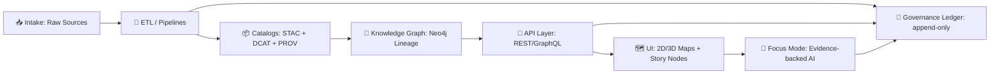

# 🧾 MCP Traceability — Kansas Frontier Matrix (KFM)

<p align="center">
  
  
  
  
  
</p>

> **Mission:** Every dataset, layer, story, simulation, and AI answer must be traceable to **cataloged sources** and **provable processing** — so users can always see the **map behind the map** 🗺️✨

---

## 🔎 What this folder is

This directory is the **MCP (Master Coder Protocol)** home for **traceability** in KFM.

It defines *how we capture, validate, store, and surface*:

- 📦 **Data lineage** (raw ➜ processed ➜ published)
- 🧬 **Provenance** (who/what/when/how produced an artifact)
- 🔐 **Governance events** (approvals, policy outcomes, access constraints)
- 🤖 **AI receipts** (what the assistant used + what it refused to invent)
- 🧪 **Simulation & modeling run evidence** (inputs, code, parameters, outputs)
- 🛠️ **DevOps lineage** (PRs/commits/releases as provenance data)

> [!IMPORTANT]
> **Traceability is a product feature** *and* a **hard gate**. If it can’t be traced, it can’t ship.

---

## 🧭 Quick navigation

- ✅ **Non‑negotiables** → [Traceability invariants](#-traceability-invariants)
- 🧱 **Architecture** → [End‑to‑end trace graph](#-end-to-end-trace-graph)
- 📦 **Artifacts** → [What we must generate](#-required-trace-artifacts)
- ⚖️ **Policy** → [Policy Pack & CI gates](#️-policy-pack--ci-gates)
- 🤖 **AI** → [Focus Mode receipts](#-focus-mode-traceability)
- 🛰️ **Streaming** → [Real‑time & sensors](#️-streaming--real-time-traceability)
- 🧪 **Simulations** → [Model runs & kfm-sim-run](#-simulations--modeling-traceability)
- 🧷 **DevOps** → [PR → PROV](#-devops-traceability-pr--prov)
- 🗂️ **Repo layout** → [Suggested contents of this folder](#️-suggested-folder-layout)

---

## ✅ Traceability invariants

These are the **MCP traceability guarantees** KFM aims to enforce across the platform:

### 1) 🚫 No “mystery layers”
- Anything visible in the UI or referenced by AI must map back to **cataloged sources**.
- Every published layer must have **source + license + provenance + classification**.

### 2) 📚 Metadata triplet is mandatory
Every dataset must have the **STAC + DCAT + PROV** alignment, linked across layers:

- **STAC**: assets + spatiotemporal extents + links to distributions
- **DCAT**: dataset-level discovery metadata, licensing, publisher, distributions
- **PROV**: the lineage graph (entities, activities, agents)

### 3) 🧾 Every meaningful output has a “receipt”
If KFM produces something that looks authoritative (map tiles, story claims, AI answers, analysis outputs, simulation results), it must write an **evidence receipt** that can be audited.

### 4) 🧯 “Fail closed” policy gates
If required evidence is missing:
- The ingestion fails
- The publication fails
- The UI must not display it
- Focus Mode must refuse rather than fabricate

### 5) 🧬 Determinism & idempotency
Pipelines must be **config-driven and replayable**:
- same inputs + same code + same config ⇒ same outputs + same checksums (within expected tolerances)

### 6) 🪪 Sensitivity & sovereignty are first-class trace data
Traceability includes not just “where from” but also:
- **constraints** (CARE / community protocols)
- **roles** (who can see what)
- **transformations** (obfuscation, redaction, aggregation)

---

## 🧱 End-to-end trace graph

KFM traceability spans the **canonical pipeline ordering**:



**Core idea:** KFM is **catalog-driven** and **evidence-first**. The catalogs and provenance *are* the backbone that everything else consumes.

---

## 📦 Required trace artifacts

This section describes the **minimum “receipt set”** per dataset / layer / output.

### 🗂️ Dataset artifacts (minimum)

| Artifact | Purpose | Typical location |
|---|---|---|
| `source.json` | Where it came from, retrieval method, timestamps, license URL, contact, terms | `data/raw/<dataset>/source.json` |
| `checksums.sha256` | Integrity & repeatability (raw + processed) | `data/raw/...` and/or `data/processed/...` |
| `data-contract.json` (or similar) | Schema + expectations + domain fields + provenance linkage | `data/contracts/...` |
| `stac/collection.json` + `stac/items/*.json` | Spatiotemporal assets & file pointers | `data/catalog/stac/...` |
| `dcat/dataset.jsonld` (or Turtle) | Discovery metadata & distributions | `data/catalog/dcat/...` |
| `prov/bundle.jsonld` | Entities/Activities/Agents + pipeline lineage | `data/provenance/...` |

> [!NOTE]
> KFM may define **KFM profiles** for STAC/DCAT/PROV (e.g., requiring `kfm:dataset_id`, `kfm:classification`, sovereignty fields, etc.).

### 🧠 Graph lineage artifacts (minimum)

Once imported into Neo4j, the trace should be navigable:

- Dataset node(s) (DCAT-derived)
- Asset node(s) (STAC-derived)
- Activity/Run node(s) (PROV-derived)
- Agent node(s) (human, bot, CI workflow, AI assistant)
- Edges:
  - `USED` (inputs)
  - `GENERATED` (outputs)
  - `ASSOCIATED_WITH` (who/what ran it)
  - `DERIVED_FROM` (output-to-input lineage)

### 🗺️ UI/Story artifacts (minimum)

| Output type | Required trace |
|---|---|
| Map layer in UI | Source attribution + dataset ID + link to PROV |
| Story Node claim | Inline citations to dataset/assets/graph entities |
| Export (image/data) | Auto-attached credits + provenance summary |

---

## 🧾 Traceability matrix (what must be traceable)

| Stage | Inputs | Outputs | Evidence written | “Fail closed” gate |
|---|---|---|---|---|
| 📥 Intake | External source + retrieval method | Raw files | `source.json` + raw checksums | Missing license/terms |
| 🧰 ETL | Raw files + config + code commit | Processed artifacts | RunContext + processed checksums | Missing schema / contract |
| 📦 Catalog | Processed artifacts | STAC/DCAT/PROV | Linked triplet | Missing cross-links |
| 🧠 Graph | Catalog triplet | Neo4j nodes/edges | Import logs + lineage edges | Graph missing PROV activity |
| 🔌 API | Graph + PostGIS | Responses | API logs + trace IDs | Unauthorized/sensitive access |
| 🗺️ UI | API responses | Map/Story views | Visible provenance links | “Mystery layer” detected |
| 🤖 Focus Mode | Catalog/graph + UI context | Answer/refusal | Answer receipt + governance log | Missing citations |
| 🛰️ Streaming | New observations | Micro-batches | Append-only trace events | Missing classification |
| 🧪 Simulation | Inputs + model code | Outputs | Run receipt + PROV | Missing assumptions |

---

## ⚖️ Policy Pack & CI gates

Traceability is enforced by **policy-as-code** (OPA/Rego + Conftest) and validation tooling.

### ✅ Minimum policy gates (expected)

- **Schema validation** for data contracts & outputs
- **STAC/DCAT/PROV completeness**
- **License presence** (no unknown license)
- **Sensitivity classification** present & consistent
- **Provenance completeness** (inputs + steps declared)
- **Focus Mode citations required** (refuse if not source-backed)
- **Security scans** (secrets, PII, sensitive coordinates, etc.)
- **Classification consistency** (no accidental “downgrade”)

> [!TIP]
> Put the policy pack docs near: `api/scripts/policy/` and CI checks in `.github/workflows/`.

---

## 🤖 Focus Mode traceability

Focus Mode is *not* “chat in a vacuum.” It is constrained by traceability:

### What Focus Mode must do ✅

- **Always cites sources** (dataset IDs, docs, graph entities)
- Uses **UI context** (location, timeframe, active layers)
- Surfaces **Explainable AI** via audit panel:
  - what data influenced the answer
  - governance flags (sensitive notices, constraints)
- **Logs a receipt** to a governance ledger for audit

### What Focus Mode must never do 🚫

- invent facts when no evidence exists
- cite things it didn’t actually use
- bypass the catalog/graph boundary

### 📄 “AI Answer Receipt” (recommended structure)

Store a receipt for every answer (and refusal) so we can reproduce:

- `question`
- `ui_context` (bbox, time range, layer IDs)
- `retrieved_evidence` (dataset IDs, STAC items, graph entity IDs)
- `queries` (graph/API calls, parameters)
- `policy_results` (citations ok? sensitivity ok?)
- `response` + `citations`
- `governance_ledger_id`

<details>
<summary>📦 Example receipt (JSON)</summary>

```json
{
  "receipt_version": "1.0",
  "receipt_id": "kfm:receipt:01J2F...ULID",
  "created_at": "2026-01-19T12:34:56Z",
  "actor": { "type": "ai_agent", "id": "kfm:agent:focus-mode" },
  "question": "What’s the current water level at the Kansas River gauge in Topeka?",
  "ui_context": {
    "bbox": [-96.0, 38.8, -95.0, 39.3],
    "time_range": ["2026-01-19T00:00:00Z", "2026-01-19T23:59:59Z"],
    "active_layers": ["kfm:layer:river_gauges_realtime"]
  },
  "evidence": [
    { "type": "dcat_dataset", "id": "kfm:dataset:usgs_nwis_realtime@v2026.01.19" },
    { "type": "graph_entity", "id": "kfm:station:usgs:06889500" }
  ],
  "queries": [
    { "type": "api_call", "endpoint": "/api/realtime/gauges/06889500/latest" }
  ],
  "policy": {
    "pack_version": "kfm-policy-pack@v13",
    "citations_required": true,
    "sensitivity_ok": true
  },
  "response": {
    "answer": "As of 8:00 PM today, the water level at Topeka is X feet.",
    "citations": [
      { "label": "USGS Real-time Water Data", "ref": "kfm:dataset:usgs_nwis_realtime@v2026.01.19" }
    ]
  },
  "governance_ledger_id": "kfm:ledger:01J2F..."
}
```

</details>

---

## 🗺️ UI traceability surfaces

The UI is expected to be **transparent by default**:

### Must-haves ✅
- Layer Info popups show:
  - source attribution (from DCAT)
  - dataset version + classification
  - provenance link (to PROV bundle)
- Exports (screenshots, data downloads) carry:
  - credits + license
  - provenance summary

> [!NOTE]
> The UI should remain decoupled from the graph — it talks to the system via API contracts, not direct DB queries.

---

## 🛰️ Streaming & real-time traceability

Streaming data is treated as **many small ingests** over time:

- Watcher polls (or subscribes) at a short interval
- Micro-batch processes data into PostGIS (append-only where possible)
- Emits STAC items for observations (or time-windowed items)
- Ensures every streaming layer still has:
  - source attribution
  - classification rules
  - stub/rolling provenance

---

## 🧪 Simulations & modeling traceability

Simulation/model outputs are treated as **first-class datasets**:

### Model run receipts should include
- input dataset IDs (prov:used)
- model code version (commit hash)
- parameters and random seeds
- output artifacts (rasters/tables) + checksums
- assumptions and validity notes
- reviewer approvals (if required)

> [!TIP]
> If you can’t answer “which model run produced this output and with what assumptions?” then the simulation trace is incomplete.

---

## 🧷 DevOps traceability: PR → PROV

KFM treats development history as provenance:

- PR = **PROV Activity**
- Commits = **PROV Entity**
- Authors/reviewers/CI bots = **PROV Agents**
- Relationships:
  - `prov:used` (PR uses commits)
  - `prov:wasAssociatedWith` (PR associated with author/CI)
  - `prov:wasGeneratedBy` (merge commit generated by PR)

This makes it possible to answer:
- “Which code version produced this dataset?”
- “Who reviewed the change that altered pipeline X?”

---

## 🧠 Automation traceability: Watcher–Planner–Executor (W‑P‑E)

W‑P‑E is a safety-first automation pattern:

- **Watcher** observes and emits immutable alerts/events
- **Planner** proposes a deterministic plan (often a PR)
- **Executor** opens PRs with evidence; does not bypass governance

Key properties:
- idempotent operations (replays produce same diffs)
- kill-switch for safety
- signed, auditable event records

---

## 🧯 Rollback & provenance repair

Mistakes happen — but rollbacks must remain traceable.

A rollback runbook should describe:
- how to revert data in PostGIS
- how to retract/update catalogs
- how to write a PROV record that marks the rollback (so lineage is preserved, not erased)

---

## 🗂️ Suggested folder layout

This README is intentionally implementable. Suggested structure:

```text
mcp/
  traceability/
    README.md 🧾
    schemas/ 🧬
      trace_event.schema.json
      receipt.schema.json
      prov_bundle.profile.json
    policies/ ⚖️
      traceability.rego
      citations_required.rego
      sensitivity_rules.rego
    templates/ 🧩
      TEMPLATE__TRACEABILITY_RECEIPT.md
      TEMPLATE__DATASET_LINEAGE.md
      TEMPLATE__MODEL_RUN_RECEIPT.md
    examples/ 🧪
      dataset_ingest_receipt.json
      focus_mode_answer_receipt.json
      pr_prov_record.jsonld
    scripts/ 🛠️
      emit_trace.py
      verify_trace.py
      build_prov_bundle.py
      link_pr_to_prov.py
    dashboards/ 📊
      traceability_health.md
```

---

## 🧰 Contributor checklist

When adding or changing anything that could affect user trust:

### ✅ For a new dataset
- [ ] `source.json` written (license + retrieval details)
- [ ] checksums created (raw + processed)
- [ ] data contract updated/validated
- [ ] STAC + DCAT + PROV generated and cross-linked
- [ ] Neo4j lineage query works end-to-end
- [ ] UI shows attribution + provenance link
- [ ] policy pack passes (including sensitivity)

### ✅ For a new AI feature
- [ ] citations requirement enforced
- [ ] refusal path documented (no evidence ⇒ no answer)
- [ ] answer receipt format implemented
- [ ] governance ledger entries recorded
- [ ] audit panel (or equivalent) can surface evidence used

### ✅ For a new pipeline/automation agent
- [ ] deterministic RunContext stored
- [ ] idempotency key / replay safety documented
- [ ] PR-based governance path (no silent changes)
- [ ] kill-switch is present and tested

---

## 📚 Project reference library (source PDFs)

These project files define the traceability requirements and philosophy. Recommended to store under `docs/references/`:

### Core KFM design docs 📘
- `Kansas Frontier Matrix (KFM) – Comprehensive Technical Documentation.pdf`
- `Kansas Frontier Matrix (KFM) – Comprehensive Architecture, Features, and Design.pdf`
- `Kansas Frontier Matrix (KFM) – AI System Overview 🧭🤖.pdf`
- `Kansas Frontier Matrix – Comprehensive UI System Overview.pdf`
- `📚 Kansas Frontier Matrix (KFM) Data Intake – Technical & Design Guide.pdf`
- `🌟 Kansas Frontier Matrix – Latest Ideas & Future Proposals.docx.pdf`
- `Innovative Concepts to Evolve the Kansas Frontier Matrix (KFM).pdf`

### Open source / audit references 🧭
- `Kansas-Frontier-Matrix_ Open-Source Geospatial Historical Mapping Hub Design.pdf`
- `Kansas-Frontier-Matrix Design Audit – Gaps and Enhancement Opportunities.pdf`

### Research packs (PDF portfolios) 🗃️
> These may contain embedded docs/resources and can be extracted into `docs/research/`:
- `AI Concepts & more.pdf`
- `Data Managment-Theories-Architures-Data Science-Baysian Methods-Some Programming Ideas.pdf`
- `Various programming langurages & resources 1.pdf`
- `Maps-GoogleMaps-VirtualWorlds-Archaeological-Computer Graphics-Geospatial-webgl.pdf`

---

## 🧩 Next steps (recommended)

1. ✅ Implement the **receipt schema** + validator
2. ✅ Stand up **policy pack** gates for provenance/citations/sensitivity
3. ✅ Build a **Trace Explorer UI** (dataset → lineage graph → exports)
4. ✅ Add **PR → PROV** ingest into Neo4j
5. ✅ Add governance ledger storage + signing strategy

If you can click a layer and answer **“where did this come from?”** in under 10 seconds — you’re doing it right. 🚀
