<div align="center">

# 🧬 Traceability Dashboards 📊  
**Master Coder Protocol (MCP) • Provenance • Governance • Observability**


<sub>Measure lineage. Prove provenance. Ship with confidence. ✅</sub>

</div>

---

## 🎯 Purpose

This directory is the **dashboard layer** for Kansas Frontier Matrix (KFM) traceability.

Dashboards here exist to answer (quickly, repeatably, and audibly):

- **What changed?**
- **Why did it change?**
- **Who/what changed it?**
- **Can we trust the result?**
- **Which downstream artifacts are impacted?**

This aligns with KFM’s provenance-first / evidence-first posture: data, narratives, and AI outputs should be explainable back to sources, transformations, and policy decisions.

---

## 🧭 Where dashboards sit in the KFM stack

```mermaid
flowchart LR
  S[🌐 Sources] --> IG[🚪 Ingestion Gate]
  IG --> CAT[🗂️ Catalogs - STAC / DCAT]
  CAT --> PROV[🧬 PROV bundles]
  CAT --> G[🕸️ Knowledge Graph - Neo4j]
  G --> API[🧰 API Layer]
  API --> UI[🗺️ UI - Timeline - Layers]
  API --> FM[🤖 Focus Mode]

  IG --> TEL[📨 Telemetry / Logs]
  CAT --> TEL
  PROV --> TEL
  G --> TEL
  FM --> TEL

  TEL --> DSH[📊 Dashboards]
  DSH --> ALRT[🚨 Alerts - Issues - Reviews]
```



> 🔒 **Golden rule:** dashboards must respect KFM’s governance model (classification, audit logging, provenance). Dashboards should not become a “backdoor UI” that bypasses the API boundary or policy checks.

---

## 🗺️ Dashboard catalog

| Dashboard | What it proves ✅ | Typical signals | Audience |
|---|---|---|---|
| 🚪 Intake & ETL Ops | deterministic & repeatable runs | success %, runtimes, retries, checksums, quarantines | maintainers |
| 🗂️ Catalog Coverage | data is discoverable + attributable | STAC/DCAT completeness, missing fields, broken links | curators |
| 🧬 Provenance & Lineage | outputs have explainable “why” | PROV edges, run manifests, evidence manifests | researchers |
| 🕸️ Graph Health | graph is consistent + queryable | constraints, schema drift, orphan nodes, deltas | platform |
| 🛡️ Governance & Policy | rules are enforced | policy denies, redactions, publication blocks, sensitive access | governance |
| 🤖 Focus Mode QA | AI stays tethered to evidence | citation coverage, drift signals, override rates | AI reviewers |
| 🧾 Story Node Evidence | narratives are verifiable | evidence manifest coverage, stale evidence, missing PROV | historians |
| 🧑‍🤝‍🧑 Community / Moderation | contributions are reviewable | pending reviews, license flags, provenance gaps | maintainers |
| 🌱 Sustainability & Cost | scaling stays responsible | compute time, storage growth, cost per run | platform |

---

## 🧩 “Dashboards-as-code” layout (recommended)

```text
mcp/traceability/dashboards/
├─ 📄 README.md                 ← you are here
├─ 📊 dashboards/               # dashboard definitions (Grafana/Superset/etc.)
├─ 🧪 queries/                  # Cypher / SQL / PromQL (and query notes)
├─ 🧬 schemas/                  # telemetry + manifest schemas (JSON Schema)
├─ 🧾 reports/                  # generated markdown reports (checked in)
├─ 🛠️ scripts/                  # collectors + exporters
└─ 🖼️ screenshots/              # docs screenshots (optional)
```

If your repo already has a different structure, keep this README and update the tree to match reality.

---

## 🧾 Canonical traceability artifacts (what dashboards should read)

Dashboards should **prefer artifact-first truth** over “live-only metrics”:

- **Telemetry event log** (append-only): pipeline + agent events captured for observability and governance  
- **Run manifests**: each pipeline run emits a `run_manifest.json` (inputs, outputs, checksums, versions, policy decisions)  
- **Evidence manifests**: story nodes and research narratives reference evidence inventories (YAML) + compact PROV bundles  
- **Graph health reports**: periodic checks produce human-readable reports (e.g., `docs/reports/qa/graph_health/summary.md` + `index.csv`)  
- **Governance ledger**: immutable log of key actions (ingestion, redactions, publication blocks, AI outputs)

---

## 🧬 Telemetry contract (minimum viable fields)

Keep telemetry boring, structured, and grep‑able 🧱

```json
{
  "ts": "2026-01-21T12:34:56Z",
  "level": "info",
  "run_id": "RUN-20260121-123456-abcdef",
  "stage": "ingestion_gate | etl | catalog | graph | api | ui | focus_mode",
  "event": "dataset_ingested | policy_blocked | graph_health_check | ai_answer_generated",
  "status": "ok | warn | error | blocked",
  "dataset_id": "kfm:dataset:…",
  "artifact": {
    "path": "data/processed/…",
    "digest": "sha256:…"
  },
  "policy": {
    "decision": "allow | deny",
    "rule_id": "OPA:…",
    "reason": "…"
  },
  "provenance": {
    "prov_bundle": "prov/…jsonld",
    "evidence_manifest": "evidence/EM-84.yaml"
  },
  "actor": {
    "type": "human | agent | ci",
    "id": "github:@user | service:etl"
  }
}
```

---

## 🧠 Dashboards you should expect to exist (and what to measure)

<details>
<summary><strong>🚪 Intake & ETL Ops</strong></summary>

**Questions**
- Which runs failed, and why?
- Are we deterministic (same inputs → same outputs)?
- Are we accumulating technical debt (manual overrides, retries, drift)?

**KPIs**
- Run success rate / failure reasons
- Median + p95 runtime per stage
- Input/output checksum mismatches
- “Quarantine” rate (items held for review)

**Primary inputs**
- Telemetry NDJSON
- `run_manifest.json`
- ingestion gate decision logs

</details>

<details>
<summary><strong>🗂️ Catalog Coverage (STAC / DCAT)</strong></summary>

**Questions**
- Are datasets discoverable and attributed?
- Are spatial/temporal extents present?
- Do we have broken asset links?

**KPIs**
- % of items meeting required metadata
- Missing bbox/time/license fields
- Broken asset counts
- Duplicate IDs / conflicting versions

</details>

<details>
<summary><strong>🧬 Provenance & Lineage (PROV)</strong></summary>

**Questions**
- Can we answer “why is this in the graph?”
- Can we reproduce the transformation chain?

**KPIs**
- % outputs with a PROV bundle
- # activities per output (lineage depth)
- “Unknown transformation” count (outputs with missing/opaque steps)

</details>

<details>
<summary><strong>🕸️ Graph Health & Schema Drift (Neo4j)</strong></summary>

**Questions**
- Do constraints/indexes match the expected schema?
- Are there orphan nodes / broken relationships?
- Is the graph growing in a healthy way?

**KPIs**
- Orphan count by node type
- Constraint violations
- Relationship deltas per ingestion run
- Weekly “health score” trend

**Outputs**
- Human-readable reports in `docs/reports/qa/graph_health/`
- Optional Prometheus/PromQL-style metrics for alerting

</details>

<details>
<summary><strong>🛡️ Governance & Policy (OPA / Policy-as-code)</strong></summary>

**Questions**
- What was blocked and why?
- Are we seeing repeated license issues?
- Are sensitive-data controls being triggered?

**KPIs**
- Policy denies by rule_id
- Redaction events over time
- Publication-block rate
- Sensitive access events (by dataset / actor type)

</details>

<details>
<summary><strong>🤖 Focus Mode QA (Citations • Bias • Drift)</strong></summary>

**Questions**
- Are answers citation-backed?
- Are we drifting (retrieval quality / model behavior)?
- Are humans overriding the model (and why)?

**KPIs**
- % answers with ≥1 citation
- “Needs review” rate
- Drift indicators (retrieval coverage changes)
- Override/appeal rate (human feedback loops)

</details>

<details>
<summary><strong>🧾 Story Node Evidence Coverage</strong></summary>

**Questions**
- Which story nodes are “evidence complete”?
- Which nodes cite stale evidence (updated datasets)?
- Which nodes have evidence manifests but no PROV bundle?

**KPIs**
- % nodes with `evidence_manifest` present
- # evidence items per node (median/p95)
- Staleness score (evidence versions vs current dataset versions)

</details>

<details>
<summary><strong>🌱 Sustainability & Cost</strong></summary>

**Questions**
- What does each pipeline run cost (time/storage)?
- Where is the bottleneck?
- Are we scaling responsibly?

**KPIs**
- CPU/GPU time per pipeline stage
- Storage growth by data layer (raw/processed/tiles/graph exports)
- Cost per “new dataset accepted”
- Cache hit rates (if enabled)

</details>

---

## 🧰 Contribution workflow (add or improve a dashboard)

1. **Start from a question** (not a chart): what decision will this dashboard enable?
2. **Define the truth source** (artifact > log > live query).
3. **Add the query** under `queries/` (Cypher/SQL/PromQL/etc.).
4. **Add the dashboard definition** under `dashboards/` (or your dashboard system’s equivalent).
5. **Document panels + thresholds** in a short README next to the dashboard definition.
6. **Update the Traceability Matrix** (feature/experiment → code/data/model/artifacts).
7. **Ship an evidence artifact**: screenshot, report snippet, or generated markdown report.

### ✅ Definition of Done checklist

- [ ] Clear question + audience
- [ ] Data sources documented (with paths + IDs)
- [ ] Query is versioned and reproducible
- [ ] No policy bypass (classification + audit preserved)
- [ ] Alerts are actionable (not noisy)
- [ ] Includes a “how to debug” panel / runbook link
- [ ] Traceability matrix updated

---

## 🔐 Security, privacy, and cultural governance

Dashboards are **power tools** 🧯 — treat them like production features:

- Obey classification & redaction rules (FAIR + CARE alignment)
- Avoid exposing sensitive datasets or locations in public dashboards
- Log dashboard access for auditability (who viewed what, when)
- Prefer aggregated metrics where possible

---

## 📚 Reference library (project files)

These documents informed the conventions and expectations baked into this dashboard layer:

- **Kansas Frontier Matrix (KFM) – Comprehensive Technical Documentation** (architecture + evidence artifacts)
- **Kansas Frontier Matrix (KFM) – Comprehensive Architecture, Features, and Design** (observability + performance)
- **📚 KFM Data Intake – Technical & Design Guide** (ingestion gate + telemetry + validation)
- **Kansas Frontier Matrix (KFM) – AI System Overview 🧭🤖** (Focus Mode QA + governance ledger)
- **Kansas Frontier Matrix – Comprehensive UI System Overview** (UI hooks + future dashboard extensions)
- **Kansas-Frontier-Matrix: Open-Source Geospatial Historical Mapping Hub Design** (repo structure + MCP templates)
- **Scientific Method / Research / Master Coder Protocol Documentation** (traceability matrix + experiment rigor)
- **Innovative Concepts to Evolve KFM** (simulation + digital twin + advanced UX concepts)
- **Additional Project Ideas** (graph health checks, policy packs, artifact signing, PR→PROV concepts)
- **🌟 KFM – Latest Ideas & Future Proposals** (ongoing integration ideas + workflow expansion)
- **AI Concepts & more / Data Management / Maps-WebGL / Programming Resources** (background references & implementation ideas)
- **Data Mining Concepts & Applications** (data cleaning + quality + privacy concepts)
- **KFM Python Geospatial Analysis Cookbook** (PostGIS + spatial analysis patterns)

---

## 🗂️ Glossary

- **MCP**: Master Coder Protocol (documentation-first, reproducible, auditable)
- **STAC/DCAT**: metadata catalogs for geospatial datasets
- **PROV**: provenance model (entities, activities, agents) for lineage
- **OPA**: Open Policy Agent (policy-as-code)
- **W‑P‑E agents**: watcher/planner/executor orchestration pattern for pipelines
- **Focus Mode**: AI-assisted research & Q/A layer grounded in KFM sources

---

<sub>🧩 Tip: If you’re unsure which dashboard to add, start with a **weekly report** (markdown in `reports/`) and evolve it into a live dashboard once the signals stabilize.</sub>

